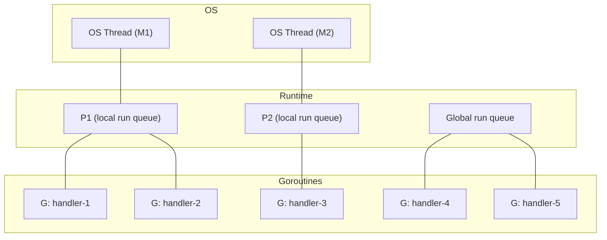

# 7 - Goroutines and Channels

[toc]

> **TL;DR:** Goroutines are Go's unit of concurrency — lightweight (starting at ~2 KB stack), multiplexed onto OS threads by an M:N scheduler built into the runtime. Channels are typed conduits for communication between goroutines; they embody the CSP principle "do not communicate by sharing memory; instead, share memory by communicating." Together, goroutines and channels make it practical to have hundreds of thousands of concurrent units in a single process, with communication patterns (fan-out, fan-in, pipeline, worker pool) as first-class code.

## Vocabulary

**Goroutine**: A cooperatively/preemptively scheduled lightweight thread managed by the Go runtime. Starts with a small (~2 KB) growable stack. Not a 1:1 OS thread.

---

**M:N scheduling**: Go's scheduler multiplexes M goroutines onto N OS threads (where N ≤ GOMAXPROCS). The scheduler performs cooperative preemption (at function call points and loop back-edges since Go 1.14).

---

**GOMAXPROCS**: The number of OS threads that can run Go code simultaneously. Default: number of logical CPUs. Set via `runtime.GOMAXPROCS(n)` or the `GOMAXPROCS` env var.

---

**Channel (`chan T`)**: A typed, goroutine-safe conduit for values of type `T`. Created with `make`. Can be unbuffered (synchronous rendezvous) or buffered (asynchronous up to capacity).

---

**Unbuffered channel**: A send blocks until a receiver is ready; a receive blocks until a sender is ready. Guarantees synchronisation at every exchange.

---

**Buffered channel**: Has a capacity; sends do not block until the buffer is full. Receives do not block until the buffer is empty.

---

**`close(ch)`**: Signals no more values will be sent. Receives from a closed channel drain remaining buffered values then return the zero value with `ok=false`. Sending to a closed channel panics.

---

**`select`**: A statement that waits on multiple channel operations simultaneously, executing whichever case is ready. If multiple cases are ready, one is chosen uniformly at random.

---

**Pipeline**: A series of stages connected by channels; each stage receives from an upstream channel, transforms, and sends to a downstream channel.

---

**Fan-out / Fan-in**: Fan-out distributes work from one channel to multiple goroutines. Fan-in collects results from multiple channels into one.

---

## Intuition

Think of goroutines as very cheap coroutines. The Go runtime manages a pool of OS threads and schedules goroutines onto them. Starting a goroutine costs roughly the price of allocating a 2 KB stack — orders of magnitude cheaper than starting an OS thread (which typically costs ~64 KB–8 MB of stack and a kernel context switch). A production Go server routinely runs 100,000–1,000,000 goroutines.

Channels are typed message queues between goroutines. An unbuffered channel is a synchronisation point: both sender and receiver must be present simultaneously, like a handshake. A buffered channel is a queue with a fixed capacity: senders write to the buffer asynchronously until it is full, and receivers drain it independently. The mental model: unbuffered = telephone call (both parties must be present); buffered = email inbox (sender leaves a message, receiver reads when ready).

## Goroutine Internals — The M:N Scheduler

The Go runtime scheduler is a three-layer system: M (machine = OS thread), P (processor = scheduling context), G (goroutine).



Each P holds a local run queue of goroutines and is bound to one M at a time. When a goroutine blocks on a syscall or channel operation, its P is "stolen" by another M. When the syscall completes, the goroutine is placed back in a run queue. Work-stealing: if P1's queue is empty, P1 steals goroutines from P2's queue or the global queue.

> [!NOTE]
> Since Go 1.14, goroutines can be preempted at any safe point (function call preamble, loop back-edge). Before 1.14, a tight loop with no function calls could monopolise its OS thread and starve other goroutines. The preemption is signal-based: the runtime sends SIGURG to a thread, which causes the scheduler to check and potentially reschedule.

## Starting Goroutines

Any function call prefixed with `go` launches the call in a new goroutine. The `go` statement does not block; it returns immediately. Goroutine arguments are evaluated synchronously in the launching goroutine.

```go
package main

import (
	"fmt"
	"time"
)

func count(label string, n int) {
	for i := 0; i < n; i++ {
		fmt.Printf("%s: %d\n", label, i)
		time.Sleep(10 * time.Millisecond)
	}
}

func main() {
	go count("goroutine", 3)   // launch concurrently
	count("main", 3)            // run in main goroutine
	// main goroutine exits here; if "goroutine" hasn't finished, it's killed.
}
```

> [!WARNING]
> When `main()` returns, the program exits and all goroutines are killed, regardless of whether they have finished. Use `sync.WaitGroup` or a channel to wait for goroutines before returning from `main`. This is the most common beginner concurrency mistake.

## Channels

### Creating and Using Channels

```go
// Unbuffered channel — send and receive must rendezvous
ch := make(chan int)

// Buffered channel — holds up to 3 values before blocking sender
bch := make(chan string, 3)

// Send (blocks until receiver ready for unbuffered)
ch <- 42

// Receive (blocks until sender sends for unbuffered)
val := <-ch

// Receive with presence check (comma-ok)
val, ok := <-ch
if !ok {
    fmt.Println("channel closed")
}

// Range over channel — stops when channel is closed and drained
for v := range ch {
    fmt.Println(v)
}
```

### Directional Channel Types

Channels can be typed as send-only or receive-only. This is used in function signatures to document and enforce intent:

```go
// producer sends ints on the returned channel.
func producer(n int) <-chan int {   // returns receive-only channel
    ch := make(chan int)
    go func() {
        defer close(ch)
        for i := 0; i < n; i++ {
            ch <- i
        }
    }()
    return ch
}

// consumer reads from a receive-only channel.
func consumer(ch <-chan int) {
    for v := range ch {
        fmt.Println(v)
    }
}
```

> [!IMPORTANT]
> Only the goroutine that creates a channel should close it. The receiver should never close the channel — a close from the wrong side is a race condition. The pattern: the producer closes the channel when it has no more values to send; the consumer ranges over the channel and naturally exits when it is closed.

## `select` — Multiplex Channel Operations

`select` waits on multiple channel operations simultaneously. The first case that is ready executes; if multiple are ready, one is chosen uniformly at random. A `default` case runs immediately if no other case is ready (making the select non-blocking).

```go
func main() {
    ch1 := make(chan string, 1)
    ch2 := make(chan string, 1)
    ch1 <- "one"
    ch2 <- "two"

    for i := 0; i < 2; i++ {
        select {
        case msg := <-ch1:
            fmt.Println("ch1:", msg)
        case msg := <-ch2:
            fmt.Println("ch2:", msg)
        }
    }
}
// Output order is random between "ch1: one" and "ch2: two"

// Non-blocking try-send:
select {
case ch <- value:
    // sent successfully
default:
    // channel full or no receiver — drop or handle
}
```

## Concurrency Patterns

### Pipeline

A pipeline is a series of stages. Each stage is a goroutine that reads from one channel, processes, and writes to another. The stages are independent and run concurrently.

```go
// square receives ints from in and sends their squares to out.
func square(in <-chan int) <-chan int {
    out := make(chan int)
    go func() {
        defer close(out)
        for v := range in {
            out <- v * v
        }
    }()
    return out
}

// gen sends the provided integers on a new channel.
func gen(nums ...int) <-chan int {
    out := make(chan int)
    go func() {
        defer close(out)
        for _, n := range nums {
            out <- n
        }
    }()
    return out
}

func main() {
    c := gen(2, 3, 4)
    out := square(c)
    for v := range out {
        fmt.Println(v)  // 4, 9, 16
    }
}
```

### Fan-Out / Fan-In

Fan-out: one input channel, multiple worker goroutines each reading from it. Fan-in: merge multiple output channels into one.

```go
import "sync"

// fanOut distributes jobs from jobs to n worker goroutines,
// each applying fn. Returns a channel of results.
func fanOut(jobs <-chan int, n int, fn func(int) int) <-chan int {
    results := make(chan int)
    var wg sync.WaitGroup
    for i := 0; i < n; i++ {
        wg.Add(1)
        go func() {
            defer wg.Done()
            for j := range jobs {
                results <- fn(j)
            }
        }()
    }
    // Close results when all workers are done.
    go func() {
        wg.Wait()
        close(results)
    }()
    return results
}
```

### Worker Pool

A worker pool is the canonical pattern for bounded concurrency: a fixed number of goroutines drain a jobs channel.

```go
package main

import (
	"fmt"
	"sync"
)

// WorkerPool processes jobs using n concurrent workers.
// Each job is an integer; the worker computes its square.
func WorkerPool(jobs []int, n int) []int {
	jobCh := make(chan int, len(jobs))
	resCh := make(chan int, len(jobs))

	// Launch n workers.
	var wg sync.WaitGroup
	for i := 0; i < n; i++ {
		wg.Add(1)
		go func() {
			defer wg.Done()
			for j := range jobCh {
				resCh <- j * j
			}
		}()
	}

	// Send all jobs.
	for _, j := range jobs {
		jobCh <- j
	}
	close(jobCh) // signal workers no more jobs

	// Wait for all workers to finish, then close results.
	go func() {
		wg.Wait()
		close(resCh)
	}()

	// Collect results.
	var results []int
	for r := range resCh {
		results = append(results, r)
	}
	return results
}

func main() {
	results := WorkerPool([]int{1, 2, 3, 4, 5}, 3)
	fmt.Println(results) // [1 4 9 16 25] in some order
}
```

> [!TIP]
> Pre-size both `jobCh` and `resCh` with `make(chan int, len(jobs))` when you know the total job count. This prevents the main goroutine from blocking while sending all jobs and prevents the workers from blocking while sending results. For streaming (unknown job count), use unbuffered channels and a WaitGroup to synchronise.

## `for range` on Channels

`for v := range ch` reads from `ch` until the channel is closed and drained. This is the idiomatic way to consume an entire channel:

```go
for result := range results {
    process(result)
}
// continues until results is closed
```

If the channel is never closed, `for range` blocks forever (a goroutine leak). Always ensure the sender closes the channel.

## Real-world Example

A rate-limited batch processor using a ticker channel and a worker pool — a realistic pattern in data pipelines and background job systems.

```go
package main

import (
	"fmt"
	"sync"
	"time"
)

// Job represents a unit of work.
type Job struct {
	ID   int
	Data string
}

// process simulates processing a job (stub).
func process(j Job) string {
	return fmt.Sprintf("processed job %d: %s", j.ID, j.Data)
}

// RateLimitedProcessor processes jobs with a ticker-based rate limit
// using a fixed pool of workers.
func RateLimitedProcessor(jobs []Job, workers int, rate time.Duration) []string {
	ticker := time.NewTicker(rate)
	defer ticker.Stop()

	jobCh := make(chan Job, workers)
	resCh := make(chan string, len(jobs))
	var wg sync.WaitGroup

	// Start workers.
	for i := 0; i < workers; i++ {
		wg.Add(1)
		go func() {
			defer wg.Done()
			for j := range jobCh {
				resCh <- process(j)
			}
		}()
	}

	// Rate-limited dispatch: send one job per tick.
	go func() {
		for _, j := range jobs {
			<-ticker.C   // wait for tick before sending next job
			jobCh <- j
		}
		close(jobCh)
		wg.Wait()
		close(resCh)
	}()

	var results []string
	for r := range resCh {
		results = append(results, r)
	}
	return results
}

func main() {
	jobs := []Job{{1, "a"}, {2, "b"}, {3, "c"}}
	results := RateLimitedProcessor(jobs, 2, 50*time.Millisecond)
	for _, r := range results {
		fmt.Println(r)
	}
}
```

## In Practice

**Goroutine leaks** are the most common production concurrency bug in Go. A goroutine blocked on a channel receive that will never arrive stays alive forever, holding all its captured variables. In long-running services, leaked goroutines accumulate and gradually exhaust memory. Always ensure every goroutine has a termination path — either the channel it blocks on will eventually be closed or receive a signal, or it responds to context cancellation (see [8 - Concurrency Patterns](./8-concurrency-patterns.md)).

The `goleak` library (`go.uber.org/goleak`) detects goroutine leaks in tests by comparing the goroutine count before and after a test.

> [!WARNING]
> Never send to or close a nil channel. A send or receive on a nil channel blocks forever; closing a nil channel panics. Nil channels are intentionally useful in `select` — a nil channel case is never selected, effectively disabling that case at runtime.

> [!TIP]
> Use `runtime.NumGoroutine()` in health checks to expose the live goroutine count as a metric. A monotonically increasing count in a steady-state service indicates a goroutine leak. Expose it as a Prometheus gauge: `promauto.NewGaugeFunc(...)` calling `float64(runtime.NumGoroutine())`.

## Pitfalls

- **"Goroutines are threads — use them sparingly."** — Goroutines are not OS threads. Starting 100,000 goroutines is normal. The bottleneck is not goroutine count but contention on shared resources.
- **"Channel operations are always fast."** — Channel operations involve lock acquisition on the channel's internal mutex, possible goroutine parking, and scheduler involvement. For very high-throughput (millions of ops/sec) paths, direct mutex or atomic operations can be faster.
- **"Closing a channel is always the sender's job."** — Yes, with the corollary that there should be exactly one writer (or a coordinating wrapper that closes on behalf of multiple writers). Multiple senders closing the same channel causes a panic.
- **"A goroutine that panics kills only itself."** — No. An unrecovered panic in any goroutine kills the entire program. Put `defer recover()` wrappers on every long-lived goroutine.
- **"`for range ch` handles channel closing automatically."** — Only if the sender closes the channel. If the sender never closes it, `range` blocks forever. A goroutine leak.

## Exercises

### Exercise 1 — Conceptual: What is the difference between unbuffered and buffered channels for synchronisation?

#### Solution

An unbuffered channel (`make(chan T)`) is a synchronisation point: the sender blocks until a receiver is ready, and the receiver blocks until a sender is ready. Every exchange is a rendezvous — both parties must be present simultaneously. This provides the strongest synchronisation guarantee: after a send returns, you know the receiver has the value.

A buffered channel (`make(chan T, n)`) decouples sender and receiver. The sender can proceed without waiting for a receiver as long as the buffer has capacity; the receiver can proceed without waiting for a sender as long as the buffer is non-empty. The synchronisation guarantee is weaker: after a send returns, you know the value is in the buffer, but the receiver may not have processed it yet.

Use unbuffered when: you need confirmation the work was handed off (handshake semantics), or you are implementing a semaphore. Use buffered when: you want to absorb bursts without blocking the sender, or you are implementing a bounded work queue.

---

### Exercise 2 — Implementation: Write a timeout wrapper for a channel receive

Write a function that receives from a channel but returns an error if the receive takes longer than the given duration.

#### Solution

```go
package main

import (
	"fmt"
	"time"
)

// receiveWithTimeout receives one value from ch.
// Returns the value and nil on success.
// Returns zero value and error if the timeout expires first.
func receiveWithTimeout[T any](ch <-chan T, timeout time.Duration) (T, error) {
	select {
	case v := <-ch:
		return v, nil
	case <-time.After(timeout):
		var zero T
		return zero, fmt.Errorf("receive timed out after %v", timeout)
	}
}

func main() {
	ch := make(chan int)

	go func() {
		time.Sleep(100 * time.Millisecond)
		ch <- 42
	}()

	// This will timeout:
	v, err := receiveWithTimeout(ch, 50*time.Millisecond)
	fmt.Println(v, err) // 0 receive timed out after 50ms

	// This will succeed:
	v2, err2 := receiveWithTimeout(ch, 200*time.Millisecond)
	fmt.Println(v2, err2) // 42 <nil>
}
```

`select` with `time.After` is the idiomatic Go timeout. In production, prefer `context.WithTimeout` over `time.After` for proper propagation — see [8 - Concurrency Patterns](./8-concurrency-patterns.md).

---

### Exercise 3 — Bug finding: Why does this program deadlock?

```go
func main() {
    ch := make(chan int)
    ch <- 1       // send
    val := <-ch   // receive
    fmt.Println(val)
}
```

#### Solution

`ch` is an unbuffered channel. `ch <- 1` blocks until a receiver is ready. The receive `<-ch` is on the next line — but because the send never completes, the receive is never reached. Both operations are in the same goroutine, so neither can proceed. The runtime detects this as a deadlock (all goroutines are blocked) and panics:

```
fatal error: all goroutines are asleep - deadlock!
```

Fix: either make the channel buffered (`make(chan int, 1)`) so the send does not block, or put the send in a goroutine:

```go
ch := make(chan int)
go func() { ch <- 1 }()  // send in goroutine
val := <-ch               // receive in main goroutine — they rendezvous
fmt.Println(val)           // 1
```

---

### Exercise 4 — Implementation: Implement a simple semaphore using a buffered channel

A semaphore allows at most N concurrent operations. Implement one using a buffered channel.

#### Solution

```go
package main

import (
	"fmt"
	"sync"
	"time"
)

// Semaphore limits the number of concurrent operations using a buffered channel.
type Semaphore chan struct{}

// NewSemaphore creates a semaphore with the given capacity.
func NewSemaphore(n int) Semaphore {
	return make(Semaphore, n)
}

// Acquire acquires one slot (blocks if the semaphore is full).
func (s Semaphore) Acquire() { s <- struct{}{} }

// Release releases one slot.
func (s Semaphore) Release() { <-s }

func main() {
	sem := NewSemaphore(3) // at most 3 concurrent workers
	var wg sync.WaitGroup

	for i := 0; i < 10; i++ {
		wg.Add(1)
		go func(id int) {
			defer wg.Done()
			sem.Acquire()
			defer sem.Release()
			fmt.Printf("worker %d running\n", id)
			time.Sleep(50 * time.Millisecond)
		}(i)
	}

	wg.Wait()
	fmt.Println("all done")
}
```

The buffered channel holds `n` empty structs. `Acquire` sends one (blocks when full); `Release` receives one (making room). At most `n` goroutines can be between `Acquire` and `Release` at any time.

## Sources

- The Go Specification — Go statements: https://go.dev/ref/spec#Go_statements
- The Go Specification — Channel types: https://go.dev/ref/spec#Channel_types
- The Go Blog — Concurrency is not Parallelism (Rob Pike): https://go.dev/blog/waza-talk
- The Go Blog — Go Concurrency Patterns: https://go.dev/talks/2012/concurrency.slide
- The Go Blog — Advanced Go Concurrency Patterns: https://go.dev/talks/2013/advconc.slide
- The Go Programming Language (Donovan & Kernighan) — Chapter 8 (Goroutines and Channels).
- Go scheduler design doc: https://go.dev/src/runtime/HACKING.md

## Related

- [4 - Functions, Closures, and Methods](./4-functions-closures-methods.md)
- [8 - Concurrency Patterns and the Race Detector](./8-concurrency-patterns.md)
- [9 - Memory Management and the GC](./9-memory-management-gc.md)
- [12 - Building Production Services in Go](./12-building-production-services.md)
