# 8 - Concurrency Patterns and the Race Detector

[toc]

> **TL;DR:** Go's `sync` package provides Mutex, RWMutex, WaitGroup, Once, and Pool for shared-state concurrency; the `sync/atomic` package provides lock-free primitives for single-word reads and writes. `context` propagates cancellation, deadlines, and request-scoped values across goroutine trees. The race detector (`go test -race`) instruments all memory accesses at compile time and reports data races at runtime — it is the single most effective tool for finding concurrency bugs, and it should run in every CI pipeline.

## Vocabulary

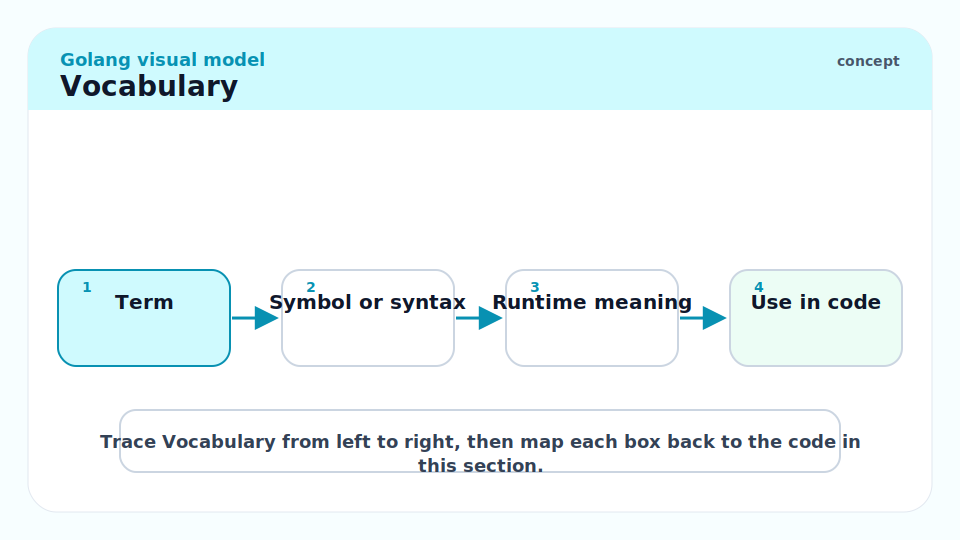

**`sync.Mutex`**: A mutual exclusion lock. `Lock()` acquires; `Unlock()` releases. At most one goroutine holds the lock at a time. Not re-entrant (a goroutine that calls `Lock` twice deadlocks).

---

**`sync.RWMutex`**: A reader/writer lock. Multiple goroutines can hold the read lock simultaneously (`RLock`/`RUnlock`). Only one goroutine can hold the write lock (`Lock`/`Unlock`), and it excludes all readers.

---

**`sync.WaitGroup`**: A counter for outstanding goroutines. `Add(n)` increments the counter; `Done()` decrements; `Wait()` blocks until the counter reaches zero.

---

**`sync.Once`**: Guarantees a function is called exactly once, regardless of how many goroutines call `Do` simultaneously. Subsequent calls to `Do` return without calling the function.

---

**`sync.Pool`**: A cache of temporary objects to reduce GC pressure. Objects in the pool may be evicted at any GC cycle. Not a free list for long-lived objects.

---

**`sync/atomic`**: Lock-free atomic operations on integer and pointer types. Use for single-word reads/writes where a mutex would be overkill (e.g., a counter, a flag).

---

**`context.Context`**: An interface carrying a cancellation signal, a deadline, and a bag of request-scoped key-value pairs. Passed as the first argument to functions that do I/O or call external services.

---

**Data race**: A condition where two goroutines access the same memory location concurrently and at least one access is a write, with no synchronisation between them. Produces undefined behaviour; the race detector catches it.

---

**Race detector**: A compiler/runtime instrumentation pass enabled by `-race`. Instruments every memory access and reports races (location, goroutine ID, stack trace) when two unordered accesses conflict.

---

## Intuition

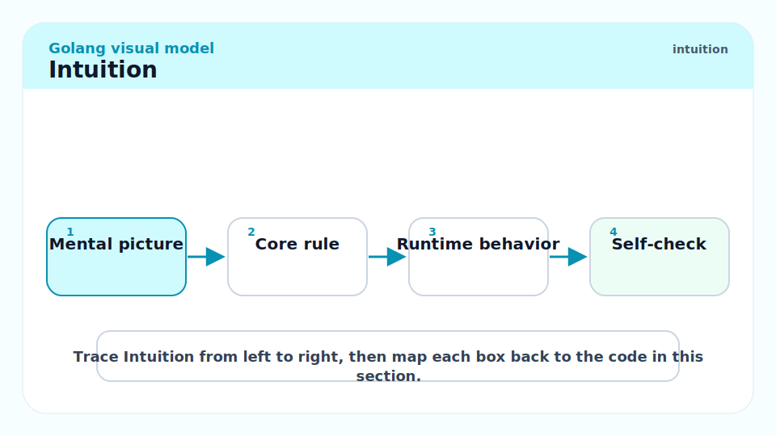

Go channels are perfect for communicating values between goroutines. But many programs need *shared state* — a cache, a counter, a rate limiter, a connection pool — where multiple goroutines read and write the same data structure. For these cases, traditional locks are the right tool. The `sync` package provides them in a minimal, idiomatic form.

`context` solves a different problem: when a tree of goroutines is doing work on behalf of a request, how do you tell them all to stop? Passing a channel for cancellation works, but you also need deadlines and request metadata. `context.Context` unifies all three under one interface, and its cancellation signal propagates automatically to every child context.

## `sync.Mutex` and `sync.RWMutex`

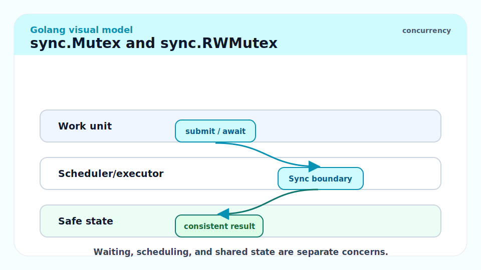

### Mutex — Exclusive Locking

A `sync.Mutex` protects shared state by allowing only one goroutine to hold the lock at a time. The canonical pattern is `Lock()` immediately followed by `defer Unlock()`.

```go
package main

import (
	"fmt"
	"sync"
)

// SafeCounter is a goroutine-safe counter.
type SafeCounter struct {
	mu    sync.Mutex
	value int
}

// Increment atomically increments the counter.
func (c *SafeCounter) Increment() {
	c.mu.Lock()
	defer c.mu.Unlock()
	c.value++
}

// Value returns the current counter value.
func (c *SafeCounter) Value() int {
	c.mu.Lock()
	defer c.mu.Unlock()
	return c.value
}

func main() {
	var c SafeCounter
	var wg sync.WaitGroup
	for i := 0; i < 1000; i++ {
		wg.Add(1)
		go func() {
			defer wg.Done()
			c.Increment()
		}()
	}
	wg.Wait()
	fmt.Println(c.Value()) // always 1000
}
```

> [!IMPORTANT]
> `sync.Mutex` must NOT be copied after first use. The mutex contains internal state; copying it copies that state and breaks the lock invariant. If you embed a `sync.Mutex` in a struct, always pass the struct by pointer (`*MyStruct`), never by value. `go vet` checks for mutex copying.

### RWMutex — Read-Heavy Workloads

`sync.RWMutex` allows concurrent readers. Use it when reads vastly outnumber writes and reads are relatively slow (so the lock contention savings are worth it).

```go
// Cache is a goroutine-safe in-memory key-value store.
type Cache struct {
	mu    sync.RWMutex
	store map[string]string
}

// Get reads a value. Multiple goroutines can Get simultaneously.
func (c *Cache) Get(key string) (string, bool) {
	c.mu.RLock()
	defer c.mu.RUnlock()
	v, ok := c.store[key]
	return v, ok
}

// Set writes a value. Excludes all readers and other writers.
func (c *Cache) Set(key, value string) {
	c.mu.Lock()
	defer c.mu.Unlock()
	if c.store == nil {
		c.store = make(map[string]string)
	}
	c.store[key] = value
}
```

## `sync.WaitGroup`

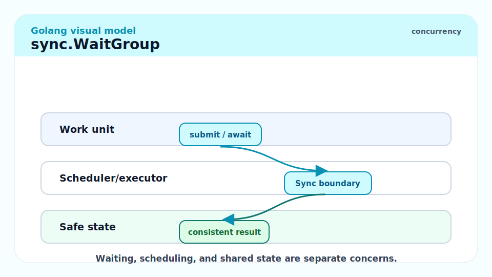

`WaitGroup` is the standard way to wait for a batch of goroutines to finish. The pattern is always `Add` before launching the goroutine, `Done` (via `defer`) inside the goroutine, and `Wait` after all goroutines have been launched.

```go
var wg sync.WaitGroup
for _, url := range urls {
    wg.Add(1)
    go func(u string) {
        defer wg.Done()
        fetch(u)
    }(url)
}
wg.Wait()
```

> [!WARNING]
> Call `wg.Add(1)` BEFORE launching the goroutine, not inside it. If you call `Add` inside the goroutine, `Wait` might return before `Add` is ever called, making the WaitGroup useless. Also, `Add` must not be called concurrently with `Wait` if the counter is at zero — that is a race.

## `sync.Once`

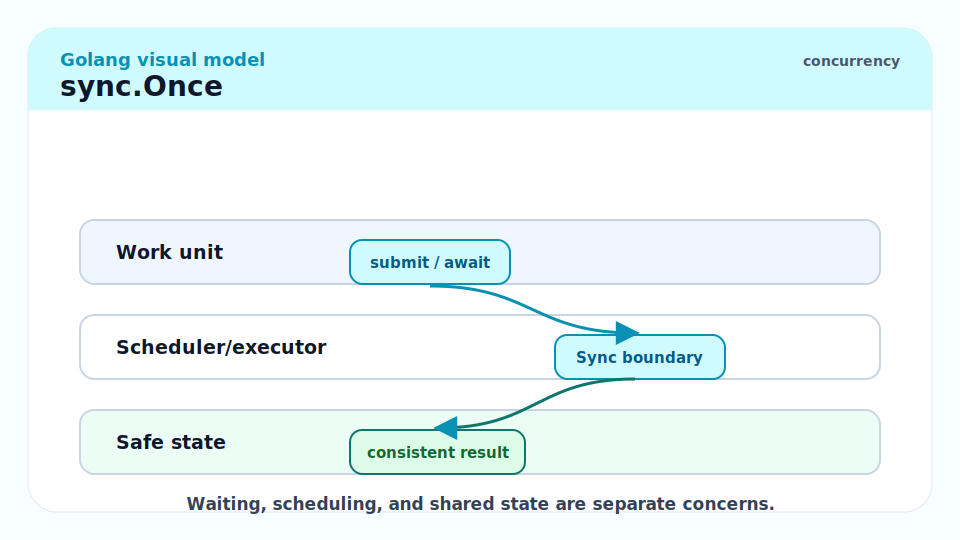

`Once` is the idiomatic Go singleton / lazy-init pattern. The function passed to `Do` runs exactly once, even if multiple goroutines call `Do` concurrently.

```go
var (
	dbOnce sync.Once
	db     *sql.DB
)

// InitDB initialises the global database connection exactly once.
// Safe to call from multiple goroutines.
func InitDB(dsn string) {
	dbOnce.Do(func() {
		var err error
		db, err = sql.Open("postgres", dsn)
		if err != nil {
			panic(fmt.Sprintf("InitDB: %v", err))  // startup invariant
		}
	})
}
```

> [!NOTE]
> If the function passed to `Once.Do` panics, the `Once` is considered done — future calls to `Do` will not call the function again. The panic propagates to the calling goroutine. If you need retry semantics on failure, `sync.Once` is not the right tool; use a mutex with a separate `initialized bool` flag.

## `sync/atomic`

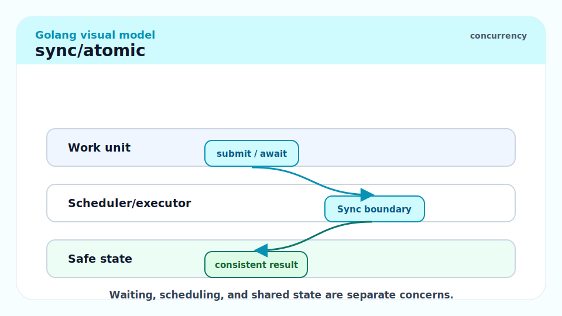

Atomic operations are lock-free and operate on a single memory word. They are useful for high-frequency counters and flags where a full mutex would cause contention.

```go
import "sync/atomic"

var requestCount int64

// IncrementRequests atomically increments the request counter.
func IncrementRequests() {
	atomic.AddInt64(&requestCount, 1)
}

// RequestCount returns the current request count.
func RequestCount() int64 {
	return atomic.LoadInt64(&requestCount)
}
```

Go 1.19 added `atomic.Int64`, `atomic.Uint64`, `atomic.Bool`, and `atomic.Pointer[T]` as generic struct types with methods, avoiding the need to pass addresses explicitly:

```go
var count atomic.Int64
count.Add(1)
fmt.Println(count.Load())  // 1
```

> [!WARNING]
> Atomic operations are NOT a substitute for a mutex when you need to update multiple related values atomically. `atomic.AddInt64(&a, 1); atomic.AddInt64(&b, 1)` is not an atomic transaction — another goroutine can observe `a` incremented but `b` not yet incremented. Use a mutex when invariants span multiple variables.

## `context.Context`

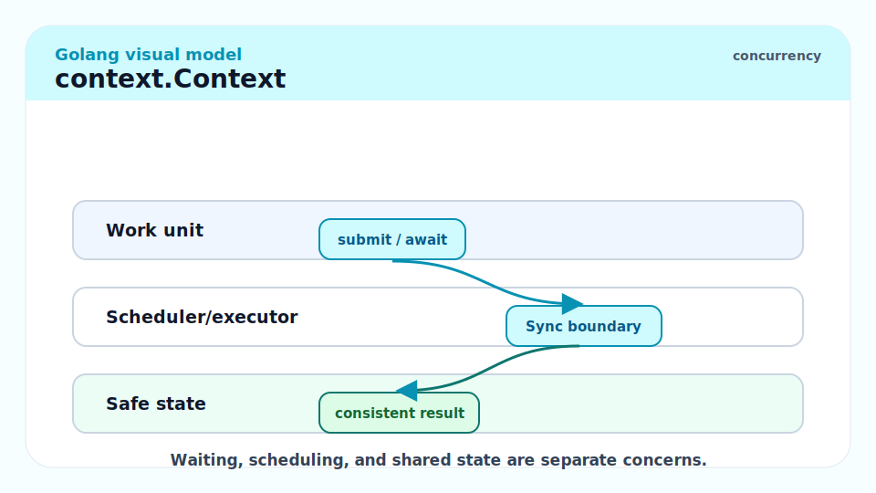

`context.Context` is the mechanism for propagating cancellation, deadlines, and request-scoped values through a call tree. Pass `ctx` as the first argument to every function that may block on I/O.

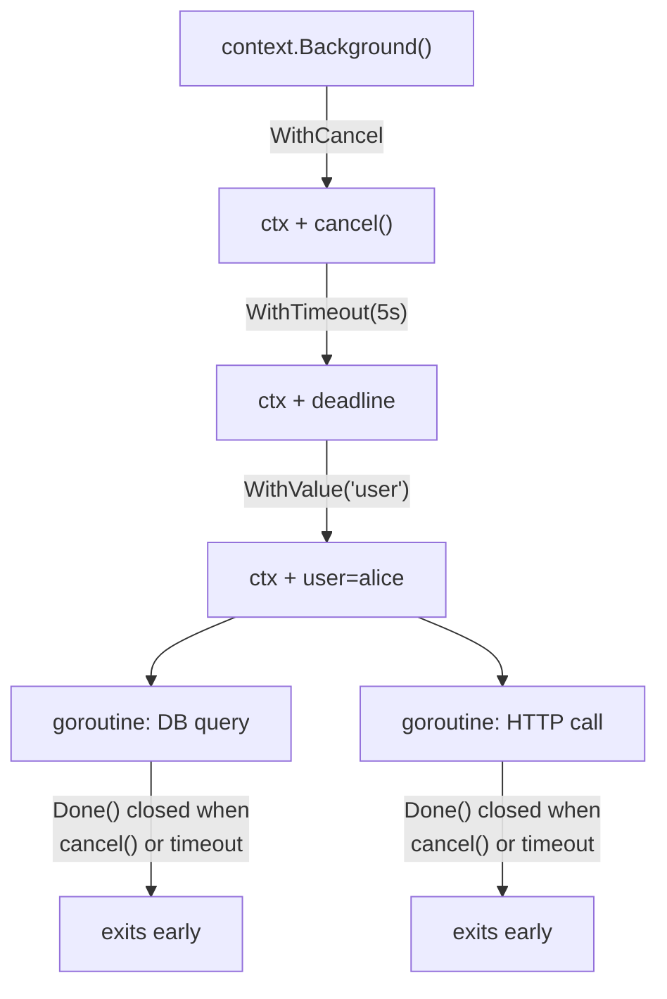

### Creating Contexts

```go
import (
    "context"
    "time"
)

// Background is the root — used in main, tests, and top-level request handlers.
ctx := context.Background()

// WithCancel — manual cancellation
ctx, cancel := context.WithCancel(ctx)
defer cancel()  // always defer cancel to release resources

// WithTimeout — cancels after duration
ctx, cancel := context.WithTimeout(ctx, 5*time.Second)
defer cancel()

// WithDeadline — cancels at an absolute time
deadline := time.Now().Add(5 * time.Second)
ctx, cancel := context.WithDeadline(ctx, deadline)
defer cancel()

// WithValue — attach request-scoped key-value data
type ctxKey string
ctx = context.WithValue(ctx, ctxKey("userID"), "alice")
```

### Responding to Context Cancellation

```go
func doWork(ctx context.Context, ch <-chan Job) error {
    for {
        select {
        case <-ctx.Done():
            return ctx.Err()   // context.DeadlineExceeded or context.Canceled
        case job, ok := <-ch:
            if !ok {
                return nil  // channel closed, done
            }
            if err := processJob(ctx, job); err != nil {
                return err
            }
        }
    }
}
```

> [!IMPORTANT]
> Always `defer cancel()` immediately after creating a context with `WithCancel`, `WithTimeout`, or `WithDeadline`. Forgetting to call `cancel` leaks the context's resources — the context propagation tree remains in memory until the parent is cancelled. Even if the context expires naturally, calling `cancel` early is free and good practice.

### Context Values

`context.WithValue` is for request-scoped data that crosses API boundaries: trace IDs, authenticated users, database transactions. It is NOT for optional function parameters.

```go
type contextKey string

const keyRequestID contextKey = "requestID"

// WithRequestID attaches a request ID to the context.
func WithRequestID(ctx context.Context, id string) context.Context {
    return context.WithValue(ctx, keyRequestID, id)
}

// RequestID retrieves the request ID from ctx, or "" if not set.
func RequestID(ctx context.Context) string {
    id, _ := ctx.Value(keyRequestID).(string)
    return id
}
```

Use an unexported type (`contextKey`) for the key to prevent collisions between packages.

## The Race Detector

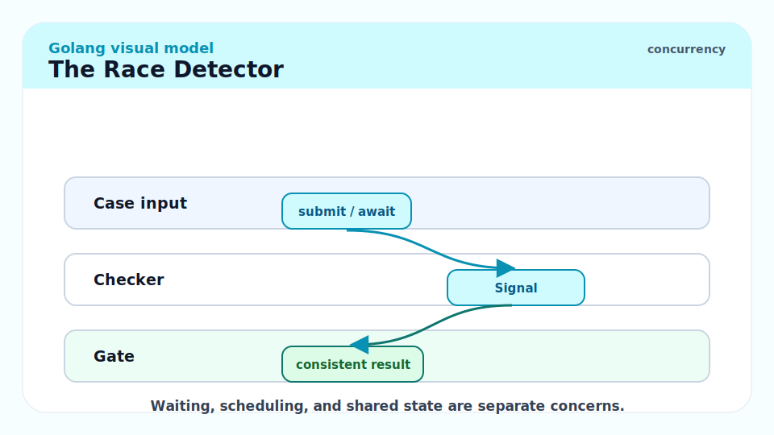

The race detector is enabled by passing `-race` to `go build`, `go run`, or `go test`. It instruments every memory access (read and write) and records the goroutine that performed it along with the logical clock (happens-before relationship). When two accesses to the same memory location are unordered (no synchronisation between them) and at least one is a write, it reports a race.

```bash
go test -race ./...
go run -race main.go
```

A race report looks like:

```
==================
WARNING: DATA RACE
Write at 0x00c0000b8000 by goroutine 7:
  main.(*Counter).Increment()
      /app/counter.go:12 +0x44

Previous read at 0x00c0000b8000 by goroutine 6:
  main.(*Counter).Value()
      /app/counter.go:18 +0x38
==================
```

The report gives you the two conflicting access locations and their goroutine stacks.

> [!CAUTION]
> The race detector adds approximately 5–10x memory overhead and 2–20x CPU overhead. Never run it in production on latency-sensitive services. Run it in CI on every test suite. The Go team's policy: ship with `-race` in staging, not prod. Some orgs run a "race canary" replica in staging with `-race` enabled to catch races in realistic traffic.

### Common Race Patterns Detected

```go
// Pattern 1: shared map without mutex (detected)
results := map[string]int{}
go func() { results["a"]++ }()
go func() { results["b"]++ }()

// Pattern 2: loop variable capture (pre-1.22)
for i := 0; i < 3; i++ {
    go func() { fmt.Println(i) }()  // all read i; loop writes i — race
}

// Pattern 3: unsynchronised flag
var done bool
go func() { done = true }()
for !done {}  // spin-read of done — race
// Fix: use atomic.Bool or a channel
```

## Real-world Example

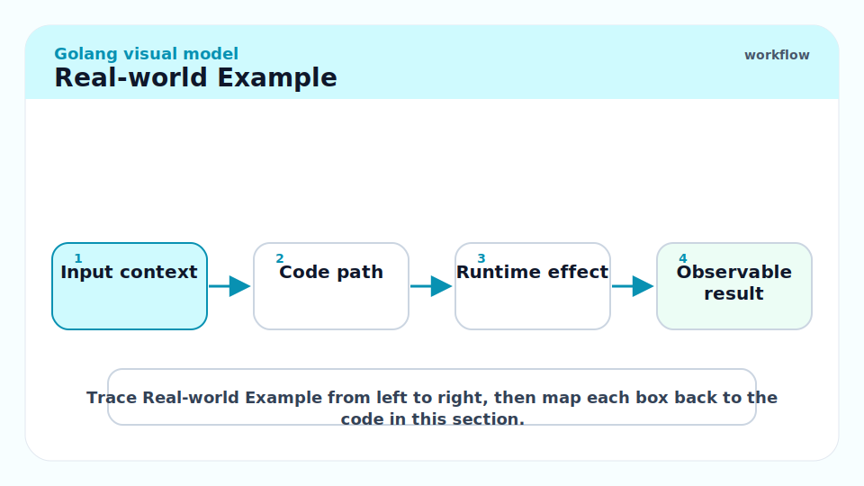

A rate limiter using a token bucket implemented with atomics and a ticker goroutine:

```go
package main

import (
	"fmt"
	"sync/atomic"
	"time"
)

// TokenBucket is a simple token bucket rate limiter.
type TokenBucket struct {
	tokens   atomic.Int64
	capacity int64
}

// NewTokenBucket creates a rate limiter with the given capacity,
// refilling at rate tokens/second.
func NewTokenBucket(capacity int64, refillRate time.Duration) *TokenBucket {
	tb := &TokenBucket{capacity: capacity}
	tb.tokens.Store(capacity)

	go func() {
		ticker := time.NewTicker(refillRate)
		defer ticker.Stop()
		for range ticker.C {
			for {
				old := tb.tokens.Load()
				if old >= capacity {
					break
				}
				if tb.tokens.CompareAndSwap(old, old+1) {
					break
				}
			}
		}
	}()
	return tb
}

// Allow returns true if a token is available and consumes it.
func (tb *TokenBucket) Allow() bool {
	for {
		old := tb.tokens.Load()
		if old <= 0 {
			return false
		}
		if tb.tokens.CompareAndSwap(old, old-1) {
			return true
		}
	}
}

func main() {
	limiter := NewTokenBucket(5, 100*time.Millisecond)
	for i := 0; i < 8; i++ {
		fmt.Printf("request %d: allowed=%v\n", i, limiter.Allow())
	}
}
// request 0: allowed=true  (5 tokens → 4)
// request 1: allowed=true  (4 → 3)
// ...
// request 5: allowed=false (0 tokens)
```

> [!TIP]
> `CompareAndSwap` (CAS) is the fundamental lock-free primitive: "atomically set the value to new if it currently equals old." Looping on CAS is a spinlock, appropriate when contention is low and the critical section is tiny. Under high contention, a mutex is more efficient because it puts the goroutine to sleep instead of spinning.

## In Practice

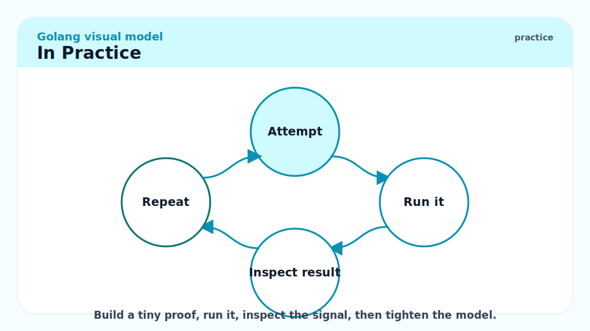

**Prefer channels for ownership transfer; prefer mutexes for shared state.** When a goroutine passes a value to another and stops using it, a channel is clean. When multiple goroutines need concurrent access to a cache or counter, a mutex is simpler.

**`sync.Pool` reduces GC pressure.** For short-lived objects allocated at high frequency (request buffers, JSON encoders), putting them in a `Pool` and `Get`ting them instead of allocating reduces the number of objects the GC must scan. The pool is per-P (per scheduler processor), so there is minimal contention.

```go
var bufPool = sync.Pool{
    New: func() any { return new(bytes.Buffer) },
}

func handleRequest(data []byte) {
    buf := bufPool.Get().(*bytes.Buffer)
    defer func() {
        buf.Reset()
        bufPool.Put(buf)
    }()
    buf.Write(data)
    // use buf ...
}
```

> [!WARNING]
> Objects retrieved from `sync.Pool` may be stale — another goroutine may have used them before. Always `Reset()` or re-initialise before use. And never store pointers to values that must outlive the pool — the GC can evict pool contents at any cycle.

## Pitfalls

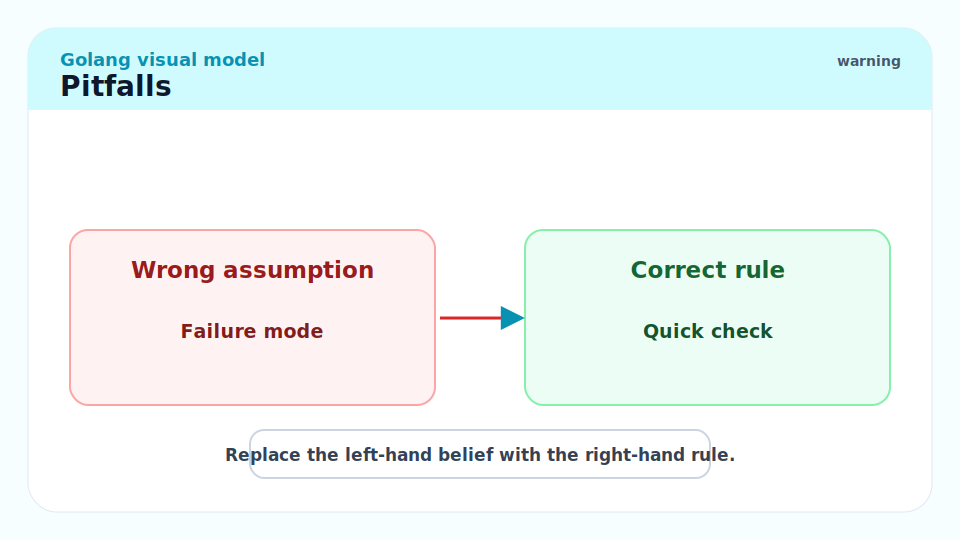

- **"Mutexes are slow; use atomics everywhere."** — Atomics are fast for single variables. For invariants across multiple variables, atomics cannot help. Use the right tool for the scope of the invariant.
- **"`sync.WaitGroup` can be called from anywhere."** — `Add` must be called before `Wait` when the counter is at zero. Calling `Add` after `Wait` returns (or races with its return) is a data race.
- **"Context values are a map — use them for all configuration."** — Context values are for request-scoped data that must cross API boundaries (trace IDs, auth tokens). Function parameters should be explicit for non-request-scoped config. Overloading context with configuration couples your functions to context in a way that makes them hard to test.
- **"The race detector guarantees my code is race-free after a clean run."** — The race detector finds races in code paths actually executed. A clean run proves those paths were race-free; it does not prove all paths are. Achieve high coverage with `-race` to maximise confidence.
- **"A goroutine reading a variable set before it was launched does not need synchronisation."** — This is a "happens-before" question. The Go memory model guarantees the goroutine creation (the `go` statement) happens before the goroutine's first execution. Variables written before `go f()` are visible inside `f`. But concurrent reads/writes after the goroutine starts still require synchronisation.

## Exercises

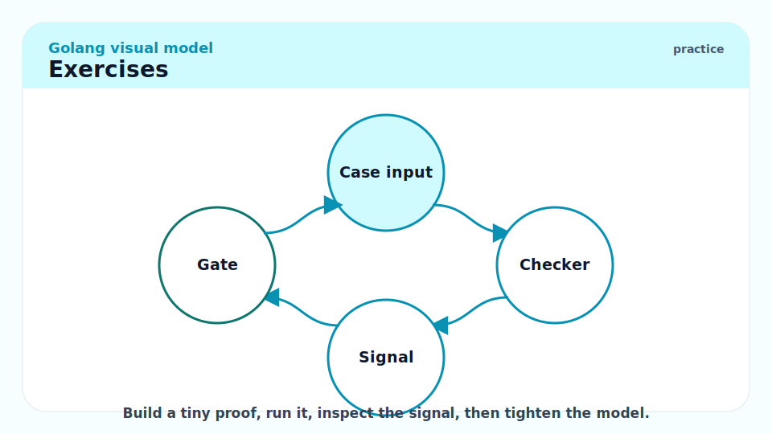

### Exercise 1 — Bug finding: Find the data race

```go
type Config struct {
    Timeout time.Duration
}
var cfg Config

func init() { cfg.Timeout = 5 * time.Second }

func worker() {
    for {
        fmt.Println(cfg.Timeout)  // read
        time.Sleep(cfg.Timeout)
    }
}

func updateConfig(t time.Duration) {
    cfg.Timeout = t   // write — concurrent with reads in worker
}
```

#### Solution

`cfg.Timeout` is read by `worker` goroutines and written by `updateConfig`, potentially from different goroutines, with no synchronisation. This is a data race.

`go test -race` would report:
```
DATA RACE
Write at cfg.Timeout by goroutine X (updateConfig)
Read at cfg.Timeout by goroutine Y (worker)
```

The fix depends on the use case:

```go
// Option 1: RWMutex (reads are frequent, writes are rare)
type Config struct {
    mu      sync.RWMutex
    timeout time.Duration
}

func (c *Config) Timeout() time.Duration {
    c.mu.RLock()
    defer c.mu.RUnlock()
    return c.timeout
}

func (c *Config) SetTimeout(t time.Duration) {
    c.mu.Lock()
    defer c.mu.Unlock()
    c.timeout = t
}

// Option 2: Atomic pointer to immutable config struct (replace whole struct atomically)
var cfgPtr atomic.Pointer[Config]
func GetConfig() *Config { return cfgPtr.Load() }
func SetConfig(c *Config) { cfgPtr.Store(c) }
```

---

### Exercise 2 — Implementation: Write a `singleflight`-style function

Write a `Group` that deduplicates concurrent calls with the same key — all concurrent callers with the same key wait for one shared call to complete.

#### Solution

```go
package main

import (
	"fmt"
	"sync"
	"time"
)

// call holds an in-flight or completed call.
type call struct {
	wg  sync.WaitGroup
	val any
	err error
}

// Group deduplicates concurrent function calls by key.
type Group struct {
	mu sync.Mutex
	m  map[string]*call
}

// Do executes fn for key, deduplicating concurrent calls.
// All concurrent callers with the same key receive the same result.
func (g *Group) Do(key string, fn func() (any, error)) (any, error) {
	g.mu.Lock()
	if g.m == nil {
		g.m = make(map[string]*call)
	}
	if c, ok := g.m[key]; ok {
		g.mu.Unlock()
		c.wg.Wait()          // wait for in-flight call to finish
		return c.val, c.err  // return shared result
	}
	c := &call{}
	c.wg.Add(1)
	g.m[key] = c
	g.mu.Unlock()

	c.val, c.err = fn()
	c.wg.Done()

	g.mu.Lock()
	delete(g.m, key)
	g.mu.Unlock()

	return c.val, c.err
}

func main() {
	var g Group
	var wg sync.WaitGroup
	for i := 0; i < 5; i++ {
		wg.Add(1)
		go func(id int) {
			defer wg.Done()
			v, _ := g.Do("db-query", func() (any, error) {
				time.Sleep(50 * time.Millisecond) // simulate DB call
				return "result", nil
			})
			fmt.Printf("goroutine %d got: %v\n", id, v)
		}(i)
	}
	wg.Wait()
	// All 5 goroutines get "result" but fn is only called once.
}
```

This is essentially how `golang.org/x/sync/singleflight` works. The standard library version (`x/sync`) is production-ready and handles the edge case where `fn` panics.

---

### Exercise 3 — Conceptual: When should you use `context.WithTimeout` vs `context.WithDeadline`?

#### Solution

`context.WithDeadline(ctx, t time.Time)` sets an absolute point in time. Use it when you know the exact wall-clock time by which the operation must complete, e.g., "this SLA requires we respond before 2026-05-19T12:00:00Z."

`context.WithTimeout(ctx, d time.Duration)` sets a relative duration from now. Use it for "this operation must complete within 5 seconds of being started."

Under the hood, `WithTimeout(ctx, d)` is exactly `WithDeadline(ctx, time.Now().Add(d))`. The two are semantically equivalent; `WithTimeout` is syntactic sugar for the common relative-duration case.

In practice:
- HTTP handlers: `context.WithTimeout(r.Context(), 5*time.Second)` wraps the incoming request context with a per-handler timeout.
- Database calls: `ctx, cancel := context.WithTimeout(ctx, 3*time.Second)` per query.
- Batch jobs with a hard deadline: `context.WithDeadline(ctx, deadline)` where `deadline` is computed from a job's SLA.

## Sources

- The Go Specification — Happens Before: https://go.dev/ref/spec#Memory_model
- The Go Memory Model: https://go.dev/ref/mem
- `sync` package docs: https://pkg.go.dev/sync
- `context` package docs: https://pkg.go.dev/context
- The Go Blog — Go Concurrency Patterns: Context: https://go.dev/blog/context
- The Go Blog — Introducing the Go Race Detector: https://go.dev/blog/race-detector
- 100 Go Mistakes (Harsanyi) — Mistakes #57–75 (concurrency).
- The Go Programming Language (Donovan & Kernighan) — Chapter 9.

## Related

- [7 - Goroutines and Channels](./7-goroutines-and-channels.md)
- [9 - Memory Management and the GC](./9-memory-management-gc.md)
- [12 - Building Production Services in Go](./12-building-production-services.md)
