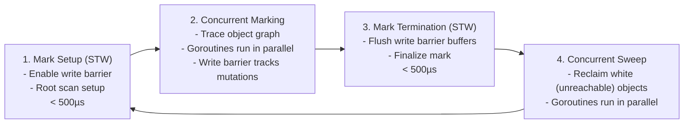

# 9 - Memory Management and the GC

[toc]

> **TL;DR:** Go uses a concurrent, tri-color mark-sweep garbage collector that runs alongside application goroutines with sub-millisecond stop-the-world pauses (< 1 ms for most workloads). The key levers are escape analysis (the compiler decides stack vs heap at compile time), `GOGC` (controls GC frequency as a percentage of live heap), and `GOMEMLIMIT` (Go 1.19+, hard memory ceiling). Understanding where allocations go — and how to avoid them — is the primary performance skill for Go at scale.

## Vocabulary

**Stack allocation**: A value that lives in the goroutine's stack frame. Allocation is a pointer bump; deallocation is automatic when the frame returns. Stack grows and shrinks dynamically in Go (initial ~2 KB, can grow to GB).

---

**Heap allocation**: A value that outlives its creating stack frame, or whose size is not known at compile time, or that is too large for the stack. Managed by the GC. Allocation involves the runtime's memory allocator; deallocation is GC's job.

---

**Escape analysis**: The compiler pass that determines whether a value can stay on the stack or must be promoted ("escape") to the heap. Run with `go build -gcflags='-m'` to see decisions.

---

**Tri-color mark-sweep**: The GC algorithm. Objects are conceptually colored: white (not yet visited), grey (visited but outgoing references not yet scanned), black (fully scanned). After marking, white objects are swept (freed). No object moves (non-compacting).

---

**Stop-the-world (STW)**: A pause during which all goroutines stop so the GC can perform operations that require a consistent heap view. Go minimises STW to two short pauses per GC cycle (mark setup and mark termination), each typically < 500 µs.

---

**`GOGC`**: An environment variable (or `runtime/debug.SetGCPercent`) that controls GC pacing. Default 100 means: "trigger a GC when the heap has grown to twice the live heap size after the last GC." Lower values = more frequent GC; higher values = less frequent.

---

**`GOMEMLIMIT`**: Go 1.19+. A hard upper bound on the Go heap size. The GC will work harder to stay within it. Set via `runtime/debug.SetMemoryLimit` or the `GOMEMLIMIT` env var.

---

**`runtime.GC()`**: Forces an immediate GC cycle. Used in tests and benchmarks to control GC timing; not for production.

---

**`pprof`**: The built-in profiling tool. `go tool pprof` analyzes heap profiles (`allocs`, `heap`) and CPU profiles. Net/http/pprof exposes them over HTTP in servers.

---

## Intuition

Think of Go's GC as a janitor that wakes up when the room gets messy and cleans while the party is still going on. The janitor is concurrent — the party (your goroutines) does not stop for the cleaning. There are two brief moments when the music stops: when the janitor starts sweeping (mark setup) and when the janitor confirms the room is clean (mark termination). Both are kept under 1 ms.

The key insight for performance: **the GC only frees what it can find, so it only costs proportional to what you allocated**. If you reduce allocations (by reusing objects, by keeping values on the stack), you reduce GC work and improve tail latency. Go gives you precise control over this through escape analysis and `sync.Pool`.

## Stack vs Heap — Escape Analysis

The compiler performs escape analysis on every function. A value escapes to the heap when:

1. Its address is taken and the pointer outlives the function (`return &x`).
2. It is stored in an interface (the concrete type is heap-allocated so the interface can hold a pointer).
3. It is too large for the stack (typically > 64 KB for local variables).
4. Its size is not known at compile time (e.g., `make([]byte, n)` where `n` is a variable).
5. It is sent on a channel.

```go
// stack allocation — x does not escape
func addOne(n int) int {
    x := n + 1
    return x
}

// heap allocation — p escapes because the pointer is returned
func newInt(n int) *int {
    x := n
    return &x  // x escapes to heap
}
```

To see escape decisions:

```bash
go build -gcflags='-m -m' ./...
# Output lines like:
# main.go:12:6: moved to heap: x
# main.go:5:13: x does not escape
```

> [!TIP]
> `go build -gcflags='-m'` is the single most useful command for understanding allocation behaviour in a hot path. Run it on the functions your profiler identifies as allocation-heavy. Each `moved to heap: x` line is a potential target for optimisation.

## The Tri-Color Mark-Sweep GC

Go's GC algorithm works in four phases per cycle:



### Phase 1 — Mark Setup (STW)

All goroutines pause briefly. The runtime enables the write barrier (so mutations during marking are tracked) and prepares the root scan (globals, stacks of all goroutines). This pause is typically 10–500 µs.

### Phase 2 — Concurrent Marking

The GC goroutines scan the object graph concurrently with application goroutines. Objects are coloured:
- **White**: not yet reachable (will be freed if still white after marking).
- **Grey**: reachable but outgoing pointers not yet scanned.
- **Black**: fully scanned; all children have been greyed.

The write barrier ensures that any pointer written by the application during marking is recorded, so the GC does not miss live objects. This is the longest phase — it runs concurrently and its duration is proportional to the live heap size.

### Phase 3 — Mark Termination (STW)

All goroutines pause briefly again. The GC flushes any remaining write barrier buffers and completes the final scan. This ensures every live object is black before sweeping begins.

### Phase 4 — Concurrent Sweep

The GC scans for white (unreachable) objects and reclaims their memory. This runs concurrently. Objects are not moved (Go uses a non-compacting GC), which avoids the cost of pointer updating but means the heap can become fragmented.

> [!NOTE]
> Go's GC does not compact the heap. Long-lived heaps with many short-lived objects can develop fragmentation. `runtime.ReadMemStats` exposes `HeapSys` (total heap from OS) vs `HeapInuse` (heap actually holding objects) — a large gap indicates fragmentation. The ballast trick (see In Practice) can help by pre-allocating heap to force the GC to operate with a larger live set.

## GC Pacing — GOGC and GOMEMLIMIT

### GOGC

`GOGC` (default 100) sets the heap growth target. After a GC cycle, if the live heap is H bytes, the next GC triggers when the heap reaches H × (1 + GOGC/100).

```math
\text{next GC trigger} = \text{live heap} \times \left(1 + \frac{\text{GOGC}}{100}\right)
```

Setting `GOGC=200` means the heap can grow to 3× the live heap before GC runs — fewer, larger GC cycles. Useful for CPU-bound services where GC latency matters more than memory. Setting `GOGC=50` means GC runs more frequently — useful when memory is constrained.

Setting `GOGC=off` disables the GC entirely (useful for short-lived programs, not long-running services).

### GOMEMLIMIT (Go 1.19+)

`GOMEMLIMIT` sets a soft ceiling on the Go heap. When the heap approaches the limit, the GC works harder (runs more frequently) to stay within it. This prevents OOM kills in containerised environments.

```go
import "runtime/debug"

// In main, set a memory limit appropriate for the container's memory allocation.
debug.SetMemoryLimit(500 * 1024 * 1024) // 500 MB
```

The recommended pattern for Kubernetes: set `GOMEMLIMIT` to ~90% of the container's memory limit. This lets the GC work hard before the OOM killer activates.

> [!IMPORTANT]
> `GOMEMLIMIT` does not prevent OOM if the live heap exceeds the limit — it can only control GC frequency to try to stay below it. If your program's actual live objects exceed the limit, the GC will thrash (run continuously) and your program will slow to a crawl. Profile first to confirm your live heap is well below the limit.

## Common Allocation Gotchas

### Interface Boxing

Storing a non-pointer value in an interface causes a heap allocation because the interface must hold a pointer to the data:

```go
var x interface{} = 42      // 42 is heap-allocated
var y interface{} = &MyStruct{} // pointer to heap-allocated struct

// High-frequency interface boxing in a hot path
func hotPath(vals []int) {
    for _, v := range vals {
        process(v)           // if process accepts interface{}, v boxes here
    }
}
```

### Closure Allocations

Each closure that captures a variable from the outer scope allocates a "closure struct" on the heap:

```go
for i := 0; i < 1000; i++ {
    f := func() { fmt.Println(i) }  // allocates a closure struct per iteration
    go f()
}
```

### Slice Growth

`append` that triggers a reallocation copies the old data and allocates a new backing array. Pre-sizing with `make([]T, 0, n)` avoids intermediate allocations.

### String Concatenation in Loops

`s += "x"` in a loop allocates a new string per iteration. Use `strings.Builder` or `bytes.Buffer`:

```go
// Slow — O(n²) allocations
var s string
for _, word := range words {
    s += word + " "
}

// Fast — O(n) total allocation
var b strings.Builder
for _, word := range words {
    b.WriteString(word)
    b.WriteByte(' ')
}
result := b.String()
```

## Real-world Example

Using `pprof` to find and fix a heap allocation hot spot in an HTTP handler:

```go
package main

import (
	"bytes"
	"encoding/json"
	"net/http"
	_ "net/http/pprof" // registers /debug/pprof/ routes
	"sync"
)

// responsePool reuses JSON encoding buffers.
var responsePool = sync.Pool{
	New: func() any { return new(bytes.Buffer) },
}

type Response struct {
	ID   int    `json:"id"`
	Name string `json:"name"`
}

// handler responds with a JSON-encoded response.
func handler(w http.ResponseWriter, r *http.Request) {
	// Get a buffer from the pool instead of allocating.
	buf := responsePool.Get().(*bytes.Buffer)
	defer func() {
		buf.Reset()
		responsePool.Put(buf)
	}()

	resp := Response{ID: 1, Name: "alice"}
	if err := json.NewEncoder(buf).Encode(resp); err != nil {
		http.Error(w, "encode error", http.StatusInternalServerError)
		return
	}
	w.Header().Set("Content-Type", "application/json")
	_, _ = w.Write(buf.Bytes())
}

func main() {
	http.HandleFunc("/user", handler)
	// Visit http://localhost:8080/debug/pprof/allocs to see allocation profiles.
	http.ListenAndServe(":8080", nil)
}
```

```bash
# Profile allocations live:
go tool pprof -alloc_objects http://localhost:8080/debug/pprof/allocs
# Then: top10 to see the top allocating functions
# flat   flat%   sum%        cum   cum%
# 1000   45%     45%    1000   45%  encoding/json.(*Encoder).Encode
# ...
```

> [!TIP]
> Import `_ "net/http/pprof"` for free in any `net/http` server. It registers `/debug/pprof/` endpoints for CPU, heap, goroutine, mutex, and block profiles. Run `go tool pprof http://host/debug/pprof/heap` to get an interactive profile. The `allocs` endpoint shows allocation count and bytes since program start — the most useful for finding hot-path allocation.

## In Practice

**The ballast trick**: Some services pre-allocate a large slice of bytes at startup (`_ = make([]byte, 1<<30)`) to tell the GC that the live heap is large, causing it to set a high trigger threshold and run less frequently. This is a workaround for `GOGC`'s proportional nature — replaced by `GOMEMLIMIT` in Go 1.19, which is the recommended approach.

**Finalizers (`runtime.SetFinalizer`)**: Go supports finalizers — functions called when an object is about to be GC'd. They are rarely needed (most resources should be closed explicitly via `defer`) and add GC latency. Avoid them in new code.

**GC-aware benchmarking**: Always run benchmarks with `go test -benchmem` to see allocations per operation. An allocation count of 0 allocs/op in a tight loop means the value stayed on the stack — the ideal. Use `testing.B.ResetTimer()` before the measurement loop and `testing.B.ReportAllocs()` to ensure allocation counting is on.

```go
func BenchmarkHandler(b *testing.B) {
	b.ReportAllocs()
	b.ResetTimer()
	for i := 0; i < b.N; i++ {
		// ... benchmark body
	}
}
```

> [!WARNING]
> `runtime.GC()` is for tests only. Calling it in production forces a GC pause at an unpredictable time and can make latency worse. If your service needs predictable GC timing, use `GOGC` and `GOMEMLIMIT` to tune the automatic scheduler, not manual calls.

## Pitfalls

- **"Returning a pointer is always faster than returning a value."** — For small structs, returning by value is often faster because it stays on the stack. Returning a pointer causes the value to escape to the heap, adding an allocation. Measure with `-benchmem`.
- **"Interfaces have no performance cost."** — Storing a value in an interface boxes it (may heap-allocate). Interface method calls are virtual dispatch (one pointer indirection). In very tight loops this is measurable.
- **"GOGC=off is a good optimisation."** — Only for programs that run briefly (CLI tools). For long-running services, disabling GC means the heap grows indefinitely until OOM.
- **"sync.Pool is a free list."** — Pool objects are evicted at any GC cycle. If your pooled objects are expensive to create and you need them to outlive GCs, Pool is the wrong tool. Use an explicit free list with a channel or mutex.
- **"Small allocations are free."** — Each allocation has a small but real cost: the allocator must find free memory, write a type descriptor, and the GC must trace and sweep the object. At millions of allocations per second, this adds up. Profile before dismissing small-allocation concerns.

## Exercises

### Exercise 1 — Conceptual: Why does `fmt.Sprintf("%d", x)` allocate and `strconv.Itoa(x)` allocate less?

#### Solution

`fmt.Sprintf` accepts `...any` (variadic interface). Passing an `int` value causes interface boxing: the int is heap-allocated to produce the `any` value. Then `fmt.Sprintf` uses reflection to format it. Each call allocates: one for the boxed int, one for the result string.

`strconv.Itoa(x int)` accepts a typed `int`, performs no boxing, and allocates only the result string. It is purpose-built for this single conversion.

```bash
go test -bench=BenchmarkSprintf -benchmem
# BenchmarkSprintf   1000000   1200 ns/op   48 B/op   2 allocs/op
# BenchmarkItoa      5000000    230 ns/op   16 B/op   1 allocs/op
```

For high-frequency number-to-string conversion (log lines, metrics labels), `strconv.AppendInt(buf, x, 10)` is even better — it appends to an existing `[]byte` without allocating at all if the buffer has capacity.

---

### Exercise 2 — Implementation: Benchmark a function with and without `sync.Pool`

Write a benchmark comparing JSON encoding with and without buffer pooling.

#### Solution

```go
package main

import (
	"bytes"
	"encoding/json"
	"sync"
	"testing"
)

type Item struct {
	ID   int    `json:"id"`
	Name string `json:"name"`
}

var pool = sync.Pool{New: func() any { return new(bytes.Buffer) }}

// BenchmarkEncodeNoPool encodes without pooling — allocates a new buffer each time.
func BenchmarkEncodeNoPool(b *testing.B) {
	b.ReportAllocs()
	item := Item{ID: 1, Name: "test"}
	for i := 0; i < b.N; i++ {
		var buf bytes.Buffer
		_ = json.NewEncoder(&buf).Encode(item)
	}
}

// BenchmarkEncodeWithPool encodes with a pooled buffer.
func BenchmarkEncodeWithPool(b *testing.B) {
	b.ReportAllocs()
	item := Item{ID: 1, Name: "test"}
	for i := 0; i < b.N; i++ {
		buf := pool.Get().(*bytes.Buffer)
		buf.Reset()
		_ = json.NewEncoder(buf).Encode(item)
		pool.Put(buf)
	}
}
```

```bash
go test -bench=. -benchmem
# BenchmarkEncodeNoPool    500000   2400 ns/op   248 B/op   4 allocs/op
# BenchmarkEncodeWithPool  800000   1500 ns/op    56 B/op   2 allocs/op
```

The pooled version typically shows ~2x fewer allocs/op and lower ns/op, especially under concurrent load where the pool reduces GC pressure.

---

### Exercise 3 — Conceptual: Explain GOGC=100 (default) in terms of heap growth

#### Solution

With `GOGC=100`, the GC triggers when the heap has grown by 100% of the live heap size from the last GC. If the live heap after GC is 50 MB, the next GC triggers at 100 MB (50 MB live + 100% growth = 50 + 50 = 100 MB).

More precisely:
- After GC, live heap = H.
- Next trigger = H × (1 + GOGC/100) = H × 2.0 for GOGC=100.

`GOGC=200` sets trigger at H × 3.0 — allows 2× more growth, runs GC less often, uses more memory.
`GOGC=50` sets trigger at H × 1.5 — allows only 50% growth, runs GC more often, uses less memory.

The tradeoff is memory vs CPU time. Higher GOGC: more memory used, less CPU time on GC. Lower GOGC: less memory used, more CPU time on GC (which adds latency). For latency-sensitive services, GOGC=400 or even higher (with `GOMEMLIMIT` as a safety valve) is a common tuning.

## Sources

- The Go GC guide: https://tip.golang.org/doc/gc-guide
- The Go Memory Model: https://go.dev/ref/mem
- Go runtime source (HACKING.md): https://go.dev/src/runtime/HACKING.md
- Proposal: soft memory limit (GOMEMLIMIT): https://go.dev/blog/go119memop
- The Go Programming Language (Donovan & Kernighan) — Appendix: The Go Garbage Collector.
- Understanding Allocations in Go (GopherCon talk by Jacob Walker): https://www.youtube.com/watch?v=ZMZpH4yT7M0
- 100 Go Mistakes (Harsanyi) — Mistakes #95–100 (performance, GC).

## Related

- [7 - Goroutines and Channels](./7-goroutines-and-channels.md)
- [8 - Concurrency Patterns and the Race Detector](./8-concurrency-patterns.md)
- [12 - Building Production Services in Go](./12-building-production-services.md)
