# Python Language Basics

[toc]

> **TL;DR:** This note covers the foundational layer of Python: its indentation-based syntax, the object model behind variables and data types, operators, string handling, conditionals, loops, type casting, exceptions, and functions plus the everyday builtins. Each section is self-contained with intuition, mechanics, real-world code, production guidance, and pitfalls.

## Basic Syntax

> **TL;DR:** Python uses significant indentation instead of braces to delimit blocks, so whitespace is part of the grammar, not cosmetics. Programs are sequences of statements, some of which contain expressions, and PEP 8 codifies the naming and layout conventions that make code idiomatic.

### Vocabulary

- **Statement** — a complete instruction the interpreter executes (`x = 1`, `if`, `return`); it performs an action and has no value on its own.
- **Expression** — a fragment that *evaluates to a value* (`2 + 3`, `f(x)`, `a and b`); every expression is also a valid statement.
- **Block** — a group of statements at the same indentation level under a header line ending in `:`.
- **Suite** — the Python grammar's term for the block following a clause header.
- **REPL** — Read–Eval–Print Loop: the interactive interpreter that evaluates one entry at a time and echoes its value.
- **Token** — the smallest lexical unit (keyword, identifier, literal, operator) the tokenizer produces from source text.

### Intuition

In C-family languages, braces `{}` mark where a block starts and ends, and indentation is just a courtesy to human readers. Python folds those two roles into one: the indentation *is* the block structure. This forces every Python program to be laid out the way a human would read it, eliminating an entire class of "the braces and the indentation disagree" bugs.

### How it works

Python source is first tokenized, then parsed against a grammar where indentation generates explicit `INDENT` and `DEDENT` tokens. Understanding the lexical rules below explains why some formatting is mandatory and some is free.

#### Indentation and blocks

A block begins after a header line ending in a colon and consists of all subsequent lines indented more deeply than the header. Every line in a block must share the *same* indentation; mixing depths raises `IndentationError`, and mixing tabs with spaces raises `TabError`. PEP 8 mandates four spaces per level and forbids tabs in new code.

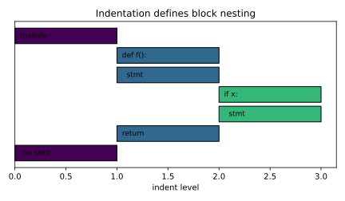

```python
def classify(n):
    if n < 0:
        return "negative"
    else:
        return "non-negative"   # same depth as the 'return' above
```

#### Statements, expressions, and comments

A statement spans one logical line by default. An expression statement evaluates an expression and discards the result (useful for calls with side effects). Comments start with `#` and run to end of line; Python has no block-comment syntax, so multi-line comments are just stacked `#` lines.

```python
total = 0            # assignment statement
total + 1            # expression statement (result discarded)
print("side effect") # call expression used as a statement
```

#### Line continuation and semicolons

A long logical line can be split across physical lines either explicitly with a trailing backslash `\`, or implicitly whenever it sits inside parentheses, brackets, or braces. Implicit continuation is strongly preferred because a stray space after `\` silently breaks it. Multiple statements may share one line with semicolons, but PEP 8 discourages this.

```python
total = (1 + 2 +      # implicit continuation inside ()
         3 + 4)
path = "a" \
       "b"            # explicit continuation (fragile; avoid)
x = 1; y = 2          # legal but discouraged
```

#### Naming conventions (PEP 8)

Names are case-sensitive and identifiers may use letters, digits, underscores, and most Unicode letters, but cannot start with a digit. PEP 8 assigns meaning by case: `snake_case` for functions and variables, `CapWords` for classes, `UPPER_SNAKE` for constants, and a single leading underscore for "internal" names.

```python
MAX_RETRIES = 3          # constant
class HttpClient: ...     # class -> CapWords
def fetch_url(url): ...    # function -> snake_case
_internal_cache = {}      # leading _ signals "private"
```

#### The REPL

The REPL reads one statement (or block), evaluates it, prints the resulting value if it is an expression, and loops. It is the fastest way to probe behavior; the special variable `_` holds the last printed value.

```python
>>> 2 ** 10
1024
>>> _ + 1
1025
```

### Real-world example

A common first script reads a file, counts non-blank lines, and reports the result. It exercises indentation, the `with` block, an expression statement, and a guarded entry point.

```python
def count_nonblank(path):
    count = 0
    with open(path, encoding="utf-8") as f:
        for line in f:
            if line.strip():        # truthy only when non-empty
                count += 1
    return count


if __name__ == "__main__":
    print(count_nonblank("notes.txt"))
```

### In practice

Real codebases enforce syntax style automatically rather than by review. Formatters such as Black and linters such as Ruff normalize indentation, line length, and quote style on every commit, so engineers rarely argue about layout. The `if __name__ == "__main__":` guard is near-universal because it lets a file be both an importable module and a runnable script.

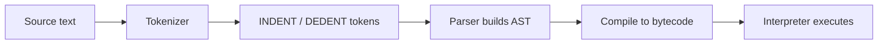

### Pitfalls

- **"Tabs and spaces are interchangeable."** — Mixing them in the same block raises `TabError`; always use four spaces.
- **"Indentation is just style."** — It is part of the grammar; wrong indentation changes which block a statement belongs to or fails to parse.
- **"`#` can start a block comment that spans lines."** — Python has no block comments; each line needs its own `#` (triple-quoted strings are *strings*, not comments).
- **"A backslash anywhere joins lines."** — Only a backslash as the *last* character of a line continues it; trailing whitespace after `\` breaks it.
- **"Semicolons are required to end statements."** — A newline ends a statement; semicolons are optional separators and discouraged.

## Variables and Data Types

> **TL;DR:** In Python a variable is a *name bound to an object*, not a box holding bytes, so assignment never copies data — it rebinds a label. Types live on the objects, not the names, which is why Python is dynamically typed; the critical practical split is between mutable and immutable objects.

### Vocabulary

- **Object** — every value in Python; carries an identity, a type, and a value.
- **Name (variable)** — a label in some namespace that *references* an object; created by binding, not by declaration.
- **Identity** — the unique, lifetime-stable id of an object, returned by `id()` and compared with `is`.

```math
\text{id}(x) \in \mathbb{Z}
```

- **Type** — the class of an object, returned by `type()`; determines its behavior and methods.
- **Mutable** — an object whose state can change in place (`list`, `dict`, `set`).
- **Immutable** — an object whose state cannot change after creation (`int`, `float`, `str`, `tuple`, `bool`, `None`).
- **Reference count** — how many names point to an object; reaching zero makes it eligible for garbage collection.

### Intuition

Think of objects as living on a heap and names as sticky notes you peel off and reattach. `a = b` does not copy `b`'s contents; it attaches the name `a` to the *same* object `b` points to. For immutable objects this is invisible, but for a shared list it means a mutation through one name is seen through every name — the single most common source of "spooky action at a distance" for newcomers.

### How it works

A variable comes into existence the moment you bind it; there is no separate declaration step. The object it points to knows its own type, and that type can change freely between assignments because the name carries no type of its own.

#### Names as references, not boxes

Assignment binds a name to whatever object the right-hand side evaluates to. Because two names can share one object, comparing identity (`is`) differs from comparing value (`==`). Use `==` for "do these mean the same thing" and `is` only for singletons like `None`.

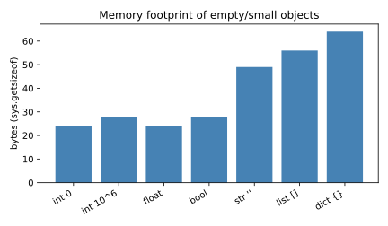

```python
a = [1, 2, 3]
b = a            # b references the SAME list, no copy
b.append(4)
print(a)         # [1, 2, 3, 4] — mutation visible through a
print(a is b)    # True — same object
print(a == a[:]) # True value, but a is a[:] -> False (a copy)
```

#### Dynamic typing

A name may be rebound to an object of any type at any time; the type belongs to the object, queried with `type()`. This flexibility means the interpreter resolves attributes and operations at runtime, which is powerful but defers many errors from compile time to run time.

```python
x = 42
print(type(x))   # <class 'int'>
x = "now a string"
print(type(x))   # <class 'str'> — legal, the name has no fixed type
```

#### The built-in types

The core scalar types are `int` (arbitrary precision), `float` (IEEE 754 double), `complex`, `bool` (a subclass of `int` where `True == 1`), `str` (immutable Unicode text), and the singleton `None`. The core containers are `list`, `tuple`, `dict`, and `set`. Knowing each type's mutability tells you whether passing it to a function can mutate the caller's object.

```python
print(isinstance(True, int))   # True — bool subclasses int
print(0.1 + 0.2)               # 0.30000000000000004 — float is binary
print(10 ** 100)               # huge int, no overflow
```

#### Identity, equality, and size

`id()` exposes an object's identity (in CPython, its memory address); `is` compares identity, `==` compares value. `sys.getsizeof` reports the bytes an object occupies, revealing why small ints and empty containers still cost a header. Beware that CPython *caches* small ints (−5..256) and short strings, so `is` may surprise you.

```python
import sys
print(sys.getsizeof(0), sys.getsizeof(10**6))  # 28 28 (header dominates)
a = 256; b = 256
print(a is b)   # True  — cached small int
a = 257; b = 257
print(a is b)   # often False — not cached; rely on == instead
```

### Real-world example

A configuration loader builds a default settings dict, then layers user overrides. The shared-reference trap appears if you reuse one mutable default across calls, so a copy is taken deliberately.

```python
import copy

DEFAULTS = {"retries": 3, "timeout": 30, "hosts": ["localhost"]}


def build_config(overrides):
    config = copy.deepcopy(DEFAULTS)   # avoid mutating the shared default
    config.update(overrides)
    return config


cfg = build_config({"timeout": 60})
cfg["hosts"].append("backup")
print(DEFAULTS["hosts"])  # ['localhost'] — original untouched
```

### In practice

Production teams lean on the mutable/immutable distinction constantly: immutable objects are hashable and safe to share across threads, which is why dict keys must be immutable and why `tuple` is preferred for fixed records. Static type checkers (mypy, Pyright) add *optional* type annotations on top of dynamic typing, catching type mismatches before runtime without changing execution semantics.

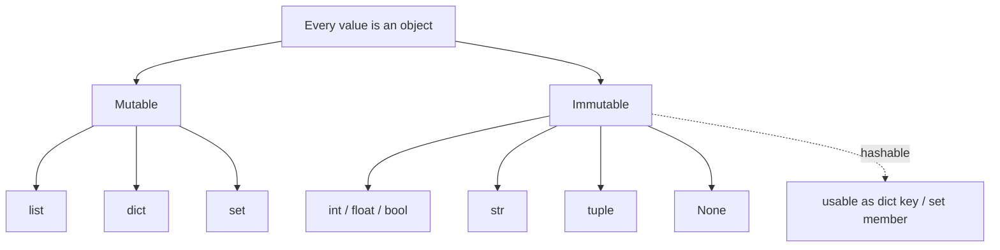

### Pitfalls

- **"Assignment copies the value."** — It binds a name to the same object; mutate a shared list and every name sees the change.
- **"`is` and `==` are interchangeable."** — `is` compares identity, `==` compares value; use `is` only for `None`.
- **"Small-int caching means `is` works for equality."** — Caching is a CPython optimization, not a guarantee; never use `is` for number/string equality.
- **"`bool` is a separate type from `int`."** — `bool` subclasses `int`, so `True + True == 2` and `True == 1`.
- **"Floats are exact."** — They are binary IEEE 754; `0.1 + 0.2 != 0.3`, so use `math.isclose` or `decimal.Decimal` for money.

## Operators

> **TL;DR:** Operators are syntactic shorthand that dispatch to dunder methods on objects, so `a + b` is really `a.__add__(b)`. Beyond arithmetic, Python offers chained comparisons, short-circuiting boolean operators that return operands (not just `True`/`False`), bitwise ops, the walrus `:=`, and a fixed precedence table that decides grouping.

### Vocabulary

- **Operator** — a symbol invoking a built-in operation that desugars to a special ("dunder") method.
- **Operand** — a value an operator acts on.
- **Floor division** — `//`, the quotient rounded toward negative infinity.

```math
a // b = \left\lfloor \frac{a}{b} \right\rfloor
```

- **Short-circuit evaluation** — `and`/`or` stop evaluating as soon as the result is determined, returning the deciding operand.
- **Precedence** — the ranking that decides which operator binds tighter when grouping is implicit.
- **Associativity** — the direction (left/right) operators of equal precedence group; `**` is right-associative.

### Intuition

Operators are not magic syntax baked into the language for fixed types; they are calls to methods objects choose to implement. That is why `+` concatenates strings, adds numbers, and extends lists — each type defines `__add__` differently. Two non-obvious behaviors flow from Python's design: comparisons can chain like math (`0 < x < 10`), and `and`/`or` return one of their operands rather than a plain boolean, which enables idioms like `name = user_input or "anonymous"`.

### How it works

Every operator maps to a method the interpreter looks up on the left operand's type, falling back to the right operand's reflected method. The precedence table below resolves expressions written without explicit parentheses.

#### Arithmetic

The arithmetic operators include the usual `+ - * /` plus floor division `//`, modulo `%`, and exponentiation `**`. True division `/` always yields a float, even for `6 / 2`. Floor division and modulo follow the sign of the *divisor*, which differs from C and surprises people doing negative-number math.

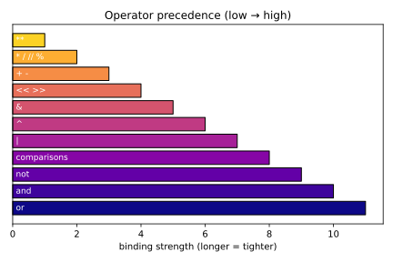

```python
print(7 / 2)     # 3.5  — always float
print(7 // 2)    # 3    — floor
print(-7 // 2)   # -4   — rounds toward -inf, not toward zero
print(-7 % 2)    # 1    — sign follows the divisor
print(2 ** 10)   # 1024 — exponentiation, right-associative
```

#### Comparison and chaining

Comparison operators (`== != < <= > >=`) return booleans and may be chained: `a < b < c` is evaluated as `(a < b) and (b < c)` with `b` evaluated once. This matches mathematical notation and reads cleanly for range checks.

```python
x = 5
print(0 < x < 10)          # True — chained, no explicit 'and'
print(1 == 1.0 == True)    # True — cross-type numeric equality
```

#### Boolean short-circuit

`and`, `or`, and `not` implement logical operations, but `and`/`or` return an *operand*, not a coerced boolean. `a and b` yields `a` if `a` is falsy else `b`; `a or b` yields `a` if `a` is truthy else `b`. They stop early, so the right side is never evaluated when the result is already decided — useful for guarding against errors.

```python
config = {}
port = config.get("port") or 8080   # falls back when get() returns None
print(port)                         # 8080
user = None
print(user and user.name)           # None — short-circuits, no AttributeError
```

#### Bitwise

Bitwise operators (`& | ^ ~ << >>`) act on the binary representation of integers and are also overloaded by sets (`&` intersection, `|` union). They are common in flags, masks, and low-level protocol code.

```python
flags = 0b0000
READ, WRITE = 0b0001, 0b0010
flags |= READ | WRITE     # set bits
print(flags & READ)       # 1 — bit is set
print(5 << 2)             # 20 — shift left = multiply by 4
```

#### Assignment, walrus, identity, membership

Plain `=` binds a name; augmented forms (`+=`, `*=`, ...) rebind in place where the type allows. The walrus operator `:=` assigns *as part of an expression*, letting you capture a value inside a condition or comprehension. Identity (`is`/`is not`) compares object identity; membership (`in`/`not in`) tests containment.

```python
data = [1, 2, 3, 4]
while (n := len(data)) > 0:   # walrus: assign and test together
    data.pop()
print("removed all", n)

print(3 in [1, 2, 3])         # True  — membership
print(None is None)           # True  — identity
```

### Real-world example

A request handler validates a numeric parameter, applies a fallback, and packs permission flags. It uses chained comparison for bounds, `or` for a default, bitwise OR to combine flags, and the walrus to avoid a double lookup.

```python
def handle(params):
    raw = params.get("limit") or "10"     # default when missing/empty
    limit = int(raw)
    if not (1 <= limit <= 100):           # chained bounds check
        raise ValueError("limit out of range")

    perms = 0
    READ, WRITE, ADMIN = 1, 2, 4
    if params.get("admin"):
        perms |= READ | WRITE | ADMIN     # combine flags
    if (token := params.get("token")):    # walrus avoids re-get
        perms |= READ
    return limit, perms


print(handle({"limit": "50", "token": "abc"}))  # (50, 1)
```

### In practice

Because operators dispatch to dunder methods, libraries like NumPy and pandas overload `+`, `*`, and `&` to mean elementwise or boolean-mask operations — read each library's docs before assuming Python semantics. The walrus operator shines in loops and comprehensions that would otherwise compute a value twice, and short-circuiting `or` is the canonical way to supply defaults, though `dict.get(key, default)` is clearer when the falsy-vs-missing distinction matters.

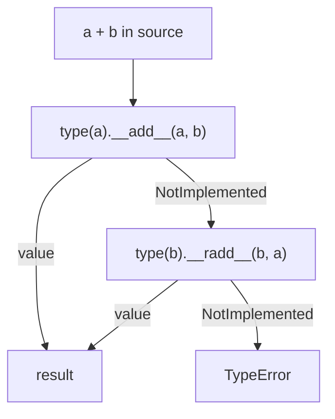

### Pitfalls

- **"`/` does integer division for two ints."** — `/` is always true division returning float; use `//` for floor division.
- **"`-7 // 2 == -3`."** — Floor division rounds toward negative infinity, giving `-4`.
- **"`and`/`or` return `True`/`False`."** — They return one of the operands; `2 and 3` is `3`, not `True`.
- **"`is` checks equality."** — It checks identity; use `==` for value, `is` only for `None`/singletons.
- **"`**` is left-associative."** — It is right-associative: `2 ** 3 ** 2 == 512`, not `64`.
- **"`x or default` is the same as `dict.get(x, default)`."** — `or` triggers on any falsy value (0, "", []), not just missing keys.

## Working with Strings

> **TL;DR:** A Python `str` is an immutable sequence of Unicode code points; every "mutating" operation actually returns a new string. Slicing, f-strings, and a rich method set cover almost all text work, while `bytes` and the `encode`/`decode` boundary handle the raw-octet world that files and sockets live in.

### Vocabulary

**String**

A `str` is an immutable, ordered sequence of Unicode code points. You can index and slice it but never modify it in place.

**Code point**

An integer assigned to a character by the Unicode standard, ranging from 0 to 0x10FFFF. `ord('A')` is 65; `chr(65)` is `'A'`.

**Bytes**

A `bytes` object is an immutable sequence of integers in the range 0–255 (ℤ ∩ [0, 256)). It is the on-the-wire / on-disk representation that text must be encoded into.

**Encoding**

A function mapping a sequence of code points to a sequence of bytes (e.g. UTF-8). Decoding is the inverse map; it can fail if bytes are not valid for the chosen codec.

**f-string**

A string literal prefixed with `f` whose `{...}` fields are evaluated and formatted at runtime, introduced by PEP 498.

**Slice**

A subsequence selected by `s[start:stop:step]` with a half-open interval [start, stop).

### Intuition

Think of a string as a frozen array of characters with a sharp boundary between two worlds: the *text* world (`str`, human-meaningful code points) and the *byte* world (`bytes`, what hardware actually moves). Inside your program you manipulate `str`; the moment text crosses into a file, a socket, or a subprocess, it must be encoded to `bytes`, and on the way back it must be decoded. Immutability means you never worry about a string changing under you, but it also means string-building in a loop with `+` is quietly quadratic — you reach for `join` or an f-string instead.

### How it works

Strings combine sequence semantics (indexing, slicing, iteration, `len`) with a large library of text-specific methods. Because they are immutable, the interpreter can intern short literals and share them safely, and hashing them is cheap and stable — which is exactly why strings are the canonical dictionary key.

#### Immutability and identity

Once created, a string's contents never change. Methods like `replace` or `upper` allocate and return a brand-new string, leaving the original untouched. This is what makes strings hashable and safe to use as keys.

```python
s = "hello"
t = s.upper()          # returns a NEW string
print(s, t)            # hello HELLO  -- s is unchanged
# s[0] = "H"           # TypeError: 'str' object does not support item assignment
```

#### Indexing and slicing

Indexing returns a one-character string; negative indices count from the end. Slicing `s[start:stop:step]` returns a new substring over the half-open interval, and a negative step reverses.

```python
s = "python"
print(s[0], s[-1])     # p n
print(s[1:4])          # yth   (indices 1,2,3)
print(s[::-1])         # nohtyp  (reverse)
```

#### f-strings and format specs

An f-string interpolates expressions inline and accepts a format spec after a colon: `{value:spec}`. The spec controls width, alignment, precision, sign, and type, following the Format Specification Mini-Language.

```python
pi = 3.14159
qty = 7
print(f"{pi:.2f}")        # 3.14   (2 decimals)
print(f"{qty:>5}")        # '    7' (right-align, width 5)
print(f"{255:#x}")        # 0xff   (hex with prefix)
print(f"{pi=}")           # pi=3.14159  (self-documenting, 3.8+)
```

#### Key methods

The most-used methods split, join, trim, search, and test text. `split`/`join` are inverses, `strip` removes surrounding whitespace (or a given character set), and `find` returns -1 on failure while `index` raises.

```python
csv = "  a,b,c  "
parts = csv.strip().split(",")     # ['a', 'b', 'c']
joined = "-".join(parts)           # 'a-b-c'
print("hello".replace("l", "L"))   # heLLo
print("file.txt".startswith("file"))  # True
print("hello".find("z"))           # -1  (no exception)
```

The figure below shows the relative cost of these methods over 100k calls — all are fast, but `join`/`split` do more allocation than a simple `find`.

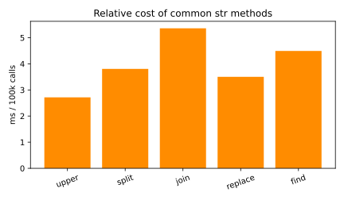

#### Encoding: the str ↔ bytes boundary

Text must be encoded to `bytes` before it leaves the program and decoded on the way in. UTF-8 is the near-universal default; mismatched codecs produce mojibake or a `UnicodeDecodeError`.

```python
text = "café"
raw = text.encode("utf-8")     # b'caf\xc3\xa9'  (é is 2 bytes)
print(len(text), len(raw))     # 4 5
print(raw.decode("utf-8"))     # café  (round-trips)
```

#### Raw strings

A raw string literal `r"..."` disables backslash escape processing, so `\n` stays two characters. This is the idiomatic way to write regular expressions and Windows paths.

```python
pattern = r"\d+\.\d+"   # backslashes preserved literally
print(pattern)          # \d+\.\d+
```

The flow from a literal to formatted output:

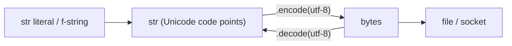

### Real-world example

A small log-line parser: take a raw byte line from a file, decode it, validate the level, and reformat it for a report. This touches decoding, splitting, membership tests, and an f-string.

```python
def format_log(raw: bytes) -> str:
    line = raw.decode("utf-8").strip()
    level, _, message = line.partition(": ")
    if level.upper() not in {"INFO", "WARN", "ERROR"}:
        level = "UNKNOWN"
    return f"[{level.upper():<7}] {message}"

sample = "error: disk almost full".encode("utf-8")
print(format_log(sample))   # [ERROR  ] disk almost full
```

### In practice

In production text-heavy code, build strings with `"".join(parts)` or an f-string rather than repeated `+=`, which is O(n²) because each concatenation copies. Always specify an explicit encoding when opening files (`open(path, encoding="utf-8")`) instead of relying on the platform default, which differs across OSes. For user-facing search and comparison, normalize Unicode (`unicodedata.normalize("NFC", s)`) so visually identical strings compare equal.

> [!TIP]
> `str.join` is the canonical fast builder: `",".join(items)` allocates the result exactly once. Reserve `+` for joining a handful of literals.

> [!CAUTION]
> Never store or compare passwords or tokens with ordinary `==` on decoded strings in security code — use `hmac.compare_digest` to avoid timing leaks. String identity (`is`) is also not equality; rely on `==`.

### Pitfalls

- **"Strings are mutable like lists."** — They are immutable; every transform returns a new object, and `s[0] = 'x'` raises `TypeError`.
- **"`len(s)` is the number of bytes."** — It is the number of code points; the byte count is `len(s.encode("utf-8"))`, which differs for non-ASCII text.
- **"`find` raises when the substring is missing."** — `find` returns -1; it is `index` that raises `ValueError`.
- **"Concatenating in a loop with `+=` is fine."** — It is O(n²); use `"".join(...)` or build a list and join once.
- **"Default file encoding is always UTF-8."** — It is platform-dependent unless you pass `encoding="utf-8"` explicitly (PEP 540 / 597 nudge toward UTF-8, but be explicit).

## Conditionals

> **TL;DR:** Conditionals branch execution on the truth value of an expression. Python evaluates the *truthiness* of any object — not just `bool` — so empty containers and zero are falsy, while `if/elif/else`, the ternary expression, and `match/case` (3.10+) give you increasingly structural ways to choose a branch.

### Vocabulary

**Condition**

Any expression whose truthiness is tested; Python calls `bool(x)` on it implicitly.

**Truthy / Falsy**

A value is falsy if `bool(x)` is `False`. The falsy set is `0`, `0.0`, `''`, `[]`, `{}`, `set()`, `None`, and `False`; everything else is truthy.

**Branch**

One arm of a conditional — the suite executed when its guard holds.

**Ternary expression**

The conditional expression `a if cond else b`, which is an *expression* (yields a value) rather than a statement.

**Structural pattern matching**

`match/case` (PEP 634), which dispatches on the *shape* and contents of a value, binding sub-parts as it goes.

### Intuition

A conditional is a fork in the road: evaluate a guard, take the matching path. The key Python twist is that the guard need not be a literal `True`/`False` — any object answers the question "are you truthy?" Empty things (`""`, `[]`, `0`) say no; non-empty things say yes. This lets you write `if items:` instead of `if len(items) > 0:`. When branching gets richer than yes/no — "is this a 2-tuple of ints? a dict with these keys?" — `match/case` lets you describe the *shape* you want instead of writing a ladder of `isinstance` checks.

### How it works

Python tests conditions top to bottom and runs the first branch whose guard is truthy, skipping the rest. Indentation, not braces, delimits each branch's suite, so a misaligned line silently changes which branch a statement belongs to.

#### if / elif / else

`if` starts the chain, each `elif` is an additional mutually-exclusive test, and the optional `else` catches everything that fell through. Only the first matching branch runs.

```python
score = 82
if score >= 90:
    grade = "A"
elif score >= 80:
    grade = "B"
elif score >= 70:
    grade = "C"
else:
    grade = "F"
print(grade)   # B
```

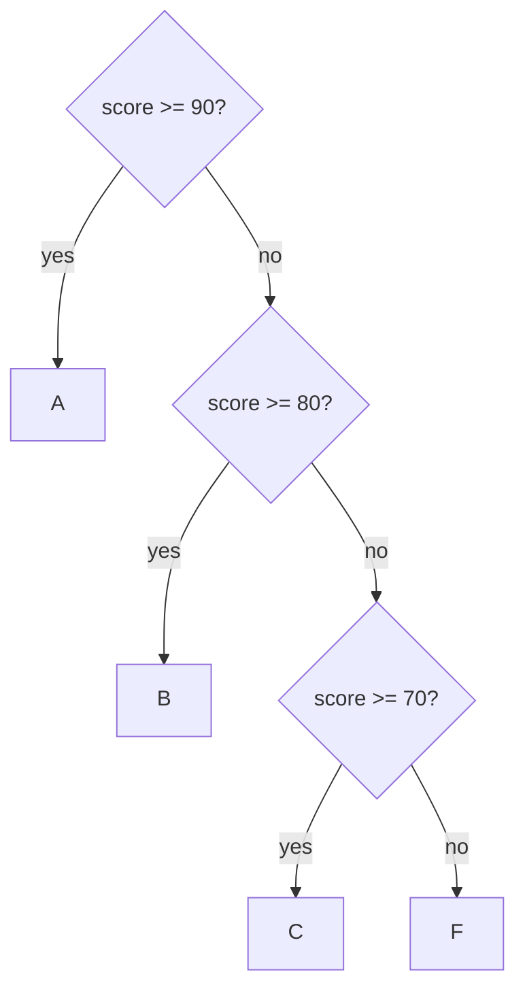

#### Truthiness

Rather than comparing to `True`, idiomatic Python tests objects directly. An object is falsy when it is empty, zero, or `None`; a class can customize this by defining `__bool__` or `__len__`.

```python
items = []
if not items:
    print("nothing to do")   # prints: empty list is falsy

name = "Ada"
if name:                     # non-empty string is truthy
    print(f"hello {name}")
```

The figure below colors the common literals by truth value — red are the falsy ones you must memorize.

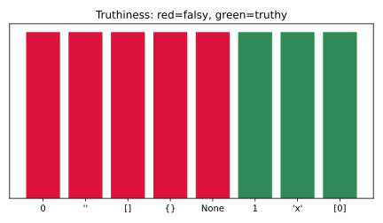

#### Conditional (ternary) expression

When you need a *value* chosen by a condition, the ternary expression is more compact than a four-line `if/else`. It reads left-to-right as "this, if cond, else that" and can be nested or used inside comprehensions.

```python
n = 7
parity = "even" if n % 2 == 0 else "odd"
print(parity)   # odd
```

#### match / case

`match` (Python 3.10+) compares a subject against a series of *patterns*, binding variables from the matched structure. Patterns can be literals, captures, sequences, mappings, or class patterns, and a bare `_` is the wildcard default.

```python
def describe(point):
    match point:
        case (0, 0):
            return "origin"
        case (0, y):
            return f"on y-axis at {y}"
        case (x, 0):
            return f"on x-axis at {x}"
        case (x, y):
            return f"point ({x}, {y})"
        case _:
            return "not a 2-tuple"

print(describe((0, 5)))   # on y-axis at 5
```

### Real-world example

An HTTP response router: dispatch on a status code into human categories, then on a richer structured event using `match`. This shows the `if/elif` ladder and structural matching side by side.

```python
def categorize(status: int) -> str:
    if 200 <= status < 300:
        return "success"
    elif 300 <= status < 400:
        return "redirect"
    elif 400 <= status < 500:
        return "client error"
    else:
        return "server error"

def handle(event: dict) -> str:
    match event:
        case {"type": "click", "x": x, "y": y}:
            return f"click at ({x},{y})"
        case {"type": "key", "code": code}:
            return f"key {code}"
        case _:
            return "unknown event"

print(categorize(404))                                  # client error
print(handle({"type": "click", "x": 3, "y": 9}))        # click at (3,9)
```

### In practice

Prefer truthiness tests (`if items:`) over explicit length or `== True` comparisons — they read better and work for any container. Use the ternary expression for short value selection, but break complex logic into a full `if` block for readability. Reach for `match/case` when you are dispatching on the *structure* of data (parsed ASTs, JSON event shapes, tagged unions); for a flat sequence of unrelated boolean conditions, an `if/elif` ladder is still clearer.

> [!IMPORTANT]
> `match` patterns are not `isinstance` shortcuts only — a bare name like `case x:` is a *capture* that always matches and binds, not a comparison against a variable named `x`. To match against an existing constant, use a dotted name (`case Color.RED:`) or a guard.

> [!WARNING]
> `if x = 5:` is a syntax error in a plain condition, but `if (x := 5):` (the walrus operator) assigns and tests — easy to confuse with the comparison `==`.

### Pitfalls

- **"`if x == True:` is the right way to test a flag."** — Test `if x:`; comparing to `True` fails for truthy-but-not-`True` values like `1` or a non-empty list.
- **"Only `False` and `None` are falsy."** — `0`, `0.0`, `''`, `[]`, `{}`, and `set()` are also falsy.
- **"`elif` branches are checked even after one matches."** — Evaluation stops at the first truthy guard; later branches are skipped entirely.
- **"`case (x, y):` checks against pre-existing variables x and y."** — Those are capture patterns that bind new names; use a guard or dotted constant to compare.
- **"The ternary is a statement."** — It is an expression; `x if c else y` must always have the `else`, and you can use it anywhere a value is expected.

## Loops

> **TL;DR:** Python's `for` loop iterates over any *iterable* by repeatedly calling `next()` on its iterator, while `while` repeats until a condition turns falsy. `break`, `continue`, and the often-misunderstood loop `else` clause control flow, and `range`, `enumerate`, and `zip` are the everyday helpers that make loops idiomatic.

### Vocabulary

**Iterable**

Any object that can return an iterator via `__iter__` — lists, tuples, strings, dicts, files, generators.

**Iterator**

An object with `__next__` that yields the next item or raises `StopIteration` when exhausted.

**range**

A lazy integer sequence `range(start, stop, step)` over the half-open interval [start, stop).

**break / continue**

`break` exits the nearest enclosing loop immediately; `continue` skips to the next iteration.

**Loop else**

A clause that runs only if the loop finished *without* hitting `break`.

### Intuition

A `for` loop is not a counter like in C — it is a consumer. Python asks the iterable for an iterator, then pulls items one at a time until the iterator says "done" (raises `StopIteration`). That uniform protocol is why the same `for x in thing:` works over a list, a file's lines, a dict's keys, or an infinite generator. A `while` loop is the lower-level tool: repeat a block while a condition holds, used when you don't have a clean sequence to walk. The `else` on a loop is best read as "no-break": it runs when the loop ran to completion uninterrupted.

### How it works

`for` and `while` are the two looping statements; everything else (`break`, `continue`, `else`, `enumerate`, `zip`) refines them. The `for` loop desugars into repeatedly calling `next()` on an iterator obtained from the iterable.

#### for over iterables

`for` binds each item of an iterable to the loop variable in turn. It works on any iterable because Python first calls `iter()` to get an iterator, then `next()` until exhaustion.

```python
for ch in "abc":
    print(ch)        # a, b, c on separate lines

for k, v in {"x": 1, "y": 2}.items():
    print(k, v)      # x 1 / y 2
```

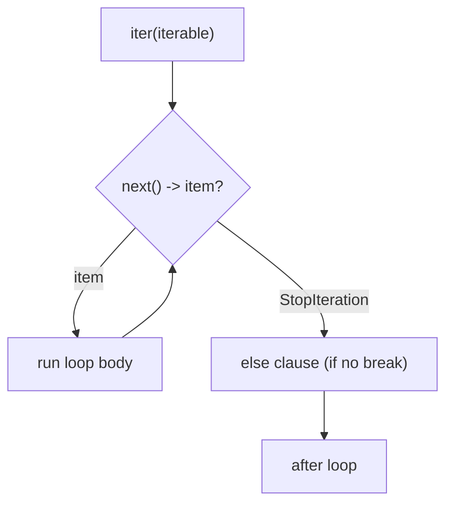

#### range

`range` produces integers lazily — it stores only start, stop, and step, so `range(10**9)` costs almost nothing until iterated. The stop value is exclusive, and a negative step counts down.

```python
for i in range(2, 11, 2):
    print(i)         # 2 4 6 8 10
```

The number line below visualizes `range(2, 11, 2)`: it starts at 2, stops *before* 11, and steps by 2.

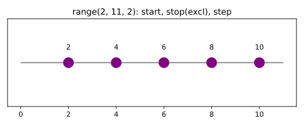

#### while

`while` repeats its body as long as the condition is truthy, re-testing before each pass. It is the right tool when the number of iterations isn't known up front — reading until a sentinel, retrying, converging.

```python
n, steps = 27, 0
while n != 1:                  # Collatz sequence
    n = n // 2 if n % 2 == 0 else 3 * n + 1
    steps += 1
print(steps)                   # 111
```

#### break, continue, and the loop else

`break` leaves the loop early; `continue` jumps to the next iteration. The loop `else` runs only if the loop was *not* broken out of — perfect for "search and report failure" patterns.

```python
for x in [3, 5, 7, 9]:
    if x % 2 == 0:
        print("found even")
        break
else:
    print("all odd")          # prints: no break occurred
```

#### enumerate and zip

`enumerate` pairs each item with its index, replacing the error-prone manual counter. `zip` walks several iterables in lockstep, stopping at the shortest, which is ideal for parallel sequences.

```python
names = ["Ada", "Bob"]
ages = [36, 41]
for i, (name, age) in enumerate(zip(names, ages), start=1):
    print(i, name, age)       # 1 Ada 36 / 2 Bob 41
```

### Real-world example

Processing a batch of jobs with a retry budget: iterate the jobs, retry transient failures up to a limit with a `while`, skip ones already done with `continue`, and use the loop `else` to confirm a clean run.

```python
def run_batch(jobs):
    for idx, job in enumerate(jobs):
        if job.get("done"):
            continue                      # skip finished jobs
        attempts = 0
        while attempts < 3:
            attempts += 1
            if job["payload"] % 2 == 0:   # pretend success on even
                job["done"] = True
                break
        if not job["done"]:
            print(f"job {idx} failed after {attempts} tries")
            break
    else:
        print("all jobs completed")

run_batch([{"payload": 2}, {"payload": 4}])   # all jobs completed
```

### In practice

Prefer iterating the object directly (`for line in file:`) over indexing (`for i in range(len(seq))`) — it is faster, clearer, and works on non-indexable iterables. Use `enumerate` when you genuinely need the index and `zip` for parallel iteration; combine them as `enumerate(zip(...))`. For large data, lean on lazy iterables (`range`, generators, `itertools`) so you never materialize the whole sequence in memory. The loop `else` is rare but precisely communicates "the loop completed without finding/breaking."

> [!TIP]
> `for i in range(len(seq)): seq[i]` is almost always a code smell. Use `for x in seq:` or `for i, x in enumerate(seq):` instead.

> [!WARNING]
> Mutating a list while iterating over it (adding/removing items) skips or repeats elements. Iterate a copy (`for x in list(seq):`) or build a new list instead.

### Pitfalls

- **"The loop `else` runs when the loop body's condition is false."** — It runs when the loop completed *without* a `break`; a `break` skips it.
- **"`range(stop)` includes `stop`."** — The interval is half-open; `range(5)` yields 0–4, never 5.
- **"`zip` pads shorter iterables."** — `zip` stops at the shortest; use `itertools.zip_longest` to pad.
- **"You must manage your own index counter."** — `enumerate` does it correctly and supports a `start=` offset.
- **"Modifying a list while looping over it is safe."** — It causes skipped/duplicated items; iterate a copy or collect changes and apply after.

## Type Casting

> **TL;DR:** Type casting converts a value of one type into another. Python does a few conversions *implicitly* (widening numeric types in arithmetic) but the conversions you write by hand are *explicit*, done through the builtin type constructors `int()`, `float()`, `str()`, `bool()`, `list()`, `tuple()`, `set()`, and `dict()`. Bad input to a numeric constructor raises `ValueError`, so parsing untrusted text always needs error handling.

### Vocabulary

**Type casting / conversion**

The act of producing a new object of a target type from an existing value. Python never mutates the original; it returns a fresh object.

**Implicit conversion (coercion)**

A conversion the interpreter performs automatically, e.g. promoting `int` to `float` when the two are mixed in arithmetic.

**Explicit conversion**

A conversion you request by calling a type constructor such as `int("42")`.

**Truncation toward zero**

```math
\text{int}(x) = \operatorname{trunc}(x) = \operatorname{sgn}(x)\,\lfloor |x| \rfloor
```

`int()` on a float drops the fractional part *toward zero* (so `int(-3.9)` is `-3`, not `-4`); it does not round.

**Radix / base**

The numeral base used to interpret a string of digits; `int(x, base)` accepts a `base` from 2 to 36, or 0 for prefix auto-detection.

### Intuition

Think of each builtin type as a small factory that knows how to *interpret* whatever you hand it. `int` knows how to read a digit string or chop a float; `list` knows how to walk any iterable and collect its items; `dict` knows how to read pairs. Casting is just calling the right factory. The factory either succeeds and returns a brand-new object, or it refuses loudly with an exception — it never silently returns garbage.

### How it works

Python's type constructors double as conversion functions. Calling `int(x)` is really constructing an `int` from `x`, and the `int` type defines how to do that for strings, floats, and booleans. The same pattern holds for every builtin. Understanding casting is therefore mostly understanding which source types each constructor accepts and what it does with them.

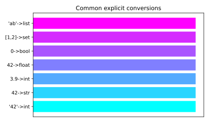

#### Implicit numeric coercion

When you mix numeric types, Python widens toward the more general type so no information is lost. An `int` mixed with a `float` becomes a `float`; either mixed with a `complex` becomes `complex`. This is the only place Python converts types behind your back, and it is restricted to numbers — strings and numbers are never coerced together.

```python
print(3 + 0.5)      # 3.5  -> int promoted to float
print(True + 4)     # 5    -> bool is a subclass of int
print(2 + 3j)       # (2+3j) -> promoted to complex
```

#### Numeric constructors: int() and float()

`int()` and `float()` parse strings or convert other numbers. `int()` on a float truncates toward zero rather than rounding, and on a string it requires a clean integer literal (no decimal point). `float()` accepts decimal and scientific notation as well as the special tokens `"inf"` and `"nan"`.

```python
print(int(3.9))        # 3   (truncates toward zero)
print(int(-3.9))       # -3  (toward zero, not floor)
print(int("  42  "))   # 42  (surrounding whitespace is fine)
print(float("1e3"))    # 1000.0
```

#### Parsing with a base

`int(x, base)` interprets a *string* of digits in the given radix. The base ranges from 2 to 36; base 0 tells Python to honor a literal prefix (`0x`, `0o`, `0b`) and otherwise treat the number as decimal. Note that supplying a base is only legal when the first argument is a string.

```python
print(int("ff", 16))   # 255
print(int("1010", 2))  # 10
print(int("0x1A", 0))  # 26  (prefix auto-detected)
```

#### str() and bool()

`str(x)` returns a human-readable text form of any object by calling its `__str__`. `bool(x)` applies Python's truthiness rules: numeric zero, empty containers, empty strings, and `None` are falsy; everything else is truthy. These two almost never raise.

```python
print(str(42))     # "42"
print(str([1, 2])) # "[1, 2]"
print(bool(0))     # False
print(bool("0"))   # True  (non-empty string!)
print(bool([]))    # False
```

#### Container constructors

`list()`, `tuple()`, and `set()` each consume any *iterable* and collect its elements. `dict()` builds a mapping either from keyword arguments or from an iterable of key–value pairs. Casting between containers is how you change a collection's properties — e.g. `set()` to deduplicate, then `list()` to make it ordered and indexable again.

```python
print(list("abc"))             # ['a', 'b', 'c']
print(tuple([1, 2, 3]))        # (1, 2, 3)
print(set([1, 1, 2, 3]))       # {1, 2, 3}  (deduplicated)
print(dict([("a", 1), ("b", 2)]))  # {'a': 1, 'b': 2}
```

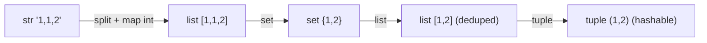

### Real-world example

A CLI tool reads a quantity typed by the user. Input arrives as a string, so it must be cast to `int` — and because users mistype, the cast is wrapped to convert failures into a friendly message.

```python
def read_quantity(raw: str) -> int:
    """Parse a user-supplied quantity, defaulting to 1 on bad input."""
    raw = raw.strip()
    try:
        qty = int(raw)            # explicit cast; ValueError if not an int literal
    except ValueError:
        print(f"'{raw}' is not a whole number; using 1.")
        return 1
    return max(qty, 0)            # clamp negatives to zero

for sample in ["7", "  3 ", "two", "-5"]:
    print(sample, "->", read_quantity(sample))
# 7 -> 7
#   3  -> 3
# two -> 'two' is not a whole number; using 1.  -> 1
# -5 -> 0
```

### In practice

- **Always guard casts of untrusted input.** Wrap `int()`/`float()` on user, file, or network data in `try/except ValueError`.
- **Deduplicate fast** with `list(set(items))` — but remember it discards order. Use `dict.fromkeys(items)` when you need dedup *and* insertion order.
- `int(float("3.9"))` is the idiom to parse a decimal string into a truncated integer, since `int("3.9")` raises.
- Prefer `Decimal` (from `decimal`) over `float()` for money, because binary floats can't represent `0.1` exactly.

> [!TIP]
> `bool` is a subclass of `int`, so `True == 1` and `sum([True, True, False])` is `2`. This makes `sum(condition for x in data)` a clean way to count how many items satisfy a predicate.

### Pitfalls

- **`int("3.9")` should work** — it raises `ValueError`. The string must be a valid *integer* literal; parse with `int(float("3.9"))` instead.
- **`int(-3.9)` rounds to `-4`** — it truncates toward zero to `-3`. Use `math.floor` for true flooring.
- **`bool("False")` is `False`** — it is `True`, because the string is non-empty. Truthiness looks at emptiness, not content.
- **`int("ff")` reads hex** — without a base it raises; you must write `int("ff", 16)`.
- **`list("hello")` wraps the string** — it explodes it into `['h','e','l','l','o']`, because a string is itself an iterable of characters. Use `["hello"]` to get a one-element list.

## Exceptions

> **TL;DR:** Exceptions are Python's mechanism for signaling and recovering from errors. A `raise` propagates an exception object *up* the call stack, unwinding frames until a matching `except` catches it; uncaught, it terminates the program with a traceback. The `try / except / else / finally` block, custom exception classes, and the EAFP ("ask forgiveness") idiom are the core tools.

### Vocabulary

**Exception**

An object representing an error or other exceptional event. Every exception is an instance of a class derived from `BaseException`.

**Raising**

Triggering an exception with the `raise` statement, which begins propagation up the stack.

**Handling / catching**

Intercepting a propagating exception with an `except` clause whose class matches the exception's type (or a base class of it).

**Traceback**

The report of the call-stack frames an exception passed through before terminating the program; printed to `stderr`.

**EAFP**

"Easier to Ask Forgiveness than Permission" — try the operation and handle the exception, rather than pre-checking. Contrasted with **LBYL** ("Look Before You Leap").

**Exception chaining**

Linking a new exception to the one that caused it, exposed via `__cause__` (explicit, `raise ... from ...`) or `__context__` (implicit).

### Intuition

Picture the call stack as a stack of plates, each plate a function in progress. When something goes wrong deep in the stack, raising an exception is like a flare that shoots straight up: Python pops plates one at a time, asking each "do you have an `except` that catches this?" The first frame that says yes handles it and execution resumes there. If the flare reaches the top with no taker, Python prints the whole path it travelled — the traceback — and stops.

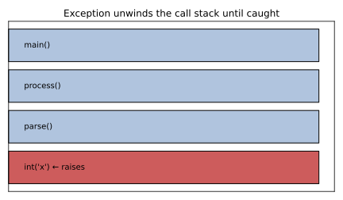

### How it works

Exception handling rests on a single control-flow rule: a raised exception abandons the current normal flow and searches outward through enclosing `try` blocks for a handler. The `try` statement bundles the protected code with up to four kinds of clause, each running at a different moment. Below the syntax sits a class hierarchy that decides which handlers match.

#### try / except / else / finally

The `try` block holds code that might fail. Each `except` names the exception type(s) it catches and runs only if a matching exception occurred. The optional `else` runs only when *no* exception was raised, and `finally` runs *unconditionally* — on success, on a handled error, even on an unhandled one — making it the place for cleanup.

```python
def divide(a, b):
    try:
        result = a / b
    except ZeroDivisionError as exc:
        print(f"cannot divide: {exc}")
        return None
    else:
        print("division succeeded")   # only when no exception
        return result
    finally:
        print("cleanup runs no matter what")

divide(10, 2)   # success -> else + finally
divide(10, 0)   # error   -> except + finally
```

#### The exception hierarchy

Every exception type descends from `BaseException`. You almost always catch from `Exception`, its main subclass; the siblings of `Exception` under `BaseException` — `SystemExit`, `KeyboardInterrupt`, `GeneratorExit` — are control signals you should *not* swallow. Because `except` matches subclasses, catching a base type catches all of its descendants.

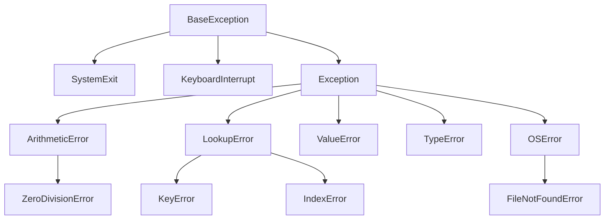

#### raise and raise from

`raise SomeError("message")` constructs and throws an exception. Inside an `except` block, a bare `raise` re-raises the current one unchanged — useful for logging then propagating. `raise NewError(...) from cause` performs *explicit chaining*, recording that the new exception was deliberately triggered by `cause` and showing both in the traceback.

```python
def load_config(path):
    try:
        with open(path) as f:
            return f.read()
    except FileNotFoundError as exc:
        # translate a low-level error into a domain error, keeping the trail
        raise RuntimeError(f"config missing: {path}") from exc
```

#### Custom exception classes

Define your own exceptions by subclassing `Exception` so callers can catch *your* errors specifically without accidentally catching unrelated ones. A custom hierarchy (one base per package, specific subclasses beneath) lets users catch broadly or narrowly. Adding attributes carries structured context with the error.

```python
class PaymentError(Exception):
    """Base class for all payment failures."""

class InsufficientFunds(PaymentError):
    def __init__(self, needed, available):
        super().__init__(f"need {needed}, have {available}")
        self.shortfall = needed - available
```

#### EAFP vs LBYL

Python idiom favors **EAFP**: attempt the operation and catch the failure, rather than checking every precondition first. EAFP is often faster (no redundant checks on the happy path) and avoids race conditions where state changes between the check and the use. LBYL still wins when a check is cheap and an exception would be costly or noisy.

```python
# EAFP — preferred
try:
    value = config["timeout"]
except KeyError:
    value = 30

# LBYL — works, but checks then re-looks-up
if "timeout" in config:
    value = config["timeout"]
else:
    value = 30
```

### Real-world example

A batch job processes a list of records and must not abort the whole run because one record is malformed. It catches per-record errors, chains them onto a domain exception for logging context, and uses `finally` to guarantee the progress counter is updated.

```python
class RecordError(Exception):
    pass

def process(records):
    failures = []
    for i, raw in enumerate(records):
        try:
            qty = int(raw["qty"])          # may raise ValueError / KeyError
            if qty < 0:
                raise RecordError("negative quantity")
        except (ValueError, KeyError, RecordError) as exc:
            failures.append((i, exc))
            continue                       # keep going with the next record
        else:
            print(f"row {i}: ok, qty={qty}")
        finally:
            pass  # e.g. metrics.increment("rows_seen")
    return failures

data = [{"qty": "5"}, {"qty": "-1"}, {"qty": "two"}, {}]
print(process(data))
# row 0: ok, qty=5
# [(1, RecordError('negative quantity')), (2, ValueError(...)), (3, KeyError('qty'))]
```

### In practice

- **Catch narrow, not bare.** `except Exception` is broad; `except:` (bare) also catches `KeyboardInterrupt`/`SystemExit` and is almost always a bug.
- **Use `finally` or a context manager for cleanup.** A `with` block (context manager) is the idiomatic way to release files, locks, and connections — it runs `__exit__` even on exceptions.
- **Chain when translating errors** so the original cause survives in the traceback; let implicit chaining (`__context__`) happen naturally when a handler itself fails.
- **Don't use exceptions for ordinary control flow** that has a clean predicate — but *do* use them across deep call stacks where return-code threading would be noisy.

> [!WARNING]
> `except Exception: pass` silently swallows every error, including bugs you didn't anticipate. At minimum log the exception; better, catch only the specific types you can actually recover from.

> [!NOTE]
> A context manager (`with open(...) as f:`) is sugar over `try/finally`: its `__exit__` runs on the way out whether or not an exception occurred, which is why it replaces most manual `finally` cleanup.

### Pitfalls

- **`finally` is skipped if an exception occurs** — it runs *unconditionally*, even when an unhandled exception is propagating or the `try` block `return`s.
- **`except (A, B)` is `except A or B`** — the parentheses form a tuple of types; writing `except A, B` is a syntax error in Python 3.
- **Catching a base class misses nothing** — it catches all subclasses too, so `except LookupError` also handles `KeyError` and `IndexError`.
- **A bare `raise` outside a handler fails** — re-raising with bare `raise` only works inside an `except` block; elsewhere it raises `RuntimeError: No active exception`.
- **`except Exception` catches `KeyboardInterrupt`** — it does not; `KeyboardInterrupt` and `SystemExit` derive from `BaseException`, not `Exception`, so they pass through.

## Functions and Builtin Functions

> **TL;DR:** A function packages reusable behavior behind a name, taking inputs as parameters and handing back a value with `return`. Python's parameter system is rich — positional, keyword, default, variadic `*args`/`**kwargs`, and positional-only (`/`) / keyword-only (`*`) markers — and name lookup follows the LEGB rule. On top of your own functions, Python ships builtins like `len`, `enumerate`, `zip`, `map`, `sorted`, and `sum` that cover most everyday iteration.

### Vocabulary

**Function**

A named, reusable block of code defined with `def`, invoked by calling its name with arguments.

**Parameter vs argument**

A *parameter* is the variable named in the `def`; an *argument* is the concrete value passed at the call site.

**`*args` / `**kwargs`**

Variadic parameters that collect surplus positional arguments into a tuple (`*args`) and surplus keyword arguments into a dict (`**kwargs`).

**LEGB**

The name-resolution order: **L**ocal, **E**nclosing, **G**lobal, **B**uilt-in — the scopes Python searches to bind a name.

**Docstring**

The string literal as a function's first statement, stored on `__doc__` and read by `help()`.

### Intuition

A function is a contract: "give me these inputs, I'll give you this output." The body is a private workspace — names you create inside vanish when the call returns. Parameters are the labelled slots on the contract; Python's flexible parameter syntax just gives you control over *how* callers may fill those slots: by position, by name, with defaults, or in unbounded number. The builtin functions are pre-signed contracts the language hands you for free.

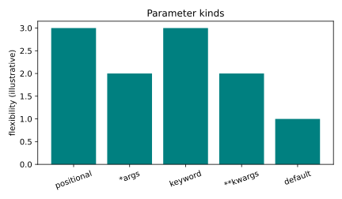

### How it works

`def name(params):` binds a function object to `name`; calling it creates a new local scope, binds arguments to parameters, runs the body, and returns either an explicit value or `None`. The interesting part is the parameter-matching rules and how Python resolves names referenced inside the body.

#### Defining and returning

A function ends either by reaching the bottom of its body or by hitting a `return`. A bare `return` (or none at all) yields `None`. A function may have several `return` statements on different branches, and the first one reached wins.

```python
def classify(n):
    if n == 0:
        return "zero"
    if n > 0:
        return "positive"
    return "negative"        # reached only if both ifs are false

print(classify(-4))          # negative
```

#### Positional, keyword, and default arguments

Arguments bind to parameters left-to-right by position, or by name as keyword arguments, which may be given in any order. Default values make a parameter optional; defaults must follow non-default parameters in the signature.

```python
def connect(host, port=5432, *, timeout=30):
    return f"{host}:{port} (t={timeout})"

print(connect("db"))                       # db:5432 (t=30)
print(connect("db", 6543))                 # positional override of port
print(connect("db", timeout=5))            # keyword skips straight to timeout
```

#### *args and **kwargs

Prefixing a parameter with `*` collects all extra positional arguments into a tuple; `**` collects all extra keyword arguments into a dict. They let a function accept an arbitrary number of inputs and are also used at *call* sites to unpack an iterable or mapping into arguments.

```python
def report(label, *values, **options):
    print(label, values, options)

report("nums", 1, 2, 3, sep=", ", end="!")
# nums (1, 2, 3) {'sep': ', ', 'end': '!'}

nums = [10, 20]
report("unpacked", *nums)   # *nums spreads the list into positional args
```

#### Positional-only (/) and keyword-only (*) markers

A `/` in the signature marks every parameter *before* it as positional-only — callers may not pass them by name. A bare `*` marks every parameter *after* it as keyword-only — callers *must* name them. These let API authors keep parameter names free to rename and force clarity at call sites.

```python
def make(weight, /, color="red", *, fragile=False):
    return (weight, color, fragile)

make(5, "blue", fragile=True)   # ok
# make(weight=5)                # error: weight is positional-only
# make(5, "blue", True)         # error: fragile is keyword-only
```

#### Scope and the LEGB rule

When the body references a name, Python searches **L**ocal (this call), then **E**nclosing (any wrapping function), then **G**lobal (the module), then **B**uilt-in. Assignment inside a function creates a *local* name by default; use `global` or `nonlocal` to rebind an outer name instead.

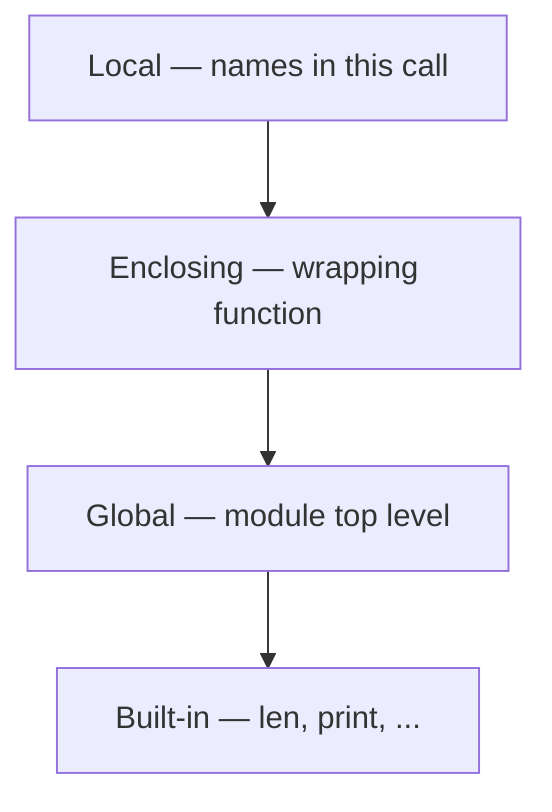

#### Docstrings and key builtins

A docstring documents the function's contract and is surfaced by `help()` and IDEs. Beyond your functions, Python's builtins handle most iteration: `len`, `range`, `enumerate` (index + item), `zip` (parallel iteration), `map`/`filter` (transform/select), `sorted` (ordered copy, with a `key`), and the reducers `sum`, `any`, `all`.

```python
def mean(values):
    """Return the arithmetic mean, or 0.0 for an empty input."""
    return sum(values) / len(values) if values else 0.0
```

### Real-world example

An order pipeline computes a per-customer summary. It uses `enumerate` for line numbers, `zip` to pair names with totals, `sorted` with a `key` to rank, and `any`/`sum` as boolean and numeric reducers — a tour of the everyday builtins in one place.

```python
def summarize(names, totals):
    """Print ranked customer totals and flag any big spender."""
    paired = list(zip(names, totals))                  # pair the two lists
    ranked = sorted(paired, key=lambda p: p[1], reverse=True)
    for rank, (name, total) in enumerate(ranked, start=1):
        print(f"{rank}. {name}: ${total}")
    print("grand total:", sum(totals))
    print("has VIP:", any(t > 1000 for t in totals))

summarize(["Ana", "Ben", "Cy"], [450, 1200, 800])
# 1. Ben: $1200
# 2. Cy: $800
# 3. Ana: $450
# grand total: 2450
# has VIP: True
```

### In practice

- **`map`/`filter` vs comprehensions:** a list comprehension is usually more readable than `list(map(...))`; reach for `map`/`filter` when you already have a named function to apply.
- **`sorted(data, key=...)`** is the workhorse for ordering; pass `reverse=True` to descend and a tuple-returning `key` for multi-level sorts.
- **`enumerate(seq, start=1)`** beats manual index counters; **`zip`** stops at the shortest input, so use `itertools.zip_longest` to pad.
- **Docstrings** belong on every public function — they power `help()`, tooltips, and `doctest`.

> [!TIP]
> `any()` and `all()` short-circuit: `any` stops at the first truthy element, `all` at the first falsy one. Feeding them a generator expression (`any(x > 0 for x in big)`) avoids materializing the whole sequence.

### Pitfalls

- **A mutable default is created fresh each call** — it is created *once* at definition time and shared across calls, so `def f(x, acc=[]):` accumulates between calls. Use `acc=None` then `acc = acc or []` inside.
- **`return` and `print` are interchangeable** — `print` only displays; a function that needs to feed other code must `return` the value.
- **Assigning to a global name inside a function changes it** — it instead shadows it with a new local, often causing `UnboundLocalError`; declare `global`/`nonlocal` to rebind.
- **`zip` keeps the longest input** — it truncates to the *shortest*, silently dropping trailing items of longer iterables.
- **`sorted` sorts in place** — it returns a *new* list and leaves the input untouched; `list.sort()` is the in-place mutator that returns `None`.

## Sources

- [Python Language Reference — Lexical analysis](https://docs.python.org/3/reference/lexical_analysis.html)
- [The Python Tutorial — An Informal Introduction](https://docs.python.org/3/tutorial/introduction.html)
- [PEP 8 — Style Guide for Python Code](https://peps.python.org/pep-0008/)
- [Python Language Reference — Objects, values and types](https://docs.python.org/3/reference/datamodel.html#objects-values-and-types)
- [Built-in Types](https://docs.python.org/3/library/stdtypes.html)
- [The Python Tutorial — Numbers](https://docs.python.org/3/tutorial/introduction.html#numbers)
- [Python Language Reference — Expressions & operator precedence](https://docs.python.org/3/reference/expressions.html#operator-precedence)
- [Data model — Emulating numeric types](https://docs.python.org/3/reference/datamodel.html#emulating-numeric-types)
- [PEP 572 — Assignment Expressions (walrus)](https://peps.python.org/pep-0572/)
- [Text Sequence Type — str](https://docs.python.org/3/library/stdtypes.html#text-sequence-type-str)
- [Format Specification Mini-Language](https://docs.python.org/3/library/string.html#format-spec)
- [PEP 498 — Literal String Interpolation (f-strings)](https://peps.python.org/pep-0498/)
- [Unicode HOWTO](https://docs.python.org/3/howto/unicode.html)
- [The if statement](https://docs.python.org/3/reference/compound_stmts.html#the-if-statement)
- [Truth Value Testing](https://docs.python.org/3/library/stdtypes.html#truth-value-testing)
- [Conditional expressions](https://docs.python.org/3/reference/expressions.html#conditional-expressions)
- [PEP 634 — Structural Pattern Matching](https://peps.python.org/pep-0634/)
- [The for statement](https://docs.python.org/3/reference/compound_stmts.html#the-for-statement)
- [The while statement](https://docs.python.org/3/reference/compound_stmts.html#the-while-statement)
- [Iterator Types](https://docs.python.org/3/library/stdtypes.html#iterator-types)
- [Built-in functions: range, enumerate, zip](https://docs.python.org/3/library/functions.html)
- [Built-in Functions — `int`, `float`, `str`, `bool`](https://docs.python.org/3/library/functions.html)
- [Built-in Types — Numeric, Boolean, Sequence, Set, Mapping](https://docs.python.org/3/library/stdtypes.html)
- [`decimal` — Decimal fixed point and floating point arithmetic](https://docs.python.org/3/library/decimal.html)
- [Errors and Exceptions — Python Tutorial](https://docs.python.org/3/tutorial/errors.html)
- [Built-in Exceptions — the hierarchy](https://docs.python.org/3/library/exceptions.html)
- [`compound_stmts` — the `try` statement reference](https://docs.python.org/3/reference/compound_stmts.html#the-try-statement)
- [PEP 3134 — Exception Chaining and Embedded Tracebacks](https://peps.python.org/pep-3134/)
- [Defining Functions — Python Tutorial](https://docs.python.org/3/tutorial/controlflow.html#defining-functions)
- [Built-in Functions](https://docs.python.org/3/library/functions.html)
- [PEP 570 — Positional-Only Parameters](https://peps.python.org/pep-0570/)
- [PEP 3102 — Keyword-Only Arguments](https://peps.python.org/pep-3102/)

## Related

- [Built-in Data Structures](./02-builtin-data-structures.md)
- [Advanced Functions](./03-advanced-functions.md)
- [Typing and Tooling](./08-typing-and-tooling.md)
- [OOP](./05-oop.md)
