# Python Built-in Data Structures

[toc]

> **TL;DR:** Python's core containers each trade off mutability, ordering, and access cost: `list` (mutable dynamic array), `tuple` (immutable, hashable record), `set` (hash-table membership and algebra), and `dict` (hash-table key→value mapping with insertion order). Comprehensions build these collections eagerly in one expression, while generator expressions produce the same results lazily in O(1) memory.

## Lists

> **TL;DR:** A Python `list` is a mutable, ordered sequence backed by a dynamic array of object references. Appends are amortized O(1) thanks to geometric over-allocation, while operations that shift elements — `insert(0, x)`, `pop(0)`, `remove`, membership tests — are O(n).

### Vocabulary

**Dynamic array**

A contiguous block of pointers that grows by reallocating to a larger block when full. The list stores references, not the objects themselves.

**Amortized complexity**

```math
O(1)\ \text{amortized}
```

The average cost per operation over a long sequence, even when individual operations occasionally cost O(n) (a resize).

**Over-allocation**

CPython reserves more slots than currently needed so that most appends avoid a reallocation.

**Shallow copy**

A new list whose elements are the *same* referenced objects as the original.

**Deep copy**

A new list whose nested objects are themselves recursively copied, sharing nothing with the original.

**Slice**

A sub-sequence selected by `lst[start:stop:step]`, producing a new list.

### Intuition

Think of a list as a numbered row of mailboxes. Each mailbox holds an address (a reference) to some object living elsewhere in memory. Reading or overwriting any mailbox by index is instant because you can jump straight to slot `i`. Inserting at the front, though, forces every later mailbox to shift over one position — expensive when there are many.

When the row of mailboxes fills up, Python rents a bigger row, copies the addresses over, and frees the old one. Because it grabs *extra* boxes each time (geometric growth), this copying happens rarely, so appending stays cheap on average.

### How it works

A CPython list is a `PyListObject` holding a pointer to an array of `PyObject*`, a current length, and an allocated capacity. The separation of length from capacity is what enables cheap appends and explains why some operations are fast and others slow.

#### Dynamic array and amortized append

When you `append` and the array is full, CPython allocates a new array roughly `1.125×` larger (plus a constant), copies the existing pointers, and frees the old block. Because growth is geometric, the total copying work across n appends is O(n), giving O(1) amortized per append. The figure below summarizes which operations are cheap versus linear.

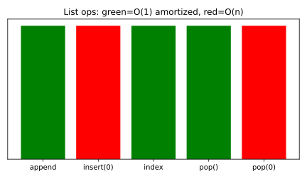

```python
import sys

lst = []
prev = -1
for i in range(10):
    lst.append(i)
    cap = sys.getsizeof(lst)
    if cap != prev:           # capacity jumped (a resize happened)
        print(f"len={len(lst):2d}  bytes={cap}")
        prev = cap
```

#### Indexing, slicing, and slice assignment

Indexing with `lst[i]` is O(1) random access. Slicing produces a brand-new list (a shallow copy of the selected references), so `lst[:]` is the idiomatic shallow copy. Slice *assignment* can splice, replace, or delete a run of elements in place, even changing the list's length.

```python
nums = [0, 1, 2, 3, 4, 5]
print(nums[1:4])        # [1, 2, 3]  -> new list
print(nums[::-1])       # [5, 4, 3, 2, 1, 0]  reversed copy
nums[1:3] = [10, 20, 30]  # splice: replaces 2 items with 3
print(nums)             # [0, 10, 20, 30, 3, 4, 5]
del nums[0:2]           # delete a slice
print(nums)             # [20, 30, 3, 4, 5]
```

#### Mutating methods

Lists mutate in place. `append` adds one item; `extend` (or `+=`) appends every item of an iterable; `insert(i, x)` places `x` before index `i` and shifts the rest; `pop()` removes and returns the last item (O(1)) while `pop(0)` removes the first (O(n)); `remove(x)` deletes the first matching value; `sort()` orders in place with Timsort.

```python
xs = [3, 1, 2]
xs.append(4)            # [3, 1, 2, 4]
xs.extend([5, 6])       # [3, 1, 2, 4, 5, 6]
xs.insert(0, 0)         # [0, 3, 1, 2, 4, 5, 6]  -- O(n) shift
xs.remove(3)            # [0, 1, 2, 4, 5, 6]
xs.sort(reverse=True)   # [6, 5, 4, 2, 1, 0]  -- Timsort, in place
last = xs.pop()         # 0  -> O(1)
```

#### Comprehensions

A list comprehension builds a new list from an iterable with optional filtering, replacing a verbose `for`/`append` loop with one readable expression. It runs in a tight C loop, so it is both faster and clearer than the manual version. Nested loops and conditionals are allowed but should stay shallow for readability.

```python
squares = [n * n for n in range(6)]            # [0, 1, 4, 9, 16, 25]
evens   = [n for n in range(10) if n % 2 == 0] # [0, 2, 4, 6, 8]
pairs   = [(r, c) for r in range(2) for c in range(2)]
```

#### Copy vs reference

Assignment never copies a list — it binds a second name to the *same* object, so mutations are visible through both names. `lst[:]`, `list(lst)`, and `copy.copy` make a shallow copy (new outer list, shared inner objects), whereas `copy.deepcopy` recursively clones nested objects too.

```python
import copy
a = [[1, 2], [3, 4]]
b = a            # alias: same object
c = a[:]         # shallow copy: new outer, shared inner lists
d = copy.deepcopy(a)

a.append([5, 6])
print(b)         # [[1, 2], [3, 4], [5, 6]]  -- alias sees it
print(c)         # [[1, 2], [3, 4]]          -- copy did not grow
a[0].append(99)
print(c[0])      # [1, 2, 99]  -- shared inner list mutated!
print(d[0])      # [1, 2]      -- deep copy untouched
```

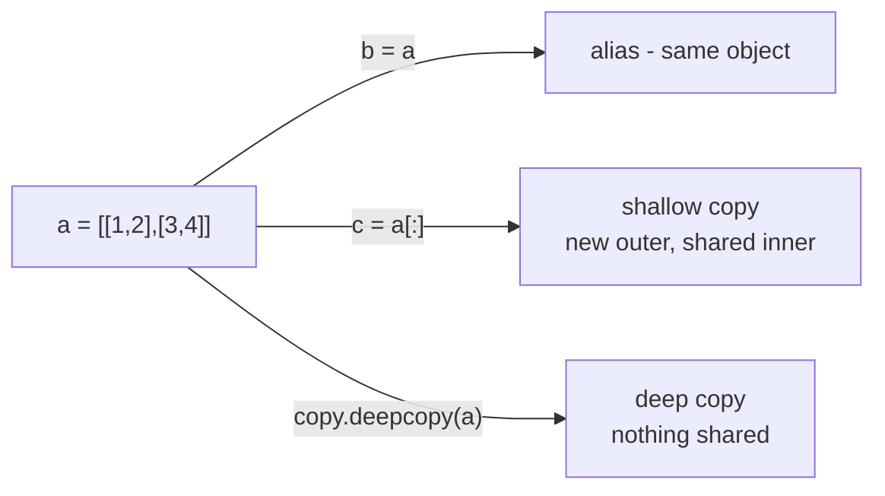

### Real-world example

You are tallying a rolling window of the last N sensor readings to compute a moving average. A plain list works, but note that dropping the oldest reading with `pop(0)` is O(n); for high-throughput windows you would switch to `collections.deque`, which pops from the front in O(1).

```python
def moving_average(readings, window=3):
    buf = []
    out = []
    for x in readings:
        buf.append(x)              # amortized O(1)
        if len(buf) > window:
            buf.pop(0)             # O(n): shifts everything left
        out.append(sum(buf) / len(buf))
    return out

print(moving_average([10, 20, 30, 40, 50]))
# [10.0, 15.0, 20.0, 30.0, 40.0]
```

### In practice

- Prefer `append`/`pop()` at the end; reach for `collections.deque` when you need fast front operations.
- Use comprehensions over `for`+`append` for clarity and speed; use a generator (`(... for ...)`) instead when you only iterate once and want to avoid building the whole list.
- `lst.sort()` sorts in place and returns `None`; `sorted(lst)` returns a new sorted list. Don't confuse them.
- Membership (`x in lst`) is O(n); if you test membership repeatedly, build a `set` once.
- Building a string by `+=` on a list of characters then `"".join(...)` is the canonical fast pattern.

### Pitfalls

- **Slicing makes a deep copy** — it makes only a *shallow* copy; nested lists remain shared. Use `copy.deepcopy` to clone nesting.
- **`b = a` copies the list** — it merely creates an alias; mutating through `a` is visible through `b`.
- **`[[]] * 3` gives three independent lists** — it gives three references to the *same* inner list. Use `[[] for _ in range(3)]`.
- **`pop(0)` is as cheap as `pop()`** — `pop(0)` is O(n) because every later element shifts left.
- **`lst.sort()` returns a sorted list** — it returns `None` and sorts in place; use `sorted()` for a returned copy.
- **`list.append(other_list)` flattens** — `append` adds the list as a single nested element; use `extend` to add its items.

## Tuples

> **TL;DR:** A `tuple` is an immutable, ordered sequence. Immutability makes tuples hashable (so they can be dict keys and set members), more memory-compact than lists, and the natural vehicle for packing/unpacking multiple values.

### Vocabulary

**Tuple**

An immutable, fixed-length ordered sequence written with commas, usually wrapped in parentheses: `(1, 2, 3)`.

**Immutability**

The property that an object's contents cannot change after creation; you can only build a new object.

**Hashable**

An object with a stable `__hash__` value over its lifetime, qualifying it as a dict key or set element. Tuples are hashable only if *all* their elements are.

**Packing**

Combining several values into one tuple: `t = 1, 2, 3`.

**Unpacking**

Distributing a tuple's elements into separate names: `a, b, c = t`.

**`namedtuple`**

A factory from `collections` producing tuple subclasses whose fields are also accessible by name.

### Intuition

A tuple is a list that has been "frozen": same ordered slots, but once built you cannot append, remove, or reassign. Treat a tuple as a single immutable record — a coordinate `(x, y)`, an RGB color, a database row — rather than as a growable container. Because Python knows its size and contents will never change, it can store it more tightly and let it act as a key.

The comma, not the parentheses, is what makes a tuple. `(1)` is just the integer `1`; `(1,)` is a one-element tuple. The parentheses are usually present only for grouping and readability.

### How it works

Tuples are fixed-length arrays of object references created once and never resized. CPython exploits this: there is no spare capacity to track and small tuples are cached and reused, which is why a tuple of n items is smaller than the equivalent list.

#### Immutability and memory

Because a tuple cannot grow, CPython allocates exactly the slots it needs with no over-allocation overhead, so a tuple is more compact than a list of the same elements. The plot below contrasts the byte size of lists and tuples as element count grows. Immutability is shallow: the tuple's references are fixed, but a *mutable* object it references can still change internally.

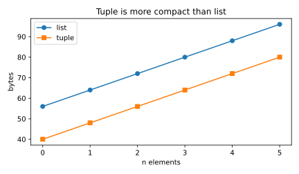

```python
import sys
print(sys.getsizeof([1, 2, 3]))   # e.g. 88
print(sys.getsizeof((1, 2, 3)))   # e.g. 64  -> smaller

t = ([1, 2], 3)
t[0].append(99)        # allowed: the inner list is mutable
print(t)               # ([1, 2, 99], 3)
# t[0] = []            # TypeError: tuples don't support item assignment
```

#### Packing and unpacking

Assigning a comma-separated sequence to one name packs a tuple; assigning a tuple to a comma-separated set of names unpacks it. Unpacking powers multiple assignment, the no-temp swap `a, b = b, a`, and iterating over `dict.items()`. A starred name (`*rest`) absorbs any number of middle or trailing elements into a list.

```python
point = 3, 4               # packing -> (3, 4)
x, y = point               # unpacking
a, b = b, a = 1, 2         # swap idiom uses a tuple under the hood

first, *middle, last = (10, 20, 30, 40, 50)
print(first, middle, last) # 10 [20, 30, 40] 50
```

#### Hashability and tuple keys

A tuple's hash is derived from the hashes of its elements, so a tuple is hashable exactly when every element is hashable. This lets tuples serve as composite dictionary keys or set members — ideal for indexing data by a pair like `(row, col)` or `(lat, lon)`. A tuple containing a list is *not* hashable and will raise at insert time.

```python
grid = {}
grid[(0, 0)] = "origin"
grid[(1, 2)] = "target"
print(grid[(1, 2)])        # target

# {(1, [2])}               # TypeError: unhashable type: 'list'
```

#### namedtuple

A plain tuple's positional access (`row[2]`) is cryptic. `collections.namedtuple` builds a lightweight, immutable record type with named fields while remaining a real tuple — still indexable, unpackable, and hashable, but far more readable. It costs no per-instance dict, so it stays memory-cheap.

```python
from collections import namedtuple

Color = namedtuple("Color", ["r", "g", "b"])
c = Color(255, 128, 0)
print(c.r, c[0])           # 255 255  (name or index)
r, g, b = c                # still unpacks like a tuple
print(c._replace(g=200))   # Color(r=255, g=200, b=0) -> new tuple
```

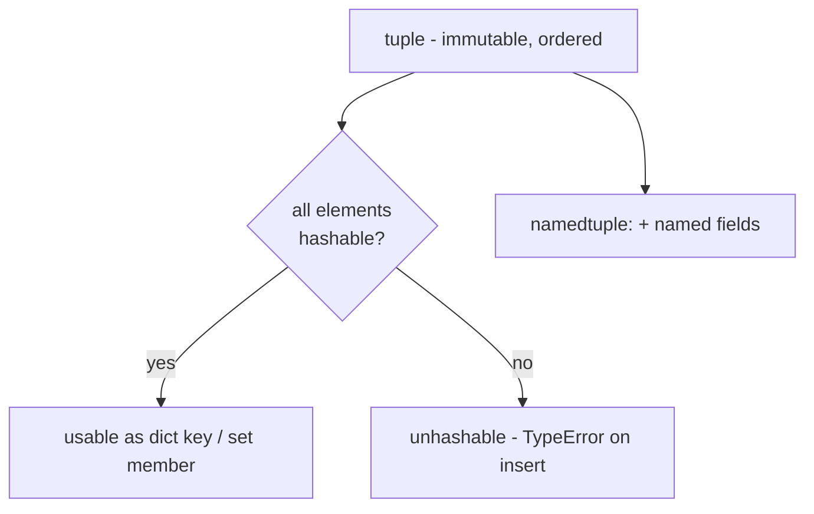

### Real-world example

A function often needs to return several related values. Returning a tuple lets the caller unpack them by name at the call site, which is clearer and lighter than building a dict or class. Here we return both the quotient and remainder of a division.

```python
def divmod_pair(a, b):
    return a // b, a % b      # packs a tuple

quotient, remainder = divmod_pair(17, 5)   # unpacks at call site
print(quotient, remainder)                 # 3 2

# Tuples shine as dict keys for multi-dimensional data:
distances = {}
distances[("NYC", "LAX")] = 3944
distances[("NYC", "ORD")] = 1188
print(distances[("NYC", "LAX")])           # 3944
```

### In practice

- Use a tuple for a fixed, heterogeneous record (a row, a coordinate); use a list for a homogeneous, growable collection.
- Prefer `namedtuple` (or `typing.NamedTuple` / a `@dataclass(frozen=True)`) when fields have meaning, to avoid magic indices.
- Returning multiple values from a function returns a tuple by convention; unpack it immediately.
- A single-element tuple needs the trailing comma: `(x,)`, not `(x)`.
- Tuples are slightly faster to construct and iterate than lists and can be used wherever a hashable sequence is required.

### Pitfalls

- **Parentheses make a tuple** — the *comma* does; `(5)` is an int, `(5,)` is a tuple.
- **Tuples are fully immutable** — only their references are fixed; a contained list can still be mutated in place.
- **Any tuple can be a dict key** — only if every element is hashable; a tuple holding a list cannot.
- **`tuple += (x,)` mutates the tuple** — it rebinds the name to a brand-new tuple; the original is unchanged.
- **Tuples are just read-only lists** — semantically they signal a fixed-shape record, which is why APIs use them for return values and keys.

## Sets

> **TL;DR:** A `set` is an unordered collection of distinct, hashable elements backed by a hash table, giving average O(1) membership, insertion, and deletion. Sets support mathematical algebra — union, intersection, difference, symmetric difference — and come in a mutable `set` and an immutable, hashable `frozenset`.

### Vocabulary

**Set**

An unordered, mutable collection of unique hashable elements written `{1, 2, 3}`.

**Hashable**

An object with a stable `__hash__` and a meaningful `__eq__`, allowing it to be slotted into a hash table.

**Membership test**

The `x in s` check, which a set answers in average O(1) by hashing `x` and probing one bucket.

**`frozenset`**

An immutable, hashable set; usable as a dict key or as an element of another set.

**Symmetric difference**

```math
A \triangle B = (A \cup B) \setminus (A \cap B)
```

Elements in exactly one of two sets, written `A ^ B`.

### Intuition

A set is a bag where every item appears at most once and where the only questions you can ask quickly are "is this in the bag?" and "give me the items two bags share." Instead of scanning element by element like a list, a set computes a hash of each element and uses it as an address, so lookups jump straight to the right slot. The price is that order is not preserved and only hashable items are allowed.

Picture two overlapping circles (a Venn diagram). Set algebra — union, intersection, difference, symmetric difference — is just describing regions of that picture, and Python gives you an operator for each.

### How it works

A CPython set is a hash table storing only keys (no values). Each element's hash chooses a bucket; collisions are resolved by open addressing. Because the table is kept sparse, the expected number of probes per operation is small, yielding O(1) average behavior.

#### Uniqueness and O(1) membership

When you add an element, the set hashes it and checks whether an equal element already occupies the target bucket; duplicates are silently discarded, which is why a set automatically deduplicates. Membership and insertion are average O(1) — independent of set size — versus O(n) for a list scan. The chart below shows the cardinality produced by each set operation on two overlapping ranges.

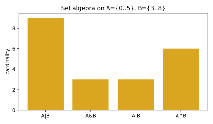

```python
nums = [3, 1, 4, 1, 5, 9, 2, 6, 5, 3]
unique = set(nums)         # {1, 2, 3, 4, 5, 6, 9}  -- dups dropped
print(9 in unique)         # True  -> O(1) average
print(len(unique))         # 7

# Deduplicate a list while you do not care about order:
print(list(set(nums)))
```

#### Set algebra

Sets implement the four classic operations with both operators and methods: union `|` / `.union`, intersection `&` / `.intersection`, difference `-` / `.difference`, and symmetric difference `^` / `.symmetric_difference`. The augmented forms (`|=`, `&=`, `-=`, `^=`) update in place. Subset and superset relations are tested with `<=`, `>=`, `<`, `>`.

```python
a = {1, 2, 3, 4}
b = {3, 4, 5, 6}
print(a | b)   # {1, 2, 3, 4, 5, 6}  union
print(a & b)   # {3, 4}              intersection
print(a - b)   # {1, 2}             difference
print(a ^ b)   # {1, 2, 5, 6}       symmetric difference
print({1, 2} <= a)   # True  -> subset
```

#### set vs frozenset

A `set` is mutable, so you can `add`/`discard` elements, but that very mutability makes it unhashable — it cannot be a dict key or live inside another set. A `frozenset` is the immutable, hashable counterpart: once built it never changes, so it *can* be a key or a member of another set. Choose `frozenset` when you need a set-valued key or a constant lookup table.

```python
seen = set()
seen.add("a"); seen.add("b")     # mutate freely

regions = {
    frozenset({"NY", "NJ"}): "tristate",
    frozenset({"CA", "OR", "WA"}): "west coast",
}
print(regions[frozenset({"NJ", "NY"})])   # tristate (order irrelevant)
```

#### No ordering, hashable-only elements

Sets make no ordering guarantee — iteration order depends on hashes and insertion history and must not be relied on; sort into a list when you need order. Every element must be hashable, so you can store numbers, strings, and tuples-of-hashables, but not lists, dicts, or other sets (use `frozenset` for the last). Set comprehensions build a set with `{expr for ...}`, deduplicating as they go.

```python
words = ["pip", "venv", "pip", "uv"]
lengths = {len(w) for w in words}   # set comprehension -> {3, 4}

# {[1, 2]}        # TypeError: unhashable type: 'list'
print(sorted({3, 1, 2}))            # [1, 2, 3]  -> impose order
```

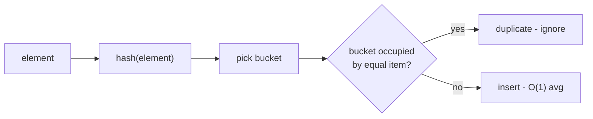

### Real-world example

You maintain two mailing lists and want everyone who is subscribed to the newsletter but has *not* yet confirmed their email, plus the count of people on both lists. Sets express this directly with difference and intersection, far more clearly than nested loops.

```python
newsletter = {"a@x.com", "b@x.com", "c@x.com", "d@x.com"}
confirmed  = {"b@x.com", "d@x.com", "e@x.com"}

needs_confirmation = newsletter - confirmed      # in newsletter, not confirmed
print(sorted(needs_confirmation))                # ['a@x.com', 'c@x.com']

on_both = newsletter & confirmed
print(len(on_both))                              # 2
```

### In practice

- Reach for a set whenever you repeatedly test membership or need to deduplicate; one `set(...)` build then O(1) lookups beats scanning a list.
- Use set difference/intersection instead of hand-rolled loops for "in A but not B" style queries.
- Use `frozenset` for set-valued dict keys or constants.
- `set()` makes an empty set; `{}` makes an empty *dict*.
- Never rely on set iteration order; sort into a list when order matters.

### Pitfalls

- **`{}` is an empty set** — it is an empty *dict*; use `set()` for an empty set.
- **Sets keep insertion order like dicts** — they do not; set ordering is unspecified.
- **Any object can go in a set** — only hashable objects can; lists, dicts, and sets cannot (use `frozenset`).
- **`s.add(x)` returns the new set** — it mutates in place and returns `None`.
- **`|` and `update` are the same** — `a | b` returns a new set, while `a |= b` / `a.update(b)` mutate `a`.

## Dictionaries

> **TL;DR:** A `dict` maps hashable keys to arbitrary values through a hash table, giving average O(1) lookup, insertion, and deletion. Since Python 3.7 dictionaries preserve insertion order as a language guarantee, and rich tools — `get`, `setdefault`, comprehensions, and `collections.defaultdict`/`Counter` — make them the workhorse container of Python.

### Vocabulary

**Dictionary**

A mutable mapping of unique hashable keys to values, written `{"a": 1, "b": 2}`.

**Hash table**

The underlying structure that turns a key's hash into a storage slot, enabling near-constant-time access.

**Key**

The hashable lookup token; equal keys (`==` with the same hash) collide to the same entry.

**View object**

A dynamic, read-only window onto a dict's keys, values, or items returned by `.keys()`, `.values()`, `.items()`.

**`defaultdict`**

A dict subclass that auto-creates a default value for a missing key via a factory function.

### Intuition

A dictionary is a labeled set of pigeonholes: instead of accessing a value by numeric position, you access it by a meaningful key. Python hashes the key to compute which pigeonhole to look in, so retrieval does not scan — it jumps straight to the slot, no matter how many entries exist. That is why a 10-element dict and a 10-million-element dict look up a key in essentially the same time.

Think of a `set` as a dict that stores only keys; a dict adds an associated value to each. The same hashing machinery — and the same hashable-key requirement — applies.

### How it works

CPython implements `dict` as an open-addressing hash table. Since 3.6 (guaranteed in 3.7) it uses a *compact* layout: a dense, insertion-ordered array of entries plus a sparse index of slots pointing into it. This is what preserves order while keeping memory low.

#### Hash table and O(1) lookup

To store or fetch `d[key]`, Python computes `hash(key)`, masks it to an index, and probes the sparse slot array until it finds an entry whose stored hash and key match. Because the table is kept sparse, the expected probe count is small, so lookup, insertion, and deletion are average O(1) regardless of size. The plot below shows lookup time staying flat as the dict grows by orders of magnitude.

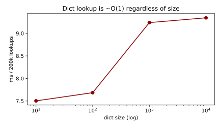

```python
d = {"alice": 30, "bob": 25}
print(d["alice"])          # 30  -> O(1) average
d["carol"] = 28            # insert -> O(1)
del d["bob"]               # delete -> O(1)
print("carol" in d)        # True -> O(1) membership on keys
```

#### Insertion-order preservation

Since Python 3.7 the language guarantees that iterating a dict yields keys in the order they were first inserted; updating an existing key keeps its original position. This makes dicts usable as ordered records and largely retires `collections.OrderedDict` for ordering alone. Re-inserting a deleted key places it at the end.

```python
order = {}
for name in ["zoe", "amy", "max"]:
    order[name] = len(name)
print(list(order))         # ['zoe', 'amy', 'max']  -> insertion order
order["amy"] = 99          # update keeps position
print(list(order))         # ['zoe', 'amy', 'max']
```

#### Hashable keys, get, setdefault, update

Keys must be hashable (numbers, strings, tuples-of-hashables); lists and dicts cannot be keys. Indexing a missing key raises `KeyError`, so use `.get(key, default)` for a safe read and `.setdefault(key, default)` to read-or-initialize in one step. `.update(other)` merges another mapping or key/value pairs, overwriting on conflict (the `|`/`|=` merge operators do the same since 3.9).

```python
counts = {}
for word in "the cat the dog the".split():
    counts[word] = counts.get(word, 0) + 1   # safe read with default
print(counts)              # {'the': 3, 'cat': 1, 'dog': 1}

groups = {}
groups.setdefault("a", []).append(1)         # read-or-init then mutate
groups.setdefault("a", []).append(2)
print(groups)              # {'a': [1, 2]}

base = {"x": 1}
base.update({"y": 2, "x": 9})                # merge, overwrite x
print(base)                # {'x': 9, 'y': 2}
```

#### Comprehensions and view objects

A dict comprehension builds a mapping with `{k: v for ...}`, ideal for inverting a dict or transforming values. The `.keys()`, `.values()`, and `.items()` methods return *view* objects — live windows that reflect later changes and support set-like operations on keys without copying. Iterating a dict directly iterates its keys.

```python
squares = {n: n * n for n in range(5)}       # {0:0, 1:1, 2:4, 3:9, 4:16}
inverted = {v: k for k, v in squares.items()}

prices = {"pen": 2, "book": 9}
view = prices.items()
prices["pen"] = 3
print(list(view))          # [('pen', 3), ('book', 9)]  -> view is live
for k, v in prices.items():
    print(k, v)
```

#### defaultdict and Counter

`collections.defaultdict(factory)` calls `factory()` to supply a value the first time a missing key is accessed, eliminating boilerplate `setdefault` or `get` patterns for grouping and counting. `collections.Counter` is a dict subclass purpose-built for tallying, with `.most_common()` and arithmetic on counts.

```python
from collections import defaultdict, Counter

groups = defaultdict(list)
for word in ["apple", "avocado", "banana"]:
    groups[word[0]].append(word)             # no setdefault needed
print(dict(groups))        # {'a': ['apple', 'avocado'], 'b': ['banana']}

tally = Counter("mississippi")
print(tally.most_common(2))   # [('s', 4), ('i', 4)]
```

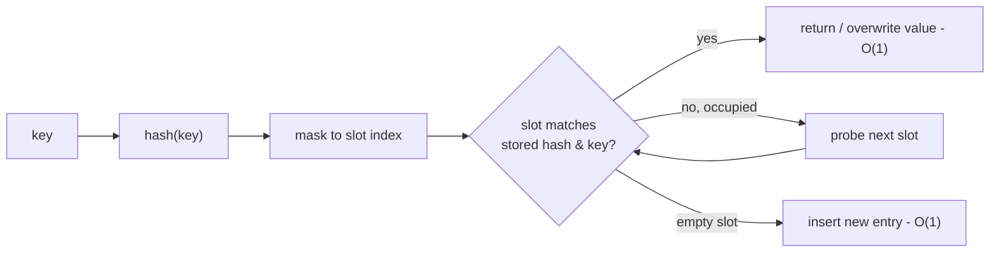

### Real-world example

You are aggregating web-server log lines and want, for each status code, the count of requests and the list of paths that produced it. A `defaultdict` plus a `Counter` expresses this cleanly with O(1) updates per line, scaling to millions of lines.

```python
from collections import defaultdict, Counter

logs = [
    (200, "/home"), (404, "/missing"), (200, "/about"),
    (500, "/api"), (404, "/gone"), (200, "/home"),
]

status_counts = Counter()
paths_by_status = defaultdict(list)
for code, path in logs:
    status_counts[code] += 1            # O(1) tally
    paths_by_status[code].append(path)  # O(1) grouping

print(dict(status_counts))   # {200: 3, 404: 2, 500: 1}
print(paths_by_status[404])  # ['/missing', '/gone']
```

### In practice

- Use `dict.get(k, default)` for safe reads and `defaultdict`/`setdefault` for grouping and counting; reach for `Counter` whenever you tally.
- Iterate with `.items()` to get key and value together; iterating the dict directly gives keys only.
- Merge with `d1 | d2` (new dict) or `d1 |= d2` (in place) on Python 3.9+; `update` works everywhere.
- Rely on insertion order on 3.7+, but if your audience may run older code, document the assumption.
- Keys must be hashable and stable; never mutate an object after using it as a key.

### Pitfalls

- **`d[missing]` returns `None`** — it raises `KeyError`; use `.get` for a default.
- **Lists can be dict keys** — they cannot (unhashable); use a tuple if you need a composite key.
- **Dicts are unordered** — since 3.7 they preserve insertion order as a guarantee.
- **Iterating a dict yields key/value pairs** — it yields keys only; use `.items()` for pairs.
- **Mutating a dict while iterating it is safe** — adding or removing keys mid-iteration raises `RuntimeError`; iterate over a `list(d)` snapshot instead.
- **`.keys()` returns a list** — it returns a live view; wrap in `list(...)` if you need a snapshot.

## List Comprehensions

> **TL;DR:** A list comprehension builds a list in one expression: `[expr for x in iterable if cond]`. It is faster than a manual `for`-loop-with-`append` because the append happens at C speed, and it usually reads cleaner than `map`/`filter`. It eagerly materializes the whole list — use a generator expression when you only iterate once.

### Vocabulary

**Comprehension**

A bracketed expression that constructs a collection by iterating one or more iterables and optionally filtering. List `[...]`, set `{...}`, and dict `{k: v ...}` comprehensions share the same grammar.

**Mapping expression**

```math
\text{output} = \{\, f(x) \mid x \in S \,\}
```

The leading expression applied to each element — the set-builder analogue of the comprehension's `expr` part.

**Filter clause**

The optional `if cond` that keeps only elements satisfying a predicate, dropping the rest before the mapping expression runs.

**Nested comprehension**

A comprehension with more than one `for` clause, or whose mapping expression is itself a comprehension. The clauses read left-to-right as nested loops.

### Intuition

A list comprehension is the runnable form of mathematical set-builder notation. "{ x² for every x in 0..9 where x is even }" becomes `[x*x for x in range(10) if x % 2 == 0]`. You read it as: *what to collect* first, then *where it comes from*, then *which to keep*.

The relative-build-time chart below shows why practitioners prefer it: the comprehension's loop body and append run inside the interpreter's C layer, avoiding repeated Python-level method lookups for `.append`.

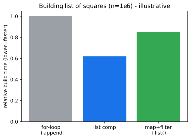

### How it works

A comprehension is compiled into its own nested scope with a hidden loop. The mapping expression is evaluated once per surviving element; the filter, if present, gates each element before the mapping. Because it returns a fully built list, all elements exist in memory at once when it completes.

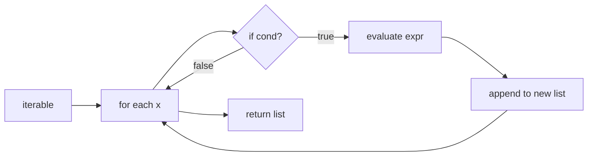

#### Basic syntax

The minimal form is `[expr for var in iterable]`. The expression on the left can be any Python expression — a function call, arithmetic, an f-string — and it sees each `var` in turn.

```python
names = ["ada", "linus", "grace"]
caps = [n.capitalize() for n in names]
print(caps)   # ['Ada', 'Linus', 'Grace']
```

#### Conditionals — filter vs. ternary

There are two distinct `if` positions. A trailing `if` *filters* (drops elements). A ternary `if/else` in the *expression* position transforms every element but keeps all of them.

```python
nums = range(6)
evens = [n for n in nums if n % 2 == 0]            # filter -> [0, 2, 4]
signs = ["even" if n % 2 == 0 else "odd" for n in nums]  # map all -> 6 items
```

#### Nested comprehensions

Multiple `for` clauses read in the same order you would write nested loops. The leftmost `for` is the outer loop. A nested *expression* (a comprehension inside the mapping slot) builds a list-of-lists.

```python
# flatten: outer for first, inner for second
matrix = [[1, 2], [3, 4], [5, 6]]
flat = [x for row in matrix for x in row]      # [1, 2, 3, 4, 5, 6]

# build a 3x3 grid: inner comprehension is the element expression
grid = [[r * c for c in range(3)] for r in range(3)]
```

> [!IMPORTANT]
> In a multi-`for` comprehension the clauses run **left-to-right outermost-first**, the same order as equivalent nested `for` statements. `[x for row in matrix for x in row]` flattens; reversing the two `for` clauses is a `NameError`.

#### Versus map and filter

`map(f, it)` and `filter(p, it)` are lazy iterators that compose the same two operations. A comprehension is generally preferred in Python because it avoids a `lambda` for the common case and reads as one unit; `map` shines when `f` is an already-named function.

```python
words = ["  hi ", " there"]
# comprehension
clean = [w.strip() for w in words]
# map with an existing function — no lambda needed, equally idiomatic
clean = list(map(str.strip, words))
```

### Real-world example

You are parsing a CSV export of orders and need the total revenue per valid, non-refunded row, as a list you will sum and also log. A comprehension expresses the filter-then-transform pipeline in one line.

```python
rows = [
    {"id": 1, "qty": 2, "price": 9.99, "refunded": False},
    {"id": 2, "qty": 1, "price": 4.50, "refunded": True},
    {"id": 3, "qty": 5, "price": 1.20, "refunded": False},
]

line_totals = [
    round(r["qty"] * r["price"], 2)
    for r in rows
    if not r["refunded"] and r["qty"] > 0
]

print(line_totals)          # [19.98, 6.0]
print("revenue:", sum(line_totals))   # revenue: 25.98
```

### In practice

> [!TIP]
> Keep comprehensions to a single screen line of logic. If you need two filters plus a ternary plus a nested loop, a plain `for` loop is more readable — clever is not the goal. Reach for a generator expression (round brackets) when the result is only consumed once, e.g. inside `sum(...)`.

- Dict and set comprehensions share the grammar: `{k: v for ...}`, `{x for ...}`. They deduplicate / key automatically.
- The walrus operator lets you reuse a computed value: `[y for x in data if (y := f(x)) > 0]`.
- Comprehensions have their own scope, so the loop variable does not leak into the surrounding function (unlike a bare `for` loop).

### Pitfalls

- **"A comprehension is always faster than a loop."** — It is faster for *building a list*. If you would iterate without storing, a generator expression avoids the memory cost entirely.
- **"Trailing `if` and ternary `if` are the same."** — No. Trailing `if` filters (changes length); ternary `if/else` maps (preserves length).
- **"Deeply nested comprehensions are Pythonic."** — Two `for` clauses are fine; three or more usually want a real loop or a generator function.
- **"The loop variable is visible after the comprehension."** — Not in Python 3; the comprehension scope contains it.

## Generator Expressions

> **TL;DR:** A generator expression `(expr for x in it if cond)` has the same syntax as a list comprehension but with round brackets, and it produces a lazy iterator that yields one value at a time instead of building a whole list. It uses O(1) memory regardless of input size, so it is the right tool for streaming, pipelines, and feeding aggregate functions like `sum`, `any`, or `max`.

### Vocabulary

**Generator expression**

```math
g = (\, f(x) \mid x \in S,\ p(x) \,)
```

A round-bracketed comprehension that evaluates lazily, returning a generator object — an iterator that computes each element on demand.

**Lazy evaluation**

A strategy where a value is computed only when it is actually requested, never ahead of time. The opposite is *eager* evaluation, which a list comprehension performs.

**Generator object**

The single-use iterator a generator expression (or a `yield` function) returns. It maintains its own resume point; once exhausted it cannot be restarted.

**`yield`**

The keyword that turns a function into a generator function: it suspends execution, hands a value to the caller, and resumes from the same line on the next `next()`.

### Intuition

A list comprehension is a finished printed book — every page exists before you read any. A generator expression is a storyteller who speaks one sentence each time you ask "and then?" and remembers exactly where they left off. You pay for one sentence of memory, not the whole book.

The memory chart below contrasts the two as input grows: the list's footprint grows linearly with element count, while the generator stays flat.

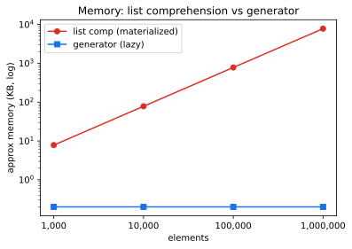

### How it works

A generator expression compiles to a generator object whose code runs only as the consumer pulls values via `next()`. Each pull advances the hidden loop to the next surviving element, evaluates the mapping expression once, returns it, and freezes. When the source iterable is exhausted it raises `StopIteration`, which `for` loops and aggregate functions catch silently.

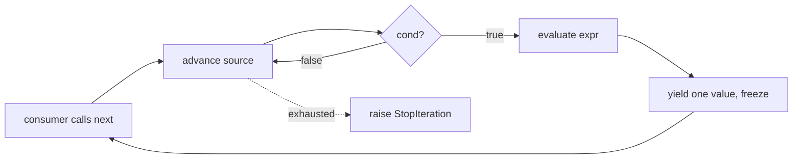

#### Lazy, single-pass semantics

Nothing happens at construction time — building the generator does no work. Each value materializes only when pulled, and a generator is *consumed once*: after you iterate it, it is empty.

```python
gen = (x * x for x in range(5))
print(next(gen))        # 0
print(list(gen))        # [1, 4, 9, 16]  — consumes the rest
print(list(gen))        # []             — already exhausted
```

#### Memory and infinite sources

Because no list is allocated, a generator can wrap an unbounded source and still run in constant memory. You bound it downstream with `itertools.islice` or a breaking `for`.

```python
import itertools

def naturals():
    n = 0
    while True:
        yield n
        n += 1

first_five_squares = (n * n for n in itertools.islice(naturals(), 5))
print(list(first_five_squares))   # [0, 1, 4, 9, 16]
```

#### Versus list comprehensions

Same grammar, opposite trade-off: the list comprehension trades memory for random access and reusability; the generator trades those away for O(1) memory and the ability to short-circuit. When a generator expression is the sole argument to a function, you may drop the inner parentheses.

```python
nums = range(1_000_000)
# eager: ~8 MB list just to throw away
total = sum([n for n in nums if n % 3 == 0])
# lazy: constant memory, parentheses dropped
total = sum(n for n in nums if n % 3 == 0)
```

> [!TIP]
> `any(...)` and `all(...)` over a generator expression short-circuit: they stop pulling at the first decisive value. `any(is_prime(n) for n in huge)` never materializes `huge` and stops at the first prime.

#### Relation to `yield` functions

A generator expression is sugar for a small `yield` function. Use the expression for a one-line map/filter; write a generator function with `yield` when you need multiple statements, internal state, or `try/finally` cleanup.

```python
# these two are equivalent
gen_expr = (line.strip() for line in open("data.txt"))

def gen_func(path):
    with open(path) as f:
        for line in f:
            yield line.strip()
```

### Real-world example

You must compute the total bytes of all log lines in a multi-gigabyte file without loading it into RAM. A generator pipeline streams the file line by line, and `sum` pulls one line at a time.

```python
def log_byte_total(path: str) -> int:
    with open(path, encoding="utf-8") as f:
        # generator expression: one line in memory at a time
        line_lengths = (len(line.encode("utf-8")) for line in f if line.strip())
        return sum(line_lengths)


# Even a 10 GB file uses kilobytes of memory here.
# total = log_byte_total("server.log")
```

### In practice

> [!IMPORTANT]
> A generator is single-use. If two consumers need the same stream, either rebuild the generator, materialize it once with `list(...)`, or `tee` it with `itertools.tee`. Iterating an exhausted generator silently yields nothing — a frequent "my data disappeared" bug.

- Chain generators into pipelines (`read → parse → filter → transform`); each stage stays lazy and memory stays flat end to end.
- `itertools` (`islice`, `chain`, `takewhile`, `tee`) is the standard toolkit for shaping generator streams.
- Generators cannot be indexed or `len()`-ed; convert to a list first if you need random access.

### Pitfalls

- **"A generator expression is just a slower list comprehension."** — No. It is lazy and O(1) memory; for single-pass consumption it is strictly better.
- **"I can iterate a generator twice."** — Not without rebuilding it. The second pass sees an empty iterator.
- **"`len(gen)` tells me how many items."** — Generators have no length; you would have to consume them, which destroys them.
- **"Wrapping a file in a generator is fine after the `with` block closes."** — The file must stay open while the generator is pulled; close it after consumption, not before.

## Sources

- [The Python Tutorial — Data Structures](https://docs.python.org/3/tutorial/datastructures.html)
- [`list` — Sequence Types](https://docs.python.org/3/library/stdtypes.html#lists)
- [TimeComplexity — Python Wiki](https://wiki.python.org/moin/TimeComplexity)
- [`copy` — Shallow and deep copy operations](https://docs.python.org/3/library/copy.html)
- [The Python Tutorial — Tuples and Sequences](https://docs.python.org/3/tutorial/datastructures.html#tuples-and-sequences)
- [`tuple` — Sequence Types](https://docs.python.org/3/library/stdtypes.html#tuples)
- [`collections.namedtuple`](https://docs.python.org/3/library/collections.html#collections.namedtuple)
- [PEP 3132 — Extended Iterable Unpacking](https://peps.python.org/pep-3132/)
- [The Python Tutorial — Sets](https://docs.python.org/3/tutorial/datastructures.html#sets)
- [`set` and `frozenset` — Set Types](https://docs.python.org/3/library/stdtypes.html#set-types-set-frozenset)
- [The Python Tutorial — Dictionaries](https://docs.python.org/3/tutorial/datastructures.html#dictionaries)
- [`dict` — Mapping Types](https://docs.python.org/3/library/stdtypes.html#dict)
- [`collections` — defaultdict and Counter](https://docs.python.org/3/library/collections.html)
- [PEP 584 — Add Union Operators To dict](https://peps.python.org/pep-0584/)
- [Python tutorial — List Comprehensions](https://docs.python.org/3/tutorial/datastructures.html#list-comprehensions)
- [Python reference — Displays for lists, sets and dictionaries](https://docs.python.org/3/reference/expressions.html#displays-for-lists-sets-and-dictionaries)
- [PEP 202 — List Comprehensions](https://peps.python.org/pep-0202/)
- [Python reference — Generator expressions](https://docs.python.org/3/reference/expressions.html#generator-expressions)
- [Python howto — Functional programming (iterators & generators)](https://docs.python.org/3/howto/functional.html)
- [PEP 289 — Generator Expressions](https://peps.python.org/pep-0289/)

## Related

- [Language Basics](./01-language-basics.md)
- [Advanced Functions](./03-advanced-functions.md)
- [Modules, Regex, and Paradigms](./04-modules-regex-paradigms.md)
- [Data Structures and Algorithms](./06-data-structures-and-algorithms.md)
