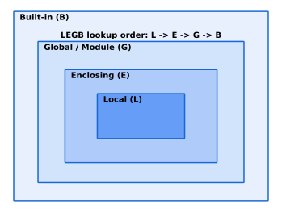
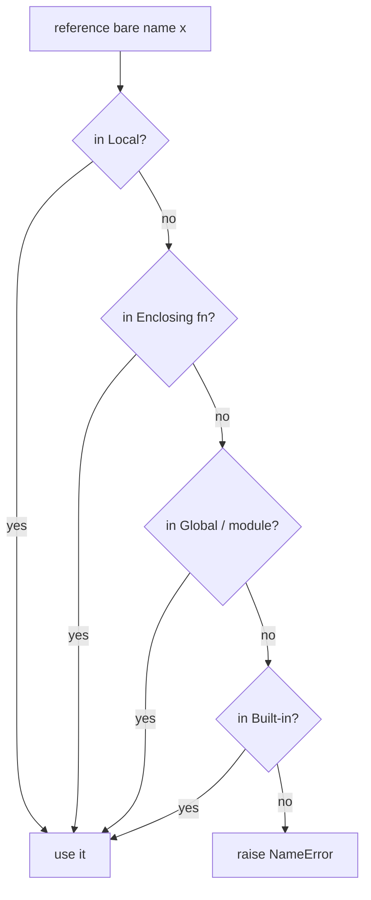
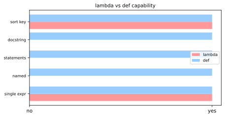
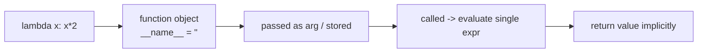
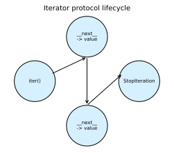
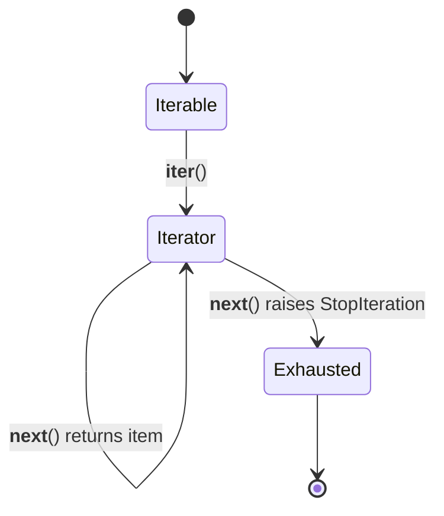
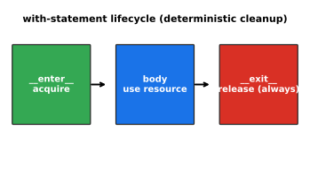
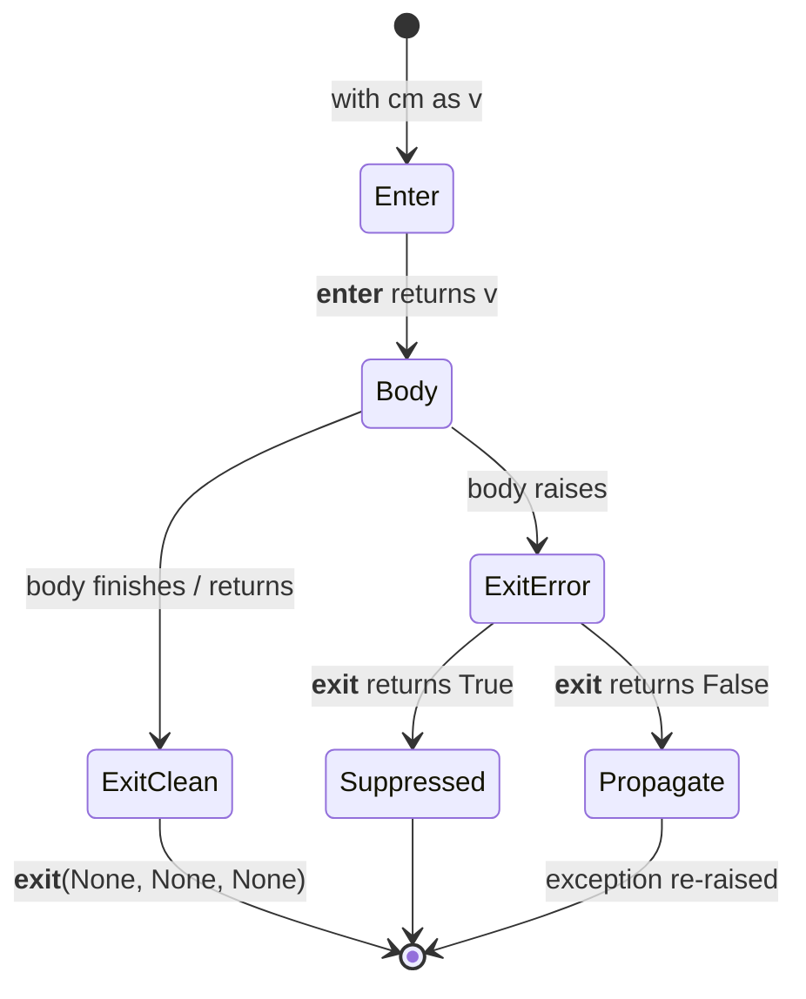
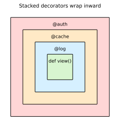
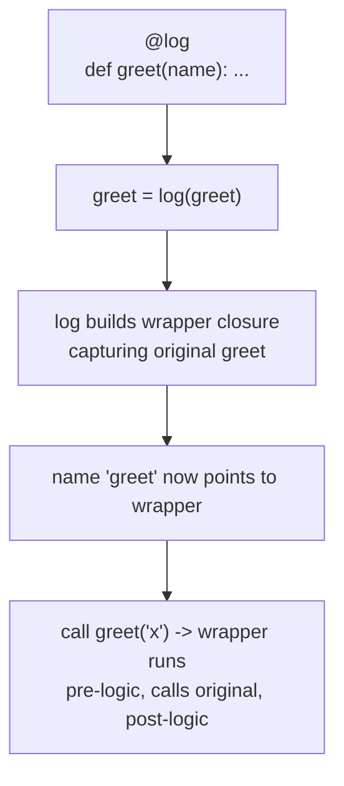

# Python Advanced Functions & Scope

[toc]

> **TL;DR:** This note covers Python's name-resolution model (LEGB, `global`/`nonlocal`, closures), anonymous lambda functions, the iterator/generator protocol, context managers for deterministic cleanup, and decorators for wrapping behavior. Together they form the functional and resource-management toolkit built on Python's first-class functions.

## Variable Scope

> **TL;DR:** Python resolves a bare name by searching four nested namespaces in a fixed order — Local, Enclosing, Global, Built-in (the LEGB rule). Assignment inside a function creates a *local* name by default; `global` and `nonlocal` opt out of that, and closures capture enclosing variables *by reference*, which is the source of the classic late-binding loop bug.

### Vocabulary

**Scope**

```math
\text{scope} : \text{name} \rightarrow \text{binding}
```

The textual region of a program where a name is directly accessible without qualification. In Python, scope is determined statically (at compile time) by where a name is *assigned*, not by where the function is *called*.

**Namespace**

A concrete mapping from names to objects (e.g. a module's `__dict__`, a function's local variables). Scopes are the lookup rules; namespaces are the dictionaries those rules search.

**LEGB**

The lookup order Local → Enclosing → Global → Built-in. The first namespace containing the name wins; the search stops there.

**Free variable**

A name used inside a function but bound in an enclosing function's scope. Closures keep free variables alive after the outer function returns.

**Closure**

A function object plus the captured environment of free variables it references. In CPython these live in `__closure__` cells.

### Intuition

Think of a function call as standing inside a set of nested rooms. When you say a name, you first look in the room you are in (Local). If it is not there, you step out to the room that physically encloses your definition (Enclosing), then to the whole house (Global / module), then to the city's public registry (Built-in). The diagram below shows those nested rooms.



The critical mental correction: which "room encloses you" is decided by *where the function was written* (lexical / static scoping), never by who called it. Python has no dynamic scoping.

### How it works

Name resolution and name *binding* are two different mechanisms. Resolution follows LEGB; binding (assignment) decides which namespace a name belongs to. The compiler scans each function body once and marks every name that is assigned anywhere in the body as local for the *entire* body — even before that assignment line runs.



#### Local and the assignment rule

A name is local to a function if it is assigned anywhere in that function's body. This is decided at compile time, so reading a name before its first assignment raises `UnboundLocalError`, not a fall-through to the global of the same name.

```python
x = 10
def f():
    print(x)   # UnboundLocalError: x is local because it is assigned below
    x = 5
```

#### global — rebinding module-level names

By default you can *read* a global from inside a function but not *rebind* it. The `global` declaration tells the compiler that assignments to that name should mutate the module namespace instead of creating a local.

```python
counter = 0
def tick():
    global counter
    counter += 1   # rebinds the module-level name
tick(); tick()
print(counter)     # 2
```

#### nonlocal — rebinding an enclosing function's name

`nonlocal` is the closure analogue of `global`: it binds to the nearest *enclosing function* scope (not the module). It is required when an inner function needs to mutate a variable owned by an outer function.

```python
def make_counter():
    n = 0
    def inc():
        nonlocal n
        n += 1
        return n
    return inc
c = make_counter()
print(c(), c(), c())   # 1 2 3
```

#### Closures and late binding

A closure captures the *variable*, not its value at definition time. All closures created in a loop share the same cell, so they all observe the loop variable's final value — the late-binding gotcha.

> [!WARNING]
> Closures created in a loop capture the loop variable by reference. By the time they run, the loop has finished and every closure sees the last value.

```python
fns = [lambda: i for i in range(3)]
print([f() for f in fns])        # [2, 2, 2]  — not [0, 1, 2]

fns = [lambda i=i: i for i in range(3)]   # bind now via default arg
print([f() for f in fns])        # [0, 1, 2]
```

### Real-world example

A rate-limiter factory: you want per-endpoint counters that persist between calls without a global dict or a class. A closure with `nonlocal` gives each endpoint its own private, mutable state.

```python
import time

def make_rate_limiter(max_calls: int, per_seconds: float):
    calls: list[float] = []  # free variable captured by the closure

    def allow() -> bool:
        now = time.monotonic()
        # drop timestamps outside the window
        while calls and calls[0] <= now - per_seconds:
            calls.pop(0)
        if len(calls) < max_calls:
            calls.append(now)
            return True
        return False

    return allow


search_limit = make_rate_limiter(max_calls=3, per_seconds=1.0)
print([search_limit() for _ in range(5)])  # [True, True, True, False, False]
```

### In practice

> [!TIP]
> Reach for a closure when you need one small piece of persistent state and one operation on it; reach for a class when you need several methods or several state fields. Closures are lighter and read better for the single-responsibility case.

- Comprehensions, generator expressions, and lambdas each introduce their *own* local scope; a leak from a comprehension into the surrounding function (a Python 2 wart) cannot happen in Python 3.
- `globals()` and `locals()` expose the underlying namespaces as dicts. Writing through `locals()` inside a function is not guaranteed to take effect — treat it as read-only.
- Inspect a closure's captured cells with `fn.__closure__` and `fn.__code__.co_freevars` when debugging stale-state bugs.

### Pitfalls

- **"Reading a global then assigning it in the same function works."** — Wrong. The assignment makes the name local for the whole body, so the read raises `UnboundLocalError`. Add `global`.
- **"`nonlocal` can reach the module scope."** — Wrong. `nonlocal` only reaches enclosing *function* scopes; use `global` for module level.
- **"Each loop iteration's lambda captures its own value."** — Wrong. They share one cell; capture eagerly with a default argument or a factory function.
- **"Mutating a captured list needs `nonlocal`."** — Wrong. You only need `nonlocal`/`global` to *rebind* a name. Mutating the object the name points to (`calls.append(...)`) needs no declaration.

## Lambdas

> **TL;DR:** A lambda is an anonymous function limited to a single expression, whose value is returned implicitly. It shines as a throwaway key/callback passed to another function, but a named `def` is clearer the moment you need statements, a docstring, or reuse.

### Vocabulary

**Lambda expression**

```math
\lambda\ params : \text{expression}
```

An unnamed function object built from `lambda args: expr`. It evaluates `expr` and returns it; no `return` keyword, no statements.

**Anonymous function**

A function with no bound name at definition time. Lambdas are Python's only anonymous-function form; they may still be assigned to a variable, but that defeats the point.

**First-class function**

A value that can be passed as an argument, returned, and stored like any other object. Both lambdas and `def` functions are first-class in Python.

**Closure**

A function plus the captured variables from its enclosing scope. Lambdas capture by *reference to the variable*, not by value at creation time — a classic footgun in loops.

### Intuition

A lambda is the function you would otherwise have to name but do not want to. When an API says "give me a function that maps an item to its sort key," writing `lambda r: r.score` inline keeps the logic at the call site where the reader needs it. The instant the function grows a branch, a loop, or a second line, the anonymity stops paying for itself and a `def` reads better.

The chart below contrasts what a lambda can express against what `def` can — lambdas trade capability for compactness.



### How it works

`lambda args: expr` produces exactly the same kind of object as `def` — a `function` instance with `__call__`, `__name__` (set to `"<lambda>"`), and a closure cell. The grammar restricts the body to a single expression, which is why you cannot put `if x: ...; else: ...` statements or assignments inside one.



#### Where lambdas shine

Lambdas are best as the function argument to higher-order builtins and library calls: `sorted`, `min`, `max`, `filter`, `map`, `functools.reduce`, and GUI/event callbacks. The key insight is that the function is trivial and used exactly once.

```python
records = [("alice", 88), ("bob", 95), ("cara", 91)]
top = sorted(records, key=lambda r: r[1], reverse=True)   # sort by score
print(top[0])   # ('bob', 95)
```

#### Where lambdas fail

A lambda cannot contain statements, type annotations on its body, a docstring, or multiple lines. Trying to cram logic in with chained ternaries hurts readability. Whenever you reach for that, switch to `def`.

```python
# Hard to read — avoid:
classify = lambda n: "neg" if n < 0 else ("zero" if n == 0 else "pos")

# Clearer named function:
def classify(n):
    if n < 0:
        return "neg"
    return "zero" if n == 0 else "pos"
```

#### Lambda vs def

They build the same object, so the choice is about clarity and tooling. A `def` gets a real name in tracebacks, supports a docstring, and is debuggable; a lambda assigned to a variable gets neither benefit while looking unusual.

> [!WARNING]
> `f = lambda x: x + 1` is flagged by linters (PEP 8 E731) precisely because it loses the traceback name without gaining anything over `def f(x): return x + 1`. Assign a lambda to a name only in throwaway scripts.

### Real-world example

You are processing log lines and need to group, filter, and sort them by fields extracted on the fly. Lambdas keep each tiny extractor at its call site, which reads top-to-bottom as a pipeline.

```python
from functools import reduce

logs = [
    {"level": "ERROR", "ms": 120, "svc": "auth"},
    {"level": "INFO", "ms": 8, "svc": "auth"},
    {"level": "ERROR", "ms": 47, "svc": "cart"},
]

errors = list(filter(lambda e: e["level"] == "ERROR", logs))
slowest = max(errors, key=lambda e: e["ms"])          # by latency
total_ms = reduce(lambda acc, e: acc + e["ms"], logs, 0)

print(slowest["svc"], total_ms)   # auth 175
```

### In practice

The Pythonic default is a comprehension over `map`/`filter`+lambda, because comprehensions are usually more readable: `[e for e in logs if e["level"] == "ERROR"]` beats `filter(lambda ...)`. Reserve lambdas for the `key=` argument of sorting/min/max and for genuine callback APIs where a comprehension does not apply.

> [!TIP]
> `operator.itemgetter` and `operator.attrgetter` are faster and clearer than equivalent lambdas for the common cases: `key=itemgetter(1)` replaces `key=lambda r: r[1]`, and `key=attrgetter("score")` replaces `key=lambda r: r.score`.

> [!CAUTION]
> Late binding in loops: `funcs = [lambda: i for i in range(3)]` makes three closures that all return `2`, because each captures the *variable* `i`, read at call time. Bind per-iteration with a default arg: `lambda i=i: i`.

### Pitfalls

- **"A lambda is faster than def."** False — they compile to the same bytecode and the same function type. Choose on readability, not speed.
- **Statements in a lambda.** Assignments, `for`, `try`, and `return` are syntax errors inside a lambda. Only expressions are allowed (the walrus `:=` is an expression, so it is the rare exception).
- **Late-binding closure surprise.** Variables are captured by reference; use a default argument to snapshot the current value.
- **Naming a lambda.** Assigning one to a variable trips linters and gives `<lambda>` in tracebacks — prefer `def`.

## Iterators

> **TL;DR:** An *iterable* can produce an iterator via `__iter__`; an *iterator* yields items one at a time via `__next__` and signals exhaustion by raising `StopIteration`. Generators are the easy way to write iterators, and `itertools` composes them lazily for memory-flat pipelines over huge or infinite streams.

### Vocabulary

**Iterable**

```math
\text{Iterable} : \texttt{\_\_iter\_\_()} \rightarrow \text{Iterator}
```

Any object with `__iter__` returning an iterator. Lists, tuples, dicts, sets, strings, and files are iterables. An iterable can be looped many times.

**Iterator**

```math
\text{Iterator} : \texttt{\_\_next\_\_()} \rightarrow \text{item}\ |\ \text{StopIteration}
```

An object with `__next__` (and an `__iter__` returning `self`). It holds the current position and is consumed once — looping it twice yields nothing the second time.

**`StopIteration`**

The exception an iterator raises from `__next__` to say "no more items." `for` loops catch it silently; the loop ends.

**Generator**

A function containing `yield`. Calling it returns a generator object, which is an iterator whose state (local variables, instruction pointer) is suspended and resumed across `next()` calls.

### Intuition

An iterable is a *book*; an iterator is a *bookmark* into it. You can hand out many bookmarks (iterators) for one book (iterable), and each bookmark advances independently and forgets nothing about going backward. `for x in book` quietly asks the book for a fresh bookmark, then keeps calling `next` on it until the book says "the end" (`StopIteration`). The state machine below shows that lifecycle.





### How it works

`for x in obj:` desugars to: call `iter(obj)` once to get an iterator, then call `next(it)` repeatedly, binding each result to `x`, until `StopIteration` is raised. Everything that supports `for` — comprehensions, `*unpacking`, `sum`, `min`, `zip` — is built on exactly these two calls.

#### Iterable vs iterator

The split exists so one collection can support many simultaneous, independent traversals. A list is an iterable but not its own iterator; calling `iter(list)` gives you a fresh `list_iterator` each time. An iterator's `__iter__` returns `self`, which is why you can pass an iterator to `for` directly.

```python
nums = [10, 20, 30]
it = iter(nums)          # list_iterator, a separate object
print(next(it))          # 10
print(next(it))          # 20
print(iter(it) is it)    # True: an iterator iterates itself
```

#### Writing the protocol by hand

Implementing both methods directly shows what generators automate. The iterator stores its own cursor and raises `StopIteration` when done.

```python
class CountUp:
    def __init__(self, limit):
        self.limit = limit

    def __iter__(self):          # iterable -> fresh iterator each call
        return _CountUpIter(self.limit)


class _CountUpIter:
    def __init__(self, limit):
        self.limit = limit
        self.n = 0

    def __iter__(self):
        return self              # iterators return themselves

    def __next__(self):
        if self.n >= self.limit:
            raise StopIteration  # signal exhaustion
        self.n += 1
        return self.n


print(list(CountUp(3)))   # [1, 2, 3]
```

#### Generators: the easy path

A generator function rewrites the class above as a few lines. `yield` suspends execution and hands a value to the caller; the next `next()` resumes right after the `yield` with all locals intact. The interpreter creates `__iter__`/`__next__` and raises `StopIteration` automatically when the function returns.

```python
def count_up(limit):
    n = 0
    while n < limit:
        n += 1
        yield n              # suspend here, resume on next()


print(list(count_up(3)))    # [1, 2, 3]
```

#### Laziness and infinite streams

Iterators are *lazy*: they compute each item only when asked, so they can represent infinite or huge sequences in constant memory. Pair a generator with a stopping condition or `itertools.islice` to bound it.

```python
import itertools


def naturals():
    n = 1
    while True:           # infinite, but lazy
        yield n
        n += 1


print(list(itertools.islice(naturals(), 5)))   # [1, 2, 3, 4, 5]
```

### Real-world example

You must scan a multi-gigabyte log file and report the five slowest requests without loading the file into memory. Iterating the file object yields one line at a time, and a generator pipeline keeps memory flat regardless of file size.

```python
import heapq
import re

LATENCY = re.compile(r"ms=(\d+)")


def latencies(path):
    with open(path) as fh:
        for line in fh:                  # file is a lazy line iterator
            m = LATENCY.search(line)
            if m:
                yield int(m.group(1)), line.rstrip()


def slowest(path, k=5):
    # nlargest pulls from the generator; never holds the whole file
    return heapq.nlargest(k, latencies(path), key=lambda pair: pair[0])


# for ms, line in slowest("app.log"):
#     print(ms, line)
```

### In practice

The `itertools` module is the standard toolkit for composing iterators lazily: `chain`, `islice`, `groupby`, `tee`, `count`, `cycle`, `accumulate`, `product`, `combinations`. Combining small generators with `itertools` builds streaming data pipelines that process more data than fits in RAM.

> [!IMPORTANT]
> Iterators are single-pass and consumed. After `list(it)` drains an iterator, a second pass yields nothing — no error, just empty. If you need two passes, re-`iter()` the underlying iterable (not the iterator) or use `itertools.tee`.

> [!TIP]
> `next(it, default)` returns `default` instead of raising `StopIteration` when the iterator is empty — the clean way to peek the first item without a `try/except`.

### Pitfalls

- **Reusing a drained iterator.** A generator or `zip`/`map` object runs once; looping it again is silently empty. Store results in a list if you need them twice.
- **`return` inside a generator returning a value.** `return val` in a generator sets `StopIteration.value`, it is not yielded — a common surprise.
- **Mutating a collection while iterating it.** Changing a list/dict's size during a `for` over it raises `RuntimeError` or skips items.
- **Leaking `StopIteration`.** Since PEP 479, a `StopIteration` raised *inside* a generator body becomes a `RuntimeError` rather than ending the generator — use explicit `return`.
- **Assuming `len()` works.** Generators have no length; you must consume them to count, which also drains them.

## Context Manager

> **TL;DR:** A context manager is any object implementing `__enter__` and `__exit__`, used with the `with` statement to guarantee that setup and teardown run as a matched pair — even when the body raises. It is Python's structured answer to "always release the resource," replacing fragile `try/finally` blocks for files, locks, connections, and transactions.

### Vocabulary

**Context manager**

An object defining `__enter__(self)` and `__exit__(self, exc_type, exc_val, exc_tb)`. The `with` statement calls the first on entry and the second on exit.

**`with` statement**

```math
\texttt{with } cm \texttt{ as } v:\ \text{body}
```

The syntax that binds `__enter__`'s return value to `v`, runs the body, and guarantees `__exit__` runs afterward.

**`__enter__`**

The setup hook. It acquires the resource and returns the value bound by `as`. Returning `self` is the common convention.

**`__exit__`**

The teardown hook. It runs on every exit path. Its three exception parameters are `None` on a clean exit; returning a truthy value *suppresses* a propagating exception.

**`contextlib.contextmanager`**

A decorator that turns a single-`yield` generator function into a context manager — code before `yield` is `__enter__`, code after is `__exit__`.

### Intuition

Think of `with` as a contract: the moment you enter, the cleanup is already scheduled and cannot be skipped. Whether the body returns normally, hits a `return`, or throws, the exit runs — like a `defer` that the language guarantees. This is "deterministic cleanup": release happens at a precise, known point, not whenever the garbage collector eventually wakes up.



### How it works

The `with` statement desugars into a `try/finally` that calls `__enter__` first and `__exit__` in the `finally`. The exit method receives details of any exception in flight, letting it log, clean up, or swallow the error. The state diagram below traces the two exit paths.



#### The `with` statement and `try/finally`

`with` is exact sugar for a `try/finally`. The value below shows the equivalence; the `with` form is shorter and impossible to get wrong by forgetting the `finally`.

```python
# these two are equivalent
with open("data.txt") as f:
    data = f.read()

# desugared
f = open("data.txt")
mgr = f
try:
    data = mgr.read()
finally:
    f.close()
```

#### Writing a class-based context manager

Implement the protocol directly when the manager carries state. `__enter__` acquires and returns the handle; `__exit__` releases unconditionally and decides whether to suppress an exception via its return value.

```python
class Timer:
    def __enter__(self):
        import time
        self.start = time.perf_counter()
        return self                      # bound by `as`

    def __exit__(self, exc_type, exc_val, exc_tb):
        import time
        self.elapsed = time.perf_counter() - self.start
        print(f"took {self.elapsed:.4f}s")
        return False                     # do not suppress exceptions

with Timer() as t:
    sum(range(1_000_000))
```

> [!IMPORTANT]
> `__exit__` returning a *truthy* value swallows the exception that was propagating. Return `False` (or `None`) unless you explicitly intend to suppress — accidentally returning `True` hides real errors.

#### The contextlib.contextmanager decorator

For managers without persistent state, a generator is far less boilerplate. Everything before `yield` is setup; the `yield`ed value is what `as` binds; everything after `yield` is teardown. Wrap the `yield` in `try/finally` so cleanup survives body exceptions.

```python
from contextlib import contextmanager

@contextmanager
def opened(path, mode="r"):
    f = open(path, mode)
    try:
        yield f                  # body runs here
    finally:
        f.close()                # always runs

with opened("data.txt") as f:
    print(f.read())
```

#### Resource safety and nesting

Context managers compose: multiple resources go on one `with` line and unwind in reverse order, each cleaned up independently. This guarantees no leaked file descriptors, held locks, or dangling transactions even if an inner step fails.

```python
import threading
lock = threading.Lock()

with lock, open("out.txt", "w") as f:   # lock released even if write raises
    f.write("safe")
```

### Real-world example

A database transaction must commit on success and roll back on any exception — the canonical context-manager job. A `@contextmanager` wraps the cursor so callers cannot forget to roll back.

```python
import sqlite3
from contextlib import contextmanager

@contextmanager
def transaction(conn):
    cur = conn.cursor()
    try:
        yield cur
        conn.commit()            # reached only if body succeeded
    except Exception:
        conn.rollback()          # any failure -> roll back
        raise                    # re-raise so caller sees the error
    finally:
        cur.close()              # always free the cursor

conn = sqlite3.connect(":memory:")
conn.execute("CREATE TABLE acct (id INT, bal INT)")
conn.execute("INSERT INTO acct VALUES (1, 100)")

with transaction(conn) as cur:
    cur.execute("UPDATE acct SET bal = bal - 10 WHERE id = 1")
# committed here; a raise inside the block would have rolled back
print(conn.execute("SELECT bal FROM acct").fetchone())   # (90,)
```

### In practice

> [!TIP]
> `contextlib` ships ready-made helpers: `closing()` adapts any object with a `.close()`; `suppress(FileNotFoundError)` swallows chosen exceptions; `ExitStack` manages a dynamic, runtime-determined number of context managers; and async resources use `async with` plus `__aenter__`/`__aexit__`.

- Files, locks, sockets, `decimal.localcontext`, `tempfile.TemporaryDirectory`, and `pytest.raises` are all context managers.
- `ExitStack` is the tool when the number of resources is unknown until runtime (e.g. opening a list of files).
- Always pair `yield` in a `@contextmanager` with `try/finally`; otherwise an exception in the body skips your cleanup.

### Pitfalls

- **"`__exit__` runs only on success."** — It runs on *every* exit, including exceptions and `return` from the body.
- **"Returning `True` from `__exit__` is harmless."** — It suppresses the in-flight exception; do this only intentionally.
- **"A bare `yield` in `@contextmanager` is enough."** — Without `try/finally`, a body exception skips teardown and leaks the resource.
- **"`with` makes objects garbage-collected sooner."** — It does deterministic cleanup via `__exit__`; it does not change reference counting or free the object itself.

## Decorators

> **TL;DR:** A decorator is a callable that takes a function (or class) and returns a replacement, letting you wrap behavior — logging, caching, auth, retries — without editing the wrapped body. `@deco` is sugar for `f = deco(f)`; `functools.wraps` preserves the original's identity, and stacking applies bottom-up.

### Vocabulary

**Decorator**

```math
\text{deco} : \text{callable} \rightarrow \text{callable}
```

A function whose argument is the object being decorated and whose return value replaces it at the original name.

**Closure**

The inner `wrapper` function plus the captured `func` and any decorator arguments. The closure is what carries the wrapped function into the new behavior.

**`functools.wraps`**

A decorator applied to the wrapper that copies `__name__`, `__doc__`, `__wrapped__`, and other metadata from the original onto the wrapper, so introspection and tracebacks stay honest.

**Decorator factory**

A function that takes configuration arguments and *returns* a decorator, enabling `@retry(times=3)`. It adds one extra layer of nesting.

### Intuition

Picture the decorated function as a parcel and the decorator as gift wrap: the parcel is unchanged inside, but every interaction now goes through the wrapping first. Stacking decorators is wrapping a parcel in several layers — the outermost layer is touched first on the way in. The diagram shows three decorators wrapping a view, outermost on the outside.



### How it works

`@deco` above a `def` runs `deco` on the new function object and rebinds the name to whatever `deco` returns — almost always a closure that calls the original. Because functions are first-class, the wrapper can run code before and after the call, swallow or transform arguments, cache results, or refuse to call at all.



#### A basic decorator with wraps

The minimal pattern defines an inner `wrapper(*args, **kwargs)` that calls the original and returns its result, plus whatever extra behavior you want around it. Always apply `functools.wraps(func)` to the wrapper so the decorated function still reports its real name and docstring.

```python
import functools


def log_calls(func):
    @functools.wraps(func)               # preserve name/doc/__wrapped__
    def wrapper(*args, **kwargs):
        print(f"-> {func.__name__}{args}")
        result = func(*args, **kwargs)
        print(f"<- {func.__name__} = {result!r}")
        return result
    return wrapper


@log_calls
def add(a, b):
    """Add two numbers."""
    return a + b


print(add.__name__)   # 'add' (not 'wrapper', thanks to wraps)
add(2, 3)
```

#### Handling arbitrary arguments

A reusable decorator must forward any signature, so the wrapper takes `*args, **kwargs` and passes them straight through. This makes the same decorator work on a one-arg function and a method alike.

```python
def timed(func):
    @functools.wraps(func)
    def wrapper(*args, **kwargs):
        import time
        t0 = time.perf_counter()
        try:
            return func(*args, **kwargs)
        finally:
            dt = (time.perf_counter() - t0) * 1000
            print(f"{func.__name__} took {dt:.2f} ms")
    return wrapper
```

#### Decorators with arguments (factories)

To write `@retry(times=3)`, you need a *factory*: an outer function that takes the config, returns the actual decorator, which returns the wrapper — three nested levels. The extra `()` at the call site is what distinguishes a factory from a plain decorator.

```python
def retry(times):
    def decorator(func):
        @functools.wraps(func)
        def wrapper(*args, **kwargs):
            last = None
            for _ in range(times):
                try:
                    return func(*args, **kwargs)
                except Exception as exc:   # noqa: BLE001 - demo
                    last = exc
            raise last
        return wrapper
    return decorator


@retry(times=3)
def flaky():
    ...
```

#### Class decorators and stacking

A decorator can also take a *class* and return a modified or replacing class — used for registration, adding methods, or `dataclasses.dataclass`. When you stack decorators, they apply bottom-up: the one nearest the `def` runs first, and the topmost wraps last (so it runs first at call time).

```python
@log_calls       # applied last -> outermost -> runs first at call time
@timed           # applied first -> innermost
def work():
    ...
# Equivalent to: work = log_calls(timed(work))
```

### Real-world example

A web handler needs authentication and result caching. You factor each concern into a decorator and stack them, keeping the handler body focused on business logic. Auth wraps the outside (reject early), caching sits just inside it.

```python
import functools

_cache = {}


def require_auth(func):
    @functools.wraps(func)
    def wrapper(user, *args, **kwargs):
        if not user.get("is_authenticated"):
            raise PermissionError("login required")
        return func(user, *args, **kwargs)
    return wrapper


def memoize(func):
    @functools.wraps(func)
    def wrapper(*args):
        if args not in _cache:
            _cache[args] = func(*args)
        return _cache[args]
    return wrapper


@require_auth      # outermost: checked first
@memoize           # innermost: caches authorized results
def get_report(user, report_id):
    print(f"...building {report_id}")
    return {"id": report_id, "rows": 42}


alice = {"is_authenticated": True}
print(get_report(alice, "q3"))   # builds
print(get_report(alice, "q3"))   # cached, no rebuild
```

### In practice

Most production decorators you write should start from `functools.wraps`; the standard library also ships ready-made ones — `functools.lru_cache`, `functools.cache`, `functools.cached_property`, `staticmethod`, `classmethod`, `property`, and `dataclasses.dataclass`. Reach for those before hand-rolling.

> [!IMPORTANT]
> Without `functools.wraps`, the decorated function reports `__name__ == "wrapper"`, loses its docstring, and breaks tools that follow `__wrapped__` (debuggers, `inspect.signature`, Sphinx). Treat `@wraps` as mandatory, not optional.

> [!TIP]
> `functools.lru_cache(maxsize=None)` (or plain `functools.cache` in 3.9+) gives you memoization, hit/miss stats via `.cache_info()`, and eviction — almost always better than a hand-written memoize.

### Pitfalls

- **Forgetting `@wraps`.** Metadata and introspection silently break; tracebacks point at `wrapper`.
- **Calling a factory like a plain decorator.** `@retry` (no parens) passes the function as `times` and explodes; you must write `@retry(times=3)`.
- **Mutable default cache leaking.** A module-level cache dict is shared globally and can grow unbounded or pin objects in memory — prefer `lru_cache` with a bound.
- **Stacking order confusion.** Decorators apply bottom-up; the closest to `def` wraps first. Read a stack from the bottom when reasoning about execution.
- **Decorating methods.** The wrapper must accept `self` via `*args`; a decorator that hard-codes a signature will break on methods.

## Sources

- Python docs — Execution model / Naming and binding: https://docs.python.org/3/reference/executionmodel.html
- Python tutorial — Scopes and Namespaces: https://docs.python.org/3/tutorial/classes.html#python-scopes-and-namespaces
- PEP 3104 — Access to Names in Outer Scopes (`nonlocal`): https://peps.python.org/pep-3104/
- [Lambda expressions — Python tutorial](https://docs.python.org/3/tutorial/controlflow.html#lambda-expressions)
- [Lambdas — Language Reference](https://docs.python.org/3/reference/expressions.html#lambda)
- [PEP 8 — E731 do not assign a lambda](https://peps.python.org/pep-0008/#programming-recommendations)
- [Iterator types — Python data model](https://docs.python.org/3/library/stdtypes.html#iterator-types)
- [Generators / yield — Language Reference](https://docs.python.org/3/reference/expressions.html#yield-expressions)
- [itertools — functions creating iterators](https://docs.python.org/3/library/itertools.html)
- [PEP 234 — Iterators](https://peps.python.org/pep-0234/)
- [PEP 479 — Change StopIteration handling inside generators](https://peps.python.org/pep-0479/)
- Python reference — The `with` statement: https://docs.python.org/3/reference/compound_stmts.html#the-with-statement
- Python library — `contextlib`: https://docs.python.org/3/library/contextlib.html
- PEP 343 — The "with" Statement: https://peps.python.org/pep-0343/
- [functools — wraps, lru_cache, cache](https://docs.python.org/3/library/functools.html)
- [Function definitions / decorators — Language Reference](https://docs.python.org/3/reference/compound_stmts.html#function-definitions)
- [PEP 318 — Decorators for Functions and Methods](https://peps.python.org/pep-0318/)
- [PEP 3129 — Class Decorators](https://peps.python.org/pep-3129/)

## Related

- [Language Basics](./01-language-basics.md)
- [Builtin Data Structures](./02-builtin-data-structures.md)
- [Modules, Regex & Paradigms](./04-modules-regex-paradigms.md)
- [Object-Oriented Programming](./05-oop.md)
