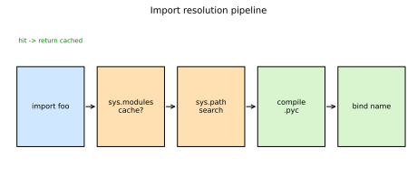
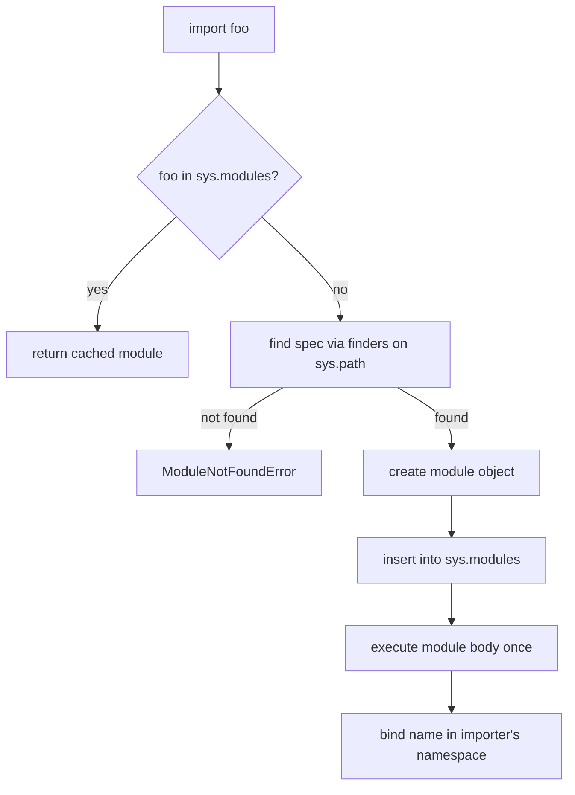
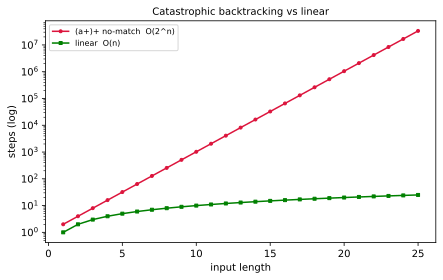
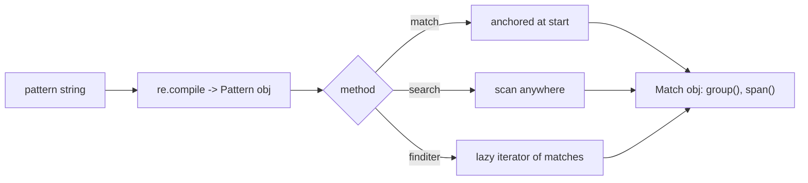
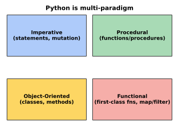
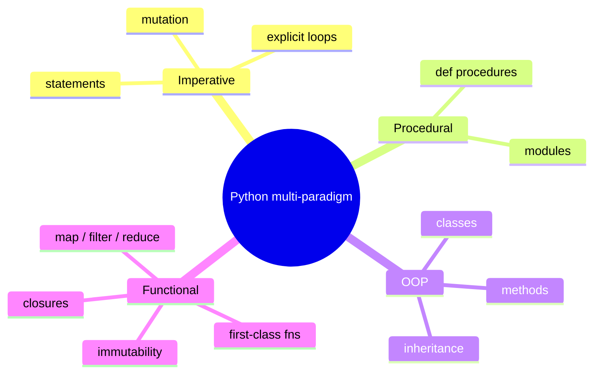

# Python Modules, Regular Expressions & Paradigms

[toc]

> **TL;DR:** A module is a `.py` file Python loads once and caches in `sys.modules`, with packages grouping modules and `__name__` distinguishing library from script. The `re` module compiles patterns into a backtracking matcher whose nested quantifiers can blow up to exponential time. Python is deliberately multi-paradigm — imperative, procedural, object-oriented, and functional — with first-class functions making functional style fully native.

## Modules

> **TL;DR:** A module is just a `.py` file that Python loads once, caches in `sys.modules`, and exposes as a namespace object. `import` searches `sys.path`, packages are directories that group modules (optionally with `__init__.py`), and `__name__` lets a file act as both an importable library and a runnable script.

### Vocabulary

**Module**

```math
\text{module} : \text{file} \rightarrow \text{namespace object}
```

A single `.py` file (or a compiled extension) whose top-level names become attributes of a module object. Importing it runs its top-level code exactly once per interpreter.

**Package**

```math
\text{package} : \text{directory of modules}
```

A directory that Python treats as a namespace of submodules. A *regular package* contains an `__init__.py`; a *namespace package* (PEP 420) omits it and can span multiple directories.

**`sys.path`**

An ordered list of directory strings Python searches to satisfy an import. The first match wins, so ordering matters.

**`sys.modules`**

The import cache: a dict mapping dotted module names to already-loaded module objects. A second import of the same name returns the cached object instead of re-executing the file.

**`__name__`**

A string attribute set to `"__main__"` when the file is run directly, or to the module's dotted import name when it is imported.

### Intuition

Think of a module as a labelled box. The first time you ask for the box, Python finds it, runs everything inside once, seals it, and files it under its name. Every later request for that name hands back the same sealed box — fast, and with shared state. Packages are just nested shelves of boxes, and the dotted path `a.b.c` is the address you read off the shelf labels.

The single hardest idea is *run-once caching*: import side effects (printing, opening connections, registering plugins) happen exactly once, no matter how many files import the module.

### How it works

An `import foo` statement is not a textual include like C's `#include`. It is a runtime function call (`__import__`) that resolves a name, executes a module body if needed, binds the result, and caches it. The pipeline below shows the path from statement to bound name.





#### Finding and loading

Python asks each *finder* on `sys.meta_path` to produce a *spec* for the requested name. For source files the path-based finder walks `sys.path` directory by directory. `sys.path` is seeded from the script's directory (or `''` for the cwd in the REPL), the `PYTHONPATH` env var, and the interpreter's standard library locations.

```python
import sys
print(sys.path[:3])          # search order; index 0 is usually the script dir
print("os" in sys.modules)   # True once the stdlib has imported os
```

#### Builtin vs custom modules

Builtin and standard-library modules (`sys`, `os`, `math`, `json`) ship with CPython; some like `sys` are compiled into the interpreter and have no `.py` file. Custom modules are your own files found on `sys.path`. Both end up as identical module objects — the only difference is where the loader found them.

```python
import math, sys
print(math.__file__ if hasattr(math, "__file__") else "builtin")
print(sys.builtin_module_names[:5])   # names with no source file
```

#### Packages and `__init__.py`

A package is a directory. With a regular package, `__init__.py` runs when the package is first imported and is the right place to define the package's public API or re-export submodules. Submodules are addressed by dotted paths and are loaded lazily — `import pkg` does not import `pkg.sub` unless `__init__.py` does so explicitly.

```python
# pkg/__init__.py
from .core import main_function   # flatten the public API
__all__ = ["main_function"]       # controls `from pkg import *`
```

#### `__name__` and the script guard

Because a module's body runs on import, code you only want to run when the file is the entry point must be guarded. The idiom checks `__name__`.

```python
def cli():
    print("running as a program")

if __name__ == "__main__":   # True only via `python thisfile.py`
    cli()
```

### Real-world example

You are building a small data tool. You want `metrics.py` to be importable as a library *and* runnable as `python metrics.py data.csv` for ad-hoc checks. The script guard plus relative-free imports make both work.

```python
# project/metrics.py
import sys
import statistics


def summarize(values):
    """Return mean and stdev; reusable by other modules."""
    return {
        "mean": statistics.fmean(values),
        "stdev": statistics.pstdev(values),
    }


def _main(argv):
    nums = [float(x) for x in argv[1:]]
    print(summarize(nums))


if __name__ == "__main__":   # CLI path
    _main(sys.argv)

# Elsewhere:  from metrics import summarize  -> reuses the function,
# and the _main block does NOT fire on import.
```

### In practice

Use absolute imports (`from package.module import thing`) for clarity, and explicit relative imports (`from .sibling import thing`) only inside packages. Run packages with `python -m package.module` so the package root is on `sys.path` and relative imports resolve correctly.

> [!TIP]
> `python -m mypkg.cli` is the production-grade way to launch a package entry point. It sets up `sys.path` and `__package__` correctly, unlike `python mypkg/cli.py`, which breaks relative imports.

> [!IMPORTANT]
> Top-level module code is an initialization contract: it runs once, at first import, in import order. Put expensive work (network calls, large file reads, heavy `__init__.py` logic) behind functions, not at module top level, or every importer pays the cost.

### Pitfalls

- **"Re-importing re-runs the file."** Wrong — `sys.modules` caches it; subsequent imports are near-free and return the same object. Use `importlib.reload()` if you genuinely need to re-execute.
- **Circular imports.** `a` imports `b` while `b` imports `a` can yield a half-initialized module and `ImportError` / `AttributeError`. Fix by importing inside a function, or by splitting shared code into a third module.
- **Shadowing stdlib names.** A local file named `random.py` or `string.py` on `sys.path[0]` will be imported instead of the standard library, breaking unrelated code with cryptic errors.
- **Mutable module-level state is global.** Because the module is cached, a list or dict defined at top level is shared across all importers — convenient, and a frequent source of test-pollution bugs.

## Regular Expressions

> **TL;DR:** The `re` module compiles a pattern string into a matcher that scans text for structure — anchors pin position, character classes and quantifiers describe shape, and groups capture pieces. Python's engine backtracks, so naive nested quantifiers on non-matching input can blow up to exponential time (catastrophic backtracking).

### Vocabulary

**Pattern**

A string of literal characters plus metacharacters that describes a set of strings to match. Compile it once with `re.compile` for reuse.

**Anchor**

A zero-width assertion that matches a *position*, not a character: `^` start, `$` end, `\b` word boundary, `\B` non-boundary.

**Quantifier**

```math
\{m,n\},\ *,\ +,\ ?
```

A repetition operator. `*` = 0+, `+` = 1+, `?` = 0 or 1, `{m,n}` = between m and n. Greedy by default; append `?` for lazy.

**Group**

A parenthesized sub-pattern `( ... )` that both bundles for quantification and *captures* the matched text for retrieval. `(?: ... )` groups without capturing; `(?P<name> ... )` names the capture.

**Backtracking**

The engine's strategy of trying one branch/repetition count, and on failure rewinding to try another. Excessive backtracking on ambiguous patterns is the root of regex performance disasters.

### Intuition

A regex is a tiny program for a string-shaped problem. You are describing the *shape* of text — "three digits, a dash, four digits" — and letting the engine find every occurrence of that shape. The danger is that Python's backtracking engine explores choices like a maze-walker who retries every wrong turn; with nested quantifiers the number of paths explodes. The chart contrasts a pathological pattern against linear scanning.



### How it works

`re.compile(pattern)` builds a matcher object; methods like `match`, `search`, `findall`, `finditer`, and `sub` then run it against text. `match` anchors at the start, `search` scans anywhere, `findall` returns all non-overlapping hits. Capturing groups are recovered from the match object via `.group(n)` or `.groupdict()`.



#### Anchors and character classes

Anchors and classes are the building blocks. `\d` (digit), `\w` (word char), `\s` (whitespace), and `[...]` custom classes describe *what*; anchors describe *where*. Pin a full-string match with `^...$` (or use `re.fullmatch`).

```python
import re

print(bool(re.fullmatch(r"\d{3}-\d{4}", "555-1234")))   # True
print(re.findall(r"\bcat\b", "cat category cats"))       # ['cat']
```

#### Groups and extraction

Wrap the parts you want to pull out in parentheses; each becomes a numbered capture, or a named one with `(?P<name>...)`. Use `finditer` for a lazy iterator of `Match` objects when scanning large text.

```python
log = "2026-06-14 ERROR auth failed"
m = re.match(r"(?P<date>\d{4}-\d{2}-\d{2}) (?P<level>\w+)", log)
print(m.group("date"), m.group("level"))   # 2026-06-14 ERROR
```

#### Greedy vs lazy quantifiers

Greedy quantifiers (`*`, `+`) grab as much as possible, then backtrack to fit the rest of the pattern; lazy ones (`*?`, `+?`) grab as little as possible. The classic HTML-ish trap: `<.+>` matches across two tags, while `<.+?>` stops at the first `>`.

```python
s = "<a><b>"
print(re.findall(r"<.+>", s))    # ['<a><b>']  greedy: whole span
print(re.findall(r"<.+?>", s))   # ['<a>', '<b>']  lazy: each tag
```

#### Catastrophic backtracking

When a pattern lets the same text be split many ways — typically nested or adjacent quantifiers like `(a+)+`, `(a|a)*`, or `\d+\d+` — a failing match forces the engine to try an exponential number of splits before giving up. Input that *almost* matches is the worst case.

```python
import re
# DANGER: on a long run of 'a' followed by '!', this can hang for seconds+
evil = re.compile(r"(a+)+$")
# evil.match("a" * 30 + "!")   # exponential blow-up — do NOT run on big n
safe = re.compile(r"a+$")      # linear equivalent
```

> [!CAUTION]
> Never feed user-controlled text to a pattern with nested quantifiers (`(x+)+`, `(x*)*`, overlapping alternations). It is a denial-of-service vector (ReDoS): one crafted string can pin a CPU core. Rewrite to remove ambiguity, add anchors, or use a non-backtracking engine like Google `re2`.

### Real-world example

You are validating and parsing structured log lines, extracting timestamp, level, and message in one pass. Compiling the pattern once and using named groups keeps the parser fast and readable.

```python
import re

LINE = re.compile(
    r"^(?P<ts>\d{4}-\d{2}-\d{2}T\d{2}:\d{2}:\d{2})\s+"
    r"(?P<level>DEBUG|INFO|WARN|ERROR)\s+"
    r"(?P<msg>.+)$"
)


def parse(line):
    m = LINE.match(line)
    if not m:
        return None
    return m.groupdict()


print(parse("2026-06-14T09:30:00 ERROR auth: invalid token"))
# {'ts': '2026-06-14T09:30:00', 'level': 'ERROR', 'msg': 'auth: invalid token'}
```

### In practice

Compile patterns you reuse (`re.compile`), use raw strings (`r"..."`) so backslashes survive, and add `re.VERBOSE` to spread a complex pattern across commented lines. For fixed-string searches, plain `str` methods (`in`, `startswith`, `split`) are faster and clearer than regex.

> [!TIP]
> `re.VERBOSE` (a.k.a. `re.X`) lets you write multi-line, commented patterns where whitespace is ignored — turning a write-only one-liner into something reviewable. Combine flags with `re.compile(pat, re.VERBOSE | re.IGNORECASE)`.

> [!WARNING]
> Without a raw string, `"\bword\b"` is interpreted by Python first — `\b` becomes a backspace character, not a regex word boundary. Always write regex literals as `r"..."`.

### Pitfalls

- **`match` vs `search`.** `re.match` only anchors at the *start* of the string; use `re.search` to find anywhere, or `re.fullmatch` to require the whole string.
- **Forgetting raw strings.** Backslash escapes get eaten by Python's string parser before the regex sees them.
- **`findall` group surprise.** With capturing groups, `findall` returns the *groups*, not the whole match; with multiple groups it returns tuples. Use `finditer` for full `Match` objects.
- **Greedy by default.** `.+` and `.*` overshoot; reach for the lazy `.+?` / `.*?` when matching delimited spans.
- **Catastrophic backtracking.** Nested/ambiguous quantifiers turn near-miss input into exponential work — a real DoS risk on untrusted text.
- **Using regex to parse HTML/JSON.** These are not regular languages; use a real parser (`html.parser`, `json`).

## Paradigms

> **TL;DR:** Python is deliberately multi-paradigm: the same problem can be expressed imperatively, procedurally, with objects, or functionally, and idiomatic code mixes them. Because functions are first-class objects, functional style (passing, returning, and composing functions) is fully native, not bolted on.

### Vocabulary

**Paradigm**

A style of structuring computation — a set of conventions for how state, control flow, and abstraction are organized. A language can support several at once.

**First-class function**

A function that can be assigned to a variable, stored in a data structure, passed as an argument, and returned from another function — treated exactly like any other value.

**Higher-order function**

```math
H : (A \to B) \to C
```

A function that takes another function as input and/or returns one — e.g. `map`, `filter`, `sorted(key=...)`, decorators.

**Pure function**

A function whose output depends only on its inputs and which causes no observable side effects (no mutation, no I/O). Pure functions are easy to test and reason about.

**Immutability**

A property of values that cannot change after creation (`tuple`, `str`, `frozenset`). Functional code favors it to avoid shared mutable state.

### Intuition

Picture four lenses over the same camera. *Imperative*: "do this, then change that" — explicit steps and mutation. *Procedural*: bundle those steps into reusable named procedures. *Object-oriented*: bind data to the operations that act on it, behind a public interface. *Functional*: build behavior by composing small pure functions and passing them around. Python hands you all four lenses and lets you switch per task.



### How it works

None of these styles is privileged by the interpreter — they are conventions over the same object model, where *everything*, including functions and classes, is an object. The art is choosing the lowest-ceremony style that makes the code clear: a script may stay imperative, a domain model goes OOP, a data pipeline goes functional.



#### Imperative and procedural

Imperative code is a sequence of statements that mutate state. Procedural code is imperative code organized into named procedures (`def`) and modules — the default style for scripts and glue code. The two blur together; "procedural" simply adds the abstraction of callable units.

```python
def total_price(items, tax_rate):
    total = 0.0                 # mutable accumulator — imperative core
    for item in items:          # explicit loop
        total += item["price"]
    return total * (1 + tax_rate)

print(total_price([{"price": 10}, {"price": 5}], 0.1))   # 16.5
```

#### Object-oriented

OOP binds state to the behavior that operates on it, exposing a method interface and hiding internals. Python supports classes, inheritance, polymorphism via duck typing, and special "dunder" methods that integrate objects with language operators.

```python
class Cart:
    def __init__(self) -> None:
        self._items: list[float] = []

    def add(self, price: float) -> None:
        self._items.append(price)

    def total(self, tax_rate: float) -> float:
        return sum(self._items) * (1 + tax_rate)

cart = Cart()
cart.add(10); cart.add(5)
print(cart.total(0.1))   # 16.5
```

#### Functional

Functional style treats functions as data and prefers pure transformations over mutation. First-class functions make `map`, `filter`, `functools.reduce`, partial application, and closures natural. The result is declarative: you describe *what* to compute, not *how* to loop.

```python
from functools import reduce

prices = [10, 5]
# pure, no mutable accumulator visible
subtotal = reduce(lambda acc, p: acc + p, prices, 0)
total = (lambda tax: subtotal * (1 + tax))(0.1)
print(total)   # 16.5
```

> [!TIP]
> First-class functions are what make decorators, callbacks, strategy injection, and `sorted(key=...)` possible. When you find yourself writing a class with a single method, a plain function or a closure is usually the more Pythonic functional alternative.

#### Multi-paradigm in one program

Real code blends styles: a class (OOP) whose method uses a comprehension (functional) inside an imperative loop. Python imposes no purity; it rewards choosing the clearest tool per unit of code.

```python
class ReportBuilder:
    def __init__(self, rows):
        self.rows = rows

    def summary(self):
        # functional comprehension inside an OOP method
        return {r["region"]: r["sales"] for r in self.rows if r["sales"] > 0}
```

### Real-world example

You need to process a stream of events: validate, transform, and aggregate. The cleanest solution mixes paradigms — a functional pipeline of small pure functions, orchestrated by a thin imperative driver, with results held in an immutable record.

```python
from dataclasses import dataclass
from functools import reduce

@dataclass(frozen=True)   # immutable record (functional flavor)
class Stats:
    count: int
    total: float

def is_valid(e: dict) -> bool:            # pure predicate
    return e.get("amount", 0) > 0

def fold(acc: Stats, e: dict) -> Stats:   # pure reducer
    return Stats(acc.count + 1, acc.total + e["amount"])

events = [{"amount": 10}, {"amount": -3}, {"amount": 7}]

# functional: filter then reduce; imperative driver is just the call
result = reduce(fold, filter(is_valid, events), Stats(0, 0.0))
print(result)   # Stats(count=2, total=17.0)
```

### In practice

> [!IMPORTANT]
> Python is *not* a pure functional language: there is no enforced immutability, recursion is limited by a default stack depth (~1000), and there is no tail-call optimization. Prefer comprehensions and generators over deep recursion, and use immutability as a discipline (`frozen=True`, tuples), not a guarantee.

- Use OOP when state and behavior belong together and you need polymorphism; use functions when a transformation is stateless.
- `functools` (`reduce`, `partial`, `lru_cache`, `wraps`) and `itertools` are the functional toolbox; `operator` supplies function forms of operators.
- Duck typing replaces interface inheritance: "if it quacks like a file, treat it as a file."

### Pitfalls

- **"Python is an OOP language."** — It is multi-paradigm; OOP is one option, not the default for every problem.
- **"`reduce` is the Pythonic way to sum/aggregate."** — For simple folds, a comprehension or built-in (`sum`, `max`) is clearer; reserve `reduce` for genuinely custom folds.
- **"Functional means recursion."** — In Python, iteration and generators are preferred; deep recursion hits `RecursionError`.
- **"`frozen=True` makes the object fully immutable."** — It blocks attribute *rebinding* but a contained mutable object (a list field) can still be mutated.

## Sources

- [The import system — Python Language Reference](https://docs.python.org/3/reference/import.html)
- [Modules tutorial](https://docs.python.org/3/tutorial/modules.html)
- [PEP 328 — Imports: Multi-Line and Absolute/Relative](https://peps.python.org/pep-0328/)
- [PEP 420 — Implicit Namespace Packages](https://peps.python.org/pep-0420/)
- [re — Regular expression operations](https://docs.python.org/3/library/re.html)
- [Regular Expression HOWTO](https://docs.python.org/3/howto/regex.html)
- [Russ Cox — Regular Expression Matching Can Be Simple And Fast](https://swtch.com/~rsc/regexp/regexp1.html)
- [OWASP — Regular expression Denial of Service (ReDoS)](https://owasp.org/www-community/attacks/Regular_expression_Denial_of_Service_-_ReDoS)
- Python howto — Functional Programming HOWTO: https://docs.python.org/3/howto/functional.html
- Python tutorial — Classes: https://docs.python.org/3/tutorial/classes.html
- The Zen of Python (PEP 20): https://peps.python.org/pep-0020/

## Related

- [Language Basics](./01-language-basics.md)
- [Built-in Data Structures](./02-builtin-data-structures.md)
- [Advanced Functions](./03-advanced-functions.md)
- [OOP](./05-oop.md)
