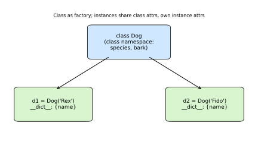
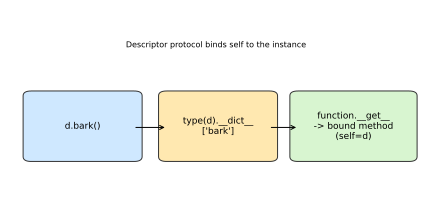
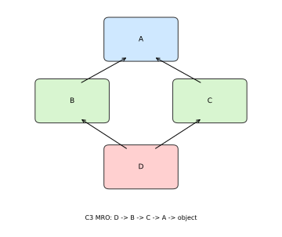
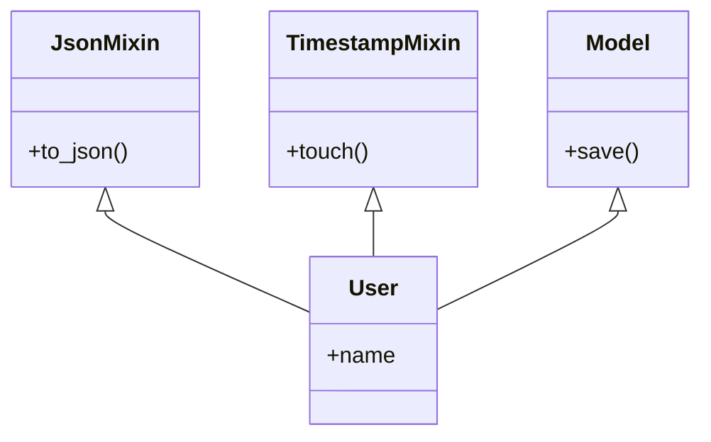
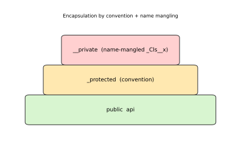
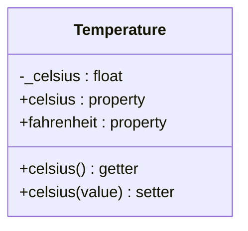

# Python Object-Oriented Programming

[toc]

> **TL;DR:** A class is a callable factory producing instances, each with its own `__dict__` while sharing class-level methods and attributes; methods are functions bound through the descriptor protocol, with `@classmethod`/`@staticmethod`/dunders covering the variants. Inheritance resolves attributes along the MRO (computed by C3 linearization), and `super()` walks the *instance's actual type* to make cooperative multiple inheritance work. Python encapsulates by convention (`_protected`), name mangling (`__private` → `_ClassName__private`), and `@property`, which turns attribute access into method calls without changing callers.

## Classes

> **TL;DR:** A class is a callable factory that produces instances, each carrying its own attribute namespace (`__dict__`) while sharing the class-level namespace for methods and class attributes. `__init__` initializes a freshly allocated instance; `dataclasses` auto-generate the boilerplate (`__init__`, `__repr__`, `__eq__`) from typed field declarations.

### Vocabulary

**Class**

```math
\text{Class} : \text{args} \rightarrow \text{instance}
```

A user-defined type and a callable. Calling it (`Dog("Rex")`) allocates a new instance and runs initialization.

**Instance**

An individual object produced by a class. It owns a per-object namespace `__dict__` holding instance attributes.

**Class attribute vs instance attribute**

A class attribute lives in the class namespace and is shared by every instance. An instance attribute lives in that instance's `__dict__` and shadows the class attribute on lookup.

**`__init__`**

The initializer (not the constructor). It runs after `__new__` has allocated the object, receiving the new instance as `self`, and sets up instance state. It must return `None`.

**`__new__`**

The actual constructor. It allocates and returns the new object; `__init__` then configures it. You rarely override `__new__` outside immutable types and metaclasses.

**Dataclass**

A class decorated with `@dataclass` whose typed class-body annotations become fields, from which Python synthesizes `__init__`, `__repr__`, and `__eq__`.

### Intuition

Picture a class as a cookie cutter and instances as the cookies. The cutter (class) defines shape and shared behavior; each cookie (instance) is a distinct object with its own decorations (instance attributes). Attribute lookup on an instance checks the cookie first, then falls back to the cutter.

The diagram below shows two instances of `Dog` sharing the class namespace while each holds its own `__dict__`.



### How it works

A class statement executes its body in a fresh namespace, then builds a class object from that namespace via the metaclass `type`. Instances are then created by calling the class. Understanding the two-step allocate-then-initialize flow and the shared-vs-owned attribute split is the core of the model.

#### Defining a class and `__init__`

The `class` keyword opens a new namespace; everything assigned in the body becomes a class attribute, including `def` statements which become methods. `__init__` receives the brand-new instance as its first parameter (`self`) and assigns instance attributes onto it. It is called automatically by the class call; you never call `__init__` directly.

```python
class Dog:
    species = "Canis familiaris"   # class attribute, shared

    def __init__(self, name: str, age: int) -> None:
        self.name = name           # instance attribute, per-object
        self.age = age

d = Dog("Rex", 3)
print(d.name, d.species)           # Rex Canis familiaris
```

#### Class attributes vs instance attributes

A class attribute is shared storage; mutating it through the class affects all instances. Assigning to `self.x` always writes to the instance `__dict__`, creating a shadowing attribute even if a class attribute of the same name exists. This asymmetry is the classic source of the mutable-default-class-attribute bug.

```python
class Counter:
    total = 0                      # shared
    def __init__(self):
        self.local = 0             # per-instance

a, b = Counter(), Counter()
Counter.total += 1                 # affects the class, seen by all
a.local += 5                       # only a changes
print(a.total, b.total, a.local, b.local)  # 1 1 5 0
```

#### Dataclasses

`@dataclass` reads the class body's annotated names as fields and synthesizes the boilerplate, so you declare data shape once. Use `field(default_factory=...)` for mutable defaults (never a bare `[]`), and `frozen=True` for immutable, hashable instances.

```python
from dataclasses import dataclass, field

@dataclass(frozen=True)
class Point:
    x: float
    y: float
    tags: list[str] = field(default_factory=list)

p = Point(1.0, 2.0)
print(p)                           # Point(x=1.0, y=2.0, tags=[])
```

### Real-world example

A small inventory record is the canonical case: you want value semantics (two records with equal fields compare equal), a readable repr for logs, and no hand-written boilerplate. A dataclass delivers all three, and `__post_init__` runs validation after the synthesized `__init__`.

```python
from dataclasses import dataclass, field

@dataclass
class Product:
    sku: str
    price_cents: int
    tags: list[str] = field(default_factory=list)

    def __post_init__(self) -> None:
        if self.price_cents < 0:
            raise ValueError(f"negative price for {self.sku}")

    @property
    def price(self) -> float:
        return self.price_cents / 100

a = Product("A-1", 1999, ["sale"])
b = Product("A-1", 1999, ["sale"])
print(a == b)        # True  -> synthesized __eq__ compares fields
print(a)             # Product(sku='A-1', price_cents=1999, tags=['sale'])
print(a.price)       # 19.99
```

### In practice

Dataclasses dominate modern Python for plain data containers; reach for them before hand-writing `__init__`/`__repr__`/`__eq__`. For pure speed and memory, `__slots__` (or `@dataclass(slots=True)` on 3.10+) drops the per-instance `__dict__`, cutting memory and speeding attribute access on hot paths with millions of objects.

> [!TIP]
> `@dataclass(slots=True, frozen=True)` gives you a compact, immutable, hashable value object — ideal as a dictionary key or set member, and friendly to the CPU cache.

> [!IMPORTANT]
> Class attributes are evaluated **once**, at class-definition time. A mutable class attribute (`cache = {}`) is shared across every instance forever — almost always a bug unless you genuinely want shared state.

### Pitfalls

- **Mutable default in a plain class** — `def __init__(self, items=[])` shares one list across all calls. Use `items=None` then `self.items = items or []`, or a dataclass `field(default_factory=list)`.
- **Confusing class and instance attributes** — `instance.attr += 1` on an integer class attribute silently creates a shadowing instance attribute; the class attribute is untouched.
- **Thinking `__init__` constructs the object** — it does not; `__new__` allocates, `__init__` only initializes. `__init__` returning anything but `None` raises `TypeError`.
- **Forgetting `default_factory`** — a bare mutable default in a dataclass raises `ValueError` at class definition precisely to prevent the shared-mutable bug.

## Methods

> **TL;DR:** A method is just a function stored in a class namespace; accessing it through an instance triggers the descriptor protocol, which binds the instance as the first argument (`self`). `@classmethod` binds the class as `cls`, `@staticmethod` binds nothing, and dunder methods (`__len__`, `__eq__`, …) let your objects participate in built-in syntax.

### Vocabulary

**Method**

A function defined in a class body. Plain methods receive the instance as their first parameter by convention named `self`.

**Bound method**

The callable produced when you access an instance method through an instance. It captures the instance, so `d.bark()` is `Dog.bark(d)`.

**`self`**

The conventional name for the first parameter of an instance method, holding the instance the method was called on. It is not a keyword; the binding is automatic.

**Classmethod**

```math
\text{classmethod} : (\text{cls}, \dots) \rightarrow \text{result}
```

A method decorated with `@classmethod` whose first argument is the class, not the instance. Used for alternative constructors and class-level operations.

**Staticmethod**

A method decorated with `@staticmethod` that receives neither instance nor class — a plain function namespaced inside the class for organization.

**Dunder (special) method**

A method with a double-underscore name (`__init__`, `__len__`, `__add__`) that Python calls implicitly to implement operators and built-in functions.

**Descriptor**

An object defining `__get__`/`__set__`. Functions are descriptors; their `__get__` is what produces a bound method from an attribute access.

### Intuition

Think of a method as a function lying in a drawer (the class). When you reach for it through an instance, Python attaches a sticky note saying "and use this instance as self," handing you a bound method. Class and static methods change what gets stuck to the note — the class, or nothing.

The diagram shows the lookup-and-bind chain that turns `d.bark` into a callable carrying `self=d`.



### How it works

Method dispatch reuses the attribute-lookup machinery: Python finds the function on the type, then invokes the descriptor protocol to bind it. The three method kinds differ only in what their descriptor binds as the leading argument.

#### Instance methods and `self`

A plain method is a descriptor: `instance.method` calls `function.__get__(instance, type)`, returning a bound method that pre-fills `self`. That is why `Dog.bark(d)` and `d.bark()` are equivalent. `self` is ordinary — you could rename it, but every linter and reader expects `self`.

```python
class Dog:
    def bark(self, times: int) -> str:
        return "woof " * times

d = Dog()
print(d.bark(2))              # woof woof
print(Dog.bark(d, 2))         # identical: explicit self
print(d.bark.__self__ is d)   # True: the bound instance
```

#### Classmethods and staticmethods

`@classmethod` binds the class as `cls`, making it the idiomatic home for alternative constructors that must respect subclasses. `@staticmethod` binds nothing; it is a namespaced free function — use it for helpers that need neither instance nor class state.

```python
class Date:
    def __init__(self, y: int, m: int, d: int):
        self.y, self.m, self.d = y, m, d

    @classmethod
    def from_iso(cls, s: str) -> "Date":
        y, m, d = map(int, s.split("-"))
        return cls(y, m, d)        # cls -> subclass-aware

    @staticmethod
    def is_leap(y: int) -> bool:
        return y % 4 == 0 and (y % 100 != 0 or y % 400 == 0)

print(Date.from_iso("2026-06-14").m)  # 6
print(Date.is_leap(2024))             # True
```

#### Dunder methods

Dunder methods hook your objects into language syntax: Python translates `len(x)` to `type(x).__len__(x)`, `a + b` to `type(a).__add__(a, b)`, and so on. Implementing them gives your type natural, Pythonic behavior. Crucially, special methods are looked up on the **type**, not the instance, so per-instance overrides of dunders are ignored by implicit calls.

```python
class Vec:
    def __init__(self, x, y): self.x, self.y = x, y
    def __add__(self, o): return Vec(self.x + o.x, self.y + o.y)
    def __eq__(self, o): return (self.x, self.y) == (o.x, o.y)
    def __repr__(self): return f"Vec({self.x}, {self.y})"
    def __len__(self): return 2

print(Vec(1, 2) + Vec(3, 4))   # Vec(4, 6)
print(Vec(1, 2) == Vec(1, 2))  # True
print(len(Vec(1, 2)))          # 2
```

### Real-world example

A money type benefits from all three method kinds: an alternative constructor (`from_dollars`) as a classmethod, a stateless validator as a staticmethod, and dunders so arithmetic and printing feel native. This is exactly how libraries model domain values.

```python
from __future__ import annotations

class Money:
    def __init__(self, cents: int) -> None:
        Money.validate(cents)
        self.cents = cents

    @classmethod
    def from_dollars(cls, dollars: float) -> Money:
        return cls(round(dollars * 100))

    @staticmethod
    def validate(cents: int) -> None:
        if not isinstance(cents, int):
            raise TypeError("cents must be int")

    def __add__(self, other: Money) -> Money:
        return Money(self.cents + other.cents)

    def __repr__(self) -> str:
        return f"${self.cents / 100:.2f}"

total = Money.from_dollars(4.50) + Money(150)
print(total)          # $6.00
print(Money.from_dollars(4.50).__add__(Money(150)))  # $6.00
```

### In practice

Use a classmethod whenever a factory must produce the right subclass — returning `cls(...)` instead of a hard-coded class name keeps inheritance working. Reserve staticmethods for genuinely instance-free helpers; if it touches neither `self` nor `cls`, consider whether a module-level function is clearer.

> [!WARNING]
> Define `__eq__` and you implicitly set `__hash__` to `None`, making instances unhashable. If you need equal-and-hashable objects, also define `__hash__` (or use `@dataclass(frozen=True)`, which does both).

> [!TIP]
> Implement `__repr__` on every domain class — it is what shows up in logs, tracebacks, and the REPL. Make it unambiguous; `__str__` is for human-facing display and falls back to `__repr__` if absent.

### Pitfalls

- **Forgetting `self`** — `def bark():` then `d.bark()` raises `TypeError` because the bound instance is still passed as the first argument.
- **Hard-coding the class in a factory** — returning `Date(...)` instead of `cls(...)` breaks subclasses; they get a base instance.
- **Per-instance dunder override** — assigning `obj.__len__ = ...` does nothing for `len(obj)`; special methods resolve on the type.
- **Mutable shared state via classmethod** — a classmethod mutating a class attribute changes behavior for every instance and subclass.

## Inheritance

> **TL;DR:** Inheritance lets a subclass reuse and extend a base class; attribute lookup follows the Method Resolution Order (MRO), a single linear sequence computed by the C3 linearization algorithm. `super()` walks the MRO of the *instance's actual type*, not just the static parent, which is what makes cooperative multiple inheritance and mixins work correctly.

### Vocabulary

**Base class / subclass**

A base (parent) class is inherited from; a subclass (child) inherits its attributes and methods and may override or extend them.

**Override**

Redefining in a subclass a method that exists in a base, replacing the base behavior for instances of the subclass.

**MRO (Method Resolution Order)**

```math
\text{MRO}(C) = [C, \dots, \texttt{object}]
```

The ordered list of classes Python searches for an attribute on an instance of `C`. Available as `C.__mro__` or `C.mro()`.

**C3 linearization**

The algorithm computing the MRO. It merges the MROs of all bases while preserving local precedence (a class precedes its parents) and monotonicity (a consistent order across the hierarchy).

**`super()`**

A proxy that dispatches to the *next* class in the instance's MRO after the current one — not necessarily the literal base. This enables cooperative method calls.

**Mixin**

A small class supplying a focused capability via methods, never instantiated alone, designed to be combined with others through multiple inheritance.

### Intuition

A subclass is a base class plus deltas. With single inheritance the search path is an obvious chain; with multiple inheritance Python must flatten a graph into one consistent line so that "the next method" is always well-defined. C3 is the recipe that produces that line.

The diamond below — `D` inheriting from both `B` and `C`, which share base `A` — is the textbook case where naive lookup would visit `A` twice; C3 visits it exactly once, last.



### How it works

Inheritance is implemented as attribute lookup along the MRO. When you read `obj.attr`, Python scans `type(obj).__mro__` left to right and returns the first match. Overriding works because the subclass appears before its bases in that list.

#### MRO and C3 linearization

C3 builds the MRO by merging, for a class C with bases B1…Bn, the lists `[C]`, the MRO of each base, and the list of bases themselves, always taking a head that does not appear in the tail of any remaining list. If no such head exists, the hierarchy is inconsistent and Python raises `TypeError` at class creation. The result guarantees each class appears once and every class precedes its ancestors.

```python
class A: ...
class B(A): ...
class C(A): ...
class D(B, C): ...

print([c.__name__ for c in D.__mro__])
# ['D', 'B', 'C', 'A', 'object']  -> A appears once, last before object
```

#### `super()` and cooperative calls

`super()` does not mean "the parent" — it means "the next class in `type(self).__mro__` after the current class." Inside `B.method`, `super().method()` may dispatch to `C` (a sibling in the diamond), not to `A`. This is why every cooperating method must call `super()` and share a compatible signature; otherwise the chain breaks.

```python
class A:
    def greet(self): return ["A"]
class B(A):
    def greet(self): return ["B"] + super().greet()
class C(A):
    def greet(self): return ["C"] + super().greet()
class D(B, C):
    def greet(self): return ["D"] + super().greet()

print(D().greet())   # ['D', 'B', 'C', 'A'] -> follows the MRO, A visited once
```

#### Multiple inheritance and mixins

A mixin packages one capability and is combined left-of the base so its methods take precedence and its `super()` calls flow into the base. Order matters: bases are listed most-specific-first, and the rightmost is typically the "real" base class. The chart below shows the conventional combine pattern.



### Real-world example

Mixins shine when several unrelated capabilities (serialization, timestamping) must attach to many model classes without a deep hierarchy. Each mixin is independent and cooperative; `User` composes them plus a base `Model`.

```python
import json, time

class Model:
    def __init__(self, **kw):
        self.__dict__.update(kw)
    def save(self) -> str:
        return f"saved {type(self).__name__}"

class JsonMixin:
    def to_json(self) -> str:
        return json.dumps(self.__dict__)

class TimestampMixin:
    def touch(self) -> None:
        self.updated_at = int(time.time())

class User(JsonMixin, TimestampMixin, Model):
    pass

u = User(name="Ada", id=1)
u.touch()
print([c.__name__ for c in User.__mro__])
# ['User', 'JsonMixin', 'TimestampMixin', 'Model', 'object']
print(u.save())                # saved User
print("name" in u.to_json())   # True
```

### In practice

Favor composition over deep inheritance trees; reach for inheritance when there is a genuine is-a relationship, and for mixins when you need orthogonal, reusable behavior. Keep mixin method signatures `**kwargs`-friendly so cooperative `super().__init__(**kwargs)` chains don't break when classes are recombined.

> [!IMPORTANT]
> `super().__init__(...)` must be called in **every** cooperating `__init__` for multiple inheritance to initialize all bases. A class that silently skips `super().__init__` truncates the chain and leaves later bases uninitialized.

> [!TIP]
> Use `class Animal(ABC)` with `@abstractmethod` to define an interface that subclasses must implement; instantiating a subclass that left an abstract method unimplemented raises `TypeError`.

### Pitfalls

- **Treating `super()` as "the parent"** — in multiple inheritance it routes to a sibling per the MRO; assuming the literal base skips cooperating classes.
- **Inconsistent base order** — `class D(C, B)` where another part of the hierarchy needs `B` before `C` raises `TypeError: Cannot create a consistent MRO`.
- **Forgetting to call `super()`** — breaks the cooperative chain; downstream bases never run their logic.
- **Deep inheritance for code reuse** — brittle and hard to follow; composition or a mixin is usually clearer.

## Encapsulation

> **TL;DR:** Python has no true private fields; it encapsulates by convention (`_protected`) and by name mangling (`__private` becomes `_ClassName__private` to avoid subclass collisions). `@property` turns attribute access into method calls, so you can add validation or computation behind a plain `obj.x` interface without changing callers.

### Vocabulary

**Encapsulation**

Bundling state with the methods that govern it and controlling external access so invariants stay protected. In Python this is enforced by convention plus name mangling, not by the compiler.

**`_protected` (single underscore)**

A naming convention signaling "internal; use at your own risk." It has no runtime enforcement but tells tools and humans the name is non-public; `from module import *` skips such module names.

**`__private` (double underscore) / name mangling**

```math
\texttt{\_\_x} \;\rightarrow\; \texttt{\_ClassName\_\_x}
```

A leading double-underscore name (no trailing dunder) is textually rewritten by the compiler to include the class name, preventing accidental override by subclasses. It is privacy by obscurity of the name, not access control.

**Property**

A class attribute, created by `@property`, that runs getter/setter/deleter methods on attribute access, letting computed or validated values masquerade as plain attributes.

**Getter / setter**

Methods that read and write a managed attribute. In Python they are usually implemented via `@property` rather than explicit `get_x()`/`set_x()` calls.

### Intuition

Python trusts the programmer: "we're all consenting adults." Instead of locked doors it puts up signs — one underscore says "staff only," two underscores rename the room so a renovation upstairs can't accidentally knock through your wall. Properties let you swap a public field for a method later without the neighbors noticing.

The figure shows the three access layers from open public API down to name-mangled private storage.



### How it works

Encapsulation in Python combines a social contract (underscore conventions) with one real mechanism (name mangling) and one powerful tool (the descriptor-based `property`). None of these block determined access; they prevent *accidental* misuse and let interfaces evolve.

#### Conventions: `_protected`

A single leading underscore is purely conventional: `self._cache` is reachable from anywhere but marked internal. It documents intent and influences `import *` and editor "public API" views, but the attribute is fully accessible. Use it for implementation details you may change.

```python
class Cache:
    def __init__(self):
        self._store = {}          # internal, but reachable
    def get(self, k):
        return self._store.get(k)

c = Cache()
print(c._store)                   # {} -> allowed, just discouraged
```

#### Name mangling: `__private`

A double-underscore-prefixed name (with no trailing dunder) is rewritten by the compiler from `__x` to `_ClassName__x` within the class body. The purpose is to avoid name clashes when a subclass defines an attribute of the same simple name — not to hide data. You can still reach it via the mangled name.

```python
class Account:
    def __init__(self, balance):
        self.__balance = balance          # stored as _Account__balance
    def balance(self):
        return self.__balance

a = Account(100)
print(a.balance())                # 100
print(a._Account__balance)        # 100 -> not truly private
print("__balance" in vars(a))     # False; stored mangled
```

#### Properties, getters and setters

`@property` makes a method callable as an attribute, and a matching `@x.setter` intercepts assignment, letting you validate or compute without breaking the `obj.x` interface. The idiom is to store the real value in a `_x` backing field and expose validated access through the property. The relationship between the public property and its backing field is shown below.



```python
class Temperature:
    def __init__(self, celsius: float):
        self.celsius = celsius            # goes through the setter

    @property
    def celsius(self) -> float:
        return self._celsius

    @celsius.setter
    def celsius(self, value: float) -> None:
        if value < -273.15:
            raise ValueError("below absolute zero")
        self._celsius = value

    @property
    def fahrenheit(self) -> float:        # computed, read-only
        return self._celsius * 9 / 5 + 32

t = Temperature(25)
print(t.fahrenheit)        # 77.0
t.celsius = 30             # validated assignment
print(t.celsius)           # 30
```

### Real-world example

A bank account is the canonical encapsulation case: the balance must never go negative and must only change through `deposit`/`withdraw`. Storing it in a mangled field and exposing a read-only property enforces the invariant while keeping a clean public surface.

```python
class BankAccount:
    def __init__(self, opening: int):
        self.__balance = 0
        self.deposit(opening)

    @property
    def balance(self) -> int:             # read-only public view
        return self.__balance

    def deposit(self, amount: int) -> None:
        if amount <= 0:
            raise ValueError("deposit must be positive")
        self.__balance += amount

    def withdraw(self, amount: int) -> None:
        if amount > self.__balance:
            raise ValueError("insufficient funds")
        self.__balance -= amount

acct = BankAccount(100)
acct.deposit(50)
acct.withdraw(30)
print(acct.balance)        # 120
# acct.balance = 0  -> AttributeError: property has no setter
```

### In practice

Default to plain public attributes; only introduce a property when you actually need validation, computation, or a future-proof seam — adding one later is a non-breaking change for callers. Reserve `__private` mangling for attributes a subclass might accidentally collide with; for ordinary "internal" state, a single underscore is the idiomatic and sufficient signal.

> [!IMPORTANT]
> Name mangling is **not security**. `_ClassName__x` is trivially reachable, and `vars(obj)` reveals everything. Never rely on `__private` to protect secrets — it only prevents accidental subclass name clashes.

> [!WARNING]
> A double-underscore name that also has a trailing double underscore (`__init__`) is **not** mangled — it is a dunder. Mangling applies only to leading-`__`, non-trailing-dunder names.

### Pitfalls

- **Treating `__x` as private** — it is mangled, not hidden; `obj._Class__x` reaches it. Use it for clash avoidance, not secrecy.
- **Java-style `get_x()`/`set_x()`** — unidiomatic in Python; expose a plain attribute and upgrade to `@property` only when behavior is needed.
- **Forgetting the backing field convention** — a property returning `self.x` (same name) recurses infinitely; store in `self._x`.
- **Mangling surprises across classes** — `__x` referenced inside a method resolves to the *defining* class's mangled name, which can confuse mixins relying on a shared simple name.

## Sources

- [Python Data Model — objects, types](https://docs.python.org/3/reference/datamodel.html)
- [`dataclasses` — Data Classes](https://docs.python.org/3/library/dataclasses.html)
- [PEP 557 — Data Classes](https://peps.python.org/pep-0557/)
- [Tutorial: Classes](https://docs.python.org/3/tutorial/classes.html)
- [Python Data Model — special method names](https://docs.python.org/3/reference/datamodel.html#special-method-names)
- [Descriptor HowTo Guide](https://docs.python.org/3/howto/descriptor.html)
- [`classmethod`](https://docs.python.org/3/library/functions.html#classmethod) / [`staticmethod`](https://docs.python.org/3/library/functions.html#staticmethod)
- [The Python 2.3 Method Resolution Order (C3)](https://docs.python.org/3/howto/mro.html)
- [`super`](https://docs.python.org/3/library/functions.html#super) — built-in
- [`abc` — Abstract Base Classes](https://docs.python.org/3/library/abc.html)
- [Tutorial: Private Variables (name mangling)](https://docs.python.org/3/tutorial/classes.html#private-variables)
- [`property`](https://docs.python.org/3/library/functions.html#property) — built-in
- [PEP 8 — Designing for Inheritance / naming conventions](https://peps.python.org/pep-0008/#designing-for-inheritance)

## Related

- [Advanced Functions](./03-advanced-functions.md)
- [Modules, Regex, and Paradigms](./04-modules-regex-paradigms.md)
- [Typing and Tooling](./08-typing-and-tooling.md)
