# Python Data Structures & Algorithms

[toc]

> **TL;DR:** This note covers the core data structures and algorithms behind everyday Python: arrays and linked lists, hashmaps, heaps/stacks/queues, binary search trees, recursion, and sorting. Each section pairs the abstract complexity with the idiomatic Python tool (`list`, `dict`, `deque`, `heapq`, `sorted`) so you can choose by access pattern. The recurring theme is matching the structure to your operations — index-heavy, splice-heavy, lookup-heavy, priority-heavy, or order-heavy.

## Arrays and Linked Lists

> **TL;DR:** Arrays (Python `list`) store elements contiguously, giving O(1) random access but O(n) head insertion; linked lists store elements as separate nodes joined by pointers, giving O(1) insertion at a known position but O(n) access. Choose by your access pattern: index-heavy work wants an array, splice-heavy work wants a list.

### Vocabulary

**Contiguous array**

```math
\text{addr}(A[i]) = \text{base} + i \cdot \text{stride}
```

A block of memory where element `i` sits at a computable offset from the base, so any index is reachable in constant time.

**Dynamic array**

A contiguous array that grows by allocating a larger block and copying — Python's `list`. Growth is geometric (over-allocation), making `append` O(1) *amortized*.

**Linked list node**

A record holding a value plus a reference (pointer) to the next node (and, in a doubly linked list, the previous node).

**Amortized cost**

The average cost per operation across a long sequence, even if individual operations occasionally cost O(n). Geometric resizing makes `append` O(1) amortized.

### Intuition

Picture an array as numbered parking spaces in one row: to reach space 500 you walk straight to it, but to insert a car at the front everyone must shuffle down one spot. A linked list is a treasure hunt — each clue points to the next location, so inserting a new clue between two others is trivial, but finding the 500th clue means following 499 pointers first.

The trade is **locality vs. flexibility**. Arrays pack data so the CPU cache prefetches neighbors, making scans fast. Linked lists scatter nodes across the heap, so each hop is a potential cache miss, but structural edits never require shifting bulk memory.

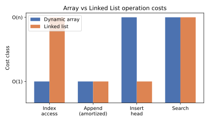

### How it works

Both structures hold an ordered sequence, but they answer "where is element i?" completely differently. The array computes an address; the list walks pointers.

#### Dynamic array growth

A Python `list` keeps a contiguous buffer with spare capacity. When `append` fills the buffer, CPython allocates a larger one (roughly 1.125× plus a constant), copies the old elements over, and frees the old block. Because the buffer grows geometrically, the total copy work across n appends is O(n), so each append averages O(1).

```python
import sys

lst = []
prev = -1
for i in range(17):
    lst.append(i)
    cap = sys.getsizeof(lst)
    if cap != prev:           # capacity bumped on this append
        print(f"len={len(lst):2d}  bytes={cap}")
        prev = cap
```

#### Singly linked list operations

A singly linked list keeps a `head` pointer. Inserting at the head is O(1): create a node and point it at the old head. Searching or indexing is O(n) because you must follow `next` from the head until you reach the target.

```python
class Node:
    __slots__ = ("val", "next")

    def __init__(self, val, nxt=None):
        self.val = val
        self.next = nxt

class LinkedList:
    def __init__(self):
        self.head = None

    def push_front(self, val):          # O(1)
        self.head = Node(val, self.head)

    def find(self, val):                # O(n)
        node = self.head
        while node:
            if node.val == val:
                return node
            node = node.next
        return None
```

#### Why head insertion differs

In an array, inserting at index 0 forces every existing element to slide one slot right — O(n) memory moves. In a linked list, the same insertion just rewires two pointers — O(1). This single asymmetry drives most data-structure choices.

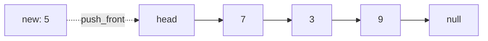

### Complexity

The table contrasts a Python dynamic array (`list`) with a singly linked list. "Known node" means you already hold a reference to the position.

| Operation | Dynamic array (`list`) | Linked list |
| :--- | :---: | :---: |
| Index access `a[i]` | O(1) | O(n) |
| Append / push back | O(1) amortized | O(1) with tail ptr, else O(n) |
| Insert / delete at head | O(n) | O(1) |
| Insert / delete at known node | O(n) (shift) | O(1) |
| Search by value | O(n) | O(n) |
| Memory overhead | low (contiguous) | high (pointer per node) |

```math
T_{\text{append}}(n) = \Theta(1)\ \text{amortized}, \qquad T_{\text{insert front, array}}(n) = \Theta(n)
```

> [!TIP]
> In real Python, a `collections.deque` (doubly linked list of blocks) gives O(1) appends and pops at *both* ends — reach for it instead of hand-rolling a linked list when you need a queue.

### Real-world example

Consider an LRU-cache eviction list or an undo history: you constantly splice items out of the middle and push new ones to the front. A doubly linked list does each edit in O(1). Below, a music playlist that supports O(1) "play next" insertion regardless of length.

```python
from collections import deque

class Playlist:
    def __init__(self):
        self._dq = deque()          # doubly linked under the hood

    def add_end(self, song):        # O(1)
        self._dq.append(song)

    def play_next(self, song):      # O(1) at the front
        self._dq.appendleft(song)

    def now_playing(self):          # O(1) pop front
        return self._dq.popleft() if self._dq else None

pl = Playlist()
pl.add_end("Track A")
pl.add_end("Track B")
pl.play_next("Urgent Jingle")
print(pl.now_playing())   # Urgent Jingle
print(pl.now_playing())   # Track A
```

### In practice

Python programmers almost never write raw singly linked lists; the built-in `list` and `collections.deque` cover the vast majority of needs and are implemented in C. Use `list` for index-addressable, append-heavy, scan-heavy workloads; use `deque` when you push and pop at both ends.

> [!IMPORTANT]
> Python's `list` is **not** a linked list — it is a dynamic array of pointers to `PyObject`s. `list.insert(0, x)` and `list.pop(0)` are O(n). If you find yourself doing those repeatedly, switch to `deque`.

The cache-locality advantage of arrays is large on modern hardware: a contiguous scan can be an order of magnitude faster than chasing pointers, even when both are O(n) in the abstract. Linked lists win only when the constant-factor cost of shifting array memory dominates, i.e. frequent structural edits far from the ends.

### Pitfalls

- **`list.pop(0)` in a loop** — Each call shifts the whole array; O(n²) overall. Use `deque.popleft()` (O(1)).
- **"Linked lists are faster for inserts"** — Only if you already hold the node. Finding the insertion point is still O(n), and pointer-chasing thrashes the cache.
- **Mutable default argument as a list** — `def f(acc=[])` shares one list across calls. Use `None` and create inside.
- **Assuming `append` is always O(1)** — It is O(1) *amortized*; a single append that triggers a resize copies the whole buffer.

## HashMaps

> **TL;DR:** A hashmap stores key-value pairs in a backing array, locating each key by hashing it to a slot index, giving expected O(1) lookup, insert, and delete. Python's `dict` is a hashmap with open addressing and a compact, insertion-ordered layout; its O(1) guarantees hold only when keys hash well and the load factor stays bounded.

### Vocabulary

**Hash function**

```math
h : \text{Key} \rightarrow \{0, 1, \dots, m-1\}
```

A function mapping a key to a slot index in a table of size m. A good hash spreads keys uniformly to minimize collisions.

**Collision**

Two distinct keys hashing to the same slot. Resolved by *chaining* (a list per slot) or *open addressing* (probe for the next free slot).

**Load factor**

```math
\alpha = \frac{n}{m}
```

The ratio of stored entries n to table size m. Performance degrades as α approaches 1; Python resizes the table before α exceeds ~2/3.

**Open addressing**

Collision resolution that stores all entries directly in the table array, probing a deterministic sequence of slots until a free one is found. CPython's `dict` uses a perturbed probe sequence.

### Intuition

A hashmap is a coat-check counter. You hand over a coat (the key); the attendant computes a ticket number from it (the hash) and hangs the coat on the numbered hook (the slot). To retrieve it, recompute the same ticket number and go straight to that hook — no scanning the whole rack. Two coats wanting the same hook is a collision, handled by a tie-break rule.

The magic is turning "search a collection" (O(n)) into "compute an address" (O(1)). The cost is that the address is only as good as the hash: cluster everything into one hook and you are back to a linear scan of that hook's chain.

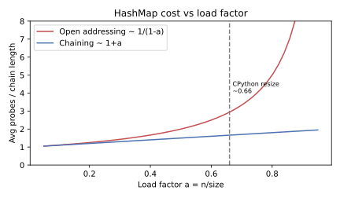

### How it works

A hashmap keeps a backing array of slots. Insertion hashes the key to a slot; if occupied by a different key, the structure resolves the collision and grows the table when it gets too full.

#### Hashing to a slot

The key is run through a hash function, and the result is reduced modulo the table size to pick a slot. Equal keys must produce equal hashes, so any custom key type must define `__hash__` and `__eq__` consistently.

```python
key = ("user", 42)
print(hash(key))            # large platform-dependent int
slot = hash(key) % 8        # reduce to a table of size 8
print(slot)
```

#### Collision resolution

When two keys land in the same slot, open addressing probes onward to find a free slot, while chaining appends to a per-slot bucket. Either way, lookup must compare keys (via `==`) because a matching slot does not guarantee a matching key.

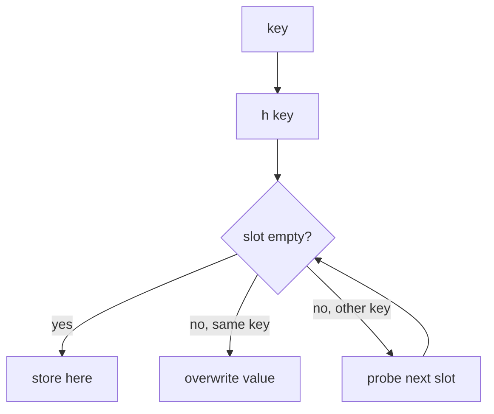

#### Resizing to bound the load factor

As entries accumulate, the load factor rises and collisions multiply. When α crosses a threshold (≈2/3 in CPython), the table allocates a larger array and **rehashes** every entry into it. This keeps amortized operations O(1) but means a single insert can occasionally cost O(n).

```python
import sys

d = {}
prev = -1
for i in range(11):
    d[i] = i
    size = sys.getsizeof(d)
    if size != prev:        # the dict grew its table on this insert
        print(f"entries={len(d):2d}  bytes={size}")
        prev = size
```

### Complexity

The table shows `dict` operations. Average case assumes a well-behaved hash; worst case assumes adversarial collisions where every key lands in one slot.

| Operation | Average | Worst case |
| :--- | :---: | :---: |
| Lookup `d[k]` | O(1) | O(n) |
| Insert `d[k] = v` | O(1) amortized | O(n) |
| Delete `del d[k]` | O(1) | O(n) |
| `k in d` | O(1) | O(n) |
| Iterate all items | O(n) | O(n) |
| Resize (rehash) | O(n) amortized over inserts | O(n) |

```math
\mathbb{E}[\text{probes}] \approx \frac{1}{1 - \alpha} \quad \text{(open addressing, uniform hashing)}
```

> [!WARNING]
> The O(1) is *expected*, not guaranteed. With colliding keys (or a hash-flooding attack), `dict` degrades to O(n) per operation. Python mitigates this with `PYTHONHASHSEED` randomization for `str` keys.

### Real-world example

Counting word frequencies in a document is the canonical hashmap job: each distinct word is a key, its count the value, and every update is O(1). Below uses a plain `dict` and then `collections.Counter`, which is a `dict` subclass.

```python
from collections import Counter

text = "the cat sat on the mat the cat ran"
freq = {}
for word in text.split():
    freq[word] = freq.get(word, 0) + 1   # O(1) lookup + insert
print(freq)        # {'the': 3, 'cat': 2, 'sat': 1, ...}

# Idiomatic equivalent
print(Counter(text.split()).most_common(2))   # [('the', 3), ('cat', 2)]
```

### In practice

`dict` is the backbone of Python — module namespaces, object attributes (`__dict__`), and keyword arguments are all dicts, so its speed matters everywhere. Since Python 3.7, dicts preserve insertion order as a language guarantee, and the compact representation (a dense entries array plus a sparse index array) cut memory by ~20–25% versus older versions.

> [!IMPORTANT]
> Dict keys must be **hashable** (immutable hash, consistent equality). Lists and other dicts are unhashable and raise `TypeError` as keys; use a `tuple` of immutables instead.

For set membership without values, use `set` — same hashmap machinery, no value slot. When you need a default for missing keys, `collections.defaultdict` or `dict.setdefault` avoids the lookup-then-insert dance.

### Pitfalls

- **Mutating a key after insertion** — If a custom key's hash changes, you can never find it again. Keys must be effectively immutable.
- **Inconsistent `__hash__` / `__eq__`** — Two objects that compare equal must hash equal, or lookups silently miss.
- **Relying on order pre-3.7** — Insertion order is guaranteed only from Python 3.7; do not depend on it on older runtimes.
- **Iterating while modifying** — Adding or removing keys during iteration raises `RuntimeError`. Iterate over a snapshot: `list(d.keys())`.
- **Assuming worst-case O(1)** — Adversarial or pathological keys make it O(n); never use untrusted input as keys in a hot path without hash randomization.

## Heaps Stacks and Queues

> **TL;DR:** Stacks (LIFO) and queues (FIFO) are linear access-discipline structures with O(1) push/pop at their respective ends; a heap is a tree-shaped priority structure stored in an array that always yields the smallest (or largest) element in O(1) and reorders in O(log n). In Python use `list`/`deque` for stacks and queues, and `heapq` for heaps.

### Vocabulary

**Stack (LIFO)**

Last-In-First-Out: the most recently pushed element is the first popped. Think of a stack of plates.

**Queue (FIFO)**

First-In-First-Out: elements leave in arrival order. Think of a checkout line.

**Binary heap**

A complete binary tree where each parent satisfies the heap property — in a *min-heap* every parent ≤ its children — stored implicitly in an array.

**Heap index arithmetic**

```math
\text{parent}(i) = \left\lfloor \frac{i-1}{2} \right\rfloor, \quad \text{left}(i) = 2i+1, \quad \text{right}(i) = 2i+2
```

Navigation formulas that let a flat array represent the tree with no pointers.

**Priority queue**

A queue where dequeue returns the highest-priority (smallest/largest) element rather than the oldest. A heap is its standard implementation.

### Intuition

A stack is a spring-loaded plate dispenser: you only touch the top. A queue is a polite line: you join the back and leave from the front. A heap is a tournament bracket flattened into an array — the champion (minimum) sits at the root, and after you remove it the bracket re-settles in logarithmic time so the next-best bubbles up.

The unifying idea is **restricted access buys speed**. By forbidding access to the middle, all three keep their key operations cheap and their implementations simple.

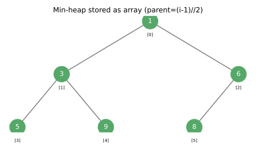

### How it works

Each structure enforces a rule about *which* element you may remove next. Stacks and queues pick by position; heaps pick by priority.

#### Stack with a list

A Python `list` is a natural stack: `append` pushes onto the end and `pop()` removes from the end, both O(1) amortized. The end of the list acts as the top of the stack.

```python
stack = []
stack.append("a")     # push
stack.append("b")
top = stack.pop()      # pop -> "b" (LIFO)
print(top, stack)      # b ['a']
```

#### Queue with a deque

Using a `list` as a queue is a trap: `pop(0)` is O(n) because it shifts every element. `collections.deque` gives O(1) at both ends, so `append` enqueues and `popleft` dequeues.

```python
from collections import deque

q = deque()
q.append("first")      # enqueue
q.append("second")
front = q.popleft()    # dequeue -> "first" (FIFO)
print(front, q)        # first deque(['second'])
```

#### Heap with heapq

`heapq` turns a `list` into a binary **min-heap** in place. `heappush` inserts in O(log n) by sifting the new element up; `heappop` removes the smallest in O(log n) by moving the last element to the root and sifting it down. The smallest is always at index 0.

```python
import heapq

h = []
for x in (5, 1, 9, 3):
    heapq.heappush(h, x)       # O(log n) each
print(h[0])                    # 1  (min is always at the root)
print(heapq.heappop(h))        # 1  (remove min, O(log n))
print(heapq.heappop(h))        # 3
```

The sift operations walk one root-to-leaf path, which is why they cost the tree height, O(log n).

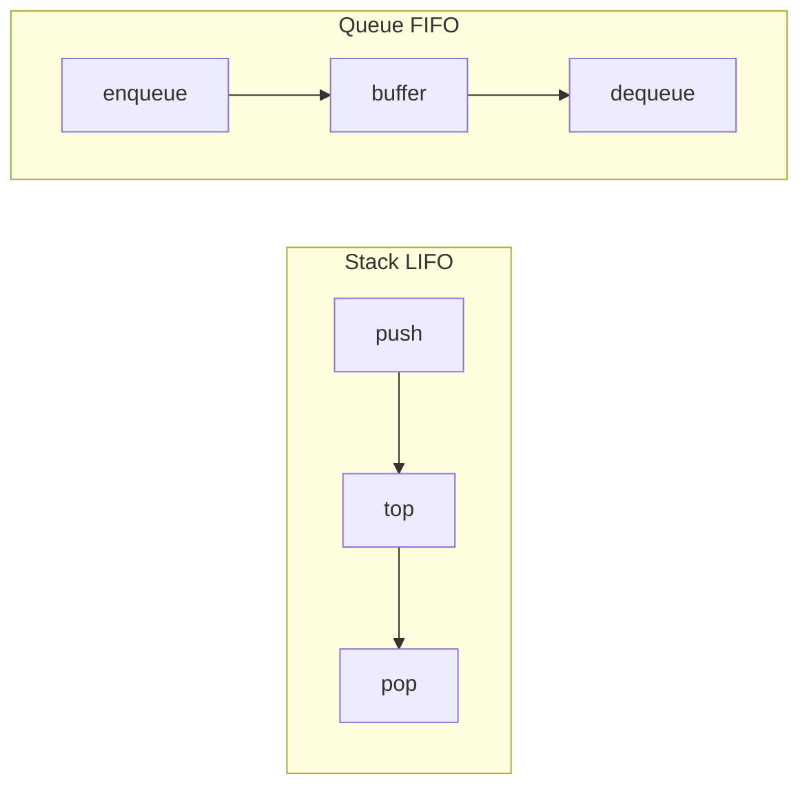

### Complexity

The table covers the idiomatic Python backing for each structure. Heap "peek" is the min for `heapq`.

| Operation | Stack (`list`) | Queue (`deque`) | Heap (`heapq`) |
| :--- | :---: | :---: | :---: |
| Push / enqueue / insert | O(1) amortized | O(1) | O(log n) |
| Pop / dequeue / extract | O(1) | O(1) | O(log n) |
| Peek (top / front / min) | O(1) | O(1) | O(1) |
| Search by value | O(n) | O(n) | O(n) |
| Build from n items | O(n) | O(n) | O(n) via `heapify` |

```math
T_{\text{heappush}} = T_{\text{heappop}} = \Theta(\log n), \qquad T_{\text{heapify}}(n) = \Theta(n)
```

> [!TIP]
> Building a heap from an existing list with `heapq.heapify(lst)` is O(n) — strictly cheaper than n separate O(log n) `heappush` calls (O(n log n)). Always `heapify` when you have all the data up front.

### Real-world example

A task scheduler must always run the highest-priority job next, even as new jobs stream in — exactly a priority queue. Below, lower number means higher priority; a tuple `(priority, seq, task)` breaks ties by insertion order so equal priorities stay FIFO and never compare the task objects.

```python
import heapq
import itertools

class Scheduler:
    def __init__(self):
        self._heap = []
        self._counter = itertools.count()    # stable tie-breaker

    def add(self, task, priority):
        heapq.heappush(self._heap, (priority, next(self._counter), task))

    def run_next(self):
        if not self._heap:
            return None
        _, _, task = heapq.heappop(self._heap)
        return task

s = Scheduler()
s.add("send email", priority=5)
s.add("page on-call", priority=1)
s.add("write log", priority=5)
print(s.run_next())   # page on-call  (priority 1 first)
print(s.run_next())   # send email    (FIFO among priority-5)
```

### In practice

For stacks reach for `list`; for queues reach for `collections.deque` (or `queue.Queue` when you need thread-safety across producers and consumers). For priority work, `heapq` is the standard library answer, and `queue.PriorityQueue` wraps it with locking.

> [!IMPORTANT]
> `heapq` is a **min-heap only**. For a max-heap, negate the keys (push `-x`, read `-h[0]`) or wrap values in a comparator tuple. There is no `maxheap` flag.

Heaps power Dijkstra's shortest paths, the merge step of `heapq.merge`, and `heapq.nlargest` / `nsmallest` for top-k selection without a full sort. Stacks underpin call frames, expression parsing, and DFS; queues underpin BFS and buffering.

### Pitfalls

- **Using `list.pop(0)` as a queue** — O(n) per dequeue; use `deque.popleft()`.
- **Forgetting heapq is min-only** — Negate keys for a max-heap.
- **Pushing un-orderable objects** — On a priority tie the heap compares the next tuple field; if that is a non-comparable object you get `TypeError`. Add a monotonic counter as a tiebreaker.
- **Mutating the heap list directly** — Assigning `h[i] = x` breaks the heap invariant. Only use `heappush`/`heappop`/`heapify`.
- **Assuming heaps are sorted** — A heap only guarantees the root is the extreme; the rest of the array is partially ordered.

## Binary Search Tree

> **TL;DR:** A binary search tree (BST) is a node-based tree where every node's left subtree holds smaller keys and its right subtree holds larger keys, enabling search, insert, and delete in O(h) where h is the tree height. Balanced (h ≈ log n) it is O(log n); degenerate (a sorted-insertion chain, h = n) it collapses to O(n).

### Vocabulary

**BST invariant**

```math
\forall\, v:\quad \text{keys}(v.\text{left}) < v.\text{key} < \text{keys}(v.\text{right})
```

Every node's key exceeds all keys in its left subtree and is below all keys in its right subtree.

**Height**

```math
h = \text{length of the longest root-to-leaf path}
```

The number of edges on the deepest path. All BST operation costs are O(h).

**In-order traversal**

Visiting left subtree, node, then right subtree. On a BST this yields keys in **sorted** order.

**Balanced tree**

A tree kept at h = O(log n) by rebalancing (AVL, red-black). Self-balancing variants guarantee logarithmic operations regardless of insertion order.

### Intuition

A BST is the data-structure form of binary search: at each node you ask "is my key smaller or larger?" and discard half the remaining tree. Done on a balanced tree, you halve the search space every step — log n comparisons to find anything among n keys.

The catch is that the tree's shape depends on insertion order. Insert already-sorted data and every new key goes right, producing a one-sided chain — a linked list wearing a tree costume, with O(n) operations. Balancing schemes exist precisely to defend the log n promise.

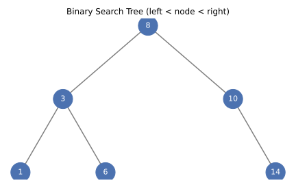

### How it works

Every operation starts at the root and walks down, choosing left or right by comparing keys, so the work is proportional to the height. The invariant is what makes that single downward walk sufficient.

#### Search and insert

To search, compare the target with the current node and descend left if smaller or right if larger, stopping at a match or a missing child. Insert follows the same path until it falls off the tree, then attaches the new node as a leaf — preserving the invariant by construction.

```python
class Node:
    __slots__ = ("key", "left", "right")

    def __init__(self, key):
        self.key = key
        self.left = None
        self.right = None

def insert(root, key):
    if root is None:
        return Node(key)
    if key < root.key:
        root.left = insert(root.left, key)
    elif key > root.key:
        root.right = insert(root.right, key)
    return root            # duplicates ignored

def search(root, key):
    while root and root.key != key:
        root = root.left if key < root.key else root.right
    return root
```

#### In-order traversal yields sorted output

Because left < node < right everywhere, visiting left subtree then node then right subtree emits keys in ascending order. This is why a BST doubles as an ordered map / sorted set.

```python
def inorder(root, out):
    if root:
        inorder(root.left, out)
        out.append(root.key)
        inorder(root.right, out)
    return out

r = None
for k in (8, 3, 10, 1, 6, 14):
    r = insert(r, k)
print(inorder(r, []))      # [1, 3, 6, 8, 10, 14]
```

#### Deletion and the successor

Deleting a node with two children cannot just remove it. The standard fix replaces the node's key with its **in-order successor** (the smallest key in the right subtree), then deletes that successor — which has at most one child, making the structural removal simple.

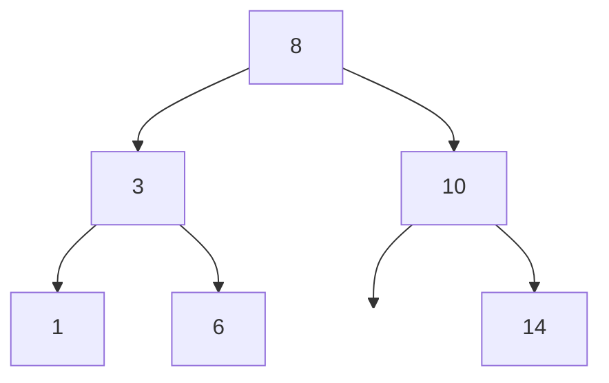

### Complexity

Costs are O(h). The table separates the balanced case (h ≈ log n) from the degenerate case (h = n, e.g. inserting already-sorted keys).

| Operation | Balanced (h ≈ log n) | Degenerate (h = n) |
| :--- | :---: | :---: |
| Search | O(log n) | O(n) |
| Insert | O(log n) | O(n) |
| Delete | O(log n) | O(n) |
| Find min / max | O(log n) | O(n) |
| In-order traversal | O(n) | O(n) |

```math
T_{\text{search}}, T_{\text{insert}}, T_{\text{delete}} = \Theta(h), \qquad \log_2 n \le h \le n
```

> [!WARNING]
> A plain BST gives **no balance guarantee**. Feeding it sorted input degrades every operation to O(n). Use a self-balancing tree (AVL, red-black) or, in Python, often a `dict`/`sorted` list instead.

### Real-world example

A BST shines as an ordered index that supports range queries — "all keys between 5 and 12" — which a hashmap cannot do because it has no order. Below, a tiny sorted-set built on the BST above, exposing membership plus a sorted listing.

```python
class SortedSet:
    def __init__(self):
        self._root = None

    def add(self, key):
        self._root = insert(self._root, key)

    def __contains__(self, key):
        return search(self._root, key) is not None

    def sorted_keys(self):
        return inorder(self._root, [])

s = SortedSet()
for k in (50, 20, 70, 10, 30):
    s.add(k)
print(30 in s)              # True
print(s.sorted_keys())     # [10, 20, 30, 50, 70]
```

### In practice

Pure Python rarely uses a hand-written BST because `dict` (hashmap) beats it for unordered key-value work, and the standard library lacks a built-in balanced tree. When you need *ordered* operations, the idioms are a `dict` plus `sorted()`, the `bisect` module over a sorted list (O(log n) search, O(n) insert), or the third-party `sortedcontainers` package.

> [!TIP]
> `import bisect` gives you O(log n) lookups in a sorted Python list without writing a tree — perfect when inserts are rare and reads dominate. For frequent inserts *and* ordered queries, `sortedcontainers.SortedList` (B-tree-backed) is the pragmatic choice.

Real systems use balanced-tree variants everywhere ordering matters at scale: C++ `std::map` (red-black), database B-tree indexes (a high-fanout generalization), and filesystem extents. The BST is the conceptual root of all of them.

### Pitfalls

- **Sorted-input degeneration** — Inserting ordered data builds an O(n) chain. Shuffle input or use a balancing tree.
- **Forgetting duplicate policy** — Decide up front whether to ignore, count, or right-bias duplicates; inconsistency corrupts traversals.
- **Naive two-child deletion** — Removing a node with two children requires successor (or predecessor) replacement, not a blind unlink.
- **Recursion depth** — Deep or degenerate trees can blow Python's recursion limit (~1000). Prefer iterative search or raise the limit deliberately.
- **Confusing a BST with a binary heap** — A heap orders parent vs. child by priority, not left vs. right by key; in-order traversal of a heap is *not* sorted.

## Recursion

> **TL;DR:** Recursion solves a problem by reducing it to smaller instances of the same problem, bottoming out at a base case. Each call adds a frame to the call stack, so the technique trades elegant divide-and-conquer code for stack depth — Python caps that depth (~1000) and never optimizes tail calls.

### Vocabulary

**Base case**

The smallest input that returns directly without recursing. Omitting it causes infinite recursion and a stack overflow.

**Recursive case**

The branch that calls the function on a strictly smaller input and combines the result.

**Call stack**

The runtime stack of activation frames; recursion depth equals the number of stacked frames. Python's default limit is ~1000.

**Recurrence relation**

```math
T(n) = a \cdot T(n/b) + f(n)
```

An equation expressing a problem's cost in terms of its subproblems; solved (e.g. via the Master Theorem) to get the Big-O.

### Intuition

Recursion is delegation: to solve a big problem, you hand a smaller copy to "another you," trusting it to return the right answer, then combine. You only specify two things — how to handle the trivial case yourself (base case) and how to shrink the problem before delegating (recursive case). The call stack remembers every pending "combine" step.

Picture nested Russian dolls: you keep opening (recursing) until you reach the solid innermost doll (base case), then close them back up (returning/combining) in reverse order. The danger is opening dolls forever — a missing or unreachable base case.

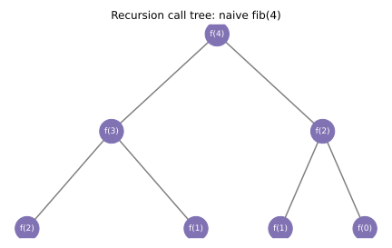

### How it works

Every recursive call pushes a frame holding its locals and return address. Frames pop in reverse as base cases resolve and results bubble back up.

#### Anatomy: base case and recursive case

A correct recursive function checks the base case first, then recurses on a *strictly smaller* input so progress is guaranteed. Factorial is the textbook shape: 0! is 1 (base), and n! = n × (n-1)! (recursive).

```python
def factorial(n):
    if n <= 1:            # base case
        return 1
    return n * factorial(n - 1)   # recursive case, smaller input

print(factorial(5))       # 120
```

#### The call stack and recursion depth

Each pending call waits on the stack until its child returns, so depth-n recursion holds n frames simultaneously. Python deliberately raises `RecursionError` near ~1000 frames to prevent a C-level stack crash.

```python
import sys
print(sys.getrecursionlimit())   # 1000 by default

def depth(n):
    if n == 0:
        return 0
    return 1 + depth(n - 1)

# depth(2000) would raise RecursionError; convert to a loop or raise the limit.
```

#### Overlapping subproblems and memoization

Naive recursion can recompute the same subproblem exponentially — `fib(4)` recomputes `fib(2)` twice. **Memoization** caches each result so every distinct subproblem is solved once, collapsing exponential time to linear.

```python
from functools import lru_cache

@lru_cache(maxsize=None)
def fib(n):
    if n < 2:
        return n
    return fib(n - 1) + fib(n - 2)

print(fib(50))            # 12586269025, instant with the cache
```

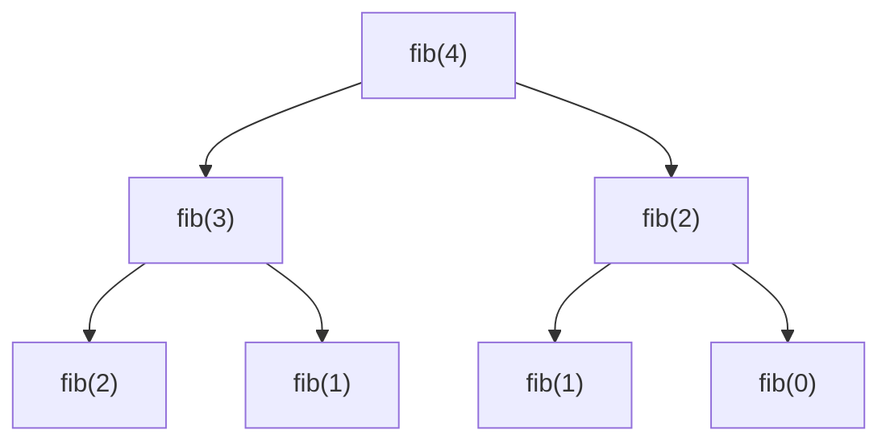

### Complexity

Recursive cost depends on branching factor and depth. The table contrasts common shapes; n is the input size.

| Recursion shape | Time | Space (stack) |
| :--- | :---: | :---: |
| Linear (factorial, list sum) | O(n) | O(n) |
| Naive binary (`fib` no cache) | O(2^n) | O(n) |
| Memoized `fib` | O(n) | O(n) |
| Divide & conquer (merge sort) | O(n log n) | O(log n) extra |
| Binary search (recursive) | O(log n) | O(log n) |

```math
T_{\text{fib,naive}}(n) = T(n-1) + T(n-2) + O(1) = O(\varphi^n), \quad \varphi \approx 1.618
```

> [!CAUTION]
> Deep recursion in Python risks `RecursionError` because there is **no tail-call optimization** — Guido rejected it intentionally to keep tracebacks intact. Convert deep linear recursion to an explicit loop or an explicit stack.

### Real-world example

Recursion is the natural way to walk a tree-shaped structure whose depth is unknown — a filesystem, JSON, or nested config. Below sums all integers in an arbitrarily nested list, recursing into sublists and adding leaves.

```python
def deep_sum(data):
    total = 0
    for item in data:
        if isinstance(item, list):
            total += deep_sum(item)     # recurse into the sublist
        else:
            total += item               # base contribution: a leaf
    return total

nested = [1, [2, 3, [4, [5]]], 6]
print(deep_sum(nested))    # 21
```

### In practice

Recursion is the clearest expression of divide-and-conquer (merge/quick sort), tree and graph traversal (DFS), and backtracking (permutations, N-queens, parsers). When the depth is bounded by log n — as in balanced-tree and divide-and-conquer algorithms — Python's stack limit is a non-issue and recursion is the idiomatic choice.

> [!TIP]
> Use `functools.lru_cache` (or `functools.cache` in 3.9+) to memoize pure recursive functions in one line. It turns exponential recurrences into polynomial ones with zero manual bookkeeping.

For deep or unbounded linear recursion (walking a huge linked list, a million-deep nesting), rewrite iteratively with an explicit stack, or as a last resort raise `sys.setrecursionlimit` — but understand you are then risking a hard interpreter crash, not a catchable error.

### Pitfalls

- **Missing or unreachable base case** — Infinite recursion → `RecursionError`. Ensure every path shrinks toward the base.
- **Not shrinking the input** — Recursing on the same or larger input never terminates.
- **Expecting tail-call optimization** — Python has none; tail-recursive code still grows the stack.
- **Recomputing subproblems** — Naive `fib`/grid-path recursion is exponential; memoize or convert to bottom-up DP.
- **Mutable shared state across calls** — Default mutable arguments or shared accumulators leak between invocations; pass state explicitly or reset it.

## Sorting Algorithms

> **TL;DR:** Sorting arranges elements into a total order; comparison sorts are bounded below by O(n log n), achieved by merge sort, heapsort, and quicksort (average), while simple O(n²) sorts (bubble, insertion) win only on tiny or nearly-sorted inputs. Python's `sorted`/`list.sort` use Timsort — a stable, adaptive O(n log n) merge/insertion hybrid.

### Vocabulary

**Stable sort**

A sort that preserves the relative order of elements comparing equal. Timsort is stable; heapsort and typical quicksort are not.

**In-place sort**

A sort using O(1) (or O(log n)) extra memory beyond the input. Quicksort and heapsort are in-place; classic merge sort is not.

**Comparison-sort lower bound**

```math
T(n) = \Omega(n \log n)
```

Any sort that only compares elements needs at least n log n comparisons in the worst case — a decision-tree argument.

**Adaptive sort**

A sort that runs faster on partially ordered input. Timsort detects existing runs and approaches O(n) on nearly-sorted data.

### Intuition

Every comparison sort is playing twenty-questions against a permutation: each comparison answers one yes/no question, and with n! possible orderings you need at least log₂(n!) ≈ n log n questions to pin down the right one. That information-theoretic floor is why no comparison sort beats O(n log n) in the worst case.

The algorithms differ in *how* they spend those comparisons: insertion sort grows a sorted prefix one element at a time; merge sort splits, sorts halves, and merges; quicksort partitions around a pivot; heapsort repeatedly extracts the min/max from a heap.

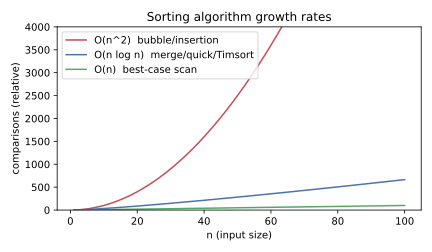

### How it works

Fast sorts use divide-and-conquer or a heap; simple sorts use nested scans. The gap between O(n log n) and O(n²) becomes enormous as n grows, as the curve above shows.

#### Insertion sort (the simple O(n²) baseline)

Insertion sort builds the result one element at a time, shifting each new element left into its correct spot among the already-sorted prefix. It is O(n²) in general but O(n) on already-sorted input, which is why Timsort uses it for small runs.

```python
def insertion_sort(a):
    for i in range(1, len(a)):
        key = a[i]
        j = i - 1
        while j >= 0 and a[j] > key:    # shift larger elements right
            a[j + 1] = a[j]
            j -= 1
        a[j + 1] = key
    return a

print(insertion_sort([5, 2, 9, 1, 3]))   # [1, 2, 3, 5, 9]
```

#### Merge sort (stable O(n log n) divide-and-conquer)

Merge sort recursively splits the list in half, sorts each half, and merges the two sorted halves in linear time. It is stable and worst-case O(n log n), but needs O(n) auxiliary space for the merge buffer.

```python
def merge_sort(a):
    if len(a) <= 1:
        return a
    mid = len(a) // 2
    left = merge_sort(a[:mid])
    right = merge_sort(a[mid:])
    out, i, j = [], 0, 0
    while i < len(left) and j < len(right):
        if left[i] <= right[j]:         # <= keeps it stable
            out.append(left[i]); i += 1
        else:
            out.append(right[j]); j += 1
    out.extend(left[i:]); out.extend(right[j:])
    return out

print(merge_sort([5, 2, 9, 1, 3]))       # [1, 2, 3, 5, 9]
```

#### Quicksort (in-place, fast average, O(n²) worst)

Quicksort partitions the array around a pivot so smaller elements go left and larger go right, then recurses on each side. It is O(n log n) on average and in-place, but a poor pivot on adversarial input degrades it to O(n²); randomized or median-of-three pivots mitigate this.

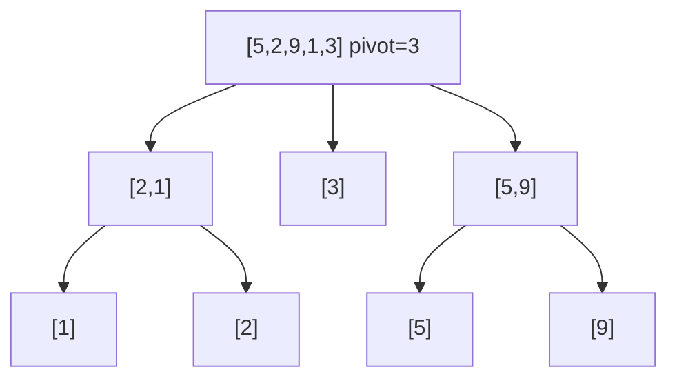

### Complexity

The table summarizes the standard comparison sorts. "Stable" and "in-place" are practical properties that often decide the choice between two equally-fast sorts.

| Algorithm | Best | Average | Worst | Space | Stable |
| :--- | :---: | :---: | :---: | :---: | :---: |
| Bubble sort | O(n) | O(n²) | O(n²) | O(1) | yes |
| Insertion sort | O(n) | O(n²) | O(n²) | O(1) | yes |
| Merge sort | O(n log n) | O(n log n) | O(n log n) | O(n) | yes |
| Quicksort | O(n log n) | O(n log n) | O(n²) | O(log n) | no |
| Heapsort | O(n log n) | O(n log n) | O(n log n) | O(1) | no |
| Timsort (`sort`) | O(n) | O(n log n) | O(n log n) | O(n) | yes |

```math
\log_2(n!) = \Theta(n \log n) \quad\Rightarrow\quad \text{any comparison sort is } \Omega(n \log n)
```

> [!IMPORTANT]
> The Ω(n log n) floor applies only to **comparison** sorts. Non-comparison sorts (counting, radix, bucket) can hit O(n) by exploiting key structure (bounded integers, fixed-width keys) — they sidestep the bound instead of breaking it.

### Real-world example

You rarely implement a sort in production Python — you call `sorted` with a `key`. Stability matters: sort employees by salary, and those with equal salary keep their prior (e.g. alphabetical) order, which Timsort guarantees. Multi-key sorting exploits this by sorting on the secondary key first.

```python
people = [
    {"name": "Ana", "salary": 90},
    {"name": "Bo",  "salary": 70},
    {"name": "Cy",  "salary": 90},
]

# Secondary sort first (name), then primary (salary): stability does the rest.
people.sort(key=lambda p: p["name"])
people.sort(key=lambda p: p["salary"], reverse=True)
print([p["name"] for p in people])   # ['Ana', 'Cy', 'Bo']  (90s before 70, Ana before Cy)
```

### In practice

Always prefer the built-ins: `sorted(iterable, key=..., reverse=...)` returns a new list, `list.sort(...)` sorts in place. Both run Timsort in C, are stable, adaptive (near-O(n) on partially sorted data), and far faster than any pure-Python sort you could write.

> [!TIP]
> Pass a `key` function, never a `cmp`. Python 3 removed `cmp`; for legacy comparator logic wrap it in `functools.cmp_to_key`. The `key` is computed once per element (the decorate-sort-undecorate pattern), so it is cheaper than repeated comparisons.

When data exceeds memory, switch to external merge sort (sort chunks, merge with `heapq.merge`). When keys are small bounded integers, counting or radix sort beats O(n log n). For "top k" you do not need a full sort — `heapq.nlargest(k, data)` is O(n log k).

### Pitfalls

- **Reimplementing sort in Python** — Pure-Python bubble/quick sort is orders of magnitude slower than `list.sort`. Use the built-in.
- **Assuming quicksort is always fast** — Worst case is O(n²) on adversarial/sorted input without randomized pivots.
- **Expecting `set`/`dict` iteration to be sorted** — They are not ordered by key; call `sorted()` explicitly.
- **Sorting un-orderable mixed types** — `sorted([1, "a"])` raises `TypeError` in Python 3; supply a `key` that maps to a common comparable type.
- **Forgetting stability requirements** — Heapsort/quicksort reorder equal elements; if relative order matters, use a stable sort (Timsort, merge).

## Sources

- CLRS, *Introduction to Algorithms*, 3rd ed., Ch. 2 (Insertion/Merge), Ch. 4 (Divide-and-Conquer, recurrences & the Master Theorem), Ch. 6 (Heapsort), Ch. 7 (Quicksort), Ch. 8 (Sorting lower bound & linear sorts), Ch. 10 (Elementary Data Structures: Stacks & Queues), Ch. 11 (Hash Tables), Ch. 12 (Binary Search Trees), Ch. 13 (Red-Black Trees).
- Python docs — [Data Structures: list](https://docs.python.org/3/tutorial/datastructures.html), [collections.deque](https://docs.python.org/3/library/collections.html#collections.deque), [Mapping Types — dict](https://docs.python.org/3/library/stdtypes.html#mapping-types-dict), [heapq](https://docs.python.org/3/library/heapq.html), [queue](https://docs.python.org/3/library/queue.html), [bisect](https://docs.python.org/3/library/bisect.html), [functools.lru_cache](https://docs.python.org/3/library/functools.html#functools.lru_cache), [sys.setrecursionlimit](https://docs.python.org/3/library/sys.html#sys.setrecursionlimit), [Sorting HOW TO](https://docs.python.org/3/howto/sorting.html), [sorted](https://docs.python.org/3/library/functions.html#sorted).
- Python Wiki — [TimeComplexity](https://wiki.python.org/moin/TimeComplexity).
- CPython source — `Objects/listobject.c` (`list_resize` growth policy).
- Raymond Hettinger, "Modern Python Dictionaries: A confluence of a dozen great ideas" (PyCon 2017).
- Grant Jenks, [sortedcontainers documentation](https://grantjenks.com/docs/sortedcontainers/).
- Guido van Rossum, "Tail Recursion Elimination" (Neopythonic, 2009).
- Tim Peters, [listsort.txt](https://github.com/python/cpython/blob/main/Objects/listsort.txt) (Timsort design notes).

## Related

- [Built-in Data Structures](./02-builtin-data-structures.md)
- [Advanced Functions](./03-advanced-functions.md)
- [Object-Oriented Programming](./05-oop.md)
