# Python Packaging & Environment Management

[toc]

> **TL;DR:** Python packaging spans a layered stack: PyPI is the public index, `pip` is the reference installer, `virtualenv`/`venv` isolate packages, `pyenv` switches interpreter versions, and higher-level managers (Pipenv, Poetry, PDM, uv, conda) bundle resolution, locking, and environment management. The shared standard manifest is `pyproject.toml`, and a small set of common packages (stdlib vs PyPI) underpins most real projects.

## PyPI

> **TL;DR:** PyPI (the Python Package Index) is the default public repository where third-party Python packages are published and from which installers like `pip` and `uv` download them. It stores immutable release artifacts (source distributions and wheels), serves metadata over a simple HTTP API, and is the canonical "namespace" that makes `pip install requests` resolve to a real, signed-and-hashed download.

### Vocabulary

- **PyPI** — the Python Package Index, hosted at `pypi.org`. The default index for `pip`/`uv`.
- **Project** — a named namespace on PyPI (e.g. `requests`). Owns one or more releases.
- **Release** — a specific version of a project (e.g. `requests 2.32.3`).
- **Distribution / artifact** — an uploadable file for a release: an **sdist** (`.tar.gz`) or a **wheel** (`.whl`).
- **sdist** — source distribution; a tarball that may require a build step on install.
- **wheel** — a pre-built binary artifact (`.whl`); installs by unzip, no build step.
- **Simple API** — the HTTP index protocol (PEP 503 / PEP 691) installers use to list files for a project.
- **TestPyPI** — a separate sandbox index (`test.pypi.org`) for rehearsing uploads.
- **Trusted Publishing** — OIDC-based uploads from CI (e.g. GitHub Actions) with no long-lived API token.

### Intuition

Think of PyPI as a global, append-only library catalog: every book (project) has editions (releases), and each edition ships in one or more formats (sdist, wheel). Installers do not search the catalog by hand — they hit a predictable URL per project, read the list of files, pick the best match for your platform and Python version, then download and verify it by hash.

The key property is **immutability**: once `requests 2.32.3` is uploaded, that file's contents never change. This is what makes lockfiles and hash-pinning meaningful — a hash recorded today resolves to the identical bytes tomorrow.

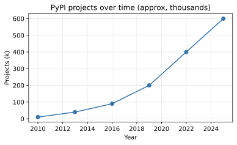

### How it works

PyPI is two surfaces: an **upload** path (for maintainers) and a **download** path (for installers). Both are plain HTTPS, which is why every installer can target it.

#### The Simple (index) API

When you run `pip install requests`, the installer requests the project's index page, e.g. `https://pypi.org/simple/requests/`. That page lists every artifact URL for the project, annotated with metadata (Python version requirements, hashes). The installer applies its resolution rules to choose files. PEP 691 added an equivalent JSON form alongside the legacy HTML.

```bash
# Inspect what the Simple API serves (JSON form, PEP 691)
curl -H "Accept: application/vnd.pypi.simple.v1+json" \
  https://pypi.org/simple/requests/ | head -c 400
```

#### Uploading a release

Maintainers build artifacts locally, then upload them with `twine` (or via Trusted Publishing in CI). Uploads are authenticated; filenames within a release must be unique and cannot be overwritten once accepted.

```bash
python -m build              # produces dist/*.whl and dist/*.tar.gz
twine check dist/*           # validate metadata renders
twine upload dist/*          # push to PyPI (prompts for token)
```

The publish-then-install lifecycle ties the two surfaces together: a maintainer pushes artifacts once, and every downstream installer reads the same immutable files.

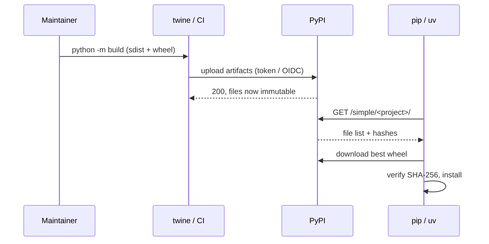

#### Verification on install

Installers record and re-check artifact hashes. With a lockfile or `--require-hashes`, a download whose SHA-256 does not match the recorded value is rejected, defeating tampering or accidental mirror drift.

### Real-world example

A team publishes an internal CLI to PyPI and wants reproducible installs. They build a wheel, validate it, and (in CI) publish via Trusted Publishing so no token lives in the repo.

```yaml
# .github/workflows/publish.yml — Trusted Publishing (OIDC), no stored token
name: publish
on:
  release:
    types: [published]
jobs:
  pypi:
    runs-on: ubuntu-latest
    permissions:
      id-token: write          # required for OIDC trusted publishing
    steps:
      - uses: actions/checkout@v4
      - uses: actions/setup-python@v5
        with: { python-version: "3.12" }
      - run: python -m pip install build && python -m build
      - uses: pypa/gh-action-pypi-publish@release/v1
```

### In practice

Most installs pull **wheels**, not sdists, because wheels need no compiler. For compiled packages (NumPy, Pillow), maintainers publish many wheels tagged by platform/ABI (`manylinux`, `macosx`, `win_amd64`) so the right binary lands without a local toolchain.

> [!TIP]
> Prefer **Trusted Publishing** over long-lived API tokens in CI. It uses short-lived OIDC credentials scoped to one project, so there is no secret to leak or rotate.

> [!IMPORTANT]
> PyPI releases are immutable. You cannot re-upload a file with the same name; to fix a bad release you must **yank** it (hides it from new resolutions but keeps it for pins) or publish a new version.

### Pitfalls

- **"I'll just overwrite the broken wheel"** — you can't. Bump the version or yank.
- **Typosquatting** — `requsets` is not `requests`. Malicious near-name packages exist; pin and review.
- **Assuming an sdist always installs cleanly** — an sdist may need a C compiler. Prefer wheels for binary packages.
- **Confusing TestPyPI with PyPI** — they are separate indexes with separate accounts; a token for one won't work on the other.

## Pip

> **TL;DR:** `pip` is the reference Python package installer bundled with CPython. It resolves a dependency graph, downloads wheels or sdists from PyPI (or any PEP 503 index), and installs them into the active environment. Since 2020 it uses a backtracking resolver that can refuse to install conflicting version constraints rather than silently breaking your environment.

### Vocabulary

- **pip** — "pip installs packages"; the default installer shipped with CPython.
- **Requirement** — a constraint like `requests>=2.31,<3` parsed per PEP 508.
- **requirements.txt** — a flat, ordered list of requirements; *not* a lockfile by default.
- **Resolver** — pip's backtracking algorithm that finds a mutually compatible version set.
- **Editable install** — `pip install -e .`; links your source tree so edits take effect without reinstall.
- **Wheel cache** — local cache of downloaded/built wheels to avoid rebuilds.
- **Index URL** — the PEP 503 repository pip queries; defaults to `pypi.org`.

### Intuition

`pip` is a constraint solver with a download manager bolted on. You hand it top-level requirements; it walks each package's declared dependencies, fetches candidate version lists from the index, and searches for one assignment of versions that satisfies every constraint at once. When two requirements are irreconcilable, the modern resolver stops with an error instead of installing a broken set.

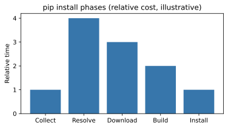

### How it works

A `pip install` is a pipeline: collect requirements, resolve versions, fetch artifacts, build any sdists into wheels, then unpack into `site-packages`. Each phase can be cached.

#### Resolution

pip reads your requirements, then for each package pulls the candidate list from the index's Simple API. The backtracking resolver tries a version, descends into that version's dependencies, and backtracks when it hits a contradiction. This is why a hard conflict surfaces as a `ResolutionImpossible` error.

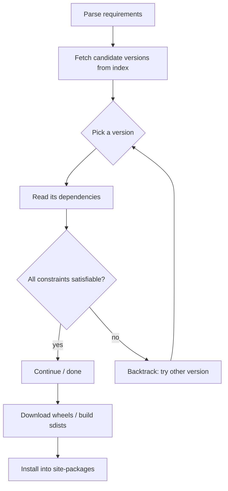

#### Build and install

If only an sdist is available, pip invokes the project's PEP 517 build backend to produce a wheel, then installs that. Pre-built wheels skip the build step entirely, which is why most installs are fast.

```bash
pip install "requests>=2.31,<3"     # resolve + install
pip install -e .                     # editable install of current project
pip install -r requirements.txt      # install from a pinned file
```

#### Reproducibility

A plain `requirements.txt` lists what you *asked for*, not the full resolved graph. To pin everything, freeze the resolved environment and optionally add hashes for verified installs.

```bash
pip freeze > requirements.lock       # capture exact installed versions
pip install --require-hashes -r requirements.lock
```

### Real-world example

A service needs deterministic CI installs. The team compiles top-level deps into a fully pinned, hashed file and installs only from that in CI, so a new transitive release can't change the build.

```bash
# Dev machine: list intent in requirements.in, compile a locked + hashed file
# (pip-tools provides pip-compile; pip itself installs the result)
pip-compile --generate-hashes requirements.in -o requirements.txt

# CI: refuse anything not hash-pinned
pip install --require-hashes --no-deps -r requirements.txt
```

### In practice

Always install into a virtual environment, never the system Python — modern pip even refuses system installs on externally-managed distros (PEP 668). Use `python -m pip` rather than a bare `pip` so the installer matches the interpreter you think it does.

> [!WARNING]
> `requirements.txt` is **not** a lockfile. `pip install -r requirements.txt` with unpinned versions can install different transitive versions tomorrow. Pin with `pip freeze` or `pip-compile`, and add `--generate-hashes` for tamper-evidence.

> [!TIP]
> `python -m pip install ...` guarantees pip runs against the interpreter you invoked. A bare `pip` may belong to a different environment on `PATH`.

### Pitfalls

- **Mixing pip and conda in one env** — both manage `site-packages`; conflicting writes corrupt metadata. Prefer one manager per env.
- **`pip install` as root / system Python** — pollutes the OS interpreter; use a venv.
- **Expecting `requirements.txt` to be reproducible** — it isn't unless fully pinned.
- **Ignoring `ResolutionImpossible`** — the resolver found a real conflict; loosen or align constraints rather than forcing.

## virtualenv

> **TL;DR:** `virtualenv` (and the stdlib `venv`) isolates a project's *packages* by creating a self-contained directory with its own interpreter reference, `site-packages`, and activation scripts. It does **not** manage Python *versions* — every venv is built on top of one already-installed interpreter, and switching versions is the job of [pyenv](#pyenv). Isolation works by rewriting `sys.prefix` and `sys.path` at startup so imports resolve to the venv's `site-packages` instead of the system one.

### Vocabulary

- **Virtual environment** — a directory tree holding an isolated `site-packages`, a copied/symlinked interpreter, and `activate` scripts. One per project keeps dependency graphs from colliding.
- **`venv`** — the lightweight virtual-environment creator shipped in the standard library since Python 3.3 (`python -m venv`). A subset of virtualenv's features.
- **`virtualenv`** — the faster third-party tool (predates `venv`) with seeded pip/setuptools, app-data caching, and a plugin discovery system.
- **`site-packages`** — the directory where third-party packages install. The whole point of isolation is giving each project its own.
- **`sys.prefix`** — the interpreter's "installation root". Inside a venv it points at the venv directory, which is how Python finds the isolated `site-packages`.

```math
\text{sys.path} = [\text{cwd}] \;+\; \text{stdlib (system)} \;+\; \text{venv/lib/pythonX.Y/site-packages}
```

- **`pyvenv.cfg`** — a config file at the venv root recording the base interpreter (`home`), the Python version, and whether system site-packages are visible.

### Intuition

Imagine every Python project sharing one global `site-packages`: project A needs `flask==2.0`, project B needs `flask==3.0`, and only one can win. A virtual environment gives each project its own shelf of packages so they never fight. The interpreter itself is shared — only the *library search path* is rewritten.

The trick is small but powerful: the venv interpreter sets `sys.prefix` to the venv directory, so the standard `site` module appends the venv's `site-packages` to `sys.path` instead of the global one. Activation is just a convenience that prepends `venv/bin` to your shell `PATH`.

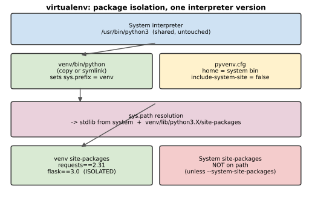

The diagram below shows the same idea as a path-resolution decision: an `import` consults `sys.path`, which the venv has rewritten so the project's private `site-packages` is searched before (and instead of) the global one, while the shared standard library still resolves against the base interpreter.

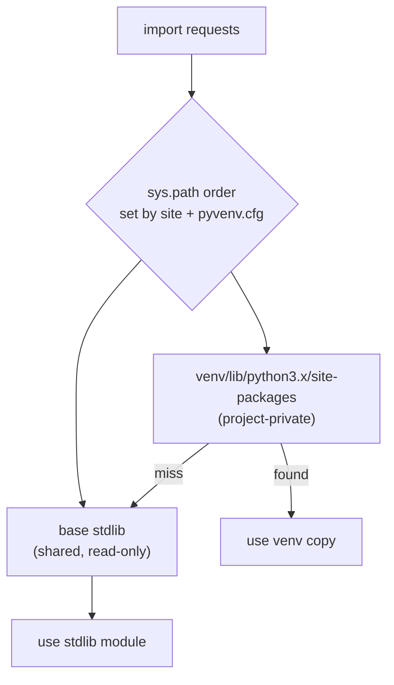

### How it works

A venv is a directory, not magic. Creating one copies (or symlinks) the base interpreter into `venv/bin/python`, writes `pyvenv.cfg`, and seeds an empty `site-packages`. At runtime the interpreter reads `pyvenv.cfg`, discovers it lives inside a venv, and redirects library resolution accordingly.

#### Phase 1 — Creation

Creation lays down the directory skeleton: `bin/` (or `Scripts/` on Windows), `lib/pythonX.Y/site-packages/`, and `pyvenv.cfg`. The stdlib tool and the third-party tool both produce the same broad layout; `virtualenv` additionally seeds pip/setuptools from a cached wheel for speed.

```bash
# Standard library (built in, no install needed)
python3 -m venv venv

# Third-party virtualenv (faster, more features; pip install virtualenv first)
virtualenv venv
virtualenv --python=python3.11 venv   # build on a specific already-installed interpreter
```

#### Phase 2 — Activation

Activation does **not** change which interpreter exists; it prepends `venv/bin` to `PATH` and sets `VIRTUAL_ENV` so `python` and `pip` resolve to the venv copies. `deactivate` (a shell function the activate script defines) restores the previous `PATH`.

```bash
source venv/bin/activate        # bash/zsh; use activate.fish / Activate.ps1 elsewhere
which python                    # -> .../venv/bin/python
deactivate                      # restore the shell's original PATH
```

#### Phase 3 — Path resolution at runtime

When the venv interpreter starts, it locates `pyvenv.cfg`, reads `home` (the base install) and `include-system-site-packages`, and sets `sys.prefix` to the venv. The `site` module then adds the venv's `site-packages` to `sys.path`. The standard library itself is still loaded from the base install — only third-party packages are isolated.

```python
import sys
print(sys.prefix)            # venv root inside an activated env
print(sys.base_prefix)      # the base interpreter's install root
# sys.prefix != sys.base_prefix  <=>  running inside a venv
```

### Real-world example

A reproducible setup for a small Flask service: create an isolated env, install pinned deps, freeze them, and confirm the packages live in the venv rather than the system. This is the canonical workflow before introducing a lockfile tool like [pipenv](#pipenv) or [poetry](#poetry).

```bash
# 1. Create + activate an isolated environment
python3 -m venv .venv
source .venv/bin/activate

# 2. Install pinned dependencies into the venv's site-packages
pip install "flask==3.0.0" "requests==2.31.0"

# 3. Record exactly what is installed (see the Pip section for requirements files)
pip freeze > requirements.txt

# 4. Prove isolation: the package path is inside .venv, not /usr/lib
python -c "import flask, sys; print(flask.__file__); print(sys.prefix)"

deactivate
```

### In practice

Most projects today create the env with the stdlib `python -m venv` and reach for the third-party `virtualenv` only when its speed or seeding matters (CI fan-out, tox). The directory is intentionally disposable — commit `requirements.txt`, not `.venv/`, and rebuild from the lockfile on each machine.

> [!TIP]
> Name the directory `.venv` and add it to `.gitignore`. Many editors (VS Code, PyCharm) auto-detect `.venv/` in the project root and select its interpreter without manual configuration.

> [!IMPORTANT]
> A venv is bound to the exact interpreter it was built from. If that base Python is upgraded or removed (e.g. a Homebrew or pyenv version bump), the venv's symlinked `python` can break. Recreate the venv after changing the underlying interpreter.

### Pitfalls

- **"virtualenv installs Python versions."** — Wrong. It reuses an already-installed interpreter. To get Python 3.12 in the first place, use [pyenv](#pyenv) or your OS package manager, then point `--python` at it.
- **Committing the venv directory** — `.venv/` contains absolute paths and platform-specific binaries; it does not move between machines. Commit the requirements/lockfile instead.
- **`--system-site-packages` by accident** — this flag makes the global `site-packages` visible inside the venv, defeating isolation. Use it only deliberately. Verify the exact behavior against docs.
- **Activation is optional** — calling `.venv/bin/python script.py` directly uses the venv with no `activate` step; activation only adjusts your interactive shell `PATH`.

## Pipenv

> **TL;DR:** Pipenv is a per-project dependency manager that fuses `pip`, `virtualenv`, and a deterministic lockfile behind one CLI. You declare abstract requirements in a human-edited `Pipfile`, and Pipenv resolves them into a fully pinned, hash-verified `Pipfile.lock` that reproduces the exact same environment on any machine.

### Vocabulary

Each term below is load-bearing for the rest of the note. Pipenv's vocabulary mostly inherits from `pip` and `virtualenv`, with two file formats of its own.

- **Pipfile** — TOML file you edit by hand; holds *abstract* dependencies (e.g. `requests = "*"`) split into `[packages]` and `[dev-packages]`.
- **Pipfile.lock** — generated JSON file; holds *concrete* pinned versions plus SHA-256 hashes for every package, enabling reproducible, tamper-evident installs.
- **Virtualenv** — an isolated Python environment with its own `site-packages`; Pipenv creates and tracks one per project automatically.
- **Resolver** — the dependency-graph solver that turns abstract constraints into one mutually compatible set of pinned versions.
- **Deterministic build** — installing from the lock so two machines get byte-identical dependency trees.

### Intuition

Think of the `Pipfile` as your *intent* ("I want some version of requests") and the `Pipfile.lock` as the *contract* ("you will get requests 2.31.0 with this exact hash, plus these 4 transitive deps"). The mental model is the same split that `cargo`/`npm` use: a loose manifest a human curates, and a strict lockfile a machine regenerates.

Before Pipenv, the common pattern was a `requirements.txt` that conflated both roles — people pinned everything (losing readability) or pinned nothing (losing reproducibility). Pipenv separates the two concerns and hides the `virtualenv` bookkeeping so you never manually `source bin/activate`.

### How it works

Pipenv sits on top of three existing tools and orchestrates them. The flow below shows how an abstract `Pipfile` becomes a reproducible installed environment.

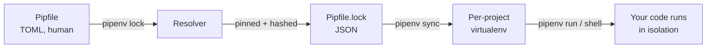

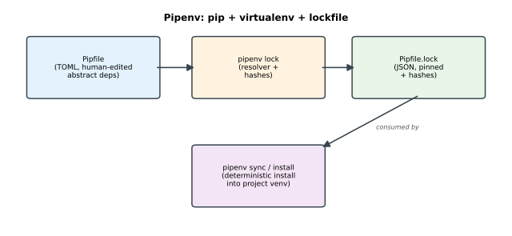

#### Locating or creating the virtualenv

On the first `pipenv install`, Pipenv creates a virtualenv keyed to the project directory's path hash, stored centrally (commonly under the user's `~/.local/share/virtualenvs/` on Linux — verify against docs for your platform). It does *not* litter a `.venv` inside the project unless you set `PIPENV_VENV_IN_PROJECT=1`. You can always print the path it chose.

```bash
pipenv --venv          # show this project's virtualenv path
pipenv --where         # show the project root Pipenv associates
```

#### Declaring and installing dependencies

`pipenv install <pkg>` adds the package to the `[packages]` table of the `Pipfile`, resolves the graph, writes the lock, and installs into the virtualenv — all in one step. Development-only tools (linters, test runners) go to `[dev-packages]` via `--dev`.

```bash
pipenv install requests          # runtime dep -> [packages]
pipenv install --dev pytest      # dev-only dep -> [dev-packages]
```

#### Locking versus syncing

`pipenv lock` runs the resolver and (re)writes `Pipfile.lock` *without* touching what's installed — it is the "compute the contract" step. `pipenv sync` does the inverse: it installs *exactly* what the lock says and nothing else, never re-resolving. CI should use `sync` so a stale or drifting environment can never sneak through.

```bash
pipenv lock                      # recompute Pipfile.lock from Pipfile
pipenv sync                      # install precisely from the lock (CI-safe)
```

#### Running code in the environment

You rarely need to "activate" anything. `pipenv run <cmd>` executes a single command inside the virtualenv, and `pipenv shell` spawns a subshell with it activated. Inspecting the resolved tree is done with `pipenv graph`.

```bash
pipenv run python app.py         # one-off command in the venv
pipenv shell                     # interactive subshell in the venv
pipenv graph                     # show the dependency tree
```

### Real-world example

Scenario: you're onboarding onto a small web service. The repo ships a `Pipfile` and `Pipfile.lock`; you need a reproducible local environment, then to add `httpx` as a new runtime dependency and commit the updated lock.

```bash
# 1. Reproduce the exact environment the team committed.
git clone https://example.com/team/service.git
cd service
pipenv sync --dev                 # install runtime + dev deps from the lock

# 2. Confirm Pipenv picked up the right interpreter and venv.
pipenv --venv
pipenv run python --version

# 3. Add a new dependency; Pipenv updates Pipfile AND Pipfile.lock.
pipenv install httpx

# 4. Verify the resolved graph, then run the tests inside the venv.
pipenv graph | grep -i httpx
pipenv run pytest -q

# 5. Commit both files so teammates get the same pinned versions.
git add Pipfile Pipfile.lock
git commit -m "Add httpx dependency"
```

> [!IMPORTANT]
> Always commit **both** `Pipfile` and `Pipfile.lock`. The `Pipfile` records intent; the lock records the reproducible result. Committing only one defeats the entire point of the tool.

### In practice

In CI, prefer `pipenv sync` (or `pipenv install --deploy`, which aborts if the lock is out of date) over a plain `pipenv install`, so a drifting `Pipfile` can never silently re-resolve to newer versions mid-pipeline. The `--deploy` flag turns lock staleness into a hard failure, which is exactly what you want on a release runner.

> [!TIP]
> For containerized builds, copy `Pipfile` and `Pipfile.lock` first, run `pipenv sync`, *then* copy your source. This keeps the dependency layer cached across code changes and rebuilds fast.

> [!NOTE]
> Pipenv resolution can be slow on large graphs. Modern projects increasingly reach for `uv` or `poetry` for speed and PEP 621 `pyproject.toml` standardization. Pipenv remains a solid, well-documented choice when you want the pip+virtualenv+lock combo with minimal config.

### Pitfalls

- **Committing only the `Pipfile`** — without the lock, every install re-resolves and reproducibility is gone.
- **Manually editing `Pipfile.lock`** — it's machine-generated; hand edits break the hash integrity. Re-run `pipenv lock` instead.
- **Expecting `pipenv install` in CI to be deterministic** — a bare `install` may re-resolve. Use `sync` or `--deploy`.
- **Assuming a global Python is used** — Pipenv targets the interpreter recorded in the `Pipfile`'s `[requires]` table; pair it with `pyenv` to control which Python that resolves to.
- **Confusing `lock` and `sync`** — `lock` computes the contract, `sync` enforces it. Mixing them up leads to "works on my machine".

## pyenv

> **TL;DR:** `pyenv` lets you install and switch between many Python *interpreter versions* on one machine without touching the system Python. It works by injecting lightweight **shim** executables at the front of your `PATH`; when you run `python`, the shim intercepts the call, resolves which version applies (per-project, global, or shell), and re-dispatches to the real interpreter. It manages *versions*, not *packages* — pair it with `venv`/`virtualenv` for isolation.

### Vocabulary

- **Interpreter version** — a specific CPython (or PyPy, etc.) build like 3.12.0. pyenv stores each under `~/.pyenv/versions/<version>/`.
- **Shim** — a tiny executable script placed in `~/.pyenv/shims/` that stands in for `python`, `pip`, `pytest`, and every other entry point. Running it triggers version resolution.
- **`PATH` injection** — pyenv prepends `~/.pyenv/shims` to `PATH` so the shim is found *before* any real `python` binary.
- **Version resolution** — the algorithm pyenv uses to pick which installed version a shim should dispatch to, given the current directory and environment.
- **`.python-version`** — a plaintext file naming the version for a directory subtree; created by `pyenv local`.
- **rehash** — regenerating the shim directory after installing a version or a package that adds new console scripts.
- **pyenv-virtualenv** — a *separate plugin* (not core pyenv) that layers virtualenv creation onto pyenv's version switching.

### Intuition

Think of pyenv as a receptionist sitting in front of every Python-named door. You always knock on the same door (`python`), and the receptionist looks at a small set of rules to decide which actual room (interpreter version) to send you to. Because the receptionist is the *first* thing your shell finds on `PATH`, you never accidentally hit the building's default Python. Crucially, pyenv only routes you to an interpreter — it does not install your project's libraries, so each interpreter still needs its own virtual environment for packages.

### How it works

pyenv has three moving parts: a directory of installed versions, a directory of shims on `PATH`, and a resolution algorithm. Understanding the order of operations explains every surprising behavior, so we walk through it in phases.

#### Installing a version

`pyenv install` downloads the source for a given version, compiles it (via `python-build`), and places the result in `~/.pyenv/versions/`. Nothing about your active `python` changes yet — installation only populates the version store. You can list everything pyenv knows about with `pyenv versions` (the star marks the active one).

```bash
pyenv install 3.12.0        # compile & store CPython 3.12.0
pyenv install --list        # show all installable versions
pyenv versions              # show what is installed locally
```

#### Selecting a version

You choose the active version at three scopes, each writing the choice to a different place. `pyenv global` writes `~/.pyenv/version`; `pyenv local` writes a `.python-version` file in the current directory; `pyenv shell` sets the `PYENV_VERSION` environment variable for the current session only. These scopes nest, and the most specific one wins.

```bash
pyenv global 3.12.0         # default everywhere -> ~/.pyenv/version
pyenv local 3.11.6          # this project tree  -> ./.python-version
pyenv shell 3.10.13         # this shell only     -> $PYENV_VERSION
```

#### Shim resolution at call time

When you type `python`, the shell finds `~/.pyenv/shims/python` first because pyenv prepended the shims directory to `PATH`. The shim hands control to pyenv, which computes the effective version and then execs the real interpreter inside `~/.pyenv/versions/`. The diagram below traces that dispatch.

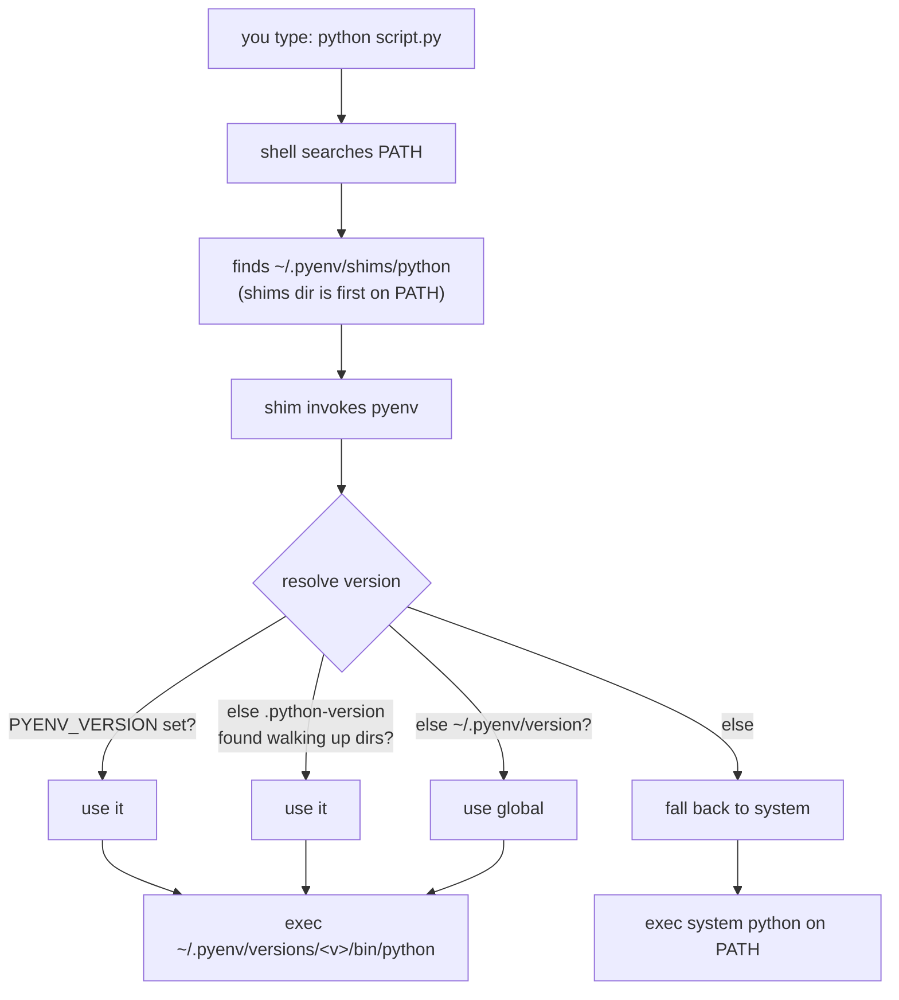

#### Version-resolution precedence

The resolution step checks four sources in a fixed order and stops at the first hit. The `.python-version` lookup is special: pyenv walks *up* the directory tree from the current working directory, so a file in a parent folder governs all of its subfolders. The figure summarizes the ladder.

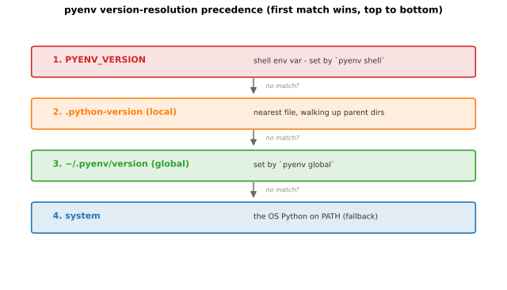

> [!IMPORTANT]
> Precedence is `PYENV_VERSION` (env var) → nearest `.python-version` (local, searched upward) → `~/.pyenv/version` (global) → `system`. The first match wins; later sources are never consulted.

#### rehash

Whenever you install a new Python version, or `pip install` a package that ships a console script (like `black` or `pytest`), the set of executables changes and pyenv must regenerate its shims. Modern pyenv auto-rehashes after `pyenv install`, but installing scripts *into* a version sometimes requires a manual nudge. If a freshly installed command reports "command not found," rehash is almost always the fix.

```bash
pyenv rehash                # regenerate ~/.pyenv/shims/*
```

### Real-world example

A team maintains a legacy service on 3.10 and a new service on 3.12 on the same laptop. They pin each project with `pyenv local`, so simply `cd`-ing between directories flips the active interpreter — no manual switching, no `PATH` edits. The session below shows the version changing purely from directory context.

```bash
# one-time: install both interpreters
pyenv install 3.10.13
pyenv install 3.12.0
pyenv global 3.12.0                 # sensible default

# pin the legacy project to 3.10
cd ~/work/legacy-service
pyenv local 3.10.13                 # writes ./.python-version
python --version                    # Python 3.10.13

# the new project uses the global default
cd ~/work/new-service
python --version                    # Python 3.12.0

# inspect what pyenv actually resolves to
pyenv which python                  # full path under ~/.pyenv/versions/...
pyenv version                       # active version + the source that set it

# create an isolated package env on top of the pinned interpreter
cd ~/work/legacy-service
python -m venv .venv && source .venv/bin/activate
```

### In practice

pyenv shines on developer machines and CI runners that must reproduce a *specific* interpreter build, and it composes cleanly with packaging tools. Poetry, Pipenv, and a bare `python -m venv` all happily build their environments on top of whichever interpreter pyenv resolves. The `pyenv-virtualenv` plugin is popular for binding a named virtualenv to a directory so activation is automatic, but it is an add-on you install separately.

> [!TIP]
> In production containers you usually do *not* need pyenv — pin the interpreter in the base image (`FROM python:3.12-slim`) instead. pyenv earns its keep on multi-project dev machines and CI matrices, where one host must serve many Python versions.

```bash
pyenv root          # print PYENV_ROOT (default ~/.pyenv)
pyenv versions      # list installed versions, * marks active
pyenv uninstall 3.10.13
```

### Pitfalls

- **Expecting package isolation.** pyenv switches *interpreters*, not site-packages. Two projects on the same pinned version still share that version's global packages unless each uses a virtualenv. Verify against the docs before assuming any package separation.
- **Missing shell init.** pyenv only works if `eval "$(pyenv init -)"` runs in your shell rc so the shims directory lands at the front of `PATH`. Without it, `which python` shows the system Python, not a shim.
- **Forgetting to rehash.** A newly installed console script may report "command not found" until `pyenv rehash` regenerates the shims.
- **Build failures from missing headers.** `pyenv install` compiles from source; on a bare system it fails without OpenSSL, readline, and other build dependencies. Check the pyenv wiki's "Common build problems" page.
- **`.python-version` committed by accident.** Pinning with `pyenv local` writes a file teammates may not have that exact version installed for. Decide deliberately whether to commit it.

> [!WARNING]
> Editing `PATH` to put a real `python` *before* the shims directory silently disables pyenv for that shell — commands run but resolve to the wrong interpreter. The shims must stay first on `PATH`.

## Conda

> **TL;DR:** Conda is a cross-language, binary-first package and environment manager. Unlike `pip`, it installs not just Python packages but also the non-Python libraries they depend on (C/C++/Fortran, CUDA, MKL) and even alternate Python interpreters, all from channels like conda-forge. It resolves a full environment as one transaction, which is why it shines for scientific and GPU stacks.

### Vocabulary

- **conda** — the package + environment manager from the Anaconda ecosystem.
- **channel** — a package repository (e.g. `conda-forge`, `defaults`). Analogous to a PyPI index.
- **conda-forge** — the large community channel; the de facto default for most users.
- **environment** — an isolated install prefix with its own Python and libraries.
- **Mamba / micromamba** — faster C++ reimplementations of conda's solver/CLI.
- **environment.yml** — a declarative spec of channels and dependencies for an env.
- **package (`.conda`/`.tar.bz2`)** — a relocatable binary artifact, not a wheel.

### Intuition

`pip` assumes the non-Python world (compilers, system `.so` files) already exists on your machine. Conda makes the opposite assumption: it ships those binaries too. So `conda install numpy` can pull in a tuned BLAS/MKL build, and `conda install cudatoolkit` brings CUDA without touching your OS package manager. The tradeoff is a separate ecosystem with its own artifacts and solver.

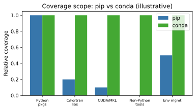

### How it works

Conda treats an environment as a set of packages that must satisfy each other *and* their compiled-library constraints. It downloads channel metadata, runs a SAT-style solver over the whole request, then materializes the result as one atomic transaction.

#### Channels and the solver

Each channel publishes a `repodata.json` describing every package, version, and build string. The solver reads these, encodes constraints (including build-level pins like a specific CUDA or BLAS variant), and finds a consistent set. The classic solver was slow; libmamba (now the default backend) made this much faster.

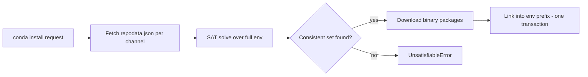

#### Environments

Conda environments are full prefixes; activating one puts its `bin`/`Scripts` ahead on `PATH`. You can create an env at a specific Python version that differs from your base interpreter.

```bash
conda create -n ml python=3.11 numpy pandas
conda activate ml
conda install -c conda-forge pytorch    # pull from conda-forge channel
```

#### Reproducibility

A declarative `environment.yml` captures channels and top-level deps; `conda env export` captures the exact resolved set for reproduction.

```yaml
# environment.yml
name: ml
channels:
  - conda-forge
dependencies:
  - python=3.11
  - numpy
  - pandas
  - pip                # bridge to PyPI-only packages
  - pip:
      - some-pypi-only-pkg
```

### Real-world example

A data team needs a GPU PyTorch build plus a few PyPI-only tools, reproducible across laptops and a cluster. They define one `environment.yml`, create the env from it, and use the `pip:` sub-section only for packages absent from conda-forge.

```bash
conda env create -f environment.yml      # build env from the spec above
conda activate ml
python -c "import torch; print(torch.cuda.is_available())"
conda env export --from-history > env.lock.yml   # record exact set
```

### In practice

Use a single manager per environment where possible. If you must mix, install **everything conda can** first, then `pip install` the remainder last — pip writes into the same `site-packages` and conda won't track those files. For speed, prefer `mamba`/`micromamba`, which are drop-in and dramatically faster on large solves.

> [!CAUTION]
> Installing conda packages *after* pip packages in the same env can clobber pip-installed files, since conda's transaction is unaware of them. Do conda first, pip last, and avoid re-running conda installs afterward.

> [!TIP]
> Anaconda's `defaults` channel has licensing terms for some organizations; `conda-forge` is community-run and the common default. Set channel priority to `strict` to avoid mixed-channel solver surprises.

### Pitfalls

- **Slow classic solver** — switch to the libmamba backend or use `mamba`.
- **Mixing channels loosely** — non-strict priority yields incompatible builds; use `channel_priority: strict`.
- **Treating conda packages as wheels** — they are a different artifact format; you can't `pip install` a `.conda` file.
- **Committing a fully-pinned export as the only spec** — it's platform-specific; keep a high-level `environment.yml` too.

## Poetry

> **TL;DR:** Poetry is an all-in-one dependency manager and build tool for Python projects. It declares dependencies in `pyproject.toml`, resolves them into a deterministic `poetry.lock`, manages a virtual environment for you, and builds/publishes sdists and wheels — covering the whole lifecycle from `poetry add` to `poetry publish`. Recent versions support the standard PEP 621 `[project]` table.

### Vocabulary

- **Poetry** — a dependency manager + build backend for Python projects.
- **`poetry.lock`** — Poetry's deterministic lockfile of the resolved graph (with hashes).
- **dependency group** — named sets of deps (e.g. `dev`, `test`) installed selectively.
- **caret / tilde constraints** — `^1.2` (compatible-within-major), `~1.2` (compatible-within-minor).
- **poetry-core** — Poetry's PEP 517 build backend.
- **extras** — optional dependency bundles a consumer can opt into.

### Intuition

Poetry treats your project as a first-class object described entirely in `pyproject.toml`. Instead of juggling `requirements.txt`, `setup.py`, and a venv by hand, you run `poetry add`, and Poetry edits the manifest, re-resolves the full graph, writes a hash-pinned lock, and installs into a managed environment. One tool owns declaration, resolution, environment, and packaging.

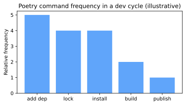

### How it works

Poetry separates **declaration** (`pyproject.toml`) from the **resolved truth** (`poetry.lock`). Editing deps relocks; installing reads the lock so every machine gets identical versions.

#### Declaration and resolution

You declare version constraints (often caret ranges). `poetry add`/`poetry lock` runs Poetry's resolver against the index and records the exact resolved versions plus hashes in `poetry.lock`.


```toml
# pyproject.toml — Poetry with PEP 621 [project] table
[project]
name = "myapp"
version = "0.1.0"
requires-python = ">=3.11"
dependencies = ["requests (>=2.31,<3)"]

[tool.poetry.group.dev.dependencies]
pytest = "^8.0"

[build-system]
requires = ["poetry-core>=1.0.0"]
build-backend = "poetry.core.masonry.api"
```

#### Environment management

Poetry creates and manages a virtualenv per project. `poetry install` syncs it to the lock; `poetry run`/`poetry shell` execute commands inside it.

```bash
poetry add "fastapi"             # add + relock + install
poetry install                   # install from poetry.lock
poetry run pytest                # run inside the managed env
```

#### Build and publish

Because `poetry-core` is a PEP 517 backend, `poetry build` produces standard wheels and sdists, and `poetry publish` uploads them to PyPI.

```bash
poetry build                     # dist/*.whl + *.tar.gz
poetry publish                   # upload to PyPI (configure token first)
```

### Real-world example

A library author wants reproducible dev installs, separate test deps, and a standards-compliant wheel to publish. They use dependency groups for tooling and let Poetry build/publish.

```bash
poetry new mylib && cd mylib
poetry add "httpx"                       # runtime dependency
poetry add --group dev pytest ruff       # dev-only group
poetry install                           # set up venv from lock
poetry build && poetry publish           # ship to PyPI
```

### In practice

Commit `poetry.lock` for applications so deployments are reproducible. For libraries, the lock pins *your* dev environment, but consumers resolve against the dependency ranges in `pyproject.toml`, so keep those ranges sensible rather than over-pinned. Poetry's caret defaults are convenient but can be conservative — widen ranges when publishing a library to avoid blocking downstream upgrades.

> [!TIP]
> Use dependency **groups** (`--group dev`, `--group test`) instead of dumping everything into runtime deps. Consumers of a published library never install your dev groups.

> [!NOTE]
> Poetry historically used a `[tool.poetry]` table; modern versions also accept the standard PEP 621 `[project]` table. Verify which fields belong where against the current Poetry docs before mixing them.

### Pitfalls

- **Over-pinning a published library** — caret/exact pins in a library propagate conflicts downstream; prefer ranges.
- **Forgetting to commit `poetry.lock`** — deployments then re-resolve and may drift.
- **Mixing `pip install` into a Poetry-managed venv** — Poetry won't track those; the lock no longer describes reality.
- **Guessing CLI flags** — confirm exact subcommands/flags against `python-poetry.org`.

## pdm

> **TL;DR:** PDM (Python Development Master) is a modern, standards-first project and dependency manager. It is built around PEP 621 `pyproject.toml` and PEP 517 builds, resolves dependencies into a `pdm.lock`, and is notable for supporting PEP 582's `__pypackages__` local package directory as an alternative to a classic virtualenv (alongside conventional venv support).

### Vocabulary

- **PDM** — a PEP 621-based Python package/dependency manager.
- **`pdm.lock`** — PDM's cross-platform lockfile of the resolved graph.
- **PEP 582 (`__pypackages__`)** — a local project package directory used without activating a venv.
- **dependency group / optional-dependencies** — named extra dependency sets.
- **PEP 517 backend** — the pluggable build backend PDM uses to produce wheels/sdists.

### Intuition

PDM's pitch is "no proprietary metadata": everything lives in the standard `[project]` table, so your project stays portable across tools. Its distinctive feature is PEP 582 — instead of an activated virtualenv, dependencies can live in a project-local `__pypackages__/` directory that the interpreter picks up automatically, removing the activate/deactivate ritual (a classic `.venv` workflow is also supported).

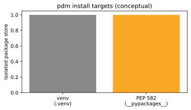

### How it works

PDM reads PEP 621 metadata from `pyproject.toml`, resolves a compatible graph, and records it in `pdm.lock`. Installs target either a virtualenv or `__pypackages__`, depending on configuration.

#### Declaration and locking

You declare deps in the standard `[project]` table; `pdm add`/`pdm lock` resolve and write a cross-platform `pdm.lock`. `pdm install`/`pdm sync` materialize the locked set.

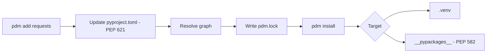

```toml
# pyproject.toml — PDM uses standard PEP 621 metadata
[project]
name = "myapp"
version = "0.1.0"
requires-python = ">=3.11"
dependencies = ["requests>=2.31,<3"]

[dependency-groups]
dev = ["pytest>=8"]

[build-system]
requires = ["pdm-backend"]
build-backend = "pdm.backend"
```

#### Running code

PDM runs commands against the resolved environment without manual activation. Scripts can be defined in `pyproject.toml` and invoked via `pdm run`.

```bash
pdm add httpx                    # add dep + relock + install
pdm install                      # install from pdm.lock
pdm run pytest                   # run within the project environment
```

### Real-world example

A team wants a fully standards-compliant project that any PEP 517 tool can build, with locked dev deps and no venv activation friction. They use PDM with `__pypackages__`, keep all metadata in `[project]`, and define a test script.

```bash
pdm init                          # scaffold PEP 621 pyproject.toml
pdm add fastapi uvicorn           # runtime deps
pdm add -dG dev pytest            # dev group (verify flag against docs)
pdm install                       # populate __pypackages__ or .venv
pdm run pytest                    # execute tests in the project env
```

### In practice

PDM is a strong fit when standards compliance and tool portability matter: because metadata is pure PEP 621, you can switch build backends or even migrate to uv/Poetry with minimal manifest churn. Commit `pdm.lock` for applications. PEP 582 is convenient but less universally supported by external tooling than a `.venv`, so use a virtualenv when integrating with IDEs or services that expect one.

> [!TIP]
> Because PDM stores everything in the standard `[project]` table, migrating to or from uv/Poetry is mostly a lockfile swap, not a manifest rewrite. Keep custom config under `[tool.pdm]` only when a standard field doesn't exist.

> [!NOTE]
> PEP 582 (`__pypackages__`) was *not* accepted into the core CPython spec; PDM supports it as an opt-in mode. For maximum tooling compatibility, the classic virtualenv workflow remains the safe default — verify current behavior against `pdm-project.org`.

### Pitfalls

- **Assuming all tools understand `__pypackages__`** — many IDEs/CI expect a `.venv`; prefer that for interop.
- **Guessing flag syntax** — confirm exact `pdm add` group flags against the docs.
- **Not committing `pdm.lock`** — deployments then re-resolve and may drift.
- **Treating `pdm.lock` as portable to pip/poetry** — it's PDM-specific.

## uv

> **TL;DR:** `uv` is an extremely fast Python package and project manager written in Rust by Astral (the makers of Ruff). It is a single binary that replaces `pip`, `pip-tools`, `virtualenv`, and much of `pyenv`/`poetry`: it resolves and installs dependencies, manages virtual environments, locks projects via `pyproject.toml` + `uv.lock`, and can even install Python interpreters — often an order of magnitude faster than the pip-based stack.

### Vocabulary

- **uv** — Astral's Rust-based Python package/project manager.
- **`uv pip`** — a pip-compatible interface (drop-in commands) over uv's resolver.
- **`uv.lock`** — uv's cross-platform, universal lockfile for a project.
- **universal resolution** — one lockfile resolving across platforms/Python versions.
- **global cache** — content-addressed store reused across projects (hardlinks, not copies).
- **`uv tool` / `uvx`** — run/install CLI tools in isolated, ephemeral environments.
- **`uv python`** — download and pin standalone Python builds.

### Intuition

uv asks: why is Python installation slow? Most of the cost is network round-trips, redundant work, and a Python-implemented resolver. uv rewrites the hot path in Rust, parallelizes downloads, and uses a global content-addressed cache so the same wheel is hardlinked into many environments instead of re-downloaded and re-copied. The result behaves like pip but feels instant.

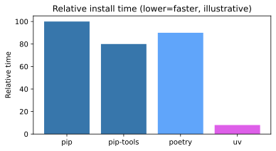

### How it works

uv has two faces: a low-level **pip-compatible** layer and a high-level **project** layer that owns `pyproject.toml` and `uv.lock`. Both share one Rust resolver and one cache.

#### The pip-compatible layer

`uv pip install`/`uv pip compile`/`uv venv` mirror the familiar tools, so you can adopt uv without changing workflows. It reads the same indexes and requirement syntax as pip.

```bash
uv venv                          # create .venv fast
uv pip install "requests>=2.31"  # pip-style install via uv's resolver
uv pip compile requirements.in -o requirements.txt   # like pip-tools
```

#### The project layer

In project mode, uv manages dependencies declared in `pyproject.toml` and writes a universal `uv.lock`. `uv add`/`uv remove` edit the manifest and relock; `uv sync` makes the environment exactly match the lock.

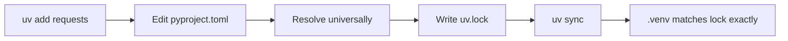

```toml
# pyproject.toml managed by uv (PEP 621 [project] table)
[project]
name = "myapp"
version = "0.1.0"
requires-python = ">=3.11"
dependencies = ["requests>=2.31"]
```

#### Python and tools

uv can fetch standalone CPython builds (`uv python install 3.12`) and run one-off tools without polluting any environment, similar to `pipx`.

```bash
uv python install 3.12          # download a standalone interpreter
uvx ruff check .                # run ruff in an ephemeral isolated env
```

### Real-world example

A team migrates a service from a pip + venv + pip-tools workflow to uv for faster CI. They keep `pyproject.toml`, let uv produce a committed `uv.lock`, and replace install steps with `uv sync --frozen` so CI fails if the lock is stale.

```bash
uv init myapp && cd myapp        # scaffold pyproject.toml
uv add "fastapi" "uvicorn"       # add deps, relock automatically
uv run uvicorn main:app          # run inside the managed env
# CI: install exactly the lock, never re-resolve
uv sync --frozen
```

### In practice

uv's speed comes from parallel I/O and a hardlinking global cache, so repeated installs across projects are nearly free. It reads standard `pyproject.toml`, so a uv project stays publishable to PyPI with any PEP 517 backend. Adopt it incrementally via the `uv pip` shims before committing to the project layer.

> [!TIP]
> Use `uv run <cmd>` to execute a command inside the project's environment without manually activating `.venv`; uv ensures the env is synced first.

> [!IMPORTANT]
> `uv.lock` is uv-specific and universal (resolves across platforms). Commit it for apps. For libraries published to PyPI, the source of truth for consumers is still `pyproject.toml` dependency ranges, not your lock.

### Pitfalls

- **Expecting `uv.lock` to be read by pip/poetry** — it isn't; it's uv's own format.
- **Forgetting `--frozen` in CI** — without it, CI may re-resolve and drift from the committed lock.
- **Verifying exact CLI flags from memory** — uv evolves quickly; confirm subcommands/flags against `docs.astral.sh/uv`.

## pyproject.toml

> **TL;DR:** `pyproject.toml` is the single standardized configuration file for Python projects. PEP 518 introduced its `[build-system]` table to declare build requirements, PEP 621 standardized the `[project]` table for package metadata (name, version, dependencies), and arbitrary tools store their config under `[tool.*]`. It replaces the old `setup.py` + `setup.cfg` + `requirements.txt` sprawl with one declarative, tool-agnostic manifest.

### Vocabulary

- **pyproject.toml** — the standard project config file, written in TOML.
- **`[build-system]`** — PEP 518 table declaring the build backend and its requirements.
- **build backend** — the PEP 517 component that turns source into a wheel/sdist (e.g. `setuptools`, `hatchling`, `flit-core`, `poetry-core`, `pdm-backend`).
- **`[project]`** — PEP 621 table holding standardized metadata.
- **`[tool.<name>]`** — namespaced config for individual tools (ruff, pytest, mypy, etc.).
- **dynamic** — fields the backend computes at build time rather than hardcoding.

### Intuition

Before `pyproject.toml`, a project's truth was scattered: build logic in `setup.py` (executable Python — a security and reproducibility hazard), some metadata in `setup.cfg`, dependencies in `requirements.txt`, and tool config in a dozen ad-hoc files. `pyproject.toml` collapses that into one declarative TOML file with three concerns: **how to build it** (`[build-system]`), **what it is** (`[project]`), and **how each tool behaves** (`[tool.*]`). Because it's data, not code, any tool can read it without executing arbitrary Python.

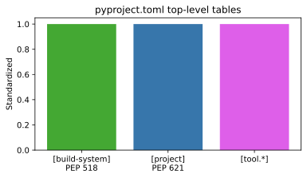

### How it works

A build frontend (pip, build, uv) reads `[build-system]` to learn which backend to install and invoke; the backend reads `[project]` to produce a wheel with correct metadata; everything under `[tool.*]` is ignored by the build but consumed by the named tool.

#### `[build-system]` (PEP 518)

This table is read **first**. It tells the frontend what to install in an isolated build environment and which entry point to call. Without it, tools assume a legacy setuptools build.

```toml
[build-system]
requires = ["hatchling"]          # installed in an isolated build env
build-backend = "hatchling.build" # PEP 517 entry point
```

#### `[project]` (PEP 621)

This is the standardized metadata the wheel carries. `name`, `version`, `requires-python`, and `dependencies` are the core fields; `optional-dependencies` defines extras.

```toml
[project]
name = "myapp"
version = "0.1.0"
description = "Example service"
requires-python = ">=3.11"
dependencies = ["requests>=2.31,<3", "pydantic>=2"]

[project.optional-dependencies]
dev = ["pytest>=8", "ruff"]

[project.scripts]
myapp = "myapp.cli:main"          # console entry point
```

#### `[tool.*]` config

Each tool owns its namespace. The build ignores these tables; the tool reads only its own.

```toml
[tool.ruff]
line-length = 100

[tool.pytest.ini_options]
testpaths = ["tests"]
```

The flow from manifest to installable artifact ties these tables together:

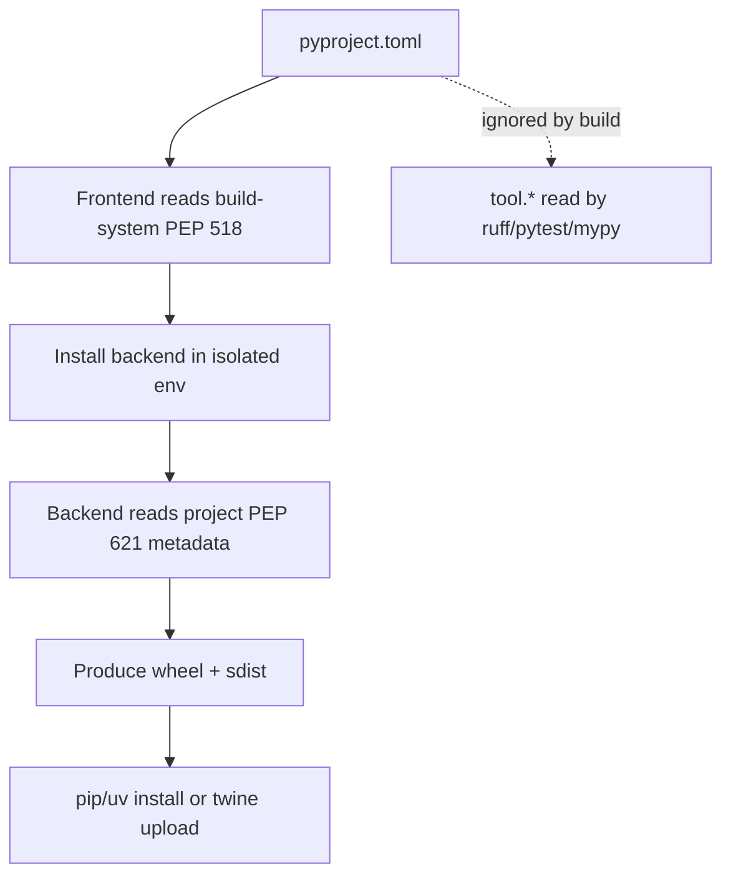

### Real-world example

A library author wants a buildable, publishable package with a CLI entry point, optional dev deps, and tool config — all in one file, no `setup.py`.

```toml
[build-system]
requires = ["hatchling"]
build-backend = "hatchling.build"

[project]
name = "weatherkit"
version = "1.2.0"
requires-python = ">=3.11"
dependencies = ["httpx>=0.27"]
dynamic = ["readme"]              # backend fills this from README.md

[project.optional-dependencies]
test = ["pytest>=8"]

[project.scripts]
weatherkit = "weatherkit.__main__:main"

[tool.hatch.metadata.hooks.fancy-pypi-readme]   # backend-specific config
content-type = "text/markdown"
```

```bash
python -m build      # reads pyproject.toml -> dist/*.whl + *.tar.gz
pip install dist/*.whl
```

### In practice

Pick a build backend deliberately: `setuptools` for maximum compatibility and legacy needs, `hatchling`/`flit-core` for simple pure-Python libs, `poetry-core`/`pdm-backend` if you use those managers. Keep `[project]` standards-compliant so the package stays portable; use `dynamic` for fields (like version or readme) the backend should compute rather than duplicate.

> [!IMPORTANT]
> `[build-system]` is read before anything else. If you omit it, tools fall back to a legacy setuptools assumption, which may not match your project and can produce confusing build errors. Always declare it explicitly.

> [!TIP]
> Anything you'd previously have stored in `setup.py`, `setup.cfg`, `requirements.txt`, or a tool's own dotfile can usually move into `pyproject.toml`. One file, version-controlled, is easier to audit and reproduce.

### Pitfalls

- **Leaving a `setup.py` that conflicts with `[project]`** — duplicate metadata sources drift; prefer the declarative table.
- **Putting runtime deps under `[tool.*]`** — the build ignores `[tool.*]`; runtime deps belong in `[project].dependencies`.
- **Hardcoding `version` when the backend manages it** — use `dynamic = ["version"]` instead.
- **Assuming every backend reads `[project]` identically** — most do, but backend-specific quirks exist; check the backend's docs.

## Common Packages

> **TL;DR:** Python ships a large **standard library** ("batteries included") covering JSON, HTTP clients, files, dates, and more — but the broader ecosystem on PyPI provides the heavily-used third-party packages most real projects rely on: `requests` (HTTP), `numpy`/`pandas` (data), `pydantic` (validation), `pytest` (testing), and framework stacks like FastAPI/Django. Knowing what's stdlib vs PyPI tells you what you can `import` for free vs what you must `pip install`.

### Vocabulary

- **standard library (stdlib)** — modules bundled with CPython; importable with no install.
- **third-party package** — code published on PyPI; must be installed before import.
- **dependency** — a package your code requires to run.
- **transitive dependency** — a dependency of your dependency.
- **extra** — an optional dependency bundle (e.g. `requests[socks]`).

### Intuition

The mental model is a two-tier supply chain. Tier one is the **stdlib**: it travels with the interpreter, so `import json`, `import datetime`, `import sqlite3` always work. Tier two is **PyPI**: enormous, community-maintained, and where the heavy hitters live — but each one is a `pip install` (and a supply-chain decision). Reaching for PyPI when the stdlib already covers your need adds risk and weight; reaching for the stdlib when you need real performance (e.g. numeric work) leaves speed on the table.

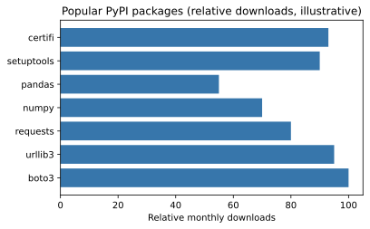

### How it works

Every import resolves either to a stdlib module shipped with CPython or to a package installed into `site-packages`. The dividing line is fixed per Python version and documented; everything else comes from PyPI.

#### Stdlib vs PyPI

When you write `import x`, Python searches its module path. Stdlib modules are always present; third-party ones appear only after installation. A useful habit: check the stdlib first, then PyPI.

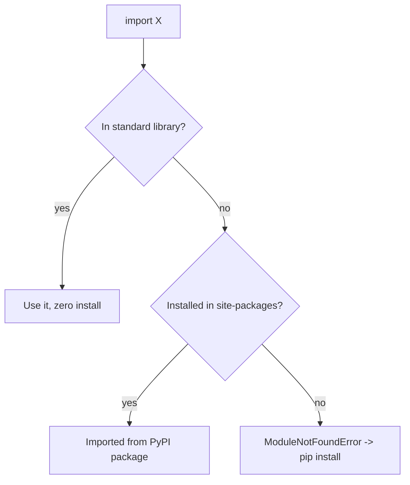

#### The common third-party set

A handful of packages appear in the majority of projects. The table below maps a need to the typical PyPI choice and its nearest stdlib fallback.

| Need | Common PyPI package | Stdlib fallback |
| :--- | :--- | :--- |
| HTTP client | `requests`, `httpx` | `urllib.request` |
| Numeric arrays | `numpy` | `array`, `statistics` |
| Tabular data | `pandas` | `csv`, `sqlite3` |
| Data validation | `pydantic` | `dataclasses` |
| Testing | `pytest` | `unittest` |
| CLI parsing | `click`, `typer` | `argparse` |
| Async HTTP server | `fastapi` + `uvicorn` | `http.server` |
| Date handling | `arrow`, `pendulum` | `datetime`, `zoneinfo` |

#### Installing them

Third-party packages install from PyPI via any installer. Pin them in your project manifest so collaborators get the same set.

```python
# requests is third-party (pip install requests); json + datetime are stdlib
import json, datetime
import requests   # ModuleNotFoundError unless installed

resp = requests.get("https://pypi.org/pypi/requests/json", timeout=10)
data = resp.json()
print(data["info"]["version"], datetime.date.today())
```

### Real-world example

A new service needs an HTTP API, request validation, and tests. The stdlib covers JSON and dates; the rest come from PyPI and are declared in `pyproject.toml` so the set is reproducible.

```toml
[project]
name = "svc"
version = "0.1.0"
requires-python = ">=3.11"
dependencies = [
  "fastapi>=0.110",   # web framework (PyPI)
  "uvicorn>=0.29",    # ASGI server (PyPI)
  "httpx>=0.27",      # async HTTP client (PyPI)
  "pydantic>=2.6",    # validation (PyPI)
]
# json, datetime, asyncio, sqlite3 used directly from the stdlib — no entry needed
```

### In practice

Every third-party dependency is a long-term liability: it must be tracked for security advisories, kept compatible, and may pull in transitive deps. Prefer the stdlib when it's adequate, and prefer well-maintained, widely-used packages (high download counts, active releases) when you do reach out — popularity correlates with faster security fixes and better docs.

> [!CAUTION]
> Each `pip install` is a supply-chain trust decision. Typosquatted and malicious packages exist on PyPI. Pin versions, review new dependencies, and prefer packages with broad adoption and recent maintenance.

> [!TIP]
> Before adding a dependency, search the stdlib. `zoneinfo`, `dataclasses`, `pathlib`, `secrets`, and `tomllib` (3.11+) removed the need for several once-common third-party packages.

### Pitfalls

- **Adding a dependency the stdlib already covers** — extra weight and risk for no gain.
- **Forgetting `tomllib` exists (3.11+)** — reading TOML no longer needs a third-party lib.
- **Pinning nothing** — "works on my machine" because transitive versions drifted.
- **Trusting a package by name alone** — verify the publisher and adoption, not just that the name matches.

## Sources

- PyPI: https://pypi.org/
- Packaging guide — uploading: https://packaging.python.org/en/latest/tutorials/packaging-projects/
- PEP 503 (Simple Repository API): https://peps.python.org/pep-0503/
- PEP 691 (JSON Simple API): https://peps.python.org/pep-0691/
- Trusted Publishing: https://docs.pypi.org/trusted-publishers/
- pip docs: https://pip.pypa.io/en/stable/
- Dependency resolution: https://pip.pypa.io/en/stable/topics/dependency-resolution/
- PEP 508 (requirement specifiers): https://peps.python.org/pep-0508/
- PEP 668 (externally managed environments): https://peps.python.org/pep-0668/
- PEP 517 (build backends): https://peps.python.org/pep-0517/
- virtualenv documentation — https://virtualenv.pypa.io/en/latest/
- Python stdlib `venv` — https://docs.python.org/3/library/venv.html
- PEP 405 (Python Virtual Environments) — https://peps.python.org/pep-0405/
- Pipenv official documentation — https://pipenv.pypa.io/
- Pipenv on PyPI — https://pypi.org/project/pipenv/
- Pipfile spec discussion — https://github.com/pypa/pipfile
- pyenv project & README — https://github.com/pyenv/pyenv
- "How It Works" and command reference — https://github.com/pyenv/pyenv#how-it-works
- Common build problems — https://github.com/pyenv/pyenv/wiki/Common-build-problems
- pyenv-virtualenv plugin — https://github.com/pyenv/pyenv-virtualenv
- conda docs: https://docs.conda.io/projects/conda/en/stable/
- conda-forge: https://conda-forge.org/
- libmamba solver: https://conda.github.io/conda-libmamba-solver/
- Managing environments: https://docs.conda.io/projects/conda/en/stable/user-guide/tasks/manage-environments.html
- Poetry docs: https://python-poetry.org/docs/
- Dependency specification: https://python-poetry.org/docs/dependency-specification/
- Poetry pyproject.toml reference: https://python-poetry.org/docs/pyproject/
- PEP 621: https://peps.python.org/pep-0621/
- PDM docs: https://pdm-project.org/en/latest/
- PEP 582: https://peps.python.org/pep-0582/
- uv docs: https://docs.astral.sh/uv/
- Project concept: https://docs.astral.sh/uv/concepts/projects/
- pip interface: https://docs.astral.sh/uv/pip/
- Astral: https://astral.sh/
- packaging.python.org pyproject guide: https://packaging.python.org/en/latest/guides/writing-pyproject-toml/
- PEP 518 (build-system): https://peps.python.org/pep-0518/
- Python standard library: https://docs.python.org/3/library/
- Packaging overview: https://packaging.python.org/en/latest/overview/

## Related

- [Modules, Regex & Paradigms](./04-modules-regex-paradigms.md)
- [Typing & Tooling](./08-typing-and-tooling.md)
- [Testing & Internals](./11-testing-and-internals.md)
