# Python Typing & Developer Tooling

[toc]

> **TL;DR:** Python's `typing` module gives the language a gradual type system that static checkers (mypy, pyright, pyre) verify ahead of execution while CPython ignores hints at runtime; Pydantic flips that by enforcing the same annotations at runtime. The same ecosystem provides formatters (Black, YAPF, Ruff), a fast Rust linter (Ruff), and the de facto documentation generator (Sphinx) — together the modern Python developer-tooling stack.

## typing

> **TL;DR:** Python's `typing` module plus PEP 484 give the language a *gradual* type system: you annotate code with type hints, a separate static checker (mypy, pyright, pyre) verifies them, and CPython itself ignores the hints at runtime except for storing them in `__annotations__`. Hints are documentation that a tool can prove, not a runtime contract.

### Vocabulary

Each load-bearing term gets one line. Symbols that have a standard mathematical form appear in a `math` fence; the rest stay in prose.

- **Type hint** — an annotation attached to a variable, parameter, or return that names its expected type, e.g. `x: int`.
- **Gradual typing** — a discipline where typed and untyped code coexist; the boundary type is `Any`.
- **Consistency** (the `~` relation)

```math
T \sim \text{Any} \quad\text{and}\quad \text{Any} \sim T \quad\text{for every } T
```

The relation a gradual checker uses instead of pure subtyping. `Any` is consistent with everything in both directions, which is what lets untyped code call typed code and vice versa.

- **Subtype** (`<:`) — `Dog <: Animal` means a `Dog` is usable wherever an `Animal` is expected (Liskov substitution).
- **Stub file** (`.pyi`) — a Python file containing only signatures, no bodies, used to type a module whose source has no hints.
- **`py.typed`** — a marker file (PEP 561) that tells checkers a *package* ships inline types.
- **Structural typing** — compatibility by shape (methods/attributes present), not by declared inheritance; see `Protocol`.
- **Nominal typing** — compatibility by declared name/inheritance.
- **`TypeVar`** — a placeholder type variable enabling generics, e.g. `T = TypeVar("T")`.
- **`ParamSpec`** — a variable that captures an entire parameter list (PEP 612), for decorators that preserve signatures.

### Intuition

Think of type hints as a *parallel proof system* bolted onto a dynamic language. The interpreter runs your program exactly as it would with no annotations — the hints are inert at runtime. A static checker reads the same source, builds a model of which values flow where, and rejects programs it cannot prove type-safe, all before you run anything.

Because adoption is incremental, the system is gradual: an unannotated function is implicitly `(...) -> Any`, and `Any` short-circuits checking. The spectrum below shows the trade — the more `Any` you use, the more flexible and the less proven your code becomes.

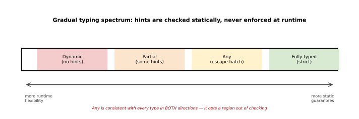

The mental model in flow form: you write annotations, optionally ship stubs, a checker consumes both, and CI gates on the result while the runtime stays untouched.

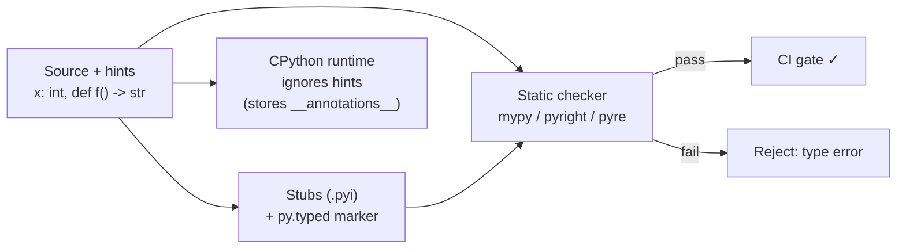

### How it works

The `typing` module is a vocabulary of special forms; the *checking* lives in external tools. The subsections below walk the pieces in roughly the order PEPs added them.

#### Annotation syntax and where hints live (PEP 484, PEP 526)

PEP 484 added function annotations; PEP 526 added variable annotations and the `__annotations__` dict. Crucially, annotating a name does not create or coerce a value — `x: int` with no assignment binds nothing, it only records an entry in `__annotations__`. The interpreter evaluates annotation *expressions* eagerly by default, which is why forward references and heavy expressions can cost import time.

```python
from typing import Optional

count: int = 0                  # variable annotation (PEP 526)
ratio: float                    # declaration only — no binding created

def greet(name: str, times: int = 1) -> str:   # function hints (PEP 484)
    return (f"hi {name} " * times).strip()

print(greet.__annotations__)    # {'name': <class 'str'>, 'times': <class 'int'>, 'return': <class 'str'>}
print(greet("ok", 2))           # runs identically with or without hints
```

#### Optional, Union, and the `|` operator (PEP 604)

`Optional[T]` is sugar for `Union[T, None]` — a value that may be the type or `None`. Since Python 3.10, PEP 604 lets you write unions with the `|` operator, which is now the idiomatic form. A checker forces you to narrow an `Optional` (via an `is None` check) before using it as the inner type.

```python
def find(name: str) -> str | None:     # PEP 604 union; same as Optional[str]
    return {"a": "alpha"}.get(name)

v = find("a")
# v.upper()        # checker error: v may be None
if v is not None:
    print(v.upper())  # narrowed to str here
```

#### Generics, TypeVar, and PEP 695 syntax

Generics let a container or function be parameterised by a type while preserving it through the call. Classically you declare a `TypeVar` and subclass `Generic[T]`; Python 3.12's PEP 695 introduces inline type-parameter syntax (`class C[T]:`, `def f[T]()`, and `type Alias = ...`) that removes the boilerplate. Use the new syntax when targeting 3.12+, the classic form otherwise.

```python
from typing import TypeVar, Generic

T = TypeVar("T")

class Box(Generic[T]):          # classic, works on all supported versions
    def __init__(self, item: T) -> None:
        self.item = item
    def get(self) -> T:
        return self.item

class Stack[T]:                 # PEP 695, Python 3.12+
    def __init__(self) -> None:
        self._items: list[T] = []
    def push(self, x: T) -> None:
        self._items.append(x)

type Vector = list[float]       # PEP 695 type alias statement
```

#### Protocols — structural typing (PEP 544)

A `Protocol` describes a *shape*: any object with the right methods satisfies it, with no explicit inheritance. This is static duck typing — the checker accepts a value because it structurally matches, which decouples interfaces from class hierarchies.

```python
from typing import Protocol

class SupportsClose(Protocol):
    def close(self) -> None: ...

def shutdown(resource: SupportsClose) -> None:
    resource.close()

class File:                     # never mentions SupportsClose
    def close(self) -> None:
        print("closed")

shutdown(File())                # accepted: File structurally matches
```

#### Precision tools: Literal, Final, TypedDict, overload, cast, NewType, Self

`typing` ships several narrow constructs. `Literal["r","w"]` restricts a value to exact constants; `Final` forbids rebinding; `TypedDict` types a dict by its keys; `@overload` declares multiple signatures for one implementation; `cast` asserts a type to the checker without a runtime check; `NewType` makes a distinct type from a base for stronger invariants; and `Self` (3.11+) refers to the enclosing class for fluent APIs.

```python
from typing import Literal, Final, TypedDict, overload, cast, NewType, Self

MAX: Final = 100                       # rebinding is a checker error
Mode = Literal["r", "w", "a"]          # only these three strings allowed

class Movie(TypedDict):
    title: str
    year: int

UserId = NewType("UserId", int)        # distinct from a plain int statically
uid = UserId(42)

class Builder:
    def step(self) -> Self:            # returns the precise subclass type
        return self

@overload
def to_str(x: int) -> str: ...
@overload
def to_str(x: bytes) -> str: ...
def to_str(x: int | bytes) -> str:    # single implementation
    return x.decode() if isinstance(x, bytes) else str(x)

raw = cast(int, object())             # trust me, it's an int (no runtime check)
```

#### Decorators and signatures: ParamSpec (PEP 612)

Typing a decorator that wraps a function used to lose the wrapped signature. PEP 612's `ParamSpec` and `Concatenate` capture and forward a callable's full parameter list so the wrapper stays type-accurate. This is the canonical fix for "my decorator erased my function's types."

```python
from typing import ParamSpec, TypeVar, Callable
import functools

P = ParamSpec("P")
R = TypeVar("R")

def timed(fn: Callable[P, R]) -> Callable[P, R]:
    @functools.wraps(fn)
    def wrapper(*args: P.args, **kwargs: P.kwargs) -> R:
        return fn(*args, **kwargs)     # signature of fn is preserved
    return wrapper
```

#### Distributing types: stubs and PEP 561

A library publishes its types one of two ways. Inline-typed packages drop an empty `py.typed` file in the package and ship hints in the source; untyped or C-extension libraries get a separate stub-only distribution (`.pyi` files), often community-maintained in `typeshed`. PEP 561 defines how checkers discover both.

```bash
# inline-typed package: add the marker so downstream checkers trust your hints
mypackage/
├── __init__.py
├── core.py
└── py.typed          # empty file — PEP 561 marker
```

### Real-world example

Scenario: a small service parses request modes and looks up users. We want the checker to catch an invalid mode and an unguarded `None` *before* deployment, while the deferred-evaluation import keeps annotations cheap and tolerant of forward references. The `TYPE_CHECKING` guard imports a heavy type only during checking, never at runtime.

```python
from __future__ import annotations   # PEP 563: annotations stored as strings
from typing import Literal, TYPE_CHECKING

if TYPE_CHECKING:
    from expensive_pkg import Session   # checker sees it; runtime never imports it

Mode = Literal["read", "write"]

def handle(mode: Mode, session: "Session") -> str:
    return f"{mode} via {session!r}"

def lookup(uid: int, db: dict[int, str]) -> str | None:
    return db.get(uid)

# Statically rejected examples (uncomment to see checker errors):
# handle("delete", ...)          # "delete" is not a valid Mode literal
# name = lookup(1, {})
# name.upper()                   # name may be None — must narrow first
```

Run a checker over it; the runtime stays oblivious:

```bash
pip install mypy
mypy service.py        # reports the Literal and Optional violations
python service.py      # runs regardless — hints are not enforced at runtime
```

### In practice

In production codebases, typing is a CI gate, not a runtime feature. Teams enable `--strict` incrementally per-package, ship `py.typed` so consumers inherit the guarantees, and treat the type checker like a linter that runs on every PR.

> [!IMPORTANT]
> `from __future__ import annotations` (PEP 563) makes all annotations lazy strings, so they no longer cost import time and forward references "just work." But tools that read annotations at runtime — notably **Pydantic** and `dataclasses` in some modes — must then resolve those strings via `typing.get_type_hints()`. Verify the interaction against each library's docs before enabling it globally.

> [!TIP]
> Reach for `Protocol` instead of abstract base classes when you want to type "anything with these methods." It avoids forcing third-party classes into your hierarchy and matches Python's duck-typed spirit.

> [!WARNING]
> `cast(T, value)` performs **no runtime check** — it only silences the checker. If you cast wrongly, you have lied to the type system and the bug surfaces later as a runtime error with no type-check trail.

### Pitfalls

- **Hints are enforced at runtime** — *wrong*. CPython ignores them; only a static checker or an opt-in library (Pydantic, `beartype`) acts on them.
- **`Optional[X]` means "X or default"** — *wrong*. It means `X | None`; you must narrow before use.
- **Annotating `x: int` creates `x`** — *wrong*. A bare annotation binds no value; it only records into `__annotations__`.
- **Mutable defaults via annotation** — annotating does not change the classic `def f(x: list = [])` shared-default footgun; that is runtime semantics, untouched by typing.
- **Generic at runtime** — `isinstance(x, list[int])` raises; parameterised generics are not runtime-checkable. Use the bare class for `isinstance`.
- **Stubs drift** — a `.pyi` that disagrees with the implementation type-checks green but lies; keep stubs in sync or prefer inline types with `py.typed`.

## mypy

> **TL;DR:** mypy is the original, reference implementation of PEP 484 gradual static type checking for Python. It reads your annotations (and inferred types) *ahead of execution*, reports type errors as a separate build step, and has **zero runtime effect** — your program runs identically whether or not mypy ever ran. You dial its strictness from "lint the typed bits only" up to `--strict`, the way large codebases adopt typing incrementally.

### Vocabulary

- **Static type checker** — a tool that analyses source *without running it*, proving (within its model) that operations agree with declared/inferred types. mypy is one; it is not part of CPython.
- **Gradual typing** ([PEP 484](https://peps.python.org/pep-0484/)) — typed and untyped code coexist. Unannotated functions are treated permissively; `Any` is the escape hatch that is consistent with every type.
- **`Any`** — the dynamic type. Assigning `Any` into a typed slot (or out of one) silences checks, so `Any` *propagates* and can quietly erode coverage.
- **Type inference** — mypy assigns types to expressions and locals you did not annotate, e.g. inferring `list[int]` from `[1, 2, 3]`.
- **Stub file** (`.pyi`) — a signatures-only file describing a module's public types, used when the real source is untyped, native, or unavailable.
- **`reveal_type(x)`** — a pseudo-builtin mypy understands at check time; it emits `Revealed type is "..."` then errors at runtime if actually executed. Use it to debug inference.
- **`# type: ignore[code]`** — suppress a specific error on one line; the bracketed `[code]` keeps the suppression narrow.
- **strict-optional** — `None` is a distinct type, so `Optional[X]` (i.e. `X | None`) must be narrowed before use. On by default in modern mypy.
- **daemon (`dmypy`)** — a long-running process that keeps state warm for fast re-checks in editors/CI.

### Intuition

Think of mypy as a *proof-reader that never runs your program*. It builds a model of every value's type — partly from your annotations, partly inferred — and walks the code asking "does this call, attribute access, or assignment make sense for these types?" Because Python executes annotations as no-ops, mypy lives entirely outside runtime: it is closer to a compiler's type pass than to an assertion.

The "gradual" part is the design's whole point. You can start with one annotated function in a million-line untyped codebase, and mypy will check just that island while treating everything around it as `Any`. As you annotate more, you turn the strictness dial up and mypy catches more.

### How it works

mypy parses your code into a syntax tree, resolves names and imports, infers and checks types, and emits diagnostics with stable error codes. The stages below mirror that pipeline; the figure summarises it.

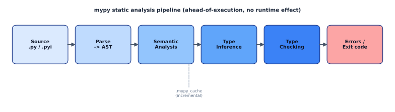

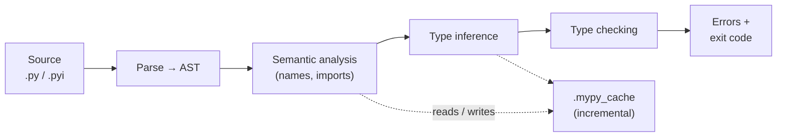

#### Parse and semantic analysis

mypy first parses each module into an abstract syntax tree, then resolves what every name refers to — locals, globals, imported symbols, classes, and the targets of `from x import y`. Import resolution is where most onboarding pain lives: if a dependency ships no types, mypy needs a stub or it will complain.

```bash
# Missing stubs surface here; install bundled type stubs as needed.
mypy --install-types          # interactively install detected types-* packages
mypy --ignore-missing-imports # or: treat unresolved third-party imports as Any
```

#### Type inference

For code you did not annotate, mypy infers types from literals, constructors, and return values, threading them through assignments. Inference is local and conservative — it will not guess a parameter's type, which is why unannotated `def` bodies are only partially checked unless you opt in.

```python
xs = [1, 2, 3]        # inferred: list[int]
reveal_type(xs)       # note: Revealed type is "builtins.list[builtins.int]"
total = sum(xs)       # inferred: int
```

#### Type checking and error reporting

With types known, mypy checks every operation: calls match signatures, attributes exist, branches narrow `Optional`, and returns match the declared type. Findings are printed with a stable error code in brackets so you can suppress or grep precisely, and the process exits non-zero when errors remain.

```python
def greet(name: str) -> str:
    return "hi " + name

greet(42)  # error: Argument 1 to "greet" has incompatible type "int"; expected "str"  [arg-type]
```

> [!IMPORTANT]
> mypy never changes runtime behaviour. A program with mypy errors still runs (and may even work for some inputs); mypy only tells you the type model is inconsistent. Treat a clean mypy run as a *proof obligation discharged*, not as a guarantee the code is correct.

### Real-world example

Scenario: a small order-pricing helper. It looks fine and even runs for the happy path, but it mishandles a `None` discount and concatenates a number into a string. mypy catches both before the code ships.

```python
# pricing.py
from typing import Optional


def line_total(qty: int, unit_price: float, discount: Optional[float] = None) -> float:
    subtotal = qty * unit_price
    # BUG: discount may be None; arithmetic on Optional[float] is unchecked.
    return subtotal - subtotal * discount


def receipt(item: str, qty: int, unit_price: float) -> str:
    # BUG: concatenating a float into a str.
    return "Total for " + item + ": " + line_total(qty, unit_price)
```

Run mypy with strict optional handling (the default) and you get precise, line-located errors:

```bash
$ mypy pricing.py
pricing.py:8: error: Unsupported operand types for * ("float" and "None")  [operator]
pricing.py:8: note: Left operand is of type "Optional[float]"
pricing.py:13: error: Unsupported operand types for + ("str" and "float")  [operator]
Found 2 errors in 1 file (checked 1 source file)
```

The fix narrows the `Optional` and converts the number explicitly:

```python
def line_total(qty: int, unit_price: float, discount: Optional[float] = None) -> float:
    subtotal = qty * unit_price
    if discount is not None:               # narrows Optional[float] -> float
        subtotal -= subtotal * discount
    return subtotal


def receipt(item: str, qty: int, unit_price: float) -> str:
    return f"Total for {item}: {line_total(qty, unit_price):.2f}"
```

### In practice

Configure mypy once in `pyproject.toml` so the whole team and CI share one strictness contract. Per-module overrides let you keep a strict global baseline while quarantining legacy or third-party-shaped modules that are not ready.

```toml
[tool.mypy]
python_version = "3.12"
strict = true                  # enables a bundle of disallow-untyped / warn-* flags
warn_redundant_casts = true
warn_unused_ignores = true

# Loosen just the modules that aren't ready, without weakening the global baseline.
[[tool.mypy.overrides]]
module = ["legacy.*", "vendor.thirdparty"]
ignore_missing_imports = true
disallow_untyped_defs = false
```

> [!TIP]
> In CI run `mypy .` once; in editors run the daemon `dmypy` (`dmypy run -- .`) so the import graph and inference stay warm and re-checks are near-instant. The first run populates `.mypy_cache/`; cache it in CI to make incremental runs fast.

A few flags carry most of the day-to-day weight:

| Flag | Effect |
| :--- | :--- |
| `--strict` | Turns on the full set of `disallow-untyped-*` and `warn-*` checks. |
| `--disallow-untyped-defs` | Flags functions that lack annotations entirely. |
| `--check-untyped-defs` | Type-checks the *bodies* of unannotated functions too. |
| `--ignore-missing-imports` | Treats unresolved imports as `Any` instead of erroring. |
| `--warn-redundant-casts` | Flags `cast(...)` that does not change the type. |

> [!NOTE]
> Verify the exact flag set folded into `--strict` for your version against the docs — it grows over time as new checks graduate to strict.

### Pitfalls

- **Treating annotations as enforcement** — mypy passing does not mean bad data is rejected at runtime. For *runtime* validation of external input (JSON, env, request bodies) you need a validator such as [Pydantic](#pydantic); the two are complementary, not substitutes.
- **`Any` creep** — a single `Any` (often from an untyped import) silently spreads through everything it touches, so checks pass while covering nothing. Use `--disallow-any-explicit`/strict settings and audit `# type: ignore` counts.
- **Blanket `# type: ignore`** — without the `[code]` suffix it hides *future* unrelated errors on that line. Always pin the code, and enable `warn_unused_ignores` to catch stale ignores.
- **Forgetting stubs for native deps** — C-extension packages need `.pyi` stubs ([PEP 561](https://peps.python.org/pep-0561/)); install `types-*` packages or `--install-types`, don't paper over it with `--ignore-missing-imports` everywhere.
- **Expecting cross-checker parity** — mypy, [pyright](#pyright), and [pyre](#pyre) agree on the spec but differ in inference depth, narrowing, and defaults. A clean run in one is not a guarantee in another.

## pyright

> **TL;DR:** pyright is Microsoft's static type checker for Python, written in TypeScript and shipped as a Node CLI plus the type-checking engine behind Pylance in VS Code. It is fast, incremental, and watch-capable, with aggressive type narrowing and inference; it runs over an editor through the Language Server Protocol or from the command line, and is configured via `pyrightconfig.json` or `[tool.pyright]` in `pyproject.toml`.

### Vocabulary

Each term below is one load-bearing concept you will meet in pyright's output and config.

- **Static type checker** — a tool that analyzes source without running it, comparing annotations and inferred types against usage to flag inconsistencies. pyright never executes your code.
- **LSP (Language Server Protocol)** — a JSON-RPC protocol so one language backend serves many editors. pyright speaks LSP; Pylance wraps it for VS Code.
- **Type narrowing** — refining a variable's type within a branch from runtime guards such as `if x is None`, `isinstance(...)`, or `assert`. pyright's narrowing is one of its strongest features.
- **typeCheckingMode** — the global strictness dial: `off`, `basic` (default), `standard`, or `strict`. Higher modes enable more `report*` rules.
- **report rule** — a named diagnostic toggle such as `reportMissingImports` or `reportUnusedImport`, each settable to `"error"`, `"warning"`, `"information"`, or `"none"`.

> [!NOTE]
> Mode names have evolved across versions (`standard` was added later as a middle tier). Confirm the exact set your version supports against microsoft.github.io/pyright.

### Intuition

Think of pyright as a compiler front-end that stops just before code generation: it parses, binds names to scopes, evaluates types, and then complains — but it never emits or runs anything. Because annotations in Python are only hints (CPython ignores them at runtime), pyright is the layer that actually *enforces* them, turning the `typing` module's promises into errors you see before shipping.

The second intuition is responsiveness. Editors need answers in milliseconds as you type, so pyright is built incremental and in-memory: it re-checks only what changed and keeps a live model of your program, which is why it powers an interactive IDE experience rather than a once-per-CI batch run.

### How it works

pyright exposes two front-ends — a CLI and an LSP server — over one shared analysis engine. The diagram below shows both paths feeding the same pipeline, and the stages that pipeline runs.

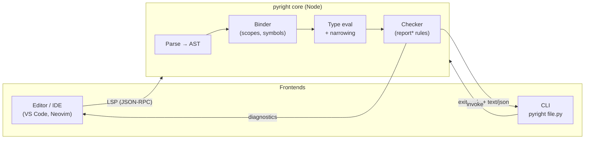

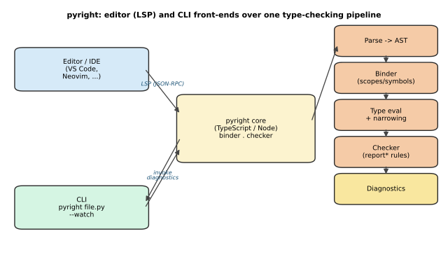

#### Parsing and binding

pyright first tokenizes and parses each module into an abstract syntax tree, recovering from syntax errors so a half-typed file still yields partial results. The binder then walks the tree to build scopes and a symbol table, resolving which name refers to which definition and discovering imports.

```python
# pyright resolves `helper` to the import, and `total` to a local symbol
from .utils import helper

def run(values: list[int]) -> int:
    total = 0
    for v in values:
        total += helper(v)
    return total
```

#### Type evaluation and narrowing

With symbols bound, pyright evaluates the type of every expression, inferring types where annotations are absent and applying flow-sensitive narrowing inside branches. This is where a value typed `str | None` becomes `str` after a `None` check, so downstream usage is accepted.

```python
def greet(name: str | None) -> str:
    if name is None:
        return "anonymous"
    # here pyright has narrowed `name` to `str`
    return name.upper()
```

#### Checking and diagnostics

Finally the checker compares evaluated types against usage and emits diagnostics governed by the active mode and `report*` rules. The same engine produces inline squiggles in the editor and a text or JSON report from the CLI, so behavior is identical across front-ends.

```bash
pyright --outputjson src/   # machine-readable diagnostics for CI
```

### Real-world example

Suppose a function claims to return `int` but a path returns `None`. pyright catches the mismatch and, with narrowing, also flags the unchecked attribute access. Below is the source followed by representative CLI output.

```python
# billing.py
def lookup_price(sku: str, table: dict[str, int]) -> int:
    return table.get(sku)  # get() may return None → type error

def label(price: int | None) -> str:
    return f"${price:.2f}"  # price could be None here
```

```bash
$ pyright billing.py
/proj/billing.py:2:12 - error: Type "int | None" is not assignable to return type "int"
    "None" is not assignable to "int" (reportReturnType)
/proj/billing.py:5:13 - error: ... "None" has no attribute usable here (reportOptionalOperand)
2 errors, 0 warnings, 0 informations
```

You can suppress a single line with a scoped ignore once you have judged it safe, which is preferred over a blanket `# type: ignore` because it names the rule:

```python
return table[sku]  # pyright: ignore[reportUnknownVariableType]
```

### In practice

Configure pyright once per project so the CLI in CI and the editor agree. Put settings in `pyproject.toml`, point it at your virtual environment, and pick a strictness that the team can actually pass.

```toml
[tool.pyright]
include = ["src"]
venvPath = "."
venv = ".venv"
pythonVersion = "3.12"
typeCheckingMode = "strict"
reportMissingImports = "error"
```

> [!TIP]
> Use `reveal_type(expr)` in a checked file and run pyright to print what it inferred for that expression — the fastest way to debug a confusing narrowing result. Remove the call before committing.

> [!IMPORTANT]
> `venvPath` plus `venv` (or `executionEnvironments`) tell pyright where your installed third-party stubs live. Without them, `reportMissingImports` fires on packages that are actually installed, because pyright cannot find your site-packages.

### Pitfalls

- **"pyright and mypy disagree, so one is wrong."** — Both are valid checkers implementing the typing spec, but each has its own inference and narrowing heuristics and unspecified corners. Differences are expected; pick one as the source of truth in CI.
- **Blanket `# type: ignore` everywhere.** — It silences *all* diagnostics on the line and rots silently. Prefer `# pyright: ignore[ruleName]` so the suppression is scoped and reviewable.
- **Editor green, CI red.** — Pylance/editor settings can differ from `pyproject.toml`. Run the pyright CLI locally with the project config to reproduce CI exactly.
- **Treating hints as runtime enforcement.** — pyright is static only; a type error it misses at runtime still needs runtime validation (see [Pydantic](#pydantic)).

## pyre

> **TL;DR:** Pyre is Meta's static type checker for Python, written in OCaml and built to type-check *very* large monorepos by running as a persistent incremental daemon that re-checks only what changed (driven by Watchman). It ships with Pysa, a taint-analysis engine that reuses Pyre's type model to trace untrusted data from sources to dangerous sinks — making Pyre as much a security tool as a type checker.

### Vocabulary

The terms below recur throughout. Each names a concrete Pyre concept rather than a generic typing idea, so anchoring them early keeps the daemon and security sections readable.

- **Static type checker** — a tool that analyzes annotations and inferred types *without running* the program, reporting inconsistencies before execution. Pyre is one such checker, alongside [mypy](#mypy) and [pyright](#pyright).
- **Incremental check** — re-analyzing only the modules affected by an edit instead of the whole repo. Pyre keeps a warm in-memory type environment so a one-file edit costs near-constant time.
- **Daemon** — a long-lived background process (`pyre start`) holding the analyzed state; clients (`pyre`, IDE) query it instead of re-launching a cold checker.
- **Watchman** — Meta's filesystem-watching service that streams change events to the daemon so it knows exactly which files to invalidate.
- **Pysa** — *Python Static Analyzer*, Pyre's taint-tracking mode. It follows annotated **sources** (untrusted input) through the program to **sinks** (dangerous operations) and reports flows.
- **Source / sink / sanitizer** — Pysa's taint vocabulary: a source produces tainted data, a sink consumes it dangerously, and a sanitizer cleans taint so a flow no longer triggers.
- **`.pyre_configuration`** — the JSON project config listing `source_directories` and `search_path` so the daemon knows what to analyze and where to find stubs.

### Intuition

Most checkers treat a run as a batch job: read every file, build types, print errors, exit. That model collapses at Meta scale, where a repo has millions of lines and a programmer edits one function. Pyre instead behaves like a compiler server — it parses everything once into a resident type environment, then treats each edit as a delta, recomputing only the transitive dependents.

The second idea is that a precise type model is also a precise *data-flow* model. If Pyre already knows the type of every expression, it can answer "could a value originating from an HTTP request reach `os.system`?" by propagating taint labels along the same call graph. Pysa is that reuse: type analysis for safety, the same machinery turned toward security.

### How it works

Pyre has two faces sharing one core: an incremental type checker and the Pysa taint engine. The pipeline below shows the filesystem feeding Watchman, Watchman feeding the daemon, and Pysa reading the daemon's type model to trace taint.

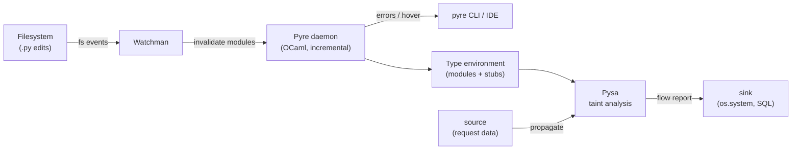

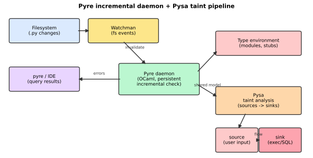

#### Project setup and configuration

You bootstrap a project with `pyre init`, which writes a `.pyre_configuration` and a Watchman config. The configuration is plain JSON: `source_directories` names the roots to type-check, and `search_path` lists extra locations for type stubs (the `.pyi` files described in the [typing](#typing) section). Keeping this file small and explicit is what lets the daemon scope its work.

```json
{
  "source_directories": ["."],
  "search_path": ["stubs/"],
  "strict": true
}
```

#### The incremental daemon

`pyre start` launches the daemon, which performs one full analysis and then stays resident. Subsequent `pyre` invocations are thin clients that ask the daemon for the current error set, so they return in milliseconds rather than re-parsing the world. When you edit a file, Watchman notifies the daemon, which invalidates that module and its dependents and recomputes just those — the essence of incremental checking.

```bash
pyre start          # warm the daemon (one full check, then resident)
pyre                # query current errors (fast; talks to daemon)
pyre stop           # shut the daemon down
```

> [!TIP]
> On a small project you can skip the daemon entirely and just run `pyre check` for a one-shot batch analysis. The daemon's payoff is large codebases where the cold-start cost would otherwise dominate every check.

#### Strictness and inline directives

Pyre defaults to a permissive mode where unannotated functions are largely unchecked; opting a file into `# pyre-strict` requires full annotations and surfaces far more errors. When a specific line legitimately violates a rule, you suppress it inline rather than weakening the whole file. Use `# pyre-ignore[CODE]` for an intentional, permanent suppression and `# pyre-fixme[CODE]` to mark a known issue you intend to fix later — both can scope to a numeric error code.

```python
# pyre-strict


def parse(raw: str) -> int:
    return int(raw)


x: int = parse("not-a-number")  # type-checks; the cast happens at runtime
y = undeclared_global  # pyre-fixme[10]: name is undefined, tracked for later
```

> [!IMPORTANT]
> Annotations Pyre checks are still just hints to CPython — they are **not** enforced at runtime. `parse("abc")` above passes type-checking yet raises `ValueError` when executed. Pyre proves consistency of declared types; it does not validate values. For runtime validation, reach for [Pydantic](#pydantic).

#### Inference

Writing annotations for a large untyped codebase by hand is impractical, so Pyre offers `pyre infer`, which proposes annotations and can apply them in place. This is the usual on-ramp for migrating legacy modules: infer a first pass, review the diff, then tighten by hand toward `# pyre-strict`.

```bash
pyre infer -i       # infer annotations and apply them to source
```

#### Pysa taint analysis

Pysa is Pyre's security mode. You declare which functions return untrusted data (sources), which functions are dangerous (sinks), and which neutralize taint (sanitizers) in `.pysa` model files; Pysa then propagates taint labels along Pyre's call graph and reports any source that reaches a sink without passing through a sanitizer. This catches injection-class bugs — SQL injection, command injection, SSRF — structurally rather than by pattern-matching strings.

```python
# Pysa flags this: request data (source) reaches os.system (sink)
def handler(request):
    cmd = request.GET["cmd"]   # taint source
    os.system(cmd)             # taint sink -> reported flow
```

### Real-world example

Scenario: a Django-style service has a view that builds a shell command from a query parameter. You want both type-correctness and assurance that no user input reaches a shell. First the typed code, then the commands that check it.

```python
# views.py
import os
import subprocess


def run_report(request: "HttpRequest") -> bytes:
    name: str = request.GET["report"]  # untrusted source
    # Vulnerable on purpose: user input flows straight to a shell.
    return subprocess.check_output(f"generate_report {name}", shell=True)


def run_report_safe(request: "HttpRequest") -> bytes:
    name: str = request.GET["report"]
    # Sanitized: no shell, argument list, validated name.
    if not name.isalnum():
        raise ValueError("bad report name")
    return subprocess.check_output(["generate_report", name])
```

You drive Pyre's type check via the daemon, then run Pysa for the taint pass:

```bash
pyre init                 # writes .pyre_configuration + watchman config
pyre start && pyre        # incremental type check via the daemon
pyre analyze              # run Pysa taint analysis, emit flow report
```

Pyre's type pass confirms `name` is a `str` and the return types line up; Pysa's pass reports that `request.GET[...]` in `run_report` reaches the `subprocess` shell sink, while `run_report_safe` is clean because the list form and `isalnum` guard break the flow.

> [!CAUTION]
> Pysa findings are only as good as the models. If you forget to declare `subprocess.check_output(..., shell=True)` as a sink, Pysa will silently pass dangerous code. Treat the model files as security policy and review them as such — verify the exact model syntax against the Pysa docs.

### In practice

Pyre's niche is the giant monorepo, which is why it lives at Meta and powers Instagram's server codebase. On a solo project or mid-size repo, [pyright](#pyright) usually gives a better experience: it's trivially installable from npm/pip, has first-class VS Code integration via Pylance, and tends to track new typing PEPs faster. [mypy](#mypy) remains the reference implementation and the most broadly compatible choice.

Choose Pyre when you need (a) sub-second incremental checks across millions of lines, or (b) Pysa's taint analysis as part of your security pipeline. The daemon's memory footprint and the Watchman dependency are real operational costs, justified only at scale. Pyre runs on Linux and macOS; verify current platform support against the docs before committing.

> [!NOTE]
> Pyre, pyright, and mypy do not always agree — they implement the same typing spec but differ on inference depth and edge cases. A codebase typically standardizes on one checker in CI to avoid contradictory error sets.

### Pitfalls

These trip up teams adopting Pyre specifically; they are distinct from generic typing mistakes covered in the [typing](#typing) section.

- **Thinking Pyre validates values.** It checks declared-type consistency only; `int("x")` still raises at runtime. Use Pydantic for value validation.
- **Skipping `pyre stop` on stale state.** A daemon holding an old configuration can report confusing errors after you change `.pyre_configuration`. Restart the daemon after config edits.
- **Trusting Pysa with incomplete models.** Undeclared sinks mean missed vulnerabilities. Coverage of source/sink/sanitizer models is the limiting factor, not the engine.
- **Over-`# pyre-ignore`-ing.** Blanket ignores without an error code suppress more than intended and hide real regressions. Prefer `# pyre-fixme[CODE]` with the specific code, and track it down.
- **Assuming feature parity with pyright/mypy.** Pyre may lag on the newest PEPs; if a recent construct (e.g. PEP 695 syntax) misbehaves, verify support against pyre-check.org rather than assuming a bug in your code.

## Pydantic

> **TL;DR:** Pydantic turns ordinary Python type annotations into *runtime* data validation and parsing — the mirror image of static checkers like mypy, which never run. You declare a `BaseModel` with annotated fields, hand it untrusted input (a dict, JSON, an ORM row), and Pydantic v2 coerces and validates it through a Rust core (`pydantic-core`), returning a typed instance or raising a `ValidationError`.

### Vocabulary

Each load-bearing term gets one line. Symbols appear in a `math` fence only where there is a standard notation; most of Pydantic's vocabulary is API, not math.

**Model**

```math
M : \text{type} \;\subseteq\; \text{BaseModel}
```

A subclass of `BaseModel` whose annotated class attributes become validated fields. The class *is* the schema.

**Validation**

The process of taking raw input, checking it against the declared types and constraints, and either producing a valid instance or an error. Runs every time you construct or `model_validate` a model.

**Coercion**

Converting a value to the declared type when it is not already that type — for example the string `"123"` to the int `123`. Lax (coercing) by default; strict mode disables it.

**`Field`**

A function that attaches metadata and constraints to a field: defaults, `gt`/`ge`/`lt`/`le`, `max_length`, aliases, descriptions.

**Validator** (`@field_validator`, `@model_validator`)

A decorated method that runs custom logic during validation — on one field or on the whole model after field-level validation.

**`ValidationError`**

The exception raised when input fails validation. Its `.errors()` method returns a structured list of every failure (location, type, message).

**`TypeAdapter`**

A wrapper that gives any annotated type — `list[int]`, a `TypedDict`, a dataclass — the same `validate_python` / `dump_python` machinery without writing a `BaseModel`.

**`pydantic-core`**

The Rust-implemented validation engine underneath Pydantic v2. The public API is Python; the hot path is compiled.

### Intuition

Stdlib type hints are documentation that the interpreter throws away — `def f(x: int)` happily accepts a string at runtime. Pydantic flips that: it reads the same annotations and *enforces* them when data crosses a trust boundary, the way a bouncer checks IDs at the door. Think of a `BaseModel` as a parser whose grammar you wrote by annotating attributes — input that does not conform never gets inside your program as a typed object.

> [!IMPORTANT]
> Pydantic validates at **runtime**; mypy/pyright check at **edit/CI time** and emit nothing at runtime. They are complementary, not redundant: the static checker proves your code is internally consistent, Pydantic proves the *external* data is what you claimed.

### How it works

A model is compiled once into a *core schema* — a description of every field, its type, constraints, and validators — and that schema drives validation for the life of the class. Validation then walks input field by field, coercing where allowed, collecting errors rather than failing on the first one. The diagram below traces the lax-mode path from raw input to either a validated model or a `ValidationError`.

```mermaid
flowchart LR
  A[Raw input<br/>dict / JSON / object] --> B[pydantic-core<br/>core schema]
  B --> C[Coerce + validate<br/>each field]
  C -->|all pass| D[Validated BaseModel]
  C -->|any fail| E[ValidationError<br/>.errors&#40;&#41;]
```

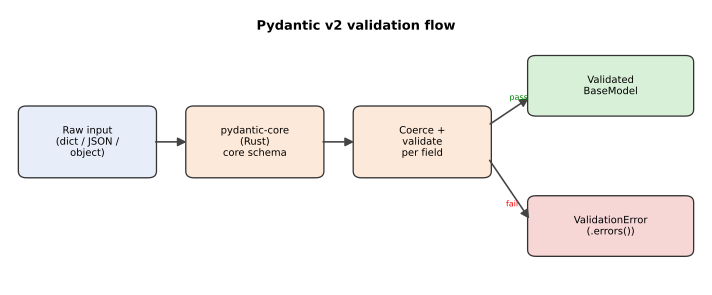

#### Declaring a model

The most common entry point is subclassing `BaseModel` and annotating fields. Annotations supply the type; the optional `Field` adds constraints and metadata; a bare default makes a field optional. Construction validates eagerly, so an invalid keyword argument raises immediately.

```python
from pydantic import BaseModel, Field


class User(BaseModel):
    id: int
    name: str = Field(min_length=1, max_length=50)
    age: int = Field(default=0, ge=0, le=150)
    email: str | None = None


u = User(id="42", name="Ada", age="36")  # strings coerced in lax mode
print(u.id, u.age)  # 42 36  -> both ints
```

#### Parsing untrusted input

For data arriving as a dict or JSON string, use `model_validate` and `model_validate_json` rather than `**kwargs` unpacking — they accept the payload directly and parse JSON in the Rust core without a separate `json.loads`. Both run the full validation pipeline and raise `ValidationError` on bad input.

```python
import json
from pydantic import ValidationError

raw = '{"id": 7, "name": "Lin", "age": 200}'

try:
    user = User.model_validate_json(raw)
except ValidationError as exc:
    print(exc.errors())
    # [{'type': 'less_than_equal', 'loc': ('age',),
    #   'msg': 'Input should be less than or equal to 150', ...}]
```

#### Custom validators

When type plus constraint is not enough, attach a validator. `@field_validator` runs for a named field; `@model_validator(mode="after")` runs once the whole model is built, so it can compare fields against each other. Validators return the (possibly transformed) value or raise `ValueError`, which Pydantic folds into a `ValidationError`.

```python
from pydantic import BaseModel, field_validator, model_validator


class Order(BaseModel):
    quantity: int
    unit_price: float
    discount: float = 0.0

    @field_validator("quantity")
    @classmethod
    def positive_qty(cls, v: int) -> int:
        if v <= 0:
            raise ValueError("quantity must be positive")
        return v

    @model_validator(mode="after")
    def discount_not_above_total(self) -> "Order":
        if self.discount > self.quantity * self.unit_price:
            raise ValueError("discount exceeds order total")
        return self
```

#### Serialization

A validated model goes back out via `model_dump` (to a dict) or `model_dump_json` (to a JSON string). These honor field aliases, exclusion rules, and per-field serializers, and are the v2 successors to v1's `.dict()` and `.json()`.

```python
u = User(id=1, name="Ada")
print(u.model_dump())       # {'id': 1, 'name': 'Ada', 'age': 0, 'email': None}
print(u.model_dump_json())  # '{"id":1,"name":"Ada","age":0,"email":null}'
```

#### Configuration

Model-wide behavior is set with `model_config = ConfigDict(...)`: `strict=True` disables coercion, `frozen=True` makes instances immutable and hashable, and `extra="forbid"` rejects unknown keys instead of silently dropping them.

```python
from pydantic import BaseModel, ConfigDict


class StrictUser(BaseModel):
    model_config = ConfigDict(strict=True, extra="forbid")
    id: int
```

### Real-world example

A JSON HTTP endpoint receives a request body for creating a user account. You want to reject malformed payloads with a precise error report before any business logic touches the data. The model below is the single source of truth for the shape; `model_validate_json` parses and validates in one Rust-side call.

```python
from pydantic import BaseModel, Field, EmailStr, ValidationError


class SignupRequest(BaseModel):
    username: str = Field(min_length=3, max_length=32)
    email: str = Field(pattern=r"^[^@]+@[^@]+\.[^@]+$")
    age: int = Field(ge=13)


payloads = [
    '{"username": "ada", "email": "ada@example.com", "age": 36}',
    '{"username": "x", "email": "not-an-email", "age": 9}',
]

for body in payloads:
    try:
        req = SignupRequest.model_validate_json(body)
        print("OK:", req.model_dump())
    except ValidationError as exc:
        print(f"{len(exc.errors())} error(s):")
        for e in exc.errors():
            print(" ", e["loc"], e["msg"])
```

> [!TIP]
> `EmailStr` and other rich types need the `email-validator` extra (`pip install "pydantic[email]"`). If it is not installed, use a `pattern=` regex on a plain `str` as shown above. Verify the exact extra name against the docs.

### In practice

Pydantic is the validation layer of **FastAPI**: route parameters and request bodies are Pydantic models, and the framework turns a `ValidationError` into a 422 response automatically. Beyond models, `TypeAdapter` validates loose structures, and `@validate_call` validates a function's arguments against its annotations at call time. Settings management lives in the separate `pydantic-settings` package.

```python
from pydantic import TypeAdapter

ta = TypeAdapter(list[int])
print(ta.validate_python(["1", "2", "3"]))  # [1, 2, 3]
```

> [!NOTE]
> v2's Rust core made validation roughly an order of magnitude faster than the pure-Python v1, but exact speedups vary by workload — benchmark your own models rather than quoting a fixed multiple, and verify current numbers against docs.pydantic.dev.

### Pitfalls

The v1-to-v2 migration renamed most of the surface area, so stale tutorials will steer you wrong. Equally common: assuming static type hints already validate at runtime — they do not, which is the entire reason Pydantic exists.

- **`@validator` is gone** — use `@field_validator` (and pair it with `@classmethod`) in v2.
- **`.dict()` / `.json()` are renamed** — they are `model_dump()` / `model_dump_json()` in v2; `parse_obj()` is now `model_validate()`.
- **Lax coercion can surprise you** — `True` may coerce to `1`, `"1"` to `1`. Set `strict=True` (globally or per field via `Field(strict=True)`) when silent coercion is unacceptable.
- **Unknown keys are dropped silently by default** — set `extra="forbid"` to reject them, or `extra="allow"` to keep them.
- **Mutating a field bypasses validation by default** — assignment is not re-validated unless `validate_assignment=True` is set in the config.

> [!WARNING]
> A bare `Field(gt=0)` constraint with no default does **not** make the field optional. Pydantic distinguishes "has a default" from "has constraints"; if you want optionality, give an explicit default such as `Field(default=None)`.

## black

> **TL;DR:** Black is "the uncompromising Python code formatter": opinionated, near-zero-config, and deterministic. You give up control over style so that nobody on the team argues about it — Black reformats your code into one canonical shape, and the only real knob is line length.

### Vocabulary

**Opinionated formatter**

A formatter that imposes one fixed style with almost no options. Black deliberately removes choices so that all Black-formatted code looks the same everywhere.

**AST-safe reformatting**

```math
\text{AST}(\text{input}) = \text{AST}(\text{output})
```

Black guarantees the abstract syntax tree (semantics) is unchanged by reformatting — it only rewrites whitespace, quotes, and line breaks. It even re-parses its own output to verify.

**Stability / idempotence**

Running Black twice yields the same result as running it once: `black(black(x)) == black(x)`. This is a tested invariant.

**Magic trailing comma**

If you put a trailing comma in a collection or call, Black treats it as a signal to *always* explode that construct onto multiple lines, one element per line.

### Intuition

Black trades expressiveness for the elimination of bikeshedding. Instead of a config file with forty knobs, you get one shape, full stop. The payoff is that diffs shrink to *real* changes, code review stops debating whitespace, and any Black-formatted file looks like every other one.

The cost is that you cannot get Black to honor a personal preference — and that is the point.

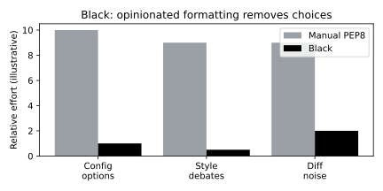

### How it works

Black parses your source into an AST, discards the original formatting, then re-emits the code using its fixed rules: double quotes, a target line length, trailing-comma-driven explosion, and consistent spacing. It then re-parses the output and asserts the AST is unchanged.

#### The (very few) options

The headline option is `--line-length` (default 88, chosen as 10% over the 80-column tradition). Beyond that you have target Python versions (`--target-version`), `--skip-string-normalization`, and `--preview` for upcoming style changes. There is no knob to change indentation or quote style philosophy.

```bash
black --line-length 100 src/        # rare override
black --check --diff src/           # CI gate: non-zero exit if not formatted
```

#### Configuration via pyproject.toml

Black reads `[tool.black]` from the nearest `pyproject.toml`. This is the canonical place for the handful of settings, so the same formatting applies in editors, hooks, and CI.

```toml
[tool.black]
line-length = 88
target-version = ["py311"]
skip-string-normalization = false
```

#### The magic trailing comma

A trailing comma is a deliberate instruction. With it, Black always expands the construct; without it, Black collapses to one line when it fits. This gives you per-call control over the only ambiguous case.

```python
# collapses to one line if it fits
foo(a, b, c)

# magic trailing comma -> always exploded one per line
foo(
    a,
    b,
    c,
)
```

### Real-world example

A team adopts Black on a legacy repo and wires it into pre-commit plus CI so unformatted code can never merge. The first run produces a large one-time diff; thereafter diffs only show semantic changes.

```bash
# One-time reformat of the whole tree
black .

# pre-commit config (.pre-commit-config.yaml)
cat <<'EOF'
repos:
  - repo: https://github.com/psf/black
    rev: 24.10.0
    hooks:
      - id: black
EOF

# CI gate: fail the build if any file is not Black-clean
black --check --diff .
```

### In practice

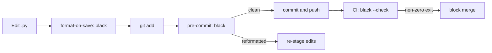

> [!IMPORTANT]
> Use `black --check` (not plain `black`) in CI. `--check` exits non-zero without modifying files when reformatting is needed; plain `black` rewrites and exits zero, which would silently pass.

> [!TIP]
> Black formats but does not sort imports or lint. Pair it with `isort` (configured with `profile = "black"`) and a linter like flake8 — or replace all three with Ruff, whose formatter is Black-compatible by design.

### Pitfalls

- **Expecting configurability** — Black is intentionally rigid. If you need to tune split behavior, you want YAPF, not Black.
- **isort/Black quote and split disagreements** — set isort's `profile = "black"` so the two tools do not fight over import formatting.
- **Running plain `black` in CI** — it edits and passes; always use `--check`.
- **Surprise from the magic trailing comma** — adding or removing a single trailing comma can explode or collapse a whole block. Learn it; it is a feature.

## yapf

> **TL;DR:** YAPF (Yet Another Python Formatter) is Google's configurable code formatter that reflows Python source by solving for the layout that best satisfies a set of weighted style knobs, rather than only fixing PEP 8 violations. Unlike Black it is highly tunable — you pick a base style (`pep8`, `google`, `chromium`, `facebook`) and override dozens of options — which makes it powerful but means teams must agree on a config.

### Vocabulary

**Reformatter**

```math
\text{source AST} \rightarrow \text{annotated tokens} \rightarrow \text{optimal layout}
```

A tool that rewrites the *whitespace and line breaks* of code without changing its meaning. YAPF reparses the token stream and chooses where to split lines.

**Style**

A named bundle of formatting options. YAPF ships `pep8` (default), `google`, `chromium` (now `yapf`), and `facebook`. You name one with `--style` and override individual knobs.

**Knob (style option)**

A single tunable parameter such as `COLUMN_LIMIT`, `SPLIT_BEFORE_LOGICAL_OPERATOR`, or `DEDENT_CLOSING_BRACKETS`. YAPF exposes roughly 40 of them.

**Penalty / split-cost solver**

YAPF models each possible line break as having a numeric penalty and searches for the layout that minimizes total penalty subject to the column limit. This is what distinguishes it from a rule-by-rule fixer.

### Intuition

Think of formatting as an optimization problem, not a checklist. Most linters scan for violations and patch them locally; YAPF instead asks "given these weights, what is the *best-looking* arrangement of this whole statement within the column limit?" and reflows accordingly. The result is that even already-PEP 8-compliant code gets reformatted into YAPF's preferred shape.

Because the weights are exposed as knobs, YAPF sits between hand-formatting and the take-it-or-leave-it opinionation of Black: you steer the aesthetic.

### How it works

YAPF parses your file with `lib2to3`, annotates the token stream with formatting metadata, then runs a solver that decides line splits to minimize penalty under the column limit. The output is then re-emitted as source text.

#### Choosing and layering a style

You start from a base style and override knobs on top of it. The base sets sensible defaults (Google's base, for instance, allows blank lines around top-level definitions differently than PEP 8). You rarely write all 40 knobs by hand.

```bash
yapf --style=google myfile.py            # use Google base in-place preview
yapf --style='{based_on_style: pep8, column_limit: 100}' myfile.py
```

#### Configuration files

For a project, put settings in `.style.yapf`, `setup.cfg` (`[yapf]` section), or `pyproject.toml` (`[tool.yapfignore]` excludes, `[tool.yapf]` style — via the `[style]`-style INI in `.style.yapf` is the canonical form). The `.style.yapf` INI form is the most common and unambiguous.

```toml
# .style.yapf is INI, not TOML; shown here as the canonical config
# [style]
# based_on_style = google
# column_limit = 100
# split_before_logical_operator = true
```

#### Running and applying

By default YAPF prints the reformatted file to stdout (a diff-friendly preview). Pass `-i` to edit in place and `-r` to recurse into directories. Exit code is non-zero under `--diff` when changes are needed, which is how CI gates on it.

```bash
yapf -i -r src/                # rewrite everything under src/
yapf --diff -r src/ && echo OK # CI gate: fails if reformatting needed
```

### Real-world example

A team migrating a Flask service to a 100-column limit with Google-flavored splitting wants CI to fail any PR that is not YAPF-clean. They add a `.style.yapf` and a check step.

```bash
# .style.yapf
cat > .style.yapf <<'EOF'
[style]
based_on_style = google
column_limit = 100
dedent_closing_brackets = true
split_before_logical_operator = true
EOF

# Apply locally
yapf -i -r app/ tests/

# CI gate (non-zero exit if any file would change)
yapf --diff -r app/ tests/
```

Given a long call that exceeds 100 columns, YAPF will choose the split that minimizes its penalty, e.g. breaking after the open paren and dedenting the closing bracket because `dedent_closing_brackets` is on.

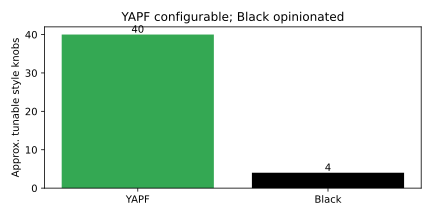

### In practice

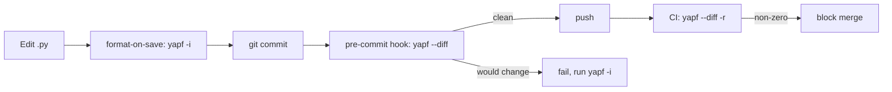

> [!TIP]
> YAPF integrates as a pre-commit hook (`pre-commit-hooks` repo provides a `yapf` hook) and as an editor format-on-save provider. Run the same `--diff` invocation in CI as the hook uses so local and remote verdicts never disagree.

> [!NOTE]
> YAPF and isort are orthogonal: YAPF does not sort imports. Pair it with `isort` if you want import ordering. Many teams now consolidate both jobs into Ruff instead.

### Pitfalls

- **"YAPF only fixes PEP 8 violations"** — wrong. It reflows compliant code too, because it re-solves the whole layout. Expect large initial diffs.
- **Mixing YAPF with another formatter** — running Black and YAPF on the same files produces a fight; pick one. Their split decisions differ.
- **Editing `.style.yapf` as TOML** — it is an INI file with a `[style]` section, not TOML. The `pyproject.toml`-based config exists but the `.style.yapf` INI form is canonical.
- **Forgetting `-i`** — without it YAPF prints to stdout and leaves files untouched, which surprises people expecting in-place edits like Black's default.

## ruff

> **TL;DR:** Ruff is an extremely fast Python linter and formatter written in Rust by Astral. It reimplements hundreds of rules from flake8, isort, pyupgrade, and more, plus a Black-compatible formatter — so a single tool can replace your whole lint/format stack and run 10–100× faster.

### Vocabulary

**Linter**

A tool that flags likely bugs and style issues (unused imports, shadowed names, undefined references) without changing code, unless run with autofix. Ruff's linter is `ruff check`.

**Formatter**

A tool that rewrites whitespace and line breaks into a canonical shape. Ruff's formatter is `ruff format` and is designed to be Black-compatible.

**Rule set / rule code**

Each lint rule has a code like `F401` (unused import) or `E501` (line too long). Codes are grouped by prefix letter (`F` = pyflakes, `E`/`W` = pycodestyle, `I` = isort, `UP` = pyupgrade).

**Autofix**

```math
\text{diagnostic} \xrightarrow{\text{--fix}} \text{rewritten source}
```

For rules with a safe transformation, `ruff check --fix` applies it automatically (e.g. deleting an unused import, sorting imports).

### Intuition

Before Ruff, a Python project typically ran flake8 (with a pile of plugins), isort, pyupgrade, and Black as separate processes, each re-parsing every file. Ruff folds the linting rules of those plugins and its own formatter into one Rust binary that parses each file once and runs everything, which is why it is so fast.

Think of it as "the lint/format stack, collapsed into a single cached, parallel, Rust-speed pass."

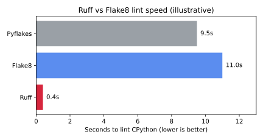

### How it works

Ruff parses Python into its own syntax tree once, runs all enabled lint rules over it, and optionally applies autofixes. The formatter is a separate subcommand that reflows code Black-compatibly. Both are configured from `pyproject.toml` under `[tool.ruff]`.

#### Linting: `ruff check`

`ruff check` runs the enabled rule set and reports diagnostics. You enable rules by their prefix codes in the `select` list and turn off specific ones with `ignore`. Adding `--fix` applies the safe autofixes.

```bash
ruff check .                 # report
ruff check --fix .           # report + autofix safe rules
ruff check --select I --fix  # just sort imports (isort replacement)
```

#### Formatting: `ruff format`

`ruff format` is the Black-compatible formatter. It is a distinct command from `ruff check`; linting and formatting are separate phases. Use `--check` for a non-modifying CI gate.

```bash
ruff format .                # rewrite in place
ruff format --check .        # CI gate: non-zero if not formatted
```

#### Configuration in pyproject.toml

Ruff centralizes config under `[tool.ruff]`, with lint rules under `[tool.ruff.lint]`. The `line-length` is shared by both the linter (`E501`) and the formatter.

```toml
[tool.ruff]
line-length = 88
target-version = "py311"

[tool.ruff.lint]
select = ["E", "F", "I", "UP"]   # pycodestyle, pyflakes, isort, pyupgrade
ignore = ["E501"]                # let the formatter own line length

[tool.ruff.format]
quote-style = "double"
```

### Real-world example

A team rips out flake8, isort, pyupgrade, and Black and replaces all four with Ruff in pre-commit and CI. One config, two commands, and the CI job runs in well under a second instead of tens of seconds.

```bash
# pyproject.toml already configured as above.

# Local: lint with autofix, then format
ruff check --fix .
ruff format .

# CI gate: both must pass without modifying files
ruff check .            # non-zero if lint violations remain
ruff format --check .   # non-zero if formatting needed
```

### In practice

Ruff's two phases compose into a single local-and-CI pipeline. Linting (with autofix) runs first to remove unused imports and sort imports, then the formatter reflows the result.

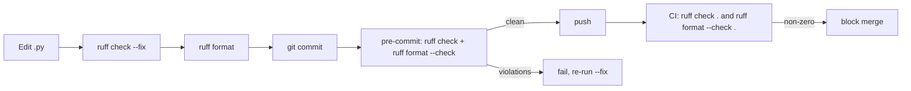

> [!TIP]
> Order matters: run `ruff check --fix` before `ruff format`. Autofix may delete code (unused imports), and the formatter then reflows the smaller result cleanly. Astral's official `ruff-pre-commit` provides both `ruff` (lint) and `ruff-format` hooks.

> [!IMPORTANT]
> In CI use the non-modifying forms: `ruff check .` (no `--fix`) and `ruff format --check .`. They exit non-zero on problems without rewriting files, which is what gates a merge.

### Pitfalls

- **Confusing `ruff check` with `ruff format`** — they are separate. Linting does not reformat, and formatting does not lint. Run both.
- **Letting both the linter and formatter own line length** — pick one. Commonly the formatter owns wrapping and you `ignore = ["E501"]` so the linter does not double-report.
- **Unsafe fixes** — some autofixes are marked unsafe and are not applied by `--fix` alone; review before opting in with `--unsafe-fixes`.
- **Assuming 100% flake8 plugin parity** — Ruff covers a huge swath but not every niche plugin rule. Check the rule registry before dropping a plugin you depend on.

## Sphinx

> **TL;DR:** Sphinx is the de facto documentation generator for Python. You write docs in reStructuredText (or Markdown via MyST), Sphinx pulls API docs straight from your docstrings with autodoc, and it builds HTML, PDF, and more — it is the engine behind the official Python docs and most of Read the Docs.

### Vocabulary

**reStructuredText (reST)**

Sphinx's native markup language (`.rst`). It is richer than Markdown — it has *directives* and *roles* — and is what most legacy Sphinx projects use.

**Directive**

A block-level extension invoked as `.. name::`, such as `.. toctree::` or `.. autoclass::`. Directives are how Sphinx adds structured content beyond plain text.

**Role**

An inline markup extension like `` :py:func:`open` `` that creates a cross-reference or styled span. Roles are the inline counterpart to directives.

**autodoc**

The `sphinx.ext.autodoc` extension that imports your module and pulls docstrings into the docs, so API reference stays in sync with the source.

**toctree**

```math
\text{root index.rst} \rightarrow \text{toctree} \rightarrow \text{child pages}
```

The directive that builds the document hierarchy and the site's navigation tree.

### Intuition

Documentation rots when it lives apart from the code. Sphinx's core idea is to keep prose docs and API reference together: you write narrative pages in reST/MyST and let autodoc harvest the rest from docstrings, so the reference can never drift from the actual signatures. A `conf.py` and a `toctree` then stitch everything into a navigable, multi-format site.

### How it works

Sphinx reads source files from a source directory, parses them into a document tree (doctree), resolves cross-references across the whole project, and then hands the doctree to a *builder* that emits HTML, LaTeX/PDF, ePub, or others. `conf.py` configures the whole pipeline.

#### Project layout and conf.py

A Sphinx project has a source directory containing `conf.py`, a root `index.rst`, and content pages. `conf.py` lists enabled extensions, the theme, and project metadata. You scaffold it with `sphinx-quickstart`.

```python
# conf.py
project = "MyLib"
extensions = [
    "sphinx.ext.autodoc",
    "sphinx.ext.napoleon",   # Google/NumPy-style docstrings
    "myst_parser",           # Markdown support
]
html_theme = "sphinx_rtd_theme"
```

#### Writing content: reST and the toctree

The root `index.rst` declares a `toctree` that lists child documents in order; this drives navigation. Other pages mix prose with directives and roles.

```rst
Welcome to MyLib
================

.. toctree::
   :maxdepth: 2

   installation
   usage
   api
```

#### Pulling API docs with autodoc

An API page uses `automodule`/`autoclass`/`autofunction` directives. autodoc imports the module at build time and renders the docstrings, so signatures and descriptions come straight from the code.

```rst
API Reference
=============

.. automodule:: mylib.core
   :members:
   :undoc-members:
   :show-inheritance:
```

#### Building

`sphinx-build` (or the generated `make html`) runs the chosen builder. The HTML builder writes a static site; the latexpdf builder writes a PDF via LaTeX.

```bash
sphinx-build -b html docs/source docs/build/html
make html        # via the generated Makefile
```

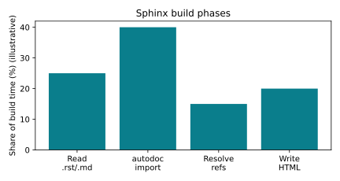

### Real-world example

A library author documents `mylib`, mixing a Markdown tutorial (MyST) with autodoc API pages, and publishes to Read the Docs. Locally they build HTML; RTD runs the same `sphinx-build` on push.

```rst
.. mylib/docs/source/api.rst
API
===

.. autoclass:: mylib.core.Engine
   :members:

.. note::
   ``Engine`` is thread-safe as of v2.0.
```

```bash
# Build locally
pip install sphinx myst-parser sphinx-rtd-theme
sphinx-build -b html docs/source docs/build/html
# Open docs/build/html/index.html

# Build a PDF
sphinx-build -b latex docs/source docs/build/latex && make -C docs/build/latex
```

### In practice

The build is a pipeline: read sources, run autodoc imports, resolve cross-references against the doctree, then write the chosen output format. Read the Docs automates this on every git push.

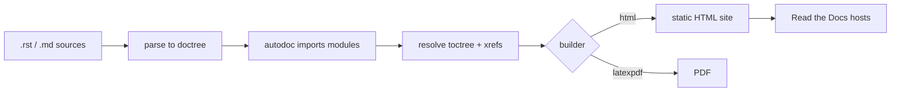

> [!TIP]
> Enable `sphinx.ext.napoleon` so Sphinx understands Google- and NumPy-style docstrings; raw reST in every docstring is painful. Add `myst_parser` if you want to author pages in Markdown instead of reST.

> [!IMPORTANT]
> autodoc *imports* your code to read docstrings, so the build environment must be able to import your package and its dependencies. Missing imports are a common cause of "empty" or failing API pages; mock heavy deps with `autodoc_mock_imports` if needed.

### Pitfalls

- **autodoc can't import the package** — if the env lacks your deps, autodoc produces no output. Install the package (often `pip install -e .`) before building, or mock the imports.
- **Expecting Markdown out of the box** — Sphinx is reST-native; Markdown requires the MyST (`myst_parser`) extension.
- **Pages missing from navigation** — a page not listed in any `toctree` builds but is orphaned and unreachable; Sphinx warns about this.
- **Forgetting the builder flag** — `sphinx-build -b html` vs `-b latexpdf` selects the output; running the wrong builder produces the wrong artifact.

## Sources

- typing module — https://docs.python.org/3/library/typing
- PEP 484 (Type Hints) — https://peps.python.org/pep-0484/
- PEP 526 (Variable Annotations) — https://peps.python.org/pep-0526/
- PEP 544 (Protocols / structural typing) — https://peps.python.org/pep-0544/
- PEP 561 (Distributing and packaging type information) — https://peps.python.org/pep-0561/
- PEP 563 (Postponed evaluation of annotations) — https://peps.python.org/pep-0563/
- PEP 604 (`X | Y` union syntax) — https://peps.python.org/pep-0604/
- PEP 612 (ParamSpec / Concatenate) — https://peps.python.org/pep-0612/
- PEP 695 (Type parameter syntax) — https://peps.python.org/pep-0695/
- mypy documentation — https://mypy.readthedocs.io/
- mypy configuration reference — https://mypy.readthedocs.io/en/stable/config_file.html
- mypy command-line reference — https://mypy.readthedocs.io/en/stable/command_line.html
- pyright documentation — https://microsoft.github.io/pyright/
- pyright configuration reference — https://microsoft.github.io/pyright/#/configuration
- Python typing spec (conformance) — https://typing.python.org/
- Pyre official site and docs — https://pyre-check.org
- Pysa taint-analysis documentation — https://pyre-check.org/docs/pysa-basics/
- Pydantic documentation — https://docs.pydantic.dev/
- Pydantic v2 migration guide — https://docs.pydantic.dev/latest/migration/
- `pydantic-core` (Rust engine) — https://github.com/pydantic/pydantic-core
- Black documentation: https://black.readthedocs.io/
- YAPF repository and docs: https://github.com/google/yapf
- Ruff documentation: https://docs.astral.sh/ruff/
- Sphinx documentation: https://www.sphinx-doc.org/
- PEP 8 — Style Guide for Python Code: https://peps.python.org/pep-0008/

## Related

- [Functions & built-in functions / decorators](./03-advanced-functions.md) — `@field_validator` / `@model_validator` and `timed` are decorators.
- [Packaging & environments](./07-packaging-and-environments.md) — `pyproject.toml`, where most of these tools are configured.
- [File handling & web frameworks](./10-file-handling-and-web-frameworks.md) — FastAPI uses Pydantic as its validation layer.
- [Testing & internals](./11-testing-and-internals.md) — how Python compiles, complementary to static checking.
