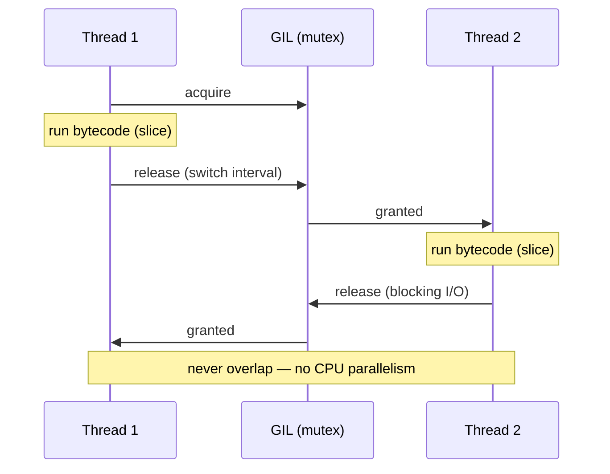
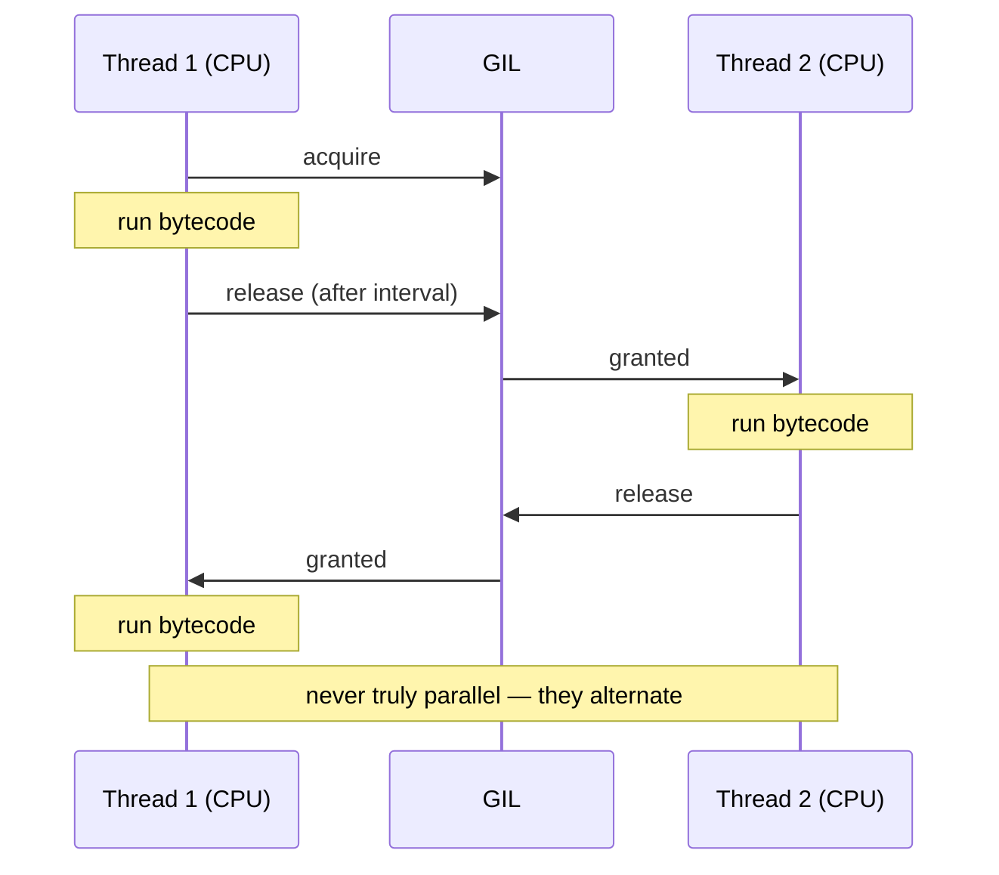
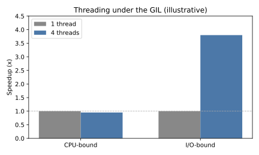
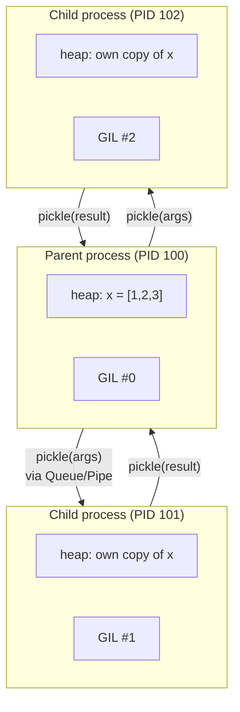
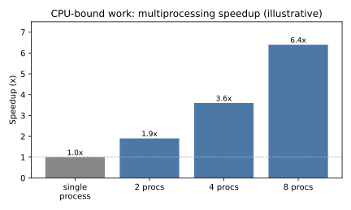
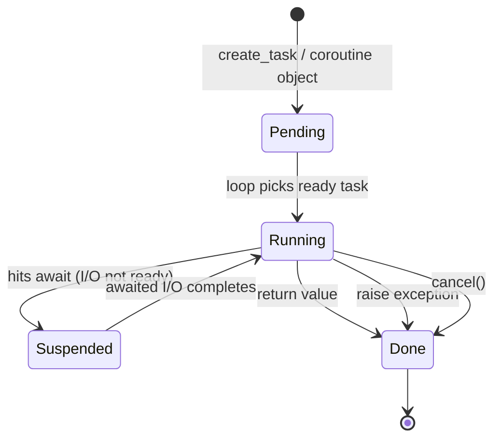
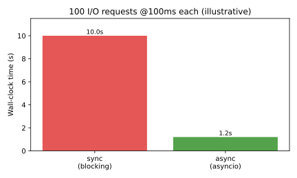

# Python Concurrency & Parallelism

[toc]

> **TL;DR:** CPython's GIL lets only one thread run bytecode at a time, so threads buy concurrency for I/O-bound work but no CPU parallelism — use `multiprocessing` (one GIL per process) for that. `asyncio` adds single-threaded cooperative concurrency that scales I/O fan-out to thousands of tasks. Pick the model by workload: I/O-bound → threads/async, CPU-bound → processes.

## GIL

> **TL;DR:** The Global Interpreter Lock (GIL) is a mutex in CPython that lets only one thread execute Python bytecode at a time, so threads give you *no* CPU parallelism for CPU-bound work — use `multiprocessing` for that. Threads still help I/O-bound workloads because the GIL is released during blocking system calls. CPython 3.13+ ships an experimental free-threaded build (PEP 703) that can disable the GIL.

### Vocabulary

**Global Interpreter Lock (GIL)**

```math
\text{GIL} : \text{at most one OS thread executes Python bytecode at any instant}
```

A single process-wide mutex in CPython. A thread must hold it to run interpreter bytecode, and releases it on blocking I/O, on certain C extension calls, or after a periodic switch interval.

**Reference counting**

```math
\text{refcount}(obj) \in \mathbb{Z}_{\ge 0}
```

CPython's primary memory-management scheme: every object carries a counter of live references; the object is freed when it hits zero. Incrementing and decrementing this counter must be atomic, which is the historical reason the GIL exists.

**Switch interval**

The wall-clock period (default 5 ms, `sys.getswitchinterval()`) after which a running thread is asked to drop the GIL so another thread can run.

**CPU-bound vs I/O-bound** — work limited by raw computation (tight numeric loops) versus work limited by waiting on the network, disk, or kernel.

**Free-threaded CPython** — an experimental build (PEP 703, 3.13+) compiled with `--disable-gil`, invoked as `python3.13t`, where the GIL is removed and reference counting is made thread-safe by other means.

### Intuition

Think of the interpreter as a single microphone in a room full of speakers: many threads exist, but only the one holding the microphone (the GIL) may speak Python bytecode. Handing the microphone around is cheap, so threads *interleave* smoothly — but no two ever speak at once, so adding cores does nothing for pure-Python computation. The trick is that a thread waiting on the network puts the microphone down while it waits, which is exactly why I/O-bound concurrency works.

### How it works

The GIL is acquired by the interpreter's evaluation loop and held across bytecode execution. It is released cooperatively in two situations: voluntarily around blocking calls, and forcibly when the switch interval elapses. The sections below trace acquisition, release, and the consequence for the two workload classes.

#### Why the GIL exists: reference counting

Every CPython object mutates a shared `ob_refcnt` field on assignment and deletion. Without a lock, two threads incrementing the same counter concurrently would race and corrupt memory or leak objects. The GIL makes the whole bytecode step atomic, so refcount updates are implicitly serialized — a simple, fast design for single-threaded code at the cost of multi-core scaling.

```python
import sys

x = []
print(sys.getrefcount(x))  # one extra ref from the argument itself
y = x
print(sys.getrefcount(x))  # incremented; this update must be race-free
```

#### Releasing on I/O and the switch interval

A thread drops the GIL before a blocking system call (socket read, `time.sleep`, file I/O) and reacquires it on return, letting other threads run meanwhile. For long-running pure-Python loops that never block, the interpreter forces a release every switch interval so threads still interleave fairly.

```python
import sys

sys.setswitchinterval(0.005)        # default 5 ms
print(sys.getswitchinterval())       # 0.005
```

#### The CPU-bound penalty

Because only one thread runs bytecode at a time, two CPU-bound threads on two cores finish no faster than one thread — they merely take turns. The fix is to run separate *processes*, each with its own interpreter and its own GIL, which is what `multiprocessing` does.

```python
# CPU-bound: threads do NOT speed this up; processes do.
def count(n):
    while n > 0:
        n -= 1
```

The serialization is visible as a timeline: threads hold the GIL in alternating slices rather than overlapping.



#### Amdahl's law and the GIL

Even with real parallelism (processes), the serial fraction caps your speedup. Amdahl's law bounds the speedup of a program with parallel fraction p run on N workers; the GIL effectively forces p≈0 for pure-Python threads, which is why their curve is flat at 1.

```math
S(N) = \frac{1}{(1 - p) + \dfrac{p}{N}}
```


### Real-world example

A common benchmark: sum-of-primes across a worker pool. The same workload run with threads versus processes shows the GIL's effect directly — threads stay near single-core throughput while processes scale with cores.

```python
import time
from concurrent.futures import ThreadPoolExecutor, ProcessPoolExecutor


def cpu_work(n: int) -> int:
    total = 0
    for i in range(n):
        total += i * i
    return total


def bench(executor_cls, workers: int, tasks: int) -> float:
    start = time.perf_counter()
    with executor_cls(max_workers=workers) as ex:
        list(ex.map(cpu_work, [5_000_000] * tasks))
    return time.perf_counter() - start


if __name__ == "__main__":
    threaded = bench(ThreadPoolExecutor, 4, 4)
    procs = bench(ProcessPoolExecutor, 4, 4)
    print(f"threads: {threaded:.2f}s")   # ~ same as serial: GIL serializes
    print(f"procs:   {procs:.2f}s")      # ~ 4x faster: one GIL per process
```

### In practice

> [!IMPORTANT]
> The GIL only serializes *Python bytecode*. NumPy, pandas, and most heavy C extensions release the GIL inside their compute kernels, so threading often does scale for numeric workloads even on the standard build.

> [!TIP]
> Decision rule: CPU-bound pure Python → `multiprocessing` / `ProcessPoolExecutor`. I/O-bound → `threading`, `ThreadPoolExecutor`, or `asyncio`. Numeric heavy lifting in C extensions → threads can work because the kernel drops the GIL.

> [!NOTE]
> Free-threaded CPython (PEP 703) makes the GIL optional. The build is invoked as `python3.13t`, reports `sys._is_gil_enabled()`, and trades some single-threaded overhead for true multi-core threading. It is **experimental** in 3.13–3.14; many C extensions are not yet thread-safe under it.

### Pitfalls

- **"Threads make my CPU loop faster"** — wrong on the default build; they interleave on one core. Use processes.
- **"The GIL is in the language spec"** — wrong; it is a CPython implementation detail. Jython and IronPython have no GIL; PyPy and free-threaded CPython differ.
- **"Releasing the GIL is something I do in Python"** — you cannot from pure Python; only C extensions (via `Py_BEGIN_ALLOW_THREADS`) and blocking calls release it.
- **"Free-threaded build is a drop-in win today"** — it is experimental, may be slower single-threaded, and requires GIL-safe extensions.
- **Assuming fairness** — the switch interval gives rough fairness, not real-time guarantees; a thread can starve under contention.

## Threading

> **TL;DR:** `threading` runs multiple threads inside one process sharing one address space, but CPython's GIL lets only one thread execute Python bytecode at a time. So threads give **concurrency for I/O-bound** work (the GIL is released during blocking I/O) but **no speedup for CPU-bound** work — use [Multiprocessing](#multiprocessing) for that.

### Vocabulary

- **Thread** — a lightweight execution context within a process; all threads share the same heap and globals.
- **GIL (Global Interpreter Lock)** — the mutex serializing bytecode execution per interpreter. See [GIL](#gil).
- **Race condition** — a bug where the result depends on the unpredictable interleaving of threads accessing shared state.
- **Lock / RLock** — mutual-exclusion primitives; `RLock` is re-entrant (the holding thread can acquire it again).
- **Event** — a simple flag threads can wait on and set, for one-shot signaling.
- **Thread-safe queue** — `queue.Queue`, the canonical producer/consumer channel with internal locking.

### Intuition

Threads are roommates sharing one apartment: cheap to add, and they see each other's stuff instantly (shared memory). That sharing is the double edge — no pickling needed, but two roommates editing the same list at once corrupts it (a race). The GIL is a single talking-stick: only the roommate holding it may run Python code, so they take turns rather than truly working in parallel.

The practical consequence: threads excel when most of their time is spent *waiting* (network, disk), because a waiting thread drops the talking-stick for others. They do nothing for raw computation, where every thread wants the stick simultaneously.

### How it works

A `Thread` wraps a target callable; `.start()` runs it concurrently and `.join()` waits for it. Because threads share memory, any mutation of shared data must be guarded by a lock, and any hand-off of data should go through a thread-safe `queue.Queue`. The GIL is acquired around bytecode execution and released around blocking I/O and some C extensions.

#### Creating and joining threads

The lowest-level API constructs `Thread` objects directly. This is fine for a handful of long-lived threads; for pools of short tasks, prefer the executor (below).

```python
import threading

def worker(n: int) -> None:
    print(f"thread {threading.current_thread().name} got {n}")

threads = [threading.Thread(target=worker, args=(i,)) for i in range(3)]
for t in threads:
    t.start()
for t in threads:
    t.join()
```

#### Protecting shared state with locks

Shared mutable state is the source of race conditions: `counter += 1` is read-modify-write, and two threads can interleave and lose an update. A `Lock` serializes the critical section so only one thread mutates at a time. Use it as a context manager so it is always released.

```python
import threading

counter = 0
lock = threading.Lock()

def increment(times: int) -> None:
    global counter
    for _ in range(times):
        with lock:              # critical section
            counter += 1

ts = [threading.Thread(target=increment, args=(100_000,)) for _ in range(4)]
for t in ts: t.start()
for t in ts: t.join()
print(counter)                  # exactly 400000 with the lock
```

#### Producer/consumer with Queue

`queue.Queue` is the idiomatic way to move work between threads without writing your own locking — it is internally synchronized. Producers `put` items; consumers `get` them and call `task_done`; `join` waits for the queue to drain.

```python
import queue
import threading

q: "queue.Queue[int]" = queue.Queue()

def consumer() -> None:
    while True:
        item = q.get()
        if item is None:        # sentinel to stop
            q.task_done(); break
        # ... process item ...
        q.task_done()

t = threading.Thread(target=consumer); t.start()
for i in range(10):
    q.put(i)
q.put(None)
q.join(); t.join()
```

#### Thread pools

`concurrent.futures.ThreadPoolExecutor` manages a reusable pool and returns `Future`s — the high-level interface you should reach for first. It shines on I/O-bound fan-out like many HTTP requests, where threads overlap their waiting time.

```python
from concurrent.futures import ThreadPoolExecutor
import urllib.request

def head(url: str) -> int:
    with urllib.request.urlopen(url) as r:   # GIL released during I/O
        return r.status

urls = ["https://example.com"] * 8
with ThreadPoolExecutor(max_workers=8) as ex:
    print(list(ex.map(head, urls)))
```

#### The GIL serialization timeline

The reason CPU-bound threads do not speed up is that the GIL forces them to take turns executing bytecode. The sequence below shows two CPU-bound threads serializing on the GIL — while one runs, the other waits, so total work is unchanged.



### Real-world example

You need to download status codes from many URLs. With one thread, requests run back-to-back and total latency is the sum. With a `ThreadPoolExecutor`, the threads overlap their network waits — the GIL is released during each blocking read — and wall-time collapses. The snippet below simulates the network with `time.sleep` so it is runnable offline.

```python
import time
from concurrent.futures import ThreadPoolExecutor

def io_task(i: int) -> int:
    time.sleep(0.1)             # stand-in for a blocking network call
    return i

def serial(n: int) -> float:
    t = time.perf_counter()
    list(map(io_task, range(n)))
    return time.perf_counter() - t

def threaded(n: int, workers: int) -> float:
    t = time.perf_counter()
    with ThreadPoolExecutor(max_workers=workers) as ex:
        list(ex.map(io_task, range(n)))
    return time.perf_counter() - t

if __name__ == "__main__":
    n = 40
    print(f"serial:   {serial(n):.2f}s")
    print(f"threaded: {threaded(n, 10):.2f}s")
```

The contrast between CPU-bound and I/O-bound threading captures the whole story — threads help the latter, not the former (illustrative numbers):



### In practice

> [!IMPORTANT]
> For CPU-bound work, threading delivers near-zero speedup (sometimes a slowdown from lock contention) because of the GIL. Move CPU work to processes. Free-threaded CPython (PEP 703, experimental in 3.13+) lifts this restriction — see [GIL](#gil).

Production guidance:

- **Pick by workload.** I/O-bound and moderate fan-out → threads. Massive fan-out (10k+ connections) → [Asynchrony](#asynchrony). CPU-bound → [Multiprocessing](#multiprocessing).
- **Prefer the executor.** `ThreadPoolExecutor` over hand-rolled `Thread` lists for anything pool-shaped.
- **Guard every shared mutation.** If two threads can touch the same object and at least one writes, you need a lock or a queue.
- **Avoid lock nesting.** Acquiring two locks in inconsistent orders across threads causes deadlock; use `RLock` only when re-entrancy is genuinely needed.

> [!TIP]
> Use `queue.Queue` instead of manual locks for producer/consumer designs — it encapsulates the synchronization and is far harder to get wrong.

### Pitfalls

- **Assuming threads parallelize CPU work** — the GIL prevents it; benchmark before believing a speedup.
- **Unguarded shared state** — `counter += 1` across threads silently loses updates; the bug is intermittent and load-dependent.
- **Deadlock from lock-order inversion** — thread A holds L1 wants L2 while B holds L2 wants L1; both hang forever.
- **Daemon threads dying abruptly** — daemon threads are killed at interpreter exit without cleanup; don't use them for work that must finish.
- **Catching exceptions inside threads** — an unhandled exception in a thread does not crash the main thread; you must surface it (e.g. via `Future.result()`).

## Multiprocessing

> **TL;DR:** `multiprocessing` runs Python code in separate OS processes, each with its own interpreter and its own GIL, so CPU-bound work achieves *true* parallelism across cores. The cost is that processes do not share memory by default — data crosses process boundaries by pickling, which makes communication and startup more expensive than threads.

### Vocabulary

- **Process** — an OS-level execution context with its own private virtual address space. Two processes cannot read each other's variables directly.
- **GIL (Global Interpreter Lock)** — a per-interpreter mutex that serializes Python bytecode. Each process has its *own* GIL, which is why multiprocessing sidesteps the single-GIL bottleneck. See [GIL](#gil).
- **Pool** — a managed group of worker processes that pull tasks from a queue (`Pool`, or `concurrent.futures.ProcessPoolExecutor`).
- **Pickling** — serialization of a Python object to a byte stream so it can cross a process boundary. Arguments and return values are pickled.
- **Start method** — how a child process is created: `fork`, `spawn`, or `forkserver`.
- **Speedup** — ratio of serial wall-time to parallel wall-time. Bounded by Amdahl's law:

```math
S(N) = \frac{1}{(1 - p) + \frac{p}{N}}
```

where `p` is the parallelizable fraction and `N` is the number of processes.

### Intuition

Threads share one apartment; multiprocessing gives each worker its own apartment. Because nothing is shared, no thread can corrupt another's state by accident, and each worker runs flat-out on its own CPU core. The downside is that passing furniture between apartments (data between processes) means packing it up (pickling), shipping it, and unpacking it.

The decision rule is simple: if the work is **CPU-bound** (number crunching, parsing, compression, ML feature engineering), reach for multiprocessing. If it is **I/O-bound** (network, disk, DB), threads or async are lighter. See [Threading](#threading) and [Asynchrony](#asynchrony).

### How it works

The `multiprocessing` module mirrors the `threading` API but swaps threads for processes. You create `Process` objects, start them, and join them; for bulk work you hand a `Pool` a function and an iterable. Because each child is a fresh interpreter, communication happens through explicit channels — `Queue`, `Pipe`, or shared-memory primitives.

#### Spawning processes

A `Process` wraps a target callable and its arguments. Calling `.start()` launches the child; `.join()` blocks until it exits. Always guard the entry point with `if __name__ == "__main__":` because the `spawn` start method re-imports your module in the child.

```python
from multiprocessing import Process
import os

def worker(name: str) -> None:
    print(f"{name} in PID {os.getpid()}")

if __name__ == "__main__":
    procs = [Process(target=worker, args=(f"w{i}",)) for i in range(4)]
    for p in procs:
        p.start()
    for p in procs:
        p.join()
```

#### Pools and the executor API

A `Pool` amortizes the cost of process creation by reusing workers across many tasks. The modern, more composable interface is `concurrent.futures.ProcessPoolExecutor`, which returns `Future` objects and integrates with `as_completed`. Map-style APIs chunk the iterable and dispatch chunks to workers.

```python
from concurrent.futures import ProcessPoolExecutor

def heavy(n: int) -> int:
    return sum(i * i for i in range(n))  # CPU-bound

if __name__ == "__main__":
    work = [10_000_00] * 8
    with ProcessPoolExecutor(max_workers=4) as ex:
        results = list(ex.map(heavy, work))
    print(results[0])
```

#### Inter-process communication

Since address spaces are separate, you exchange data with `Queue` (many-producer/many-consumer, pickled) or `Pipe` (a fast two-endpoint connection). For large numeric arrays, copying through a queue is wasteful, so `shared_memory.SharedMemory` exposes a raw buffer that multiple processes map without serialization.

```python
from multiprocessing import shared_memory
import numpy as np

if __name__ == "__main__":
    arr = np.arange(1_000_000, dtype=np.int64)
    shm = shared_memory.SharedMemory(create=True, size=arr.nbytes)
    buf = np.ndarray(arr.shape, dtype=arr.dtype, buffer=shm.buf)
    buf[:] = arr[:]          # one copy, then zero-copy reads in children
    # ... pass shm.name to child processes, they attach by name ...
    shm.close()
    shm.unlink()
```

#### Start methods: fork vs spawn

`fork` (POSIX default historically) clones the parent process image — fast, but the child inherits locks, threads, and file descriptors in whatever state they were in, which is a frequent deadlock source. `spawn` starts a clean interpreter and re-imports your module — slower and pickles the target, but safe and the default on macOS and Windows. As of Python 3.14, `spawn` is the default on Linux too.

```python
import multiprocessing as mp

if __name__ == "__main__":
    ctx = mp.get_context("spawn")   # explicit, portable, safe
    p = ctx.Process(target=lambda: None)
    p.start(); p.join()
```

This separate-address-space model is the core mental picture:



### Real-world example

Suppose you need to compute SHA-256 digests for thousands of files — a CPU-bound hashing loop. A single process saturates one core; a `ProcessPoolExecutor` spreads the hashing across all cores. The snippet below is fully runnable and prints a representative speedup.

```python
import hashlib
import time
from concurrent.futures import ProcessPoolExecutor

def digest(payload: bytes) -> str:
    # Simulate CPU-bound hashing of a large blob.
    h = hashlib.sha256()
    for _ in range(200):
        h.update(payload)
    return h.hexdigest()

def run(executor_cls, workers, blobs):
    start = time.perf_counter()
    if executor_cls is None:
        list(map(digest, blobs))
    else:
        with executor_cls(max_workers=workers) as ex:
            list(ex.map(digest, blobs))
    return time.perf_counter() - start

if __name__ == "__main__":
    blobs = [b"x" * 1_000_000 for _ in range(16)]
    serial = run(None, 1, blobs)
    parallel = run(ProcessPoolExecutor, 4, blobs)
    print(f"serial:   {serial:.2f}s")
    print(f"parallel: {parallel:.2f}s  ({serial / parallel:.1f}x)")
```

The measured speedup tracks core count until pickling and scheduling overhead dominate, as sketched below (illustrative numbers, not a benchmark of your machine):



### In practice

> [!TIP]
> For numeric workloads, keep data in NumPy arrays and pass them through `shared_memory` or memory-mapped files rather than pickling them through a `Queue`. Pickling a 1 GB array per task can erase all parallel gains.

> [!IMPORTANT]
> Every argument and return value crosses the process boundary by pickling. Closures, lambdas, open sockets, and database connections are **not** picklable. Pass plain data and reconstruct heavy resources inside the worker.

Real production tradeoffs:

- **Startup cost.** `spawn` re-imports your module per worker; a `Pool` reuses workers so you pay it once. Prefer pools for many small tasks.
- **`max_workers`.** A good default is `os.cpu_count()` for CPU-bound work; oversubscribing thrashes the scheduler.
- **`chunksize`.** With `Pool.map` / `executor.map`, a larger `chunksize` reduces IPC round-trips for fine-grained tasks.
- **Cleanup.** Always `.close()` and `.unlink()` shared-memory blocks, or they leak until reboot.

### Pitfalls

- **Forgetting `if __name__ == "__main__":`** — under `spawn`, the child re-imports the module; without the guard it re-runs your launch code and forks bombs.
- **Assuming shared globals propagate** — a global mutated in the parent after fork is *not* seen by children, and is never seen at all under `spawn`. Pass state explicitly.
- **Pickling errors at dispatch** — `Can't pickle <lambda>` means your target or its closure is not top-level. Move it to module scope.
- **Using multiprocessing for I/O-bound work** — the per-process overhead is wasted; use [Threading](#threading) or [Asynchrony](#asynchrony).
- **Leaking semaphores / shared memory** — visible as `resource_tracker` warnings on exit; always unlink.

## Asynchrony

> **TL;DR:** `asyncio` is single-threaded *cooperative* concurrency: one event loop interleaves many coroutines, switching between them only at `await` points where they voluntarily yield while waiting on I/O. It gives massive concurrency for I/O-bound work without threads or processes, but a coroutine that blocks the loop (or runs CPU-bound code) stalls everything.

### Vocabulary

- **Coroutine** — a function defined with `async def`; calling it returns a coroutine object that does nothing until awaited or scheduled.
- **Event loop** — the scheduler that runs ready coroutines, registers I/O waiters, and resumes them when their I/O completes.
- **Awaitable** — anything usable with `await`: coroutines, `Task`s, and `Future`s.
- **`await`** — suspends the current coroutine until the awaitable completes, handing control back to the loop.
- **Task** — a coroutine wrapped for concurrent execution and scheduled on the loop (`asyncio.create_task`).
- **Cooperative scheduling** — control switches only at explicit suspension points, never preemptively. Contrast with [Threading](#threading), where the OS can preempt anywhere.

### Intuition

Picture a single chef (one thread) managing ten pots. The chef does not stand staring at one boiling pot; they start pot 1, and while it simmers they move to pot 2, then pot 3. Each `await` is the chef saying "this pot needs time — what else is ready?" The loop is the chef's attention, and it is never blocked as long as every coroutine yields at its waits.

This is why async wins for I/O-bound workloads: while one request waits on the network (idle CPU), thousands of others make progress on the same thread. It does **nothing** for CPU-bound work — there is only one thread, so heavy computation must move to [Multiprocessing](#multiprocessing).

### How it works

`async/await` (PEP 492) turns a function into a state machine that can pause and resume. The event loop drives these state machines: it runs a coroutine until it hits an `await` on something not yet ready, parks it, and runs the next ready one. When the OS signals that an awaited socket is readable, the loop resumes the parked coroutine where it left off.

#### Coroutines and the entry point

A coroutine object is inert until the loop runs it. `asyncio.run(main())` creates a loop, runs the top-level coroutine to completion, and tears the loop down. Inside, `await` drives sub-coroutines sequentially unless you explicitly schedule them concurrently.

```python
import asyncio

async def greet(name: str) -> str:
    await asyncio.sleep(0.1)        # non-blocking yield to the loop
    return f"hello {name}"

async def main() -> None:
    msg = await greet("world")      # runs one at a time here
    print(msg)

asyncio.run(main())
```

#### Running coroutines concurrently

`await`-ing coroutines one by one is still sequential. To overlap their waits you create `Task`s (which schedule immediately) or use `asyncio.gather`, which awaits many awaitables concurrently and collects their results in order. This is where the concurrency actually appears.

```python
import asyncio

async def fetch(i: int) -> int:
    await asyncio.sleep(1)          # pretend this is a network call
    return i * i

async def main() -> None:
    # All ten "sleep" together: total ≈ 1s, not 10s.
    results = await asyncio.gather(*(fetch(i) for i in range(10)))
    print(results)

asyncio.run(main())
```

#### The coroutine lifecycle

A coroutine moves through a small state machine as the loop drives it. It begins **pending** (created but not started), becomes **running** when the loop executes it, goes **suspended** at each `await` on an incomplete awaitable, and finally reaches **done** (returned, raised, or cancelled). The loop alternates between running and suspended states across many coroutines.



#### Modern structured concurrency

Since Python 3.11, `asyncio.TaskGroup` provides structured concurrency: all child tasks are awaited together, and if one fails the group cancels the rest and propagates the error. It is the recommended replacement for ad-hoc `gather` + manual cancellation.

```python
import asyncio

async def work(i: int) -> int:
    await asyncio.sleep(0.1)
    return i

async def main() -> None:
    async with asyncio.TaskGroup() as tg:
        t1 = tg.create_task(work(1))
        t2 = tg.create_task(work(2))
    print(t1.result(), t2.result())   # both guaranteed complete here

asyncio.run(main())
```

### Real-world example

Consider hitting 100 HTTP endpoints, each taking ~100 ms. Done serially the wall-time is ~10 s; done concurrently with `asyncio.gather` it collapses to roughly the single-request latency. The runnable snippet simulates the I/O with `asyncio.sleep` so it needs no network.

```python
import asyncio
import time

async def request(endpoint: int) -> int:
    await asyncio.sleep(0.1)         # stand-in for a 100ms network round-trip
    return endpoint

async def serial(n: int) -> None:
    for i in range(n):
        await request(i)

async def concurrent(n: int) -> None:
    await asyncio.gather(*(request(i) for i in range(n)))

async def main() -> None:
    n = 100
    t0 = time.perf_counter(); await serial(n)
    t1 = time.perf_counter(); await concurrent(n)
    t2 = time.perf_counter()
    print(f"serial:     {t1 - t0:.2f}s")
    print(f"concurrent: {t2 - t1:.2f}s")

asyncio.run(main())
```

The wall-clock contrast for the I/O-bound case is dramatic (illustrative numbers):



### In practice

> [!WARNING]
> Calling a **blocking** function (e.g. `time.sleep`, `requests.get`, a synchronous DB driver) inside a coroutine freezes the entire event loop — every other task stops. Use async-native libraries (`aiohttp`, `asyncpg`) or offload to a thread with `asyncio.to_thread`.

Production realities:

- **Async is contagious.** Once a call path is `async`, callers must `await`, all the way up to `asyncio.run`. Mixing sync and async needs bridges (`run_in_executor`, `to_thread`).
- **CPU-bound code is a trap.** A tight numeric loop in a coroutine starves the loop; push it to a `ProcessPoolExecutor` via `loop.run_in_executor`. See [Multiprocessing](#multiprocessing).
- **Web frameworks.** [FastAPI](./10-file-handling-and-web-frameworks.md) and HTTP clients like [aiohttp](./10-file-handling-and-web-frameworks.md) are built on this model — one process handles thousands of concurrent connections.
- **Cancellation is cooperative too.** `task.cancel()` raises `CancelledError` at the next `await`; always clean up in `finally` blocks.

> [!TIP]
> To run blocking code without rewriting it, wrap it: `await asyncio.to_thread(blocking_fn, arg)`. The loop offloads it to a thread-pool worker and stays responsive.

### Pitfalls

- **Forgetting to `await`** — `request(5)` without `await` creates a coroutine that never runs and emits a "coroutine was never awaited" warning.
- **`await`-ing in a loop instead of gathering** — turns concurrent work back into sequential work; use `gather` or a `TaskGroup`.
- **Blocking the loop** — the single most common async bug; any synchronous I/O or heavy CPU call stalls all tasks.
- **Swallowing exceptions in fire-and-forget tasks** — a `create_task` whose result you never await can fail silently; prefer `TaskGroup`.
- **Thinking async is parallel** — it is concurrent on *one* thread. For true parallelism you still need processes.

## Sources

- Python docs — threading and the GIL: <https://docs.python.org/3/library/threading.html>
- Python docs — `sys.setswitchinterval`: <https://docs.python.org/3/library/sys.html#sys.setswitchinterval>
- PEP 703 — Making the Global Interpreter Lock Optional in CPython: <https://peps.python.org/pep-0703/>
- Python C-API — releasing the GIL: <https://docs.python.org/3/c-api/init.html#thread-state-and-the-global-interpreter-lock>
- Python docs — `queue`: <https://docs.python.org/3/library/queue.html>
- Python docs — `concurrent.futures`: <https://docs.python.org/3/library/concurrent.futures.html>
- Python docs — `multiprocessing`: <https://docs.python.org/3/library/multiprocessing.html>
- Python docs — `multiprocessing.shared_memory`: <https://docs.python.org/3/library/multiprocessing.shared_memory.html>
- Python docs — `asyncio`: <https://docs.python.org/3/library/asyncio.html>
- PEP 492 — Coroutines with async and await syntax: <https://peps.python.org/pep-0492/>
- Python docs — `asyncio.TaskGroup`: <https://docs.python.org/3/library/asyncio-task.html#task-groups>

## Related

- [Data Structures and Algorithms](./06-data-structures-and-algorithms.md)
- [File Handling and Web Frameworks](./10-file-handling-and-web-frameworks.md)
- [Testing and Internals](./11-testing-and-internals.md)
