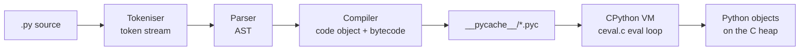
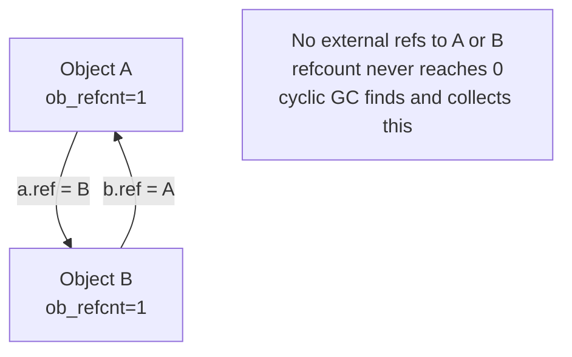
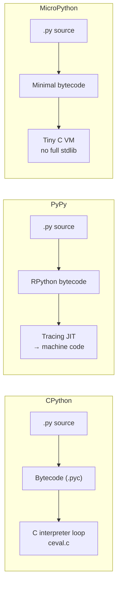

# 1 - What is Python

[toc]

> **TL;DR:** Python is a dynamically-typed, garbage-collected, interpreted language whose central design philosophy is that code should read like prose and that "everything is an object." CPython — the reference implementation written in C — compiles source to bytecode, executes that bytecode in a virtual machine, and manages memory via reference counting augmented by a cyclic-garbage collector. Understanding this execution model is the prerequisite for every performance, concurrency, and packaging decision in the rest of the series.

## Vocabulary

**CPython**: The canonical reference implementation of Python, written in C. When someone says "Python," they almost always mean CPython. Compiled to a `.pyc` bytecode file, executed by the CPython virtual machine (ceval.c).

```python
import sys
print(sys.implementation.name)  # >>> 'cpython'
```

---

**Bytecode**: The platform-independent, stack-based instruction set that CPython's compiler emits. Stored in `__pycache__/*.pyc` files. Not machine code — it is interpreted by the CPython VM loop in `ceval.c`.

---

**REPL**: Read–Eval–Print Loop. The interactive interpreter (`python3`) that reads one expression, evaluates it, prints the result, and repeats. The fastest feedback loop for exploring language behaviour.

---

**Reference count** (`ob_refcnt`): Every CPython object carries an integer count of how many references point to it. When the count drops to zero, the object is immediately deallocated. The primary memory-management mechanism.

---

**Cyclic GC**: A supplemental garbage collector (module `gc`) that finds and collects reference cycles — groups of objects that point at each other with no external references, so `ob_refcnt` never reaches zero.

---

**PyPy**: An alternative Python implementation with a tracing JIT compiler. Typically 3–10× faster than CPython on pure-Python benchmarks. Cannot use CPython C extensions (like NumPy) without compatibility shims.

---

**MicroPython**: A lean Python 3 implementation targeting microcontrollers (ESP32, RP2040). Shares the language but omits most of the standard library and garbage collection is simplified.

---

**GIL (Global Interpreter Lock)**: A mutex in CPython that allows only one thread to execute Python bytecode at a time. Covered in depth in [8 - The GIL, Threads, Multiprocessing](./8-the-gil-threads-multiprocessing.md).

---

**`__pycache__`**: The directory Python creates beside your `.py` files to cache compiled `.pyc` bytecode. The filename encodes the Python version and a hash of the source, e.g. `foo.cpython-312.pyc`.

---

**Data model**: Python's contract between user-defined classes and the interpreter. Classes opt into language features (iteration, arithmetic, context management) by implementing dunder (double-underscore) methods. Covered fully in [2 - The Data Model — Objects, References, Identity](./2-the-data-model-objects-references-identity.md).

---

**PEP**: Python Enhancement Proposal. The formal RFC-equivalent for Python language and ecosystem changes. PEP 8 is the style guide; PEP 20 is "The Zen of Python"; PEP 484 introduced type hints.

---

## Intuition

Think of Python as a thin, expressive shell over C. When you write `x = [1, 2, 3]`, CPython allocates a `PyListObject` on the C heap, sets `ob_refcnt = 1`, and stores the name `x` in the current namespace dictionary. When you write `x.append(4)`, it calls `list_append` in `listobject.c`. The Python syntax is ergonomic; the actual work happens in C. This is why Python can be both "slow" (interpreter overhead per bytecode instruction) and "fast in practice" (NumPy's inner loops are BLAS C/Fortran, bypassing the interpreter).

The "everything is an object" philosophy means there are no primitives in the Java/C sense. The integer `42`, the function `len`, the class `str`, the module `os` — all are objects with identity, type, and value. This uniformity is what makes Python's runtime model so composable: you can pass a class to a function, store a function in a list, dynamically add methods to an object. The cost is indirection: every attribute lookup traverses a chain of dictionaries.

## History and the Interpreter Model

Python was created by Guido van Rossum and first released in 1991. Python 2 and Python 3 coexisted for over a decade; Python 2 reached end-of-life on 2020-01-01. The series assumes Python 3.11+ throughout.

### The Compilation and Execution Pipeline

When you run `python3 script.py`, CPython performs these steps:

1. **Tokenise** — the lexer converts the source text into a stream of tokens (keywords, identifiers, literals, operators).
2. **Parse** — the parser constructs an Abstract Syntax Tree (AST) conforming to the grammar in `Grammar/python.gram`.
3. **Compile** — the compiler walks the AST and emits bytecode instructions into a `code` object.
4. **Cache** — if the source is a module file (not `__main__`), the `.pyc` bytecode is written to `__pycache__/`.
5. **Execute** — the CPython VM main loop in `Python/ceval.c` dispatches on each opcode, manipulating a value stack.



You can inspect any step of this pipeline from Python itself:

```python
import ast
import dis
import py_compile

# Step 1-2: Parse source to AST
source = "x = 1 + 2"
tree = ast.parse(source)
print(ast.dump(tree, indent=2))
# Module(body=[Assign(targets=[Name(id='x', ...)],
#              value=BinOp(left=Constant(value=1),
#                          op=Add(),
#                          right=Constant(value=2)))])

# Step 3-5: Compile to bytecode and disassemble
code = compile(source, "<string>", "exec")
dis.dis(code)
# RESUME          0
# LOAD_CONST      3 (3)        <- constant-folded 1+2 to 3 at compile time
# STORE_NAME      0 (x)
# LOAD_CONST      0 (None)
# RETURN_VALUE
```

> [!NOTE]
> Notice that `1 + 2` is constant-folded to `3` at compile time. The CPython compiler performs some basic optimisations (constant folding, dead-code elimination for `if False:` blocks) but is otherwise not an optimising compiler. Heavy optimisation is PyPy's job.

### The `.pyc` Bytecode Format

A `.pyc` file is a 16-byte magic header (4 bytes magic number, 4 bytes bit flags, 4 bytes source mtime or hash, 4 bytes source size) followed by a marshalled `code` object. The magic number encodes the Python version, so a `.pyc` from Python 3.11 will not load on 3.12.

```python
import struct
import importlib.util

# Read the magic number from a .pyc file
# (run after importing any module so .pyc exists)
import os
import mymodule  # some module you have

pyc_path = importlib.util.cache_from_source(mymodule.__file__)  # type: ignore[arg-type]
with open(pyc_path, "rb") as f:
    magic = f.read(4)
    print(magic.hex())  # e.g. 'e30d0d0a' for CPython 3.12
```

## Memory Management: Reference Counting and Cyclic GC

Python's memory model has two layers. Understanding both is essential for diagnosing memory leaks in long-running services.

### Reference Counting

Every Python object is a C struct whose first field is `ob_refcnt`, a `Py_ssize_t`. CPython maintains this count through every assignment, function-call argument, container insertion, and return. When `ob_refcnt` reaches zero, `tp_dealloc` is called immediately — no GC pause, no finalisation queue. This makes deallocation deterministic and enables the `__del__` pattern and context managers to work reliably.

```python
import sys

x = object()
print(sys.getrefcount(x))  # >>> 2  (x itself + the argument to getrefcount)

y = x
print(sys.getrefcount(x))  # >>> 3

del y
print(sys.getrefcount(x))  # >>> 2
```

> [!IMPORTANT]
> `sys.getrefcount(x)` always reports one more than you expect because passing `x` as an argument to `getrefcount` creates a temporary reference inside the function's frame. This is not a bug — it is the correct count at that instant.

### Cyclic Garbage Collector

Reference counting cannot collect cycles. If object A holds a reference to B and B holds a reference to A, both `ob_refcnt` values stay at 1 even when no external names reference either object. CPython's cyclic GC (implemented in `Modules/gcmodule.c`) periodically scans for such cycles using a generational algorithm.



The GC divides objects into three generations (0, 1, 2). New objects start in generation 0. Objects that survive a collection are promoted. Generation 0 is collected most frequently; generation 2 rarely. You can control this:

```python
import gc

gc.disable()          # stop automatic collection (be careful)
gc.collect(0)         # force collect generation 0 only
gc.collect()          # force full collection
print(gc.get_count()) # (gen0_count, gen1_count, gen2_count)
```

> [!WARNING]
> Calling `gc.disable()` in a production service without a manual `gc.collect()` schedule will cause memory growth from cycles. CPython's standard library creates cycles internally (e.g. tracebacks hold frame references). Disabling GC is legitimate for short-lived batch scripts, not for servers.

## CPython vs PyPy vs MicroPython

The three implementations differ in architecture, performance profile, and ecosystem compatibility.



| Dimension | CPython | PyPy | MicroPython |
| :--- | :--- | :--- | :--- |
| Speed (pure Python) | Baseline | 3–10× faster | Slower (constrained HW) |
| C extension support | Full (ctypes, cffi, Cython) | Via cpyext (partial) | Very limited |
| GIL | Yes | Yes (different impl) | Yes |
| Memory footprint | ~30 MB base | ~50–80 MB | ~256 KB |
| Main use case | General purpose, ML/data | Long-running services | Embedded, IoT |
| No-GIL branch | PEP 703 (3.13 experimental) | N/A | N/A |

> [!TIP]
> For CPU-bound Python code that cannot use NumPy/C extensions, **PyPy is the right answer** — not multiprocessing, not Cython. PyPy's JIT compiler sees the same code and generates native machine code. The tradeoff is that libraries with CPython C extensions (NumPy, pandas, PyTorch) either don't work or work via a slow compatibility shim.

## Real-world Example

This example shows the full lifecycle of a module — source to bytecode to execution — and demonstrates the key memory primitives from this note.

```python
"""
demo.py — illustrates CPython's object lifecycle
Run: python3 -c "import demo; demo.run()"
"""
import gc
import sys
from typing import Any


def make_cycle() -> None:
    """Create a reference cycle that only the cyclic GC can collect."""

    class Node:
        def __init__(self, name: str) -> None:
            self.name = name
            self.sibling: "Node | None" = None

    a = Node("a")
    b = Node("b")
    a.sibling = b
    b.sibling = a  # cycle: a -> b -> a
    # a and b go out of scope here; refcounts drop to 1 (not 0) due to cycle


def run() -> None:
    # Bytecode inspection
    import dis
    dis.dis(make_cycle)

    # Memory before and after a cycle
    gc.collect()
    before = gc.get_count()
    make_cycle()
    after_no_collect = gc.get_count()
    gc.collect(0)
    after_collect = gc.get_count()

    print(f"Before:              {before}")
    print(f"After make_cycle:    {after_no_collect}")
    print(f"After gc.collect(0): {after_collect}")

    # Reference count inspection
    x: list[int] = [1, 2, 3]
    print(f"refcount of x: {sys.getrefcount(x)}")  # >>> 2


if __name__ == "__main__":
    run()
```

> [!TIP]
> Run `python3 -m dis script.py` on any file to see the bytecode CPython will execute. This is the fastest way to understand why a trivial loop has more overhead than expected, or to confirm a constant-folding optimisation fired.

## In Practice

**Import cost is real.** Every `import` statement the first time executes the module's top-level code, compiles it to bytecode, caches the `.pyc`, and stores the module object in `sys.modules`. Subsequent imports are a dictionary lookup. The practical consequence: never do heavy imports inside a hot path. Always import at the module level.

**`sys.modules` is the import cache.** If you mutate `sys.modules['foo']` you can inject mock modules for testing. Removing an entry from `sys.modules` forces a reimport — used in plugin reloading and some test frameworks.

**CPython's `ceval.c` dispatch loop has improved dramatically.** Python 3.11 introduced the "specialising adaptive interpreter" — opcodes specialise themselves after a few executions (e.g. `LOAD_ATTR` becomes `LOAD_ATTR_MODULE` after it sees the same module twice). Python 3.12 extended this. The result is a ~25% speed improvement over 3.10 on the standard benchmark suite without JIT.

> [!CAUTION]
> **`.pyc` files are not a security boundary.** Python's `marshal` format is trivially reversible, and `.pyc` files are not encrypted. Never ship `.pyc`-only distributions as a protection against reverse engineering — the bytecode disassembles trivially with `dis` or `uncompyle6`. If IP protection matters, use Cython to compile to `.so`/`.pyd` or ship a native binary.

**Memory profiling**: Use `tracemalloc` (stdlib) for allocation tracing, `objgraph` (third-party) for reference graph visualisation, and `memory_profiler` for line-level memory usage. For production leak hunting, `py-spy` captures the process from outside without modifying source.

## Pitfalls

- **"Python is slow."** — CPython's interpreter overhead is real, but most Python programs are I/O-bound or call into C extensions. NumPy, pandas, PyTorch, and asyncio all bypass the slow VM loop for their hot paths. Profile first; optimise the bottleneck, not the language.
- **"`.pyc` means compiled."** — `.pyc` files are bytecode for CPython's *virtual machine*, not native machine code. They are faster to load (skip parse/compile) but they still run through the interpreter loop. PyPy's JIT produces actual machine code.
- **"Deleting a variable frees the memory."** — `del x` decrements `ob_refcnt`. If anything else references the same object, the memory is not freed. Use `gc.collect()` to force cycle collection, and hold weak references (`weakref`) to avoid being the thing keeping an object alive.
- **"Python 2 and Python 3 are compatible."** — They are not. Key incompatibilities: `print` is a function in 3, `str` is unicode in 3, integer division uses `//` for floor division in 3, `range` returns an iterator in 3. All new code is Python 3. Python 2 reached EOL January 2020.
- **"PyPy is a drop-in replacement."** — For pure Python it is. For code that depends on CPython C extensions (NumPy, Pillow, cryptography), PyPy's compatibility shim often has correctness or performance gaps. Test thoroughly before switching.

## Exercises

### Exercise 1 — Bytecode reading

What bytecode does CPython emit for the following snippet, and why is the output not `3` from two `LOAD_CONST` / `BINARY_OP` instructions?

```python
import dis
dis.dis(compile("x = 1 + 2", "<string>", "exec"))
```

#### Solution

CPython's peephole optimiser (now called the "constant folding" pass in the compiler) evaluates constant arithmetic expressions at compile time. The expression `1 + 2` has no variables — both operands are `Constant` AST nodes — so the compiler replaces the entire `BinOp(Add, 1, 2)` with `Constant(3)` before emitting any bytecode. The disassembly shows a single `LOAD_CONST 3`, not a `LOAD_CONST 1` + `LOAD_CONST 2` + `BINARY_OP`. This is the same optimisation C compilers have done for decades; CPython's version is simpler but covers the common case. Takeaway: never assume Python bytecode is a literal 1-to-1 translation of your source AST — the compiler does rewrite subtrees.

---

### Exercise 2 — Reference counting

Predict the output of the following snippet, then explain each line.

```python
import sys

a: list[int] = []
b = a
c = [a, b]
print(sys.getrefcount(a))
del b
print(sys.getrefcount(a))
del c
print(sys.getrefcount(a))
```

#### Solution

**Line 1 — `print(sys.getrefcount(a))` → 4**

After `a = []`, `ob_refcnt = 1` (name `a`). After `b = a`, `ob_refcnt = 2`. After `c = [a, b]`, the list `c` holds two slots, both pointing at the same list object, so `ob_refcnt = 4`. Plus the temporary argument reference inside `getrefcount` itself makes 5 — wait, `getrefcount` reports *with* the argument reference, so the printed value is 4: `a` (1) + `b` (1) + `c[0]` (1) + `c[1]` (1) + `getrefcount` arg (1) = 5. Actually: the name `a` = 1, name `b` = 1, `c[0]` = 1, `c[1]` = 1, plus the transient arg = 5. So output is **5**.

**Line 2 — after `del b`**: `del b` removes the name `b` from the local namespace, decrementing `ob_refcnt` by 1. `c[0]` and `c[1]` still reference the same object. Count is now: `a` (1) + `c[0]` (1) + `c[1]` (1) + arg (1) = **4**.

**Line 3 — after `del c`**: `del c` decrements `ob_refcnt` of the list object `c`, causing it to be deallocated. Its two slots each held a reference to `a`'s object, so two decrements happen. Count is now: `a` (1) + arg (1) = **2**.

The key lesson: `sys.getrefcount` always adds 1 for its own argument; and a single list can hold multiple slots pointing to the same object, each contributing to `ob_refcnt`.

---

### Exercise 3 — Cyclic GC

Why does the following code not immediately reclaim `a` and `b` when `make_cycle()` returns?

```python
import gc

def make_cycle() -> None:
    class Node:
        pass
    a = Node()
    b = Node()
    a.other = b
    b.other = a
```

#### Solution

When `make_cycle()` returns, CPython decrements the refcount of `a` (local name goes away) and `b` (local name goes away). But `a.other` still points to `b`, keeping `b`'s `ob_refcnt` at 1. And `b.other` still points to `a`, keeping `a`'s `ob_refcnt` at 1. Neither reaches zero, so the reference-counting subsystem cannot collect them. The cyclic GC — run automatically by the interpreter at intervals determined by `gc.get_threshold()` — detects this cycle by walking the object graph and identifying groups of objects whose only remaining references are internal to the group. It then safely deallocates the cycle. If `gc.disable()` has been called, these objects leak until the process exits.

---

### Exercise 4 — Find the bug

There is a subtle memory-management problem in the following code. Identify it and explain the fix.

```python
import gc

gc.disable()

results: list[object] = []
for i in range(100_000):
    obj = object()
    results.append(obj)

# ... long computation ...

gc.enable()
```

#### Solution

The bug is not in the `gc.disable()` itself — `object()` instances have no `__del__` and do not form cycles, so disabling the GC here is harmless *for these objects*. However, `gc.disable()` is a process-wide setting. If any other code running between `gc.disable()` and `gc.enable()` creates reference cycles (e.g. exception tracebacks, closures, class instances with `__del__`), those cycles will accumulate without collection. The safer pattern is:

```python
import gc
from contextlib import contextmanager
from collections.abc import Generator

@contextmanager
def gc_paused() -> Generator[None, None, None]:
    """Temporarily disable the cyclic GC, then re-enable and collect."""
    was_enabled = gc.isenabled()
    gc.disable()
    try:
        yield
    finally:
        if was_enabled:
            gc.enable()
        gc.collect()  # catch anything that accumulated during the pause

with gc_paused():
    results: list[object] = []
    for i in range(100_000):
        results.append(object())
```

The `gc_paused()` context manager restores the previous GC state and runs a collection on exit, preventing accumulation.

---

### Exercise 5 — Implementation comparison

You have a CPU-bound numerical simulation written in pure Python (no NumPy). List the options for making it faster in order of expected effort, and explain when PyPy is the right answer vs. when it is not.

#### Solution

**Options in order of increasing effort:**

1. **Profile first** (`python3 -m cProfile -s cumtime script.py`). Hot spots are rarely where you expect. The bottleneck is usually 10% of the code.
2. **NumPy-vectorise the hot loop.** If the computation is array arithmetic, replacing explicit loops with NumPy broadcast operations moves the inner loop from CPython bytecode to BLAS/LAPACK C code. Often 100–1000× faster than any other option.
3. **PyPy** — if the algorithm is inherently sequential and loop-based (graph traversal, dynamic programming, custom data structures) and cannot be expressed as array operations, drop-in PyPy. Expected speedup 3–10×. PyPy is the right answer when the hot code is pure Python with tight loops and branching, and no C extension dependencies.
4. **Cython** — annotate the hot loop with static types, compile to a `.so`. More work, comparable speed to PyPy for well-typed code, compatible with CPython and its ecosystem.
5. **numba `@jit`** — decorate the hot function; numba traces and JIT-compiles it to LLVM IR. Works on NumPy-style code; requires no rewrite.
6. **Write a C extension or use ctypes/cffi** — maximum control, most work.

PyPy is *wrong* when your code's bottleneck is a C extension (NumPy, PyTorch, Pillow). PyPy runs C extension calls through a compatibility shim that can be slower than CPython. The rule: PyPy for pure-Python bottlenecks; NumPy/Cython/numba for array bottlenecks.

## Sources

- Python Language Reference — https://docs.python.org/3/reference/
- CPython source (`Python/ceval.c`, `Objects/object.c`) — https://github.com/cpython/cpython
- PEP 8 — Style Guide for Python Code — https://peps.python.org/pep-0008/
- PEP 20 — The Zen of Python — https://peps.python.org/pep-0020/
- PEP 703 — Making the Global Interpreter Lock Optional — https://peps.python.org/pep-0703/
- Ramalho, L. *Fluent Python* (2nd ed., 2022). O'Reilly. Chapter 1.
- Slatkin, B. *Effective Python* (3rd ed., 2024). Addison-Wesley.
- CPython internals — https://devguide.python.org/internals/
- "Python 3.11 — What's New" — https://docs.python.org/3/whatsnew/3.11.html

## Related

- [2 - The Data Model — Objects, References, Identity](./2-the-data-model-objects-references-identity.md)
- [3 - Iterables, Iterators, and Generators](./3-iterables-iterators-and-generators.md)
- [8 - The GIL, Threads, Multiprocessing](./8-the-gil-threads-multiprocessing.md)
- [10 - Performance and the Standard Library](./10-performance-and-the-standard-library.md)
