# Python File Handling & Web Frameworks

[toc]

> **TL;DR:** Python's `glob` and `pathlib` expand shell-style wildcard patterns against the filesystem to find files. Its web frameworks split into synchronous WSGI stacks (Flask, Django, Pyramid, Plotly Dash) and asynchronous event-loop stacks (FastAPI, Tornado, aiohttp, Sanic), with gevent bridging the two by making blocking code cooperatively concurrent.

## File Handling (glob)

> **TL;DR:** `glob` expands shell-style wildcard patterns (`*`, `?`, `[seq]`) against the filesystem and returns matching paths. Use `glob.glob` for a list, `glob.iglob` for a lazy iterator, and `**` with `recursive=True` to walk subtrees. `pathlib.Path.glob`/`rglob` are the modern object-oriented equivalents.

### Vocabulary

**Glob pattern**

```math
\text{pattern} \to \{ \text{paths } p : \text{match}(p, \text{pattern}) \}
```

A string with wildcards that the `glob` module matches against real filesystem entries, returning the set of paths that exist and match.

**Wildcard tokens** — `*` matches any run of characters except `/`; `?` matches exactly one character; `[seq]` matches one character in the set (e.g. `[a-c]`, `[!0-9]` to negate).

**Recursive glob** — the `**` token, only active when `recursive=True`, which matches any number of directory levels including zero.

**`fnmatch`** — the lower-level module that implements the pattern-to-regex translation `glob` relies on; it matches *strings*, not the filesystem.

**Hidden files** — entries whose name starts with `.`; like the Unix shell, `glob` does not match a leading dot unless the dot is given explicitly in the pattern.

### Intuition

`glob` is the programmatic version of typing `ls *.py` in a shell: you describe the *shape* of the names you want and the filesystem hands back the ones that exist. Unlike a regular expression, a glob pattern is anchored to path structure — `*` stops at directory separators, so you stay within one level unless you opt into `**`. Think "filename pattern," not "general text search."

### How it works

`glob` walks directories listed by the operating system, translates each pattern segment into a matcher via `fnmatch`, and yields paths that exist on disk. The sections below cover the three core entry points and the recursive form.

#### `glob.glob` and `glob.iglob`

`glob.glob(pattern)` returns a fully materialized list of matching paths; `glob.iglob(pattern)` returns a generator that yields them lazily, which matters when a directory is huge. Results are returned in arbitrary OS order — sort them if you need determinism.

```python
import glob

for path in sorted(glob.glob("*.py")):
    print(path)

# lazy: good for very large directories
it = glob.iglob("logs/*.log")
first = next(it, None)
```

#### Wildcards: `*`, `?`, `[seq]`

The three tokens compose freely within a single path segment. `*` is greedy within the segment, `?` is exactly one character, and `[...]` is a character class that also supports ranges and negation with a leading `!`.

```python
import glob

glob.glob("data?.csv")      # data1.csv, dataA.csv (one char)
glob.glob("[a-c]*.md")       # files starting a, b, or c
glob.glob("img_[!0-9]*.png") # next char is NOT a digit
```

#### Recursive matching with `**`

Setting `recursive=True` activates `**`, which spans zero or more directory levels, letting one pattern sweep an entire subtree. Without that flag, `**` behaves like a plain `*` and stays in one directory.

```python
import glob

# every .json anywhere under the tree, including the top level
for path in glob.glob("project/**/*.json", recursive=True):
    print(path)
```

The matching process can be read as filtering a directory tree against the pattern:

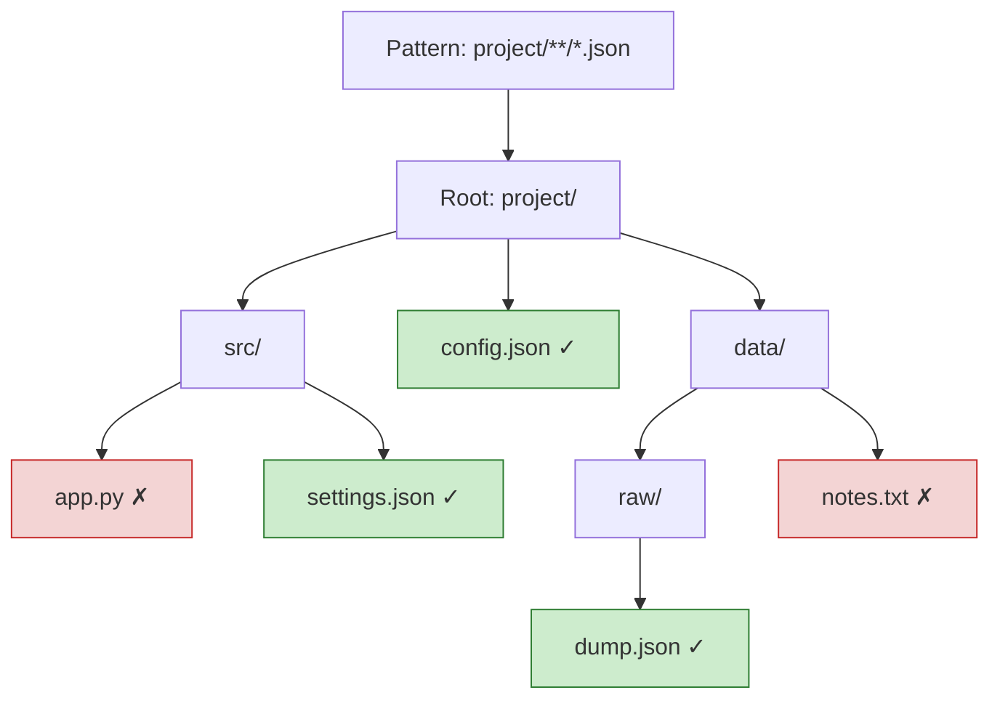

Match counts vary sharply by pattern specificity, as the sample below illustrates.


#### `pathlib` equivalents

`pathlib.Path.glob(pattern)` and `Path.rglob(pattern)` return `Path` objects instead of strings and integrate with the rest of the path API. `rglob("*.py")` is shorthand for `glob("**/*.py")` with recursion always on.

```python
from pathlib import Path

root = Path("project")
for p in root.rglob("*.py"):
    print(p, p.stat().st_size)
```

### Real-world example

Scenario: a log-rotation cleanup that finds every `.log` file older than seven days across a service's nested log directories and reports their total size before deletion. This combines recursive globbing with `pathlib` metadata.

```python
import time
from pathlib import Path


def stale_logs(root: str, max_age_days: int = 7):
    cutoff = time.time() - max_age_days * 86_400
    total_bytes = 0
    candidates = []
    for log in Path(root).rglob("*.log"):
        st = log.stat()
        if st.st_mtime < cutoff:
            candidates.append(log)
            total_bytes += st.st_size
    return candidates, total_bytes


if __name__ == "__main__":
    files, size = stale_logs("var/log/myservice")
    print(f"{len(files)} stale logs, {size / 1e6:.1f} MB")
    # for f in files: f.unlink()   # delete once confirmed
```

### In practice

> [!WARNING]
> `glob` does **not** match hidden files (leading `.`) unless the dot is explicit. `glob.glob("*")` skips `.env`; you need `glob.glob(".*")` or `Path.glob(".*")` for dotfiles.

> [!TIP]
> Prefer `pathlib.Path.rglob` in new code — it returns rich `Path` objects, composes with `.stat()`, `.suffix`, `.name`, and reads more clearly than string concatenation. Use `iglob`/lazy iteration for directories with millions of entries to avoid building a giant list.

> [!NOTE]
> `glob` matches the *real* filesystem, while `fnmatch.fnmatch(name, pattern)` matches an arbitrary string with no disk access — useful for filtering names you already have in memory.

### Pitfalls

- **Expecting regex power** — globs are not regular expressions; `.` is literal and `*` stops at `/`. Use `re` for general text matching.
- **Forgetting `recursive=True`** — `**` silently degrades to `*` without it, so subdirectories are missed.
- **Assuming sorted output** — order is filesystem-dependent; call `sorted()` if order matters.
- **Dotfile surprises** — backups, `.git`, and config files are skipped by `*`.
- **Brace expansion** — `glob` does *not* support `{a,b}` shell brace expansion; loop over patterns instead.

## Flask

> **TL;DR:** Flask is a minimal WSGI microframework built on Werkzeug (HTTP/routing) and Jinja2 (templates). It ships almost nothing by default — you add extensions for the database, auth, and forms you actually need. Flask 2.0+ supports `async def` views, but the core is still synchronous request-per-worker.

### Vocabulary

- **WSGI** (Web Server Gateway Interface, PEP 3333) — the synchronous Python web protocol: the server calls `app(environ, start_response)` once per request and gets bytes back. One request occupies one worker until it returns.
- **Werkzeug** — the WSGI toolkit underneath Flask: request/response objects, URL routing, the dev server.
- **Jinja2** — Flask's template engine; renders HTML from templates with `{{ }}` placeholders.
- **Application context / request context** — thread-local-style stacks that make `current_app`, `g`, and `request` available without passing them as arguments.
- **Blueprint** — a reusable group of routes you register onto an app, the unit of modular structure in larger Flask apps.
- **Microframework** — a framework that provides routing and request handling but defers the database, forms, and auth to extensions.

### Intuition

Think of Flask as a thin, polite wrapper around Werkzeug: it maps a URL to a Python function, gives that function a `request` object, and turns whatever the function returns into an HTTP response. Everything else — ORM, migrations, admin, sessions backend — is your choice. That minimalism is the whole point: Flask gets out of the way, which is why it is the canonical teaching framework and the backbone of Plotly Dash.

### How it works

Flask is a WSGI application. A WSGI server (gunicorn, uWSGI, or the dev server) runs a pool of synchronous workers; each worker handles one request at a time, top to bottom, blocking on any I/O.

#### Routing and views

You attach a Python function to a URL with the `@app.route` decorator. Werkzeug compiles these rules into a map and dispatches each incoming path to the matching view function, capturing `<converters>` from the URL as arguments.

```python
@app.route("/user/<int:user_id>")
def show_user(user_id: int) -> str:
    return f"user {user_id}"
```

#### Request and response

Inside a view, the `request` proxy exposes the parsed incoming request — query args, form data, JSON body, headers. Returning a string, dict, or `(body, status, headers)` tuple is enough; Flask wraps it in a proper `Response`. Returning a dict auto-serializes to JSON.

#### Contexts

Flask pushes an application context and a request context around each request so globals like `request` and `g` resolve to the right values per worker. The `g` object is a per-request scratchpad — use it for the DB connection, not for cross-request state.

#### Async views (2.0+)

Flask 2.0 added `async def` views: Flask runs the coroutine on an event loop inside the worker via `asgiref`. This helps a single view that awaits I/O, but Flask remains WSGI — concurrency still comes from running multiple workers, not from a shared event loop like ASGI frameworks.

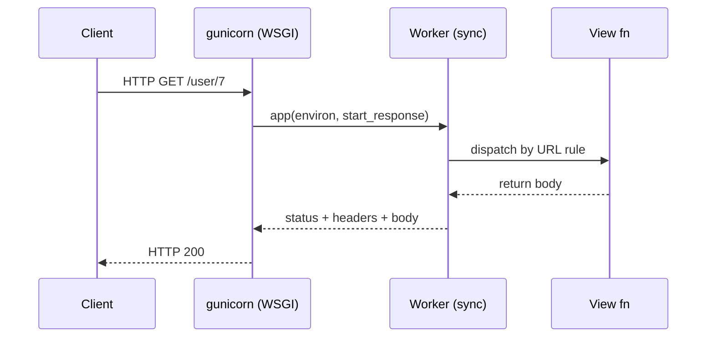

### Real-world example

A minimal JSON API with a path parameter, a query parameter, and a POST body. This runs as-is with `pip install flask` then `python app.py`.

```python
from flask import Flask, request, jsonify

app = Flask(__name__)
_NOTES: dict[int, str] = {}

@app.route("/notes/<int:note_id>", methods=["GET"])
def get_note(note_id: int):
    if note_id not in _NOTES:
        return jsonify(error="not found"), 404
    return jsonify(id=note_id, text=_NOTES[note_id])

@app.route("/notes", methods=["POST"])
def create_note():
    data = request.get_json(force=True)
    new_id = len(_NOTES) + 1
    _NOTES[new_id] = data["text"]
    return jsonify(id=new_id), 201

if __name__ == "__main__":
    app.run(debug=True)
```

The throughput chart below shows the sync-vs-async-view tradeoff for an I/O-bound endpoint on one worker.

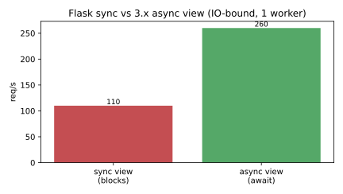

### In practice

In production you never use `app.run()`. You put Flask behind gunicorn with multiple sync (or gevent) workers and a reverse proxy. Common stack: `Flask-SQLAlchemy` for the ORM, `Flask-Migrate` for schema migrations, `Flask-Login` for sessions, and blueprints to split routes by domain.

> [!TIP]
> Size the gunicorn worker count to roughly `2 * CPU + 1` for CPU-bound apps. For I/O-bound apps, switch the worker class to `gevent` so each worker handles many concurrent connections via greenlets instead of blocking.

> [!IMPORTANT]
> `app.run(debug=True)` enables the Werkzeug debugger, which executes arbitrary code from the browser. Never run with `debug=True` in production — it is a remote code execution hole.

### Pitfalls

- **Async views make Flask "async"** — wrong. Flask is still WSGI; `async def` only helps inside one view. For event-loop-native concurrency choose an ASGI framework like FastAPI or Sanic.
- **Storing state in module globals** — works on one worker, breaks across multiple gunicorn workers and processes. Use a database or cache.
- **Doing CPU-heavy work in a view** — blocks the whole worker. Offload to a task queue (Celery, RQ).
- **Mutable default config** — relying on `app.run()` defaults in prod; always set `SECRET_KEY` and disable debug.

## Django

> **TL;DR:** Django is a batteries-included, full-stack framework: ORM, migrations, admin, auth, templates, and forms in one package, following a model-template-view (MTV) pattern. It is historically WSGI/synchronous but ships an ASGI entrypoint and `async def` views, so it now spans sync and async.

### Vocabulary

- **MTV (Model-Template-View)** — Django's spin on MVC: models define data, views hold request logic, templates render output; the framework's URL dispatcher acts as the controller.
- **ORM** (Object-Relational Mapper) — Django's query layer; you write Python (`Article.objects.filter(...)`) and it emits SQL, mapping rows to model instances.
- **Migration** — a versioned, auto-generated description of a schema change that Django applies to the database.
- **Middleware** — an ordered chain of hooks wrapping every request/response (auth, sessions, CSRF, gzip).
- **App** — a reusable, pluggable Django sub-package (its own models, views, migrations) registered in `INSTALLED_APPS`.
- **WSGI vs ASGI** — Django generates both `wsgi.py` (sync servers) and `asgi.py` (async servers); ASGI is required for async views, WebSockets (via Channels), and long-lived connections.

### Intuition

Django's philosophy is the opposite of a microframework: it answers "how do I do auth / admin / migrations / forms?" before you ask. You define a model class, run `makemigrations` and `migrate`, and you get a database table, an admin CRUD UI, and a query API — all generated. The cost is convention and weight; the payoff is that a small team ships a complete product fast.

### How it works

A request enters through the WSGI or ASGI handler, passes down the middleware stack, hits the URL resolver, runs a view, and the response passes back up through the same middleware in reverse. The ORM and template engine do the heavy lifting inside the view.

#### URLs to views

`urls.py` maps URL patterns to view callables. A view receives an `HttpRequest` and returns an `HttpResponse`. Class-based views provide reusable behavior (lists, detail, forms) via mixins.

#### The ORM and migrations

You declare data as model classes; each field maps to a column. `makemigrations` diffs your models against the last migration and writes a new one; `migrate` applies pending migrations to the database.

```python
class Article(models.Model):
    title = models.CharField(max_length=200)
    body = models.TextField()
    published = models.DateField(auto_now_add=True)
```

#### Middleware chain

Middleware wraps the view in layers — request flows inward, response flows outward. CSRF protection, sessions, and authentication are all middleware you rarely touch but always rely on.

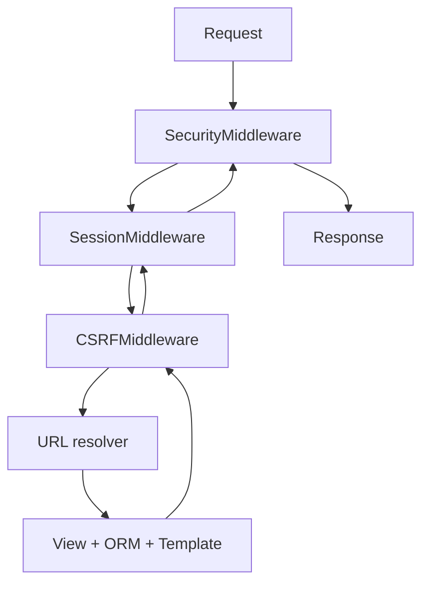

#### Sync and async views

Django runs synchronous views per worker like any WSGI app. Under an ASGI server you can write `async def` views and use the async ORM interface (`await Article.objects.aget(...)`), letting one event loop interleave I/O-bound requests. The per-request time budget is dominated by ORM queries, as the chart shows.

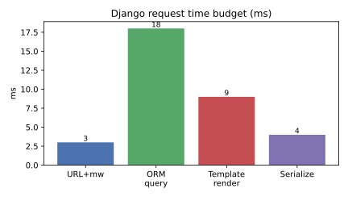

### Real-world example

A minimal single-file Django app exposing a JSON endpoint. Run with `pip install django`, save as `app.py`, then `python app.py runserver`.

```python
import sys
from django.conf import settings
from django.http import JsonResponse
from django.urls import path
from django.core.management import execute_from_command_line

settings.configure(DEBUG=True, ROOT_URLCONF=__name__, ALLOWED_HOSTS=["*"],
                   SECRET_KEY="dev-only")

def hello(request):
    name = request.GET.get("name", "world")
    return JsonResponse({"message": f"hello {name}"})

urlpatterns = [path("", hello)]

if __name__ == "__main__":
    execute_from_command_line(sys.argv)
```

A real project uses `django-admin startproject` to scaffold settings, `urls.py`, `wsgi.py`, and `asgi.py` rather than this single-file form.

### In practice

Production Django runs under gunicorn (WSGI) or uvicorn/daphne (ASGI) behind a proxy, with PostgreSQL and a `collectstatic` step for assets. Django REST Framework adds serializers and viewsets for JSON APIs; Django Channels adds WebSockets over ASGI; Celery handles background jobs.

> [!WARNING]
> The ORM's lazy evaluation makes the N+1 query problem easy to hit: iterating a queryset and touching a related object per row fires one query per row. Use `select_related` (joins) and `prefetch_related` (separate batched query) to collapse them.

> [!IMPORTANT]
> Mixing sync ORM calls inside an `async def` view raises `SynchronousOnlyOperation`. Use the async ORM methods (`aget`, `acreate`, `async for`) or wrap blocking calls in `sync_to_async`.

### Pitfalls

- **N+1 queries** — the most common Django performance bug (see warning).
- **Fat views, anemic models** — business logic scattered in views; prefer model methods and managers.
- **Editing the DB by hand** — bypassing migrations desyncs schema state; always go through `makemigrations`/`migrate`.
- **Assuming async everywhere** — much of the ecosystem and ORM history is sync; async support is real but incomplete, so check each library.

## FastAPI

> **TL;DR:** FastAPI is a modern ASGI framework that uses Python type hints plus Pydantic to validate requests, serialize responses, and auto-generate OpenAPI docs. It supports both `async def` (run on the event loop) and `sync def` (run in a threadpool) endpoints, so it bridges sync and async cleanly.

### Vocabulary

- **ASGI** (Asynchronous Server Gateway Interface) — the async successor to WSGI; the server `await`s an `app(scope, receive, send)` coroutine, enabling one event loop to interleave thousands of in-flight requests and to handle WebSockets and streaming.
- **Pydantic** — the validation/serialization library FastAPI uses; you declare a model as a typed class and Pydantic parses, validates, and serializes JSON against it.
- **Starlette** — the lightweight ASGI toolkit FastAPI is built on (routing, middleware, WebSockets, background tasks).
- **OpenAPI** — the machine-readable API schema FastAPI generates from your type hints; it powers the interactive Swagger UI and ReDoc pages.
- **Dependency injection** — FastAPI's `Depends()` mechanism that resolves shared resources (DB session, current user) per request.
- **uvicorn** — the standard ASGI server used to run FastAPI in production (often under gunicorn).

### Intuition

FastAPI's trick is that your function signature *is* the API contract. A parameter typed `item_id: int` becomes a validated path parameter; a parameter typed as a Pydantic model becomes a validated JSON body; the return type annotation becomes the response schema. One set of type hints simultaneously gives you editor autocomplete, runtime validation, and published documentation — DRY taken to its logical end.

### How it works

FastAPI is ASGI-native. An event loop inside one worker can suspend an `async def` endpoint at every `await` and serve other requests in the meantime, which is why it scales well for I/O-bound APIs that talk to databases and upstream services.

#### Type-hint-driven validation

You declare request shapes with Pydantic models and primitive-typed parameters. On each request FastAPI parses the raw bytes, coerces and validates them against the types, and returns a structured `422` with field-level errors on mismatch — before your code runs.

```python
from pydantic import BaseModel

class Item(BaseModel):
    name: str
    price: float
```

#### async vs sync endpoints

If you write `async def`, the endpoint runs directly on the event loop and you must `await` I/O (use async DB drivers and `httpx`). If you write plain `def`, FastAPI runs it in an external threadpool so a blocking call cannot freeze the loop. Mixing them is fine; the throughput difference under I/O wait is shown below.

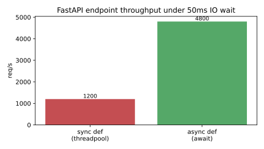

#### Dependencies

`Depends()` declares that an endpoint needs a resource produced by another callable. FastAPI resolves the dependency graph per request, caches within a request, and supports `yield` dependencies for setup/teardown (open DB session, close it after).

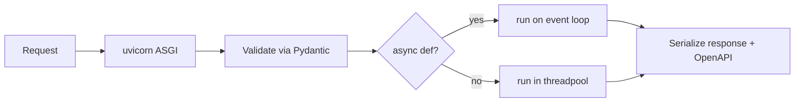

### Real-world example

A CRUD-ish API with a validated body, a path parameter, and a dependency. Run with `pip install "fastapi[standard]"` then `uvicorn app:app --reload`.

```python
from fastapi import FastAPI, HTTPException, Depends
from pydantic import BaseModel

app = FastAPI()
_DB: dict[int, "Item"] = {}

class Item(BaseModel):
    name: str
    price: float

def db():
    return _DB

@app.post("/items/{item_id}", status_code=201)
async def create(item_id: int, item: Item, store: dict = Depends(db)) -> Item:
    if item_id in store:
        raise HTTPException(409, "exists")
    store[item_id] = item
    return item

@app.get("/items/{item_id}")
async def read(item_id: int, store: dict = Depends(db)) -> Item:
    if item_id not in store:
        raise HTTPException(404, "not found")
    return store[item_id]
```

Visit `/docs` and FastAPI serves an interactive Swagger UI generated entirely from the type hints above.

### In practice

Run uvicorn workers (often `gunicorn -k uvicorn.workers.UvicornWorker`) behind a reverse proxy. Use async drivers end-to-end (`asyncpg`/`SQLAlchemy 2.0 async`, `httpx.AsyncClient`) so the event loop never blocks. `BackgroundTasks` handles fire-and-forget work; for heavy jobs offload to a real queue.

> [!WARNING]
> Calling a blocking function (a sync DB driver, `requests`, `time.sleep`) inside an `async def` endpoint stalls the entire event loop and tanks throughput for every concurrent request. Either `await` an async client or move the call into a `def` endpoint (threadpool) or `run_in_executor`.

> [!TIP]
> Let Pydantic do validation at the edge. Typed models plus `response_model` give you correct `422`s and clean serialization for free — don't hand-roll `if not isinstance(...)` checks inside handlers.

### Pitfalls

- **Blocking inside `async def`** — the single biggest FastAPI footgun (see warning above).
- **Async ORM with a sync driver** — `async def` plus `psycopg2` gives you no concurrency; you need `asyncpg` or SQLAlchemy's async engine.
- **Trusting input without a model** — accepting a raw `dict` body skips validation; declare a Pydantic model.
- **Forgetting `response_model`** — without it you may leak internal fields; FastAPI filters output to the declared schema.

## Pyramid

> **TL;DR:** Pyramid is a synchronous WSGI framework from the Pylons project that "starts small and finishes big" — it scales from a single-file microframework to a large app without forcing a directory layout. Its distinctive features are flexible URL handling (both routing and traversal) and a fine-grained, declarative authorization system.

### Vocabulary

- **WSGI** — the synchronous Python web protocol Pyramid implements; one request per worker until the view returns.
- **View callable** — the function (or class) that handles a request and returns a response; the unit of Pyramid request logic.
- **URL Dispatch (routing)** — mapping URL patterns to views by name, the familiar Flask/Django style.
- **Traversal** — Pyramid's alternative URL model that walks a tree of "resource" objects to find the context, natural for hierarchical/CMS data.
- **Configurator** — the imperative object you use to register routes, views, and settings when building the app.
- **Renderer** — a pluggable output adapter (JSON, Chameleon/Mako/Jinja2 templates) selected per view, decoupling view logic from output format.

### Intuition

Pyramid's design value is *flexibility without forcing structure*. Flask is opinionated about being small; Django is opinionated about being big; Pyramid deliberately refuses both. You wire up exactly the pieces you want through the Configurator, and you can choose URL Dispatch (routes) or Traversal (resource trees) per app — the latter making per-object permission checks natural for content-management-style data.

### How it works

Pyramid is a WSGI application driven by an explicit configuration phase. You build a `Configurator`, register routes/views/renderers, call `config.make_wsgi_app()`, and serve it under any WSGI server. At request time it finds a view, runs it, and applies the view's renderer.

#### Configuration and view registration

Configuration is imperative and explicit: you add a route, then attach a view to it. This makes the app's wiring discoverable in one place rather than scattered across decorators (though decorators are also supported).

```python
config.add_route("home", "/")
config.add_view(home_view, route_name="home", renderer="json")
```

#### URL Dispatch vs Traversal

URL Dispatch matches a path against ordered route patterns — predictable and flat. Traversal instead treats the URL path as a walk through a tree of resource objects, where each segment selects a child; the resource you land on becomes the *context*, and authorization is checked against it.

#### Renderers and response

A view returns a plain Python object; the registered renderer turns it into an HTTP response. Returning a dict with `renderer="json"` serializes to JSON; with a template renderer it fills the template. Throughput scales with worker count like any WSGI app, shown below.

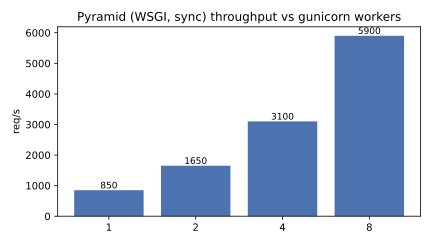

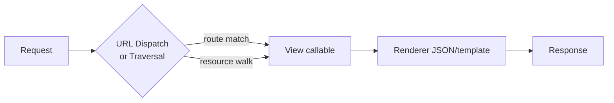

### Real-world example

A minimal JSON API. Run with `pip install pyramid waitress` then `python app.py` and GET `http://localhost:6543/hello/world`.

```python
from wsgiref.simple_server import make_server
from pyramid.config import Configurator
from pyramid.view import view_config

def hello(request):
    return {"message": f"hello {request.matchdict['name']}"}

if __name__ == "__main__":
    with Configurator() as config:
        config.add_route("hello", "/hello/{name}")
        config.add_view(hello, route_name="hello", renderer="json")
        app = config.make_wsgi_app()
    make_server("0.0.0.0", 6543, app).serve_forever()
```

### In practice

Production Pyramid runs under waitress, gunicorn, or uWSGI. Projects are typically scaffolded with `cookiecutter`, configured via an `.ini` file (settings, logging, server), and use SQLAlchemy for persistence and `alembic` for migrations. The ACL-based authorization (resource + permission + principals) is a notable strength for apps with complex per-object access rules.

> [!TIP]
> Reach for Traversal when your data is naturally a tree with per-node permissions (folders, documents, org hierarchies). Reach for URL Dispatch for flat REST-style APIs. Pyramid lets you use both in the same app.

> [!NOTE]
> Pyramid is synchronous WSGI. It does not have a native async story like ASGI frameworks; concurrency comes from running multiple workers (optionally gevent worker class), not an event loop.

### Pitfalls

- **Expecting async** — Pyramid is WSGI/sync; blocking I/O blocks the worker.
- **Over-using Traversal** — for a flat REST API, Traversal adds conceptual overhead; URL Dispatch is simpler.
- **Skipping the `.ini`** — settings, logging, and server config live there; bypassing it leads to inconsistent environments.
- **Forgetting renderers** — returning a raw dict without a registered renderer raises an error; declare `renderer="json"` or a template.

## Tornado

> **TL;DR:** Tornado is an asynchronous web framework and networking library that predates `asyncio` and was built to solve the C10k problem — holding tens of thousands of long-lived connections (long-polling, WebSockets) on a single-threaded event loop. Modern Tornado integrates with `asyncio`, so its `IOLoop` runs on the standard event loop and its handlers use `async`/`await`.

### Vocabulary

- **IOLoop** — Tornado's event loop; in modern versions it wraps the `asyncio` event loop, multiplexing I/O on one thread.
- **RequestHandler** — the class you subclass per route; methods `get`, `post`, etc. handle requests and may be `async`.
- **C10k problem** — the historical challenge of handling 10,000+ concurrent connections per server, which thread-per-connection cannot do.
- **Non-blocking I/O** — Tornado registers sockets with the loop and is notified when they are readable/writable instead of blocking a thread.
- **Coroutine** — an `async def` handler that `await`s I/O, suspending so the loop can serve other connections.
- **WebSocketHandler** — a Tornado handler for bidirectional persistent WebSocket connections.

### Intuition

Tornado was designed around one hard constraint: keep a huge number of slow or idle connections alive cheaply. A thread-per-request server falls over at a few thousand connections (memory and context-switch cost); Tornado instead runs one thread with an event loop that only does work when a socket has data. That makes long-polling chat, streaming, and WebSockets — Tornado's original FriendFeed use case — feasible on modest hardware.

### How it works

Tornado is a self-contained stack: it has its own HTTP server, framework, and event loop, though the loop now sits on top of `asyncio`. Handlers are coroutines that yield to the loop at each `await`.

#### The IOLoop and handlers

You map URL patterns to `RequestHandler` subclasses in an `Application`, then start the `IOLoop`. Each request runs a handler method; if it is `async`, every `await` returns control to the loop so other connections progress.

```python
class MainHandler(tornado.web.RequestHandler):
    async def get(self):
        self.write("hello")
```

#### Non-blocking by construction

The single thread never blocks on socket I/O: it registers interest and is woken on readiness. This is why one process can hold far more idle connections than a thread-per-request server, as the chart contrasts.

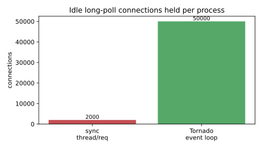

#### asyncio integration

Modern Tornado's `IOLoop` is a thin layer over the `asyncio` loop, so you can mix Tornado handlers with `asyncio`-native libraries (`aiohttp` client, async DB drivers) in the same process.

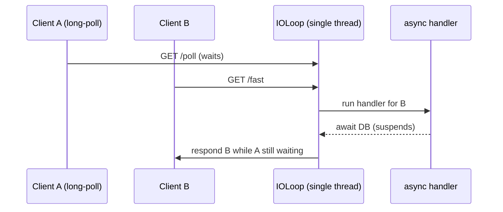

### Real-world example

A tiny async HTTP server with one blocking-free handler. Run with `pip install tornado` then `python app.py` and GET `http://localhost:8888/`.

```python
import asyncio
import tornado.web

class MainHandler(tornado.web.RequestHandler):
    async def get(self):
        await asyncio.sleep(0)  # yield to the loop
        self.write({"message": "hello from tornado"})

def make_app() -> tornado.web.Application:
    return tornado.web.Application([(r"/", MainHandler)])

async def main():
    make_app().listen(8888)
    await asyncio.Event().wait()

if __name__ == "__main__":
    asyncio.run(main())
```

### In practice

Tornado is often deployed as multiple single-threaded processes (one per CPU core) behind a load balancer, since one loop uses one core. It remains a strong choice for WebSocket servers and long-polling endpoints. For new pure-HTTP APIs, ASGI frameworks (FastAPI, Sanic) on uvicorn are now more common, but Tornado's mature WebSocket support keeps it relevant.

> [!WARNING]
> A blocking call (`requests.get`, a sync DB driver, `time.sleep`, heavy CPU) inside a Tornado handler freezes the single event-loop thread and stalls *every* connection. Use async clients and `await`, or offload CPU work to a thread/process executor.

> [!TIP]
> Run one Tornado process per core (e.g. behind nginx) to use all cores, since a single `IOLoop` is single-threaded by design.

### Pitfalls

- **Blocking the loop** — the cardinal sin; one blocking call stalls all connections.
- **Assuming multi-core for free** — one loop = one core; you must fork processes.
- **Old `@gen.coroutine` patterns** — modern Tornado uses native `async`/`await`; the legacy generator style is deprecated.
- **Mixing sync DB drivers** — use async drivers or executors to avoid blocking.

## aiohttp

> **TL;DR:** aiohttp is an asyncio-native HTTP library providing both a client and a server in one package. The client (`ClientSession`) is the de-facto async replacement for `requests`; the server is a lightweight async web framework. Everything runs on the standard `asyncio` event loop with `async`/`await`.

### Vocabulary

- **asyncio** — Python's standard async I/O framework; the event loop aiohttp runs on.
- **`ClientSession`** — the reusable async HTTP client; holds the connection pool and should be created once and reused.
- **`async with`** — the asynchronous context manager pattern aiohttp uses for sessions and responses to guarantee cleanup.
- **Coroutine** — an `async def` function whose `await` points let the loop run other tasks.
- **Application / `web.Application`** — the aiohttp server object holding routes and middleware.
- **Connection pool** — reused keep-alive connections owned by a `ClientSession`, avoiding per-request TCP/TLS setup.

### Intuition

aiohttp answers two needs with one library. As a *client*, it lets you fire hundreds of HTTP requests concurrently from one thread — the event loop overlaps all the network waits — which is why it crushes synchronous `requests` for fan-out workloads. As a *server*, it gives you a minimal async framework where handlers are coroutines. Both halves share the same `asyncio` loop, so a server handler can `await` an outbound client call cleanly.

### How it works

aiohttp builds entirely on `asyncio`: a single-threaded event loop interleaves many in-flight requests by suspending each coroutine at its `await` points and resuming it when its socket is ready.

#### The client

You create one `ClientSession` (it owns the connection pool) and reuse it for many requests. `async with session.get(url)` opens the request and ensures the response is released; gathering many such coroutines with `asyncio.gather` runs them concurrently.

```python
async with session.get(url) as resp:
    body = await resp.text()
```

For 1000 API calls, the asyncio client far outpaces synchronous requests and even a threadpool, as the chart shows.

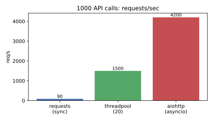

#### The server

The server maps routes to coroutine handlers on a `web.Application`. Each handler receives a `Request` and returns a `Response`; `await`ing I/O inside a handler yields to the loop so other connections progress.

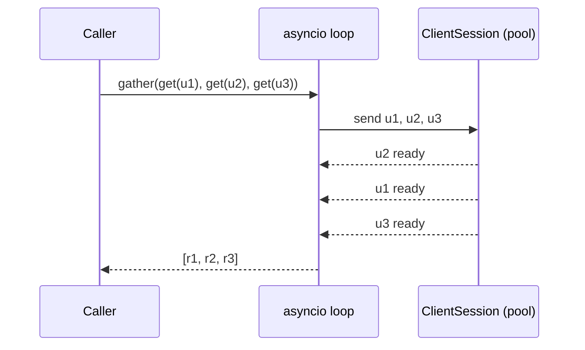

### Real-world example

Fetch many URLs concurrently with one shared session. Run with `pip install aiohttp` then `python app.py`.

```python
import asyncio
import aiohttp

URLS = ["https://example.com"] * 10

async def fetch(session: aiohttp.ClientSession, url: str) -> int:
    async with session.get(url) as resp:
        return len(await resp.text())

async def main() -> None:
    async with aiohttp.ClientSession() as session:
        sizes = await asyncio.gather(*(fetch(session, u) for u in URLS))
    print(sizes)

if __name__ == "__main__":
    asyncio.run(main())
```

A minimal server uses `web.Application`, `app.add_routes([web.get("/", handler)])`, and `web.run_app(app)` with an `async def handler(request)` returning `web.json_response(...)`.

### In practice

aiohttp's client is the standard choice for async scrapers, API gateways, and microservice-to-microservice calls. Create exactly one `ClientSession` per application lifetime (not per request) so the connection pool is reused. The server is good for lightweight async services; richer APIs often prefer FastAPI for its validation and OpenAPI generation.

> [!WARNING]
> Creating a new `ClientSession` per request defeats connection pooling, leaks sockets, and triggers "Unclosed client session" warnings. Open one session at startup, reuse it, and close it at shutdown.

> [!IMPORTANT]
> aiohttp is `asyncio`-only and single-threaded per loop. A blocking call inside a handler or task stalls the whole loop — use async drivers or `loop.run_in_executor` for unavoidable blocking work.

### Pitfalls

- **Session per request** — kills pooling; reuse one session.
- **Forgetting `await`** — calling a coroutine without awaiting it does nothing and warns.
- **Blocking the loop** — sync I/O or CPU work freezes all concurrent requests.
- **Not setting timeouts** — without a `ClientTimeout`, a hung upstream can pin a coroutine indefinitely.

## Sanic

> **TL;DR:** Sanic is a fast, async-first Python web framework built for speed: it uses `async`/`await`, ships its own high-performance server, and supports the ASGI standard. Its design goal is throughput — handling many concurrent requests on an event loop with minimal per-request overhead.

### Vocabulary

- **ASGI** — the asynchronous server interface Sanic supports; lets it run under uvicorn/hypercorn and handle WebSockets and streaming.
- **Sanic server** — Sanic's own built-in production-grade async HTTP server (you don't strictly need an external ASGI server).
- **Coroutine handler** — an `async def` route function that `await`s I/O, yielding to the loop.
- **Worker** — an OS process running an event loop; Sanic forks multiple workers to use all cores.
- **Blueprint** — a group of routes/middleware registered onto the app, the modularity unit.
- **Middleware** — `request`/`response` hooks that wrap every handler.

### Intuition

Sanic was created when Flask had no async support and the goal was raw speed. It looks Flask-like — decorators on route functions — but every handler is a coroutine on an event loop, so one worker interleaves thousands of concurrent I/O-bound requests instead of blocking per request. Combined with a fast built-in server and multi-worker forking, it targets the top of the throughput charts.

### How it works

Sanic runs an `asyncio` event loop per worker process. Requests are dispatched to `async def` handlers; each `await` yields to the loop so other requests progress. Multiple workers (one per core) give CPU parallelism across processes.

#### Routes and handlers

You attach coroutine handlers to paths with decorators. The handler receives a `Request` and returns a response helper (`json`, `text`, `html`). Because it is async, you `await` databases and upstream calls inside it.

```python
@app.get("/user/<uid:int>")
async def user(request, uid: int):
    return json({"id": uid})
```

#### Server and workers

Sanic's own server is production-grade; `app.run(workers=N)` forks N processes, each with its own loop, to saturate all cores. It also speaks ASGI, so it can run under uvicorn instead. On a hello-world benchmark it sits well above WSGI frameworks, as the chart shows.

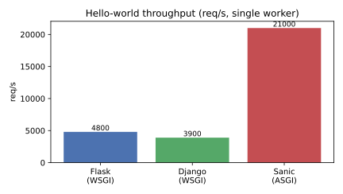

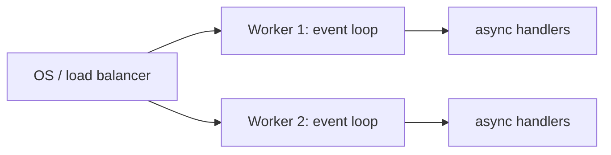

#### Middleware and blueprints

Middleware functions run before (`request`) and after (`response`) each handler for cross-cutting concerns. Blueprints group related routes and middleware so large apps stay modular.

### Real-world example

A minimal JSON API. Run with `pip install sanic` then `python app.py` and GET `http://localhost:8000/hello/world`.

```python
from sanic import Sanic
from sanic.response import json

app = Sanic("demo")

@app.get("/hello/<name:str>")
async def hello(request, name: str):
    return json({"message": f"hello {name}"})

if __name__ == "__main__":
    app.run(host="0.0.0.0", port=8000, workers=2)
```

### In practice

Sanic is chosen for high-throughput async APIs, proxies, and streaming services where raw requests-per-second matters. Use async drivers throughout (`asyncpg`, async Redis) so the loop never blocks, and set `workers` to the core count for full CPU use. Its built-in server means you often don't need a separate ASGI server, though ASGI compatibility keeps deployment flexible.

> [!WARNING]
> Any blocking call (sync DB driver, `requests`, `time.sleep`, heavy CPU) inside an `async def` handler stalls that worker's entire event loop, dragging down every concurrent request on it. Use async libraries or an executor.

> [!TIP]
> Set `workers` to the number of CPU cores. A single Sanic worker uses one core; forking workers is how you scale across all cores while each still handles thousands of concurrent connections.

### Pitfalls

- **Blocking the loop** — the dominant async footgun; one sync call freezes a worker.
- **Single worker on multi-core** — leaves cores idle; set `workers` appropriately.
- **Sync DB drivers** — pair Sanic with async drivers or you get no concurrency.
- **Expecting Flask extensions to work** — Sanic has its own ecosystem; WSGI/Flask extensions don't apply.

## gevent

> **TL;DR:** gevent is a coroutine-based concurrency library built on greenlets (lightweight in-process "threads") and libev/libuv. Its signature move is *monkey-patching* the standard library so ordinary blocking I/O code becomes cooperatively concurrent without `async`/`await` — you write synchronous-looking code and gevent yields the greenlet on each blocking call.

### Vocabulary

- **Greenlet** — a lightweight, cooperatively-scheduled coroutine running in one OS thread; switching between greenlets is cheap and does not involve the OS scheduler.
- **Monkey-patching** — replacing standard-library functions (`socket`, `ssl`, `time.sleep`, `threading`) at runtime with gevent-aware versions that yield instead of blocking.
- **Hub** — gevent's central greenlet running the event loop (libev/libuv); it resumes other greenlets when their I/O is ready.
- **Cooperative scheduling** — greenlets yield control only at I/O or explicit `gevent.sleep`; nothing preempts them, unlike OS threads.
- **`gevent.spawn`** — start a function in a new greenlet, returning immediately.
- **GIL** — the Global Interpreter Lock still applies; gevent gives I/O concurrency, not CPU parallelism.

### Intuition

gevent lets you keep writing plain blocking code — `requests.get(...)`, `sock.recv()` — but makes those blocking calls cheap to overlap. The trick is monkey-patching: it swaps the blocking primitives in the stdlib for versions that, instead of stalling the thread, park the current greenlet and let the hub run another one until the I/O completes. You get async-style concurrency with synchronous-looking code, no `await` keywords.

### How it works

gevent runs many greenlets in a single OS thread, multiplexed by an event loop (the hub). When a greenlet hits patched I/O, it switches to the hub, which runs other ready greenlets; when the original I/O completes, that greenlet is rescheduled.

#### Monkey-patching

You call `monkey.patch_all()` as the very first thing in your program. After that, libraries that use the standard `socket`/`ssl`/`time` modules — including `requests`, `psycopg2` variants, and `urllib` — become cooperatively concurrent transparently.

```python
from gevent import monkey
monkey.patch_all()  # must run before importing socket-using libs
```

#### Greenlets and the hub

`gevent.spawn` schedules a function as a greenlet. The hub is itself a greenlet running libev/libuv; control transfers to it whenever a running greenlet blocks on patched I/O, and it dispatches readiness events back to waiting greenlets.

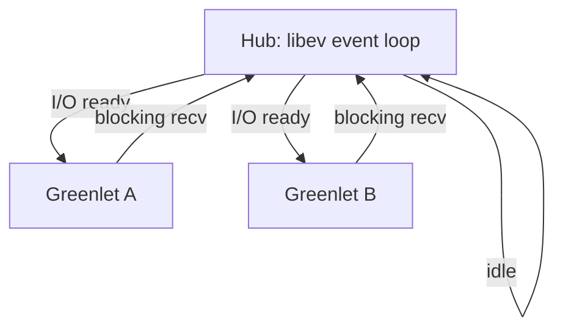

#### Concurrency, not parallelism

Because everything runs in one thread under the GIL, gevent overlaps *waiting*, not computation. For 100 concurrent slow HTTP fetches it matches threads at a fraction of the memory cost, as the chart shows; for CPU-bound work it gives nothing.

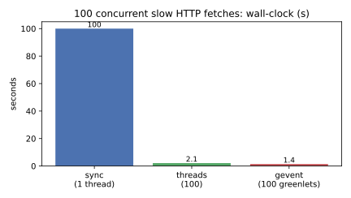

### Real-world example

Fetch many URLs concurrently with synchronous-looking code. Run with `pip install gevent requests` then `python app.py`.

```python
from gevent import monkey
monkey.patch_all()

import gevent
import requests

URLS = ["https://example.com"] * 20

def fetch(url: str) -> int:
    return len(requests.get(url, timeout=10).content)

jobs = [gevent.spawn(fetch, u) for u in URLS]
gevent.joinall(jobs, timeout=30)
print([j.value for j in jobs])
```

All 20 requests run concurrently in one thread because `patch_all()` made `requests`' sockets cooperative.

### In practice

gevent is most visible as a worker class: `gunicorn -k gevent` turns a synchronous WSGI app (Flask, Django, Pyramid) into one that handles thousands of concurrent I/O-bound connections per worker. It is the pragmatic way to scale legacy sync code without rewriting it for `asyncio`.

> [!IMPORTANT]
> `monkey.patch_all()` must run before any module that imports `socket`, `ssl`, or `threading` — ideally the very first lines of your entrypoint. Patching after those imports leaves un-patched blocking code that stalls the whole hub.

> [!WARNING]
> A CPU-bound or non-cooperative C call (a tight loop, an un-patched native library) blocks the single thread and freezes every other greenlet. gevent only helps when greenlets yield at I/O. Use real threads or processes for CPU work.

### Pitfalls

- **Late monkey-patching** — patching after imports leaves blocking sockets; patch first.
- **Mixing with `asyncio`** — gevent has its own loop; combining it with `asyncio` in one thread is fraught.
- **Expecting CPU parallelism** — the GIL and single thread mean compute is serial.
- **Un-cooperative C extensions** — a native call that doesn't release the GIL or use patched sockets blocks all greenlets.

## Plotly Dash

> **TL;DR:** Dash is a Python framework for building interactive analytical web apps and dashboards without writing JavaScript. It runs on Flask (WSGI, synchronous) on the server and React in the browser; you describe the UI as a tree of Python components and wire interactivity with declarative callbacks.

### Vocabulary

- **Layout** — the component tree that defines the page; built from `dash.html` and `dash.dcc` components that map to React components in the browser.
- **Component** — a Python object (a graph, dropdown, slider) with `id` and `value`/`figure` properties; each maps to a rendered React widget.
- **Callback** — a Python function decorated to fire when an `Input` component changes, returning new values for `Output` components.
- **Input / Output / State** — the three callback argument kinds: `Input` triggers the callback, `Output` is what it updates, `State` is read but does not trigger.
- **Flask backend** — Dash embeds a Flask app; every callback is an HTTP POST to the server, so Dash inherits Flask's synchronous WSGI model.
- **Figure** — a Plotly chart spec (a nested dict / `plotly.graph_objects` object) serialized to JSON and rendered by plotly.js.

### Intuition

Dash splits the app cleanly: the *layout* is a static Python description of what is on the page, and *callbacks* describe how the page reacts. When a user moves a slider, the browser sends the slider's new value to the server, your Python callback recomputes a figure, and the server returns the new figure JSON, which React patches into the DOM. You write only Python; Dash generates the React/JS bridge.

### How it works

Dash is a Flask app with a JSON callback API bolted on. The layout is serialized once; thereafter each interaction is an HTTP round trip to a synchronous Flask worker that runs your callback and returns updated component properties.

#### Layout as a component tree

You assign `app.layout` a tree of components. Each component is a Python object; Dash renders the equivalent React component and keeps the two in sync by `id`.

```python
from dash import Dash, dcc, html
app = Dash(__name__)
app.layout = html.Div([
    dcc.Slider(0, 10, value=5, id="n"),
    dcc.Graph(id="chart"),
])
```

#### Reactive callbacks

A callback declares which `Output` properties it sets and which `Input` properties trigger it. Dash builds a dependency graph from these declarations and re-runs only the affected callbacks on each change.

#### The request round trip

Because callbacks are HTTP POSTs to Flask, the compute happens server-side and synchronously. The latency budget is dominated by server compute, not the network, as the chart shows.

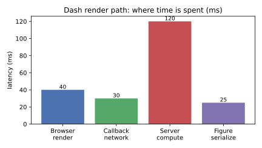

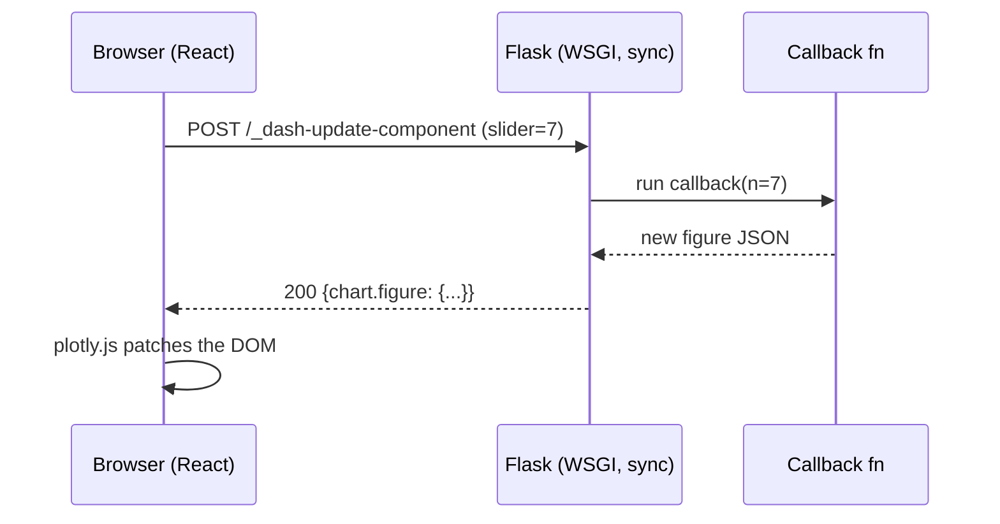

### Real-world example

A dashboard where a slider controls how many points a sine wave shows. Run with `pip install dash` then `python app.py`.

```python
import numpy as np
import plotly.graph_objects as go
from dash import Dash, dcc, html, Input, Output

app = Dash(__name__)
app.layout = html.Div([
    dcc.Slider(10, 200, value=50, id="points"),
    dcc.Graph(id="wave"),
])

@app.callback(Output("wave", "figure"), Input("points", "value"))
def update(points: int):
    x = np.linspace(0, 10, points)
    return go.Figure(go.Scatter(x=x, y=np.sin(x)))

if __name__ == "__main__":
    app.run(debug=True)
```

### In practice

Because Dash is Flask, you deploy it exactly like a Flask app: gunicorn workers behind a reverse proxy, exposing `app.server` (the underlying Flask object) as the WSGI callable. Heavy callbacks block a worker, so scale workers and cache expensive computations.

> [!TIP]
> Wrap expensive callback computations with `dash.callback` plus `flask-caching` (memoization) or use `dcc.Store` to keep intermediate results in the browser, so a slider tweak doesn't recompute an entire ETL pipeline.

> [!WARNING]
> Dash callbacks are synchronous Flask requests. A long-running callback ties up a gunicorn worker for its whole duration; a few slow users can starve everyone. Use background callbacks (`background=True` with a Celery/DiskCache manager) for anything over a second or two.

### Pitfalls

- **Storing state in globals** — Dash apps are multi-worker and multi-user; module-level mutable state leaks between users. Use `dcc.Store` or a database.
- **Treating Dash as async** — it is synchronous Flask; long callbacks block workers.
- **Returning huge figures** — large `Scatter` traces serialize slowly; downsample server-side.
- **Forgetting `app.server` for deployment** — gunicorn needs the Flask object, not the Dash wrapper.

## Sources

- Python docs — `glob`: https://docs.python.org/3/library/glob.html
- Python docs — `pathlib`: https://docs.python.org/3/library/pathlib.html
- Python docs — `fnmatch`: https://docs.python.org/3/library/fnmatch.html
- Flask documentation — https://flask.palletsprojects.com/
- Werkzeug documentation — https://werkzeug.palletsprojects.com/
- WSGI specification (PEP 3333) — https://peps.python.org/pep-3333/
- Django documentation — https://docs.djangoproject.com/
- Django async support — https://docs.djangoproject.com/en/stable/topics/async/
- Django REST Framework — https://www.django-rest-framework.org/
- FastAPI documentation — https://fastapi.tiangolo.com/
- Starlette documentation — https://www.starlette.io/
- Pydantic documentation — https://docs.pydantic.dev/
- ASGI specification — https://asgi.readthedocs.io/
- Pyramid documentation — https://docs.pylonsproject.org/projects/pyramid/en/latest/
- Pyramid URL Dispatch vs Traversal — https://docs.pylonsproject.org/projects/pyramid/en/latest/narr/muchadoabouttraversal.html
- Tornado documentation — https://www.tornadoweb.org/
- Tornado and asyncio — https://www.tornadoweb.org/en/stable/asyncio.html
- The C10k problem — http://www.kegel.com/c10k.html
- aiohttp documentation — https://docs.aiohttp.org/
- aiohttp client quickstart — https://docs.aiohttp.org/en/stable/client_quickstart.html
- asyncio documentation — https://docs.python.org/3/library/asyncio.html
- Sanic documentation — https://sanic.dev/
- Sanic deployment — https://sanic.dev/en/guide/deployment/
- gevent documentation — https://www.gevent.org/
- gevent monkey-patching — https://www.gevent.org/api/gevent.monkey.html
- greenlet — https://greenlet.readthedocs.io/
- Dash documentation — https://dash.plotly.com/
- Dash callbacks — https://dash.plotly.com/basic-callbacks
- Plotly Python graphing — https://plotly.com/python/

## Related

- [Data Structures and Algorithms](./06-data-structures-and-algorithms.md) — multiprocessing context for file-handling pipelines.
- [Concurrency](./09-concurrency.md) — the GIL, threading, multiprocessing, and asyncio models behind every web framework here.
- [Modules, Regex & Paradigms](./04-modules-regex-paradigms.md) — regular expressions vs glob patterns.
- [Advanced Functions](./03-advanced-functions.md) — context managers used in file handling.
- [Typing and Tooling](./08-typing-and-tooling.md) — Pydantic and type hints that drive FastAPI.
- [Testing and Internals](./11-testing-and-internals.md) — pytest for testing these apps.
