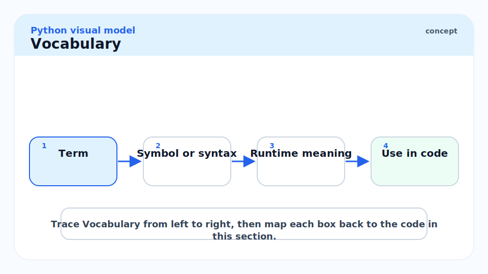
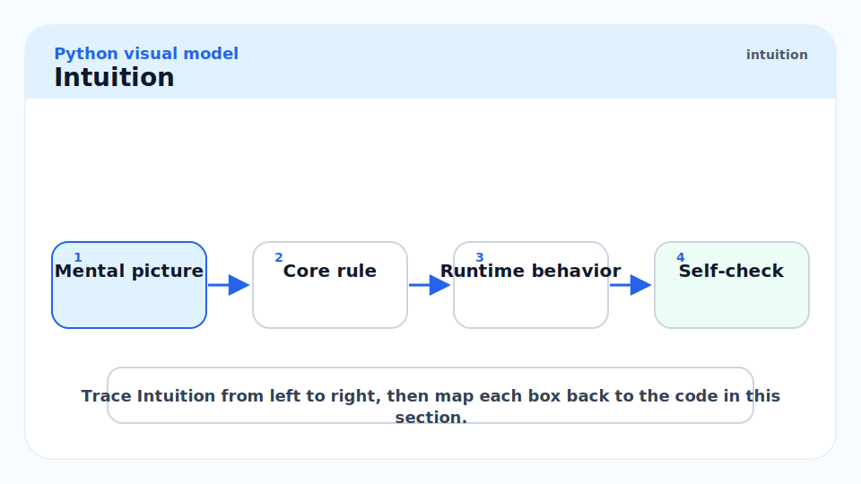
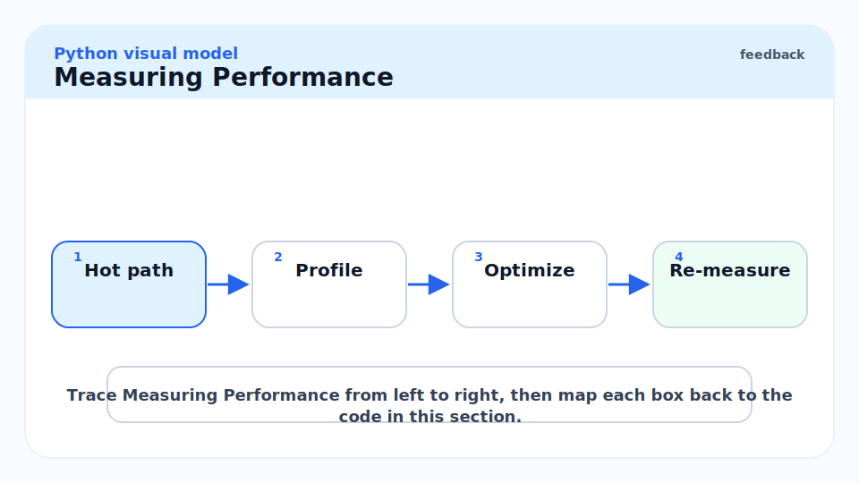
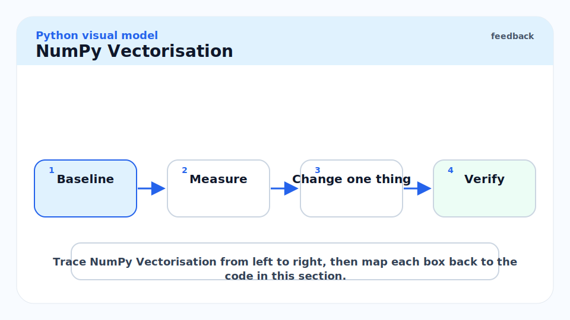
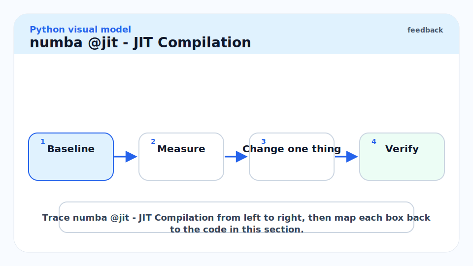
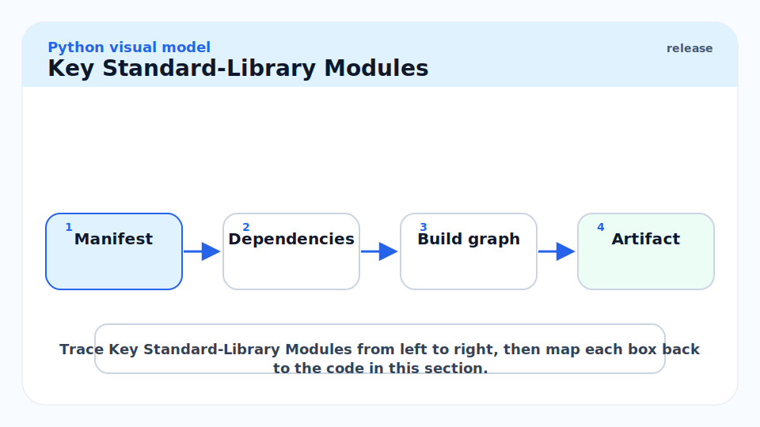
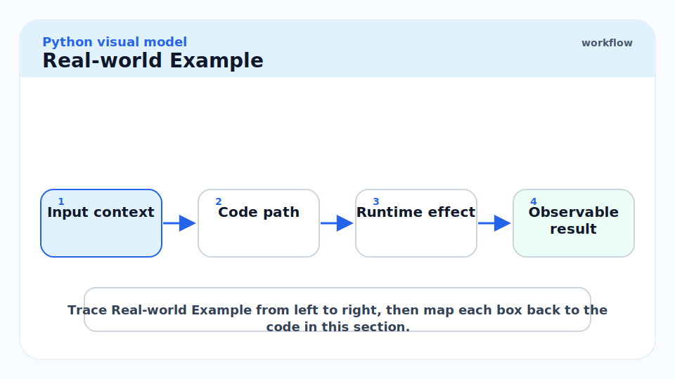
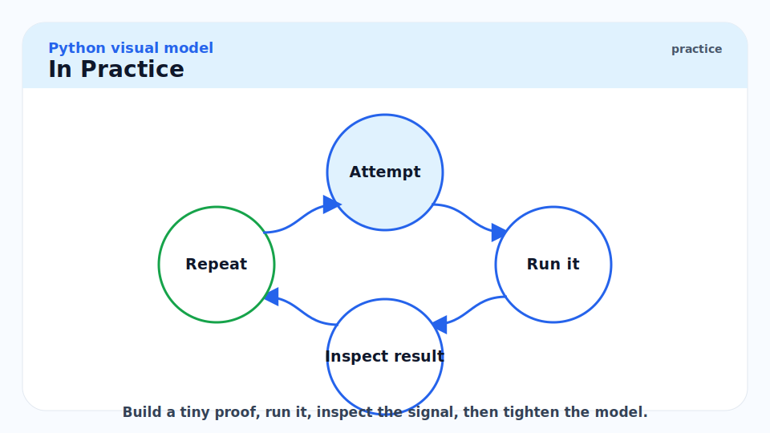
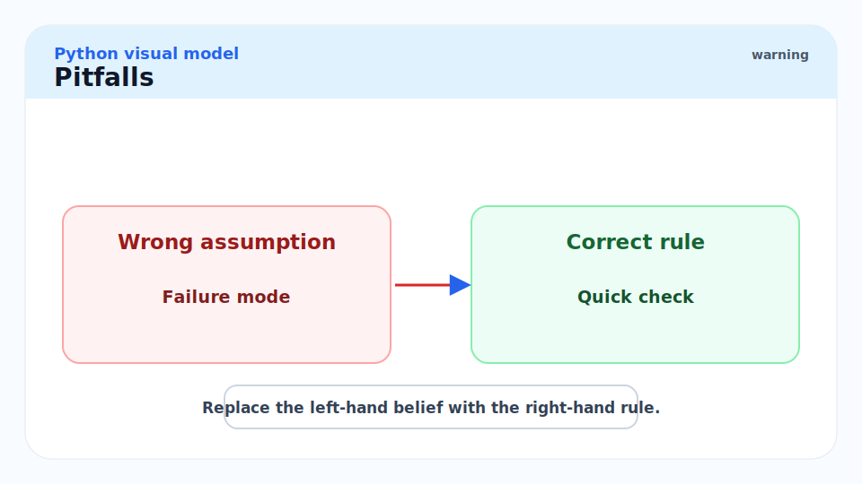
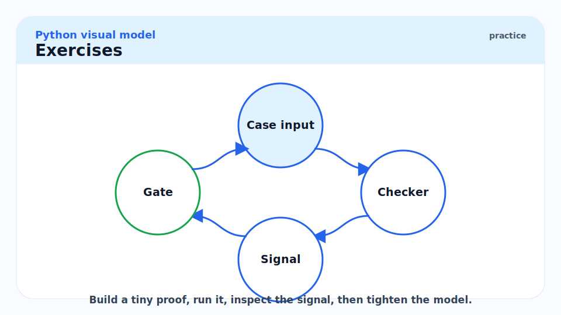

# 10 - Performance and the Standard Library

[toc]

> **TL;DR:** Python performance work starts with measurement (`timeit`, `cProfile`, `dis`), locates the bottleneck (almost always a small fraction of the code), and applies the minimum-invasive fix: vectorisation with NumPy, JIT with numba, or precompilation with Cython. The standard library's `collections`, `itertools`, `functools`, and `pathlib` replace entire categories of hand-rolled code with faster, idiomatic alternatives.

## Vocabulary



**`timeit`**: Standard-library module for micro-benchmarking small snippets. Runs the snippet many times and reports the best time per execution to reduce OS jitter.

---

**`cProfile`**: A deterministic profiler that counts calls and measures cumulative time per function. Low overhead; use for production profiling to find hot spots.

---

**`dis`**: The CPython bytecode disassembler. Shows the exact bytecode instructions CPython will execute for a function, revealing redundant loads, missed optimisations, and surprising instruction counts.

---

**`sys.getsizeof(obj)`**: Returns the memory footprint of `obj` in bytes — the object itself, not its contents. For containers, use `pympler.asizeof` or sum recursively.

---

**NumPy vectorisation**: Replacing Python-level loops with NumPy C-implemented array operations. The inner loop moves from Python bytecode to BLAS/LAPACK/SIMD — typically 10–100× faster for numerical code.

---

**numba `@jit`**: A LLVM-based JIT compiler that traces and compiles Python/NumPy functions to native machine code on first call. No rewrite required — just add a decorator.

---

**Cython**: A superset of Python that compiles to C, then to a `.so`. Adds optional static typing for near-C performance. Requires a build step.

---

**`collections.Counter`**: A dict subclass for counting hashable items. `most_common(n)` is O(n) via a heap.

---

**`collections.defaultdict`**: A dict that auto-creates values for missing keys using a factory callable.

---

**`collections.deque`**: A double-ended queue with O(1) append and popleft. Use instead of `list` when you need a FIFO queue (`.pop(0)` on a list is O(n)).

---

**`collections.OrderedDict`**: A dict that remembers insertion order. Since Python 3.7, plain `dict` is ordered too, but `OrderedDict` has `move_to_end` and a different `__eq__` (order-sensitive).

---

**`functools.lru_cache`**: A memoising decorator backed by a least-recently-used cache. Arguments must be hashable.

---

**`pathlib.Path`**: An object-oriented interface to filesystem paths. Replaces `os.path` string manipulation with method chaining and operator overloading (`/` for joining).

---

## Intuition



Python performance is a two-speed world. The slow tier is Python bytecode: roughly 50–200 million simple operations per second per core. The fast tier is C/Fortran/BLAS, accessed through libraries like NumPy, pandas, and PyTorch: 1–10 billion FLOP/s per core. The performance engineer's job is to push as much work as possible into the fast tier without rewriting in C.

The 80/20 rule holds acutely in Python: 20% of the code accounts for 80% of execution time. Profile first, always. The most impactful change is almost never what you expect.

## Measuring Performance



### `timeit` — Micro-benchmarks

`timeit` is for comparing two small implementations. It runs the code many times, reports the best time, and isolates the snippet from startup noise.

```python
import timeit

# Compare list comprehension vs generator expression for sum
stmt_list = "sum([x*x for x in range(1000)])"
stmt_gen  = "sum(x*x for x in range(1000))"

t_list = timeit.timeit(stmt_list, number=10_000)
t_gen  = timeit.timeit(stmt_gen,  number=10_000)
print(f"List: {t_list:.3f}s  Gen: {t_gen:.3f}s")
# Typically similar; list comprehension is slightly faster for sum() due to list's C-level iteration
```

### `cProfile` — Function-Level Profiling

`cProfile` instruments every function call and reports cumulative time. Use `cProfile` to find which functions to optimise; use `timeit` to verify the optimisation worked.

```python
import cProfile
import pstats
import io


def slow_function() -> list[int]:
    return sorted([i * i for i in range(100_000)], reverse=True)


# Profile and print top-10 functions by cumulative time
profiler = cProfile.Profile()
profiler.enable()
slow_function()
profiler.disable()

stream = io.StringIO()
stats = pstats.Stats(profiler, stream=stream)
stats.sort_stats("cumulative")
stats.print_stats(10)
print(stream.getvalue())

# From the command line:
# python3 -m cProfile -s cumtime myscript.py
```

### `dis` — Bytecode Inspection

`dis` reveals what CPython actually executes. Useful for understanding why a trivial expression has surprising overhead.

```python
import dis


def build_list() -> list[int]:
    return [x * 2 for x in range(10)]


dis.dis(build_list)
# RESUME          0
# BUILD_LIST      0
# LOAD_FAST       0 (range(10))  ← range call is outside the comprehension — wait, let's look...
```

```python
# Why attribute lookups are slow in loops
import dis

def fast_loop(items: list[str]) -> list[str]:
    result = []
    append = result.append  # cache the method — avoids repeated LOAD_ATTR
    for item in items:
        append(item.upper())
    return result

dis.dis(fast_loop)  # fewer LOAD_ATTR instructions vs result.append(...)
```

### `sys.getsizeof` — Memory Inspection

```python
import sys

print(sys.getsizeof([]))           # >>> 56   empty list header
print(sys.getsizeof([1, 2, 3]))    # >>> 88   3 slots (8 bytes each) + header
print(sys.getsizeof({}))           # >>> 64   empty dict
print(sys.getsizeof("hello"))      # >>> 54   str header + 5 bytes
print(sys.getsizeof(0))            # >>> 24   int object
```

`getsizeof` is shallow — it does not recursively measure contents. For total size of a nested structure, use `pympler.asizeof(obj)`.

## NumPy Vectorisation



The canonical optimisation for numerical Python code. Replace explicit for-loops over arrays with NumPy array operations that execute in C.

```python
import numpy as np
import timeit

N = 1_000_000

# SLOW: Python loop
def python_dot(a: list[float], b: list[float]) -> float:
    return sum(x * y for x, y in zip(a, b))

# FAST: NumPy vectorised
def numpy_dot(a: np.ndarray, b: np.ndarray) -> float:
    return float(np.dot(a, b))

a_list = list(range(N))
b_list = list(range(N))
a_np = np.arange(N, dtype=np.float64)
b_np = np.arange(N, dtype=np.float64)

t_py = timeit.timeit(lambda: python_dot(a_list, b_list), number=5)
t_np = timeit.timeit(lambda: numpy_dot(a_np, b_np), number=5)

print(f"Python: {t_py:.2f}s  NumPy: {t_np:.4f}s  Speedup: {t_py/t_np:.0f}x")
# >>> Python: 1.8s  NumPy: 0.003s  Speedup: ~600x
```

> [!TIP]
> The single most impactful NumPy optimisation is **eliminating Python-level loops over array elements**. Every `for x in numpy_array:` is slow because it boxes each C element into a Python `float`. Replace loops with broadcast operations, `np.where`, `np.sum(axis=...)`, or `np.apply_along_axis` — anything that keeps the inner loop in C.

## numba `@jit` — JIT Compilation



For code that cannot be vectorised into NumPy (irregular loops, tree traversals, custom reductions), `numba` JIT-compiles Python functions to LLVM IR → native code.

```python
import numba  # type: ignore[import-untyped]
import numpy as np


@numba.jit(nopython=True, cache=True)
def numba_sum_of_squares(n: int) -> float:
    total: float = 0.0
    for i in range(n):
        total += i * i
    return total


# First call: JIT compilation (~0.5s overhead)
# Subsequent calls: near-C speed
result = numba_sum_of_squares(10_000_000)
print(result)  # >>> 3.3333328333335e+20
```

`nopython=True` (required for maximum speed) means numba must be able to infer types for every variable. If it cannot, it raises a compilation error. `cache=True` writes the compiled code to disk so reloads are fast.

## Key Standard-Library Modules



### `collections`

```python
from collections import Counter, defaultdict, deque, namedtuple
from typing import Any

# Counter: frequency map
words = ["the", "cat", "sat", "on", "the", "mat", "the"]
c = Counter(words)
print(c.most_common(2))  # >>> [('the', 3), ('cat', 1)]

# defaultdict: no KeyError for missing keys
graph: defaultdict[str, list[str]] = defaultdict(list)
graph["a"].append("b")  # no need to check if "a" exists first

# deque: O(1) popleft (list.pop(0) is O(n))
q: deque[int] = deque(maxlen=3)
for i in range(5):
    q.append(i)
print(q)  # >>> deque([2, 3, 4], maxlen=3)

# namedtuple: lightweight record with named fields
Point = namedtuple("Point", ["x", "y"])
p = Point(3.0, 4.0)
print(p.x, p.y)  # >>> 3.0 4.0
```

### `itertools`

See [3 - Iterables, Iterators, and Generators](./3-iterables-iterators-and-generators.md) for the full treatment. Key additions here:

```python
import itertools

# pairwise (Python 3.10+): sliding window of size 2
seq = [1, 2, 3, 4, 5]
print(list(itertools.pairwise(seq)))  # >>> [(1,2),(2,3),(3,4),(4,5)]

# batched (Python 3.12+): chunking
print(list(itertools.batched(range(10), 3)))
# >>> [(0,1,2),(3,4,5),(6,7,8),(9,)]
```

### `functools`

```python
import functools
from typing import Any


# lru_cache: automatic memoisation
@functools.lru_cache(maxsize=128)
def fib(n: int) -> int:
    if n <= 1:
        return n
    return fib(n - 1) + fib(n - 2)

print(fib(50))             # fast
print(fib.cache_info())    # CacheInfo(hits=48, misses=51, maxsize=128, currsize=51)

# reduce: fold
print(functools.reduce(lambda a, b: a * b, range(1, 6)))  # >>> 120 (5!)

# partial: pre-fill arguments
from functools import partial
double = partial(lambda x, factor: x * factor, factor=2)
print(double(5))   # >>> 10
```

### `pathlib`

`pathlib.Path` replaces `os.path` string concatenation with operator-overloaded, method-chained objects.

```python
from pathlib import Path


def process_directory(root: Path) -> list[str]:
    """Read all .txt files and return their contents."""
    results: list[str] = []
    for path in sorted(root.glob("**/*.txt")):
        if path.stat().st_size > 0:
            results.append(path.read_text(encoding="utf-8"))
    return results


base = Path("/tmp/example")
base.mkdir(parents=True, exist_ok=True)
(base / "sub" / "file.txt").parent.mkdir(parents=True, exist_ok=True)
(base / "sub" / "file.txt").write_text("hello")
print(process_directory(base))
```

## Real-world Example



A realistic performance optimisation workflow: profile, locate the bottleneck, fix with NumPy, verify.

```python
import cProfile
import pstats
import io
import timeit
import numpy as np


# --- Original slow implementation ---
def slow_pairwise_distances(points: list[tuple[float, float]]) -> list[list[float]]:
    """O(n^2) pairwise Euclidean distances — pure Python."""
    n = len(points)
    dists: list[list[float]] = [[0.0] * n for _ in range(n)]
    for i in range(n):
        for j in range(n):
            dx = points[i][0] - points[j][0]
            dy = points[i][1] - points[j][1]
            dists[i][j] = (dx * dx + dy * dy) ** 0.5
    return dists


# --- Vectorised NumPy implementation ---
def fast_pairwise_distances(pts: np.ndarray) -> np.ndarray:
    """O(n^2) pairwise distances via broadcasting — all in C."""
    # pts: (n, 2)
    diff = pts[:, np.newaxis, :] - pts[np.newaxis, :, :]  # (n, n, 2)
    return np.sqrt((diff ** 2).sum(axis=-1))              # (n, n)


import random
n = 500
raw = [(random.random(), random.random()) for _ in range(n)]
pts_np = np.array(raw)

t_slow = timeit.timeit(lambda: slow_pairwise_distances(raw), number=3)
t_fast = timeit.timeit(lambda: fast_pairwise_distances(pts_np), number=3)
print(f"Pure Python: {t_slow:.2f}s | NumPy: {t_fast:.4f}s | Speedup: {t_slow/t_fast:.0f}x")
# >>> Pure Python: 0.85s | NumPy: 0.002s | Speedup: ~400x
```

> [!WARNING]
> NumPy broadcasting creates intermediate arrays. `pts[:, np.newaxis, :] - pts[np.newaxis, :, :]` creates an `(n, n, 2)` float64 array — for n=10,000 that is 1.6 GB. For very large n, use `scipy.spatial.distance.cdist` which implements the same computation without the intermediate, or chunk the computation.

## In Practice



**Profile in production with `py-spy`.** `py-spy top --pid <pid>` attaches to a running Python process without code modification and shows a live top-like view of hot functions. `py-spy record -o profile.svg --pid <pid>` generates a flame graph. Zero overhead on the traced process — ideal for production profiling.

**The `__slots__` + `namedtuple` + `dataclass(slots=True)` hierarchy.** For memory-sensitive code with millions of instances, `dataclass(slots=True)` (Python 3.10+) gives the ergonomics of `dataclass` with the memory savings of `__slots__`. Reduces per-instance overhead from ~200 bytes to ~56 bytes.

**`collections.deque` vs `list` for queues.** `list.insert(0, x)` and `list.pop(0)` are O(n) — they shift every element. `deque.appendleft(x)` and `deque.popleft()` are O(1). For any FIFO queue, use `deque`.

> [!CAUTION]
> `sys.setrecursionlimit` is a footgun. CPython's default is 1000. Deeply recursive code (tree traversal, parsing) hits this quickly. Raising it to 10,000 or 100,000 increases stack usage proportionally — a deep enough recursion will segfault the process (no Python exception, a C stack overflow). Convert deep recursion to iterative using an explicit stack (`collections.deque`) before raising the limit.

## Pitfalls



- **"I should optimise this loop."** — Only after profiling proves it is the bottleneck. Premature optimisation is the most common waste of Python engineering time.
- **"`timeit` measures real-world performance."** — `timeit` measures isolated snippet performance, not I/O, startup cost, or GC pressure. Use `cProfile` or `py-spy` for real-world profiling.
- **"NumPy is always faster than pure Python."** — For tiny arrays (n < 10), Python list operations can be faster due to NumPy's object-creation overhead. Profile at the target data size.
- **"`lru_cache` speeds up every function."** — Only if the function is called with the same arguments multiple times. If every call has unique arguments, `lru_cache` adds overhead with no benefit, and the cache grows unbounded if `maxsize=None`.
- **"Cython is the right first step."** — Only for highly specific numerical kernels that cannot be expressed as NumPy/numba. Cython requires a build step, C knowledge for type annotations, and creates a maintenance burden. NumPy → numba → Cython is the right escalation ladder.

## Exercises



### Exercise 1 — Identify the bottleneck

Using `cProfile`, identify which function is the bottleneck in the following code.

```python
import cProfile
import random

def generate_data(n: int) -> list[int]:
    return [random.randint(0, 1000) for _ in range(n)]

def count_evens(data: list[int]) -> int:
    return sum(1 for x in data if x % 2 == 0)

def process() -> int:
    data = generate_data(100_000)
    return count_evens(data)

cProfile.run("process()", sort="cumulative")
```

#### Solution

Run the code and read the `cProfile` output. `generate_data` will dominate because it calls `random.randint` 100,000 times — each is a Python function call with overhead. `count_evens` iterates with a generator, which is fast. The fix: replace `generate_data` with `np.random.randint(0, 1000, size=100_000)` — a single C call generating 100,000 values. The NumPy version is 10–50× faster for the generation step.

---

### Exercise 2 — `deque` vs list

Benchmark `list` vs `deque` for 10,000 `appendleft` + `popleft` operations.

#### Solution

```python
import timeit
from collections import deque

N = 10_000

t_list = timeit.timeit(
    stmt="for _ in range(N): lst.insert(0, 1); lst.pop(0)",
    setup=f"lst = []; N = {N}",
    number=10,
)

t_deque = timeit.timeit(
    stmt="for _ in range(N): dq.appendleft(1); dq.popleft()",
    setup=f"from collections import deque; dq = deque(); N = {N}",
    number=10,
)

print(f"list: {t_list:.3f}s  deque: {t_deque:.4f}s  speedup: {t_list/t_deque:.0f}x")
# >>> list: ~1.2s  deque: ~0.003s  speedup: ~400x
```

`list.insert(0, x)` shifts every element right — O(n). `deque.appendleft` is O(1) because a `deque` is a doubly-linked list of fixed-size blocks.

---

### Exercise 3 — `Counter` vs manual dict

Implement word counting two ways (manual dict vs `Counter`) and explain the performance trade-off.

#### Solution

```python
from collections import Counter
import timeit

text = "the quick brown fox jumps over the lazy dog " * 10_000

def manual_count(text: str) -> dict[str, int]:
    counts: dict[str, int] = {}
    for word in text.split():
        counts[word] = counts.get(word, 0) + 1
    return counts

def counter_count(text: str) -> Counter[str]:
    return Counter(text.split())

t_manual = timeit.timeit(lambda: manual_count(text), number=20)
t_counter = timeit.timeit(lambda: counter_count(text), number=20)
print(f"Manual: {t_manual:.3f}s  Counter: {t_counter:.3f}s")
```

`Counter` is implemented in C (since Python 3.10, `Counter.update` calls `_count_elements` in C). It is typically 1.5–2× faster than a pure-Python dict with `.get`. For very large inputs, `Counter` wins definitively. For tiny inputs, both are fast enough that the difference is irrelevant.

## Sources

- Python `timeit` documentation — https://docs.python.org/3/library/timeit.html
- Python `cProfile` and `pstats` — https://docs.python.org/3/library/profile.html
- Python `dis` module — https://docs.python.org/3/library/dis.html
- Python `collections` module — https://docs.python.org/3/library/collections.html
- Python `functools` module — https://docs.python.org/3/library/functools.html
- Python `pathlib` module — https://docs.python.org/3/library/pathlib.html
- numba documentation — https://numba.readthedocs.io/
- py-spy profiler — https://github.com/benfred/py-spy
- Raymond Hettinger, "Modern Python Dictionaries — A Confluence of a Half-Dozen Great Ideas" (PyCon 2017).
- Ramalho, L. *Fluent Python* (2nd ed., 2022). Chapter 2.

## Related

- [1 - What is Python](./1-what-is-python.md)
- [3 - Iterables, Iterators, and Generators](./3-iterables-iterators-and-generators.md)
- [8 - The GIL, Threads, Multiprocessing](./8-the-gil-threads-multiprocessing.md)
- [11 - Packaging, Tooling, Modern Workflows](./11-packaging-tooling-modern-workflows.md)
