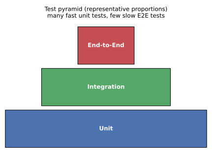
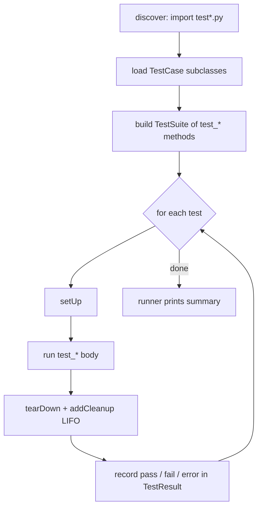
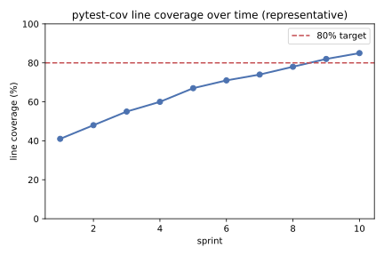
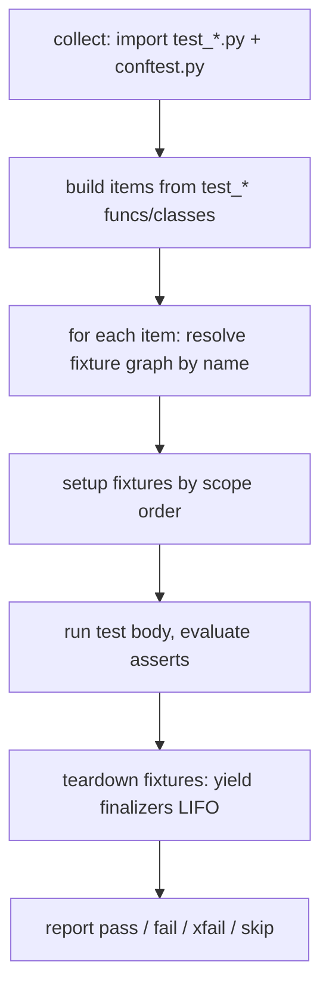
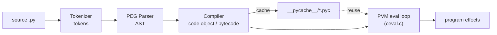

# Python Testing & Language Internals

[toc]

> **TL;DR:** Python's standard-library `unittest` (xUnit) and the de-facto `pytest` framework cover unit testing — fixtures, assertions, parametrization, mocking, and coverage — while CPython's internals show that Python is *compiled to bytecode, then interpreted* by the PVM. This note merges both: how to write and run tests, and what actually happens when your `.py` file runs.

## unittest / pyUnit

> **TL;DR:** `unittest` is Python's standard-library xUnit framework (a port of Kent Beck's JUnit/SUnit lineage, originally "PyUnit"). You subclass `unittest.TestCase`, write `test_*` methods that call rich `assert*` helpers, and let `setUp`/`tearDown` build and dispose of per-test fixtures. A discovery mechanism finds and runs tests; `unittest.mock` replaces collaborators so you can test a unit in isolation.

### Vocabulary

- **Test case** — the smallest unit of testing: one `TestCase` subclass; each `test_*` method is an independent test.
- **Fixture** — the fixed environment a test runs against (objects, temp files, DB connections), set up before and torn down after.
- **Assertion** — a check that raises `AssertionError` (carrying a diff) when an expected condition fails.
- **Test suite** — a collection of test cases/suites aggregated to run together.
- **Test runner** — the component that executes a suite and reports results (`TextTestRunner`, `unittest` CLI, or pytest).
- **Discovery** — automatic collection of tests from files matching `test*.py` under a start directory.
- **Mock / patch** — a stand-in object recording calls and returning canned values, swapped in via `unittest.mock.patch`.

### Intuition

Think of a test as a tiny experiment with three beats: *Arrange* the world (fixtures), *Act* on the unit under test, then *Assert* the observed result equals the expected one. `unittest` gives each beat a home: `setUp` arranges, the `test_*` body acts, and the `assert*` family asserts with helpful failure messages. Isolation is the goal — a failing test should pin the blame on exactly one unit, which is why we mock out slow or non-deterministic collaborators (network, clock, randomness).

The test pyramid captures the economics: many cheap, fast unit tests at the base, fewer integration tests in the middle, and a thin layer of slow end-to-end tests on top.



### How it works

`unittest` is built from four cooperating classes — `TestCase`, `TestSuite`, `TestLoader`, and `TestRunner` — plus a `TestResult` that accumulates outcomes. You normally touch only `TestCase`; the loader and runner are driven for you by the `python -m unittest` CLI.

#### Writing a TestCase

A test class subclasses `TestCase`; every method whose name starts with `test` becomes a runnable test, and the framework instantiates a *fresh* object per test method so state never leaks between them. Use the typed assertions rather than bare `assert`, because they produce readable diffs and the runner can distinguish a *failure* (assertion) from an *error* (unexpected exception).

```python
import unittest


def normalize(name: str) -> str:
    return name.strip().lower()


class TestNormalize(unittest.TestCase):
    def test_strips_and_lowercases(self) -> None:
        self.assertEqual(normalize("  Ada  "), "ada")

    def test_rejects_non_string(self) -> None:
        with self.assertRaises(AttributeError):
            normalize(None)  # type: ignore[arg-type]
```

#### setUp, tearDown, and class-level fixtures

`setUp` runs before *each* `test_*` method and `tearDown` after each, even if the test fails — ideal for per-test state you must not share. When construction is expensive and read-only, `setUpClass`/`tearDownClass` (decorated `@classmethod`) run once per class. The `addCleanup` method registers teardown callbacks in LIFO order and is safer than `tearDown` because cleanups registered before a failure still run.

```python
import tempfile
import unittest
from pathlib import Path


class TestConfigFile(unittest.TestCase):
    def setUp(self) -> None:
        self.tmp = tempfile.NamedTemporaryFile(mode="w", suffix=".ini", delete=False)
        self.addCleanup(lambda: Path(self.tmp.name).unlink(missing_ok=True))
        self.tmp.write("[app]\nname=demo\n")
        self.tmp.close()

    def test_file_has_name(self) -> None:
        text = Path(self.tmp.name).read_text(encoding="utf-8")
        self.assertIn("name=demo", text)
```

#### Discovery and running

The runner finds tests by pattern: from a start directory it imports every module matching `test*.py`, loads `TestCase` subclasses, and aggregates their `test_*` methods into a suite. Discovery requires the packages to be importable, so an `__init__.py` (or a proper `src` layout on `sys.path`) matters.

```bash
# Run everything discoverable under the current tree
python -m unittest discover -s tests -p "test_*.py" -v

# Run a single module, class, or method by dotted path
python -m unittest tests.test_config.TestConfigFile.test_file_has_name
```

The lifecycle a single test traverses during a run:



#### Isolating units with unittest.mock

`unittest.mock` lets you replace a collaborator with a `Mock`/`MagicMock` that records calls and returns whatever you configure, so a unit test never touches the real network or clock. `patch` temporarily rebinds a name *where it is looked up* (not where it is defined) for the duration of a test, then restores it. Always assert on the interaction (`assert_called_once_with`) as well as the return value.

```python
import unittest
from unittest.mock import patch


def latest_price(client) -> float:
    return client.get("/price")["usd"]


class TestLatestPrice(unittest.TestCase):
    def test_uses_client_and_parses(self) -> None:
        with patch.object(__import__("builtins"), "print"):  # noop example of patch scope
            fake = unittest.mock.Mock()
            fake.get.return_value = {"usd": 42.0}
            self.assertEqual(latest_price(fake), 42.0)
            fake.get.assert_called_once_with("/price")
```

### Real-world example

Scenario: a billing helper computes a discounted total and must reject negative quantities. We test the happy path, a boundary, a parametrized table via `subTest`, and an error condition — all runnable with `python -m unittest`.

```python
import unittest


def line_total(unit_price: float, qty: int, discount: float = 0.0) -> float:
    if qty < 0:
        raise ValueError("qty must be non-negative")
    if not 0.0 <= discount < 1.0:
        raise ValueError("discount out of range")
    return round(unit_price * qty * (1 - discount), 2)


class TestLineTotal(unittest.TestCase):
    def test_basic(self) -> None:
        self.assertEqual(line_total(10.0, 3), 30.0)

    def test_discount(self) -> None:
        self.assertAlmostEqual(line_total(10.0, 3, 0.1), 27.0)

    def test_table(self) -> None:
        cases = [(0.0, 5, 0.0), (2.5, 4, 0.5), (99.99, 0, 0.0)]
        expected = [0.0, 5.0, 0.0]
        for (price, qty, disc), want in zip(cases, expected):
            with self.subTest(price=price, qty=qty, disc=disc):
                self.assertEqual(line_total(price, qty, disc), want)

    def test_negative_qty_raises(self) -> None:
        with self.assertRaises(ValueError):
            line_total(10.0, -1)


if __name__ == "__main__":
    unittest.main(verbosity=2)
```

### In practice

In production codebases `unittest`-style `TestCase` classes are extremely common, but most teams run them under [pytest](#pytest) — pytest discovers and executes `unittest.TestCase` subclasses natively, giving richer output and plugins for free. `subTest` is the idiomatic way to keep a parametrized failure from aborting the rest of the loop; each sub-case reports independently. For coverage and CI gating, pair the runner with `coverage run -m unittest` or run it through tox across interpreter versions.

> [!TIP]
> Prefer `addCleanup(fn)` over `tearDown` for resource disposal. Cleanups registered before an exception still fire, and they run in LIFO order, which mirrors correct teardown of nested resources.

> [!IMPORTANT]
> `patch` must target the name *as imported by the module under test*. If `app.service` does `from db import connect`, you patch `app.service.connect`, **not** `db.connect` — otherwise the original is still bound inside the module and your mock is silently ignored.

### Pitfalls

- **Bare `assert` in tests** — works, but loses the rich diff and is stripped under `python -O`. Use `assertEqual`/`assertIn`/`assertRaises`.
- **Shared mutable fixtures** — putting state on the class body instead of `setUp` lets one test's mutation leak into the next; always build per-test state in `setUp`.
- **Patching the definition site** — see the IMPORTANT callout; patch where the name is looked up.
- **`assertTrue(a == b)`** — gives a useless "False is not True" message; use `assertEqual(a, b)` for the diff.
- **Forgetting `__init__.py`** — discovery silently skips packages it cannot import; verify with `-v`.
- **Floating-point `assertEqual`** — use `assertAlmostEqual` for floats to avoid representation flakiness.

## pytest

> **TL;DR:** `pytest` is the de-facto Python test framework: plain `assert` statements (rewritten at import time into rich, introspecting failures), a powerful dependency-injected **fixture** system, table-driven `@pytest.mark.parametrize`, markers for selection/skipping, `conftest.py` for shared scope, and a large plugin ecosystem (`pytest-cov`, `pytest-xdist`). It collects bare `test_*` functions and `unittest.TestCase` classes alike, so it is usually the runner even for legacy suites.

### Vocabulary

- **Test item** — a single collected test: a `test_*` function or method pytest will run.
- **Fixture** — a function decorated `@pytest.fixture` that provides a value/resource to any test that names it as a parameter (dependency injection).
- **Scope** — a fixture's lifetime: `function` (default), `class`, `module`, `package`, or `session`.
- **Parametrize** — generating multiple test items from one function over a table of inputs.
- **Marker** — metadata on a test (`@pytest.mark.slow`, `skip`, `xfail`) used for selection and behavior.
- **`conftest.py`** — a directory-local plugin file pytest auto-loads to share fixtures/hooks without imports.
- **Assertion rewriting** — pytest's bytecode transform that explodes `assert a == b` into a detailed diff.

### Intuition

pytest's design bet is that tests should look like ordinary Python functions, not framework ceremony. You write `assert result == expected`; an import hook rewrites the assert so that on failure pytest can show *both* operands and a structural diff — no `assertEqual` needed. Resources a test needs are *requested by name*: declare a parameter, and pytest finds a fixture of that name and injects it, building a dependency graph it resolves and tears down for you.

Coverage is the headline health metric teams watch over time; `pytest-cov` wires Coverage.py into the run.



### How it works

pytest runs in two phases: **collection** (walk the tree, import `test_*.py`, gather items) and **execution** (for each item, resolve its fixtures, run it, report). The fixture resolver is the interesting part — it forms a directed graph of fixture dependencies and instantiates each at most once per its scope.



#### Plain asserts and rewriting

Because of assertion rewriting you use Python's `assert` directly and still get framework-quality failure output. pytest intercepts the import, rewrites comparison asserts to capture sub-expressions, and renders a diff when they fail. There is nothing to import for assertions.

```python
def slugify(s: str) -> str:
    return "-".join(s.lower().split())


def test_slugify_basic() -> None:
    assert slugify("Hello World") == "hello-world"
```

#### Fixtures: setup, teardown, scope

A fixture is a provider function; a test that wants its value simply lists the fixture name as a parameter. Using `yield` splits the fixture into setup (before the `yield`) and teardown (after), and teardown runs even if the test fails. `scope=` controls how often the fixture is rebuilt — a `session` fixture is created once for the whole run, ideal for expensive shared resources.

```python
import pytest


@pytest.fixture
def tmp_user(tmp_path):  # tmp_path is a built-in fixture
    path = tmp_path / "user.txt"
    path.write_text("ada", encoding="utf-8")
    yield path            # setup done; value injected here
    path.unlink()         # teardown after the test


def test_user_file(tmp_user) -> None:
    assert tmp_user.read_text(encoding="utf-8") == "ada"


@pytest.fixture(scope="session")
def db_engine():
    engine = {"connected": True}   # stand-in for an expensive resource
    yield engine
    engine["connected"] = False
```

#### Parametrize and markers

`@pytest.mark.parametrize` turns one function into many test items — a table of `(input, expected)` rows, each reported independently so one failing row does not hide the others. Markers attach metadata: `skip`/`skipif` exclude tests conditionally, `xfail` records a known failure without breaking the build, and custom markers (registered in config) drive selection with `-m`.

```python
import sys
import pytest


@pytest.mark.parametrize(
    "value,expected",
    [(0, "even"), (1, "odd"), (2, "even"), (-3, "odd")],
)
def test_parity(value: int, expected: str) -> None:
    assert ("even" if value % 2 == 0 else "odd") == expected


@pytest.mark.skipif(sys.platform == "win32", reason="POSIX-only path test")
def test_posix_only() -> None:
    assert "/" in "/etc/hosts"


@pytest.mark.xfail(reason="known rounding bug, tracked in #123")
def test_known_bug() -> None:
    assert round(0.1 + 0.2, 1) == 0.3
```

#### conftest.py and plugins

`conftest.py` is auto-discovered per directory: any fixture or hook defined there is available to tests in that directory and below, with no import. This is how you share a `client` or `db` fixture across a package. Plugins extend collection and reporting — `pytest-cov` adds coverage, `pytest-xdist` parallelizes across CPUs with `-n auto`.

```python
# tests/conftest.py
import pytest


@pytest.fixture
def api_client():
    return {"base_url": "http://localhost", "session": object()}
```

```bash
# Coverage with a fail-under gate, parallel across cores
pytest --cov=myapp --cov-report=term-missing --cov-fail-under=80 -n auto

# Run only tests marked "slow", verbose, stop on first failure
pytest -m slow -v -x
```

### Real-world example

Scenario: test a pure pricing function and an HTTP-ish service. We use a fixture for the client, parametrize the discount table, and assert with plain `assert`. The whole file runs under `pytest` with no boilerplate base class.

```python
import pytest


def line_total(unit_price: float, qty: int, discount: float = 0.0) -> float:
    if qty < 0:
        raise ValueError("qty must be non-negative")
    return round(unit_price * qty * (1 - discount), 2)


@pytest.fixture
def cart():
    return {"items": []}


@pytest.mark.parametrize(
    "price,qty,disc,want",
    [(10.0, 3, 0.0, 30.0), (10.0, 3, 0.1, 27.0), (2.5, 4, 0.5, 5.0)],
)
def test_line_total(price, qty, disc, want) -> None:
    assert line_total(price, qty, disc) == want


def test_negative_qty_raises() -> None:
    with pytest.raises(ValueError, match="non-negative"):
        line_total(10.0, -1)


def test_cart_fixture_is_empty(cart) -> None:
    assert cart["items"] == []
```

### In practice

pytest is the default in modern Python projects and is typically orchestrated by tox across interpreter versions and dependency sets. It collects [unittest / pyUnit](#unittest--pyunit) `TestCase` subclasses unchanged and can run doctest examples with `--doctest-modules`, so a single `pytest` invocation can cover all three styles. For speed, `pytest-xdist` (`-n auto`) shards the suite across cores; for signal, `pytest-cov` enforces a coverage floor in CI.

> [!TIP]
> Pick the *widest* fixture scope that is still correct. A `session`-scoped database fixture built once can cut suite time dramatically — but only if tests do not mutate shared state. Reach for `function` scope the moment isolation matters.

> [!IMPORTANT]
> `@pytest.mark.xfail` records an *expected* failure: the suite stays green while the bug exists, and pytest reports `XPASS` (loudly, if you set `strict=True`) the moment it starts passing. Use it to track known bugs without disabling the test — unlike `skip`, the code still executes.

### Pitfalls

- **Fixture scope too narrow** — rebuilding an expensive resource per function silently bloats runtime; widen the scope when state is read-only.
- **Mutable session fixtures** — a broadly scoped fixture mutated by one test corrupts later tests; never share writable state at `session` scope.
- **Unregistered markers** — custom `@pytest.mark.foo` warns (or errors under `--strict-markers`) unless declared in config.
- **`assert a is b` for values** — `is` checks identity, not equality; use `==` unless you mean identity.
- **Catch-all `pytest.raises`** — without `match=`, a `raises` block can pass on the *wrong* exception of the right type; pin the message.
- **Import-mode confusion** — duplicate test filenames across packages without `__init__.py` collide; prefer the `importlib` import mode or unique names.

## How Python Compiles and Executes

> **TL;DR:** Python is *not* "interpreted line by line." CPython **compiles** your source into **bytecode** (a compact instruction set for a virtual machine), caches it in `.pyc` files, and then a C loop called the **evaluation loop** interprets that bytecode on the **Python Virtual Machine (PVM)**. So Python is *compiled to bytecode, then interpreted* — a two-stage model, like Java, not like raw C.

### Vocabulary

- **CPython** — the reference implementation of Python, written in C. When people say "Python," they almost always mean CPython. Alternatives (PyPy, Jython, GraalPy) compile/execute differently.
- **Bytecode** — a low-level, platform-independent instruction stream (e.g. `LOAD_FAST`, `BINARY_OP`, `RETURN_VALUE`) that the PVM executes. Not machine code; it still needs the VM.
- **AST (Abstract Syntax Tree)** — a tree representation of the parsed program where each node is a syntactic construct (a `Call`, an `If`, a `BinOp`).
- **Code object** — the compiled unit (`__code__`) holding bytecode, constants, names, and metadata for one function/module.
- **PVM (Python Virtual Machine)** — the stack-based evaluation loop in `ceval.c` that fetches and executes bytecode opcodes.

```math
\text{source.py} \;\xrightarrow{\text{compile}}\; \text{bytecode} \;\xrightarrow{\text{interpret (PVM)}}\; \text{effects}
```

### Intuition

Think of CPython as a tiny two-pass machine: first a **compiler** turns your readable text into terse numbered instructions for a make-believe CPU, then a **virtual CPU** (the PVM) runs those instructions one at a time. The compile pass happens once and is cached; the run pass happens every time, opcode by opcode. This is why a syntax error is caught *before* any of your code runs (it fails at compile), but a `NameError` only fires *when* the offending line executes.

### How it works

CPython's pipeline has four stages between your text file and observable behavior. Each stage has a concrete, inspectable artifact — you can see the tokens, the tree, and the bytecode from the standard library. The crucial mental correction: the "compiler" produces **bytecode**, never native machine code, and an interpreter loop still drives execution.

#### 1. Tokenize (lexing)

The tokenizer scans raw characters and groups them into **tokens** — names, operators, numbers, and the indentation-derived `INDENT`/`DEDENT` tokens that give Python its block structure. This is where significant whitespace becomes explicit structure rather than mere formatting.

```python
import tokenize, io
src = "x = 1 + 2\n"
for tok in tokenize.generate_tokens(io.StringIO(src).readline):
    print(tok.type, tokenize.tok_name[tok.type], repr(tok.string))
```

#### 2. Parse to an AST

The parser (a PEG parser since Python 3.9) consumes tokens and builds an **AST**. The `ast` module exposes this tree, which is also what tools like linters and `black` operate on. A `SyntaxError` is raised here — before any execution.

```python
import ast
tree = ast.parse("x = 1 + 2")
print(ast.dump(tree, indent=2))   # Module(body=[Assign(targets=[Name(id='x'...)], value=BinOp(...))])
```

#### 3. Compile to bytecode

The compiler walks the AST and emits a **code object** containing bytecode plus its constants and names. `compile()` exposes this directly, and `dis` disassembles it into human-readable opcodes. Note the constant folding: `1 + 2` may already be the constant `3`.

```python
import dis
code = compile("x = 1 + 2", "<demo>", "exec")
print(code.co_consts)     # (3, None)  -> folded at compile time
dis.dis(code)             # LOAD_CONST 3 / STORE_NAME x / ...
```

#### 4. Execute on the PVM

The PVM is a **stack machine**: opcodes push/pop values on an evaluation stack. The C-level loop in `ceval.c` fetches each opcode and runs its handler until `RETURN_VALUE`. This loop is where Python "runs," and (pre-free-threading) where the [GIL](./09-concurrency.md) is held.

```python
def add(a, b):
    return a + b
dis.dis(add)
# LOAD_FAST a ; LOAD_FAST b ; BINARY_OP + ; RETURN_VALUE
```

### The pipeline at a glance

The whole flow, plus the `.pyc` cache that lets CPython skip recompilation when the source is unchanged, looks like this:




### Real-world example

Scenario: you import a module twice across two runs and want to prove CPython compiles once and reuses the cached bytecode. The first import writes `__pycache__/mymod.cpython-XYZ.pyc`; the second run loads it directly when the source `mtime`/hash is unchanged, skipping stages 1–3 entirely.

```python
import py_compile, dis, marshal, importlib.util

# 1) Compile a source file to a .pyc explicitly.
with open("mymod.py", "w") as f:
    f.write("def sq(n):\n    return n * n\n")
pyc_path = py_compile.compile("mymod.py")   # writes __pycache__/mymod.cpython-*.pyc
print("cached bytecode at:", pyc_path)

# 2) Read the cached code object back and disassemble it (no recompilation).
with open(pyc_path, "rb") as f:
    f.read(16)                       # skip the 16-byte header (magic, flags, mtime, size)
    code = marshal.load(f)           # the module's code object
dis.dis(code)                        # shows MAKE_FUNCTION for sq, etc.
```

> [!IMPORTANT]
> A `.pyc` is just cached bytecode keyed to the source and the interpreter version (the "magic number" in the header). It is **not** a faster, optimized, or hidden form of your program — delete `__pycache__/` and Python simply recompiles. Shipping `.pyc` without source does not meaningfully protect or speed up code.

### In practice

- **Startup vs steady state.** Caching bytecode in `__pycache__` makes repeat imports cheap; it does nothing for the cost of the eval loop on hot code paths.
- **Why Python is "slow."** Each opcode is a C function dispatch with boxed (`PyObject*`) operands. That indirection — not the compile step — is the real overhead, which is why C extensions, NumPy, and JITs win.
- **CPython 3.11+ specializing adaptive interpreter (PEP 659).** The eval loop now rewrites hot opcodes into type-specialized "superinstructions" at runtime (e.g. `BINARY_OP` → `BINARY_OP_ADD_INT`), a quasi-JIT that sped up 3.11 by ~10–60% with no source change. 3.13 adds an experimental copy-and-patch JIT.
- **Other implementations differ.** PyPy is a tracing JIT that emits native machine code for hot loops; Jython/GraalPy target the JVM/GraalVM. The *language* is the same; the execution model is not.

> [!TIP]
> Reach for `dis.dis(fn)` whenever you want to know what a line "really does" — it settles arguments about which idiom is faster (e.g. `a += b` vs `a = a + b`, or comprehension vs loop) far better than guessing.

### Pitfalls

- **"Python is interpreted, not compiled."** — Misleading. It *is* compiled — to bytecode — then interpreted by the PVM. Both halves are true; neither alone is.
- **"`.pyc` files are optimized/protected machine code."** — No. They are version-keyed cached bytecode; the VM still interprets them and source trivially reproduces them.
- **"A syntax error somewhere runs everything before it first."** — No. The whole module is compiled before any of it executes, so a `SyntaxError` anywhere prevents the module from running at all (unlike a runtime `NameError`).
- **"`compile`/`exec` are exotic."** — They're the same machinery the interpreter uses on every file; `exec(compile(...))` just exposes it.

## Sources

- Python docs — `unittest`: <https://docs.python.org/3/library/unittest.html>
- Python docs — `unittest.mock`: <https://docs.python.org/3/library/unittest.mock.html>
- Kent Beck, *Simple Smalltalk Testing: With Patterns* (SUnit, the xUnit origin).
- pytest docs: <https://docs.pytest.org/>
- pytest fixtures: <https://docs.pytest.org/en/stable/how-to/fixtures.html>
- pytest-cov: <https://pytest-cov.readthedocs.io/>
- pytest-xdist: <https://pytest-xdist.readthedocs.io/>
- CPython internals — design of the compiler: `https://devguide.python.org/internals/compiler/`
- `dis` — Disassembler for Python bytecode: `https://docs.python.org/3/library/dis.html`
- `ast` — Abstract Syntax Trees: `https://docs.python.org/3/library/ast.html`
- PEP 659 — Specializing Adaptive Interpreter: `https://peps.python.org/pep-0659/`
- Cached bytecode / `__pycache__`: `https://docs.python.org/3/reference/import.html#cached-bytecode-invalidation`

## Related

- [Modules, Regex & Paradigms](./04-modules-regex-paradigms.md)
- [Language Basics](./01-language-basics.md)
- [Concurrency (GIL)](./09-concurrency.md)
- [Advanced Functions (Variable Scope)](./03-advanced-functions.md)
- [File Handling & Web Frameworks (FastAPI)](./10-file-handling-and-web-frameworks.md)
