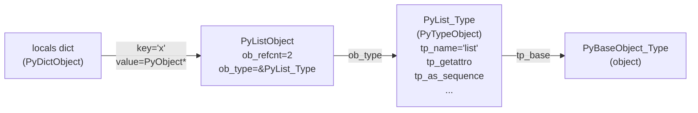
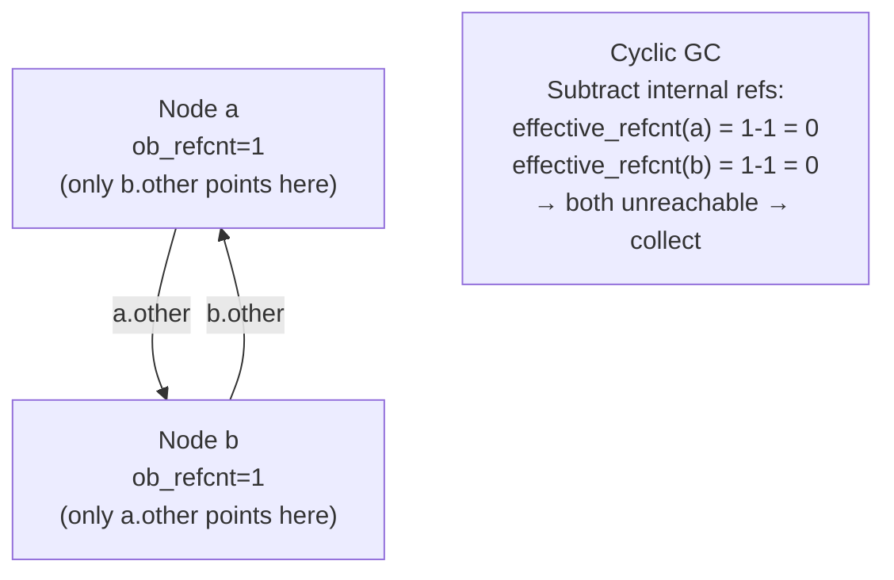

# 13 - Memory Model and PyObject Layout

[toc]

> **TL;DR:** Every Python value is a `PyObject` C struct on the heap. A variable is a name in a namespace dictionary holding a pointer to that struct — not a typed memory slot containing a value. CPython manages object lifetimes through reference counting (`ob_refcnt`), with a supplemental generational GC to break reference cycles. Understanding the byte layout of `PyObject`, `PyListObject`, `PyDictObject`, and `PyLongObject` explains every identity, aliasing, and memory-cost puzzle you will encounter in production Python.

## Vocabulary

**PyObject**: The C struct at the base of every CPython object. Contains at minimum `ob_refcnt` (reference count) and `ob_type` (pointer to the type object). All other object types embed this struct as their first member.

---

**ob_refcnt**: A `uint32_t` (CPython 3.12+ on 64-bit; historically `Py_ssize_t`) that tracks how many live pointers reference this object. When it reaches zero, `tp_dealloc` is called immediately.

---

**ob_type** (`PyTypeObject *`): A pointer to the type object that describes this object's behaviour — its methods, its size, its allocation function, its deallocation function. The type object is itself a PyObject.

---

**PyVarObject**: Extension of `PyObject` with an additional `ob_size` field (`Py_ssize_t`) for variable-length objects: `int` (digit array), `tuple` (element array), `str` (character data).

---

**Small-integer cache**: CPython pre-allocates singleton `PyLongObject` instances for integers in the range −5 to 256 inclusive. Any expression producing a value in this range returns the pre-existing object.

---

**String interning**: CPython automatically deduplates string literals that look like Python identifiers (pure ASCII, no spaces). `sys.intern(s)` forces interning for any string.

---

**Reference counting**: The primary memory management strategy. Every pointer copy increments `ob_refcnt`; every pointer deletion decrements it. Zero refcount → immediate deallocation. O(1) per operation, deterministic.

---

**Cyclic GC**: The supplemental garbage collector in the `gc` module. Runs periodically to detect and collect reference cycles — groups of objects whose only incoming references are from within the group itself. Generational: three generations with thresholds (default 700/10/10).

---

**Namespace dict**: A `dict` object mapping names (strings) to object pointers. Every module, function call frame, and class body has one. `locals()`, `globals()`, and `vars()` expose these.

---

**id(obj)**: Returns the memory address of the PyObject in CPython. Unique and constant for the lifetime of the object. After deallocation, a new object may receive the same address.

---

**Shallow copy**: A new container object whose elements are the same object pointers as the original. `list.copy()`, `dict.copy()`, `copy.copy()`. The container is independent; the contents are aliased.

---

**Deep copy**: A recursively independent copy of the entire object graph. `copy.deepcopy()`. Every mutable object reachable from the root is duplicated.

---

## Intuition

Python variables are sticky notes, not boxes. When you write `x = [1, 2, 3]`, Python builds a list object somewhere on the C heap and sticks the label `x` on it. `y = x` pastes a second label on the same heap object. The object has no idea how many labels it has — that count lives in `ob_refcnt`. When both labels are removed, the object's refcount hits zero and the memory is reclaimed immediately.

The type pointer (`ob_type`) is what makes duck typing work. When you call `len(x)`, CPython does not inspect `x`'s Python-level class name. It reads `x->ob_type->tp_as_sequence->sq_length` — a C function pointer — and calls it directly. Every Python operation dispatches through this table. The type object is the dispatch table; the instance is just the data.

## How it Works

### The PyObject Header

Every object in CPython begins with the same two fields. In CPython 3.12 on a 64-bit system, the header occupies 16 bytes. Newer CPython (3.13+ free-threaded build) adds per-thread reference count fields, but the canonical layout for the standard GIL build is:

```c
/* Simplified from Include/object.h */
struct _object {
    uint32_t  ob_refcnt;   /* 4 bytes — reference count */
    uint16_t  ob_overflow; /* 2 bytes — overflow for large refcounts */
    uint16_t  ob_flags;    /* 2 bytes — GC flags, immortal bit */
    PyTypeObject *ob_type; /* 8 bytes — pointer to type */
};
/* Total: 16 bytes */

/* Variable-length objects add one more field: */
struct PyVarObject {
    PyObject ob_base;      /* 16 bytes */
    Py_ssize_t ob_size;    /* 8 bytes — number of items */
};
/* Total: 24 bytes */
```

> [!IMPORTANT]
> `ob_refcnt` becoming zero triggers `tp_dealloc` *synchronously*, in the same C stack frame as the decrement. There is no collector pause, no finalisation queue, no "next GC cycle." This is what makes Python's `with` statement and `__del__` reliable for resource management — the destructor runs at a deterministic point.

### int — PyLongObject

Python integers are arbitrary-precision. CPython stores them as a variable-length array of 30-bit digits (base 2^30). Small integers (−5..256) bypass allocation entirely — their singleton objects are pre-allocated at interpreter startup.

```
 0            8           16       24          ...
┌─────────────┬────────────┬────────┬───────────┐
│  ob_refcnt  │  ob_type   │ob_size │ digit[0]  │ ...
│  4+2+2 bytes│  8 bytes   │8 bytes │ 4 bytes ea│
└─────────────┴────────────┴────────┴───────────┘
   PyObject_HEAD (16 B)   PyVar   digits
```

`sys.getsizeof(0)` → 24 bytes (header + ob_size, no digits).
`sys.getsizeof(2**30)` → 28 bytes (one digit).
`sys.getsizeof(2**60)` → 32 bytes (two digits).

### float — PyFloatObject

Floats are fixed-size: the header plus a single C `double`. No digit array, no arbitrary precision.

```
 0            16          24
┌─────────────┬────────────┐
│  PyObject   │  ob_fval   │
│   16 bytes  │  8 bytes   │
└─────────────┴────────────┘
```

`sys.getsizeof(3.14)` → 24 bytes on 64-bit.

### str — PyUnicodeObject

CPython 3.3+ uses a compact string representation. The object header is followed by a metadata word (length, hash cache, interned flag, encoding kind), then the character data inlined immediately after. Short ASCII strings interned by CPython become singletons.

```
┌──────────┬───────────┬────────────┬──────────────────────────┐
│ PyObject │  ob_size  │  metadata  │  character data (inline) │
│  16 B    │   8 B     │  (flags,   │  1, 2, or 4 bytes/char   │
│          │           │  hash, ...) │  depending on max codepoint │
└──────────┴───────────┴────────────┴──────────────────────────┘
```

`sys.getsizeof("hello")` → 54 bytes. The character data for ASCII strings uses 1 byte per character; Latin-1 strings 1 byte; BMP strings 2 bytes (UCS-2); full Unicode 4 bytes (UCS-4).

### tuple — PyTupleObject

A tuple is a `PyVarObject` followed immediately by an array of `ob_size` PyObject pointers. The array is immutable after construction.

```
┌──────────┬───────────┬────────────────────────────────────┐
│ PyObject │  ob_size  │  ob_item[0] … ob_item[n-1]         │
│  16 B    │   8 B     │  8 bytes each (PyObject* pointers)  │
└──────────┴───────────┴────────────────────────────────────┘
```

`sys.getsizeof(())` → 40 bytes (empty tuple, header + zero items).
`sys.getsizeof((1, 2, 3))` → 64 bytes (40 + 3 × 8 pointer bytes).

### list — PyListObject

A list separates the container header from the element array. The header holds the current length and a pointer to a separately heap-allocated array of PyObject pointers. The array is over-allocated to support O(1) amortised append.

```
┌──────────┬────────────┬──────────┬──────────────────────────────┐
│ PyObject │ *ob_item   │ allocated│  (ob_item is a separate heap │
│  16 B    │  8 B ptr   │  8 B     │   allocation: PyObject*[])   │
└──────────┴────────────┴──────────┴──────────────────────────────┘
                │
                ▼ (separate heap block)
┌──────────────────────────────────────────────────────────────────┐
│  PyObject*[0]  │  PyObject*[1]  │  ...  │  PyObject*[allocated-1]│
│  8 bytes each                                                     │
└──────────────────────────────────────────────────────────────────┘
```

`sys.getsizeof([])` → 56 bytes (header + ob_item ptr + allocated).
`sys.getsizeof([1, 2, 3])` → 88 bytes (56 + over-allocated pointer array; typically 4 slots allocated for 3 items).

> [!NOTE]
> The list's element array is a separate heap allocation. This is why `list.copy()` is a shallow copy: it allocates a new PyListObject and a new pointer array, but copies the same PyObject pointers. The pointed-to objects are not duplicated.

### dict — PyDictObject (compact layout, Python 3.7+)

Python 3.6 introduced the compact dict layout (formalised as language spec in 3.7). A dict stores keys in insertion order by separating the sparse hash index (an array of small integers pointing into a dense entries array) from the key/value storage.

```
PyDictObject header (16 B PyObject + metadata)
    │
    ├── ma_used     (int64 — number of live items)
    ├── ma_version  (uint64 — modification counter)
    └── ma_keys ──────────────────────────────────────────────────┐
                                                                   │
                                                       PyDictKeysObject
                                                       ┌──────────────────────────────┐
                                                       │ dk_size  (hash table size)   │
                                                       │ dk_nentries (used entries)   │
                                                       │ dk_indices[] — sparse array  │
                                                       │   maps hash_slot → entry idx │
                                                       │ dk_entries[] — dense array   │
                                                       │   [hash|key_ptr|value_ptr]   │
                                                       └──────────────────────────────┘
```

The `dk_indices` array is the hash table (open addressing). Each slot stores a small integer (the index into `dk_entries`), allowing the dense array to stay compact. This layout preserves insertion order while keeping hash lookup O(1).

## Reference Counting in Motion

Let's trace what CPython actually does to `ob_refcnt` through a sequence of operations. Each assignment, container insertion, function call argument, and return value increments the refcount of the object involved.

```python
import sys

# After: x = [1, 2]
# A new PyListObject is created, ob_refcnt = 1 (the name 'x' in locals)
x: list[int] = [1, 2]
print(sys.getrefcount(x))  # 2: x + the getrefcount argument

# After: y = x
# No new object; ob_refcnt incremented to 2
y = x
print(sys.getrefcount(x))  # 3: x + y + the getrefcount argument

# After: del x
# ob_refcnt decremented to 1; object lives on via y
del x
print(sys.getrefcount(y))  # 2: y + the getrefcount argument

# After: y[0] = 99
# The integer object at y[0] has its refcount decremented (old value removed),
# and the new int(99) has its refcount incremented.
y[0] = 99
print(y)  # [99, 2]
```

> [!NOTE]
> `sys.getrefcount(x)` always reports one more than you intuitively expect. Passing `x` as an argument creates a temporary reference inside the function's frame, valid for the duration of the call. This is not a bug — it is the accurate count at that moment. When reasoning about refcounts, always subtract 1 from `getrefcount`'s result to get the "outside" count.

### The Refcount Lifecycle (Mermaid)

**Figure:** Reference count lifecycle for a list object.

```mermaid
stateDiagram-v2
    [*] --> Alive : x = [1,2]\nob_refcnt = 1
    Alive --> HighRef : y = x\nob_refcnt = 2
    HighRef --> Alive : del x\nob_refcnt = 1
    Alive --> [*] : del y\nob_refcnt = 0\ntp_dealloc called
    HighRef --> [*] : del x; del y\nob_refcnt = 0\ntp_dealloc called
```



### The Namespace → Reference → Object Chain

**Figure:** How a name resolves to a PyObject at the C level.



## The Cyclic Garbage Collector

Reference counting alone leaks memory when objects form cycles. The classic pattern is two objects each holding a reference to the other, with no external names pointing to either. Both have `ob_refcnt = 1` even when they are unreachable.

```python
import gc

# Create a cycle: a references b, b references a
class Node:
    def __init__(self, name: str) -> None:
        self.name = name
        self.other: "Node | None" = None

a = Node("a")
b = Node("b")
a.other = b   # b's ob_refcnt incremented to 2
b.other = a   # a's ob_refcnt incremented to 2

# Both local names deleted — refcounts drop to 1 (cycle remains)
del a
del b

# The cycle GC is what collects this
gc.collect()  # force a collection cycle
```

The generational GC works by tracking all "container" objects (objects that can hold references: lists, dicts, sets, classes, instances). It maintains three generations:

- **Generation 0** (youngest): new objects. Threshold 700.
- **Generation 1**: survived one gen-0 collection. Threshold 10.
- **Generation 2** (oldest): long-lived objects. Threshold 10.

When generation 0's count exceeds its threshold, a gen-0 collection runs. After 10 gen-0 collections, a gen-1 collection runs, which includes gen-0. After 10 gen-1 collections, gen-2 runs. The GC subtracts internal reference counts (references from within a candidate cycle) from `ob_refcnt`; objects with a resulting count of zero are unreachable and collected.

**Figure:** Cycle GC candidate graph (Mermaid).



> [!WARNING]
> Defining `__del__` on a class that participates in a reference cycle historically prevented collection (Python 2, early Python 3). Since Python 3.4, objects with `__del__` can be collected as part of a cycle via `tp_finalize`. However, the finaliser order is unspecified. Do not rely on `__del__` for resource cleanup in cyclic structures — use context managers instead.

## id() is the Memory Address

In CPython, `id(obj)` returns the integer value of the C pointer to the PyObject. Two consequences:

1. `a is b` is exactly `id(a) == id(b)` — same object, same address.
2. After an object is deallocated, a new object may receive the same address, making the old `id` value reappear. Never hold `id` values for comparison after the object might have died.

```python
# Small-int cache: addresses are the same
a = 100
b = 100
print(id(a) == id(b))   # True — same singleton object

# Above cache range: fresh allocations
a = 1000
b = 1000
print(id(a) == id(b))   # False — two distinct PyLongObjects

# Address reuse after deallocation
x = object()
addr = id(x)
del x
y = object()
print(id(y) == addr)    # May be True! CPython's allocator reuses blocks.
```

> [!CAUTION]
> Never use `id()` as a surrogate for object equality in production code. After deallocation, a new object can land at the same address. Code like `if id(obj) in seen_ids` is silently broken because `seen_ids` may contain addresses of already-dead objects that a new live object has reused.

## Mutability and Aliasing at the Byte Level

Two names, one object — aliasing is the default for any assignment to a mutable object.

```
After: x = [1, 2, 3]; y = x

 locals dict
┌──────┬──────────────────────────┐
│  x   │  ptr ─────────────────┐  │
├──────┼───────────────────────│──┤
│  y   │  ptr ─────────────────┘  │
└──────┴──────────────────────────┘
                                │
                                ▼
                      PyListObject (heap)
                    ┌──────────────────┐
                    │ ob_refcnt = 2    │
                    │ ob_type = list   │
                    │ ob_item ──┐      │
                    │ allocated │      │
                    └──────────┼───────┘
                               ▼
                    ┌──────────────────────┐
                    │ ptr(1) │ ptr(2) │ ptr(3) │
                    └──────────────────────┘
```

```
After: z = x.copy()

 locals dict
┌──────┬──────────────────────────────────────────────┐
│  x   │  ptr ──────────────────────────────────────┐  │
├──────┼────────────────────────────────────────────│──┤
│  z   │  ptr ─────────────────────────────────┐   │  │
└──────┴───────────────────────────────────────│───┼──┘
                                               │   │
                        ┌──────────────────────┘   │
                        ▼                           ▼
             PyListObject (copy)          PyListObject (original)
           ┌─────────────────────┐      ┌─────────────────────┐
           │ ob_refcnt = 1       │      │ ob_refcnt = 1       │
           │ ob_item ──┐         │      │ ob_item ──┐         │
           └───────────┼─────────┘      └───────────┼─────────┘
                       ▼                             ▼
           ┌───────────────────┐        ┌───────────────────┐
           │ ptr(1)│ptr(2)│ptr(3)│      │ ptr(1)│ptr(2)│ptr(3)│
           └───────────────────┘        └───────────────────┘
                  ↑ ↑ ↑                       ↑ ↑ ↑
                  same PyLongObject singletons (shared via pointer)
```

A shallow copy creates a new container with a new pointer array, but the pointers inside both arrays point to the same objects. Mutating a contained object (like `x[0].append(99)` if `x[0]` is a list) affects both `x` and `z`.

## Real-world Example

Using `ctypes`, `sys`, and `gc` to observe memory structure directly — the kind of investigation you'd do when hunting a memory leak in a long-running service.

```python
import ctypes
import gc
import sys
from typing import Any


def refcount(obj: Any) -> int:
    """Return the true reference count, subtracting getrefcount's own reference."""
    return sys.getrefcount(obj) - 1


def show_object_header(obj: Any) -> None:
    """Read the first 24 bytes of a PyObject (refcount + type pointer + ob_size)."""
    addr = id(obj)
    # Read 24 raw bytes starting at the object's address
    raw = (ctypes.c_uint8 * 24).from_address(addr)
    print(f"Address : 0x{addr:016x}")
    print(f"Raw hex : {bytes(raw).hex()}")
    print(f"ob_refcnt (first 4 B, LE): {int.from_bytes(bytes(raw[:4]), 'little')}")
    print(f"getrefcount reports      : {sys.getrefcount(obj)}")
    print(f"sys.getsizeof            : {sys.getsizeof(obj)} bytes")
    print(f"type                     : {type(obj).__name__}")


# Demonstrate on a list
x: list[int] = [10, 20, 30]
y = x               # ob_refcnt goes to 2

print("=== List object header ===")
show_object_header(x)

print("\n=== Integer 10 (small-int cache) ===")
show_object_header(10)  # ob_refcnt will be very high (many references in interpreter)

# Memory cost: list of ints vs array.array
import array

N = 1_000
list_ints: list[int] = list(range(N))
arr_ints: array.array = array.array("i", range(N))

# List cost: container header + pointer array + N PyLongObject headers
list_headers = sys.getsizeof(list_ints)
list_objects = sum(sys.getsizeof(i) for i in list_ints)
print(f"\nlist[int] × {N}:")
print(f"  Container:  {list_headers} bytes")
print(f"  Objects:    {list_objects} bytes")
print(f"  Total:      {list_headers + list_objects} bytes")

# array.array cost: container header + contiguous C int32 array
arr_total = sys.getsizeof(arr_ints)
print(f"\narray.array('i') × {N}:")
print(f"  Total:      {arr_total} bytes")
print(f"  Ratio:      {(list_headers + list_objects) / arr_total:.1f}×")

# Detect a reference cycle
class CycleNode:
    def __init__(self, name: str) -> None:
        self.name = name
        self.ref: "CycleNode | None" = None

before = gc.get_count()
n1 = CycleNode("alpha")
n2 = CycleNode("beta")
n1.ref = n2
n2.ref = n1
del n1, n2
after_del = gc.get_count()
collected = gc.collect()
print(f"\nCycle GC: collected {collected} objects, gen counts before/after del: {before} → {after_del}")
```

> [!TIP]
> In production services, the fastest way to confirm a memory leak is `tracemalloc`. Call `tracemalloc.start()` at startup and `tracemalloc.take_snapshot()` periodically. Comparing two snapshots shows exactly which file/line is accumulating allocations. For cycle leaks, `gc.get_count()` climbing without `gc.collect()` returning nonzero indicates a cycle-heavy workload — tune `gc.set_threshold()` or call `gc.collect()` on a schedule.

## In Practice

**Small-int cache and interning are implementation details, not contracts.** PyPy, Jython, and GraalPy do not guarantee the same cache ranges. Write code that uses `==` for value comparison and `is` only for singletons (`None`, `True`, `False`).

**Every Python object reference crossing a C boundary increments `ob_refcnt`.** This includes: storing in a container, passing as a function argument, returning from a function, storing in a closure cell. Forgetting this when writing C extensions with the Python C API leads to reference leaks (forgot `Py_DECREF`) or use-after-free crashes (forgot `Py_INCREF`).

**`array.array`, `numpy`, and `struct.pack` bypass PyObject overhead for numeric data.** A list of 1 million Python integers carries ~28 MB of `PyLongObject` headers plus the pointer array. A `numpy.ndarray` of the same ints in `int32` format is 4 MB — a 7× reduction. For any numeric workload at scale, the container type determines memory and cache behaviour, not just the algorithm.

**The GC generational thresholds are tunable for your workload.** Services that create many short-lived objects in tight loops (web request handlers, async task dispatchers) can see GC pauses spike when generation 0 overflows frequently. Tuning `gc.set_threshold(1000, 15, 15)` raises the gen-0 threshold, reducing GC frequency at the cost of more peak memory.

> [!TIP]
> Call `gc.freeze()` after application startup (Python 3.7+). This promotes all currently-live objects to an "immortal" pseudo-generation that the GC never re-scans. Import-time allocations — module objects, class objects, interned strings — are never collected, so there's no point scanning them every cycle. `gc.freeze()` can reduce GC pause time by 20–40% in services with large import-time object graphs.

## Pitfalls

- **"`del x` frees the memory."** — `del x` removes the name `x` from its namespace and decrements `ob_refcnt`. If any other reference exists (another name, a container slot, a closure cell, a stack frame), the object lives on. Memory is reclaimed only when `ob_refcnt` hits zero.
- **"`id(a) == id(b)` means `a is b` was true at some point."** — Only if both objects are alive simultaneously. `id` values are reused after deallocation. Two different objects, alive at different times, can have the same `id`.
- **"The small-int cache covers all small numbers."** — The cache covers exactly −5 to 256. `int("257")`, `257`, and `256 + 1` evaluated at runtime are not guaranteed to return the same object as the literal `257` in a different expression. The cache is populated at startup; dynamically constructed integers outside the range are fresh allocations.
- **"Reference counting is thread-safe in CPython."** — It is safe because the GIL serialises all Python bytecode execution, ensuring no two threads can concurrently modify `ob_refcnt` on the same object. In free-threaded CPython (3.13+, `--disable-gil`), reference counting uses atomic increments and a different layout. Porting C extensions to free-threaded CPython requires auditing every direct `ob_refcnt` manipulation.
- **"`sys.getsizeof` reports total memory used by an object."** — It reports the size of the top-level PyObject struct only. A list of 1000 strings: `getsizeof(lst)` returns ~8056 bytes (pointer array) but does not include the 1000 string objects. Use `tracemalloc` or walk the object graph with `sys.getsizeof(obj) + sum(sys.getsizeof(item) for item in obj)` for containers.
- **"Tuples are always smaller than lists."** — A tuple's `ob_item` array is inline; a list's is a separate allocation. For the same element count, `sys.getsizeof(tuple)` < `sys.getsizeof(list)` (no over-allocation, no indirection). But a very over-allocated list that has shrunk (via `pop`) may have `allocated >> len`, wasting memory invisibly.

## Exercises

### Exercise 1 — Aliasing Prediction

What does the following print, and why?

```python
a = [1, 2, 3]
b = a
b.append(4)
print(a)
```

#### Solution

`b = a` does not copy the list. It creates a second reference to the same `PyListObject`. Both `a` and `b` have `ob_refcnt` contributing to the same object. `b.append(4)` calls `list_append` on that single object, extending its `ob_item` array in place. Since `a` still points to the same `PyListObject`, `print(a)` outputs `[1, 2, 3, 4]`.

The fix: `b = a.copy()` or `b = list(a)`. Either creates a new `PyListObject` with its own `ob_item` array (containing the same pointer values, i.e., a shallow copy).

---

### Exercise 2 — Predict sys.getrefcount Output

Predict the output of each `getrefcount` call:

```python
import sys

a = []
print(sys.getrefcount(a))   # line 1

b = a
print(sys.getrefcount(a))   # line 2

c = [a, a]
print(sys.getrefcount(a))   # line 3

del b
print(sys.getrefcount(a))   # line 4

del c
print(sys.getrefcount(a))   # line 5
```

#### Solution

`getrefcount` always adds 1 for its own argument reference. Count the live pointers to the list object, then add 1.

- **Line 1**: `a` (1) + arg (1) = **2**.
- **Line 2**: `a` (1) + `b` (1) + arg (1) = **3**.
- **Line 3**: `a` (1) + `b` (1) + `c[0]` (1) + `c[1]` (1) + arg (1) = **5**. The list `c` holds two slots both pointing at the same object.
- **Line 4**: `del b` removes one reference. Count: `a` (1) + `c[0]` (1) + `c[1]` (1) + arg (1) = **4**.
- **Line 5**: `del c` removes the list `c` itself, which holds two references. Count drops by 2. Count: `a` (1) + arg (1) = **2**.

---

### Exercise 3 — Small-Int Cache Boundary

Why does the following print `True` then `False`?

```python
a = 256; b = 256
print(a is b)   # True

a = 257; b = 257
print(a is b)   # False
```

#### Solution

CPython pre-allocates `PyLongObject` singletons for every integer from −5 to 256 at interpreter startup. The literals `256` and `256` both resolve to the same singleton address — `a is b` is `True`. The literal `257` is above the cache range. Each assignment (`a = 257`, `b = 257`) allocates a fresh `PyLongObject` on the heap. The two objects happen to have the value 257, but they are distinct heap allocations with distinct addresses, so `a is b` is `False`. Note: in an interactive REPL, both assignments on the same line may share a single constant due to compile-time constant folding, so the result may sometimes be `True` — never write production code that depends on this.

---

### Exercise 4 — Find the Memory Leak

The following code accumulates memory over time. Identify the leak and fix it.

```python
from typing import Any

_cache: list[Any] = []

class EventProcessor:
    def __init__(self, name: str) -> None:
        self.name = name
        _cache.append(self)  # register for cleanup

    def process(self, event: dict[str, Any]) -> None:
        print(f"{self.name}: {event}")
```

#### Solution

`_cache.append(self)` stores a reference to every `EventProcessor` ever created in a module-level list. The list holds live pointers to all instances, so `ob_refcnt` never reaches zero. Instances are never deallocated, even if the caller has no remaining references to them.

The fix depends on intent:

1. **If `_cache` is a cleanup registry** — store `weakref.ref(self)` instead of `self`. Weak references do not increment `ob_refcnt`, so instances are collected when all strong references are gone. Filter dead weak refs before use.
2. **If you actually need strong references** — document the lifetime explicitly and provide a `deregister(self)` method that calls `_cache.remove(self)`.

```python
import weakref
from typing import Any

_cache: list[weakref.ref["EventProcessor"]] = []

class EventProcessor:
    def __init__(self, name: str) -> None:
        self.name = name
        _cache.append(weakref.ref(self))

    def process(self, event: dict[str, Any]) -> None:
        print(f"{self.name}: {event}")

def active_processors() -> list["EventProcessor"]:
    """Return all processors that are still alive."""
    live = [ref() for ref in _cache if ref() is not None]
    return live
```

---

### Exercise 5 — Memory Cost Comparison

Compute the approximate memory cost of `list[int]` with 1000 integers vs `array.array('i')` with 1000 integers. Use `sys.getsizeof`.

#### Solution

```python
import sys
import array

N = 1_000
lst = list(range(N))
arr = array.array("i", range(N))

# List: container header + over-allocated pointer array + N int objects
# Integers 0–256 come from the small-int cache (ob_refcnt already high, not newly allocated)
# but getsizeof reports their size as if we owned them.
container_size = sys.getsizeof(lst)                            # ~8056 B
objects_size = sum(sys.getsizeof(i) for i in lst)              # N * 28 B = 28000 B
total_list = container_size + objects_size                     # ~36056 B

total_arr = sys.getsizeof(arr)                                 # ~4056 B (header + N * 4 B)

print(f"list[int]  × {N}: {total_list} bytes (~{total_list//1024} KB)")
print(f"array('i') × {N}: {total_arr} bytes (~{total_arr//1024} KB)")
print(f"Ratio: {total_list / total_arr:.1f}×")
# Output approx: list = 36 KB, array = 4 KB, ratio ≈ 8–9×
```

The list pays for: the 56-byte container header, the 8-byte pointer per element (8000 bytes), and one `PyLongObject` per unique integer (28 bytes each for values above 256, shared singletons below 256). The `array.array` stores raw C `int32` values contiguously — 4 bytes each, no object header overhead per element. For integers 0–999, ~744 are above the small-int cache; those would be freshly allocated if constructed at runtime. The `array` is 8–9× more compact for this workload.

## Sources

- CPython source: `Include/object.h` — https://github.com/python/cpython/blob/main/Include/object.h
- CPython source: `Include/cpython/object.h` (PyTypeObject) — https://github.com/python/cpython/blob/main/Include/cpython/object.h
- CPython source: `Objects/listobject.c` — https://github.com/python/cpython/blob/main/Objects/listobject.c
- CPython source: `Objects/dictobject.c` — https://github.com/python/cpython/blob/main/Objects/dictobject.c
- CPython source: `Objects/longobject.c` — https://github.com/python/cpython/blob/main/Objects/longobject.c
- Shaw, A. *CPython Internals*. Real Python / No Starch Press. https://realpython.com/products/cpython-internals-book/
- Python Data Model — https://docs.python.org/3/reference/datamodel.html
- Python `gc` module — https://docs.python.org/3/library/gc.html
- Python `sys.getsizeof` — https://docs.python.org/3/library/sys.html#sys.getsizeof
- Raymond Hettinger — "The dict is now ordered by default" (PyCon 2017) — https://www.youtube.com/watch?v=p33CVV29OG8

## Related

- [2 - The Data Model — Objects, References, Identity](./2-the-data-model-objects-references-identity.md)
- [1 - What is Python](./1-what-is-python.md)
- [8 - The GIL, Threads, Multiprocessing](./8-the-gil-threads-multiprocessing.md)
- [14 - Classes and Instances in Memory](./14-classes-and-instances-in-memory.md)
