# 14 - Classes and Instances in Memory

[toc]

> **TL;DR:** A Python class is a `PyTypeObject` on the heap — itself a first-class object with a reference count and a type pointer (pointing to `type`). An instance is a separate `PyObject` whose `ob_type` points at that class object. Attribute lookup is a deterministic walk: instance `__dict__`, then the MRO chain's `__dict__` entries, with the descriptor protocol arbitrating precedence. `__slots__` replaces the per-instance `__dict__` with a fixed array of slot descriptors, cutting instance size by 4× or more. Every method call creates a transient bound method object on the heap.

## Vocabulary

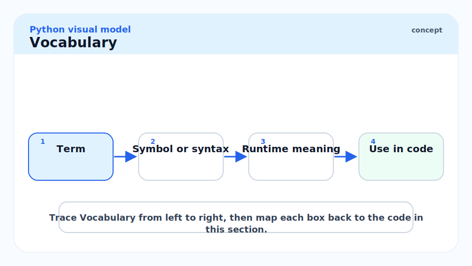

**PyTypeObject**: The C struct that represents a Python class (type) at runtime. Fields include `tp_name`, `tp_basicsize`, `tp_dict` (the class `__dict__`), `tp_mro` (the MRO tuple), `tp_base` (single base pointer), `tp_new`, `tp_init`, `tp_alloc`, `tp_dealloc`, `tp_getattro`.

---

**tp_dict**: The field in `PyTypeObject` that holds a pointer to the class's attribute dictionary (`dict` object). Stores method function objects, class variables, descriptors, and `__doc__`. Accessed from Python as `MyClass.__dict__`.

---

**tp_mro**: A `tuple` of type objects stored directly on the `PyTypeObject`. Computed once at class definition time by C3 linearisation and cached here. Python: `MyClass.__mro__`.

---

**Instance dict** (`__dict__`): A per-instance `dict` object allocated when the instance is created (unless `__slots__` is used). Maps attribute names to per-instance values. Separate from the class `__dict__`.

---

**Descriptor**: An object implementing `__get__` (and optionally `__set__` / `__delete__`). When found in a class `__dict__`, the descriptor protocol mediates attribute access on instances. `property`, `classmethod`, `staticmethod`, and `__slots__` slot wrappers are all descriptors.

---

**Data descriptor**: A descriptor implementing both `__get__` and `__set__` (or `__delete__`). Data descriptors take precedence over the instance `__dict__` in attribute lookup. `property` is a data descriptor.

---

**Non-data descriptor**: A descriptor implementing only `__get__`. Overridden by the instance `__dict__`. Function objects are non-data descriptors — that is how bound methods work.

---

**Bound method**: A transient object wrapping a function object and a specific instance. Created on-the-fly when a function is accessed via an instance. Holds a reference to both. `f.method is f.method` is `False` because each access creates a new wrapper.

---

**`__slots__`**: A class-level declaration that replaces the per-instance `__dict__` with a fixed array of slot descriptors (member descriptors in C). Reduces per-instance memory by eliminating the dict overhead.

---

**Metaclass**: The class of a class. By default `type`. When Python executes `class Foo(Base, metaclass=Meta):`, it calls `Meta("Foo", (Base,), namespace)` to create the class object. Controls class creation and can add class-level behaviour.

---

**`__new__(cls, ...)`**: The static method that allocates and returns a new instance. Runs before `__init__`. In CPython, the default `object.__new__` calls `tp_alloc` to allocate `tp_basicsize` bytes on the heap and zeroes them.

---

**`__init__(self, ...)`**: The initialiser that populates an already-allocated instance. Receives the object returned by `__new__`. Does not allocate; returns `None`.

---

**`tp_basicsize`**: Field in `PyTypeObject` recording the number of bytes to allocate for each instance of this type. For dict-backed instances this includes the `PyObject_HEAD` plus a pointer to the instance `__dict__`. For slotted instances it includes the `PyObject_HEAD` plus the slot array.

---

## Intuition

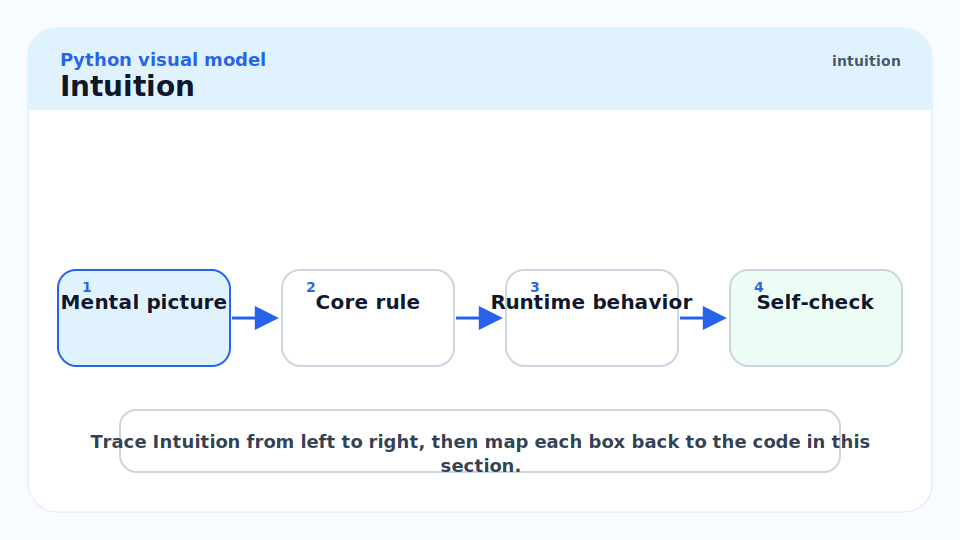

When you write `class Foo: ...`, you are asking CPython to allocate a `PyTypeObject` on the heap and populate it. That struct is itself a Python object — `type(Foo)` returns `type`, meaning the type object's own `ob_type` points at the built-in `type` type. The class object, the instance you later create, and the `type` built-in are all peers on the same heap.

When you write `f = Foo()`, Python calls `Foo.__call__()`, which resolves to `type.__call__(Foo)`. That calls `Foo.__new__(Foo)` to allocate a fresh `tp_basicsize`-byte block and then `Foo.__init__(instance)` to fill it. The resulting object's `ob_type` is a pointer to `Foo`'s `PyTypeObject`. Attribute lookup is a deterministic cascade: instance dict first, then each class in the MRO in order, with descriptor protocol checks at each step.

## A Class is an Object

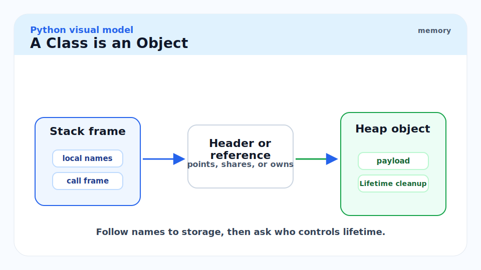

The reflexive structure of Python's type system can be stated precisely. Every object's `ob_type` points to its type. For an instance `f = Foo()`, `ob_type` → `Foo`. For the class `Foo` itself, `ob_type` → `type`. For `type` itself, `ob_type` → `type` (it is its own type).

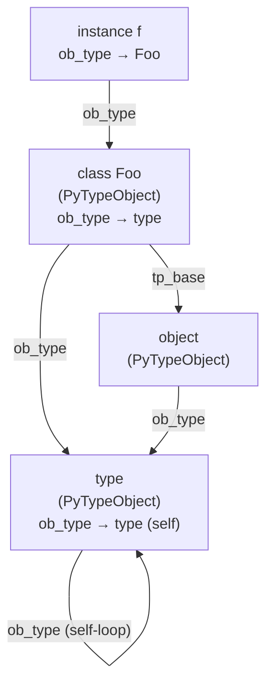

The class `Foo` is stored on the heap just like `f`. It has `ob_refcnt`, `ob_type` (pointing to `type`), and additional `PyTypeObject` fields: `tp_name`, `tp_dict`, `tp_mro`, `tp_base`, `tp_basicsize`, and the C function pointer slots for operations.

```python
import sys

class Foo:
    x: int = 1

print(type(Foo))         # <class 'type'>
print(type(Foo) is type) # True
print(sys.getsizeof(Foo))    # ~888 bytes (a PyTypeObject is large)
print(type(type))        # <class 'type'>
print(type(type) is type) # True — type is its own type
```

## How it Works

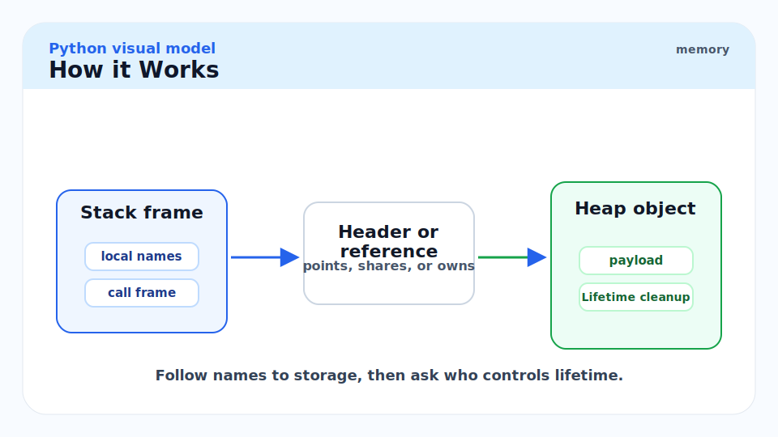

### What `class Foo: ...` Actually Does

When CPython's compiler encounters a class statement, it emits bytecode that at runtime calls the metaclass to construct the class object. For a default (no explicit metaclass) class the sequence is:

1. A new empty dict is created for the class namespace.
2. The class body is executed with that dict as `locals()`, populating it with method definitions and class variables.
3. `type.__new__(type, "Foo", bases, namespace)` is called with the populated namespace. This allocates a `PyTypeObject`, copies the namespace into `tp_dict`, computes the C3 MRO and stores it in `tp_mro`, sets `tp_basicsize` based on the base classes and any `__slots__`, and fills in C-level function pointer slots for dunder methods defined in the namespace.
4. The resulting class object is bound to the name `Foo` in the enclosing scope.

```python
# These two are equivalent:
class Bar:
    def greet(self) -> str:
        return "hello"

Bar2 = type("Bar2", (object,), {"greet": lambda self: "hello"})

print(Bar2().greet())  # "hello"
print(Bar2.__mro__)    # (<class 'Bar2'>, <class 'object'>)
```

> [!NOTE]
> The class body is executed in a fresh dict context. That dict becomes `tp_dict`. This is why class-level assignments (`x = 1`) appear in `Foo.__dict__` and method definitions (`def greet(self)`) also land there as plain function objects — they are all just entries in the namespace dict captured at class body execution time.

### What `Foo.__dict__` Actually Is

`Foo.__dict__` is a `mappingproxy` view over the `tp_dict` C-level dict. It is read-only via the proxy; writes go through `Foo.attr = value` which updates `tp_dict` directly. The proxy prevents accidental direct mutation of the class dict while still allowing normal class attribute assignment via `setattr`.

```python
class Dog:
    species: str = "Canis lupus familiaris"

    def bark(self) -> str:
        return "woof"

print(type(Dog.__dict__))          # <class 'mappingproxy'>
print("bark" in Dog.__dict__)      # True — function object stored here
print("species" in Dog.__dict__)   # True — class variable stored here
print("__doc__" in Dog.__dict__)   # True — auto-generated

# The function is a plain function, not yet a bound method:
print(type(Dog.__dict__["bark"]))  # <class 'function'>
```

### The MRO is Precomputed and Cached

At `type.__new__` time, the C3 algorithm runs once and the result — a tuple of type objects — is stored in `tp_mro`. Every subsequent attribute lookup reads directly from this tuple without recomputation.

```python
class A:
    def method(self) -> str: return "A"

class B(A):
    pass

class C(A):
    def method(self) -> str: return "C"

class D(B, C):
    pass

print(D.__mro__)
# (<class 'D'>, <class 'B'>, <class 'C'>, <class 'A'>, <class 'object'>)
# This tuple is stored in D's tp_mro field at class definition time.
```

### What an Instance Is — Memory Layout

When `f = Foo()` executes, `object.__new__(Foo)` calls `tp_alloc` to allocate `tp_basicsize` bytes on the heap. For a dict-backed instance the layout is:

```
PyObject_HEAD (16 bytes)
┌────────────────────────────────────────────────┐
│  ob_refcnt  (4 B)  │ overflow │ flags │ (pad)  │
│  ob_type → Foo     (8 B pointer)               │
└────────────────────────────────────────────────┘
  (optional) __dict__ pointer (8 bytes)
┌──────────────────────────────────────────────┐
│  *__dict__ → PyDictObject (heap)             │
└──────────────────────────────────────────────┘
  (optional) __weakref__ slot (8 bytes)
```

The instance itself is lean — `tp_basicsize` for a plain `object()` is 16 bytes (just the header). For a user-defined class without `__slots__`, `tp_basicsize` is 32 bytes: 16-byte header + 8-byte `__dict__` pointer + 8-byte `__weakref__` pointer. The instance `__dict__` is a separate `PyDictObject` allocated lazily.

```python
import sys

class Plain:
    pass

class WithAttrs:
    def __init__(self) -> None:
        self.x = 1
        self.y = 2

p = Plain()
w = WithAttrs()

print(sys.getsizeof(p))          # 48 bytes (header + __dict__ ptr + __weakref__ ptr)
print(sys.getsizeof(p.__dict__)) # 64 bytes (empty dict)
print(sys.getsizeof(w.__dict__)) # 184 bytes (dict with 2 entries)
print("Total WithAttrs:", sys.getsizeof(w) + sys.getsizeof(w.__dict__))  # ~232 B
```

### Attribute Lookup — Byte by Byte

`f.attr` calls `PyObject_GenericGetAttr(f, "attr")`, which implements the following algorithm. Understanding this chain is essential for reasoning about descriptor priority, cached lookups, and slot access.

**Figure:** Attribute lookup decision tree.

```mermaid
flowchart TD
    A["f.attr\nPyObject_GenericGetAttr called"] --> B["Walk MRO of type(f)\nSearch for 'attr' in each tp_dict"]
    B --> C{Found in\nMRO?}
    C -->|Yes| D{Is it a\ndata descriptor?\n(__get__ AND __set__)}
    D -->|Yes| E["Call descriptor.__get__(f, type(f))\nReturn result\n(data descriptor wins over instance dict)"]
    D -->|No, non-data or plain obj| F["Check instance f.__dict__"]
    F --> G{Found in\nf.__dict__?}
    G -->|Yes| H["Return f.__dict__['attr']\n(instance dict wins over non-data descriptor)"]
    G -->|No| I{MRO match\nis non-data\ndescriptor?}
    I -->|Yes| J["Call descriptor.__get__(f, type(f))\nReturn result (bound method for functions)"]
    I -->|No, plain object| K["Return the plain object\nfrom MRO"]
    C -->|No| L["Check instance f.__dict__"]
    L --> M{Found?}
    M -->|Yes| N["Return f.__dict__['attr']"]
    M -->|No| O["Raise AttributeError"]
```

The critical precedence rules:

1. **Data descriptors** (found in any class `__dict__` in the MRO) take priority over the instance `__dict__`. This is how `property` setters intercept `f.x = value` even if `x` is already in `f.__dict__`.
2. **Instance `__dict__`** takes priority over non-data descriptors in the MRO.
3. **Non-data descriptors** (plain function objects) win only if the instance dict has no matching key.

```python
class Descriptor:
    """A data descriptor that always returns 42."""
    def __get__(self, obj: object, objtype: type | None = None) -> int:
        return 42
    def __set__(self, obj: object, value: int) -> None:
        pass  # silently ignore writes

class Foo:
    x = Descriptor()  # stored in Foo.__dict__['x']

f = Foo()
f.__dict__["x"] = 99   # put directly in instance dict, bypassing __set__
print(f.x)             # 42 — data descriptor wins, instance dict ignored
```

> [!IMPORTANT]
> Data descriptors take precedence over the instance `__dict__`. This is why `property` works: the property object in the class dict is a data descriptor (has both `__get__` and `__set__`), so it intercepts every access to the attribute name, even if the instance dict has a value under that key. Non-data descriptors (functions) are lower priority — instance dict can shadow them.

### Bound Methods are Created on the Fly

A function stored in a class `__dict__` is a non-data descriptor. When you access `f.method`, Python finds the function object in the MRO and calls `function.__get__(f, type(f))`. This returns a new `PyMethodObject` wrapping the function and `f`. The bound method object holds strong references to both. It is a fresh allocation every single time.

```python
class Counter:
    def __init__(self) -> None:
        self.n = 0
    def increment(self) -> None:
        self.n += 1

c = Counter()

m1 = c.increment
m2 = c.increment
print(m1 is m2)       # False — two different bound method objects
print(m1 == m2)       # True — they wrap the same function and instance
print(type(m1))       # <class 'method'>

# In a tight loop, caching the bound method avoids repeated allocation
import sys
print(sys.getsizeof(m1))  # 48 bytes — the bound method object
```

> [!TIP]
> In tight loops that call an instance method millions of times, cache the bound method as a local variable before the loop: `inc = c.increment; for _ in range(N): inc()`. This avoids allocating a new `PyMethodObject` on every iteration. The speedup is measurable with `timeit` on hot paths.

### `__slots__` and Memory

When a class declares `__slots__`, CPython:

1. Does not allocate a `__dict__` pointer in `tp_basicsize`.
2. Allocates a member descriptor (a `PyMemberDef`-backed slot descriptor) for each slot name, stored in `tp_dict`.
3. Packs the slot values directly into the instance's memory block, at fixed offsets from the instance base address.

```
Normal instance (tp_basicsize ≈ 32 bytes + separate __dict__ heap):
┌──────────┬─────────┬──────────┐     ┌──────────────────────┐
│ PyObject │ *__dict │*__weakref│ --> │ PyDictObject (64+ B) │
└──────────┴─────────┴──────────┘     └──────────────────────┘
   16 B      8 B       8 B

Slotted instance (tp_basicsize ≈ 32 bytes total, no separate __dict__):
┌──────────┬─────────┬──────────┐
│ PyObject │ slot x  │ slot y   │
│ 16 B     │  8 B    │  8 B     │
└──────────┴─────────┴──────────┘
  (slot values are PyObject* pointers at fixed byte offsets)
```

```python
import sys

class WithDict:
    def __init__(self, x: int, y: int) -> None:
        self.x = x
        self.y = y

class WithSlots:
    __slots__ = ("x", "y")
    def __init__(self, x: int, y: int) -> None:
        self.x = x
        self.y = y

d = WithDict(1, 2)
s = WithSlots(1, 2)

# Instance overhead
dict_total = sys.getsizeof(d) + sys.getsizeof(d.__dict__)
slot_total = sys.getsizeof(s)
print(f"Dict-based: {dict_total} bytes")   # ~232 bytes
print(f"Slots-based: {slot_total} bytes")  # ~56 bytes
print(f"Ratio: {dict_total / slot_total:.1f}×")  # ~4×

# Slot descriptors are visible in the class __dict__:
print(type(WithSlots.__dict__["x"]))  # <class 'member_descriptor'>
```

> [!WARNING]
> If any class in an inheritance chain does not declare `__slots__`, the chain gets a `__dict__`. The memory savings evaporate for that class. To fully benefit from `__slots__` in a hierarchy, every class from the desired class up to (but not including) `object` must declare `__slots__`. If a mixin or ABC you inherit from lacks `__slots__`, you cannot avoid the instance dict from that base.

### `__new__` vs `__init__` at the Memory Level

`__new__` allocates; `__init__` populates. The call sequence for `Foo(args)` is precisely:

1. `type.__call__(Foo, *args, **kwargs)` is invoked.
2. `instance = Foo.__new__(Foo, *args, **kwargs)` — allocates `tp_basicsize` bytes, zeroes them, sets `ob_type = Foo`, sets `ob_refcnt = 1`, returns the pointer.
3. If `isinstance(instance, Foo)`: `Foo.__init__(instance, *args, **kwargs)` — populates fields. Returns `None`; the value is ignored.
4. `type.__call__` returns `instance`.

```python
from typing import ClassVar


class Singleton:
    """Allocate at most once; __init__ still called every time."""
    _instance: ClassVar["Singleton | None"] = None

    def __new__(cls) -> "Singleton":
        if cls._instance is None:
            # This is the ONLY time tp_alloc is called.
            cls._instance = super().__new__(cls)
            print(f"  __new__: allocated at id={id(cls._instance):#x}")
        else:
            print(f"  __new__: returning cached instance at id={id(cls._instance):#x}")
        return cls._instance

    def __init__(self) -> None:
        # Called every time Foo() is called, even when __new__ returns the cache.
        print(f"  __init__: running on id={id(self):#x}")


print("First call:")
a = Singleton()
print("Second call:")
b = Singleton()
print(f"a is b: {a is b}")
```

## Inheritance Memory Picture

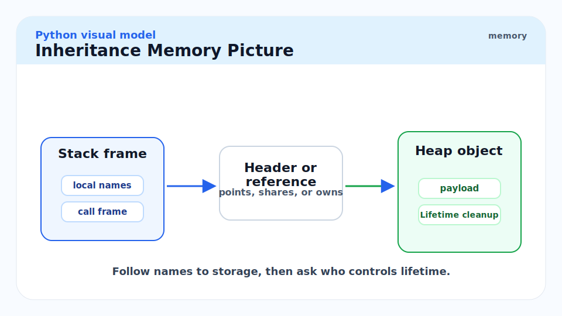

Each class object holds a `tp_base` pointer to its immediate base class and a `tp_mro` tuple spanning the full chain. Attribute lookup for an instance traverses the MRO tuple — a precomputed, in-memory list of type object pointers.

**Figure:** Instance → class → parent → object chain.

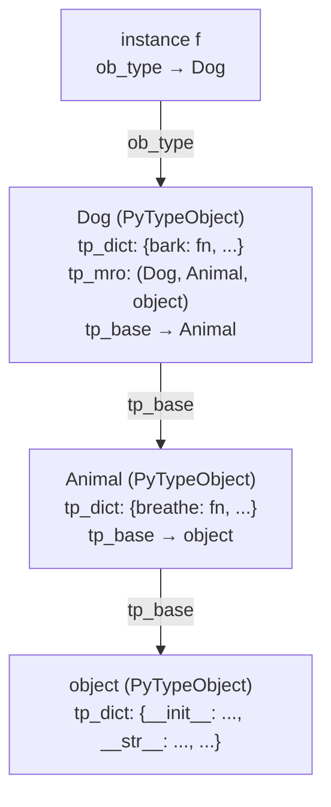

## `@dataclass` and `__slots__` — Python 3.10+

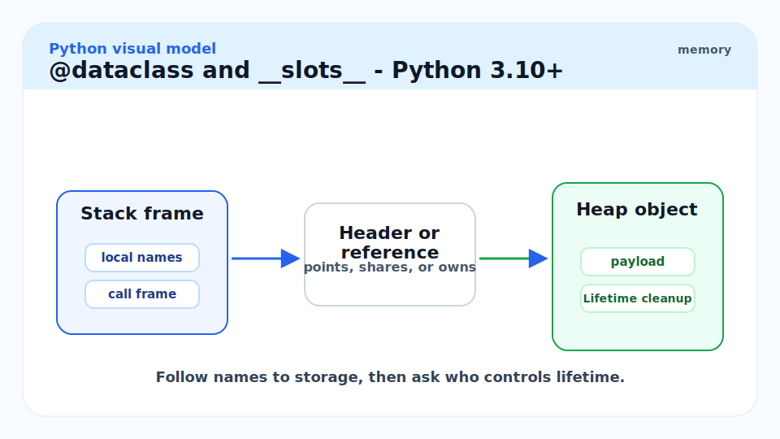

Python 3.10 added `@dataclass(slots=True)`, which auto-generates a `__slots__` declaration from the field annotations. This is the recommended way to get both ergonomics and memory efficiency.

```python
from dataclasses import dataclass
import sys


@dataclass
class PointDict:
    x: float
    y: float
    z: float


@dataclass(slots=True)
class PointSlots:
    x: float
    y: float
    z: float


d = PointDict(1.0, 2.0, 3.0)
s = PointSlots(1.0, 2.0, 3.0)

dict_total = sys.getsizeof(d) + sys.getsizeof(d.__dict__)
slot_total = sys.getsizeof(s)
print(f"@dataclass (dict):  {dict_total} bytes")   # ~264 bytes
print(f"@dataclass(slots=True): {slot_total} bytes") # ~72 bytes
print(f"Ratio: {dict_total / slot_total:.1f}×")     # ~3.5×
```

## What a Metaclass Does

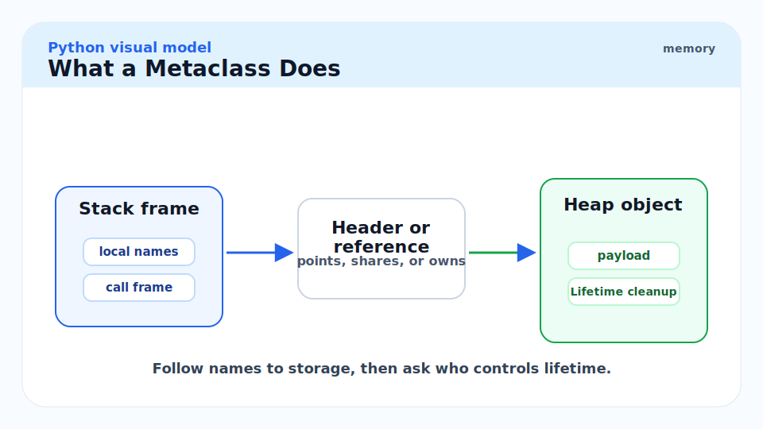

When you write `class Foo(Base, metaclass=Meta)`, Python resolves the metaclass to `Meta` and calls `Meta("Foo", (Base,), namespace)`. The default metaclass is `type`, so for most classes `type.__call__` → `type.__new__` → allocate `PyTypeObject` → `type.__init__` → populate it.

A custom metaclass subclasses `type` and overrides `__new__` or `__init__` to run code at class definition time. This is how framework features like ORMs, plugin registries, and abstract base classes work under the hood.

```python
from typing import Any


class AutoRegisterMeta(type):
    """Metaclass that records all subclasses in a registry dict."""
    _registry: dict[str, type] = {}

    def __new__(
        mcs,
        name: str,
        bases: tuple[type, ...],
        namespace: dict[str, Any],
    ) -> "AutoRegisterMeta":
        cls = super().__new__(mcs, name, bases, namespace)
        # Register every class created with this metaclass, except the base itself.
        if bases:
            AutoRegisterMeta._registry[name] = cls
        return cls


class Task(metaclass=AutoRegisterMeta):
    """Base task class."""
    def run(self) -> None: ...


class EmailTask(Task):
    def run(self) -> None:
        print("sending email")


class PushTask(Task):
    def run(self) -> None:
        print("sending push notification")


# At this point, class definition already triggered metaclass.__new__ twice.
print(AutoRegisterMeta._registry)
# {'EmailTask': <class 'EmailTask'>, 'PushTask': <class 'PushTask'>}

# Dispatch by name
task = AutoRegisterMeta._registry["EmailTask"]()
task.run()  # sending email
```

> [!NOTE]
> `__init_subclass__` (Python 3.6+) covers most use cases that previously required a custom metaclass. It is simpler, has no metaclass conflict risk, and is the idiomatic choice. Reserve custom metaclasses for cases where you need to control `tp_alloc`, `tp_basicsize`, or the class's own type object structure.

## Real-world Example

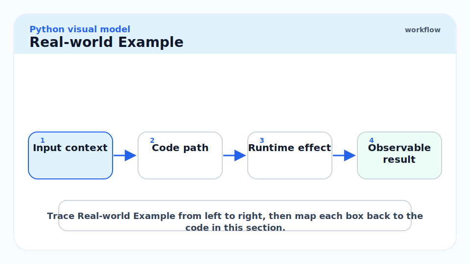

A complete walkthrough: five-line class definition, five-line usage, with every object created labelled and measured.

```python
import sys
import gc
import tracemalloc

tracemalloc.start()


class Point:
    """A 2D point. Deliberately not using __slots__ to show full overhead."""

    scale: float = 1.0  # class variable — lives in Point.__dict__

    def __init__(self, x: float, y: float) -> None:
        self.x = x
        self.y = y

    def distance(self) -> float:
        return (self.x ** 2 + self.y ** 2) ** 0.5


# --- Objects created so far: ---
# 1. The Point class object (PyTypeObject, ~888 B)
# 2. The float 1.0 singleton for 'scale' (24 B, may be cached)
# 3. Function objects for __init__ and distance in Point.__dict__

p = Point(3.0, 4.0)

# --- Objects created by Point(3.0, 4.0): ---
# 4. PyObject instance p (48 B header + __dict__ pointer)
# 5. p.__dict__ (PyDictObject, ~184 B with 2 entries: x, y)
# 6. float 3.0 (24 B, stored as p.x)
# 7. float 4.0 (24 B, stored as p.y)

print(f"Class object size:  {sys.getsizeof(Point)} bytes")
print(f"Instance size:      {sys.getsizeof(p)} bytes")
print(f"Instance __dict__:  {sys.getsizeof(p.__dict__)} bytes")
print(f"Total instance:     {sys.getsizeof(p) + sys.getsizeof(p.__dict__)} bytes")

# --- Bound method allocation ---
# 8. A new PyMethodObject is created here:
m = p.distance
print(f"Bound method size:  {sys.getsizeof(m)} bytes")   # 48 B
print(f"m is p.distance:    {m is p.distance}")           # False — new object each access

# --- Result ---
print(f"Distance: {p.distance()}")  # 5.0

# Memory snapshot
snapshot = tracemalloc.take_snapshot()
stats = snapshot.statistics("lineno")
for stat in stats[:5]:
    print(stat)

tracemalloc.stop()


# Slots comparison at scale
@dataclass_slots := None  # placeholder comment — see below

from dataclasses import dataclass


@dataclass
class PointSlow:
    x: float
    y: float


@dataclass(slots=True)
class PointFast:
    x: float
    y: float


N = 100_000
tracemalloc.start()
slow_list = [PointSlow(float(i), float(i)) for i in range(N)]
snap_slow = tracemalloc.take_snapshot()
del slow_list
gc.collect()

tracemalloc.start()
fast_list = [PointFast(float(i), float(i)) for i in range(N)]
snap_fast = tracemalloc.take_snapshot()

slow_bytes = sum(s.size for s in snap_slow.statistics("filename"))
fast_bytes = sum(s.size for s in snap_fast.statistics("filename"))
print(f"\n100k PointSlow: {slow_bytes / 1024:.0f} KB")
print(f"100k PointFast: {fast_bytes / 1024:.0f} KB")
print(f"Ratio: {slow_bytes / fast_bytes:.1f}×")
tracemalloc.stop()
```

> [!TIP]
> Use `tracemalloc` for production memory audits, not `sys.getsizeof`. `sys.getsizeof` measures one object shallowly; `tracemalloc` measures all allocations by source line across the full Python heap. For the 100k-instances pattern above, `tracemalloc` will show the `PointSlow` list costing ~26 MB vs `PointFast` at ~8 MB — a real signal you can act on.

## In Practice

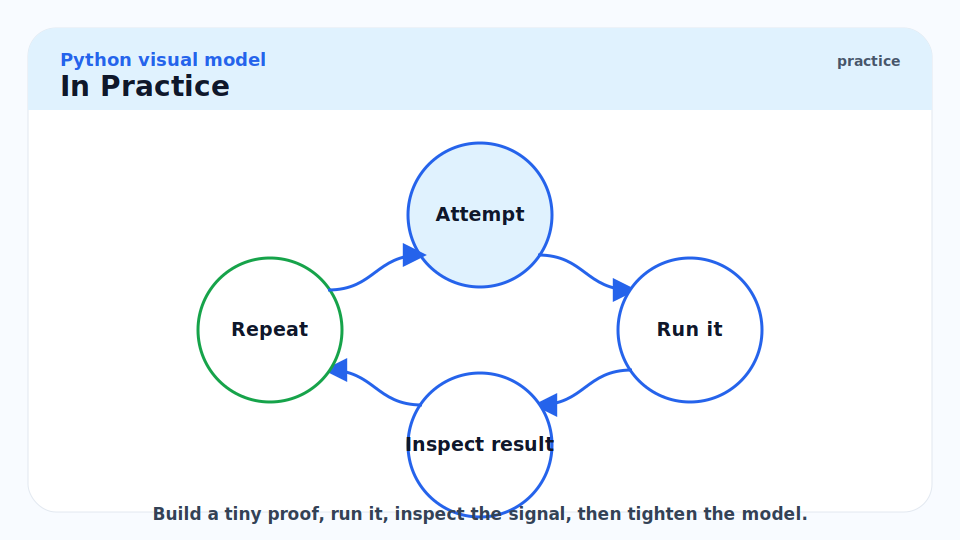

**The per-instance `__dict__` is a real cost at scale.** A class with two attributes and no `__slots__` costs ~48 bytes for the instance + ~184 bytes for the `__dict__` = ~232 bytes. One million such instances = ~232 MB. The same class with `__slots__` costs ~56 bytes per instance = ~56 MB — a 4× reduction. For graph nodes, embedding records, event objects, or any other "many small instances" pattern, `__slots__` is not optional at scale.

**Method lookup is not free.** Each `f.method` triggers the non-data descriptor protocol: walk the MRO, find the function in the class `__dict__`, call `function.__get__(f, type(f))`, allocate a `PyMethodObject`. CPython caches parts of this via an inline cache in the bytecode (`LOAD_ATTR` with specialised bytecode in 3.11+), but the cache is per-call-site, not per-object.

**`type.__subclasses__()` returns strong references.** Every subclass holds a reference back to its parent type. If you dynamically create and discard many classes (plugin reload patterns, test isolation), old class objects can linger until the GC collects the subclass reference cycles.

> [!CAUTION]
> Defining `__del__` on a class that participates in a reference cycle — an instance that holds a reference back to itself, or two instances that reference each other — historically made those objects uncollectable (Python 2, early Python 3). Since Python 3.4 they are collectable via `tp_finalize`, but the finalisation order is unspecified. `__del__` in a cycle is still a code smell: the GC may call it long after the object would otherwise have been collected, and the object's state may be partially torn down.

## Pitfalls

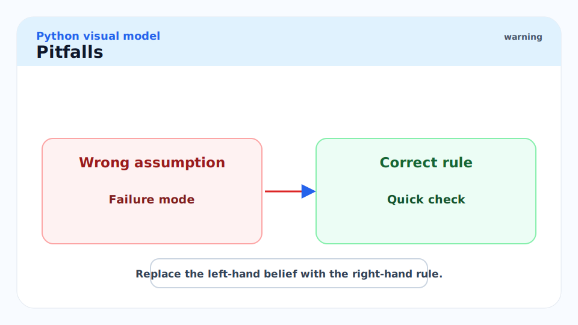

- **"Class variables are isolated from instances."** — They are, until an instance *writes* to the same name. `f.x = 5` creates an entry in `f.__dict__["x"]`, shadowing the class variable `Foo.x`. Now `f.x` and `Foo.x` are independent. Other instances still see `Foo.x` if they have not written their own. Forgetting this produces mysterious state-sharing bugs where "changing `Foo.x` doesn't affect `f.x` anymore."
- **"`f.method is f.method` should be True — same function."** — Each access creates a new `PyMethodObject`. The underlying function object is the same (`f.method.__func__ is f.method.__func__` is `True`), but the wrapper is freshly allocated. Checking `f.method is g.method` as a way to test "same method" is wrong; use `type(f).method is type(g).method` or `f.__class__.method is g.__class__.method`.
- **"`__slots__` in the base class protects all subclasses."** — Only if every class in the MRO declares `__slots__`. One missing declaration re-introduces `__dict__`. The base class's slots are still efficient, but the subclass now also carries a `__dict__`, negating the savings for that subclass.
- **"Metaclasses are needed for plugin registration."** — `__init_subclass__` (Python 3.6+) is simpler and avoids metaclass conflicts. Use metaclasses only when you need to control the class object's allocation, size, or C-level type behaviour.
- **"`__init__` is called only once per object."** — `__init__` is called every time you call `ClassName(args)`, even if `__new__` returns a cached instance (Singleton pattern). Guard with a `_initialised` sentinel flag, or handle re-initialisation explicitly.
- **"`dataclass(frozen=True)` is deeply immutable."** — `frozen=True` prevents reassigning fields of the dataclass instance. Mutable objects stored in those fields remain mutable. `frozen` is a shallow guarantee.

## Exercises

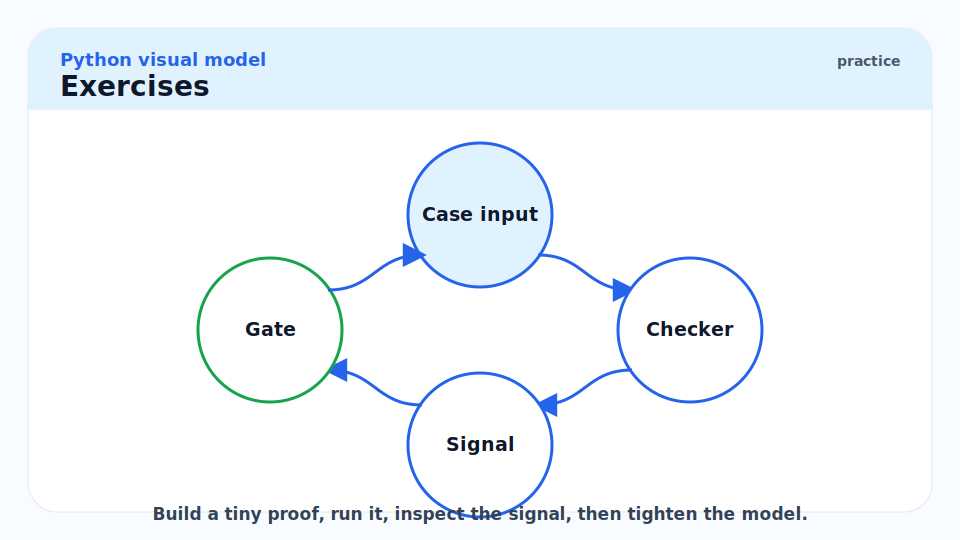

### Exercise 1 — Class vs Instance Attributes

Predict all output:

```python
class A:
    x: int = 1

a = A()
A.x = 2
print(a.x)    # line 1

a.x = 3
print(A.x)    # line 2
print(a.x)    # line 3
```

#### Solution

The lookup path is: first check `a.__dict__`, then walk the MRO.

**Line 1 — `print(a.x)` after `A.x = 2`**: `a.__dict__` is empty (no per-instance assignment yet). MRO walk finds `A.__dict__["x"] = 2`. Output: **2**.

**Line 2 — `print(A.x)` after `a.x = 3`**: `a.x = 3` writes `3` into `a.__dict__["x"]`. It does NOT change `A.__dict__["x"]`. The class attribute is still `2`. Output: **2**.

**Line 3 — `print(a.x)` after `a.x = 3`**: `a.__dict__["x"] = 3` now exists. Instance dict is checked first. Output: **3**.

Key lesson: assigning to an instance attribute creates (or overwrites) an entry in the instance `__dict__`, shadowing the class attribute for that instance only. The class attribute is unchanged.

---

### Exercise 2 — Bound Method Identity

Why is `Foo().method is Foo().method` `False`? Walk through the memory operations.

#### Solution

Step by step:

1. `Foo()` (first call): `type.__call__` calls `Foo.__new__` (allocates a new PyObject), then `Foo.__init__`. Returns instance `a`.
2. `.method` on `a`: `PyObject_GenericGetAttr` walks the MRO of `Foo`, finds `method` (a plain function object) in `Foo.__dict__`. Calls `function.__get__(a, Foo)`. This allocates a new `PyMethodObject` holding pointers to the function and `a`. Call it `m1`.
3. `Foo()` (second call): allocates another new PyObject, call it `b`.
4. `.method` on `b`: allocates another new `PyMethodObject` `m2`, wrapping the function and `b`.
5. `m1 is m2`: they are at different heap addresses. `False`.

Even `Foo().method is Foo().method` with a single instance is `False` because each attribute access creates a new bound method wrapper. The function object is shared (`m1.__func__ is m2.__func__`), but the wrapper objects are distinct.

---

### Exercise 3 — Singleton via `__new__`

Write a `Singleton` class using `__new__` and explain what happens in memory each time `Singleton()` is called after the first.

#### Solution

```python
from typing import ClassVar


class Singleton:
    """One instance only. __init__ still runs every call — guard it."""
    _instance: ClassVar["Singleton | None"] = None
    _initialised: bool = False

    def __new__(cls) -> "Singleton":
        if cls._instance is None:
            # tp_alloc is called here; a new PyObject is allocated.
            cls._instance = super().__new__(cls)
        # On subsequent calls, the existing PyObject address is returned.
        # ob_refcnt on that object is NOT incremented here — it will be
        # incremented when the returned reference is bound to a name.
        return cls._instance

    def __init__(self) -> None:
        if self._initialised:
            return
        self.value: int = 0
        self._initialised = True


a = Singleton()   # __new__ allocates; __init__ sets value=0
b = Singleton()   # __new__ returns same pointer; __init__ returns early
print(a is b)     # True — same PyObject address
print(id(a) == id(b))  # True
```

On the second and subsequent calls: `type.__call__` calls `Singleton.__new__`, which returns the cached pointer. `ob_refcnt` of the singleton is incremented by 1 when the returned reference is bound to `b`. `__init__` is called on the (already-initialised) instance but returns early due to the `_initialised` guard. No new allocation occurs.

---

### Exercise 4 — Memory Experiment with tracemalloc

```python
import tracemalloc
import sys


class A:
    def __init__(self, v: int) -> None:
        self.v = v


class ASlots:
    __slots__ = ("v",)
    def __init__(self, v: int) -> None:
        self.v = v


N = 100_000

tracemalloc.start()
plain = [A(i) for i in range(N)]
snap_plain = tracemalloc.take_snapshot()

import gc; gc.collect()
tracemalloc.start()
slotted = [ASlots(i) for i in range(N)]
snap_slotted = tracemalloc.take_snapshot()

plain_kb = sum(s.size for s in snap_plain.statistics("filename")) / 1024
slotted_kb = sum(s.size for s in snap_slotted.statistics("filename")) / 1024
print(f"A (dict):   {plain_kb:.0f} KB")
print(f"ASlots:     {slotted_kb:.0f} KB")
print(f"Ratio:      {plain_kb / slotted_kb:.1f}×")
# Expected: ~3.5–4× in favour of ASlots
tracemalloc.stop()
```

#### Solution — Predicted Ratio and Why

- `A` instance: 48 bytes (header + `__dict__` ptr + `__weakref__` ptr) + ~184 bytes (`__dict__` with one entry) ≈ 232 bytes.
- `ASlots` instance: 40 bytes (header + one slot pointer). No separate `__dict__`.
- Predicted ratio: 232 / 40 ≈ **5.8×** per instance. Actual `tracemalloc` ratio is typically 3.5–4× because Python's dict pre-allocates some entries and the GC tracking adds overhead for both.

The key mechanism: `ASlots` stores `v` as a 8-byte pointer at a fixed offset (computed at class definition time and stored in the `PyMemberDef` slot descriptor's `offset` field). No separate dict object is allocated; no hash table; no load factor; no array-of-entry-triples. The member descriptor in `ASlots.__dict__["v"]` holds the byte offset and uses it directly in `__get__`/`__set__`.

---

### Exercise 5 — Custom Metaclass Auto-Registry

Build a `Task` base with a metaclass that auto-registers subclasses. Explain at the byte level what `class EmailTask(Task):` does.

#### Solution

```python
from typing import Any


class TaskMeta(type):
    """Metaclass that auto-registers all Task subclasses."""
    registry: dict[str, type] = {}

    def __new__(
        mcs,
        name: str,
        bases: tuple[type, ...],
        namespace: dict[str, Any],
        **kwargs: Any,
    ) -> "TaskMeta":
        cls = super().__new__(mcs, name, bases, namespace)
        if bases:  # skip the base Task class itself
            TaskMeta.registry[name] = cls
        return cls


class Task(metaclass=TaskMeta):
    def run(self) -> None:
        raise NotImplementedError


class EmailTask(Task):
    def run(self) -> None:
        print("email")


class PushTask(Task):
    def run(self) -> None:
        print("push")


print(TaskMeta.registry)
# {'EmailTask': <class 'EmailTask'>, 'PushTask': <class 'PushTask'>}
```

**Byte-level trace of `class EmailTask(Task):`**

1. Compiler emits `LOAD_BUILD_CLASS` bytecode. At runtime, Python calls `builtins.__build_class__`.
2. The class body is executed with a fresh namespace dict. `def run(self): ...` stores a function object under `"run"` in that dict.
3. `__build_class__` resolves the metaclass. `Task`'s metaclass is `TaskMeta` (stored in `Task.__class__`'s type, i.e., the `ob_type` of the `Task` type object). `TaskMeta` is chosen.
4. `TaskMeta("EmailTask", (Task,), namespace)` is called, which invokes `type.__call__(TaskMeta, ...)` → `TaskMeta.__new__(TaskMeta, "EmailTask", (Task,), namespace)`.
5. `super().__new__` (`type.__new__`) allocates a fresh `PyTypeObject` on the heap: ~888 bytes. Populates `tp_name = "EmailTask"`, copies `namespace` into `tp_dict`, runs C3 to compute `tp_mro = (EmailTask, Task, object)`, sets `tp_base → Task`, sets `tp_basicsize` from `Task.tp_basicsize`.
6. The `if bases:` guard fires (bases is `(Task,)`, not empty). `TaskMeta.registry["EmailTask"] = cls` stores the new class object's pointer in the registry dict.
7. `__new__` returns the new `PyTypeObject`. `type.__init__` runs (no-op for default usage).
8. `__build_class__` returns the class object. The bytecode `STORE_NAME "EmailTask"` stores the pointer in the module's global namespace dict.

Total heap impact: one `PyTypeObject` (~888 bytes), one entry in `TaskMeta.registry`, one entry in the module globals dict.

## Sources

- CPython source: `Include/cpython/object.h` (PyTypeObject fields) — https://github.com/python/cpython/blob/main/Include/cpython/object.h
- CPython source: `Objects/typeobject.c` (`type.__new__`, `type_getattro`) — https://github.com/python/cpython/blob/main/Objects/typeobject.c
- CPython source: `Objects/object.c` (`PyObject_GenericGetAttr`) — https://github.com/python/cpython/blob/main/Objects/object.c
- Python Data Model — https://docs.python.org/3/reference/datamodel.html
- Python Descriptor HowTo Guide — https://docs.python.org/3/howto/descriptor.html
- PEP 3115 — Metaclasses in Python 3 — https://peps.python.org/pep-3115/
- PEP 557 — Data Classes — https://peps.python.org/pep-0557/
- Raymond Hettinger, "Python's Class Development Toolkit" (PyCon 2013) — https://www.youtube.com/watch?v=HTLu2DFOdTg
- Brett Cannon, "How `__class__` and `super()` work" — https://snarky.ca/
- Shaw, A. *CPython Internals*. Real Python / No Starch Press. https://realpython.com/products/cpython-internals-book/

## Related

- [5 - Classes, Inheritance, MRO, ABCs](./5-classes-inheritance-mro-abcs.md)
- [2 - The Data Model — Objects, References, Identity](./2-the-data-model-objects-references-identity.md)
- [13 - Memory Model and PyObject Layout](./13-memory-model-and-pyobject-layout.md)
- [8 - The GIL, Threads, Multiprocessing](./8-the-gil-threads-multiprocessing.md)
