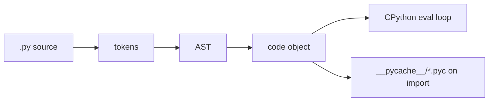

# 15 - CPython Compiler, Bytecode, and Import System

[toc]

> **TL;DR:** Python source is parsed, compiled to code objects, executed by the CPython interpreter, and cached as `.pyc` bytecode when imported. Mastering imports means understanding `sys.path`, `sys.modules`, finders, loaders, module specs, package execution, and why running a file as a script is not the same as importing it.

## Real-World Example

This example lets you inspect the exact object CPython executes. It parses source, compiles it to a code object, disassembles bytecode, executes it in a namespace, and shows the resulting module-like globals.

```python
import ast
import dis

source = """
def square(x):
    return x * x

answer = square(7)
"""

tree = ast.parse(source, filename="<demo>")
print(ast.dump(tree, indent=2))

code = compile(tree, filename="<demo>", mode="exec")
dis.dis(code)

namespace: dict[str, object] = {}
exec(code, namespace)
print(namespace["answer"])
```

## Vocabulary

**AST**: Abstract Syntax Tree. A structured representation of parsed source before bytecode generation.

---

**Code object**: Immutable executable metadata produced by `compile()`. Functions, modules, and comprehensions all execute code objects.

---

**Bytecode**: CPython's interpreter instructions, visible with `dis`.

---

**Module spec**: Import metadata stored as `module.__spec__`, introduced by PEP 451.

---

**Finder**: An import hook that knows how to locate a module.

---

**Loader**: An import hook that knows how to create or execute a module.

---

**`sys.modules`**: The process-wide module cache. Imports check it before loading code again.

## Intuition

Python feels like it "runs source," but CPython executes code objects. Source is tokenized, parsed, compiled, and then interpreted. Imported modules are also cached so repeated imports return the same module object rather than rerunning the file from scratch.

This explains common production bugs. A circular import sees a partially initialized module because the module is already in `sys.modules` while its body is still executing. A script run as `python app.py` has name `__main__`, while the same file imported as `app` is a different module identity. A test suite can import the wrong package if `sys.path` points at the wrong directory.



## Compilation Pipeline

The `compile()` builtin exposes CPython's front half. The `dis` module exposes the bytecode shape the interpreter sees.

```python
import dis

def total(values: list[int]) -> int:
    result = 0
    for value in values:
        result += value
    return result

dis.dis(total)
```

The bytecode is an implementation detail, not a stable language contract. Use it to understand performance and runtime behavior, not as a portable API.

## `.pyc` Files and Caches

When a module is imported from source, CPython may write bytecode into `__pycache__`. The cache speeds startup by skipping parsing and compilation when the source is unchanged.

```bash
python -m compileall .
find . -name '*.pyc'
```

The `.pyc` file does not make Python "compiled like C." It still contains interpreter bytecode for CPython, not native machine code.

## Import Resolution

Import roughly follows this path:

1. Check `sys.modules`.
2. Search `sys.meta_path` finders.
3. Resolve path entries from `sys.path` or package `__path__`.
4. Create a module object.
5. Insert it into `sys.modules`.
6. Execute module body.
7. Bind names in the importing namespace.

```python
import importlib
import sys

module = importlib.import_module("json")
print(module is sys.modules["json"])
print(module.__spec__.origin)
```

## Script Versus Module Execution

Prefer `python -m package.module` for package code. It sets up package-relative imports correctly.

```bash
python -m mypackage.cli
```

Running a file path directly can break relative imports because the file is executed as `__main__`, not as its package-qualified module name.

## Pitfalls

- **Circular imports**: Two modules importing each other at top level can observe partially initialized objects.
- **Import-time side effects**: Network calls, config loading, and heavy computation at import time slow every process start and make tests brittle.
- **Wrong `sys.path`**: Running tests from the wrong directory can import installed code instead of local code.
- **Duplicate module identity**: The same file can be loaded twice under different names.
- **Depending on bytecode stability**: Bytecode changes across CPython versions.

## Exercises

1. Use `dis.dis()` on a loop, a list comprehension, and a function call.
2. Create a circular import and explain the partial module state.
3. Run the same package entry point as a file and with `python -m`; compare `__name__` and `__package__`.
4. Print `sys.path`, `sys.meta_path`, and `sys.modules["json"].__spec__`.

## Sources

- https://docs.python.org/3.14/reference/import.html
- https://docs.python.org/3.14/library/importlib.html
- https://docs.python.org/3.14/library/dis.html
- https://docs.python.org/3.14/library/compileall.html
- https://docs.python.org/3.14/library/sys.html
- Conversation with user on 2026-06-07

## Related

- Previous: [14 - Classes and Instances in Memory](./14-classes-and-instances-in-memory.md)
- Earlier: [1 - What is Python](./1-what-is-python.md)
- Earlier: [11 - Packaging, Tooling, Modern Workflows](./11-packaging-tooling-modern-workflows.md)
- Next: [16 - C Extensions, FFI, Embedding, and Free-Threaded Python](./16-c-extensions-ffi-embedding-and-free-threaded-python.md)

