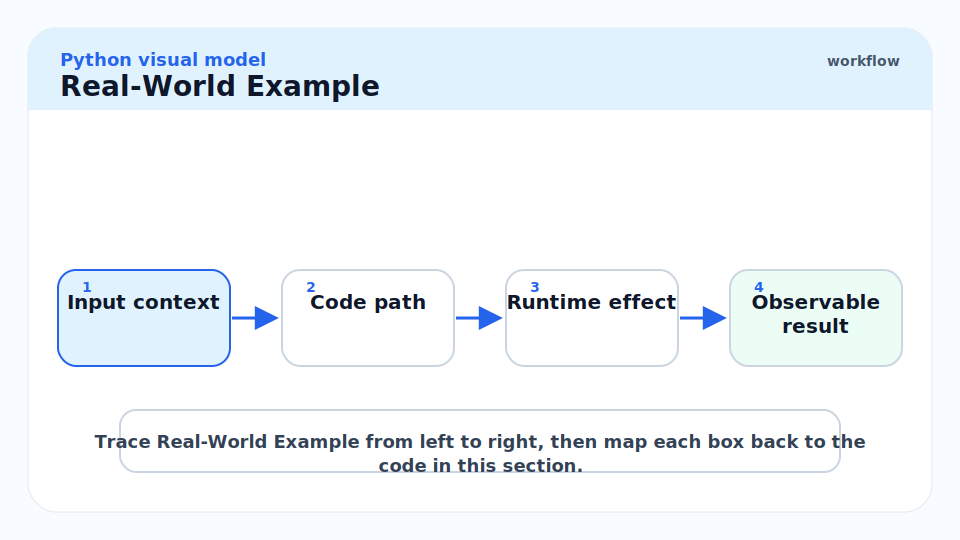
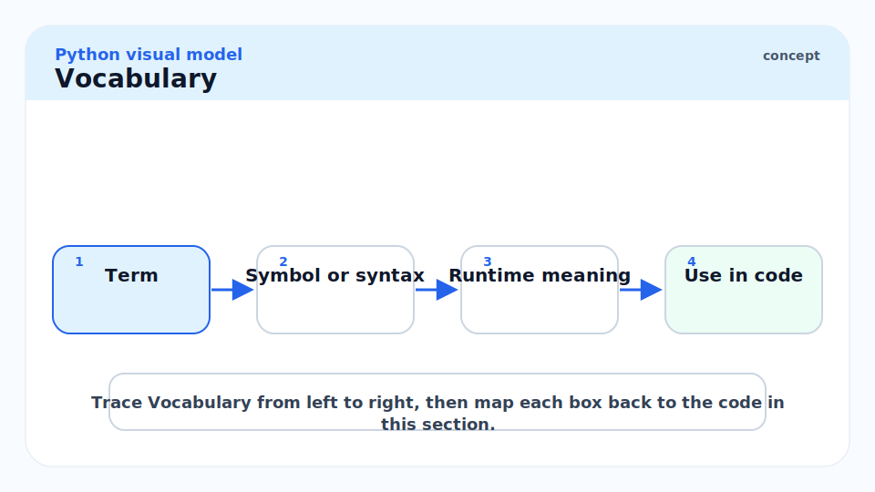
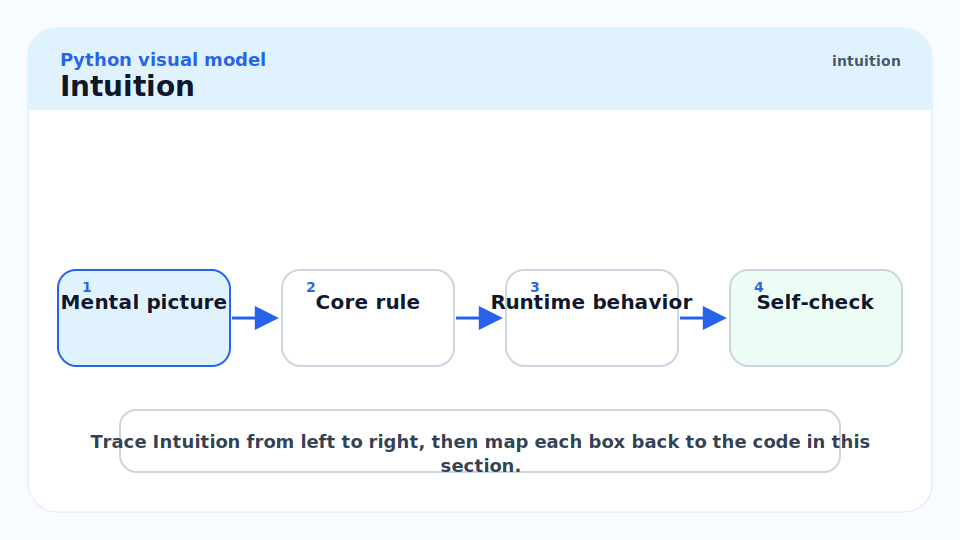
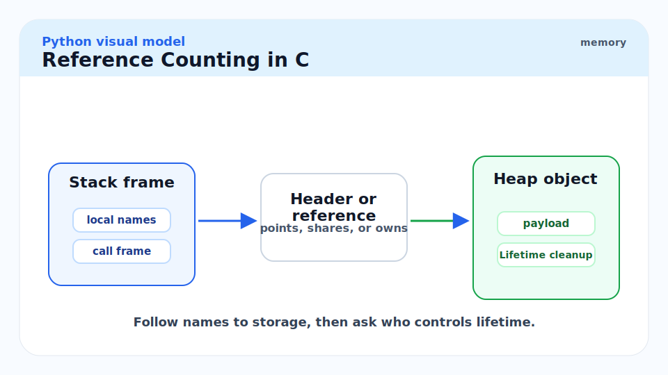
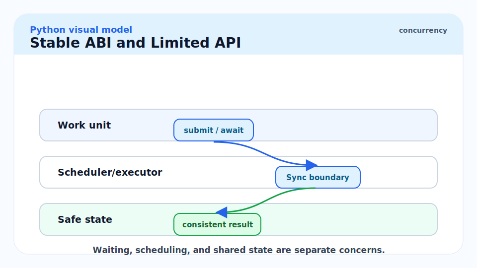
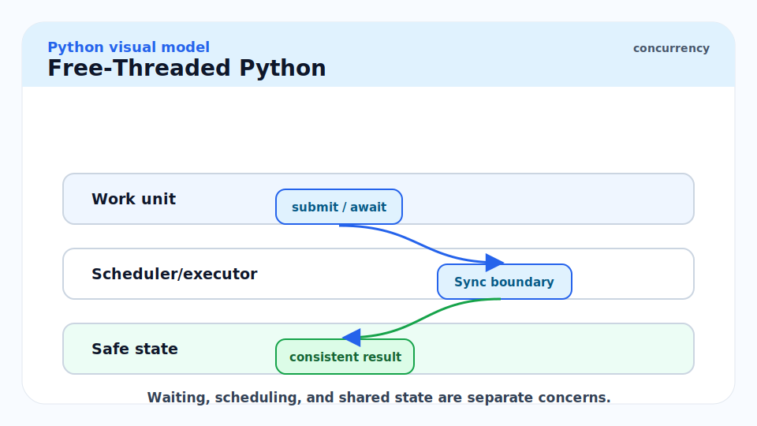
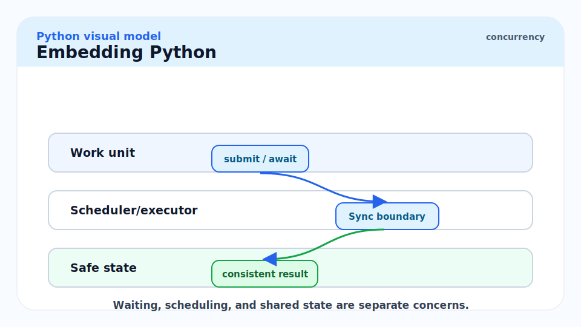
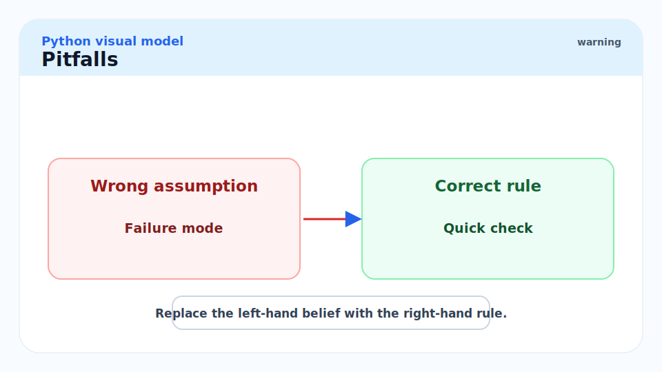
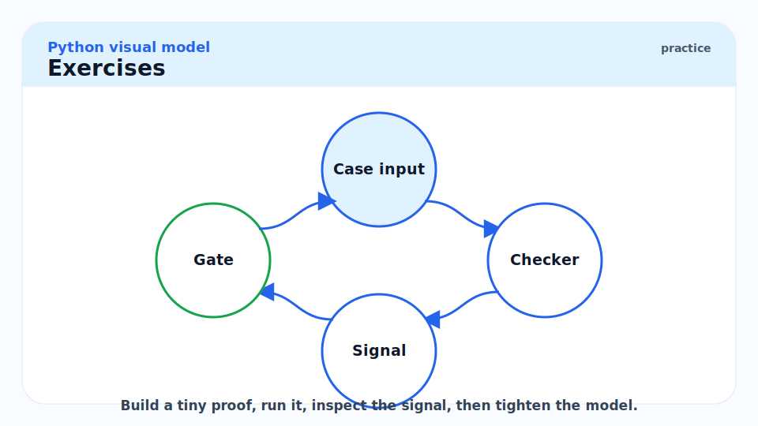

# 16 - C Extensions, FFI, Embedding, and Free-Threaded Python

[toc]

> **TL;DR:** Python becomes systems-adjacent through extension modules, CFFI/ctypes, embedding, and native libraries. The cost is ownership: reference counts, ABI compatibility, GIL assumptions, and free-threaded safety become your problem.

## Real-World Example



This example calls a C standard-library function through `ctypes`. It is small, but it shows the boundary: Python must declare argument and return types because the C function cannot describe them dynamically.

```python
import ctypes
import ctypes.util

libc_name = ctypes.util.find_library("c")
if libc_name is None:
    raise RuntimeError("could not find C standard library")

libc = ctypes.CDLL(libc_name)
libc.strlen.argtypes = [ctypes.c_char_p]
libc.strlen.restype = ctypes.c_size_t

print(libc.strlen(b"python"))
```

## Vocabulary



**Extension module**: A native module loaded by Python, commonly written in C, C++, Rust, or Cython.

---

**Embedding**: Initializing and running Python inside another host application.

---

**C API**: CPython's native API for creating, inspecting, and manipulating Python objects.

---

**Stable ABI**: A binary compatibility layer for extensions built against the Limited API.

---

**Borrowed reference**: A C API pointer you do not own and must not decrement.

---

**New reference**: A C API pointer you own and must eventually release with `Py_DECREF`.

---

**Free-threaded Python**: A CPython build where the GIL can be disabled, introduced experimentally in Python 3.13 and officially supported in Python 3.14.

## Intuition



Python extension work is not normal Python with different syntax. It is manual resource management with Python object semantics. You have to know whether every object reference is borrowed or owned, whether a function can set an exception, and whether your native code is safe under CPython's current threading model.

Use native boundaries when they buy something real: calling an existing system library, speeding up a hot loop, sharing memory with NumPy, or embedding a scripting layer. Do not cross the boundary just because Python feels slow. Measure first.

## Choosing an Interop Path


| Need | Good starting point |
| :--- | :--- |
| Call a simple C shared library | `ctypes` |
| C API with complex declarations | CFFI or generated bindings |
| Speed up Python loops | Cython, Numba, Rust extension, C extension |
| Share arrays with native code | buffer protocol, NumPy C API, memoryviews |
| Ship stable wheels | Limited API / Stable ABI where possible |
| Host Python inside an app | embedding API |

## Reference Counting in C



Every C extension bug is either a crash, leak, or corrupted invariant waiting to happen. The first rule is knowing ownership.

```c
// Sketch only: extension code must handle errors carefully.
PyObject *name = PyUnicode_FromString("pat");  // new reference
if (name == NULL) {
    return NULL;
}

Py_DECREF(name);  // release ownership
```

> [!CAUTION]
> Never guess whether a CPython C API returns a borrowed or new reference. Read the reference documentation for that exact function.

## Stable ABI and Limited API



The Limited API exposes a subset of Python's C API. Extensions using it can target the Stable ABI and avoid rebuilding for every supported Python minor version. The tradeoff is that some fast macros and implementation details are unavailable.

```text
Py_LIMITED_API -> source-level subset
Stable ABI     -> binary-level compatibility promise
```

## Free-Threaded Python



Python 3.14 officially supports free-threaded builds. That does not mean every package is automatically safe. Extensions may re-enable the GIL, and code that accidentally relied on the GIL as a process-wide lock may race.

```python
import sys

is_free_threaded = hasattr(sys, "_is_gil_enabled") and not sys._is_gil_enabled()
print(is_free_threaded)
```

For Python code, this makes old assumptions weaker:

- Built-in containers still have internal safety rules, but compound operations need locks.
- C extensions must declare and implement free-threaded safety.
- Threaded CPU parallelism can help only when the code and dependencies support it.
- Memory behavior changes, including larger headers and delayed freeing in some cases.

## Embedding Python



Embedding means another program owns process startup and initializes Python as a component. Common uses include scripting inside applications, plugins, test runners, scientific tools, and game engines.

Embedding concerns:

- Interpreter lifetime.
- Module search path.
- Signal handling.
- Thread state.
- Finalization.
- Native library loading.

## Pitfalls



- **Reference leaks**: Missing `Py_DECREF` keeps objects alive.
- **Borrowed-reference misuse**: Decrementing something you do not own can crash.
- **ABI lock-in**: Using private CPython internals ties you to implementation versions.
- **Free-threading assumptions**: Code that was "safe because of the GIL" may not stay safe.
- **ctypes type mistakes**: Wrong `argtypes` or `restype` can corrupt memory.

## Exercises



1. Call `strlen` or another simple C function with `ctypes`.
2. Explain the difference between new and borrowed references.
3. Read one C API function's docs and identify its ownership rule.
4. Check whether your interpreter has `sys._is_gil_enabled`.
5. Write down what would need to change for a C extension to be free-threaded safe.

## Sources

- https://docs.python.org/3.14/extending/
- https://docs.python.org/3.14/c-api/
- https://docs.python.org/3.14/c-api/stable.html
- https://docs.python.org/3.14/library/ctypes.html
- https://docs.python.org/3/howto/free-threading-python.html
- https://peps.python.org/pep-0703/
- Conversation with user on 2026-06-07

## Related

- Previous: [15 - CPython Compiler, Bytecode, and Import System](./15-cpython-compiler-bytecode-import-system.md)
- Earlier: [8 - The GIL, Threads, Multiprocessing](./8-the-gil-threads-multiprocessing.md)
- Earlier: [13 - Memory Model and PyObject Layout](./13-memory-model-and-pyobject-layout.md)
- Next: [17 - Testing, Debugging, Profiling, and Reliability](./17-testing-debugging-profiling-and-reliability.md)

