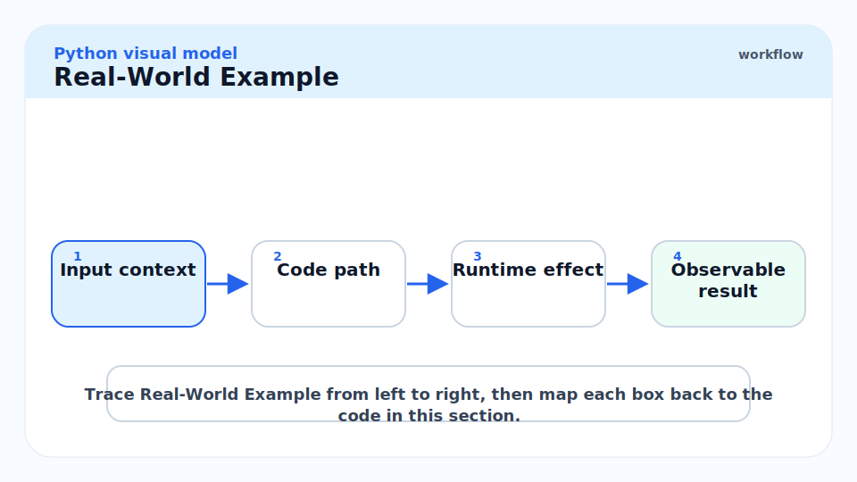
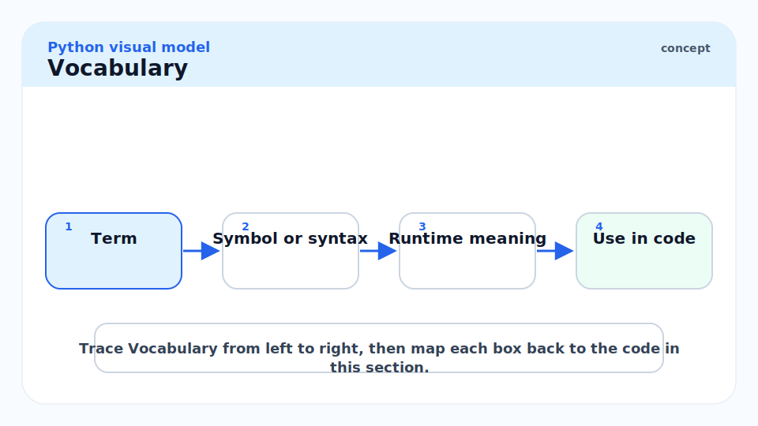
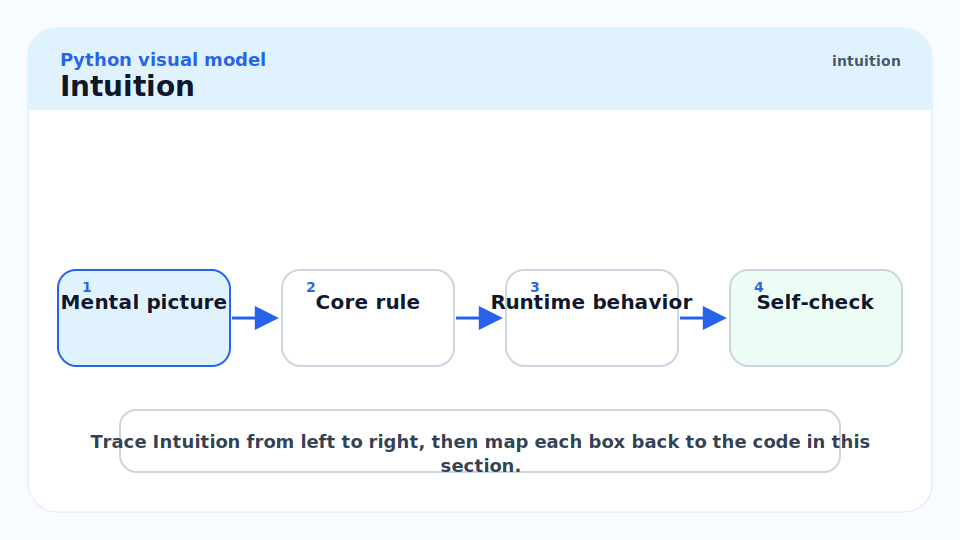
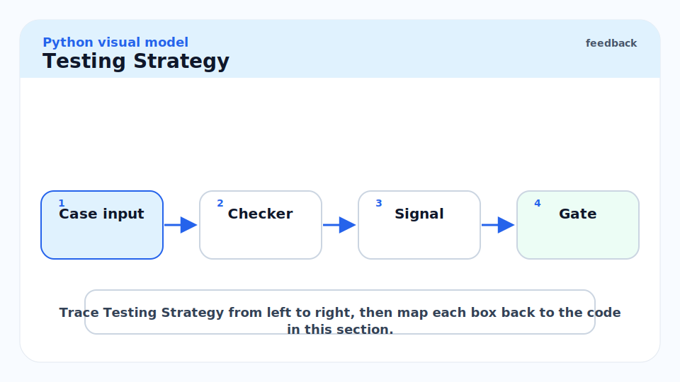
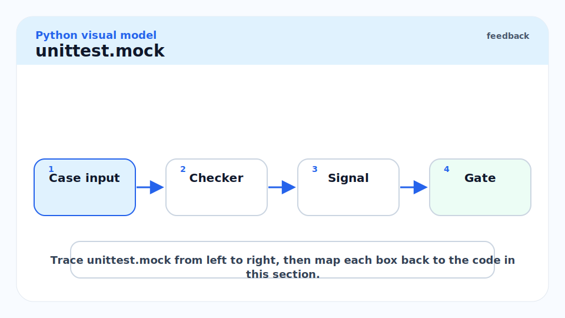
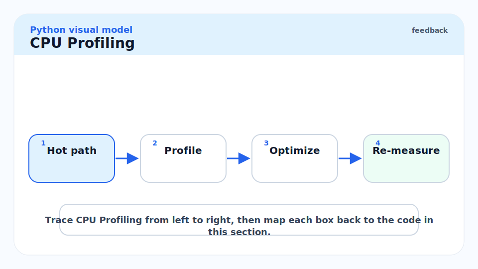
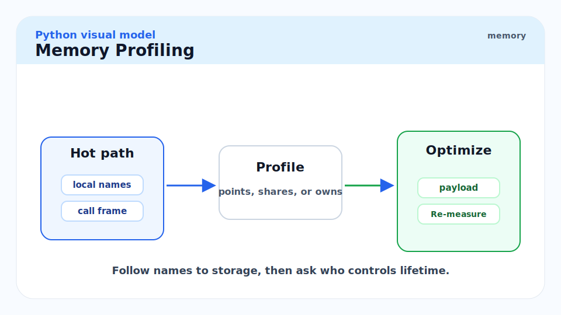
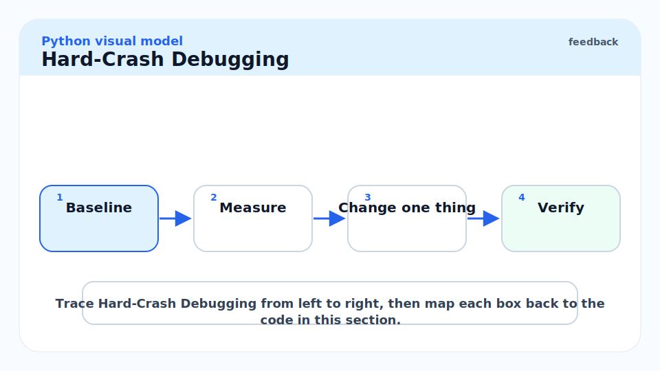
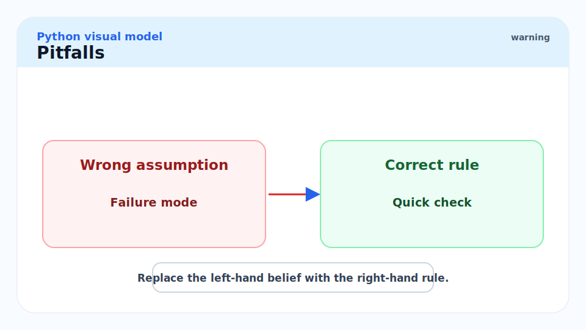
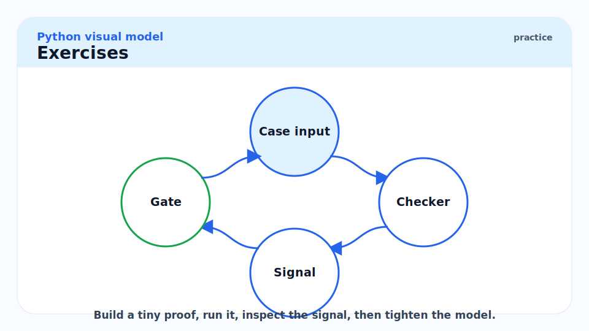

# 17 - Testing, Debugging, Profiling, and Reliability

[toc]

> **TL;DR:** Python mastery includes proving behavior, not just writing code. Use `pytest` or `unittest`, deterministic fakes, `unittest.mock` at boundaries, `cProfile` for CPU, `tracemalloc` for memory, `faulthandler` for hard crashes, and coverage as a guide rather than a score.

## Real-World Example



This example tests retry behavior without sleeping or calling the network. The fake client makes the failure deterministic.

```python
from dataclasses import dataclass


class TemporaryError(Exception):
    pass


@dataclass
class FakeClient:
    failures_before_success: int
    calls: int = 0

    def fetch(self) -> str:
        self.calls += 1
        if self.calls <= self.failures_before_success:
            raise TemporaryError("try again")
        return "ok"


def fetch_with_retry(client: FakeClient, attempts: int) -> str:
    for attempt in range(attempts):
        try:
            return client.fetch()
        except TemporaryError:
            if attempt == attempts - 1:
                raise
    raise AssertionError("unreachable")


def test_fetch_with_retry_eventually_succeeds() -> None:
    client = FakeClient(failures_before_success=2)
    assert fetch_with_retry(client, attempts=3) == "ok"
    assert client.calls == 3
```

Run it with pytest or adapt it to `unittest`.

```bash
python -m pytest
python -m unittest discover
```

## Vocabulary



**Fixture**: Test setup data or dependencies.

---

**Fake**: A simple working implementation used in tests.

---

**Mock**: An object that records or constrains interactions.

---

**Monkeypatching**: Replacing runtime attributes during a test.

---

**Profile**: A measurement of where time or memory is spent.

---

**Flake**: A test that passes or fails nondeterministically.

## Intuition



Python makes behavior easy to change at runtime. That flexibility makes tests powerful and dangerous. You can patch anything, but patching too much means you test implementation trivia instead of contract behavior.

The strongest Python tests are boring: pure functions, fake IO, deterministic clocks, small fixtures, and direct assertions. Use mocks when the interaction itself is the behavior, such as "this queue publish call happened once with this payload."

## Testing Strategy



Use layers:

| Layer | Tooling | Purpose |
| :--- | :--- | :--- |
| Unit | pytest or unittest | Fast behavior checks |
| Property | Hypothesis | Input-space exploration |
| Integration | real DB/container/service fake | Adapter correctness |
| Contract | schema/openapi/golden cases | Boundary compatibility |
| Smoke | CLI or deployed service check | Release sanity |

## `unittest.mock`



Patch where the object is looked up, not where it was originally defined. This is the most common mocking mistake.

```python
from unittest.mock import Mock

publisher = Mock()
publisher.publish("user.created", {"id": "u-1"})

publisher.publish.assert_called_once_with("user.created", {"id": "u-1"})
```

## CPU Profiling



Use `cProfile` when code is slow and you do not know why.

```bash
python -m cProfile -s cumtime -m mypackage.cli
```

For a focused script:

```python
import cProfile
import pstats

with cProfile.Profile() as profile:
    sum(i * i for i in range(1_000_000))

pstats.Stats(profile).sort_stats("cumtime").print_stats(10)
```

## Memory Profiling



Use `tracemalloc` to compare allocation snapshots by source line.

```python
import tracemalloc

tracemalloc.start()
before = tracemalloc.take_snapshot()

data = [str(i) for i in range(100_000)]

after = tracemalloc.take_snapshot()
for stat in after.compare_to(before, "lineno")[:5]:
    print(stat)
```

## Hard-Crash Debugging



`faulthandler` is useful when native extensions, segmentation faults, deadlocks, or timeouts make normal tracebacks unavailable.

```bash
python -X faulthandler -m pytest
```

## Pitfalls



- **Patching the wrong namespace**: Patch the name your code uses.
- **Sleeping in tests**: Replace clocks and timers with fakes.
- **Coverage worship**: 100 percent line coverage can still miss important behavior.
- **Profiling toy inputs**: Measure representative workloads.
- **Ignoring flaky tests**: A flaky test is a production signal, not a nuisance.

## Exercises



1. Write one test with a fake dependency and one with `Mock`.
2. Add a property-style test for a parser.
3. Profile a slow script with `cProfile`.
4. Use `tracemalloc` to find the largest allocation source line.
5. Run a test suite with `python -X faulthandler`.

## Sources

- https://docs.python.org/3/library/unittest.html
- https://docs.python.org/3/library/unittest.mock.html
- https://docs.python.org/3/library/doctest.html
- https://docs.python.org/3.14/library/profile.html
- https://docs.python.org/3/library/tracemalloc.html
- https://docs.python.org/3/library/faulthandler.html
- Conversation with user on 2026-06-07

## Related

- Previous: [16 - C Extensions, FFI, Embedding, and Free-Threaded Python](./16-c-extensions-ffi-embedding-and-free-threaded-python.md)
- Earlier: [11 - Packaging, Tooling, Modern Workflows](./11-packaging-tooling-modern-workflows.md)
- Earlier: [10 - Performance and the Standard Library](./10-performance-and-the-standard-library.md)
- Next: [18 - Deployment, Operations, Security, and Release Engineering](./18-deployment-operations-security-and-release-engineering.md)

