# 2 - The Data Model — Objects, References, Identity

[toc]

> **TL;DR:** In CPython every value — integer, string, function, class, `None` — is a `PyObject` on the C heap with three attributes: identity (`id`), type (`type`), and value. Variables are names in namespace dictionaries pointing to objects, not memory slots holding values. The data model formalises how objects participate in language features (arithmetic, comparison, iteration, hashing) by implementing dunder methods, making Python's operator overloading both principled and predictable.

## Vocabulary

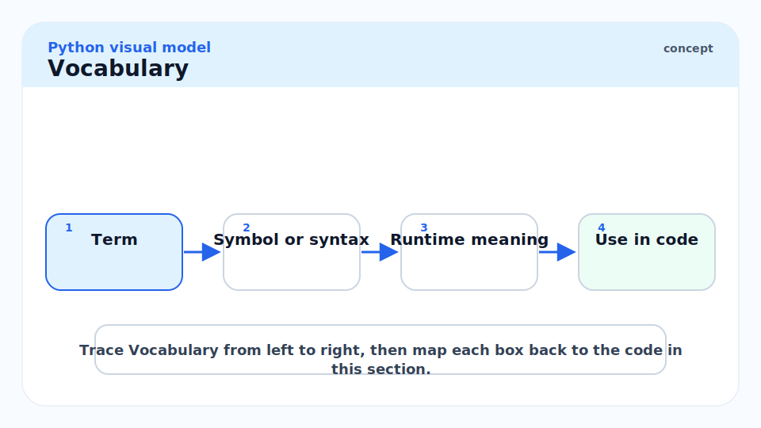

**Object**: The fundamental entity in Python's runtime. Every object has a unique identity, a type, and a value. In CPython, an object is a `PyObject` C struct.

---

**Identity** (`id(obj)`): An integer guaranteed to be unique and constant for the lifetime of an object. In CPython, it is the memory address of the `PyObject`. Two objects with the same `id` cannot exist simultaneously; after one is deallocated, a new object may receive the same address.

```python
x = [1, 2, 3]
print(id(x))  # >>> some integer, e.g. 140234567890
```

---

**`is` operator**: Tests identity — whether two names refer to the *same* object. Equivalent to `id(a) == id(b)`.

---

**`==` operator**: Tests equality — whether two objects have the *same value*. Implemented by `__eq__`. Two distinct objects can be equal.

---

**Type** (`type(obj)`): Every object has a type object that determines its behaviour. `type(42)` is `<class 'int'>`. The type is itself an object (of type `type`).

---

**Mutable object**: An object whose value can change after creation. `list`, `dict`, `set`, user-defined classes (by default). The object's `id` stays constant; only its contents change.

---

**Immutable object**: An object whose value cannot change after creation. `int`, `float`, `str`, `bytes`, `tuple`, `frozenset`. "Changing" an immutable always creates a new object.

---

**Small-integer cache**: CPython pre-allocates integer objects for the range `[-5, 256]`. Any `int` in this range is a singleton — you always get the same object. Numbers outside this range are freshly allocated.

---

**String interning**: CPython automatically interns string literals that look like identifiers (pure ASCII, no spaces, reasonable length). Interned strings are singletons. `sys.intern(s)` forces interning.

---

**`__hash__`**: The dunder method that makes an object hashable. Required for use as a dict key or set member. For objects where `__eq__` is defined, `__hash__` must also be defined consistently: `a == b` implies `hash(a) == hash(b)`.

---

**Dunder method** (double-underscore method, "magic method"): A specially-named method (e.g. `__add__`, `__len__`, `__iter__`) that the Python interpreter calls when the corresponding language operation is performed. The data model is the complete catalogue of dunders and what they enable.

---

**Namespace**: A dictionary mapping names to objects. Module globals, function locals, class bodies, and built-ins are all namespaces. The LEGB rule (Local → Enclosing → Global → Built-in) describes lookup order.

---

## Intuition

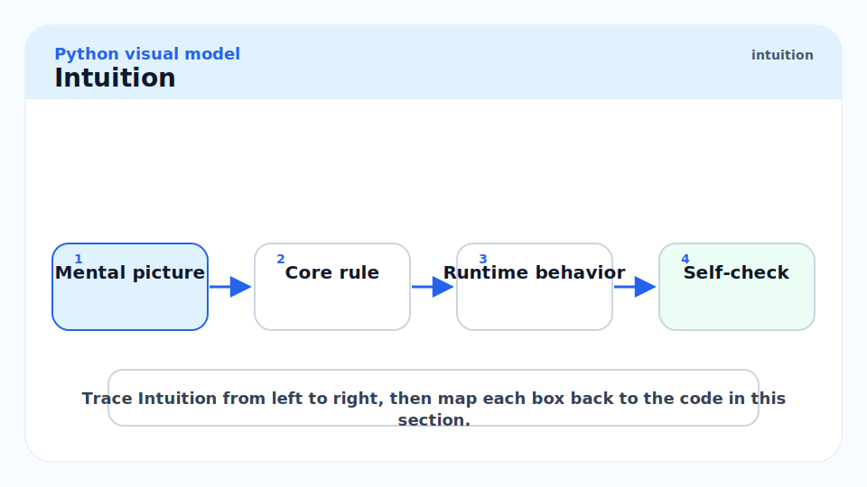

Python variables are not boxes — they are sticky notes. When you write `x = [1, 2, 3]`, Python creates a list object somewhere in memory and sticks the label `x` on it. When you write `y = x`, you paste a second label `y` on the *same* object. Modifying `y.append(4)` also modifies `x` because they refer to the same list. This is aliasing, and it is the single most common source of subtle bugs for Python newcomers.

Immutability is not about the name — it is about the object. The name `x = 5` can be rebound to `x = 6`, but the object `5` itself never changes. You created a new `int(6)` object and stuck the `x` label on it instead.

The dunder protocol is the language's extensibility hook. When you write `a + b`, Python calls `a.__add__(b)` (or `b.__radd__(a)` if the first returns `NotImplemented`). This is not special-cased for built-in types — the same machinery applies to your own classes, which is why you can write custom numeric types, custom containers, and custom context managers that look and feel like built-ins.

## Objects, References, and Aliasing

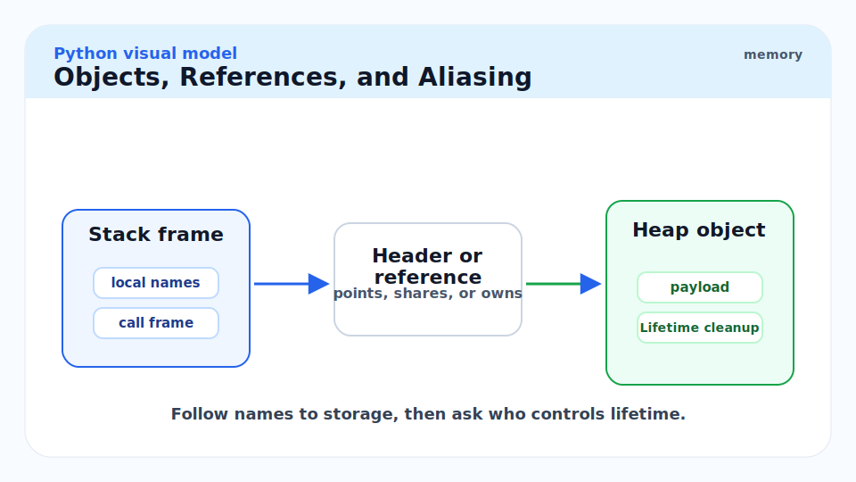

Every assignment in Python creates a reference, not a copy. The diagram below shows the memory state after `x = [1, 2]; y = x`.

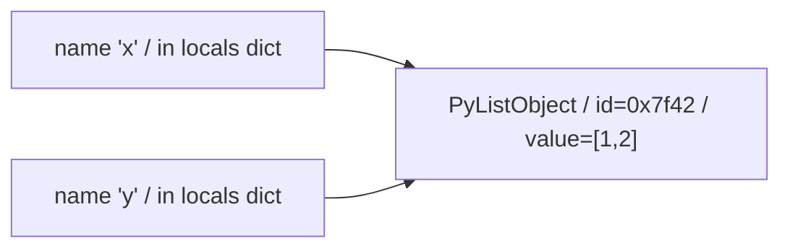

```python
x: list[int] = [1, 2]
y = x             # y is an alias, not a copy

y.append(3)
print(x)          # >>> [1, 2, 3]  — x changed!

# To copy: use list() or .copy() or x[:]
z = x.copy()
z.append(4)
print(x)          # >>> [1, 2, 3]  — x unchanged
```

> [!WARNING]
> `y = x` for a mutable object does **not** copy. This applies to lists, dicts, sets, and any user-defined class. If you need an independent copy, call `.copy()` for a shallow copy or `copy.deepcopy()` for a deep copy. Forgetting this in function calls — passing a mutable default that gets mutated — is one of the most common Python bugs.

### `is` vs `==`

`is` asks "are these the exact same object?" `==` asks "do these objects have the same value?" For immutables, Python may return the same object (due to caching or interning), making `is` appear to work — but it is not guaranteed.

```python
a = 256
b = 256
print(a is b)   # >>> True  — small-int cache, same object

a = 257
b = 257
print(a is b)   # >>> False — above cache range, two distinct objects
print(a == b)   # >>> True  — same value

s1 = "hello"
s2 = "hello"
print(s1 is s2)  # >>> True  — string interning
s3 = "hello world"
s4 = "hello world"
print(s3 is s4)  # >>> depends on CPython version; do NOT rely on this
```

> [!IMPORTANT]
> **Always use `==` to test equality of values. Reserve `is` for testing against singletons: `None`, `True`, `False`.** The idiom `if x is None:` is correct and canonical. `if x == None:` is technically correct but fragile — a class could define `__eq__` to return `True` for `None` comparisons. PEP 8 mandates `is`/`is not` for singleton comparisons.

### Small-Integer Cache and String Interning

CPython pre-allocates `int` objects for the range `[-5, 256]` at interpreter startup. This is an implementation detail of CPython — do not write code that depends on it. The cache exists because small integers are used everywhere and allocating a new `PyObject` for every `1 + 1` would be prohibitively slow.

```python
import sys

# Small int cache
x = 100
y = 100
print(x is y, id(x) == id(y))   # >>> True True

# Above cache
x = 1000
y = 1000
print(x is y, id(x) == id(y))   # >>> False False (usually)

# Force interning
s1 = sys.intern("my identifier")
s2 = sys.intern("my identifier")
print(s1 is s2)  # >>> True
```

## Mutable vs Immutable

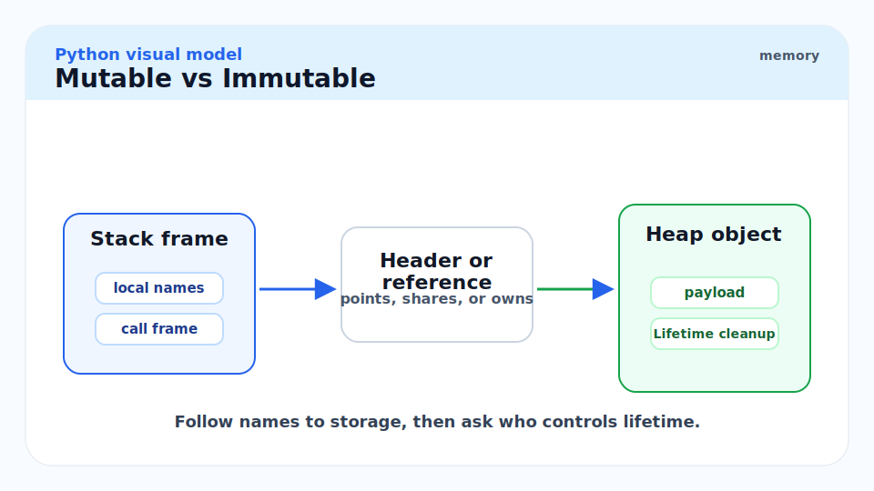

Mutability is a property of the *type*, not the variable binding. The distinction determines copy semantics, hashability, and thread-safety.

| Type | Mutable? | Hashable? | Notes |
| :--- | :---: | :---: | :--- |
| `int`, `float`, `complex` | No | Yes | Immutable scalars |
| `str` | No | Yes | Immutable sequence |
| `bytes` | No | Yes | Immutable byte sequence |
| `tuple` | No | If contents are hashable | Immutable sequence |
| `frozenset` | No | Yes | Immutable set |
| `list` | Yes | No | Mutable sequence |
| `dict` | Yes | No | Mutable mapping |
| `set` | Yes | No | Mutable set |
| User-defined class | Yes (default) | Yes if `__hash__` defined | |

```python
# Immutable: "changing" creates a new object
s = "hello"
old_id = id(s)
s += " world"
print(id(s) == old_id)   # >>> False — new str object

# Mutable: in-place modification keeps same object
lst = [1, 2, 3]
old_id = id(lst)
lst.append(4)
print(id(lst) == old_id)  # >>> True — same list object
```

> [!NOTE]
> A `tuple` containing a `list` is technically "immutable" — you cannot replace the list inside the tuple with a different object. But you *can* mutate the list itself. The tuple is immutable at the reference level; the list it contains remains mutable. This is why tuples are not unconditionally hashable: `hash((1, [2]))` raises `TypeError`.

## Tuples vs Lists

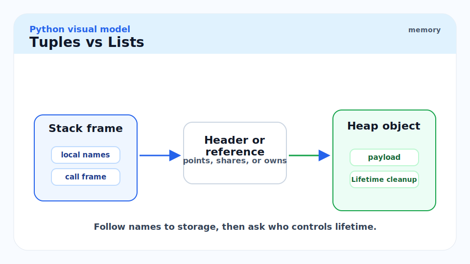

Both are ordered sequences. The performance and semantic differences matter:

- **Lists** are for homogeneous sequences of items you intend to mutate (append, remove, sort). Backed by a dynamic array; over-allocation for amortised O(1) append.
- **Tuples** are for heterogeneous records of fixed length (coordinates, database rows, function return values). Slightly smaller memory footprint. Hashable if all elements are. Slightly faster to create and iterate.

```python
import sys

lst = [1, 2, 3, 4]
tpl = (1, 2, 3, 4)

print(sys.getsizeof(lst))   # >>> 88  (64-bit, 4 elements + header + over-alloc)
print(sys.getsizeof(tpl))   # >>> 72  (exact allocation, no over-alloc)
```

## The Dunder Protocol Overview

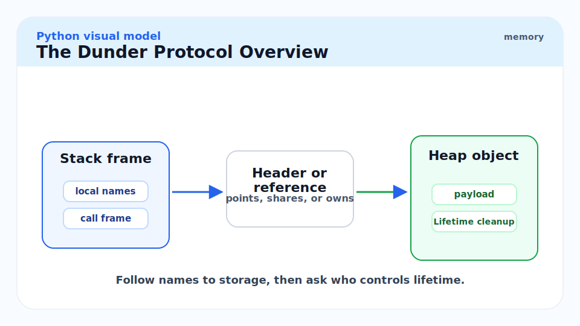

The Python data model defines over 80 dunder methods. Each one enables a specific language feature. The categories and their key dunders:

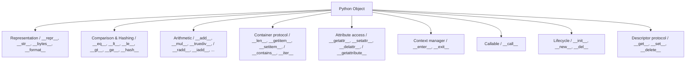

```python
from typing import Any


class Vector:
    """A minimal 2D vector demonstrating core dunder methods."""

    def __init__(self, x: float, y: float) -> None:
        self.x = x
        self.y = y

    def __repr__(self) -> str:
        return f"Vector({self.x!r}, {self.y!r})"

    def __add__(self, other: object) -> "Vector":
        if not isinstance(other, Vector):
            return NotImplemented
        return Vector(self.x + other.x, self.y + other.y)

    def __mul__(self, scalar: float) -> "Vector":
        return Vector(self.x * scalar, self.y * scalar)

    def __rmul__(self, scalar: float) -> "Vector":
        return self.__mul__(scalar)

    def __abs__(self) -> float:
        return (self.x ** 2 + self.y ** 2) ** 0.5

    def __bool__(self) -> bool:
        return bool(abs(self))

    def __eq__(self, other: object) -> bool:
        if not isinstance(other, Vector):
            return NotImplemented
        return self.x == other.x and self.y == other.y

    def __hash__(self) -> int:
        return hash((self.x, self.y))


v1 = Vector(3.0, 4.0)
v2 = Vector(1.0, 2.0)
print(v1 + v2)          # >>> Vector(4.0, 6.0)
print(2.5 * v1)         # >>> Vector(7.5, 10.0)  — uses __rmul__
print(abs(v1))          # >>> 5.0
print(bool(Vector(0.0, 0.0)))  # >>> False
print({v1, v2})         # set works because __hash__ defined
```

> [!TIP]
> When `__add__` returns `NotImplemented` (not `raise TypeError`, but `return NotImplemented`), Python tries `other.__radd__(self)` before raising. This cooperative protocol lets third-party numeric types interoperate with yours without knowing about each other. Always `return NotImplemented` rather than raising when the operand type is unrecognised.

## Real-world Example

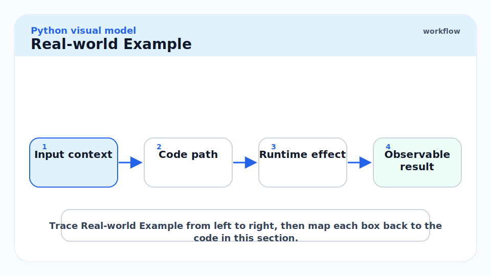

A practical demonstration of how identity and mutability interact in production code — specifically the notorious mutable default argument trap and its idiomatic fix.

```python
from typing import Any
import copy


# BAD: mutable default argument — the list is shared across all calls
def bad_append(item: int, lst: list[int] = []) -> list[int]:
    lst.append(item)
    return lst

print(bad_append(1))   # >>> [1]
print(bad_append(2))   # >>> [1, 2]  — not [2]!
print(bad_append(3))   # >>> [1, 2, 3]


# GOOD: use None as sentinel, create new list each call
def good_append(item: int, lst: list[int] | None = None) -> list[int]:
    if lst is None:
        lst = []
    lst.append(item)
    return lst

print(good_append(1))  # >>> [1]
print(good_append(2))  # >>> [2]


# GOOD: demonstrate deep copy semantics for nested mutables
original: dict[str, list[int]] = {"a": [1, 2], "b": [3, 4]}
shallow = original.copy()
deep = copy.deepcopy(original)

original["a"].append(99)

print(shallow["a"])   # >>> [1, 2, 99]  — shallow copy shares inner lists
print(deep["a"])      # >>> [1, 2]       — deep copy is fully independent


# Identity-based caching with a dict (manual intern table)
_cache: dict[tuple[int, int], object] = {}

def cached_pair(a: int, b: int) -> object:
    key = (a, b)
    if key not in _cache:
        _cache[key] = object()
    return _cache[key]

x = cached_pair(1, 2)
y = cached_pair(1, 2)
print(x is y)   # >>> True — same cached object
```

> [!WARNING]
> The mutable default argument bug is the most common Python footgun. Default argument values are evaluated **once** at function definition time, not each call. A `list`, `dict`, or `set` default is shared across every invocation of the function. Always use `None` as the default for mutable arguments and construct the mutable inside the function body.

## In Practice

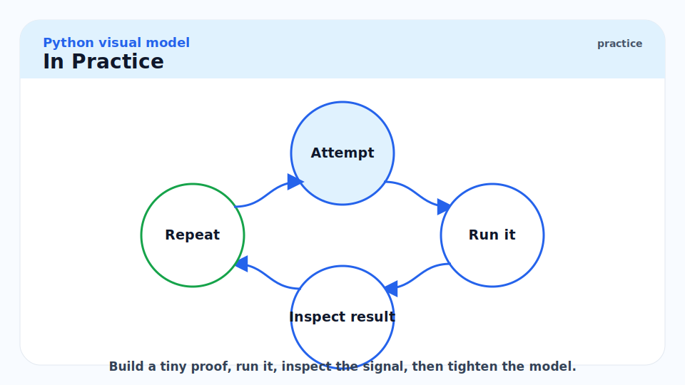

**Attribute lookup is expensive.** Every `obj.name` traverses `obj.__dict__`, then `type(obj).__dict__`, then the MRO chain. In tight loops, cache attribute lookups as local variables: `fn = obj.method; for x in data: fn(x)` is measurably faster than `for x in data: obj.method(x)`.

**`__slots__` eliminates `__dict__`.** For classes with a fixed set of attributes and many instances (e.g. coordinate objects, graph nodes), `__slots__ = ('x', 'y')` prevents the per-instance `__dict__`, reducing memory from ~200 bytes to ~56 bytes per instance. Covered in detail in [5 - Classes, Inheritance, MRO, ABCs](./5-classes-inheritance-mro-abcs.md).

**String comparison is O(n) unless interned.** For hot-path comparisons on a small fixed set of strings (status codes, operation names), `sys.intern` makes them O(1) identity comparisons. This is what CPython itself does for identifier strings.

> [!CAUTION]
> Do not store sensitive data (passwords, tokens, PII) in `str` objects without clearing them explicitly. Because strings are immutable, you cannot zero out the memory — the bytes remain in the C heap until the GC collects the object, which may be much later. Use `bytearray` for secrets that you need to zero explicitly: `secret_bytes[:] = b'\x00' * len(secret_bytes)`.

## Pitfalls

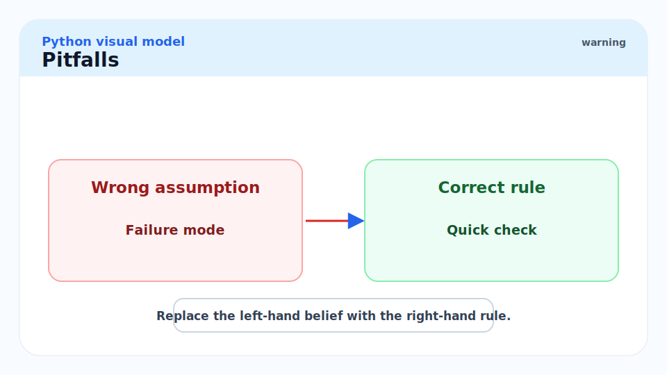

- **"`is` works for strings so I can use it for equality."** — String interning is an implementation detail of CPython and applies only to identifier-shaped strings. `"hello" is "hello"` may be `True` in CPython but is not guaranteed by the language spec. Use `==`.
- **"Immutable objects cannot be modified."** — Correct, but a variable bound to an immutable can be rebound. `x = 5; x = 6` does not modify the integer 5; it creates a new integer 6 and rebinds `x`. The integer 5 object is unchanged.
- **"Tuples are faster than lists for iteration."** — The difference is negligible for iteration. Tuples matter for memory (no over-allocation) and hashability, not for loop speed.
- **"`__hash__` is optional."** — If you define `__eq__`, Python 3 automatically sets `__hash__ = None`, making your class unhashable. You must explicitly define `__hash__` if you want equality-aware instances to be usable as dict keys.
- **"Default arguments are evaluated each call."** — No. They are evaluated once, at `def` time. The default value lives in `func.__defaults__`. This is the mutable default trap.

## Exercises

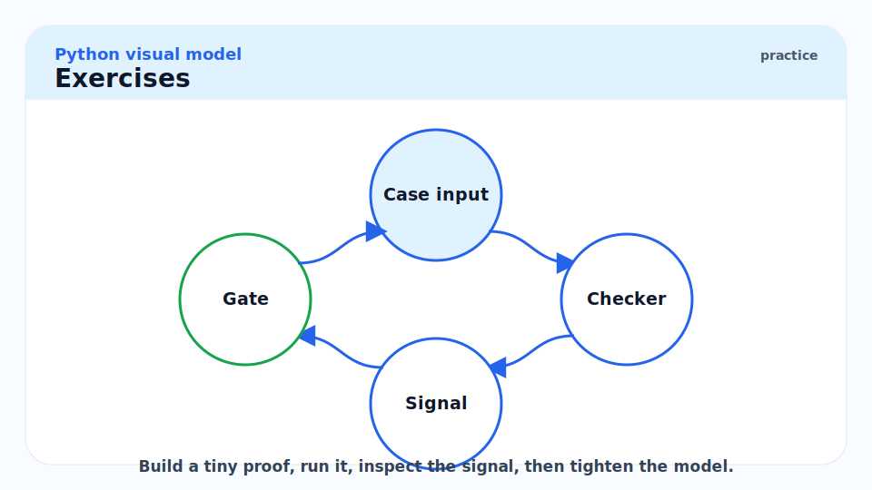

### Exercise 1 — Identity vs equality

What does the following print? Explain each line.

```python
a = (1, 2, [3, 4])
b = (1, 2, [3, 4])
print(a == b)
print(a is b)
a[2].append(5)
print(a == b)
```

#### Solution

**`a == b` → `True`**: Tuple equality is recursive. `(1, 2, [3, 4]) == (1, 2, [3, 4])` because each element compares equal.

**`a is b` → `False`**: `a` and `b` are two distinct tuple objects, allocated separately. Tuples of non-trivial length are not interned.

**After `a[2].append(5)`, `a == b` → `False`**: `a[2]` is the list `[3, 4]` inside tuple `a`. Appending to it makes it `[3, 4, 5]`. Tuple `b[2]` is a different list `[3, 4]`, unchanged. Now `a[2] != b[2]`, so `a != b`. This also demonstrates that a "immutable" tuple can change in value if it contains mutable objects.

---

### Exercise 2 — Hash consistency

Why does the following raise `TypeError`?

```python
s = {[1, 2, 3]}
```

#### Solution

`set` requires its elements to be hashable. Lists are mutable and therefore not hashable (`list.__hash__` is `None`). If lists were hashable, you could do: `lst = [1, 2]; s = {lst}; lst.append(3)` — now the hash of the list changes, but the set has it stored under the old hash bucket, making the set internally inconsistent (you would not be able to find `lst` in the set anymore). Python prevents this by making all mutable built-in containers non-hashable. Use a `tuple` when you need a hashable sequence: `{(1, 2, 3)}` works.

---

### Exercise 3 — Dunder method dispatch

Implement a `Money` class supporting `+` and `*` (by an `int` scalar), with correct `__repr__` and `__eq__`.

#### Solution

```python
from __future__ import annotations
from typing import Any


class Money:
    """Represents an amount in a specific currency."""

    def __init__(self, amount: float, currency: str) -> None:
        self.amount = amount
        self.currency = currency

    def __repr__(self) -> str:
        return f"Money({self.amount!r}, {self.currency!r})"

    def __add__(self, other: object) -> Money:
        if not isinstance(other, Money):
            return NotImplemented
        if self.currency != other.currency:
            raise ValueError(
                f"Cannot add {self.currency} and {other.currency}"
            )
        return Money(self.amount + other.amount, self.currency)

    def __mul__(self, scalar: int | float) -> Money:
        if not isinstance(scalar, (int, float)):
            return NotImplemented
        return Money(self.amount * scalar, self.currency)

    def __rmul__(self, scalar: int | float) -> Money:
        return self.__mul__(scalar)

    def __eq__(self, other: object) -> bool:
        if not isinstance(other, Money):
            return NotImplemented
        return self.amount == other.amount and self.currency == other.currency

    def __hash__(self) -> int:
        return hash((self.amount, self.currency))


a = Money(10.0, "USD")
b = Money(5.0, "USD")
print(a + b)       # >>> Money(15.0, 'USD')
print(3 * a)       # >>> Money(30.0, 'USD')
print(a == Money(10.0, "USD"))  # >>> True
```

Key points: `__rmul__` handles `3 * money`; returning `NotImplemented` (not raising) allows Python to try the reflected operation on the other operand; defining `__hash__` alongside `__eq__` keeps the object usable in sets and as dict keys.

---

### Exercise 4 — Predict the output

```python
x: list[int] = [1, 2, 3]
y = x
y += [4, 5]
print(x)
print(x is y)
```

Now compare with:

```python
x: tuple[int, ...] = (1, 2, 3)
y = x
y += (4, 5)
print(x)
print(x is y)
```

#### Solution

**List case**: `y += [4, 5]` calls `list.__iadd__`, which extends the list in-place and returns `self`. So `y` still refers to the same list object that `x` refers to. `x` now contains `[1, 2, 3, 4, 5]`. `x is y` → `True`.

**Tuple case**: `y += (4, 5)` calls `tuple.__add__` (tuples have no `__iadd__`), which creates a *new* tuple `(1, 2, 3, 4, 5)` and binds `y` to it. `x` still points to the original `(1, 2, 3)`. `x` → `(1, 2, 3)`. `x is y` → `False`.

The lesson: `+=` calls `__iadd__` if defined (mutable containers) and falls back to `__add__` + rebind if not (immutable containers). This means `+=` on mutable objects mutates in-place (potentially affecting aliases), while `+=` on immutable objects creates a new object (aliases are unaffected).

## Sources

- Python Data Model reference — https://docs.python.org/3/reference/datamodel.html
- Ramalho, L. *Fluent Python* (2nd ed., 2022). Chapters 1 and 11.
- PEP 3107 — Function Annotations — https://peps.python.org/pep-3107/
- Raymond Hettinger, "Python's Class Development Toolkit" (PyCon 2013) — https://www.youtube.com/watch?v=HTLu2DFOdTg
- CPython `Objects/object.c` — https://github.com/python/cpython/blob/main/Objects/object.c

## Related

- [1 - What is Python](./1-what-is-python.md)
- [3 - Iterables, Iterators, and Generators](./3-iterables-iterators-and-generators.md)
- [4 - Functions, Closures, Decorators](./4-functions-closures-decorators.md)
- [5 - Classes, Inheritance, MRO, ABCs](./5-classes-inheritance-mro-abcs.md)
