# 20 - List Comprehensions and Generator Expressions

[toc]

> **TL;DR:** A list comprehension builds a list immediately. A generator expression describes a stream of values that are produced lazily. They look similar, but the memory behavior and reuse behavior are different.

## Vocabulary

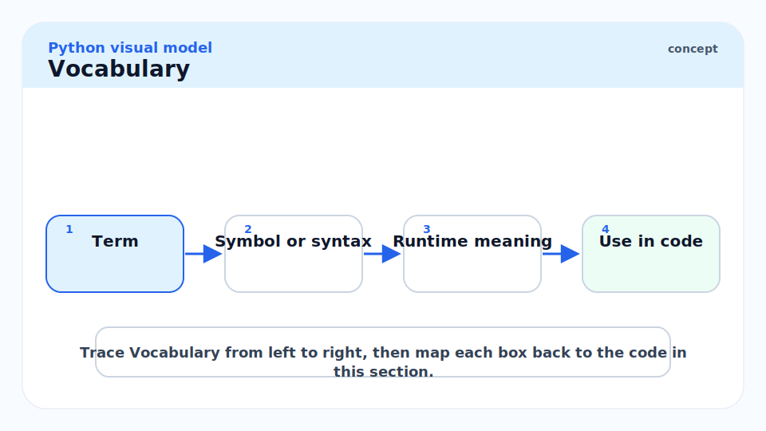

**Comprehension**

```math
[expression\ for\ item\ in\ iterable]
```

A compact Python syntax for building a collection from an iterable.

**List comprehension**

```math
[f(x)\ for\ x\ in\ xs]
```

An eager comprehension that creates a new list immediately.

**Generator expression**

```math
(f(x)\ for\ x\ in\ xs)
```

A lazy expression that returns a generator object. It produces one value at a time when something iterates over it.

**Iterable**

```math
iterable \rightarrow iterator
```

An object that can be looped over, such as a list, tuple, string, range, file, dictionary, or generator.

**Iterator**

```math
next(iterator)
```

An object that remembers its current position and returns the next value when asked.

**Eager evaluation**

```math
all\ values\ now
```

The work happens immediately and stores all results.

**Lazy evaluation**

```math
one\ value\ when\ needed
```

The work is delayed until the next value is requested.

## The Syntax You Asked About

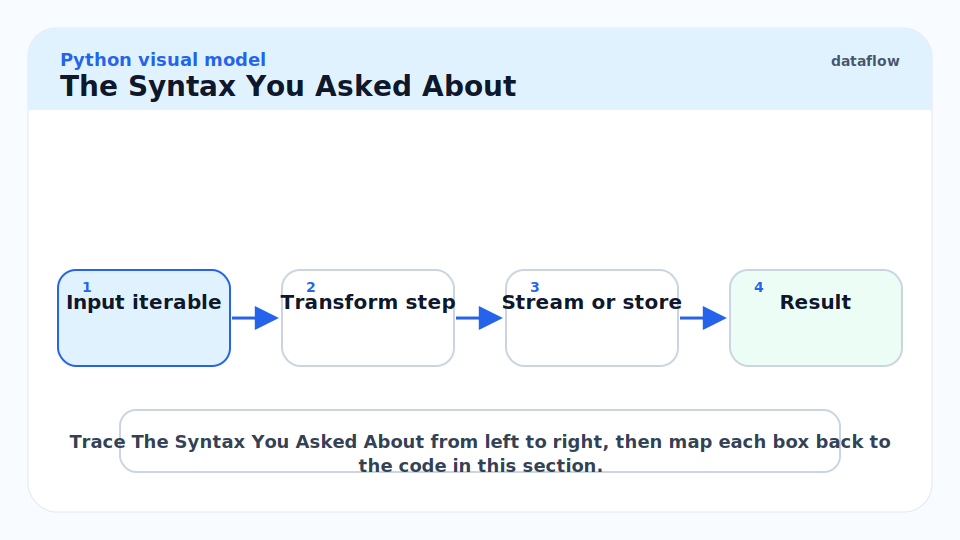

This line creates sorted `(value, original_index)` pairs:

```python
pairs = sorted((num, i) for i, num in enumerate(nums))
```

The inside part is a generator expression:

```python
(num, i) for i, num in enumerate(nums)
```

Because it is passed directly into `sorted(...)`, Python allows us to omit one extra pair of parentheses. These two forms mean the same thing:

```python
pairs = sorted((num, i) for i, num in enumerate(nums))
pairs = sorted(((num, i) for i, num in enumerate(nums)))
```

Read it as:

```text
for each index/value pair from enumerate(nums),
create a tuple shaped like (value, index),
then give those tuples to sorted.
```

For example:

```python
nums = [3, 2, 4]
pairs = sorted((num, i) for i, num in enumerate(nums))
print(pairs)
# [(2, 1), (3, 0), (4, 2)]
```

The sorting uses the tuple's first item first, so the pairs are sorted by the number. The original index stays attached as the second item.

## List Comprehension

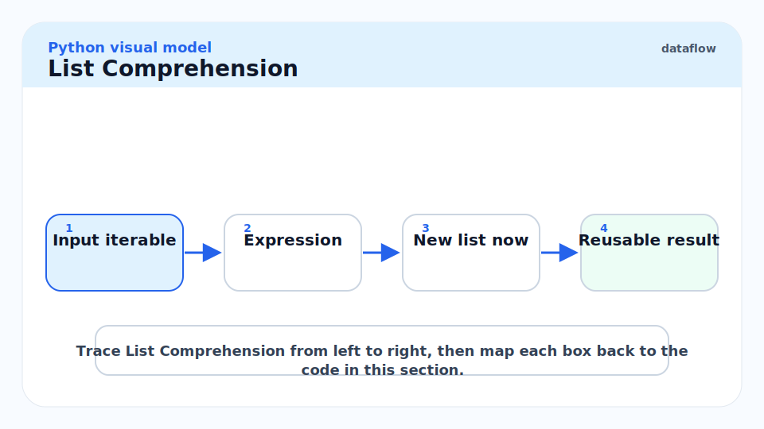

A list comprehension uses square brackets. It builds the whole list immediately.

```python
nums = [1, 2, 3, 4]
squares = [num * num for num in nums]

print(squares)
# [1, 4, 9, 16]
```

This is equivalent to a normal loop that appends into a list.

```python
nums = [1, 2, 3, 4]
squares = []

for num in nums:
    squares.append(num * num)

print(squares)
# [1, 4, 9, 16]
```

Use a list comprehension when you need the final list, need `len(...)`, need indexing, or plan to loop over the results more than once.

## Generator Expression

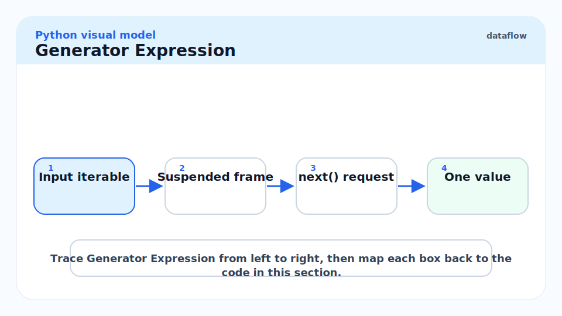

A generator expression usually uses parentheses. It does not build the whole result immediately.

```python
nums = [1, 2, 3, 4]
squares = (num * num for num in nums)

print(next(squares))
# 1
print(next(squares))
# 4
```

The generator remembers where it stopped. It computes the next value only when `next(...)` or a loop asks for it.

```python
nums = [1, 2, 3, 4]
squares = (num * num for num in nums)

for value in squares:
    print(value)

# 1
# 4
# 9
# 16
```

Use a generator expression when you only need to iterate once and do not need to store every result.

## Side-By-Side

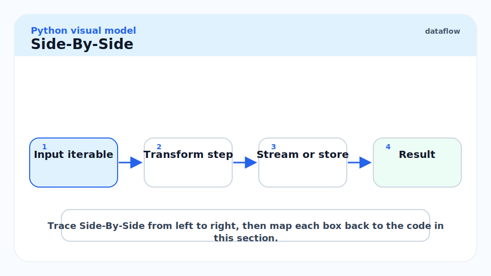

The easiest way to remember the difference is the bracket shape.

| Syntax | Name | Evaluation | Result type | Reusable? |
| --- | --- | --- | --- | --- |
| `[x * x for x in nums]` | list comprehension | eager | `list` | yes |
| `(x * x for x in nums)` | generator expression | lazy | `generator` | no, single pass |

This small example shows the reuse difference.

```python
nums = [1, 2, 3]

list_values = [num * 2 for num in nums]
gen_values = (num * 2 for num in nums)

print(list(list_values))
# [2, 4, 6]
print(list(list_values))
# [2, 4, 6]

print(list(gen_values))
# [2, 4, 6]
print(list(gen_values))
# []
```

The list still has its values. The generator is exhausted after the first full pass.

## Adding Conditions

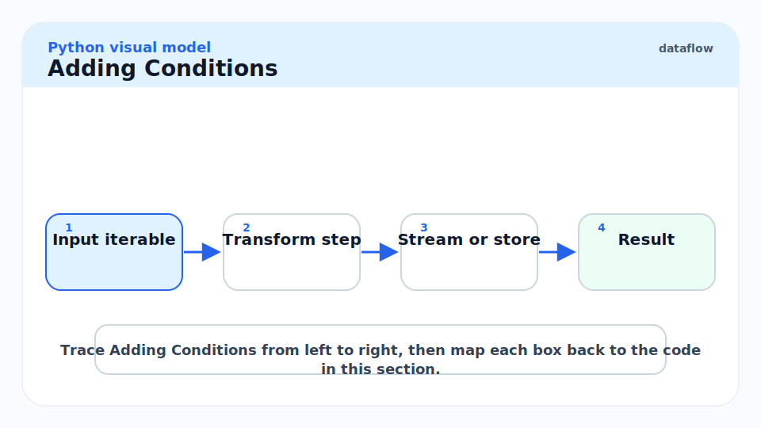

Both list comprehensions and generator expressions can include an `if` filter.

```python
nums = [1, 2, 3, 4, 5, 6]
even_squares = [num * num for num in nums if num % 2 == 0]

print(even_squares)
# [4, 16, 36]
```

Read it as:

```text
square num
for each num in nums
but only if num is even
```

The generator version is the same idea, but lazy.

```python
nums = [1, 2, 3, 4, 5, 6]
even_squares = (num * num for num in nums if num % 2 == 0)

print(sum(even_squares))
# 56
```

## Transform Versus Filter

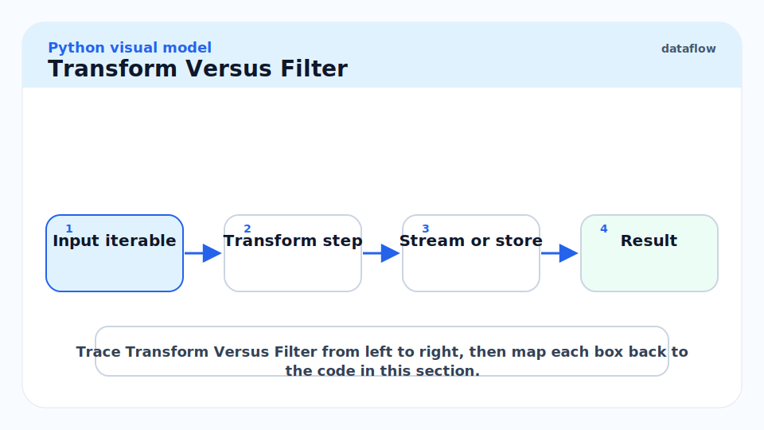

A comprehension often has two parts: transforming values and filtering values.

```python
words = ["python", "go", "swift", "js"]
long_upper = [word.upper() for word in words if len(word) >= 5]

print(long_upper)
# ['PYTHON', 'SWIFT']
```

Here:

- `word.upper()` transforms each kept value.
- `for word in words` chooses the source.
- `if len(word) >= 5` filters values.

The order in English is different from the order in code, so read comprehensions in this pattern:

```text
make this expression
for each item
from this iterable
if this condition is true
```

## Tuple Creation Inside Comprehensions

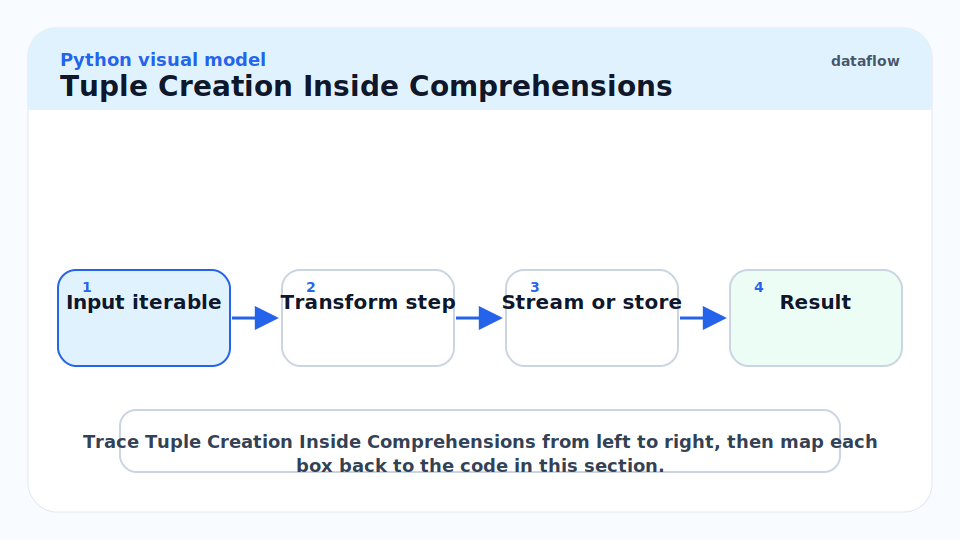

The expression part can create a tuple.

```python
nums = [3, 2, 4]
pairs = [(num, i) for i, num in enumerate(nums)]

print(pairs)
# [(3, 0), (2, 1), (4, 2)]
```

This is a list comprehension because it uses square brackets. It creates a real list of tuples immediately.

The generator expression version uses parentheses around the whole expression:

```python
nums = [3, 2, 4]
pairs_gen = ((num, i) for i, num in enumerate(nums))

print(next(pairs_gen))
# (3, 0)
```

When the generated item is itself a tuple, the parentheses can look noisy. Keep the mental split clear:

```python
(num, i)                 # tuple being produced
for i, num in enumerate(nums)  # loop producing many tuples
```

## Why `sorted(...)` Makes A List Anyway

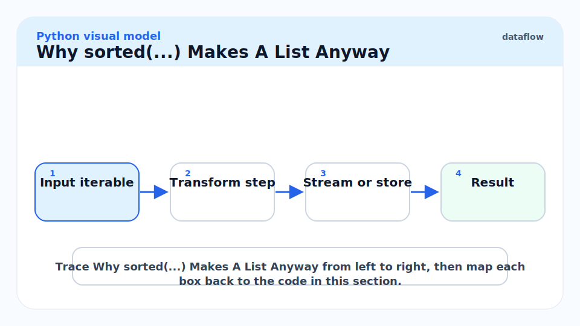

`sorted(...)` always returns a list because sorting needs to see all items before it can order them.

```python
nums = [3, 2, 4]
pairs = sorted((num, i) for i, num in enumerate(nums))

print(type(pairs))
# <class 'list'>
```

Even though the input is a generator expression, `sorted(...)` consumes it and produces a list.

For this specific case, both versions are fine:

```python
pairs_a = sorted((num, i) for i, num in enumerate(nums))
pairs_b = sorted([(num, i) for i, num in enumerate(nums)])
```

The generator expression avoids building an extra temporary list before sorting, but `sorted(...)` still builds the final sorted list.

## Memory Behavior

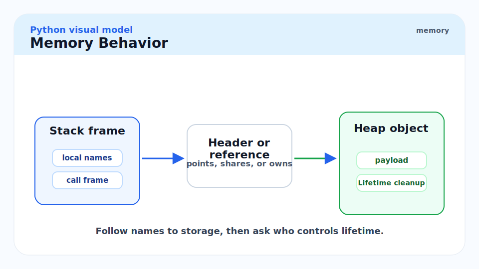

A list comprehension stores every result. A generator expression stores only the generator state and computes values as needed.

```python
import sys

values_list = [num * num for num in range(1_000_000)]
values_gen = (num * num for num in range(1_000_000))

print(sys.getsizeof(values_list))
print(sys.getsizeof(values_gen))
```

The exact byte counts depend on Python version and machine, but the shape is stable: the list grows with the number of elements, while the generator object stays small.

> [!IMPORTANT]
> A generator is memory-efficient because it does not remember all produced values. That also means you cannot index it, call `len(...)` on it, or reuse it after it is exhausted.

## Scope Behavior

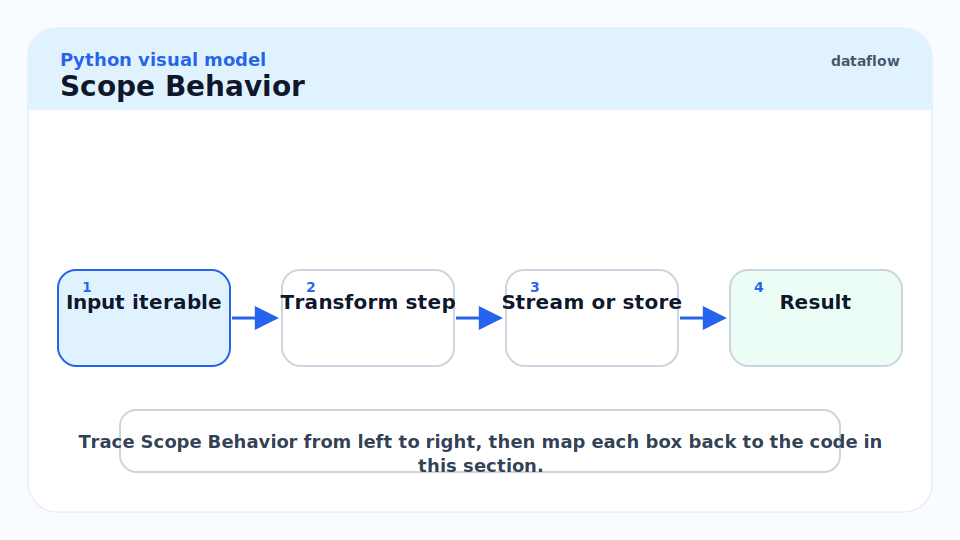

In modern Python, the loop variable inside a comprehension does not leak into the surrounding scope.

```python
num = "outside"
squares = [num * num for num in [1, 2, 3]]

print(num)
# outside
```

The `num` inside the comprehension is local to the comprehension. This is good because it prevents accidental overwrites in the surrounding code.

## Nested Comprehensions

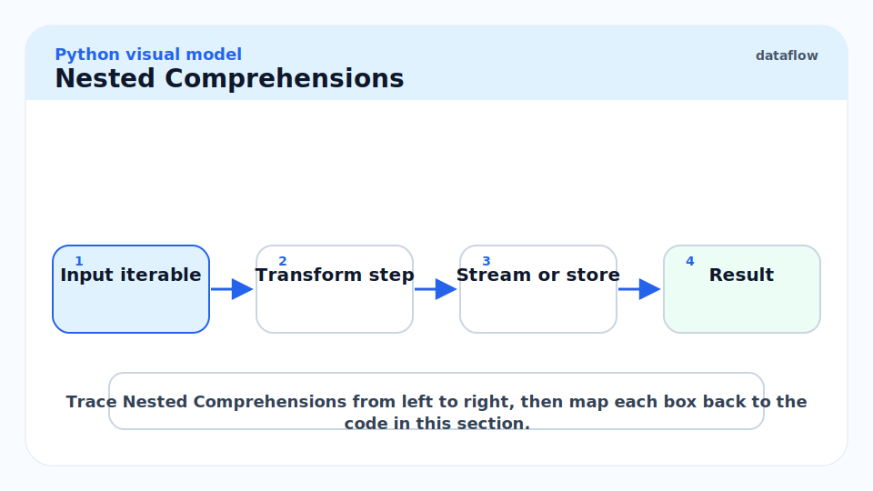

Nested comprehensions are legal, but they can get hard to read. Use them when they remain obvious.

```python
matrix = [
    [1, 2, 3],
    [4, 5, 6],
]

flattened = [value for row in matrix for value in row]

print(flattened)
# [1, 2, 3, 4, 5, 6]
```

Read the `for` clauses in the same order as normal nested loops:

```python
flattened = []

for row in matrix:
    for value in row:
        flattened.append(value)
```

If a comprehension needs multiple conditions, nested loops, and complex expressions, a normal loop is often clearer.

## When To Use Which

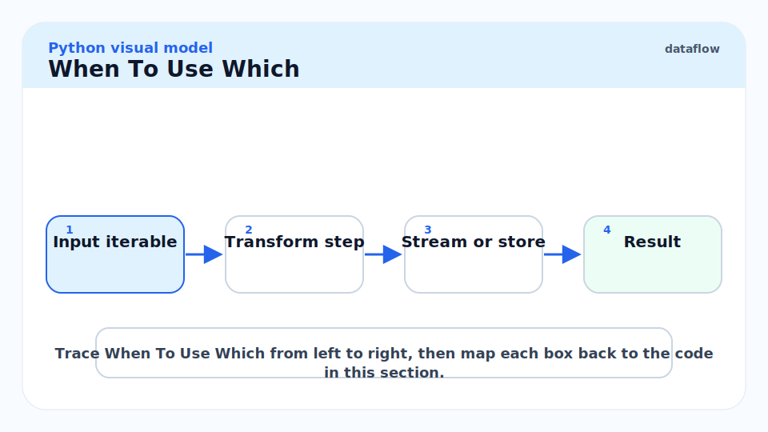

Use a list comprehension when:

- You need a list as the final value.
- You need to index the result.
- You need the length of the result.
- You will iterate over the result multiple times.
- The result size is reasonably small.

Use a generator expression when:

- You only need to iterate once.
- You pass values into a consuming function like `sum`, `any`, `all`, `max`, or `min`.
- The input may be large.
- You want pipeline-style lazy processing.

Examples:

```python
nums = [1, 2, 3, 4]

total = sum(num * num for num in nums)
has_even = any(num % 2 == 0 for num in nums)
first_big_square = next(num * num for num in nums if num * num > 8)

print(total)
print(has_even)
print(first_big_square)
```

These are good generator-expression uses because each consumer can process values one at a time.

## Common Mistakes

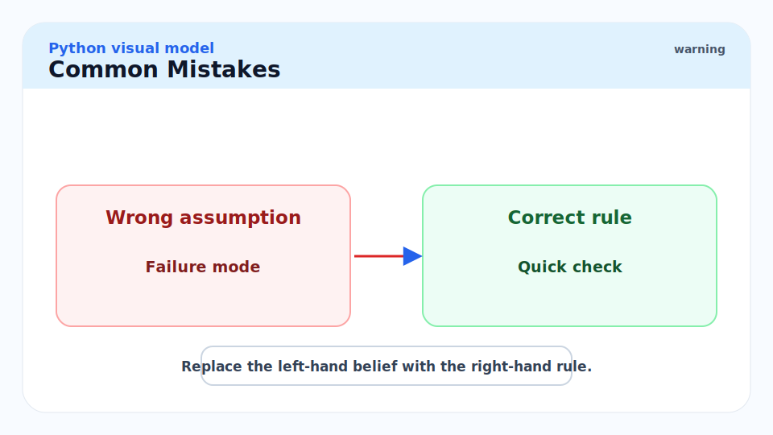

- **Expecting a generator to print like a list**: `print(x * x for x in nums)` shows a generator object, not the values.
- **Iterating a generator twice**: the second pass is empty.
- **Calling `len(...)` on a generator**: generators do not know their total length upfront.
- **Overpacking logic into one line**: readability beats cleverness.
- **Forgetting original indices after sorting**: use `(value, index)` pairs when sorting values for a problem that must return original positions.

## Interview Mental Model

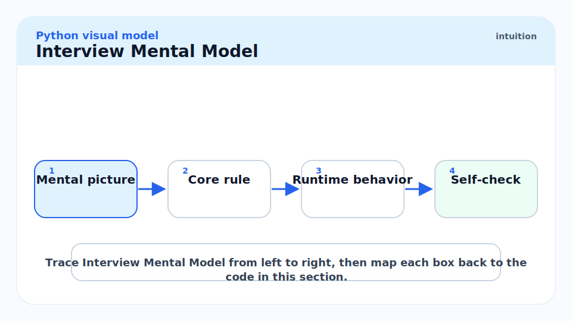

For a line like:

```python
pairs = sorted((num, i) for i, num in enumerate(nums))
```

Say:

> `enumerate(nums)` gives index and value. The generator expression flips each pair into `(value, index)`. `sorted(...)` consumes those pairs and returns a list sorted by value.

That explanation proves you understand the syntax, the tuple, the lazy generator expression, and why original indices are preserved.

## Practice

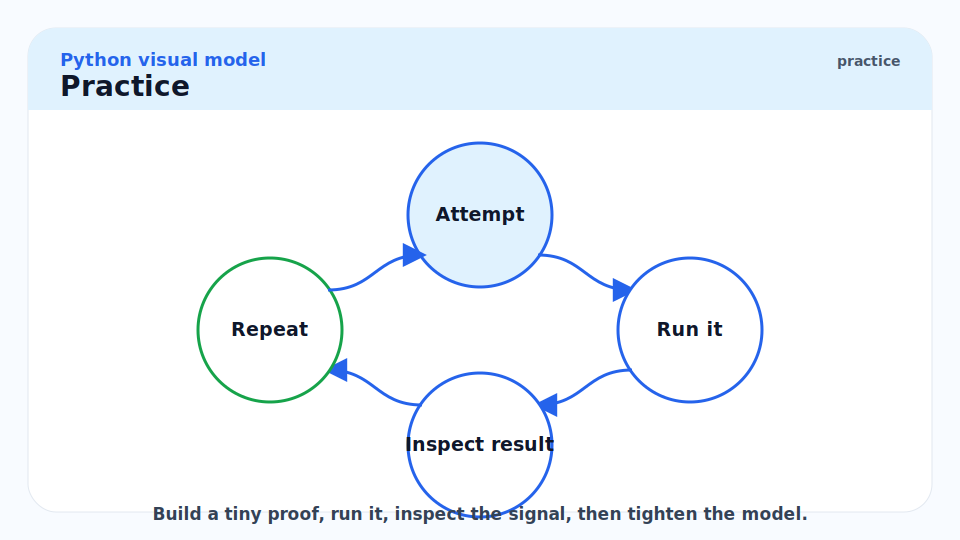

Run these small checks and say whether each line creates a list or a generator.

```python
nums = [1, 2, 3, 4]

a = [num + 1 for num in nums]
b = (num + 1 for num in nums)
c = sorted((num, i) for i, num in enumerate(nums))
d = [num for num in nums if num % 2 == 0]
e = sum(num for num in nums)

assert a == [2, 3, 4, 5]
assert list(b) == [2, 3, 4, 5]
assert c == [(1, 0), (2, 1), (3, 2), (4, 3)]
assert d == [2, 4]
assert e == 10
```

Answers:

- `a` is a list.
- `b` is a generator until `list(b)` consumes it.
- `c` is a list because `sorted(...)` returns a list.
- `d` is a list.
- `e` is an integer because `sum(...)` consumes the generator.

## Sources

- Conversation with user on 2026-06-10.
- Python documentation, displays for lists, sets and dictionaries: https://docs.python.org/3/reference/expressions.html#displays-for-lists-sets-and-dictionaries
- Python documentation, generator expressions: https://docs.python.org/3/reference/expressions.html#generator-expressions
- Python documentation, `enumerate`: https://docs.python.org/3/library/functions.html#enumerate
- Python documentation, `sorted`: https://docs.python.org/3/library/functions.html#sorted

## Related

- [3 - Iterables, Iterators, and Generators](./3-iterables-iterators-and-generators.md)
- [10 - Performance and the Standard Library](./10-performance-and-the-standard-library.md)
- [13 - Memory Model and PyObject Layout](./13-memory-model-and-pyobject-layout.md)
- [Two Pointers](../../Data-Structures-and-Algorithms/24-two-pointers.md)
