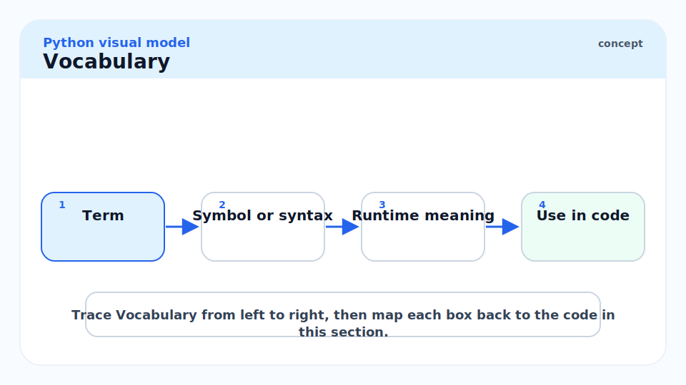
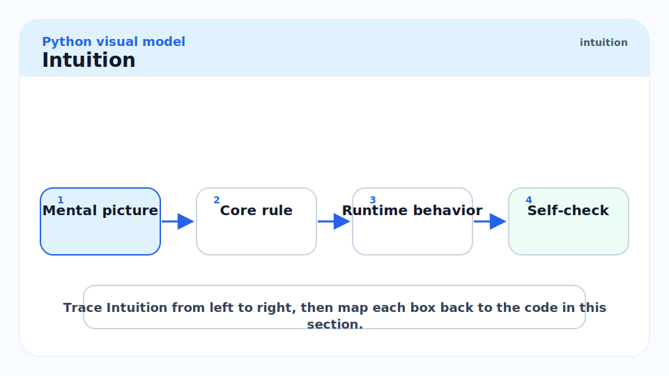
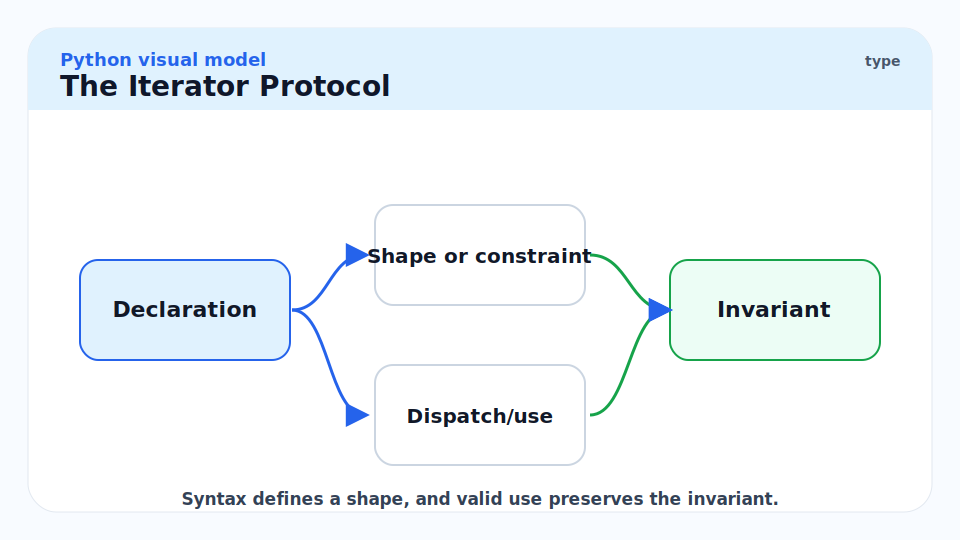
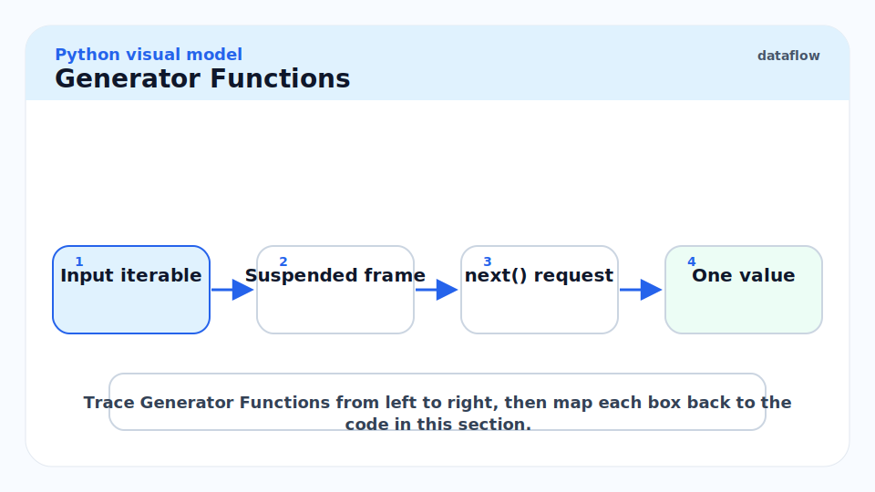
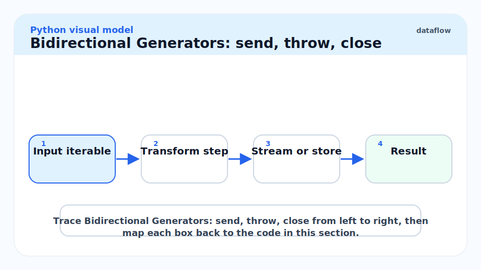
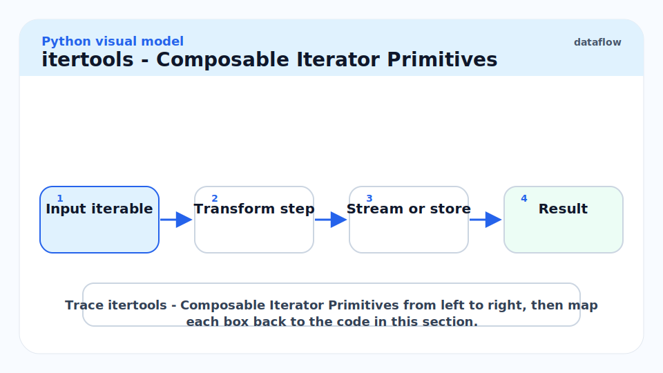
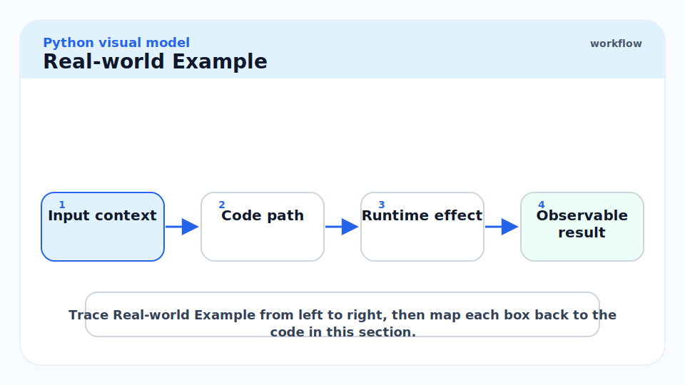
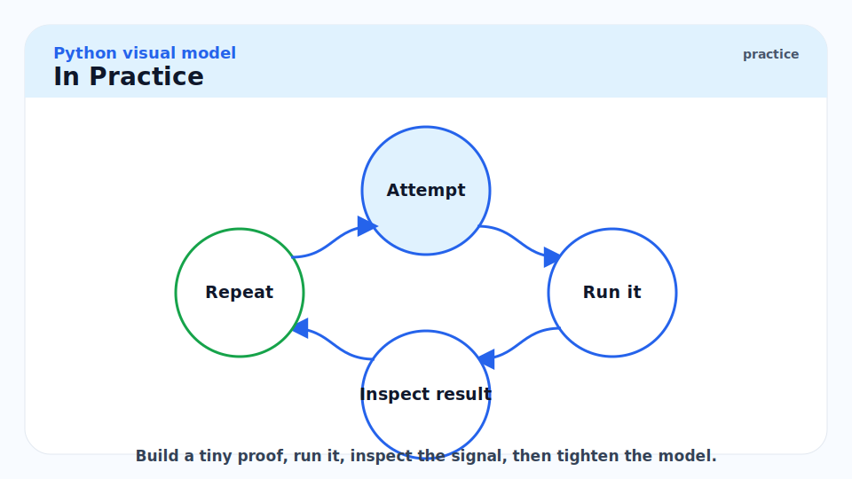
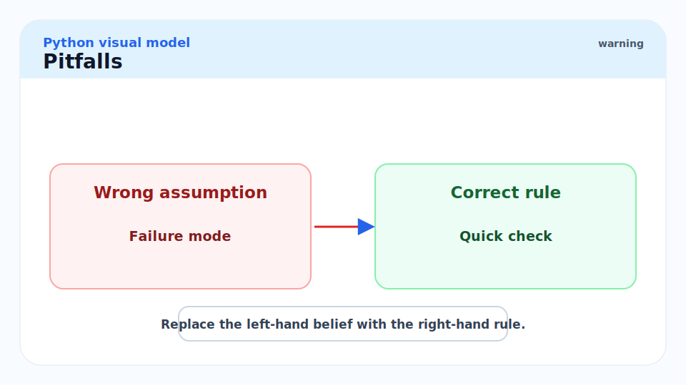
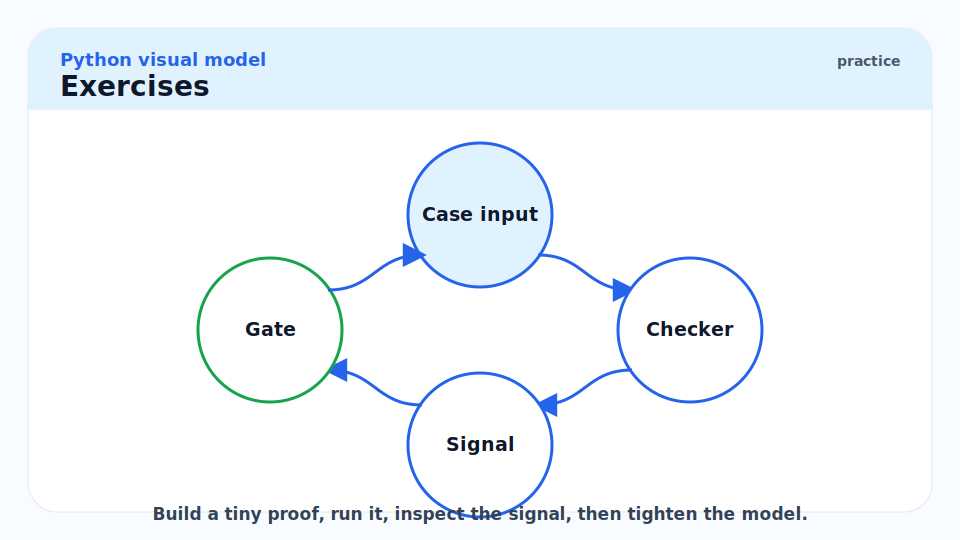

# 3 - Iterables, Iterators, and Generators

[toc]

> **TL;DR:** Python's iteration protocol separates two concerns: an *iterable* knows how to produce an iterator, and an *iterator* knows how to yield the next item. Generator functions and expressions are syntactic sugar for writing iterators without managing state manually — Python converts the function body into a state machine, suspending at each `yield` and resuming on the next `next()` call. Lazy evaluation via generators is the idiomatic Python mechanism for infinite sequences, streaming data pipelines, and memory-efficient transformations.

## Vocabulary



**Iterable**: Any object implementing `__iter__()`, returning an iterator. Lists, tuples, strings, files, dicts, sets, and generators are all iterables. The `for` loop and unpacking call `__iter__` implicitly.

---

**Iterator**: An object implementing both `__iter__()` (returns `self`) and `__next__()`. `__next__` returns the next value or raises `StopIteration` when exhausted. Iterators are single-use: once exhausted, they stay exhausted.

---

**Generator function**: A function containing at least one `yield` statement. Calling it returns a generator object (which is an iterator). The function body does not execute until `next()` is called.

---

**Generator expression**: A lazy comprehension using `()` syntax: `(x**2 for x in range(10))`. Equivalent to a generator function; returns a generator object.

---

**`yield`**: Suspends the generator, returning a value to the caller. Execution resumes from after the `yield` on the next `next()` call.

---

**`yield from`**: Delegates to a sub-iterable, yielding each of its items in turn. Transparently forwards `send`, `throw`, and `close` through to the sub-generator. Key for generator composition.

---

**`send(value)`**: Resumes a suspended generator and injects `value` as the result of the `yield` expression inside the generator. The first `send` must be `send(None)` (or `next()`), because no `yield` is yet suspended.

---

**`throw(exc)`**: Raises an exception at the point where the generator is suspended.

---

**`close()`**: Throws `GeneratorExit` into the generator, causing cleanup (`finally` blocks run).

---

**`StopIteration`**: The sentinel exception that signals an iterator is exhausted. The `for` loop catches this automatically. Since Python 3.7 (PEP 479), raising `StopIteration` inside a generator converts it to a `RuntimeError`.

---

**`itertools`**: The standard-library module (`import itertools`) providing building blocks for iterator pipelines: `islice`, `chain`, `product`, `groupby`, `accumulate`, `tee`, and more.

---

## Intuition



Think of an iterable as a recipe book, and an iterator as a bookmark in that book. `__iter__` gives you a bookmark; `__next__` turns one page. The same book can have multiple bookmarks (multiple iterators) in independent positions. But a bookmark itself is single-use — once you reach the back cover, it stays there. Creating a fresh iterator (calling `__iter__` again) is equivalent to starting from page 1 with a new bookmark.

A generator function is a recipe that doesn't bake the entire cake upfront — it bakes one slice at a time, only when you ask. The function body is the recipe; the generator object is the baker who pauses between slices and waits. This is lazy evaluation: computation deferred until the result is needed.

## The Iterator Protocol



### `__iter__` and `__next__`

The full protocol requires implementing two methods. Most iterables implement `__iter__` only and return a separate iterator object; iterators implement both and return `self` from `__iter__` (so they can be used directly in `for` loops).

```python
from typing import Iterator


class CountUp:
    """An iterable that produces integers from start to end (inclusive)."""

    def __init__(self, start: int, end: int) -> None:
        self.start = start
        self.end = end

    def __iter__(self) -> "CountUpIterator":
        return CountUpIterator(self.start, self.end)


class CountUpIterator:
    """The actual iterator — maintains state."""

    def __init__(self, current: int, end: int) -> None:
        self.current = current
        self.end = end

    def __iter__(self) -> "CountUpIterator":
        return self   # iterators must return self

    def __next__(self) -> int:
        if self.current > self.end:
            raise StopIteration
        value = self.current
        self.current += 1
        return value


counter = CountUp(1, 5)
for n in counter:
    print(n)
# >>> 1 2 3 4 5

# Re-iterate the same iterable — fresh iterator, starts over
for n in counter:
    print(n)
# >>> 1 2 3 4 5

it = iter(counter)
print(next(it))   # >>> 1
print(next(it))   # >>> 2
```

> [!IMPORTANT]
> **Iterators are not reusable. Iterables are.** A `list` is iterable — you can loop over it many times. The iterator produced by `iter(lst)` is exhausted after one full traversal. This distinction matters when passing sequences to functions that consume iterators: if you pass an iterator where a function needs to iterate twice, the second pass sees nothing.

### How `for` Desugars

The `for` statement is syntactic sugar for the iterator protocol. `for x in obj:` is equivalent to:

```python
from typing import Any

_it = iter(obj)          # calls obj.__iter__()
while True:
    try:
        x = next(_it)    # calls _it.__next__()
    except StopIteration:
        break
    # --- loop body ---
```

This means anything that implements `__iter__` / `__next__` works with `for`, `list()`, `tuple()`, `sum()`, `min()`, `max()`, and all other constructs that consume iterables.

## Generator Functions



### Basic Generator

A generator function contains `yield`. Calling it returns a generator object without executing any of the body. The body runs incrementally as `next()` is called.

```python
from collections.abc import Generator


def fibonacci() -> Generator[int, None, None]:
    """Infinite Fibonacci sequence."""
    a, b = 0, 1
    while True:
        yield a
        a, b = b, a + b


fib = fibonacci()
print([next(fib) for _ in range(10)])
# >>> [0, 1, 1, 2, 3, 5, 8, 13, 21, 34]
```

The `Generator[YieldType, SendType, ReturnType]` annotation captures all three roles. For a simple producer that never uses `send` and has no return value, use `Generator[int, None, None]` or the simpler `Iterator[int]`.

### `yield from`

`yield from expr` is equivalent to `for item in expr: yield item`, but with two improvements: it is faster (avoids Python-level loop overhead), and it transparently forwards `send`/`throw`/`close` calls to the sub-generator. Use it to compose generator pipelines.

```python
from collections.abc import Generator, Iterable


def flatten(nested: Iterable[object]) -> Generator[object, None, None]:
    """Recursively flatten an arbitrarily nested iterable."""
    for item in nested:
        if isinstance(item, Iterable) and not isinstance(item, (str, bytes)):
            yield from flatten(item)  # type: ignore[arg-type]
        else:
            yield item


data = [1, [2, [3, 4], 5], [6, 7]]
print(list(flatten(data)))
# >>> [1, 2, 3, 4, 5, 6, 7]
```

### Generator Expressions

A generator expression `(expr for x in iterable if condition)` is a one-line generator function. It is lazy — nothing is computed until the first `next()` call.

```python
# List comprehension: all 1M values in memory at once
squares_list = [x**2 for x in range(1_000_000)]

# Generator expression: computes one value at a time
squares_gen = (x**2 for x in range(1_000_000))

import sys
print(sys.getsizeof(squares_list))  # >>> ~8 MB
print(sys.getsizeof(squares_gen))   # >>> ~104 bytes — constant size
```

## Bidirectional Generators: `send`, `throw`, `close`



### `send`

`send(value)` resumes the generator and makes `value` the result of the current `yield` expression. This turns a generator into a coroutine-like object that can both produce and consume values. Before any `yield` has executed, the first resume must use `next()` or `send(None)`.

```python
from collections.abc import Generator


def running_average() -> Generator[float, float, None]:
    """
    A generator that receives numbers via send() and yields the running average.
    Prime it with next() or send(None) before the first real value.
    """
    total: float = 0.0
    count: int = 0
    value: float = yield 0.0  # initial yield to allow priming
    while True:
        total += value
        count += 1
        value = yield total / count


avg = running_average()
next(avg)              # prime the generator — advances to first yield
print(avg.send(10.0))  # >>> 10.0
print(avg.send(20.0))  # >>> 15.0
print(avg.send(30.0))  # >>> 20.0
```

> [!NOTE]
> `send`-based generators were Python's coroutine mechanism before `async`/`await` (PEP 492). The asyncio event loop originally ran on generators. You still see this pattern in `contextlib.contextmanager` and in some streaming data pipelines. For new code that needs coroutines, use `async def`.

### `throw` and `close`

`throw(exc)` injects an exception at the suspension point. `close()` injects `GeneratorExit`. Both allow the generator to run `finally` blocks for cleanup.

```python
from collections.abc import Generator


def managed_resource() -> Generator[str, None, None]:
    print("Acquiring resource")
    try:
        yield "resource handle"
    except ValueError as exc:
        print(f"Caught in generator: {exc}")
        yield "fallback handle"
    finally:
        print("Releasing resource")  # always runs


gen = managed_resource()
handle = next(gen)
print(handle)            # >>> resource handle
gen.throw(ValueError("bad input"))
# >>> Caught in generator: bad input
# generator now at second yield
gen.close()              # >>> Releasing resource
```

## `itertools` — Composable Iterator Primitives



The `itertools` module provides building blocks that compose without materialising intermediate collections. Every function returns a lazy iterator.

```python
import itertools
from collections.abc import Iterator


# islice — take a prefix of an infinite sequence
fib_10: list[int] = list(itertools.islice(fibonacci(), 10))
# >>> [0, 1, 1, 2, 3, 5, 8, 13, 21, 34]

# chain — concatenate iterables lazily
combined: Iterator[int] = itertools.chain([1, 2], [3, 4], [5, 6])
print(list(combined))  # >>> [1, 2, 3, 4, 5, 6]

# groupby — consecutive grouping (data must be sorted by key)
data = [("a", 1), ("a", 2), ("b", 3), ("b", 4), ("a", 5)]
for key, group in itertools.groupby(data, key=lambda t: t[0]):
    print(key, list(group))
# >>> a [('a', 1), ('a', 2)]
# >>> b [('b', 3), ('b', 4)]
# >>> a [('a', 5)]

# accumulate — running reduce
print(list(itertools.accumulate([1, 2, 3, 4, 5])))          # >>> [1, 3, 6, 10, 15]
print(list(itertools.accumulate([1, 2, 3, 4, 5], max)))     # >>> [1, 2, 3, 4, 5]

# product — Cartesian product
print(list(itertools.product("AB", repeat=2)))
# >>> [('A','A'), ('A','B'), ('B','A'), ('B','B')]

# tee — fork one iterator into n independent ones
it1, it2 = itertools.tee(iter([1, 2, 3]))
print(list(it1), list(it2))  # >>> [1, 2, 3] [1, 2, 3]
```

> [!WARNING]
> After `itertools.tee(it, n)`, do **not** use the original iterator `it`. `tee` buffers internally, and using `it` directly after `tee` causes undefined behaviour. Consume only the teed copies.

## Real-world Example



A lazy streaming pipeline for processing a large log file line-by-line without loading it into memory. This pattern is common in data engineering for files that exceed available RAM.

```python
import re
from collections.abc import Generator, Iterator
from pathlib import Path
from typing import TypedDict


class LogEntry(TypedDict):
    level: str
    message: str
    timestamp: str


def read_lines(path: Path) -> Generator[str, None, None]:
    """Yield lines from a file lazily."""
    with open(path) as f:
        yield from f


def parse_log_line(line: str) -> LogEntry | None:
    """Parse a structured log line. Returns None if the line does not match."""
    pattern = r"(?P<timestamp>\S+)\s+(?P<level>ERROR|WARN|INFO)\s+(?P<message>.+)"
    match = re.match(pattern, line.strip())
    if match is None:
        return None
    return LogEntry(
        timestamp=match.group("timestamp"),
        level=match.group("level"),
        message=match.group("message"),
    )


def parse_logs(lines: Iterator[str]) -> Generator[LogEntry, None, None]:
    """Filter and parse only valid log lines."""
    for line in lines:
        entry = parse_log_line(line)
        if entry is not None:
            yield entry


def filter_level(
    entries: Iterator[LogEntry], level: str
) -> Generator[LogEntry, None, None]:
    """Yield only entries matching the given log level."""
    for entry in entries:
        if entry["level"] == level:
            yield entry


def pipeline(path: Path, level: str = "ERROR") -> Generator[LogEntry, None, None]:
    """Compose the full lazy pipeline."""
    lines = read_lines(path)
    entries = parse_logs(lines)
    yield from filter_level(entries, level)


# Usage: zero lines loaded into memory at once
# for entry in pipeline(Path("/var/log/app.log"), level="ERROR"):
#     print(entry["timestamp"], entry["message"])
```

> [!TIP]
> This pipeline never loads more than one line at a time. For a 10 GB log file with 1 million ERROR lines, peak memory usage is O(1) — just the current line buffer. Contrast with `[parse_log_line(l) for l in f.readlines()]` which loads the entire file into RAM.

## In Practice



**Generator pipelines vs. list comprehensions.** Use a generator expression when you iterate once and don't need random access. Use a list comprehension when you need the results multiple times, need `len()`, or need indexing. The memory difference is dramatic for large sequences.

**`itertools.tee` has a hidden memory cost.** `tee` buffers items internally until all forked iterators have consumed them. If fork A is far ahead of fork B, the buffer grows to hold all the unconsumed items. For parallel consumption with different paces, materialise to a list instead.

**`StopIteration` inside a generator is a fatal error since Python 3.7 (PEP 479).** If code inside a generator calls another function that raises `StopIteration` (e.g. calling `next()` on an empty iterator), it propagates as a `RuntimeError`. This was a change from Python 3.6 and earlier, where it would silently terminate the generator. Wrap sub-iterator calls in `try/except StopIteration`.

> [!CAUTION]
> In Python 3.7+, `StopIteration` raised *inside* a generator body is converted to `RuntimeError: generator raised StopIteration` (PEP 479). This breaks code that used `raise StopIteration` as a generator termination idiom. Use `return` to terminate a generator, not `raise StopIteration`.

## Pitfalls



- **"I can re-iterate a generator."** — No. Generators are single-use. Once `StopIteration` is raised, calling `next()` again keeps raising `StopIteration`. If you need to iterate multiple times, materialise to a list: `data = list(gen())`.
- **"Generator expressions are always better than list comprehensions."** — Only if you iterate once and don't need the length. If you pass a generator to a function that calls `len()` on it, you get a `TypeError`. If you iterate it twice, the second pass is empty.
- **"Passing a file object to a function twice works."** — File objects are iterators, not iterables. After full traversal, the file pointer is at the end. The second loop sees nothing. Call `f.seek(0)` to reset, or re-open the file.
- **"`yield from` is just `for x in sub: yield x`."** — Almost, but not exactly. `yield from` also forwards `send`/`throw`/`close` transparently to the sub-generator, which a manual loop does not do. For plain value forwarding they are equivalent; for bidirectional coroutines they are not.
- **"Generators are coroutines."** — Generator-based coroutines (`send`/`yield`) were the prototype for Python's `async`/`await` model (PEP 492, 3.5+). They share machinery but `async def` functions are first-class coroutine objects with a distinct protocol. Do not use generator-based coroutines in new code; use `async def`.

## Exercises



### Exercise 1 — Implement `take`

Write a generator function `take(n, iterable)` that yields the first `n` items from any iterable.

#### Solution

```python
from collections.abc import Generator, Iterable
from typing import TypeVar

T = TypeVar("T")


def take(n: int, iterable: Iterable[T]) -> Generator[T, None, None]:
    """Yield the first n items from iterable."""
    if n < 0:
        raise ValueError(f"n must be non-negative, got {n}")
    it = iter(iterable)
    for _ in range(n):
        try:
            yield next(it)
        except StopIteration:
            return


print(list(take(3, [1, 2, 3, 4, 5])))  # >>> [1, 2, 3]
print(list(take(10, range(3))))          # >>> [0, 1, 2]  — stops early
```

Key decisions: wrap `next(it)` in `try/except StopIteration` to handle the case where the iterable has fewer than `n` items — this is safer than `itertools.islice` which handles it silently. Use `return` to terminate, not `raise StopIteration`.

---

### Exercise 2 — Iterator exhaustion

Predict the output:

```python
gen = (x * 2 for x in range(5))
print(list(gen))
print(list(gen))
```

#### Solution

First `list(gen)` → `[0, 2, 4, 6, 8]`. The generator is now exhausted.

Second `list(gen)` → `[]`. The generator object is in a terminated state; any call to `next()` immediately raises `StopIteration`. `list()` catches this immediately and returns an empty list.

This demonstrates that generators are single-use. If you need two full passes, materialise first: `data = list(gen); list(data); list(data)`.

---

### Exercise 3 — `yield from` delegation

Write a `chain_gen` function that lazily concatenates any number of iterables, equivalent to `itertools.chain`, using `yield from`.

#### Solution

```python
from collections.abc import Generator, Iterable
from typing import TypeVar

T = TypeVar("T")


def chain_gen(*iterables: Iterable[T]) -> Generator[T, None, None]:
    """Lazily concatenate iterables."""
    for iterable in iterables:
        yield from iterable


print(list(chain_gen([1, 2], (3, 4), range(5, 8))))
# >>> [1, 2, 3, 4, 5, 6, 7]
```

`yield from iterable` delegates to each sub-iterable in turn. It is equivalent to `for item in iterable: yield item` for simple producers, but handles `send`/`throw`/`close` forwarding correctly for advanced coroutine use.

---

### Exercise 4 — Memory-efficient pipeline

Using generator expressions and `itertools`, build a pipeline that reads integers from a list, keeps only even numbers, squares them, and returns the first 5 results — all lazily.

#### Solution

```python
import itertools
from collections.abc import Iterator


def even_squares_pipeline(data: list[int], limit: int = 5) -> list[int]:
    """Return the first `limit` squares of even numbers in data."""
    evens: Iterator[int] = (x for x in data if x % 2 == 0)
    squares: Iterator[int] = (x ** 2 for x in evens)
    first_n: Iterator[int] = itertools.islice(squares, limit)
    return list(first_n)


data = list(range(100))
print(even_squares_pipeline(data))  # >>> [0, 4, 16, 36, 64]
```

Each stage is a generator expression — no intermediate list is created. `itertools.islice` stops pulling from the pipeline once `limit` items are yielded, so even though `data` has 100 elements, only 10 even numbers are ever examined (to produce the first 5 squares).

## Sources

- Python Iterator Types — https://docs.python.org/3/library/stdtypes.html#iterator-types
- PEP 255 — Simple Generators — https://peps.python.org/pep-0255/
- PEP 342 — Coroutines via Enhanced Generators — https://peps.python.org/pep-0342/
- PEP 380 — Syntax for Delegating to a Subgenerator (`yield from`) — https://peps.python.org/pep-0380/
- PEP 479 — Change StopIteration handling inside generators — https://peps.python.org/pep-0479/
- `itertools` documentation — https://docs.python.org/3/library/itertools.html
- Ramalho, L. *Fluent Python* (2nd ed., 2022). Chapter 17 — Iterators, Generators, and Classic Coroutines.
- David Beazley, "Generator Tricks for Systems Programmers" — https://www.dabeaz.com/generators/

## Related

- [2 - The Data Model — Objects, References, Identity](./2-the-data-model-objects-references-identity.md)
- [4 - Functions, Closures, Decorators](./4-functions-closures-decorators.md)
- [9 - asyncio and Coroutines](./9-asyncio-and-coroutines.md)
