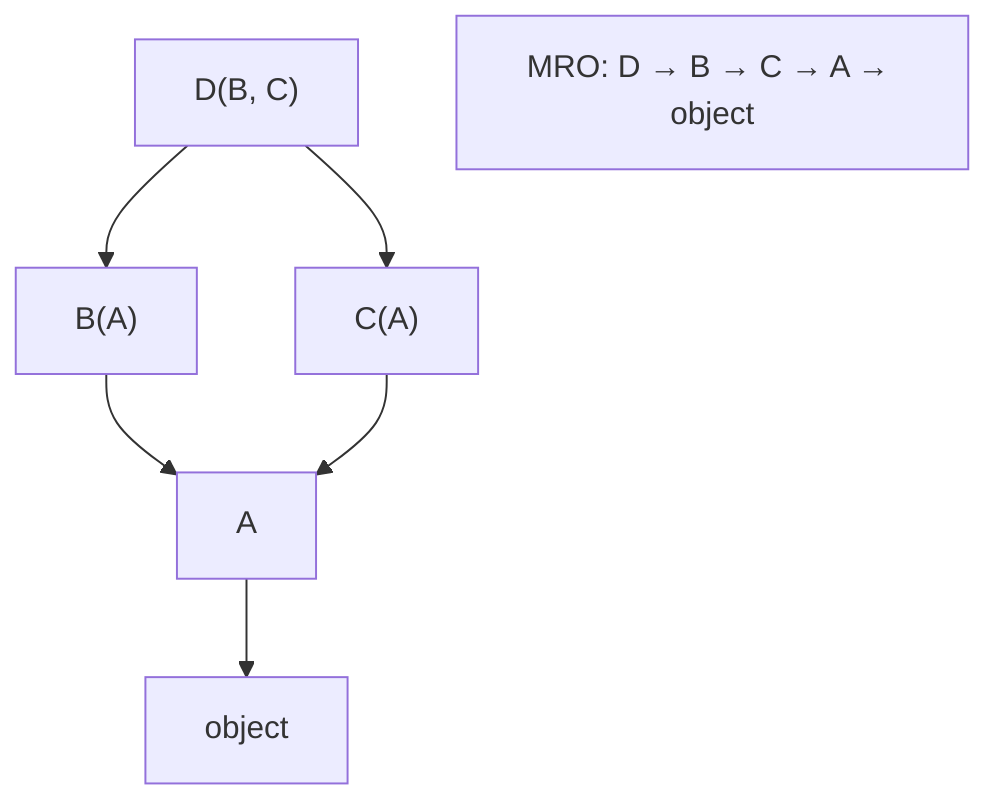

# 5 - Classes, Inheritance, MRO, ABCs

[toc]

> **TL;DR:** Python classes are objects (instances of `type`) and are constructed by `__new__` before `__init__` populates them. Multiple inheritance is resolved via the C3 linearisation algorithm (MRO), which `super()` traverses automatically. Abstract Base Classes enforce interface contracts at subclass definition time; `dataclasses` and `__slots__` are the two principal tools for lean, well-typed data-holding classes.

## Vocabulary

**`type`**: The metaclass of all classes. `type(MyClass)` returns `type`. You can create classes dynamically with `type("ClassName", (bases,), namespace)`.

---

**`__new__(cls, ...)`**: The static method responsible for *allocating* the new object. Called before `__init__`. Returns the new instance. Override when you need to control allocation (immutable subclasses, singletons, factories).

---

**`__init__(self, ...)`**: The initialiser that populates the already-allocated object. Receives the instance returned by `__new__`. Does not return a value.

---

**MRO (Method Resolution Order)**: The linearised list of classes Python searches when looking up a method or attribute. Computed by the C3 linearisation algorithm. Accessible via `ClassName.__mro__` or `ClassName.mro()`.

---

**C3 linearisation**: The algorithm Python uses to compute a consistent MRO for multiple inheritance. Guarantees that a class always appears before its parents, and that the left-to-right order of bases in the class definition is preserved.

---

**`super()`**: Returns a proxy object that delegates method calls to the next class in the current MRO. Without arguments (Python 3+), it uses `__class__` and the first argument of the enclosing method automatically.

---

**`classmethod`**: A method whose first argument is the class (`cls`) rather than the instance. Defined with `@classmethod`. Used for alternative constructors and factory methods.

---

**`staticmethod`**: A method with no implicit first argument. Defined with `@staticmethod`. Equivalent to a plain function in the class namespace — useful for grouping logically related utilities.

---

**Property** (`@property`): A descriptor that makes an attribute access call a method. Enables computed attributes, validation on set, and lazy initialisation while keeping the call syntax `obj.x`.

---

**ABC (Abstract Base Class)**: A class from `abc.ABC` (or with `abc.ABCMeta` as metaclass) that can declare `@abc.abstractmethod` methods. Any concrete subclass that does not implement all abstract methods cannot be instantiated.

---

**Descriptor**: An object implementing `__get__`, `__set__`, or `__delete__`. Properties, classmethods, and staticmethods are all implemented as descriptors. The descriptor protocol is Python's mechanism for customising attribute access.

---

**`__slots__`**: A class-level declaration listing the allowed attribute names. Prevents per-instance `__dict__`, reducing memory by ~50–60% per instance for classes with many instances.

---

**`dataclass`**: A class decorated with `@dataclasses.dataclass`. Auto-generates `__init__`, `__repr__`, `__eq__`, and optionally `__hash__`, `__lt__`, etc. from field annotations.

---

## Intuition

A Python class is a namespace (a dict) with some special dunder methods, wrapped in a `type` object. When you define `class Foo(Bar, Baz):`, Python calls `type.__new__(type, "Foo", (Bar, Baz), namespace)` to create the class object. When you call `Foo(args)`, Python calls `Foo.__call__(args)`, which calls `Foo.__new__(Foo, args)` to allocate, then `Foo.__init__(instance, args)` to populate.

Multiple inheritance's MRO problem — which parent's method wins when two parents both define the same name — is solved by C3 once and for all at class definition time. `super()` does not mean "the parent class"; it means "the next class in the current MRO." Understanding this distinction is what makes cooperative multiple inheritance work correctly.

## Classes and Instances

### `__new__` vs `__init__`

`__new__` allocates memory and returns the instance. `__init__` initialises it. For most classes, you only override `__init__`. Override `__new__` when you need to control instance creation (immutable types, singletons, `__new__` must return the right type).

```python
from typing import ClassVar


class Singleton:
    """Ensure at most one instance exists."""
    _instance: ClassVar["Singleton | None"] = None

    def __new__(cls) -> "Singleton":
        if cls._instance is None:
            cls._instance = super().__new__(cls)
        return cls._instance

    def __init__(self) -> None:
        pass  # __init__ is called every time, even on the cached instance


a = Singleton()
b = Singleton()
print(a is b)  # >>> True
```

> [!WARNING]
> `__init__` is called *every time* you call `ClassName()`, even if `__new__` returns a cached instance. In the Singleton example above, `__init__` runs on every `Singleton()` call, potentially re-initialising the instance. Guard against this by adding `if hasattr(self, '_initialised'): return` at the top of `__init__`, or prefer a module-level instance instead of the Singleton pattern.

### Properties

A property turns a method into an attribute access. It is implemented as a data descriptor.

```python
class Circle:
    def __init__(self, radius: float) -> None:
        self._radius = radius

    @property
    def radius(self) -> float:
        return self._radius

    @radius.setter
    def radius(self, value: float) -> None:
        if value < 0:
            raise ValueError(f"Radius cannot be negative: {value}")
        self._radius = value

    @property
    def area(self) -> float:
        import math
        return math.pi * self._radius ** 2


c = Circle(5.0)
print(c.area)    # >>> 78.53...
c.radius = 10.0  # calls the setter
c.radius = -1.0  # >>> ValueError
```

### `classmethod` and `staticmethod`

`classmethod` is for alternative constructors and operations on the class itself. `staticmethod` is for utilities that happen to live in the class namespace but need no access to the class or instance.

```python
from __future__ import annotations
import json


class Config:
    def __init__(self, host: str, port: int) -> None:
        self.host = host
        self.port = port

    @classmethod
    def from_json(cls, json_str: str) -> Config:
        """Alternative constructor from a JSON string."""
        data = json.loads(json_str)
        return cls(data["host"], data["port"])

    @staticmethod
    def validate_port(port: int) -> bool:
        """Check if a port number is in the valid range."""
        return 1 <= port <= 65535

    def __repr__(self) -> str:
        return f"Config({self.host!r}, {self.port})"


c = Config.from_json('{"host": "localhost", "port": 8080}')
print(c)                         # >>> Config('localhost', 8080)
print(Config.validate_port(80))  # >>> True
```

## Inheritance and MRO

### C3 Linearisation

Python computes the MRO using the C3 algorithm. The rule: a class appears before its parents; among multiple parents, left-to-right order is preserved; the result must be consistent (no class appears after one of its subclasses).

```python
class A:
    def who(self) -> str:
        return "A"

class B(A):
    def who(self) -> str:
        return "B"

class C(A):
    def who(self) -> str:
        return "C"

class D(B, C):
    pass

print(D.__mro__)
# >>> (<class 'D'>, <class 'B'>, <class 'C'>, <class 'A'>, <class 'object'>)
print(D().who())  # >>> "B"  — B comes before C in the MRO
```



### `super()` and Cooperative Multiple Inheritance

`super()` does not call "the parent". It calls the next class in `cls.__mro__`. This is what makes cooperative multiple inheritance work: every class in the hierarchy calls `super()`, so no class is skipped.

```python
class LogMixin:
    def save(self) -> None:
        print("LogMixin.save: logging")
        super().save()  # type: ignore[misc]  # delegates to next in MRO


class ValidateMixin:
    def save(self) -> None:
        print("ValidateMixin.save: validating")
        super().save()  # type: ignore[misc]


class Base:
    def save(self) -> None:
        print("Base.save: persisting")


class Model(LogMixin, ValidateMixin, Base):
    pass


Model().save()
# >>> LogMixin.save: logging
# >>> ValidateMixin.save: validating
# >>> Base.save: persisting
```

> [!IMPORTANT]
> Every class in a cooperative hierarchy must call `super()` — including `Base`. If `Base.save` omitted `super().save()`, `ValidateMixin.save` would be called before `Base.save`, and `Base.save` would skip `object.__init__`, which could silently miss any initialisation defined there. The cooperative contract is: if you participate in MI, you call `super()` everywhere.

## Abstract Base Classes

ABCs document and enforce interfaces. A class inheriting from `abc.ABC` and marking methods with `@abc.abstractmethod` cannot be instantiated unless all abstract methods are overridden.

```python
import abc
from typing import Any


class DataStore(abc.ABC):
    """Abstract interface for a key-value store."""

    @abc.abstractmethod
    def get(self, key: str) -> Any:
        """Retrieve a value by key. Raise KeyError if absent."""
        ...

    @abc.abstractmethod
    def set(self, key: str, value: Any) -> None:
        """Store a value under key."""
        ...

    def get_or_default(self, key: str, default: Any = None) -> Any:
        """Non-abstract: built on top of the abstract interface."""
        try:
            return self.get(key)
        except KeyError:
            return default


class InMemoryStore(DataStore):
    def __init__(self) -> None:
        self._data: dict[str, Any] = {}

    def get(self, key: str) -> Any:
        return self._data[key]

    def set(self, key: str, value: Any) -> None:
        self._data[key] = value


store = InMemoryStore()
store.set("x", 42)
print(store.get_or_default("x"))     # >>> 42
print(store.get_or_default("y", 0))  # >>> 0
# DataStore()  # TypeError: Can't instantiate abstract class
```

## `dataclasses` and `__slots__`

### `@dataclass`

`dataclasses.dataclass` auto-generates boilerplate methods from field annotations. For simple data-holding classes, it replaces manual `__init__`, `__repr__`, and `__eq__`.

```python
from dataclasses import dataclass, field


@dataclass(frozen=True)
class Point:
    x: float
    y: float

    def distance_from_origin(self) -> float:
        return (self.x ** 2 + self.y ** 2) ** 0.5


@dataclass
class Batch:
    items: list[int] = field(default_factory=list)  # correct: new list each time
    size: int = 32

    def add(self, item: int) -> None:
        self.items.append(item)


p = Point(3.0, 4.0)
print(p)                           # >>> Point(x=3.0, y=4.0)
print(p.distance_from_origin())    # >>> 5.0
# p.x = 1.0  # FrozenInstanceError — frozen=True makes it immutable
```

> [!NOTE]
> For mutable default field values (`list`, `dict`), always use `field(default_factory=list)` — never `field(default=[])`. The `default_factory` is called fresh for each instance. `default=[]` is the mutable default argument trap in disguise: dataclasses will raise a `ValueError` if you try it, precisely to prevent this bug.

### `__slots__`

For classes with many instances (graph nodes, event objects, vector embeddings), `__slots__` eliminates the per-instance `__dict__`, reducing memory substantially.

```python
import sys


class WithDict:
    def __init__(self, x: int, y: int) -> None:
        self.x = x
        self.y = y


class WithSlots:
    __slots__ = ("x", "y")

    def __init__(self, x: int, y: int) -> None:
        self.x = x
        self.y = y


d = WithDict(1, 2)
s = WithSlots(1, 2)
print(sys.getsizeof(d) + sys.getsizeof(d.__dict__))  # >>> ~232 bytes
print(sys.getsizeof(s))                               # >>> ~56 bytes

# __slots__ disables dynamic attribute addition
# s.z = 3  # AttributeError: 'WithSlots' object has no attribute 'z'
```

## Real-world Example

A complete class hierarchy for a machine-learning experiment: an abstract `Trainer`, a concrete `SupervisedTrainer`, and a `LoggingMixin` — demonstrating MRO, ABCs, `super()`, properties, and `dataclass`.

```python
import abc
import time
from dataclasses import dataclass, field
from typing import Any


@dataclass
class TrainingConfig:
    epochs: int = 10
    learning_rate: float = 1e-3
    batch_size: int = 32
    log_every: int = 1


class LoggingMixin:
    """Mixin that logs training steps via super() cooperative dispatch."""

    def train_epoch(self, epoch: int) -> dict[str, float]:
        start = time.perf_counter()
        metrics: dict[str, float] = super().train_epoch(epoch)  # type: ignore[misc]
        elapsed = time.perf_counter() - start
        print(f"[LoggingMixin] epoch={epoch} metrics={metrics} t={elapsed:.3f}s")
        return metrics


class BaseTrainer(abc.ABC):
    def __init__(self, config: TrainingConfig) -> None:
        self.config = config
        self._epoch = 0

    @property
    def current_epoch(self) -> int:
        return self._epoch

    @abc.abstractmethod
    def train_epoch(self, epoch: int) -> dict[str, float]:
        """Run one training epoch. Return metrics dict."""
        ...

    def train(self) -> list[dict[str, float]]:
        history: list[dict[str, float]] = []
        for epoch in range(1, self.config.epochs + 1):
            self._epoch = epoch
            metrics = self.train_epoch(epoch)
            history.append(metrics)
        return history


class SupervisedTrainer(BaseTrainer):
    def train_epoch(self, epoch: int) -> dict[str, float]:
        # Simulate training — real impl would iterate DataLoader
        import random
        loss = 1.0 / epoch + random.uniform(0, 0.1)
        return {"loss": round(loss, 4)}


class LoggedSupervisedTrainer(LoggingMixin, SupervisedTrainer):
    pass


print(LoggedSupervisedTrainer.__mro__)
# (<class 'LoggedSupervisedTrainer'>, <class 'LoggingMixin'>,
#  <class 'SupervisedTrainer'>, <class 'BaseTrainer'>, <class 'abc.ABC'>,
#  <class 'object'>)

cfg = TrainingConfig(epochs=3)
trainer = LoggedSupervisedTrainer(cfg)
trainer.train()
# [LoggingMixin] epoch=1 metrics={'loss': 1.05} t=0.000s
# [LoggingMixin] epoch=2 metrics={'loss': 0.54} t=0.000s
# [LoggingMixin] epoch=3 metrics={'loss': 0.39} t=0.000s
```

> [!TIP]
> The `LoggingMixin` pattern — a mixin that calls `super().method()` — is the canonical way to add cross-cutting behaviour (logging, timing, validation) to a class hierarchy without modifying every class. It requires that every class in the hierarchy cooperatively calls `super()`, but gives you clean separation of concerns.

## In Practice

**`super()` with arguments.** In Python 2 you had to write `super(MyClass, self).method()`. In Python 3, `super()` with no arguments is almost always correct — it uses `__class__` and the first method argument automatically. Use `super(Class, proxy)` only when you need to start MRO lookup from a specific point.

**`__slots__` and inheritance.** A subclass of a `__slots__` class that does *not* define its own `__slots__` gets a `__dict__` anyway. For `__slots__` to eliminate `__dict__` throughout the hierarchy, every class in the hierarchy must declare `__slots__`.

**Dataclasses and `__post_init__`.** Use `__post_init__` for validation or derived field computation after the generated `__init__` runs. For `frozen=True` dataclasses, use `object.__setattr__(self, field, value)` inside `__post_init__` since normal assignment raises `FrozenInstanceError`.

> [!CAUTION]
> Metaclass conflicts: if you try to inherit from two classes with incompatible metaclasses (e.g. a class using `ABCMeta` and a class using a custom metaclass), Python raises `TypeError: metaclass conflict`. The fix is to create a combined metaclass that inherits from both — or, better, use `abc.ABC` consistently and avoid custom metaclasses unless you genuinely need them.

## Pitfalls

- **"`super()` calls the parent class."** — No. It calls the next class in the *MRO*. In a diamond hierarchy `D(B, C)`, `B.super()` calls `C`, not `A`. This is exactly what cooperative MI requires, but it means `super()` is more powerful (and more subtle) than "parent".
- **"ABCs are only useful as interfaces."** — ABCs can also contain concrete methods (mix of abstract and concrete). `collections.abc.MutableSequence` provides `append`, `clear`, `reverse`, etc. for free if you implement `__getitem__`, `__setitem__`, `__delitem__`, `__len__`, and `insert`. ABCs enable the template method pattern.
- **"`__slots__` prevents inheritance."** — It does not. It prevents *dynamic attribute addition* and eliminates `__dict__`. Inheritance works; just remember that each class in the hierarchy needs its own `__slots__` declaration.
- **"`dataclass(frozen=True)` makes the object deeply immutable."** — Only shallowly. `frozen=True` prevents reassigning the instance's fields. If a field holds a mutable object (a list, a dict), that object remains mutable.
- **"`__init__` is called before `__new__`."** — Reversed. `__new__` allocates the instance first; `__init__` receives the already-allocated instance. `__init__` is never called at all if `__new__` returns something that is not an instance of `cls`.

## Exercises

### Exercise 1 — Trace the MRO

What is the MRO of `D` in the following hierarchy, and what does `D().method()` print?

```python
class A:
    def method(self) -> str:
        return "A"

class B(A):
    pass

class C(A):
    def method(self) -> str:
        return "C"

class D(B, C):
    pass
```

#### Solution

MRO: `D → B → C → A → object`. The C3 rule: D's bases are B, C. B's MRO is `B → A → object`. C's MRO is `C → A → object`. Merge: take the head of the first list that does not appear in the tail of any other list. Result: `D, B, C, A, object`.

`D().method()` prints `"C"`. Python searches the MRO in order: `D` has no `method`; `B` has no `method`; `C` has `method` → returns `"C"`. `A.method` is shadowed by `C.method` even though `B` appears between `D` and `C` in the MRO.

---

### Exercise 2 — ABC enforcement

Why does the following raise `TypeError` at instantiation, not at class definition?

```python
import abc

class Shape(abc.ABC):
    @abc.abstractmethod
    def area(self) -> float: ...

class Square(Shape):
    def __init__(self, side: float) -> None:
        self.side = side
    # Does NOT implement area

s = Square(5.0)  # TypeError here
```

#### Solution

Python checks for unimplemented abstract methods when `__call__` is invoked on the class (i.e., when you try to instantiate it), not when the class `def` runs. The `ABCMeta` metaclass tracks abstract methods in `Square.__abstractmethods__`. When `Square(5.0)` is called, `type.__call__` checks this set and raises `TypeError: Can't instantiate abstract class Square with abstract method area`. The class definition succeeds because defining a subclass without implementing abstract methods is permitted — it just means the subclass is also abstract and cannot be instantiated directly.

---

### Exercise 3 — `__slots__` interaction

What happens when you subclass a `__slots__` class without defining `__slots__` in the subclass?

```python
class Base:
    __slots__ = ("x",)
    def __init__(self, x: int) -> None:
        self.x = x

class Child(Base):
    def __init__(self, x: int, y: int) -> None:
        super().__init__(x)
        self.y = y
```

#### Solution

`Child` gets a `__dict__` because it did not declare `__slots__`. The memory benefit of `__slots__` in `Base` is partially negated because every `Child` instance carries a `__dict__`. The `x` slot from `Base` is still a slot descriptor (efficient); `y` is stored in `__dict__` (less efficient). To fully benefit from `__slots__` in the subclass, declare `__slots__ = ("y",)` in `Child`. This works: the subclass slot adds `y` as a slot, inherits the `x` slot from `Base`, and has no `__dict__`.

---

### Exercise 4 — Implement a `Registry` using `__init_subclass__`

Write a `Plugin` base class that automatically registers all subclasses in a class-level registry, using `__init_subclass__`.

#### Solution

```python
from typing import ClassVar


class Plugin:
    """Base class that auto-registers subclasses."""
    _registry: ClassVar[dict[str, type["Plugin"]]] = {}

    def __init_subclass__(cls, name: str | None = None, **kwargs: object) -> None:
        super().__init_subclass__(**kwargs)
        key = name or cls.__name__
        Plugin._registry[key] = cls

    @classmethod
    def get(cls, name: str) -> type["Plugin"] | None:
        return cls._registry.get(name)


class JSONPlugin(Plugin, name="json"):
    def process(self) -> str:
        return "JSON processing"


class CSVPlugin(Plugin, name="csv"):
    def process(self) -> str:
        return "CSV processing"


print(Plugin._registry)
# >>> {'json': <class 'JSONPlugin'>, 'csv': <class 'CSVPlugin'>}
plugin_cls = Plugin.get("json")
if plugin_cls is not None:
    print(plugin_cls().process())  # >>> JSON processing
```

`__init_subclass__` is called on the base class whenever a new subclass is created. It receives the subclass as `cls` and any keyword arguments passed in the class definition line. This is the cleanest Python mechanism for plugin registration without metaclasses.

## Sources

- Python Data Model — Classes — https://docs.python.org/3/reference/datamodel.html#creating-the-class-body
- Python `abc` module — https://docs.python.org/3/library/abc.html
- Python `dataclasses` module — https://docs.python.org/3/library/dataclasses.html
- PEP 3115 — Metaclasses in Python 3 — https://peps.python.org/pep-3115/
- PEP 557 — Data Classes — https://peps.python.org/pep-0557/
- Michele Simionato, "The Python 2.3 Method Resolution Order" — https://www.python.org/download/releases/2.3/mro/
- Ramalho, L. *Fluent Python* (2nd ed., 2022). Chapters 13–15.

## Related

- [2 - The Data Model — Objects, References, Identity](./2-the-data-model-objects-references-identity.md)
- [4 - Functions, Closures, Decorators](./4-functions-closures-decorators.md)
- [6 - Type Hints and Static Typing](./6-type-hints-and-static-typing.md)
- [7 - Exceptions and Context Managers](./7-exceptions-and-context-managers.md)
