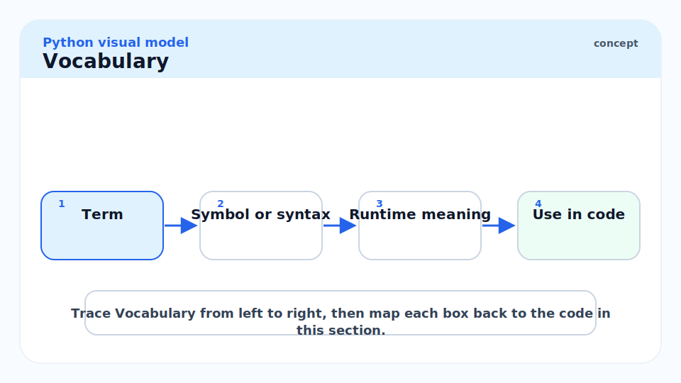
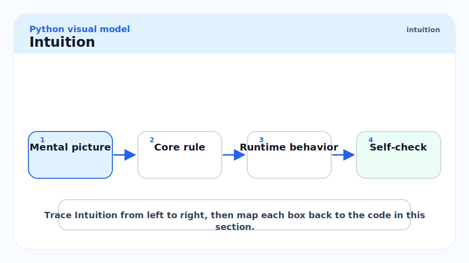
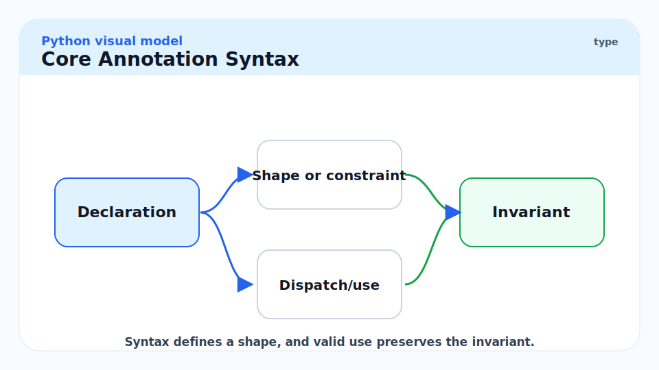
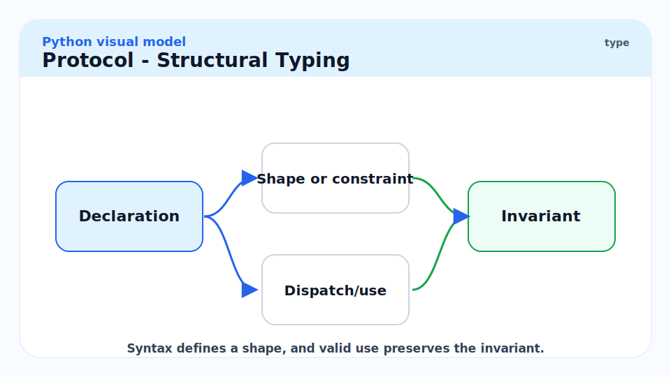
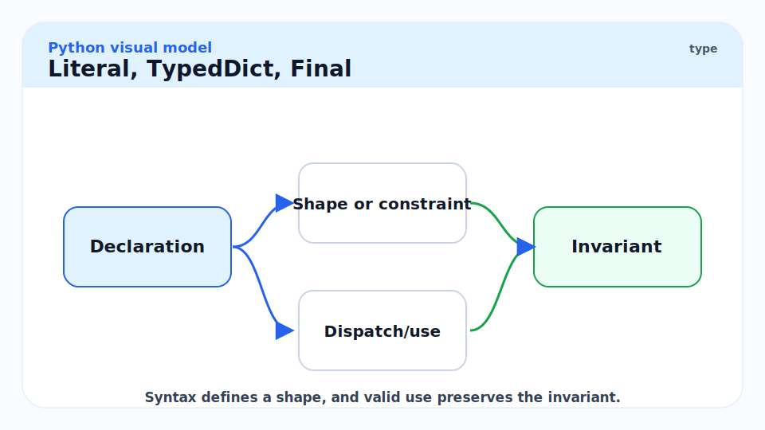
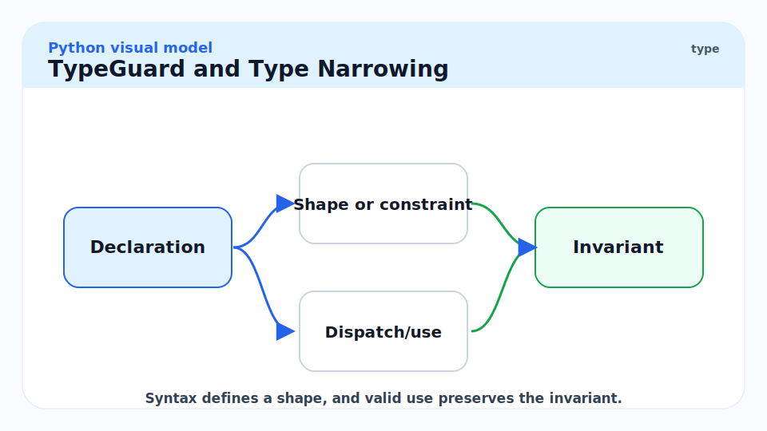
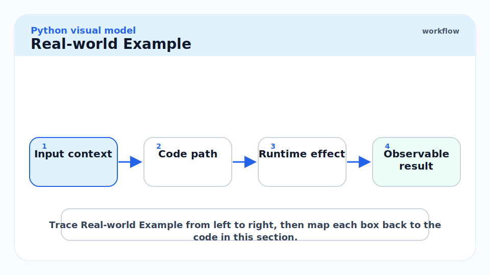
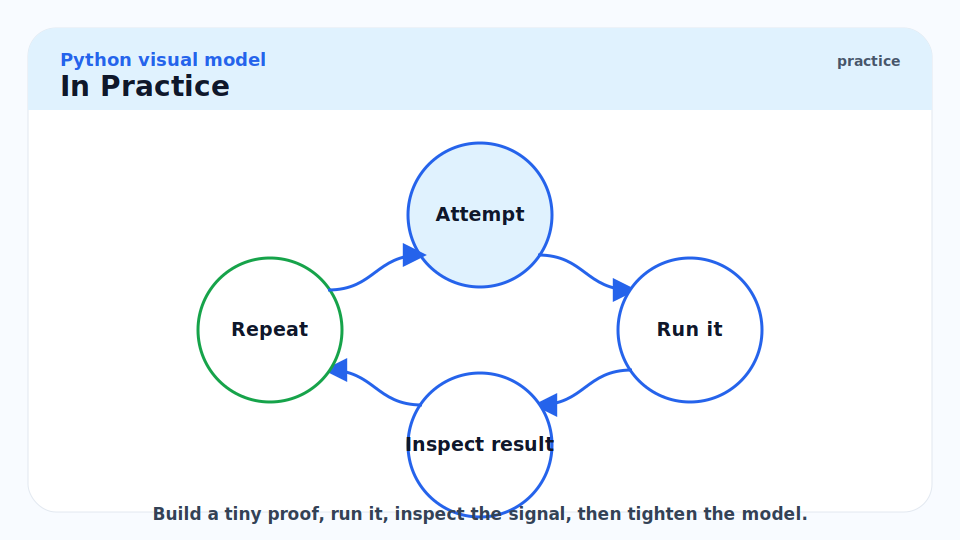
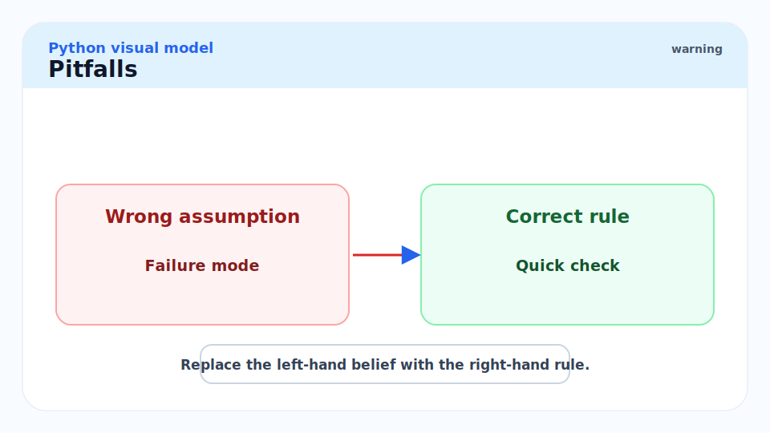
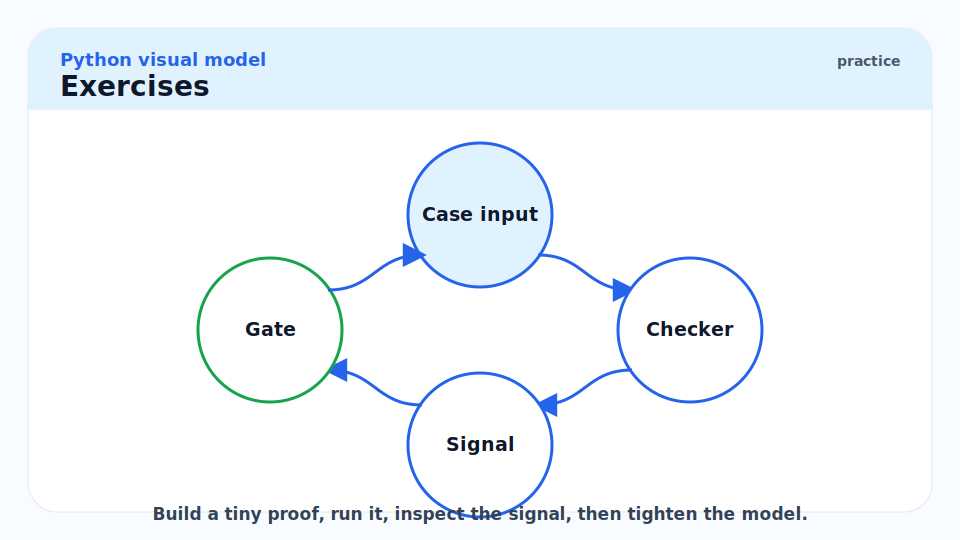

# 6 - Type Hints and Static Typing

[toc]

> **TL;DR:** Python's type hint system (PEP 484+) adds optional static annotations evaluated by external checkers (pyright, mypy) without changing runtime behaviour. The system has evolved from basic `Optional[int]` to structural typing via `Protocol`, higher-kinded generics via `TypeVar`, precise literal types via `Literal`, and full variance annotations — enabling gradual typing that catches entire classes of bugs before tests run.

## Vocabulary



**Type annotation**: A syntax hint attached to a variable, parameter, or return value. Stored in `__annotations__` at runtime. Not enforced by CPython; evaluated by static checkers.

```python
x: int = 5          # variable annotation
def f(n: int) -> str: ...  # parameter + return annotations
```

---

**`Optional[T]`**: Shorthand for `Union[T, None]`. Use when a value can legitimately be absent. In Python 3.10+, write `T | None` instead.

---

**`Union[A, B]`**: A value that can be either type A or type B. Python 3.10+ syntax: `A | B`.

---

**`TypeVar`**: A placeholder type that represents a type to be determined at use site. Enables generic functions and classes.

```python
from typing import TypeVar
T = TypeVar("T")
```

---

**`Generic[T]`**: Base class for user-defined generic classes. Parameterised by `TypeVar`.

---

**`Protocol`**: A structural type. A class satisfies a `Protocol` if it has the required methods/attributes, regardless of inheritance. Python's answer to Go interfaces and Haskell typeclasses. Defined in PEP 544.

---

**`Literal[v]`**: A type that accepts only a specific constant value or a fixed set of values. `Literal["GET", "POST"]` accepts only those two strings.

---

**`TypedDict`**: A dict subtype where specific string keys have specific value types. Useful for JSON-shaped data.

---

**`ParamSpec`**: Captures the parameter types of a callable, enabling decorators that preserve the full signature of the decorated function. PEP 612.

---

**`TypeGuard[T]`**: Return type for narrowing predicates — functions that return `True` only if the argument is of type `T`. Tells the checker to narrow the type in the `if` branch.

---

**Gradual typing**: The principle that you can add type hints incrementally to an untyped codebase. Untyped variables are implicitly `Any` — compatible with everything. The checker only enforces where annotations are present.

---

**`Any`**: A special type that disables type checking. Every value is compatible with `Any` in both directions. Implicit when a parameter or return is unannotated (in lenient mode).

---

**`Final`**: Marks a name as not re-assignable after its initial binding. Does not imply immutability of the object.

---

**Covariant / Contravariant**: Variance annotations for `TypeVar`. Covariant (`covariant=True`): `Container[Child]` is compatible with `Container[Parent]`. Contravariant (`contravariant=True`): the reverse.

---

## Intuition



Think of Python's type system as a post-hoc overlay: the language runs without it, but a static checker reads the annotations and reports inconsistencies before the code executes. This is different from Java where types are enforced by the JVM. The practical consequence is that you can start with an entirely untyped codebase, add `# type: ignore` to suppress errors, and incrementally annotate the parts you care about. The checker only tells you about bugs in annotated code.

`Protocol` is the most powerful addition. Rather than requiring `isinstance(x, MyABC)` (nominal typing), `Protocol` checks duck-typed interfaces: "does this object have a `.read(n)` method that takes an `int` and returns `bytes`?" This is structural typing — the same paradigm as Go interfaces — and it is the right model for Python's dynamic ecosystem.

## Core Annotation Syntax



### Variables, Parameters, Returns

In Python 3.9+ you can use built-in generics directly (`list[int]`, `dict[str, float]`). In 3.8 and below, import from `typing` (`List[int]`, `Dict[str, float]`). This series uses 3.10+ syntax throughout.

```python
from __future__ import annotations  # defers annotation evaluation — needed for forward refs in <3.10


def greet(name: str, times: int = 1) -> str:
    return (f"Hello, {name}\n") * times


# Union with | (Python 3.10+)
def parse(value: str | int | None) -> str:
    if value is None:
        return ""
    return str(value)


# Variable annotations
count: int = 0
mapping: dict[str, list[int]] = {}
```

### `TypeVar` and Generic Functions

`TypeVar` lets you write functions that are polymorphic in a type-safe way. The checker infers the concrete type at each call site.

```python
from typing import TypeVar
from collections.abc import Sequence

T = TypeVar("T")


def first(seq: Sequence[T]) -> T | None:
    """Return the first element, or None if empty."""
    return seq[0] if seq else None


x: int | None = first([1, 2, 3])     # T inferred as int
s: str | None = first(["a", "b"])    # T inferred as str
```

### Generic Classes

```python
from typing import TypeVar, Generic

T = TypeVar("T")


class Stack(Generic[T]):
    def __init__(self) -> None:
        self._items: list[T] = []

    def push(self, item: T) -> None:
        self._items.append(item)

    def pop(self) -> T:
        if not self._items:
            raise IndexError("pop from empty stack")
        return self._items.pop()

    def __len__(self) -> int:
        return len(self._items)


int_stack: Stack[int] = Stack()
int_stack.push(1)
int_stack.push(2)
# int_stack.push("string")  # pyright error: Argument of type "str" cannot be assigned to "int"
```

## `Protocol` — Structural Typing



`Protocol` classes define an interface by listing required methods and attributes. Any object with matching structure satisfies the protocol, regardless of inheritance.

```python
from typing import Protocol, runtime_checkable


@runtime_checkable
class Drawable(Protocol):
    def draw(self) -> None: ...
    def bounding_box(self) -> tuple[float, float, float, float]: ...


class Circle:
    def __init__(self, cx: float, cy: float, r: float) -> None:
        self.cx, self.cy, self.r = cx, cy, r

    def draw(self) -> None:
        print(f"Drawing circle at ({self.cx}, {self.cy}), r={self.r}")

    def bounding_box(self) -> tuple[float, float, float, float]:
        return (self.cx - self.r, self.cy - self.r,
                self.cx + self.r, self.cy + self.r)


def render(shape: Drawable) -> None:
    shape.draw()
    print(f"Bounds: {shape.bounding_box()}")


render(Circle(0, 0, 5.0))  # works — Circle satisfies Drawable structurally
print(isinstance(Circle(0, 0, 1), Drawable))  # >>> True  (runtime_checkable)
```

> [!TIP]
> Prefer `Protocol` over ABCs when designing library APIs that accept user objects. ABCs require explicit inheritance (`class MyShape(ShapeABC):`); Protocols do not. This makes your library friendlier to third-party types that cannot be modified to inherit from your ABC. NumPy arrays, pandas DataFrames, and PIL Images all satisfy file-like protocols without knowing about them.

## `Literal`, `TypedDict`, `Final`



### `Literal`

```python
from typing import Literal


HttpMethod = Literal["GET", "POST", "PUT", "DELETE", "PATCH"]


def request(method: HttpMethod, url: str) -> None:
    ...

request("GET", "https://api.example.com")   # OK
# request("FETCH", "...")  # pyright error: "FETCH" not assignable to HttpMethod
```

### `TypedDict`

`TypedDict` describes a dict with a fixed schema. Pyright catches missing keys and wrong value types.

```python
from typing import TypedDict


class UserRecord(TypedDict):
    id: int
    name: str
    email: str
    active: bool


def process_user(user: UserRecord) -> str:
    return f"{user['name']} <{user['email']}>"


user: UserRecord = {"id": 1, "name": "Alice", "email": "alice@example.com", "active": True}
print(process_user(user))
```

### `Final`

```python
from typing import Final

MAX_RETRIES: Final = 3
# MAX_RETRIES = 5  # pyright error: Cannot assign to final name
```

## `TypeGuard` and Type Narrowing



Type narrowing is when the checker automatically refines the type inside a conditional branch. You can define custom narrowing predicates with `TypeGuard`.

```python
from typing import TypeGuard


def is_str_list(val: list[object]) -> TypeGuard[list[str]]:
    return all(isinstance(x, str) for x in val)


def process(items: list[object]) -> None:
    if is_str_list(items):
        # Inside this block, items is list[str]
        for item in items:
            print(item.upper())   # no type error — item is str
```

## Real-world Example



A fully-typed Pydantic-free data validation layer using `TypedDict`, `Protocol`, `TypeVar`, and `Literal` — a realistic pattern for a FastAPI request handler.

```python
from __future__ import annotations

from typing import Literal, TypedDict, TypeVar, Protocol, overload


class PaginationParams(TypedDict):
    page: int
    page_size: int


class SortableItem(Protocol):
    @property
    def sort_key(self) -> str: ...


T = TypeVar("T", bound=SortableItem)

SortOrder = Literal["asc", "desc"]


def paginate(
    items: list[T],
    params: PaginationParams,
    order: SortOrder = "asc",
) -> list[T]:
    """
    Sort and paginate a list of sortable items.
    Returns the requested page.
    """
    sorted_items = sorted(items, key=lambda x: x.sort_key, reverse=(order == "desc"))
    start = (params["page"] - 1) * params["page_size"]
    end = start + params["page_size"]
    return sorted_items[start:end]


# Concrete type satisfying SortableItem without inheritance
class Product:
    def __init__(self, name: str, price: float) -> None:
        self.name = name
        self.price = price

    @property
    def sort_key(self) -> str:
        return self.name


products = [Product("banana", 1.0), Product("apple", 0.8), Product("cherry", 2.5)]
page = paginate(products, {"page": 1, "page_size": 2}, order="asc")
print([p.name for p in page])  # >>> ['apple', 'banana']
```

> [!NOTE]
> The `from __future__ import annotations` at the top defers evaluation of all annotations to strings (PEP 563). This is required in Python < 3.10 for forward references (`SortableItem` used before definition) and for self-referential types. In Python 3.12+, the behaviour becomes default (PEP 649 lazy evaluation). For maximum compatibility, include it in any file with complex annotations.

## In Practice



**Pyright vs mypy.** Pyright (Microsoft, used by Pylance in VS Code) and mypy (PSF) are the two dominant checkers. They disagree on edge cases. Pyright is stricter by default and significantly faster (Go-like performance vs Python-process overhead). For new projects, pyright in `strict` mode is the recommended starting point.

**Gradual typing strategy.** For a large existing codebase: (1) add `# type: ignore` globally to silence all existing errors, (2) set up pyright/mypy in CI, (3) annotate new code fully, (4) remove `# type: ignore` comments as you revisit old modules. Never annotate everything at once — the cognitive overhead collapses the team.

**`TYPE_CHECKING` guard.** For imports only needed by the checker (not at runtime), wrap them:

```python
from __future__ import annotations
from typing import TYPE_CHECKING

if TYPE_CHECKING:
    from mymodule import HeavyType  # not imported at runtime
```

This avoids circular import errors and reduces startup time for large codebases.

> [!CAUTION]
> `typing.cast(T, x)` tells the checker "trust me, this is type T" without any runtime check. It is a type-system lie — the value is returned unchanged, no validation occurs. Use it only as a last resort when you know the type is correct but the checker cannot prove it. Overuse turns the type system into dead documentation.

## Pitfalls



- **"Type hints are enforced at runtime."** — They are not. CPython ignores annotations entirely. `x: int = "hello"` runs without error. Only pyright/mypy catch this statically.
- **"You need `Optional[T]` everywhere a value might be `None`."** — In Python 3.10+, use `T | None`. `Optional` remains valid but is verbose.
- **"Protocols require `@runtime_checkable` to work with the checker."** — No. The static checker works with all `Protocol`s. `@runtime_checkable` is only needed for `isinstance()` checks at runtime. Most Protocols should not be `@runtime_checkable` — it adds overhead and the runtime check is weaker than the static check.
- **"`TypeVar` with `bound=` is the same as `TypeVar` with `constraints=`."** — `bound=T` means "any subtype of T". `constraints=(A, B)` means "exactly A or B, nothing else". They are different: a TypeVar with bound `Sequence` accepts `list`, `tuple`, `str`; a constrained TypeVar `(int, str)` accepts only exactly `int` or `str`.
- **"Adding `from __future__ import annotations` is always safe."** — Almost. It makes all annotations strings at runtime (lazy evaluation). This breaks code that calls `get_type_hints()` or inspects `__annotations__` at runtime without `include_extras=True`, and it breaks some Pydantic v1 patterns. Test after adding.

## Exercises



### Exercise 1 — Generic `zip_with`

Write a fully-typed `zip_with(f, xs, ys)` that applies a binary function to paired elements.

#### Solution

```python
from collections.abc import Callable, Iterator, Sequence
from typing import TypeVar

A = TypeVar("A")
B = TypeVar("B")
C = TypeVar("C")


def zip_with(
    f: Callable[[A, B], C],
    xs: Sequence[A],
    ys: Sequence[B],
) -> Iterator[C]:
    """Apply f to each pair (x, y) from xs and ys. Stops at the shorter sequence."""
    return (f(x, y) for x, y in zip(xs, ys))


result = list(zip_with(lambda a, b: a + b, [1, 2, 3], [10, 20, 30]))
print(result)  # >>> [11, 22, 33]
```

The three `TypeVar`s A, B, C capture input and output types independently. Pyright infers `C = int` at the call site above.

---

### Exercise 2 — Protocol vs ABC

When should you use `Protocol` and when should you use `abc.ABC`?

#### Solution

Use **`Protocol`** when:
- You are designing a library API that should accept third-party objects you cannot modify.
- The interface is structural: "has a `read(n)` method that returns `bytes`".
- You want compile-time checking without runtime overhead.
- Duck typing is the right model (Python's natural style).

Use **`abc.ABC`** when:
- You want to provide partial implementations in the base class (template method pattern).
- You need `isinstance` checks to confirm the contract at runtime.
- You are building a framework where users explicitly opt in by inheriting.
- You want abstract methods to raise `TypeError` at instantiation, not just at the checker.

The hybrid: a class can inherit from an ABC and also satisfy a Protocol. You can define a Protocol that matches an ABC's interface for use in checker-only annotations while keeping the ABC for runtime `isinstance` checks.

---

### Exercise 3 — `overload`

Write a `parse_value` function that accepts `str` and returns `str`, or accepts `int` and returns `int`, using `@overload`.

#### Solution

```python
from typing import overload


@overload
def parse_value(x: str) -> str: ...
@overload
def parse_value(x: int) -> int: ...

def parse_value(x: str | int) -> str | int:
    if isinstance(x, str):
        return x.strip()
    return x * 2


s: str = parse_value("  hello  ")  # checker knows return is str
n: int = parse_value(5)            # checker knows return is int
```

`@overload` decorates stub signatures that the checker uses; the final undecorated definition is the actual implementation. The checker matches each call to the most specific overload. Without `@overload`, `parse_value("x")` would have return type `str | int`.

## Sources

- PEP 484 — Type Hints — https://peps.python.org/pep-0484/
- PEP 526 — Variable Annotations — https://peps.python.org/pep-0526/
- PEP 544 — Protocols: Structural Subtyping — https://peps.python.org/pep-0544/
- PEP 589 — TypedDict — https://peps.python.org/pep-0589/
- PEP 593 — Annotated — https://peps.python.org/pep-0593/
- PEP 612 — Parameter Specification Variables — https://peps.python.org/pep-0612/
- PEP 695 — Type Parameter Syntax (Python 3.12) — https://peps.python.org/pep-0695/
- Python `typing` module — https://docs.python.org/3/library/typing.html
- Pyright documentation — https://github.com/microsoft/pyright
- Ramalho, L. *Fluent Python* (2nd ed., 2022). Chapters 8 and 15.

## Related

- [4 - Functions, Closures, Decorators](./4-functions-closures-decorators.md)
- [5 - Classes, Inheritance, MRO, ABCs](./5-classes-inheritance-mro-abcs.md)
- [12 - Building Production Services in Python](./12-building-production-services-in-python.md)
