# 7 - Exceptions and Context Managers

[toc]

> **TL;DR:** Python's exception system is a class hierarchy rooted at `BaseException`; handling, re-raising, and chaining exceptions are all first-class language operations. Context managers formalise the acquire-use-release pattern via `__enter__` / `__exit__`, making resource safety composable and concise. Python 3.11 added Exception Groups and `except*` for structured handling of concurrent errors from `asyncio.TaskGroup`.

## Vocabulary

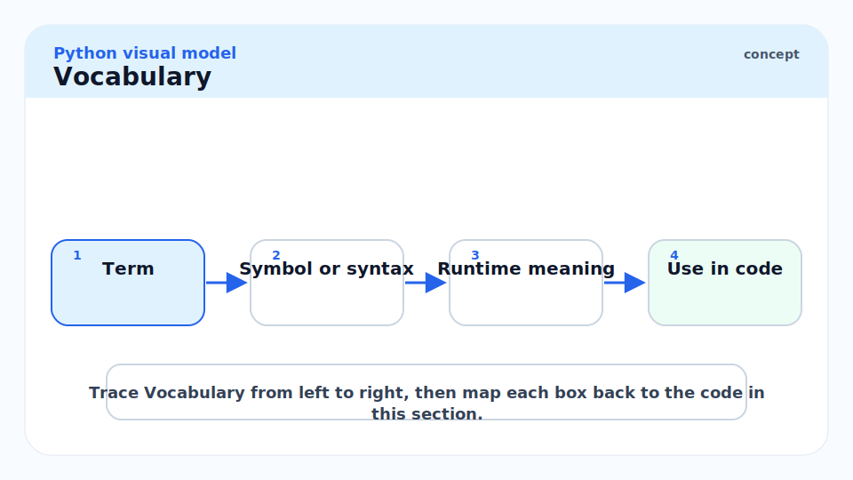

**`BaseException`**: Root of the exception hierarchy. Direct subclasses: `SystemExit`, `KeyboardInterrupt`, `GeneratorExit`, `Exception`. Never catch `BaseException` unless you intend to catch process-termination signals too.

---

**`Exception`**: Base class for all "normal" exceptions. Catch-all `except Exception` catches everything a well-behaved program should handle, excluding `SystemExit` and `KeyboardInterrupt`.

---

**`try / except / else / finally`**: The full exception-handling block. `else` runs if no exception was raised; `finally` runs always, regardless.

---

**`raise from`**: `raise NewExc from original` — chains exceptions. Sets `__cause__` (explicit chain) on the new exception. `raise NewExc from None` suppresses the chain.

---

**`__context__`**: Automatically set when an exception is raised while another is being handled (implicit chain). `__cause__` is set by `raise from` (explicit).

---

**`ExceptionGroup`** (Python 3.11+): An exception that wraps multiple sub-exceptions. Raised by `asyncio.TaskGroup` when multiple tasks fail. Handled by `except*`.

---

**`except*`** (Python 3.11+): `except* TypeError as eg` — catches all `TypeError` instances from an `ExceptionGroup`, leaving other exception types to propagate.

---

**Context manager**: An object implementing `__enter__` and `__exit__`. Used with the `with` statement. `__enter__` sets up the resource; `__exit__` tears it down (and can suppress exceptions).

---

**`__exit__(exc_type, exc_val, exc_tb)`**: Called when the `with` block exits, with exception info if one occurred. Return `True` to suppress the exception; return `None`/`False` to propagate.

---

**`contextlib.contextmanager`**: A decorator that turns a generator function with a single `yield` into a context manager. The code before `yield` is `__enter__`; the code after is `__exit__`.

---

**`contextlib.suppress(*excs)`**: A context manager that silently swallows the specified exceptions.

---

**`contextlib.ExitStack`**: Dynamically composes multiple context managers. Essential when the number of resources to manage is not known at compile time.

---

## Intuition

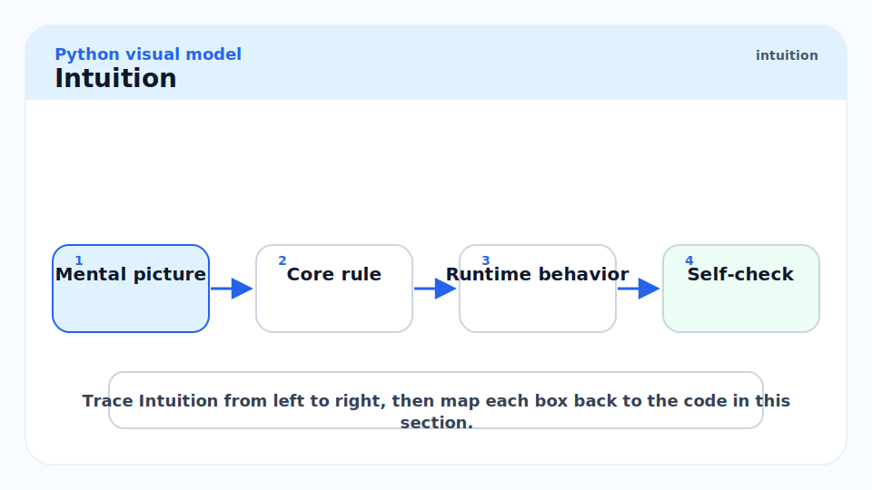

Exceptions in Python are not just error signals — they are objects that carry a full call stack, can be chained to show cause-and-effect, and can be caught, transformed, and re-raised in a structured way. The exception hierarchy is a class tree, and catching an exception type also catches all its subclasses — just like `isinstance`.

Context managers express the "bracket" pattern: "do setup, run user code, do teardown regardless of what happened." This is the same guarantee as RAII in C++ or `defer` in Go, but expressed through the `with` keyword. The generator-based form (`@contextlib.contextmanager`) makes writing context managers as easy as writing a function with a `try/finally` block.

## Exception Hierarchy

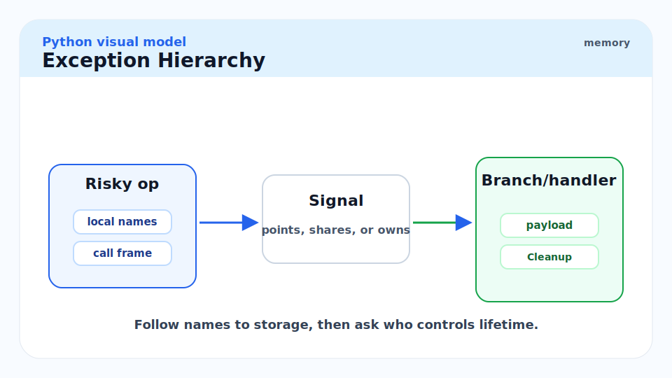

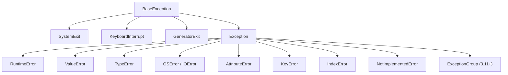

The key practical rules: catch `Exception` (not `BaseException`) unless you have a reason to intercept `SystemExit` / `KeyboardInterrupt`. Never catch `BaseException` in a library — only in top-level application entry points. Never use bare `except:` — always name the exception type.

## `try / except / else / finally`

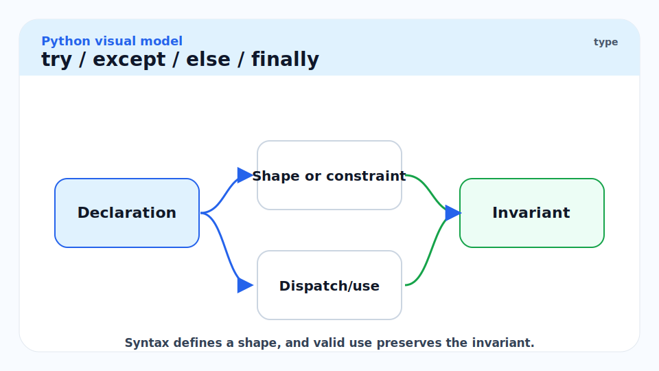

Each clause has a distinct semantics. `else` is the least-known and the most useful for separating "success path" from "exception path".

```python
import json
from pathlib import Path


def load_config(path: Path) -> dict[str, object]:
    """
    Load JSON config from path.
    else: runs only if no exception occurred in try.
    finally: always runs (logging, cleanup).
    """
    try:
        text = path.read_text(encoding="utf-8")
    except FileNotFoundError:
        raise  # re-raise — caller decides what to do
    except PermissionError as exc:
        raise RuntimeError(f"Cannot read config at {path}") from exc
    else:
        # This block runs only if read_text succeeded
        return json.loads(text)
    finally:
        pass  # e.g. close a resource, log a metric — always runs


# The else clause is for "success path" logic:
# it keeps the try block minimal (only the risky operation)
# and avoids accidentally catching exceptions from the success code.
```

> [!IMPORTANT]
> The `else` clause of `try` runs **only if no exception was raised in the `try` block**. Its purpose is to put code that should only run on success into a block that does not accidentally catch exceptions from that code. Without `else`, success-path code placed inside `try` would be covered by the `except` handlers, potentially masking bugs.

## Exception Chaining


`raise NewExc from original` sets `NewExc.__cause__ = original`, creating an explicit chain. This preserves the full diagnostic context while re-raising as a more appropriate exception type.

```python
class ConfigError(Exception):
    """Domain-specific configuration error."""


def parse_int_config(value: str, key: str) -> int:
    try:
        return int(value)
    except ValueError as exc:
        # Transform the low-level ValueError into a domain error,
        # but preserve the original exception as the cause.
        raise ConfigError(
            f"Config key '{key}' has invalid integer value: {value!r}"
        ) from exc


try:
    parse_int_config("abc", "port")
except ConfigError as exc:
    print(exc)
    print(f"Caused by: {exc.__cause__}")
    # ConfigError: Config key 'port' has invalid integer value: 'abc'
    # Caused by: invalid literal for int() with base 10: 'abc'
```

To suppress the chain entirely (hide an irrelevant internal exception): `raise NewExc from None`.

## Custom Exceptions

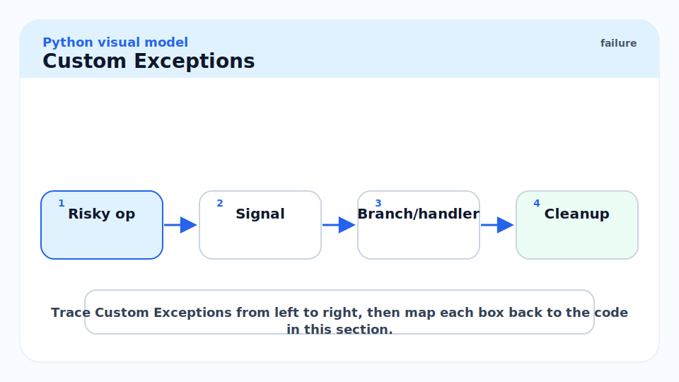

Custom exception classes should be shallow hierarchies inheriting from `Exception`. Include attributes for structured error data.

```python
class AppError(Exception):
    """Base class for all application errors."""


class ValidationError(AppError):
    def __init__(self, field: str, message: str) -> None:
        self.field = field
        self.message = message
        super().__init__(f"Validation error on '{field}': {message}")


class DatabaseError(AppError):
    def __init__(self, query: str, message: str) -> None:
        self.query = query
        self.message = message
        super().__init__(f"Database error running {query!r}: {message}")


try:
    raise ValidationError("email", "must contain '@'")
except ValidationError as exc:
    print(exc.field)    # >>> email
    print(exc.message)  # >>> must contain '@'
```

## Exception Groups and `except*` (Python 3.11+)

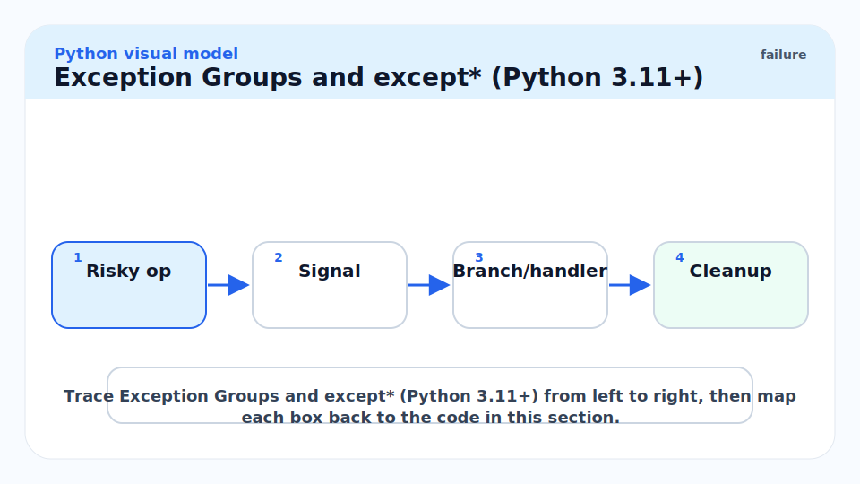

`asyncio.TaskGroup` (and manual code) can raise `ExceptionGroup` when multiple concurrent operations fail. `except*` handles sub-exceptions by type without consuming the group entirely.

```python
import asyncio


async def might_fail(n: int) -> int:
    if n % 2 == 0:
        raise ValueError(f"even: {n}")
    return n


async def run() -> None:
    try:
        async with asyncio.TaskGroup() as tg:
            for i in range(4):
                tg.create_task(might_fail(i))
    except* ValueError as eg:
        print(f"Caught {len(eg.exceptions)} ValueError(s):")
        for exc in eg.exceptions:
            print(f"  {exc}")


asyncio.run(run())
# Caught 2 ValueError(s):
#   even: 0
#   even: 2
```

## Context Managers

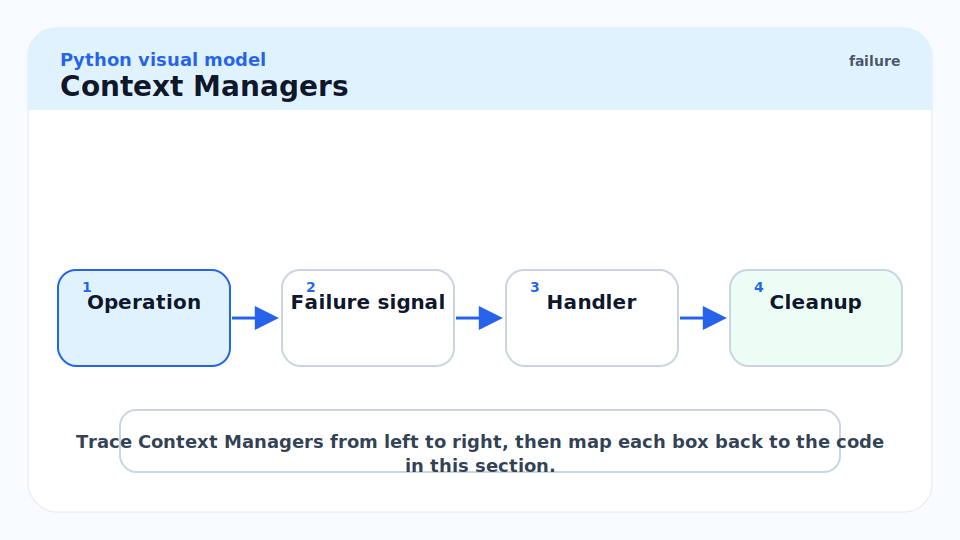

### The Protocol: `__enter__` and `__exit__`

Any class implementing these two methods can be used with `with`. `__enter__` returns the resource (bound to the `as` target). `__exit__` receives exception info and returns a bool.

```python
import time
from types import TracebackType


class Timer:
    """Context manager that measures wall time of a block."""

    def __init__(self, label: str = "") -> None:
        self.label = label
        self.elapsed: float = 0.0

    def __enter__(self) -> "Timer":
        self._start = time.perf_counter()
        return self

    def __exit__(
        self,
        exc_type: type[BaseException] | None,
        exc_val: BaseException | None,
        exc_tb: TracebackType | None,
    ) -> bool:
        self.elapsed = time.perf_counter() - self._start
        print(f"{self.label} took {self.elapsed:.4f}s")
        return False  # do not suppress exceptions


with Timer("matrix multiply") as t:
    result = sum(range(10_000_000))

print(f"Elapsed: {t.elapsed:.4f}s")
```

> [!NOTE]
> `__exit__` returning `True` suppresses the exception — the `with` block behaves as if no exception occurred. Returning `False` or `None` re-raises. Only return `True` deliberately: `contextlib.suppress` is a named version that makes the intent clear. Accidentally returning `True` (e.g. an implicit `return None` that you think is `False`) will silently swallow exceptions.

### `@contextlib.contextmanager`

The decorator form is far more common for simple cases. The code before `yield` is `__enter__`; after `yield` is `__exit__`; the `yield` value is the `as` target.

```python
import contextlib
from collections.abc import Generator
from pathlib import Path


@contextlib.contextmanager
def atomic_write(path: Path) -> Generator[Path, None, None]:
    """
    Write to a temporary file and rename on success.
    On exception, the temp file is deleted — original is untouched.
    """
    tmp = path.with_suffix(".tmp")
    try:
        yield tmp
        tmp.rename(path)   # atomic on POSIX (same filesystem)
    except Exception:
        tmp.unlink(missing_ok=True)
        raise


# with atomic_write(Path("config.json")) as tmp:
#     tmp.write_text('{"key": "value"}')
# If the block raises, config.json is not corrupted.
```

### `contextlib.ExitStack`

`ExitStack` is for dynamic or conditional resource management — when you do not know at write time how many resources to acquire.

```python
import contextlib
from pathlib import Path


def merge_files(input_paths: list[Path], output_path: Path) -> None:
    """Open an arbitrary number of input files and one output file."""
    with contextlib.ExitStack() as stack:
        inputs = [
            stack.enter_context(open(p, encoding="utf-8"))
            for p in input_paths
        ]
        out = stack.enter_context(open(output_path, "w", encoding="utf-8"))
        for f in inputs:
            out.write(f.read())
    # All files closed here, even if an exception occurred
```

## Real-world Example

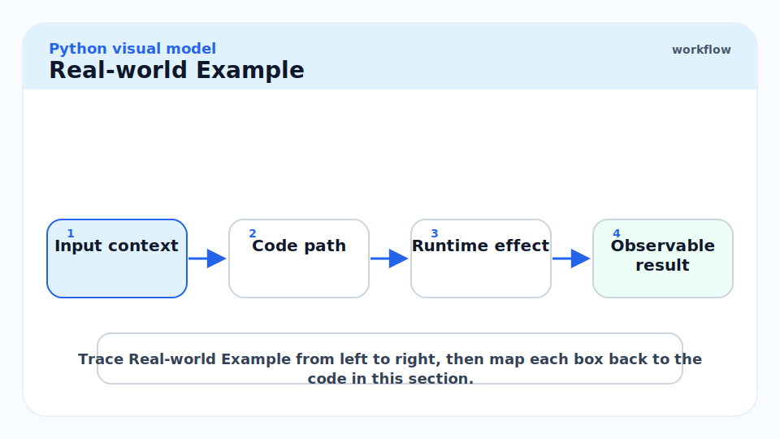

A database connection context manager with retry logic and exception chaining — a realistic pattern from a production service.

```python
import contextlib
import sqlite3
from collections.abc import Generator


class DatabaseConnectionError(Exception):
    """Raised when we cannot establish a database connection."""


class QueryError(Exception):
    """Raised when a query fails after retries."""


@contextlib.contextmanager
def get_db_connection(db_path: str) -> Generator[sqlite3.Connection, None, None]:
    """
    Acquire a SQLite connection; commit on clean exit, rollback on error.
    Re-raises database errors as domain errors with exception chaining.
    """
    conn: sqlite3.Connection | None = None
    try:
        conn = sqlite3.connect(db_path)
        yield conn
        conn.commit()
    except sqlite3.OperationalError as exc:
        if conn is not None:
            conn.rollback()
        raise DatabaseConnectionError(
            f"Database operation failed: {db_path}"
        ) from exc
    finally:
        if conn is not None:
            conn.close()


def run_query(db_path: str, sql: str) -> list[tuple[object, ...]]:
    """Execute a query and return all rows."""
    try:
        with get_db_connection(db_path) as conn:
            cursor = conn.execute(sql)
            return cursor.fetchall()
    except DatabaseConnectionError as exc:
        raise QueryError(f"Query failed: {sql!r}") from exc


try:
    rows = run_query(":memory:", "SELECT 1")
    print(rows)  # >>> [(1,)]
except QueryError as exc:
    print(f"Error: {exc}")
    print(f"Cause: {exc.__cause__}")
```

> [!TIP]
> The `with get_db_connection(...) as conn:` pattern makes `COMMIT`/`ROLLBACK` automatic. You never forget to rollback on error because the context manager handles it. This is the correct pattern for any transactional resource: acquire in `__enter__`, commit/close in `__exit__`, rollback in the exception branch of `__exit__`.

## In Practice

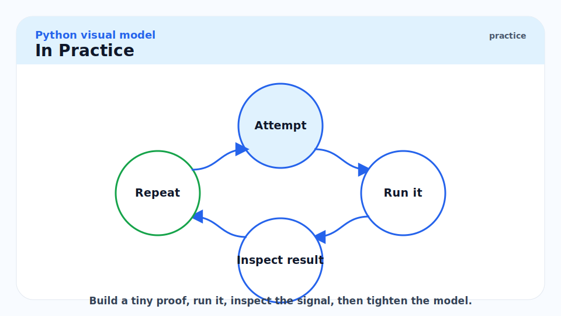

**Never catch and silently swallow.** `except Exception: pass` is one of the worst patterns in Python. If you genuinely want to suppress, use `contextlib.suppress(SpecificExceptionType)` — it names the exception type you are suppressing, making the intent explicit and auditable.

**`finally` vs `__exit__`.** For one-off cleanup tied to a single resource, `try/finally` in the function body is fine. For reusable cleanup patterns, a context manager is cleaner and composable. Prefer context managers for anything that appears in more than one place.

**Exception logging.** Use `logger.exception("message")` inside an `except` block — it logs the message plus the full traceback automatically. `logger.error("message", exc_info=True)` is equivalent. Never log `str(exc)` alone — you lose the traceback.

> [!CAUTION]
> **`except BaseException` in a library is almost always wrong.** Catching `BaseException` intercepts `KeyboardInterrupt` and `SystemExit`. A user pressing Ctrl+C gets no response; a `sys.exit()` call does not exit. Reserve `except BaseException` for top-level application entry points that want to log a crash report before exiting. In library code, catch `Exception` at the most specific level you can.

## Pitfalls

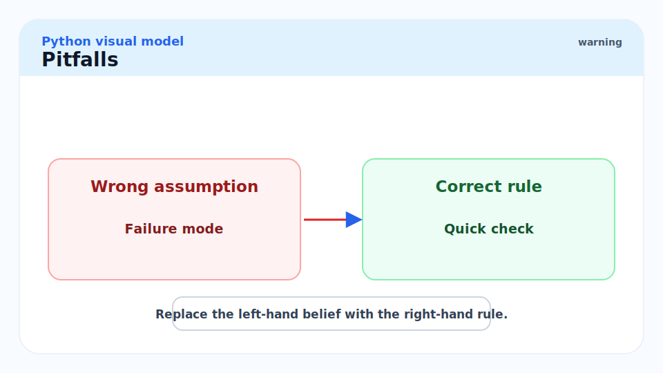

- **"Bare `except:` is safe as a catch-all."** — No. Bare `except:` catches `SystemExit`, `KeyboardInterrupt`, and `GeneratorExit`. It will catch Ctrl+C in a loop, making the program appear hung. Always use `except Exception:` for general catches.
- **"`raise` inside `finally` replaces the original exception."** — Yes, and silently. If your `finally` block raises, the original exception from `try` is lost. Use `contextlib.suppress` in `finally` if you want to log and discard secondary errors.
- **"Context managers are only for file I/O."** — They are for any acquire-use-release pattern: database connections, locks, temporary directories, monkey-patching, profiling spans, GUI dialogs, GPU streams, etc.
- **"`__exit__` returning `None` suppresses the exception."** — No, the opposite. `None` is falsy, so it propagates. Only an explicitly `True` return suppresses.
- **"Exception groups require all tasks to fail."** — No. `asyncio.TaskGroup` raises an `ExceptionGroup` as soon as *any* task fails; it cancels the remaining tasks. The group may contain exceptions from one or multiple failed tasks.

## Exercises

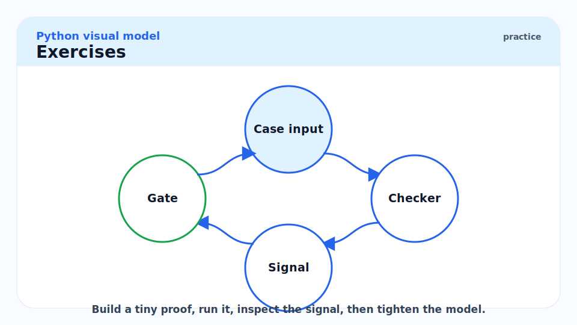

### Exercise 1 — `else` clause semantics

Explain when the `else` clause runs and why this is different from putting the same code at the end of `try`.

#### Solution

The `else` clause of `try/except/else/finally` runs **if and only if the `try` block completes without raising an exception**. Code at the end of `try` would be covered by the `except` handlers and could accidentally trigger them if it raises the same exception type.

Example:
```python
try:
    result = int(user_input)
    # BAD if put here: print(f"Got: {result}") — if print raised, except ValueError would catch it
except ValueError:
    print("Invalid input")
else:
    print(f"Got: {result}")  # Only runs if int() succeeded; print's exceptions propagate freely
```

The `else` clause is a correctness tool: it keeps the `try` block minimally covering only the risky operation, so `except` handlers are precisely scoped.

---

### Exercise 2 — Implement `managed_temp_dir`

Write a context manager `managed_temp_dir()` that creates a temporary directory, yields its path, and always cleans it up on exit (even if an exception occurs).

#### Solution

```python
import contextlib
import shutil
import tempfile
from collections.abc import Generator
from pathlib import Path


@contextlib.contextmanager
def managed_temp_dir() -> Generator[Path, None, None]:
    """Create a temporary directory and clean it up on exit."""
    tmp = Path(tempfile.mkdtemp())
    try:
        yield tmp
    finally:
        shutil.rmtree(tmp, ignore_errors=True)


with managed_temp_dir() as d:
    (d / "output.txt").write_text("hello")
    print(list(d.iterdir()))   # >>> [PosixPath('/tmp/tmpXXXX/output.txt')]
# Directory and all contents deleted here, even if the block raised
```

The `finally` block always runs, so cleanup is guaranteed. `ignore_errors=True` in `rmtree` prevents a cleanup failure from masking the original exception (if one occurred).

---

### Exercise 3 — Exception chaining

Write a function that reads a YAML config file and raises a typed `ConfigParseError` that chains the original `yaml.YAMLError`.

#### Solution

```python
import contextlib
from pathlib import Path


class ConfigParseError(Exception):
    """Raised when the configuration file cannot be parsed."""
    def __init__(self, path: Path, reason: str) -> None:
        self.path = path
        self.reason = reason
        super().__init__(f"Failed to parse config {path}: {reason}")


def load_yaml_config(path: Path) -> dict[str, object]:
    """Parse a YAML config file. Raises ConfigParseError on failure."""
    try:
        import yaml  # type: ignore[import-untyped]
        with open(path, encoding="utf-8") as f:
            result = yaml.safe_load(f)
        if not isinstance(result, dict):
            raise ConfigParseError(path, "top-level must be a mapping")
        return result
    except FileNotFoundError as exc:
        raise ConfigParseError(path, "file not found") from exc
    except Exception as exc:  # yaml.YAMLError is a subclass of Exception
        raise ConfigParseError(path, str(exc)) from exc
```

Chaining with `from exc` preserves the full original traceback in `exc.__cause__`, which appears in the formatted traceback as "The above exception was the direct cause of the following exception."

---

### Exercise 4 — `ExitStack` for dynamic resources

You are given a list of file paths at runtime. Use `ExitStack` to open all of them and concatenate their contents.

#### Solution

```python
import contextlib
from pathlib import Path


def concat_files(paths: list[Path]) -> str:
    """Open all files and return their concatenated text content."""
    with contextlib.ExitStack() as stack:
        handles = [
            stack.enter_context(open(p, encoding="utf-8"))
            for p in paths
        ]
        return "".join(f.read() for f in handles)
```

`ExitStack.enter_context` registers each context manager. When the `with` block exits (normally or via exception), the stack unwinds all registered managers in LIFO order. This is the correct pattern when the number of resources depends on runtime data — a plain `with open(a), open(b):` requires knowing the count at write time.

## Sources

- Python Exceptions — https://docs.python.org/3/library/exceptions.html
- PEP 343 — The "with" Statement — https://peps.python.org/pep-0343/
- PEP 654 — Exception Groups and `except*` — https://peps.python.org/pep-0654/
- `contextlib` documentation — https://docs.python.org/3/library/contextlib.html
- Ramalho, L. *Fluent Python* (2nd ed., 2022). Chapter 18.
- Brett Slatkin. *Effective Python* (3rd ed., 2024). Items 65–66.

## Related

- [4 - Functions, Closures, Decorators](./4-functions-closures-decorators.md)
- [5 - Classes, Inheritance, MRO, ABCs](./5-classes-inheritance-mro-abcs.md)
- [9 - asyncio and Coroutines](./9-asyncio-and-coroutines.md)
- [12 - Building Production Services in Python](./12-building-production-services-in-python.md)
