# 8 - The GIL, Threads, Multiprocessing

[toc]

> **TL;DR:** CPython's Global Interpreter Lock (GIL) is a mutex that prevents more than one thread from executing Python bytecode simultaneously, making pure-Python threads useless for CPU parallelism but fine for I/O concurrency. True CPU parallelism in CPython 3.12 and earlier requires `multiprocessing` (separate processes, each with their own GIL) or C extensions that release the GIL. Python 3.13 ships a no-GIL build (PEP 703) as an opt-in experimental mode.

## Vocabulary

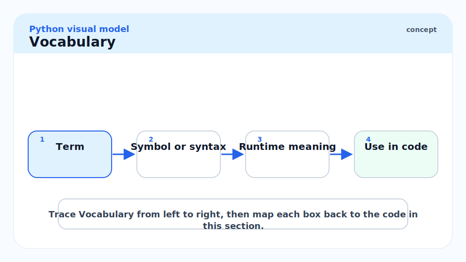

**GIL (Global Interpreter Lock)**: A CPython-internal mutex (`_Py_CEVAL_GIL` in `ceval.c`). Only the thread holding the GIL may execute Python bytecode. Released during I/O system calls, C extension work, and `time.sleep`.

---

**`threading.Thread`**: CPython thread object backed by an OS thread. Useful for I/O-bound concurrency. Multiple threads can be alive simultaneously but only one runs Python bytecode at a time.

---

**`threading.Lock`**: A mutual-exclusion primitive for protecting shared mutable state between threads.

---

**`threading.Event`**: A flag that one thread sets and others wait on. Useful for signalling.

---

**`queue.Queue`**: A thread-safe FIFO queue. The canonical way to pass data between threads. Backed by `collections.deque` with a `Condition` lock.

---

**`multiprocessing.Process`**: A separate OS process, each with its own CPython interpreter and GIL. True parallelism. State sharing requires `multiprocessing.Queue`, `Pipe`, `shared_memory`, or `Manager`.

---

**`concurrent.futures.ThreadPoolExecutor`**: A pool of threads managed for you. Returns `Future` objects. Best for I/O-bound tasks.

---

**`concurrent.futures.ProcessPoolExecutor`**: A pool of worker processes. Best for CPU-bound tasks. Inputs/outputs must be picklable.

---

**Pickle**: Python's serialisation protocol, used by `multiprocessing` to send objects between processes. Lambdas, closures, and some C extensions are not picklable.

---

**`GIL-releasing extension`**: A C extension that calls `Py_BEGIN_ALLOW_THREADS` / `Py_END_ALLOW_THREADS` to release the GIL while executing C code. NumPy array operations, file reads, network calls all do this — enabling true parallelism in the C layer even with CPython.

---

**PEP 703**: "Making the Global Interpreter Lock Optional." Python 3.13 builds with `--disable-gil`; 3.12 is unaffected. The no-GIL build has slightly higher single-threaded overhead due to per-object reference counting locks.

---

## Intuition

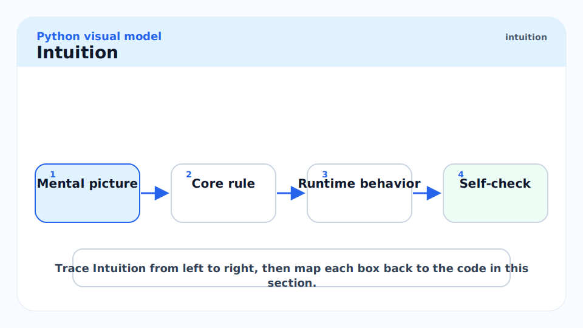

Think of the GIL as a single talking stick in a meeting room where only one person can speak at a time. If the work is talking (pure Python bytecode), only one person can work regardless of how many are in the room. But if the work is writing (C extension, network call, file I/O), the talker can pass the stick to someone else while they write — that is, I/O releases the GIL.

The practical consequence: threading is correct for network-I/O-heavy code (web scrapers, HTTP clients, DB queries) because threads spend most of their time waiting, not executing bytecode. For CPU-heavy pure Python code (number crunching, parsing, image processing), multiprocessing is necessary.

## The GIL in Depth

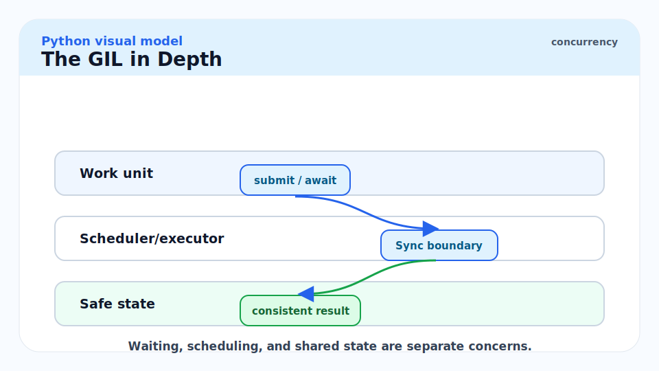

### What the GIL Protects

The GIL protects CPython's internal data structures: the reference count increment/decrement cycle (`ob_refcnt`), the allocator, the method resolution caches, and the import system. Without it, two threads could simultaneously decrement the same `ob_refcnt` to zero twice — double-free.

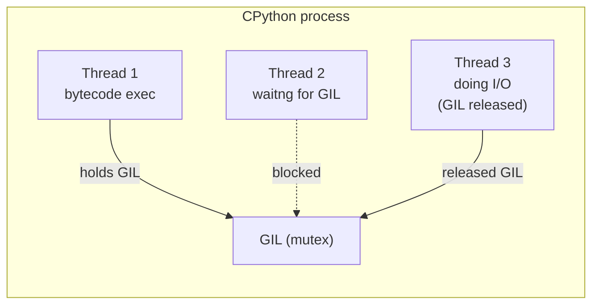

### GIL Release Schedule

The GIL is released in several situations:

1. **I/O system calls** — `socket.recv`, `file.read`, `time.sleep`, `os.waitpid`.
2. **C extension work** — any extension that calls `Py_BEGIN_ALLOW_THREADS`.
3. **Every N bytecode instructions** (pre-3.2) or every 5ms check interval (3.2+, `sys.getswitchinterval()`).

```python
import sys
print(sys.getswitchinterval())   # >>> 0.005  (5ms — default since Python 3.2)
sys.setswitchinterval(0.001)     # 1ms — more aggressive context switching
```

## Threads — When They Help

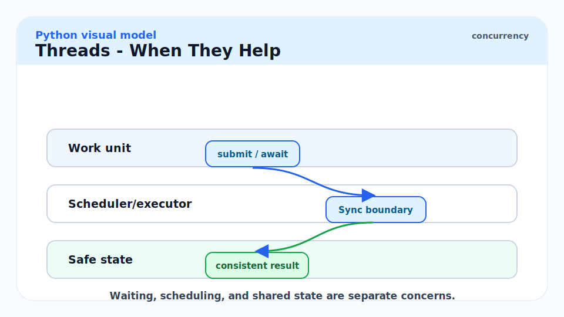

### I/O-Bound Concurrency

A thread blocked on `socket.recv` releases the GIL. While it waits for the network, other threads execute Python bytecode. This is the threading sweet spot.

```python
import threading
import time
import urllib.request
from concurrent.futures import ThreadPoolExecutor, as_completed


def fetch(url: str) -> tuple[str, int]:
    """Fetch a URL and return (url, response_length)."""
    with urllib.request.urlopen(url, timeout=10) as resp:
        return url, len(resp.read())


urls = [
    "https://httpbin.org/delay/1",
    "https://httpbin.org/delay/1",
    "https://httpbin.org/delay/1",
]

# Sequential: ~3 seconds
start = time.perf_counter()
results = [fetch(u) for u in urls]
print(f"Sequential: {time.perf_counter() - start:.2f}s")

# Threaded: ~1 second (I/O overlap)
start = time.perf_counter()
with ThreadPoolExecutor(max_workers=len(urls)) as executor:
    futures = {executor.submit(fetch, u): u for u in urls}
    for future in as_completed(futures):
        url, length = future.result()
        print(f"{url}: {length} bytes")
print(f"Threaded: {time.perf_counter() - start:.2f}s")
```

### Thread Safety with Locks

Threads share memory. Unprotected concurrent writes to shared mutable state produce races.

```python
import threading


class ThreadSafeCounter:
    def __init__(self) -> None:
        self._value: int = 0
        self._lock = threading.Lock()

    def increment(self) -> None:
        with self._lock:
            self._value += 1

    @property
    def value(self) -> int:
        with self._lock:
            return self._value


counter = ThreadSafeCounter()
threads = [threading.Thread(target=counter.increment) for _ in range(1000)]
for t in threads:
    t.start()
for t in threads:
    t.join()
print(counter.value)  # >>> 1000  (not some smaller number)
```

> [!WARNING]
> In CPython, `counter += 1` on a plain `int` attribute is **not** atomic even though `int` is immutable. The operation compiles to `LOAD`, `LOAD_CONST`, `BINARY_OP`, `STORE` — four bytecode instructions. The GIL can switch between any two of them, so two threads can both read the old value, increment it locally, and write back the same incremented value, losing one increment. Always use a `Lock` for shared mutable state.

## Multiprocessing — True CPU Parallelism

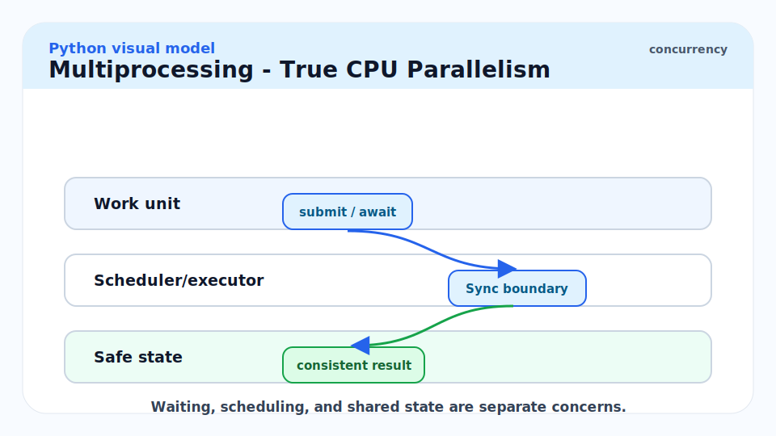

Each `multiprocessing.Process` runs a separate CPython interpreter with its own GIL. Objects must be serialised (pickled) to cross process boundaries.

```python
import multiprocessing
import time
from concurrent.futures import ProcessPoolExecutor


def cpu_bound(n: int) -> int:
    """A purely CPU-bound computation."""
    return sum(i * i for i in range(n))


def run_parallel(numbers: list[int]) -> list[int]:
    with ProcessPoolExecutor(max_workers=multiprocessing.cpu_count()) as executor:
        return list(executor.map(cpu_bound, numbers))


if __name__ == "__main__":  # REQUIRED on macOS/Windows: guards the spawn
    start = time.perf_counter()
    results = run_parallel([10_000_000] * 4)
    print(f"Parallel: {time.perf_counter() - start:.2f}s")
    print(results[:2])
```

> [!IMPORTANT]
> On macOS and Windows, `multiprocessing` defaults to `spawn` (not `fork`). The `if __name__ == "__main__":` guard is **mandatory** — without it, each worker process re-imports the main module and starts another pool recursively. On Linux the default is `fork` (no guard needed, but `spawn` is safer for mixed C/Python code).

### Pickling Constraints

The `ProcessPoolExecutor` sends tasks and results via pickle. Lambdas, closures, and certain C extension objects cannot be pickled.

```python
import multiprocessing
from concurrent.futures import ProcessPoolExecutor


# WRONG: lambdas are not picklable
# with ProcessPoolExecutor() as ex:
#     list(ex.map(lambda x: x*2, [1,2,3]))  # PicklingError

# RIGHT: use a module-level function
def double(x: int) -> int:
    return x * 2

if __name__ == "__main__":
    with ProcessPoolExecutor() as ex:
        print(list(ex.map(double, [1, 2, 3])))  # >>> [2, 4, 6]
```

### Shared Memory

For large NumPy arrays, pickling is prohibitively expensive. Use `multiprocessing.shared_memory` (Python 3.8+) to share memory without copying.

```python
import multiprocessing.shared_memory as shm
import numpy as np


def worker(shm_name: str, shape: tuple[int, ...], dtype: str) -> None:
    """Worker that reads from shared memory."""
    mem = shm.SharedMemory(name=shm_name)
    arr = np.ndarray(shape, dtype=dtype, buffer=mem.buf)
    print(f"Worker sees: {arr[:5]}")
    mem.close()


if __name__ == "__main__":
    data = np.arange(100, dtype=np.float64)
    mem = shm.SharedMemory(create=True, size=data.nbytes)
    shared_arr = np.ndarray(data.shape, dtype=data.dtype, buffer=mem.buf)
    shared_arr[:] = data

    p = multiprocessing.Process(
        target=worker,
        args=(mem.name, data.shape, str(data.dtype)),
    )
    p.start()
    p.join()
    mem.close()
    mem.unlink()
```

## The No-GIL Future (PEP 703)

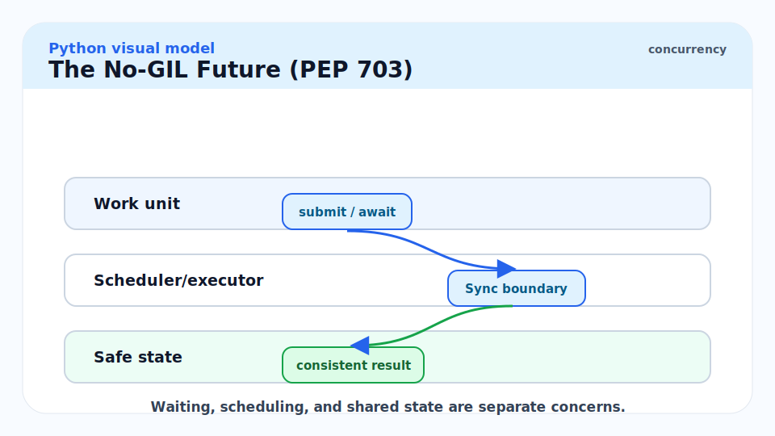

Python 3.13 ships a no-GIL build as an opt-in (`python3.13t`). The GIL is replaced with per-object biased reference counting (borrowed from Biased Reference Counting, 2018). Key trade-offs:

| | GIL build | No-GIL build (3.13+) |
| :--- | :--- | :--- |
| CPU parallelism | None (for pure Python) | Full (N threads × N cores) |
| Single-thread overhead | Baseline | ~5–10% slower |
| Extension compatibility | Universal | Requires GIL-safe extensions |
| Production readiness | Stable | Experimental (3.13), stabilising |

> [!NOTE]
> The no-GIL build's performance benefit depends on the workload. Embarrassingly parallel pure-Python code scales well. Code with lots of shared mutable state may be limited by per-object lock contention. The CPython maintainers estimate the stabilised no-GIL build will be the default by Python 3.16.

## Real-world Example

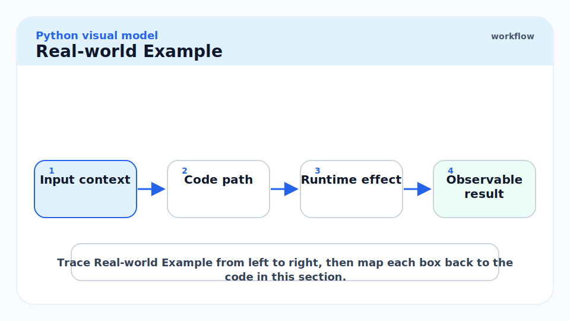

A web scraper using `ThreadPoolExecutor` for I/O-bound fetching, then `ProcessPoolExecutor` for CPU-bound HTML parsing — the correct tool for each bottleneck.

```python
from __future__ import annotations

import re
from concurrent.futures import ProcessPoolExecutor, ThreadPoolExecutor, as_completed
from urllib.request import urlopen


def fetch_html(url: str) -> tuple[str, str]:
    """I/O-bound: fetch URL, return (url, html)."""
    with urlopen(url, timeout=10) as resp:
        return url, resp.read().decode("utf-8", errors="replace")


def extract_links(url_html: tuple[str, str]) -> tuple[str, list[str]]:
    """CPU-bound: parse HTML to extract hrefs."""
    url, html = url_html
    links = re.findall(r'href=["\']([^"\']+)["\']', html)
    return url, links


def scrape(urls: list[str]) -> dict[str, list[str]]:
    # Phase 1: fetch concurrently with threads (I/O-bound)
    html_pages: list[tuple[str, str]] = []
    with ThreadPoolExecutor(max_workers=8) as pool:
        futures = {pool.submit(fetch_html, u): u for u in urls}
        for future in as_completed(futures):
            try:
                html_pages.append(future.result())
            except Exception as exc:
                print(f"Fetch failed for {futures[future]}: {exc}")

    # Phase 2: parse in processes (CPU-bound)
    results: dict[str, list[str]] = {}
    if __name__ == "__main__":
        with ProcessPoolExecutor() as pool:
            for url, links in pool.map(extract_links, html_pages):
                results[url] = links

    return results
```

> [!TIP]
> The "fetch with threads, parse with processes" pattern is the canonical two-phase pipeline for I/O + CPU workloads. Threads cost ~64 KB of stack; processes cost ~30 MB of interpreter overhead. Use threads for anything where you spend more time waiting than computing; use processes for compute-heavy work that cannot be vectorised into NumPy.

## In Practice

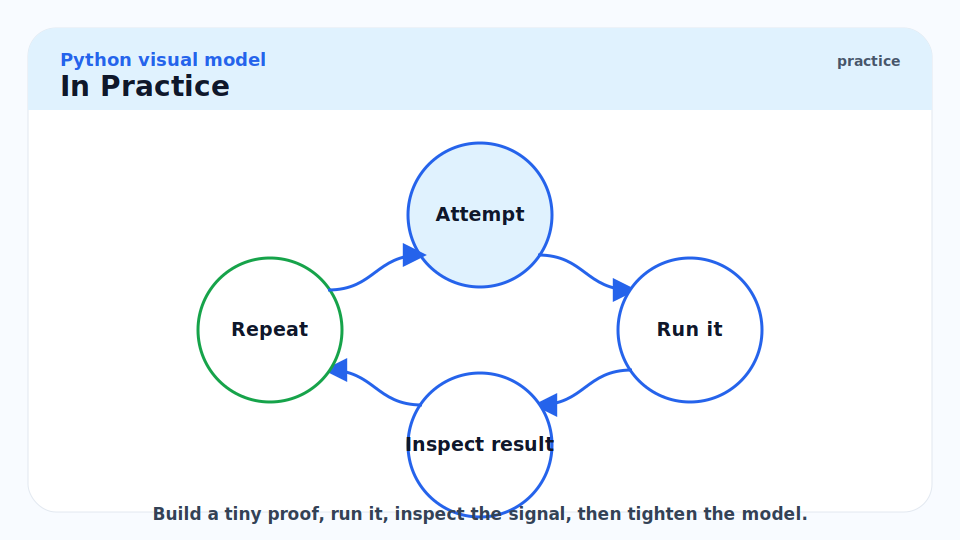

**Thread pool sizing.** For I/O-bound work, use more threads than cores — `max_workers = min(32, os.cpu_count() + 4)` is `ThreadPoolExecutor`'s default in Python 3.8+. For CPU-bound work, `max_workers = os.cpu_count()` is the ceiling; more processes won't help and add overhead.

**`queue.Queue` vs `multiprocessing.Queue`.** `queue.Queue` is for threads (same process, shared memory). `multiprocessing.Queue` is for processes (different processes, pickle-serialised). They have identical APIs, which is a common source of confusion.

**`concurrent.futures` vs `asyncio`.** For I/O-bound work, `asyncio` is more efficient than threads (no OS thread overhead, no lock contention). `ThreadPoolExecutor` is for when the I/O is blocking (legacy `requests`, JDBC drivers, file I/O without `aiofiles`). Covered in [9 - asyncio and Coroutines](./9-asyncio-and-coroutines.md).

> [!CAUTION]
> `fork()` + threads is dangerous on macOS. macOS uses `fork()` for `multiprocessing` by default in Python < 3.8, but `fork()` with live threads produces deadlocks when the child copies the parent's lock state. Python 3.8+ defaults to `spawn` on macOS. If you see hangs in multiprocessing on macOS, check `multiprocessing.get_start_method()` and set it to `"spawn"` explicitly.

## Pitfalls

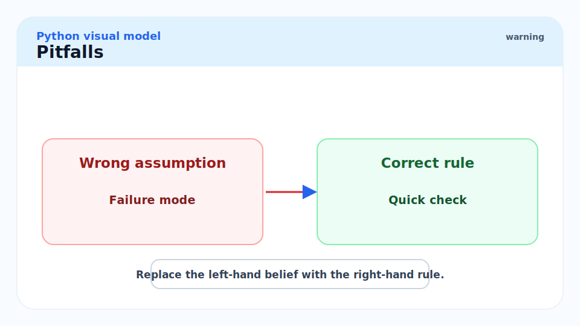

- **"Python threads run in parallel."** — Only for I/O and GIL-releasing C code. Pure Python bytecode runs sequentially — only one thread holds the GIL at a time.
- **"Simple operations like `x += 1` are thread-safe."** — They are not. `+=` is multiple bytecodes; the GIL can switch between them. Use a `Lock`.
- **"`multiprocessing` is always faster than threads for CPU work."** — Process startup is expensive (~0.1s). For tasks shorter than a few milliseconds, the overhead of spawning processes exceeds the parallelism gain. Profile first.
- **"Lambdas can be passed to `ProcessPoolExecutor`."** — They cannot. Lambdas are not picklable. Use module-level functions or `functools.partial` with a module-level function.
- **"The no-GIL build is production-ready in Python 3.13."** — It is experimental. Extension compatibility is not universal, and the CPython maintainers recommend the GIL build for production until 3.16.

## Exercises

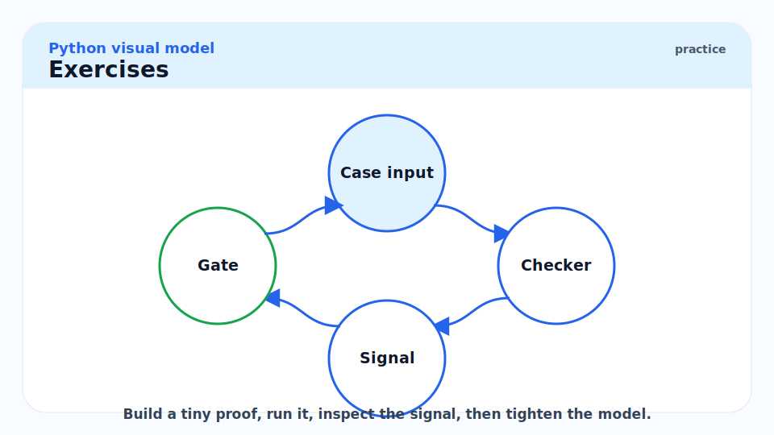

### Exercise 1 — Diagnose the race condition

What is the bug in the following code, and what is the correct fix?

```python
import threading

total: int = 0

def add_to_total(n: int) -> None:
    global total
    total += n

threads = [threading.Thread(target=add_to_total, args=(1,)) for _ in range(1000)]
for t in threads: t.start()
for t in threads: t.join()
print(total)  # Expected: 1000. Actual: often less.
```

#### Solution

The bug is a data race on `total`. `total += 1` compiles to `LOAD_GLOBAL total`, `LOAD_CONST 1`, `BINARY_OP (+)`, `STORE_GLOBAL total` — four bytecodes. The GIL can switch between the load and the store, causing two threads to both read the same value, both increment, and both write back the same value — losing one of the increments.

Fix: use a `threading.Lock`:

```python
import threading

total: int = 0
lock = threading.Lock()

def add_to_total(n: int) -> None:
    global total
    with lock:
        total += n
```

Alternative: use `threading.local()` to accumulate per-thread and reduce at the end, avoiding the lock on every increment.

---

### Exercise 2 — Choose the right tool

For each scenario, say whether you should use `threading`, `multiprocessing`, or `asyncio`, and why.

1. Downloading 500 URLs from an API.
2. Transcoding 100 video files (CPU-bound FFmpeg calls via `subprocess`).
3. A FastAPI endpoint that makes 3 database queries.
4. Computing checksums for 10,000 files on disk.

#### Solution

1. **`asyncio`** (or `threading`): downloading is I/O-bound. `asyncio` with `aiohttp` is most efficient. `ThreadPoolExecutor` works for `urllib`/`requests`.
2. **`multiprocessing`** or `ThreadPoolExecutor`: FFmpeg runs as an external process via `subprocess`, which releases the GIL. `ThreadPoolExecutor` actually works here because `subprocess.run` releases the GIL — the bottleneck is the FFmpeg process, not Python. `ProcessPoolExecutor` would work too but adds unnecessary overhead.
3. **`asyncio`**: FastAPI is already async. Use `async def` and an async DB driver (asyncpg, SQLAlchemy async). Do not use `threading` inside an async handler — it blocks the event loop.
4. **`ThreadPoolExecutor`**: file I/O releases the GIL. Eight to sixteen threads overlap disk reads well. `ProcessPoolExecutor` would work but is overkill for pure I/O.

---

### Exercise 3 — Fix the pickling error

Why does this fail and how do you fix it?

```python
from concurrent.futures import ProcessPoolExecutor

multiplier = 3

with ProcessPoolExecutor() as ex:
    results = list(ex.map(lambda x: x * multiplier, range(5)))
```

#### Solution

Lambdas close over `multiplier` in the enclosing scope but are not picklable (they have no stable `__qualname__` that pickle can use). `ProcessPoolExecutor.map` pickles the function and arguments to send to worker processes.

Fix using `functools.partial` with a module-level function:

```python
import functools
from concurrent.futures import ProcessPoolExecutor


def multiply_by(x: int, factor: int) -> int:
    return x * factor


if __name__ == "__main__":
    with ProcessPoolExecutor() as ex:
        fn = functools.partial(multiply_by, factor=3)
        print(list(ex.map(fn, range(5))))  # >>> [0, 3, 6, 9, 12]
```

`functools.partial` wraps a picklable function with pre-filled arguments and is itself picklable.

## Sources

- PEP 703 — Making the GIL Optional — https://peps.python.org/pep-0703/
- Python `threading` module — https://docs.python.org/3/library/threading.html
- Python `multiprocessing` module — https://docs.python.org/3/library/multiprocessing.html
- Python `concurrent.futures` — https://docs.python.org/3/library/concurrent.futures.html
- David Beazley, "Understanding the Python GIL" (PyCon 2010) — https://www.dabeaz.com/python/UnderstandingGIL.pdf
- CPython `Python/ceval_gil.c` — https://github.com/python/cpython/blob/main/Python/ceval_gil.c
- Ramalho, L. *Fluent Python* (2nd ed., 2022). Chapter 19.

## Related

- [1 - What is Python](./1-what-is-python.md)
- [9 - asyncio and Coroutines](./9-asyncio-and-coroutines.md)
- [10 - Performance and the Standard Library](./10-performance-and-the-standard-library.md)
