# 9 - asyncio and Coroutines

[toc]

> **TL;DR:** `asyncio` is a single-threaded concurrency model built on an event loop that multiplexes I/O-bound work by suspending coroutines at `await` points. Coroutines (`async def` functions) are cooperative: they yield control explicitly. `asyncio.TaskGroup` (Python 3.11+) is the structured concurrency primitive; `asyncio.gather` is the older equivalent. The model gives you I/O throughput comparable to hundreds of threads with the overhead of one.

## Vocabulary

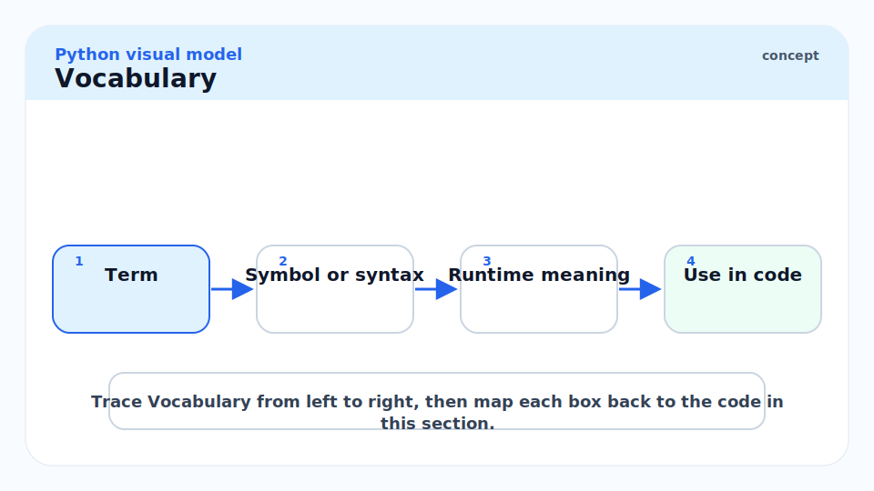

**Coroutine**: An `async def` function. Calling it returns a coroutine object; it does not execute until awaited or wrapped in a `Task`. Coroutines are awaitables.

---

**`await`**: Suspends the current coroutine and gives control to the event loop. The event loop resumes the coroutine when the awaitable is ready.

---

**Event loop** (`asyncio.AbstractEventLoop`): The single-threaded scheduler that manages all coroutines and callbacks. Drives I/O polling (epoll/kqueue/IOCP depending on OS). One event loop per OS thread.

---

**Task** (`asyncio.Task`): A coroutine wrapped in a Future and scheduled to run on the event loop. Created with `asyncio.create_task()`. Runs concurrently with other tasks.

---

**Future** (`asyncio.Future`): A low-level awaitable representing a computation whose result will be available later. `Task` is a `Future` whose result comes from a coroutine's return value.

---

**`asyncio.gather(*aws)`**: Runs multiple awaitables concurrently and returns a list of results in the same order. If one raises, others are cancelled by default.

---

**`asyncio.TaskGroup`** (Python 3.11+): Structured concurrency primitive. Spawns tasks; waits for all to complete; raises `ExceptionGroup` if any fail. Preferred over `gather` for new code.

---

**Cancellation** (`task.cancel()`): Schedules a `CancelledError` at the next `await` point of the task. The coroutine can clean up in a `try/finally` or `except asyncio.CancelledError`.

---

**`async for`**: Iterates over an async iterable (implementing `__aiter__` / `__anext__`). Each `__anext__` call is awaited.

---

**`async with`**: Async context manager (`__aenter__` / `__aexit__` are coroutines). Used for async DB connections, locks, semaphores.

---

**`asyncio.Semaphore`**: An async-aware semaphore for rate-limiting concurrent coroutines.

---

**`asyncio.Queue`**: An async-aware queue for producer-consumer patterns between coroutines.

---

**`loop.run_in_executor`**: Runs a blocking function in a `ThreadPoolExecutor` or `ProcessPoolExecutor` from within async code, yielding control to the event loop while it executes.

---

## Intuition

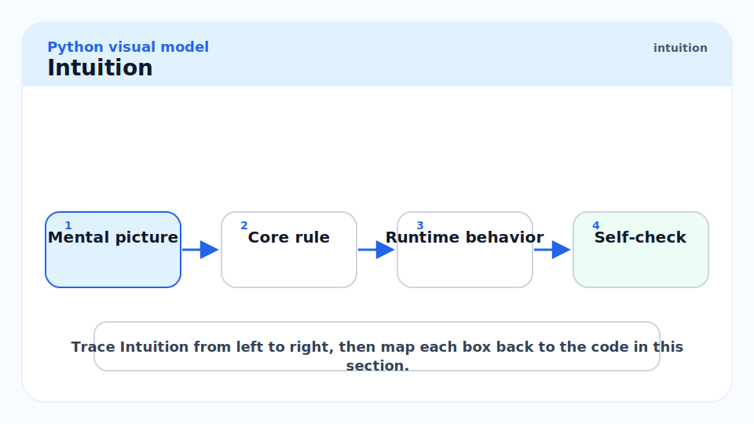

Imagine a single chef (the event loop) managing multiple orders (coroutines). The chef can only do one thing at a time, but each time an order requires waiting — for the oven to preheat, for a delivery to arrive — the chef sets a timer and starts another order. When the timer fires, the chef returns to the waiting order. No order is truly parallel, but all orders make progress.

This is cooperative multitasking: each coroutine is responsible for yielding control by using `await`. If a coroutine runs CPU-bound Python code without ever awaiting, it blocks the entire event loop — equivalent to the chef getting stuck peeling potatoes while everything else burns. `asyncio` is for I/O-bound work where the "waiting" dominates.

## The Event Loop Architecture

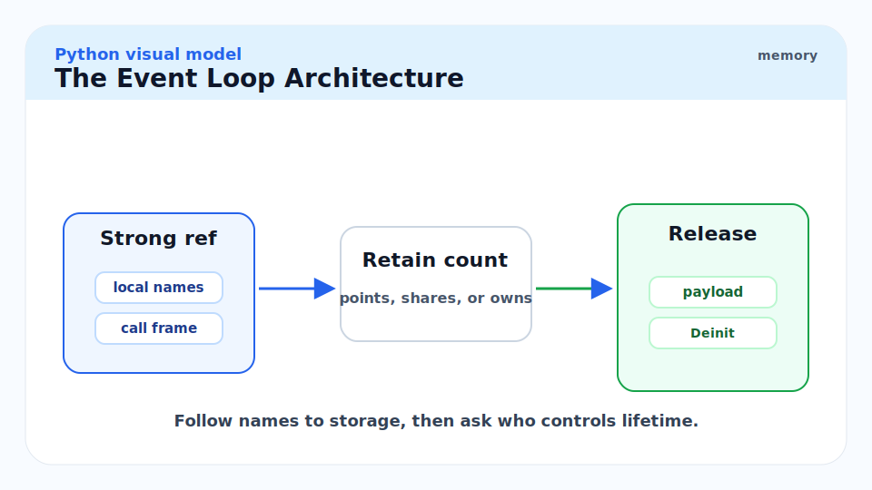

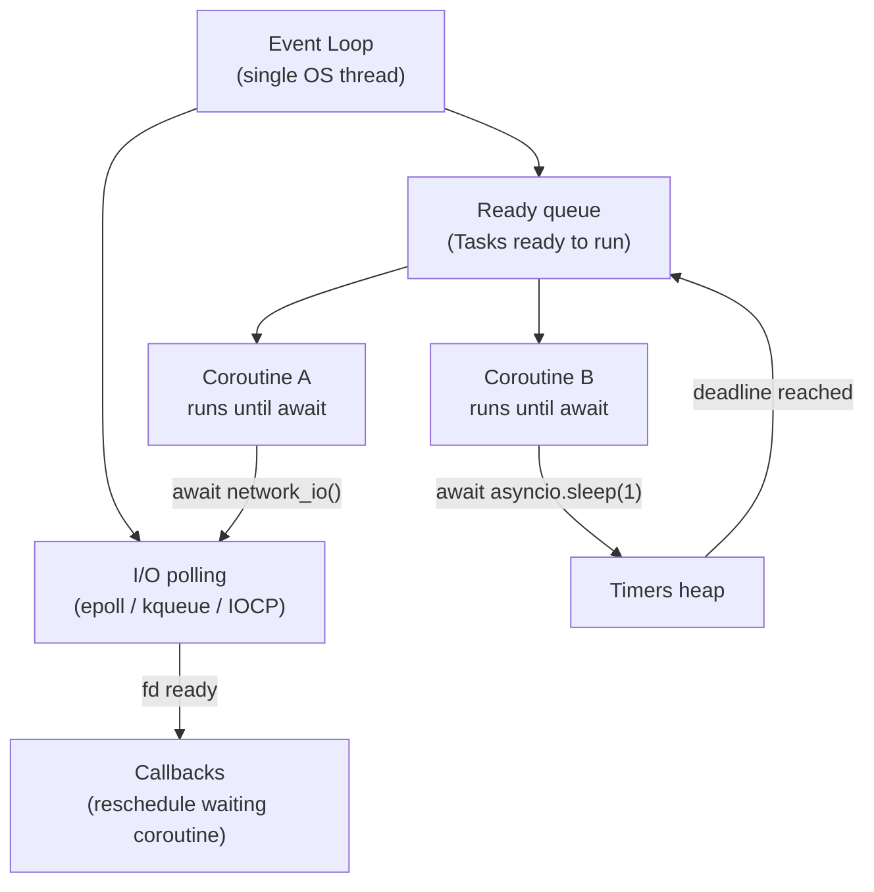

The loop runs one coroutine at a time. Each `await` is a suspension point where the event loop can switch to another coroutine. I/O events are multiplexed via the OS selector (epoll on Linux, kqueue on macOS). The loop processes the ready queue between I/O polls.

## `async def`, `await`, and Tasks


### Coroutines vs Tasks

A coroutine is not scheduled until it is either awaited directly or wrapped in a `Task`.

```python
import asyncio


async def hello(name: str) -> str:
    await asyncio.sleep(0)  # yield control once
    return f"Hello, {name}"


async def main() -> None:
    # Direct await: sequential — waits for hello to finish before continuing
    result = await hello("Alice")
    print(result)

    # Task: scheduled immediately, runs concurrently with other tasks
    task = asyncio.create_task(hello("Bob"))
    # ... do other work here ...
    print(await task)  # collect result


asyncio.run(main())
```

> [!IMPORTANT]
> Creating a coroutine object (`coro = hello("Alice")`) does **nothing**. The function body does not execute. You must `await coro`, wrap it in `asyncio.create_task(coro)`, or pass it to `asyncio.gather`. A coroutine that is created but never awaited is a resource leak — Python warns about this: `RuntimeWarning: coroutine 'hello' was never awaited`.

### `TaskGroup` — Structured Concurrency

`asyncio.TaskGroup` (Python 3.11+) is the idiomatic way to run multiple tasks and collect errors.

```python
import asyncio
import httpx  # type: ignore[import-untyped]


async def fetch(client: httpx.AsyncClient, url: str) -> tuple[str, int]:
    response = await client.get(url)
    return url, response.status_code


async def fetch_all(urls: list[str]) -> list[tuple[str, int]]:
    results: list[tuple[str, int]] = []
    async with httpx.AsyncClient() as client:
        async with asyncio.TaskGroup() as tg:
            tasks = [tg.create_task(fetch(client, url)) for url in urls]
        # All tasks complete here; ExceptionGroup raised if any failed
        results = [task.result() for task in tasks]
    return results
```

> [!TIP]
> Prefer `TaskGroup` over `asyncio.gather` for new code. `TaskGroup` provides structured concurrency: when any task fails, it cancels the others and re-raises as `ExceptionGroup`. `asyncio.gather` has subtler error semantics (the `return_exceptions` parameter changes behaviour) and does not cancel siblings automatically on failure.

### `asyncio.gather` — Fan-Out

For Python < 3.11, `asyncio.gather` is the standard way to run many coroutines concurrently.

```python
import asyncio
from typing import Any


async def slow(n: int) -> int:
    await asyncio.sleep(n * 0.1)
    return n * n


async def main() -> None:
    # Returns results in the same order as input
    results: list[Any] = await asyncio.gather(
        slow(1), slow(2), slow(3), slow(4),
        return_exceptions=True,  # exceptions returned as values, not raised
    )
    print(results)  # >>> [1, 4, 9, 16]


asyncio.run(main())
```

## Cancellation

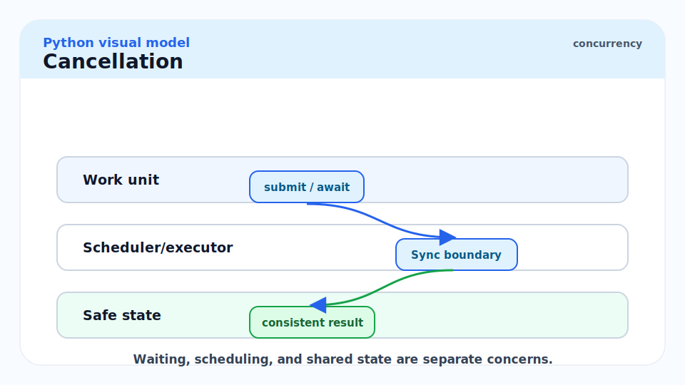

Cancellation sends `CancelledError` to the coroutine at its next `await`. The coroutine can catch it for cleanup, but must re-raise or the task is not considered cancelled.

```python
import asyncio


async def long_task(name: str) -> None:
    try:
        print(f"{name}: starting")
        await asyncio.sleep(10)
        print(f"{name}: done")
    except asyncio.CancelledError:
        print(f"{name}: cancelled, cleaning up")
        raise  # MUST re-raise — swallowing CancelledError breaks the cancellation chain


async def main() -> None:
    task = asyncio.create_task(long_task("work"))
    await asyncio.sleep(0.1)
    task.cancel()
    try:
        await task
    except asyncio.CancelledError:
        print("Task was cancelled")


asyncio.run(main())
# >>> work: starting
# >>> work: cancelled, cleaning up
# >>> Task was cancelled
```

> [!WARNING]
> Never swallow `CancelledError`. If your cleanup code catches `CancelledError` and does not re-raise, the task appears to complete normally from the event loop's perspective. Callers that awaited the cancellation will hang. The contract: catch `CancelledError` for cleanup, then `raise`.

## Async Iterators and Context Managers

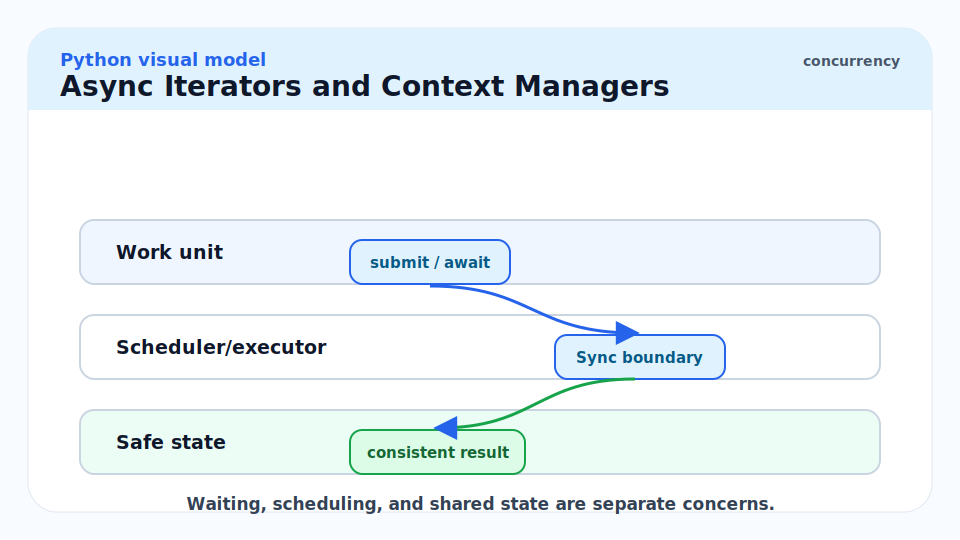

`async for` and `async with` work with objects that return coroutines from `__anext__`/`__aenter__`/`__aexit__`.

```python
import asyncio
from collections.abc import AsyncGenerator


async def async_range(n: int) -> AsyncGenerator[int, None]:
    """Async generator yielding 0..n-1 with a small delay each."""
    for i in range(n):
        await asyncio.sleep(0)
        yield i


async def main() -> None:
    async for value in async_range(5):
        print(value)


asyncio.run(main())
```

## Mixing Blocking and Async Code

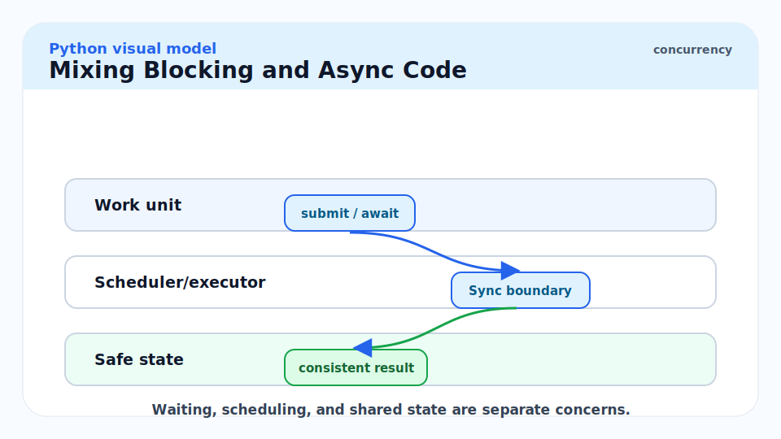

Blocking calls (legacy DB drivers, CPU-bound computation, `requests`, file I/O without `aiofiles`) must be run in an executor to avoid blocking the event loop.

```python
import asyncio
import time
from concurrent.futures import ThreadPoolExecutor


def blocking_io(n: int) -> int:
    """Simulates a blocking I/O call (e.g. legacy requests library)."""
    time.sleep(n * 0.1)
    return n * 2


async def main() -> None:
    loop = asyncio.get_event_loop()
    with ThreadPoolExecutor(max_workers=4) as pool:
        # run_in_executor returns a Future; await it like any coroutine
        results = await asyncio.gather(*[
            loop.run_in_executor(pool, blocking_io, i)
            for i in range(5)
        ])
    print(results)  # >>> [0, 2, 4, 6, 8]


asyncio.run(main())
```

## Real-world Example

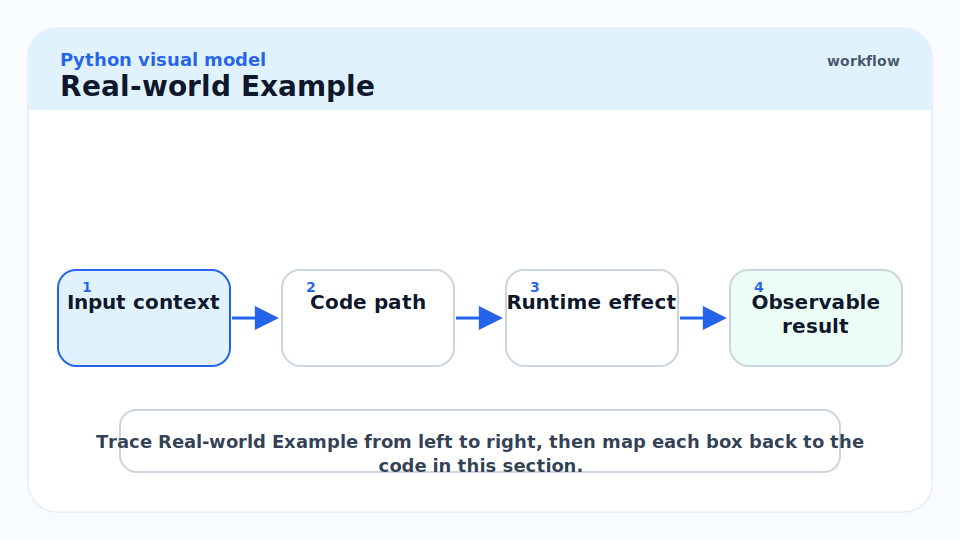

An async HTTP fanout with rate limiting, timeout, and structured error handling — the kind of pattern used in a microservice that aggregates multiple upstream APIs.

```python
from __future__ import annotations

import asyncio
import logging
from dataclasses import dataclass, field
from typing import Any

logger = logging.getLogger(__name__)


@dataclass
class FetchResult:
    url: str
    status: int = 0
    data: dict[str, Any] = field(default_factory=dict)
    error: str | None = None


async def fetch_with_timeout(
    url: str,
    semaphore: asyncio.Semaphore,
    timeout: float = 5.0,
) -> FetchResult:
    """Fetch URL with concurrency limiting and timeout."""
    import json
    import urllib.request

    async with semaphore:
        loop = asyncio.get_event_loop()
        try:
            raw = await asyncio.wait_for(
                loop.run_in_executor(None, lambda: urllib.request.urlopen(url).read()),
                timeout=timeout,
            )
            return FetchResult(url=url, status=200, data=json.loads(raw))
        except asyncio.TimeoutError:
            return FetchResult(url=url, error=f"timeout after {timeout}s")
        except Exception as exc:
            return FetchResult(url=url, error=str(exc))


async def fanout(urls: list[str], max_concurrency: int = 10) -> list[FetchResult]:
    """Fetch all URLs concurrently, at most max_concurrency at a time."""
    semaphore = asyncio.Semaphore(max_concurrency)
    async with asyncio.TaskGroup() as tg:
        tasks = [
            tg.create_task(fetch_with_timeout(url, semaphore))
            for url in urls
        ]
    return [task.result() for task in tasks]


if __name__ == "__main__":
    urls = [f"https://httpbin.org/get?n={i}" for i in range(5)]
    results = asyncio.run(fanout(urls))
    for r in results:
        print(r.url, r.error or r.status)
```

> [!NOTE]
> `asyncio.Semaphore` limits concurrency at the coroutine level — at most `max_concurrency` coroutines are inside the `async with semaphore:` block at any time. This is the standard rate-limiting pattern for fanout requests to protect a downstream service from overload.

## In Practice

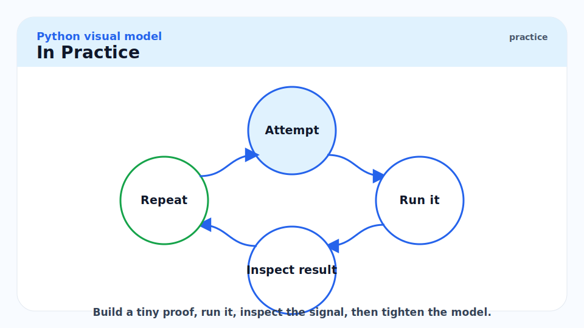

**`asyncio.run()` is the correct entry point.** It creates a new event loop, runs the coroutine, closes the loop. Never call `loop.run_until_complete` and `loop.close` manually in application code.

**Debug mode exposes slow callbacks.** Set `PYTHONASYNCIODEBUG=1` or `asyncio.run(main(), debug=True)`. The event loop warns about callbacks that take more than 100ms — a sign that blocking code is on the event loop thread.

**`asyncio.shield` protects a coroutine from cancellation.** `result = await asyncio.shield(coro)` — if the outer task is cancelled, `coro` continues running (useful for cleanup work that must complete even if the request is cancelled). Use sparingly.

> [!CAUTION]
> **Never call blocking code on the event loop thread.** `time.sleep`, `requests.get`, `open(...).read()` for large files, CPU-intensive loops — all block the event loop, preventing every other coroutine from running. The symptom is high latency and low throughput even under modest load. Profile with `aiomonitor` or check for the `slow callback detected` warning in debug mode.

## Pitfalls

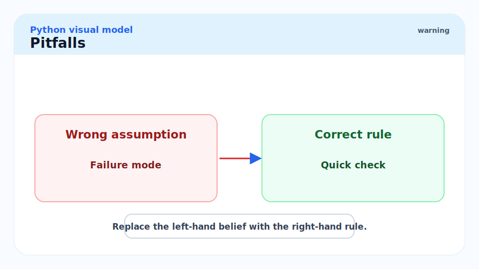

- **"asyncio is faster than threads for all I/O."** — For very short-lived I/O (e.g. Redis GET in a tight loop), thread-switching overhead is negligible and threads may perform similarly. For high-concurrency, long-wait I/O (1000+ simultaneous HTTP requests), asyncio wins significantly.
- **"Calling `asyncio.run` inside an existing event loop."** — This raises `RuntimeError: This event loop is already running`. In Jupyter notebooks (which run their own event loop), use `nest_asyncio.apply()` or `await` directly.
- **"Swallowing `CancelledError`."** — Breaks structured cancellation and causes tasks that awaited the cancellation to hang forever. Always re-raise.
- **"Forgetting `asyncio.create_task` and using `await coro` in a loop."** — `await coro1; await coro2` is sequential. `asyncio.create_task(coro1); asyncio.create_task(coro2)` runs them concurrently. The difference is whether you start coro2 before coro1 finishes.
- **"Thread-safety in async code."** — Asyncio is single-threaded within the event loop. You do not need locks for shared state among coroutines — only between coroutines and actual threads (e.g. callbacks from `run_in_executor`). Use `asyncio.Lock` for mutual exclusion between coroutines.

## Exercises

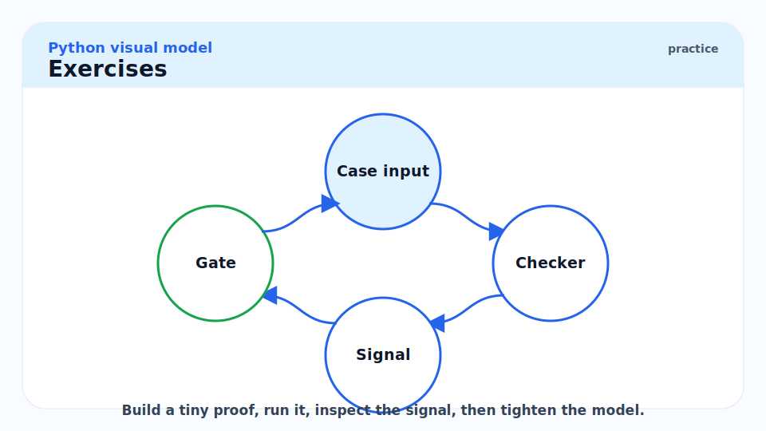

### Exercise 1 — Sequential vs concurrent

Explain why the following takes ~3 seconds instead of ~1 second.

```python
import asyncio

async def slow() -> int:
    await asyncio.sleep(1)
    return 42

async def main() -> None:
    a = await slow()
    b = await slow()
    c = await slow()
    print(a, b, c)

asyncio.run(main())
```

#### Solution

The three `await slow()` calls are sequential. Each `await` waits for the previous coroutine to complete before the next one starts. Total time: 1s + 1s + 1s = 3s.

To run them concurrently, create tasks before awaiting:

```python
async def main() -> None:
    t1 = asyncio.create_task(slow())
    t2 = asyncio.create_task(slow())
    t3 = asyncio.create_task(slow())
    a, b, c = await t1, await t2, await t3
    print(a, b, c)
```

Or use `TaskGroup`:

```python
async def main() -> None:
    async with asyncio.TaskGroup() as tg:
        t1 = tg.create_task(slow())
        t2 = tg.create_task(slow())
        t3 = tg.create_task(slow())
    print(t1.result(), t2.result(), t3.result())
```

Both run in ~1 second because all three sleeps overlap.

---

### Exercise 2 — Producer-consumer with `asyncio.Queue`

Write an async producer-consumer using `asyncio.Queue`.

#### Solution

```python
import asyncio
import random


async def producer(queue: asyncio.Queue[int], n: int) -> None:
    for i in range(n):
        await asyncio.sleep(random.uniform(0.01, 0.1))
        await queue.put(i)
        print(f"Produced {i}")
    await queue.put(-1)  # sentinel


async def consumer(queue: asyncio.Queue[int]) -> None:
    while True:
        item = await queue.get()
        if item == -1:
            queue.task_done()
            break
        print(f"Consumed {item}")
        await asyncio.sleep(0.05)
        queue.task_done()


async def main() -> None:
    q: asyncio.Queue[int] = asyncio.Queue(maxsize=3)
    async with asyncio.TaskGroup() as tg:
        tg.create_task(producer(q, 6))
        tg.create_task(consumer(q))


asyncio.run(main())
```

`asyncio.Queue` provides backpressure via `maxsize`: the producer blocks at `put` when the queue is full, preventing unbounded memory growth.

---

### Exercise 3 — `run_in_executor` for blocking calls

Write an async function that uses `run_in_executor` to call a blocking function without blocking the event loop.

#### Solution

```python
import asyncio
import time


def compute_hash(data: bytes) -> str:
    """CPU-bound: compute SHA-256 hash. Blocks for a while."""
    import hashlib
    time.sleep(0.01)  # simulate CPU work
    return hashlib.sha256(data).hexdigest()


async def async_compute_hash(data: bytes) -> str:
    """Run the blocking hash computation in a thread pool."""
    loop = asyncio.get_running_loop()
    return await loop.run_in_executor(None, compute_hash, data)


async def main() -> None:
    results = await asyncio.gather(*[
        async_compute_hash(f"data-{i}".encode())
        for i in range(10)
    ])
    print(results[0][:16], "...")


asyncio.run(main())
```

`run_in_executor(None, ...)` uses the default `ThreadPoolExecutor`. The event loop continues processing other coroutines while the thread runs `compute_hash`. Pass a `ProcessPoolExecutor` as the first argument for CPU-heavy work that would benefit from true parallelism.

## Sources

- Python `asyncio` documentation — https://docs.python.org/3/library/asyncio.html
- PEP 492 — Coroutines with `async` and `await` — https://peps.python.org/pep-0492/
- PEP 525 — Asynchronous Generators — https://peps.python.org/pep-0525/
- PEP 654 — Exception Groups and `except*` — https://peps.python.org/pep-0654/
- Python 3.11 "What's New" — TaskGroup — https://docs.python.org/3/whatsnew/3.11.html
- Yury Selivanov, "async/await in Python 3.5" (PyCon 2015) — https://www.youtube.com/watch?v=m28fiN9y_r8
- Ramalho, L. *Fluent Python* (2nd ed., 2022). Chapters 19–21.

## Related

- [3 - Iterables, Iterators, and Generators](./3-iterables-iterators-and-generators.md)
- [7 - Exceptions and Context Managers](./7-exceptions-and-context-managers.md)
- [8 - The GIL, Threads, Multiprocessing](./8-the-gil-threads-multiprocessing.md)
- [12 - Building Production Services in Python](./12-building-production-services-in-python.md)
