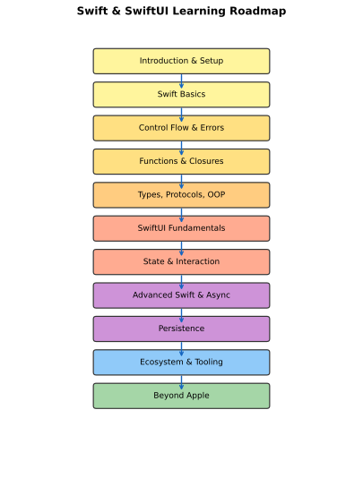
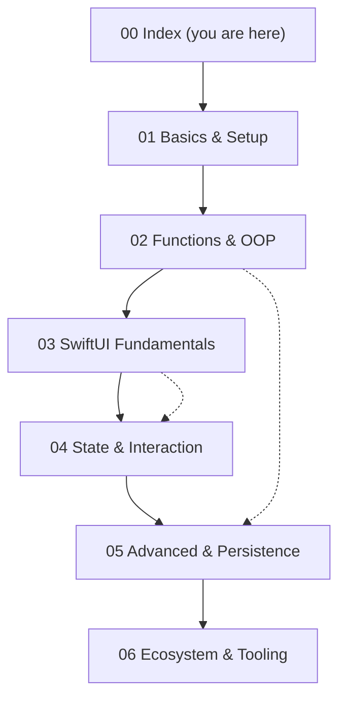

# Swift & SwiftUI — Study Index

[toc]

> **TL;DR:** This index maps the full [roadmap.sh Swift & SwiftUI](https://roadmap.sh/swift-ui) path to six study notes in this folder. Read them in order (01 → 06) for a first pass, then use the topic table below to jump back to any concept.



## Vocabulary

- **Study note** — one self-contained Markdown file in this folder (`01`–`06`) covering a roadmap tier.
- **Roadmap tier** — a grouped set of topics from roadmap.sh (basics → SwiftUI → advanced → ecosystem).
- **Cross-link** — wikilink (`[[note-slug]]`) or relative path to another note in the vault.
- **Prerequisite chain** — recommended reading order; later notes assume earlier ones.

## How to use this index

Work through the notes top to bottom on a first read. Each note has its own `[toc]`, runnable Swift examples, SVG diagrams, pitfalls, and `## Related` links. When you need a refresher on one topic — optionals, `@State`, actors, SPM — jump straight to the row in the table below instead of rereading everything.



## Note catalog

| # | Note | Read when you need… |
| :---: | :--- | :--- |
| 01 | [[01-language-basics-and-setup]] | Intro, install, types, optionals, operators, control flow, errors |
| 02 | [[02-functions-types-and-oop]] | Functions, closures, enums, protocols, generics, structs/classes |
| 03 | [[03-swiftui-fundamentals]] | SwiftUI vs UIKit, views, layout, modifiers, navigation |
| 04 | [[04-swiftui-state-and-interaction]] | `@State`, `@Observable`, animations, gestures, accessibility |
| 05 | [[05-advanced-swift-and-persistence]] | ARC, async/await, actors, SwiftData, Core Data, files |
| 06 | [[06-ecosystem-and-tooling]] | SPM, testing, logging, MVVM, Vapor, networking, Linux/server |

### Short blurbs

- **[01 Language Basics and Setup](./01-language-basics-and-setup.md)** — Why Swift exists, toolchain setup, `let`/`var`, type system, operators, `switch`, `throws`/`catch`.
- **[02 Functions, Types, and OOP](./02-functions-types-and-oop.md)** — First-class functions, trailing closures, protocol-oriented design, value vs reference types.
- **[03 SwiftUI Fundamentals](./03-swiftui-fundamentals.md)** — Declarative UI, `App`/`Scene`, stacks, lists, `#Preview`.
- **[04 SwiftUI State and Interaction](./04-swiftui-state-and-interaction.md)** — Data flow, property wrappers, motion, gestures, localization.
- **[05 Advanced Swift and Persistence](./05-advanced-swift-and-persistence.md)** — Memory, concurrency, persistence stack from `@AppStorage` to SwiftData.
- **[06 Ecosystem and Tooling](./06-ecosystem-and-tooling.md)** — Packages, tests, architecture, server Swift, cross-platform SDKs.

## Roadmap coverage audit

Complete audit of every clickable node on **[roadmap.sh/swift-ui](https://roadmap.sh/swift-ui)**. All **156 topics** are covered across notes 01–06 (verified 2026-06-16 against the [official content tree](https://github.com/kamranahmedse/developer-roadmap/tree/master/src/data/roadmaps/swift-ui/content)).

#### Introduction & Setup (6 topics)

| Topic | Note |
| :--- | :--- |
| Introduction | [[01-language-basics-and-setup]] |
| What Is Swift | [[01-language-basics-and-setup]] |
| Why Use Swift | [[01-language-basics-and-setup]] |
| Swift Vs Objective C | [[01-language-basics-and-setup]] |
| Where Swift Is Used | [[01-language-basics-and-setup]] |
| Installing Swift | [[01-language-basics-and-setup]] |

#### Swift Basics (20 topics)

| Topic | Note |
| :--- | :--- |
| Constants / Variables | [[01-language-basics-and-setup]] |
| Type Annotations | [[01-language-basics-and-setup]] |
| Print / String Interpolation | [[01-language-basics-and-setup]] |
| Comments | [[01-language-basics-and-setup]] |
| Semicolons | [[01-language-basics-and-setup]] |
| Integers | [[01-language-basics-and-setup]] |
| Booleans | [[01-language-basics-and-setup]] |
| Floats / Doubles | [[01-language-basics-and-setup]] |
| Optionals / Nil | [[01-language-basics-and-setup]] |
| Strings | [[01-language-basics-and-setup]] |
| Tuples | [[01-language-basics-and-setup]] |
| Type Safety | [[01-language-basics-and-setup]] |
| Type Inference | [[01-language-basics-and-setup]] |
| Type Casting | [[01-language-basics-and-setup]] |
| Memory Safety | [[01-language-basics-and-setup]] |
| Operators | [[01-language-basics-and-setup]] |
| Arithmetic | [[01-language-basics-and-setup]] |
| Comparison | [[01-language-basics-and-setup]] |
| Logical | [[01-language-basics-and-setup]] |
| Nil Coalescing | [[01-language-basics-and-setup]] |

#### Control Flow (7 topics)

| Topic | Note |
| :--- | :--- |
| If / Else | [[01-language-basics-and-setup]] |
| Switch / Case | [[01-language-basics-and-setup]] |
| Loops | [[01-language-basics-and-setup]] |
| For | [[01-language-basics-and-setup]] |
| While | [[01-language-basics-and-setup]] |
| Repeat-while | [[01-language-basics-and-setup]] |
| Continue / Break | [[01-language-basics-and-setup]] |

#### Error Handling (4 topics)

| Topic | Note |
| :--- | :--- |
| Error Handling | [[01-language-basics-and-setup]] |
| Throwing | [[01-language-basics-and-setup]] |
| Catching | [[01-language-basics-and-setup]] |
| Propagating | [[01-language-basics-and-setup]] |

#### Functions & Closures (7 topics)

| Topic | Note |
| :--- | :--- |
| Basic Functions | [[02-functions-types-and-oop]] |
| Parameters | [[02-functions-types-and-oop]] |
| Return Types | [[02-functions-types-and-oop]] |
| Function Types | [[02-functions-types-and-oop]] |
| Nested Functions | [[02-functions-types-and-oop]] |
| Closures | [[02-functions-types-and-oop]] |
| Trailing Closures | [[02-functions-types-and-oop]] |

#### Swift Core Types (1 topic)

| Topic | Note |
| :--- | :--- |
| Enumerations | [[02-functions-types-and-oop]] |

#### Protocols & Generics (2 topics)

| Topic | Note |
| :--- | :--- |
| Protocols | [[02-functions-types-and-oop]] |
| Generics | [[02-functions-types-and-oop]] |

#### Structures & Classes (12 topics)

| Topic | Note |
| :--- | :--- |
| Structures / Classes | [[02-functions-types-and-oop]] |
| Properties | [[02-functions-types-and-oop]] |
| Stored | [[02-functions-types-and-oop]] |
| Computed | [[02-functions-types-and-oop]] |
| Observers | [[02-functions-types-and-oop]] |
| Wrappers | [[02-functions-types-and-oop]] |
| Methods | [[02-functions-types-and-oop]] |
| Initialization | [[02-functions-types-and-oop]] |
| Inheritance | [[02-functions-types-and-oop]] |
| Subscripts | [[02-functions-types-and-oop]] |
| Extensions | [[02-functions-types-and-oop]] |
| Optional Chaining | [[02-functions-types-and-oop]] |

#### SwiftUI Intro (4 topics)

| Topic | Note |
| :--- | :--- |
| What Is SwiftUI | [[03-swiftui-fundamentals]] |
| UIKit Vs SwiftUI | [[03-swiftui-fundamentals]] |
| App Lifecycle | [[03-swiftui-fundamentals]] |
| Views | [[03-swiftui-fundamentals]] |

#### View Modifiers (5 topics)

| Topic | Note |
| :--- | :--- |
| Font | [[03-swiftui-fundamentals]] |
| Padding | [[03-swiftui-fundamentals]] |
| Background | [[03-swiftui-fundamentals]] |
| ClipShape | [[03-swiftui-fundamentals]] |
| ViewBuilder | [[03-swiftui-fundamentals]] |

#### Navigation Views (4 topics)

| Topic | Note |
| :--- | :--- |
| NavigationStack | [[03-swiftui-fundamentals]] |
| NavigationPath | [[03-swiftui-fundamentals]] |
| TabView | [[03-swiftui-fundamentals]] |
| NavigationLink | [[03-swiftui-fundamentals]] |

#### Layout Views (5 topics)

| Topic | Note |
| :--- | :--- |
| HStack | [[03-swiftui-fundamentals]] |
| VStack | [[03-swiftui-fundamentals]] |
| ZStack | [[03-swiftui-fundamentals]] |
| Grid | [[03-swiftui-fundamentals]] |
| GeometryReader | [[03-swiftui-fundamentals]] |

#### Basic Views (5 topics)

| Topic | Note |
| :--- | :--- |
| Text | [[03-swiftui-fundamentals]] |
| Image | [[03-swiftui-fundamentals]] |
| Button | [[03-swiftui-fundamentals]] |
| List | [[03-swiftui-fundamentals]] |
| Form | [[03-swiftui-fundamentals]] |

#### Data Flow & State (6 topics)

| Topic | Note |
| :--- | :--- |
| Data Flow | [[04-swiftui-state-and-interaction]] |
| @State | [[04-swiftui-state-and-interaction]] |
| @Binding | [[04-swiftui-state-and-interaction]] |
| @StateObject | [[04-swiftui-state-and-interaction]] |
| @ObservedObject | [[04-swiftui-state-and-interaction]] |
| @EnvironmentObject | [[04-swiftui-state-and-interaction]] |

#### Animations (5 topics)

| Topic | Note |
| :--- | :--- |
| Animations | [[04-swiftui-state-and-interaction]] |
| Implicit Animations | [[04-swiftui-state-and-interaction]] |
| Explicit Animations | [[04-swiftui-state-and-interaction]] |
| Transitions | [[04-swiftui-state-and-interaction]] |
| Animatable Protocol | [[04-swiftui-state-and-interaction]] |

#### User Interaction (6 topics)

| Topic | Note |
| :--- | :--- |
| User Interaction | [[04-swiftui-state-and-interaction]] |
| UI Controls | [[04-swiftui-state-and-interaction]] |
| Gestures | [[04-swiftui-state-and-interaction]] |
| Drag & Drop | [[04-swiftui-state-and-interaction]] |
| Localization | [[04-swiftui-state-and-interaction]] |
| Accessibility | [[04-swiftui-state-and-interaction]] |

#### Advanced Language (4 topics)

| Topic | Note |
| :--- | :--- |
| Access Control | [[05-advanced-swift-and-persistence]] |
| ARC | [[05-advanced-swift-and-persistence]] |
| Result Builders | [[05-advanced-swift-and-persistence]] |
| Macros | [[05-advanced-swift-and-persistence]] |

#### Async Programming (7 topics)

| Topic | Note |
| :--- | :--- |
| Asynchronous Functions | [[05-advanced-swift-and-persistence]] |
| Asynchronous Sequences | [[05-advanced-swift-and-persistence]] |
| Tasks & Task Groups | [[05-advanced-swift-and-persistence]] |
| Unstructured Concurrency | [[05-advanced-swift-and-persistence]] |
| Actors | [[05-advanced-swift-and-persistence]] |
| Strict Concurrency Checking | [[05-advanced-swift-and-persistence]] |
| SwiftUI with async/await | [[05-advanced-swift-and-persistence]] |

#### Data Persistence (10 topics)

| Topic | Note |
| :--- | :--- |
| Data Persistence | [[05-advanced-swift-and-persistence]] |
| Databases | [[05-advanced-swift-and-persistence]] |
| Core Data | [[05-advanced-swift-and-persistence]] |
| SwiftData | [[05-advanced-swift-and-persistence]] |
| CloudKit | [[05-advanced-swift-and-persistence]] |
| Firebase | [[05-advanced-swift-and-persistence]] |
| Realm | [[05-advanced-swift-and-persistence]] |
| GRDB | [[05-advanced-swift-and-persistence]] |
| FileManager | [[05-advanced-swift-and-persistence]] |
| UserDefaults / AppStorage | [[05-advanced-swift-and-persistence]] |

#### Package Management (5 topics)

| Topic | Note |
| :--- | :--- |
| Swift Package Manager | [[06-ecosystem-and-tooling]] |
| Using Packages | [[06-ecosystem-and-tooling]] |
| Creating Packages | [[06-ecosystem-and-tooling]] |
| Plugins | [[06-ecosystem-and-tooling]] |
| Swift Package Index | [[06-ecosystem-and-tooling]] |

#### Testing (3 topics)

| Topic | Note |
| :--- | :--- |
| Testing | [[06-ecosystem-and-tooling]] |
| Swift Testing | [[06-ecosystem-and-tooling]] |
| XCTest | [[06-ecosystem-and-tooling]] |

#### Logging & Debugging (5 topics)

| Topic | Note |
| :--- | :--- |
| Logging / Debugging | [[06-ecosystem-and-tooling]] |
| Xcode Debugging | [[06-ecosystem-and-tooling]] |
| swift-log | [[06-ecosystem-and-tooling]] |
| SwiftUI Inspector | [[06-ecosystem-and-tooling]] |
| CocoaLumberjack | [[06-ecosystem-and-tooling]] |

#### IDEs (5 topics)

| Topic | Note |
| :--- | :--- |
| IDEs | [[06-ecosystem-and-tooling]] |
| Xcode | [[06-ecosystem-and-tooling]] |
| VS Code | [[06-ecosystem-and-tooling]] |
| Emacs | [[06-ecosystem-and-tooling]] |
| Neovim | [[06-ecosystem-and-tooling]] |

#### App Architecture (4 topics)

| Topic | Note |
| :--- | :--- |
| App Architecture | [[06-ecosystem-and-tooling]] |
| MVVM | [[06-ecosystem-and-tooling]] |
| Clean Architecture | [[06-ecosystem-and-tooling]] |
| Dependency Injection | [[06-ecosystem-and-tooling]] |

#### Server Frameworks (4 topics)

| Topic | Note |
| :--- | :--- |
| Server Frameworks | [[06-ecosystem-and-tooling]] |
| Vapor | [[06-ecosystem-and-tooling]] |
| Hummingbird | [[06-ecosystem-and-tooling]] |
| MongoKitten | [[06-ecosystem-and-tooling]] |

#### Networking Libraries (4 topics)

| Topic | Note |
| :--- | :--- |
| Networking Libraries | [[06-ecosystem-and-tooling]] |
| Alamofire | [[06-ecosystem-and-tooling]] |
| swift-nio | [[06-ecosystem-and-tooling]] |
| Moya | [[06-ecosystem-and-tooling]] |

#### More Tools (3 topics)

| Topic | Note |
| :--- | :--- |
| DocC | [[06-ecosystem-and-tooling]] |
| Swift Charts | [[06-ecosystem-and-tooling]] |
| Swift Playgrounds | [[06-ecosystem-and-tooling]] |

#### Beyond Apple (3 topics)

| Topic | Note |
| :--- | :--- |
| Static Linux SDK | [[06-ecosystem-and-tooling]] |
| SDKs for Wasm | [[06-ecosystem-and-tooling]] |
| Swift for Server Apps | [[06-ecosystem-and-tooling]] |

**Total: 156 / 156 topics mapped.**

## Roadmap topic map (summary)

| Roadmap section | Primary note |
| :--- | :--- |
| Introduction, Installing Swift | 01 |
| Swift Basics, Type System, Operators | 01 |
| Control Flow, Error Handling | 01 |
| Functions & Closures | 02 |
| Enumerations, Protocols, Generics | 02 |
| Structures & Classes | 02 |
| What is SwiftUI, App lifecycle, Views | 03 |
| Data Flow, State Management | 04 |
| Animations, User Interaction | 04 |
| Access Control, ARC, Result Builders, Macros | 05 |
| Async Programming | 05 |
| Data Persistence | 05 |
| Package Management, Testing, Logging | 06 |
| IDEs, App Architecture, Server, Networking | 06 |
| DocC, Swift Charts, Beyond Apple | 06 |

## Real-world example

A single file cannot cover the whole stack, but this skeleton shows *where* each note's concepts plug into a typical iOS app. Use it as a mental map before building something real.

```swift
import SwiftUI
import SwiftData   // Note 05 — persistence

@Model             // Note 05
final class Item {
    var title: String
    init(title: String) { self.title = title }
}

@Observable        // Note 04 — state
final class ItemStore {
    func validate(_ title: String) throws {   // Note 01 — errors
        guard !title.isEmpty else {
            throw ValidationError.empty
        }
    }
    enum ValidationError: Error { case empty }
}

@main              // Note 03 — app entry
struct RoadmapApp: App {
    var body: some Scene {
        WindowGroup {
            ItemListView()
        }
        .modelContainer(for: Item.self)
    }
}

struct ItemListView: View {
    @Query private var items: [Item]
    @State private var store = ItemStore()

    var body: some View {
        NavigationStack {
            List(items) { Text($0.title) }
                .navigationTitle("Roadmap Items")
        }
    }
}
```

After the language notes sink in, wire this up in Xcode with **File → New → Project → App**, enable SwiftData, and run on a simulator — that exercises notes 01, 03, 04, and 05 in one place. Note 06 covers how you'd extract modules with SPM and add tests.

## Suggested study paths

**iOS app developer (default):** 01 → 02 → 03 → 04 → 05 (persistence + async) → 06 (SPM + testing).

**Server / CLI only:** 01 → 02 → 05 (async) → 06 — skip 03–04 unless you touch SwiftUI admin tools.

**UIKit veteran:** 02 (protocols/OOP refresh) → 03 → 04 → 05.

## Progress checklist

- [ ] 01 — Can explain optionals, `guard`, and `do`/`catch`
- [ ] 02 — Can choose struct vs class and write a small protocol + extension
- [ ] 03 — Can build a navigable list + detail screen in SwiftUI
- [ ] 04 — Can explain `@State` vs `@Observable` vs `@Environment`
- [ ] 05 — Can fetch data with `async`/`await` and persist with SwiftData or files
- [ ] 06 — Can add an SPM dependency and run `swift test`

## Parallel notes (Python series)

Same vault, similar layout — useful when comparing language features:

| Swift note | Python analogue |
| :--- | :--- |
| 01 Basics | [Python Language Basics](../Python/01-language-basics.md) |
| 02 Functions & OOP | [Advanced Functions](../Python/03-advanced-functions.md), [OOP](../Python/05-oop.md) |
| 04 State / async UI | [Concurrency](../Python/09-concurrency.md) |
| 05 Persistence | [Relational Databases](../../Relational-Databases-and-Data-Modeling/) |
| 06 Tooling | [Packaging](../Python/07-packaging-and-environments.md), [Testing](../Python/11-testing-and-internals.md) |

## Sources

- [roadmap.sh — Swift & SwiftUI](https://roadmap.sh/swift-ui)
- [The Swift Programming Language](https://docs.swift.org/swift-book/documentation/the-swift-programming-language/)
- Conversation with user on 2026-06-16

## Related

- [[01-language-basics-and-setup]]
- [[02-functions-types-and-oop]]
- [[03-swiftui-fundamentals]]
- [[04-swiftui-state-and-interaction]]
- [[05-advanced-swift-and-persistence]]
- [[06-ecosystem-and-tooling]]
- [Python Language Basics](../Python/01-language-basics.md)
