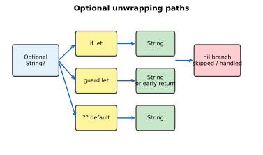
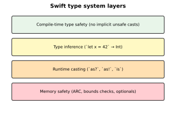
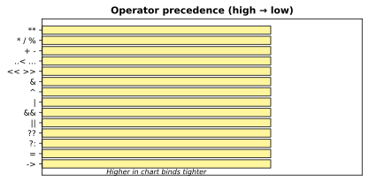
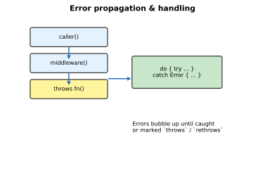

# Swift Language Basics and Setup

[toc]

> **TL;DR:** Swift is Apple's modern, memory-safe systems language for iOS, macOS, and beyond. This note covers why Swift exists, how to install it, the foundational syntax (constants, types, operators), control flow, and error handling — the first third of the Swift & SwiftUI roadmap.


## Introduction

> **TL;DR:** Swift replaces Objective-C as the primary Apple platform language while remaining interoperable with existing C/Obj-C codebases. It prioritizes safety, speed, and expressive syntax.

### Vocabulary

- **Swift** — a compiled, multi-paradigm language (2014) designed for Apple platforms and increasingly for server/Linux/Wasm targets.
- **Objective-C** — Apple's legacy language; Swift can call Obj-C APIs via bridging headers and `@objc`.
- **LLVM** — the compiler backend Swift uses; enables optimization and cross-platform toolchains.
- **Playground** — an interactive REPL-like environment in Xcode/Swift Playgrounds for rapid experimentation.
- **Swift Package Manager (SPM)** — built-in dependency and build tool (`Package.swift`).

### Intuition

Swift sits between high-level scripting ergonomics and low-level systems performance. Optionals eliminate null-pointer crashes, ARC handles memory without a garbage collector, and the type system catches many bugs at compile time. You write less boilerplate than Objective-C while keeping direct access to Apple frameworks.

### What is Swift?

Swift is a general-purpose language created by Apple, open-sourced in 2015. It compiles to native machine code, supports value and reference semantics, protocol-oriented design, and modern concurrency (`async`/`await`, actors).

### Why use Swift?

| Benefit | Detail |
| :--- | :--- |
| Safety | Optionals, bounds checks, exhaustive `switch`, `throws` errors |
| Performance | Near C speed; structs stack-allocated when possible |
| Interop | Calls C, Objective-C, and C++ (via Swift 5.9+ interop) |
| Tooling | First-class Xcode integration, SPM, DocC |
| Ecosystem | SwiftUI, SwiftData, Vapor, growing cross-platform support |

### Swift vs Objective-C

| Aspect | Swift | Objective-C |
| :--- | :--- | :--- |
| Syntax | Modern, concise | C + Smalltalk messaging `[obj method]` |
| Null safety | `Optional<T>` | `nil` on any object reference |
| Memory | ARC (same runtime) | ARC |
| Dynamic dispatch | `@objc`, `dynamic` when needed | Default for all methods |
| Learning curve | Gentler for newcomers | Steeper; legacy APIs |

### Where Swift is used

- **Apple platforms** — iOS, iPadOS, macOS, watchOS, tvOS, visionOS apps
- **Server** — Vapor, Hummingbird on Linux
- **Tooling** — CLI utilities, scripts (`swift run`)
- **Embedded / Wasm** — experimental SDKs expanding reach

### Installing Swift

On macOS, install **Xcode** from the App Store (includes Swift + SDKs). On Linux or for CLI-only work, use [swift.org downloads](https://www.swift.org/install/) or Homebrew:

```bash
# macOS — verify Xcode toolchain
xcode-select --install
swift --version

# Linux / standalone toolchain (example)
# curl -O https://download.swift.org/.../swift-6.x-RELEASE.tar.gz
```

```swift
// Quick sanity check — save as main.swift, run: swift main.swift
print("Swift \(#swift) ready")
```

### Real-world example

A minimal command-line tool that reads arguments and reports a greeting — the kind of first script every new Swift developer runs:

```swift
#!/usr/bin/env swift
import Foundation

let args = CommandLine.arguments.dropFirst()
let name = args.first ?? "World"
print("Hello, \(name)!")
```

Run with `chmod +x greet.swift && ./greet.swift Ada`.

## Constants, Variables, and Types

> **TL;DR:** `let` declares constants, `var` declares mutable bindings. Swift infers types when possible but accepts explicit annotations. Semicolons are optional; comments use `//` and `/* */`.

### Vocabulary

- **`let`** — immutable binding; the reference cannot be reassigned (value types may still mutate internal state if `var` fields).
- **`var`** — mutable binding.
- **Type annotation** — explicit type: `let count: Int = 0`.
- **Type inference** — compiler deduces type from initializer: `let count = 0` → `Int`.
- **Tuple** — lightweight grouping: `(code: 404, message: "Not Found")`.
- **Optional** — `T?` may hold a value or `nil`.

### Intuition

Think of `let` as the default — immutability makes concurrent and async code easier to reason about. Reach for `var` only when reassignment is required. Optionals force you to acknowledge absence instead of crashing on unexpected `nil`.



### Constants and variables

```swift
let pi = 3.14159          // inferred Double
var score = 0             // mutable Int
score += 10
// pi = 3.14              // error: cannot assign to 'let'
```

### Comments and semicolons

Swift uses `//` for line comments and `/* */` for blocks (no `#` comment syntax). Semicolons may separate statements on one line, but idiomatic Swift uses one statement per line — semicolons are almost never needed outside generated code.

```swift
// Line comment
/* Block comment
   spanning lines */

let x = 1; let y = 2   // legal; discouraged (roadmap: Semicolons)
```

### Type annotations and interpolation

```swift
let username: String = "ada"
let greeting = "Hello, \(username)! You have \(score) points."
print(greeting)
```

### Data types

```swift
let flag: Bool = true
let count: Int = 42
let ratio: Double = 0.5
let price: Float = 9.99

var maybeName: String? = nil
maybeName = "Grace"

let httpResult = (404, "Not Found")           // (Int, String)
let (code, message) = httpResult              // destructuring
```

### Type system

Swift enforces **type safety** at compile time: you cannot assign a `String` to an `Int` without an explicit conversion. **Type casting** uses `as?` (conditional), `as!` (forced), and `is` (check). **Memory safety** combines ARC, bounds-checked collections, and optionals.



```swift
let value: Any = "hello"
if let text = value as? String {
    print(text.uppercased())
}

let items: [Any] = [1, "two", 3.0]
for item in items {
    switch item {
    case let n as Int:    print("int \(n)")
    case let s as String: print("str \(s)")
    default:              break
    }
}
```

### Real-world example

Parsing optional JSON-like fields safely — the pattern every network client uses:

```swift
struct User {
    let id: Int
    let displayName: String
    let bio: String?
}

func parseUser(id: Int, name: String?, bio: String?) -> User? {
    guard let name, !name.isEmpty else { return nil }
    return User(id: id, displayName: name, bio: bio)
}

let user = parseUser(id: 1, name: "Ada", bio: nil)
print(user?.displayName ?? "unknown")
```

## Operators

> **TL;DR:** Swift provides arithmetic, comparison, logical, range, and nil-coalescing operators with predictable precedence. The nil-coalescing operator `??` is idiomatic for default values.



### Vocabulary

- **Nil-coalescing (`??`)** — `a ?? b` returns `a` if non-nil, else `b`.
- **Optional chaining (`?.`)** — short-circuits on `nil`: `user?.address?.city`.
- **Range operators** — `0..<5` (half-open), `0...5` (closed).

```swift
let a = 10, b = 3
print(a / b)              // 3 (Int division)
print(a % b)              // 1
print(a >= b && a < 100)  // true

let nickname: String? = nil
let label = nickname ?? "Guest"

let offset: Int? = 5
let index = (offset ?? 0) + 1
```

## Control Flow

> **TL;DR:** Conditionals use `if`, `guard`, and exhaustive `switch`. Loops include `for-in`, `while`, and `repeat-while`. `break` and `continue` affect the innermost loop or `switch`.


### if / else and guard

`guard` early-exits when a condition fails — preferred for validation at the top of functions:

```swift
func process(score: Int?) {
    guard let score, score >= 0 else {
        print("invalid score")
        return
    }
    print("Processing \(score)")
}
```

### switch

`switch` must be exhaustive — no fall-through by default:

```swift
let httpCode = 404
switch httpCode {
case 200...299:
    print("OK")
case 400, 401, 403, 404:
    print("Client error")
case 500...599:
    print("Server error")
default:
    print("Other")
}
```

### Loops

```swift
for i in 0..<3 { print(i) }

var n = 3
while n > 0 { n -= 1 }

repeat {
    print("at least once")
} while false

for (index, char) in "Swift".enumerated() {
    if char == "i" { continue }
    print(index, char)
}
```

### Real-world example

Retry loop with exponential backoff — common in networking clients:

```swift
func fetchWithRetry(maxAttempts: Int = 3) async throws -> Data {
    var attempt = 0
    var delay: UInt64 = 1_000_000_000 // 1s in nanoseconds

    while attempt < maxAttempts {
        do {
            let (data, _) = try await URLSession.shared.data(from: URL(string: "https://api.example.com")!)
            return data
        } catch {
            attempt += 1
            if attempt >= maxAttempts { throw error }
            try await Task.sleep(nanoseconds: delay)
            delay *= 2
        }
    }
    fatalError("unreachable")
}
```

## Error Handling

> **TL;DR:** Swift models recoverable errors as types conforming to `Error`. Functions mark failure with `throws`; callers use `try`, `try?`, or `try!`, and handle with `do-catch` or propagate upward.



### Vocabulary

- **`Error` protocol** — marker for typed errors (`enum`, `struct`).
- **`throws`** — function may propagate an error.
- **`throw`** — exit with an error value.
- **`do-catch`** — handle errors locally.
- **`Result<Success, Failure>`** — enum wrapping success or failure without throwing.

```swift
enum FileError: Error {
    case notFound
    case unreadable
}

func loadConfig() throws -> [String: String] {
    throw FileError.notFound
}

do {
    let config = try loadConfig()
    print(config)
} catch FileError.notFound {
    print("Config missing — using defaults")
} catch {
    print("Unexpected: \(error)")
}
```

### Propagating errors

```swift
func loadAndParse() throws -> [String: String] {
    let config = try loadConfig()   // rethrows upward
    return config
}
```

### Real-world example

Validation errors in a registration form:

```swift
enum ValidationError: Error, LocalizedError {
    case emptyEmail
    case weakPassword

    var errorDescription: String? {
        switch self {
        case .emptyEmail:   return "Email is required."
        case .weakPassword: return "Password must be at least 8 characters."
        }
    }
}

func validate(email: String, password: String) throws {
    guard !email.isEmpty else { throw ValidationError.emptyEmail }
    guard password.count >= 8 else { throw ValidationError.weakPassword }
}
```

## In practice

- Prefer `let` unless mutation is required; Swift idioms favor immutability.
- Use `guard let` for early exits; nest fewer `if let` pyramids.
- Avoid `try!` and `as!` in production paths — they trap on failure.
- Run `swift-format` or Xcode's formatter for consistent style.
- Use Swift Playgrounds or `#Preview` macros for rapid UI experiments (covered in later notes).

## Pitfalls

- **Force-unwrapping (`!`)** — crashes if value is `nil`; use only when logically impossible to fail.
- **Integer division** — `5 / 2` is `2`, not `2.5`; cast to `Double` first.
- **`switch` exhaustiveness** — forgetting `default` on non-enum types or `@unknown default` for frozen enums breaks forward compatibility.
- **Optional comparison** — `optional == nil` works, but comparing two optionals requires both to be unwrapped or use `==` on optional-wrapped equatables.

## Sources

- [The Swift Programming Language (TSPL)](https://docs.swift.org/swift-book/documentation/the-swift-programming-language/)
- [Swift.org — Install](https://www.swift.org/install/)
- [roadmap.sh — Swift & SwiftUI](https://roadmap.sh/swift-ui)
- Conversation with user on 2026-06-16

## Related

- [[00-swift-swiftui-index]]
- [[02-functions-types-and-oop]]
- [Python Language Basics](../Python/01-language-basics.md)
- [02 Functions, Types, and OOP](./02-functions-types-and-oop.md)
