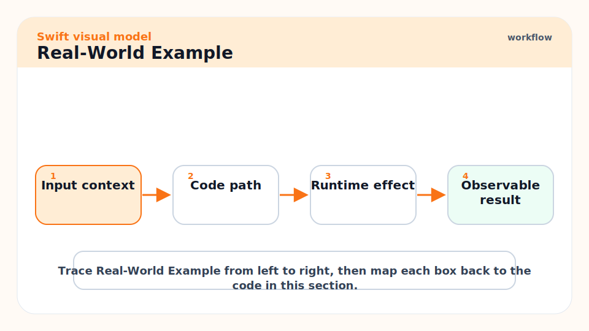
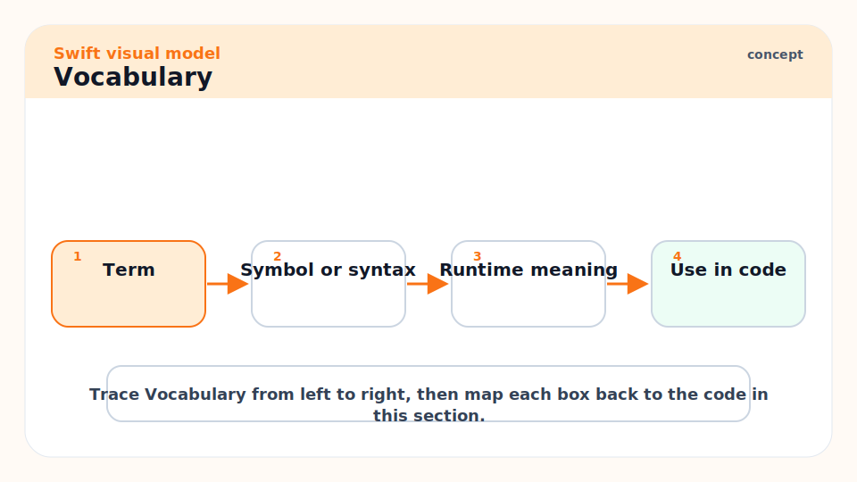
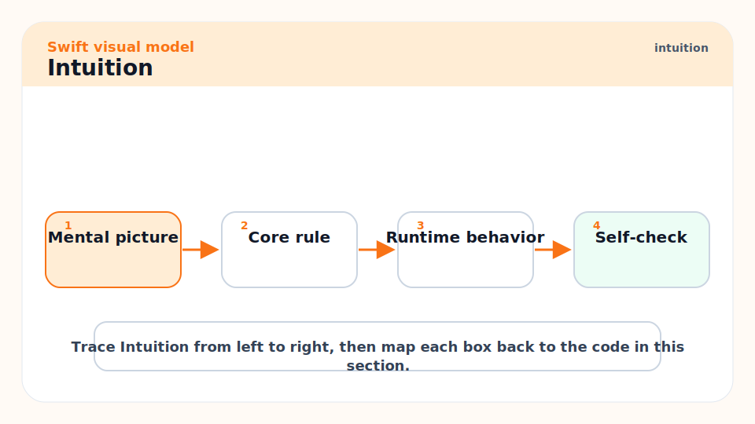
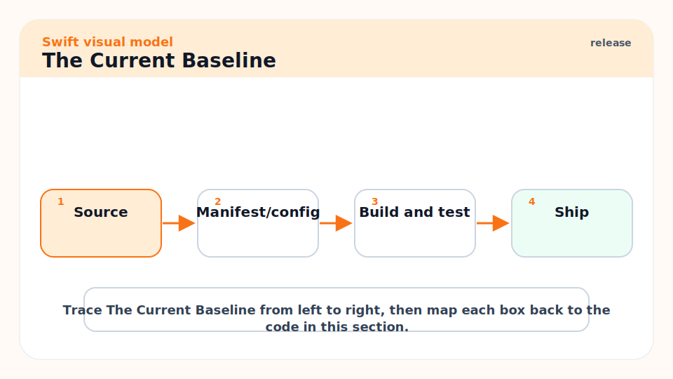
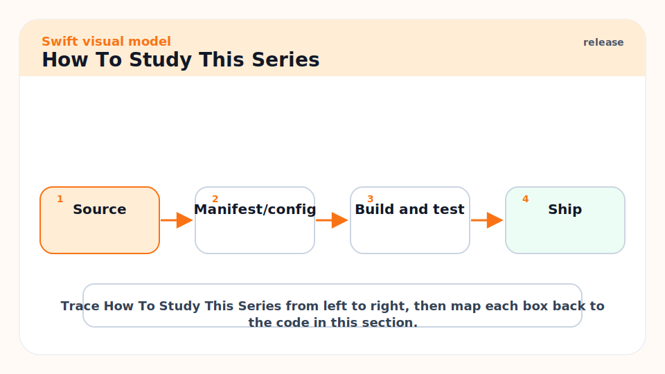
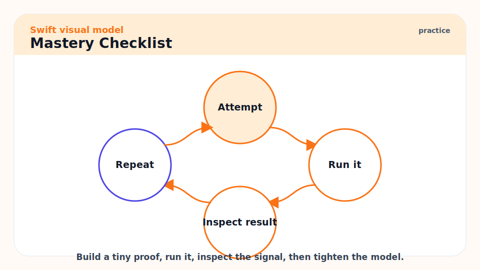
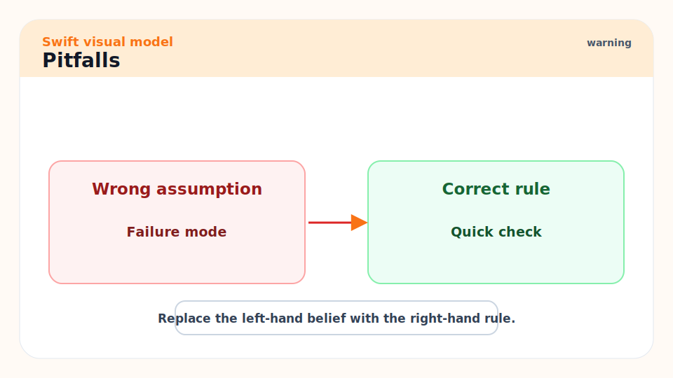
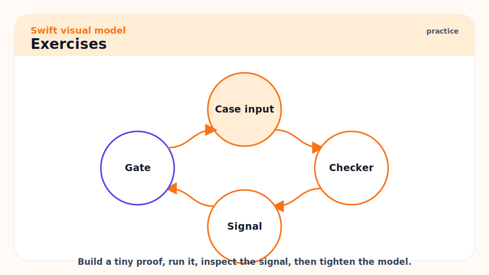

# 01 - Swift Mastery Map and Current Toolchain

[toc]

> **TL;DR:** Swift is a compiled, statically typed language built around safety, performance, and expressiveness across Apple apps, server programs, command-line tools, embedded systems, and increasingly cross-platform targets. This series starts with the mental model, then builds through syntax, value semantics, ARC, generics, concurrency, tooling, testing, shipping, and senior-level design judgment.

## Real-World Example



The fastest way to feel Swift is to run a tiny program through the command-line toolchain. This example uses only the standard library, so it works before you learn Xcode, SwiftUI, or server frameworks.

```swift
struct Greeting {
    let name: String

    func message() -> String {
        "Hello, \(name). Swift is compiled, typed, and expressive."
    }
}

let greeting = Greeting(name: "Pat")
print(greeting.message())
```

Save the file as `hello.swift`, then run it with the Swift driver. The same `swift` command is also the front door to the package manager, compiler, test runner, and REPL-oriented workflows.

```bash
swift hello.swift
swift --version
swift package init --type executable
swift run
swift test
```

## Vocabulary



**Swift driver**: The `swift` command-line entry point. It can run scripts, compile files, invoke SwiftPM, and report the installed compiler version.

---

**Swift compiler**: The tool that type-checks Swift source and emits optimized native code through LLVM. Most "Swift is safe" behavior starts in compile-time checking.

---

**Swift Package Manager**: Usually shortened to SwiftPM. The standard build, dependency, and package tool for command-line tools, libraries, and server applications.

---

**Xcode**: Apple's IDE for iOS, macOS, watchOS, tvOS, and visionOS apps. It wraps the same language but adds project management, signing, simulators, previews, asset catalogs, and app distribution workflows.

---

**Swift language mode**: The source-compatibility and diagnostic mode a target compiles under. Swift 6 language mode matters because full data-race safety checking becomes part of the contract.

---

**Toolchain**: A concrete compiler, standard library, debugger, and package-manager release. On 2026-06-07, Swift.org advertises the 6.3 line, and Swift Forums announced Swift 6.3.2 on 2026-05-13.

## Intuition



Think of Swift as a language trying to occupy the space between Python ergonomics, Rust-like safety aspirations, and C-family performance. It is not a garbage-collected scripting language. It is also not a manual-memory C replacement where every pointer is your problem. Swift's normal path is: express the model clearly, let the type system prove as much as it can, and use explicit unsafe APIs only at the boundary.

The most important early distinction is value types versus reference types. Structs, enums, and tuples behave like values. Classes behave like references managed by ARC. This single distinction explains most Swift design choices: why arrays feel cheap to pass around, why retain cycles happen, why `mutating` exists, why protocols can be powerful, and why actor isolation matters.

```mermaid
flowchart LR
    A["01 map and toolchain"] --> B["02 syntax and optionals"]
    B --> C["03 functions, closures, errors"]
    C --> D["04 types and protocols"]
    D --> E["05 generics and API design"]
    E --> F["06 memory and ARC"]
    F --> G["07 concurrency"]
    G --> H["08 SwiftPM, tests, shipping"]
    H --> I["09 Apple app distribution"]
    I --> J["10 senior-level Swift"]
```



## The Current Baseline



For learning, use Swift 6.3 or newer unless you are maintaining an older codebase. Swift 6 introduced data-race safety as a central language-mode feature. Swift 6.2 improved approachable concurrency and safe systems programming APIs such as `InlineArray` and `Span`. Swift 6.3 expanded C interoperability, cross-platform build tooling, embedded Swift, Swift Testing, DocC, and official Android SDK support.

This matters because many old tutorials teach Swift as "iOS syntax plus UIKit." That is too narrow. Modern Swift is a language for:

| Domain | Typical stack | What to learn |
| :--- | :--- | :--- |
| iOS/macOS apps | SwiftUI, UIKit, AppKit, Xcode | State, lifecycle, signing, app distribution |
| Command-line tools | SwiftPM, ArgumentParser | Packages, file IO, subprocesses, release builds |
| Server apps | SwiftPM, Vapor, Hummingbird, NIO | Linux builds, async IO, observability, containers |
| Libraries | SwiftPM, DocC, semantic versioning | API design, generics, package boundaries |
| Low-level systems | Unsafe APIs, C interop, Embedded Swift | memory layout, ownership, performance profiling |

## How To Study This Series



Read each note in order first. Do not try to memorize every keyword. Instead, build a mental dependency graph:

1. Syntax teaches the surface.
2. Types teach what the compiler can prove.
3. Value semantics teach why Swift APIs look the way they do.
4. ARC teaches why object graphs can leak.
5. Concurrency teaches how mutation is isolated.
6. Testing and shipping teach how code becomes a product.
7. Senior-level habits teach how to make maintainable Swift decisions.

## Mastery Checklist



You are becoming strong in Swift when you can do these without guessing:

- Explain why a type should be a `struct`, `class`, `actor`, or `enum`.
- Use optionals without scattering force unwraps.
- Design APIs whose call sites read clearly.
- Write generic code without hiding the simple model.
- Recognize ARC retain cycles before Instruments tells you.
- Know when copy-on-write is cheap and when mutation triggers copying.
- Use `async`, `await`, `Task`, actors, and `Sendable` without fighting the compiler.
- Build and test a SwiftPM package from the terminal.
- Archive, sign, upload, and release an Apple-platform app.
- Profile allocations and fix the measured bottleneck, not the imagined one.

## Pitfalls



- **Learning only SwiftUI syntax**: SwiftUI is important, but it sits on the language. Master value semantics, ARC, protocols, generics, and concurrency first.
- **Treating `let` as deep immutability**: `let` prevents rebinding the variable. It does not make every referenced object deeply immutable.
- **Using `class` by default**: Reach for `struct` and `enum` first. Use `class` when identity, inheritance, Objective-C interop, or reference sharing is the point.
- **Ignoring release mode**: Debug builds hide performance reality. Measure serious performance in release builds.
- **Fighting Swift 6 concurrency**: The compiler is forcing you to state ownership and isolation. Treat the errors as design feedback.

## Exercises



1. Install or verify Swift with `swift --version`.
2. Create an executable package with `swift package init --type executable`.
3. Run it with `swift run`.
4. Change `main.swift` to define a `struct` with one method and print its output.
5. Read the next note and rewrite the program using an optional input.

## Sources

- https://www.swift.org/blog/swift-6.3-released/
- https://forums.swift.org/t/announcing-swift-6-3-2/86698
- https://www.swift.org/blog/swift-6.2-released/
- https://www.swift.org/getting-started/
- https://docs.swift.org/swift-book/documentation/the-swift-programming-language/thebasics/
- Conversation with user on 2026-06-07

## Related

- Next: [02 - Syntax, Values, Optionals, and Control Flow](./02-syntax-values-optionals-and-control-flow.md)
- Compare later: [06 - Memory, ARC, Value Semantics, and Copy-on-Write](./06-memory-arc-value-semantics-and-copy-on-write.md)
- Existing reference: [Golang - 1 - What is Go](../Golang/1-what-is-go.md)

