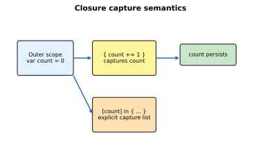
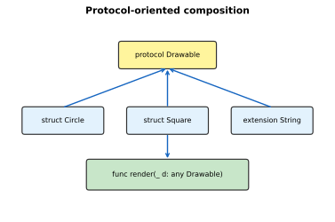
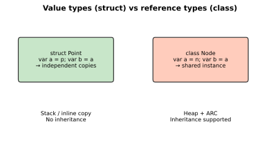

# Swift Functions, Types, and OOP

[toc]

> **TL;DR:** Swift functions are first-class values with rich parameter syntax; closures capture surrounding state. Enumerations, protocols, and generics enable protocol-oriented design. Structs (value types) are preferred over classes (reference types) unless you need inheritance or shared identity.

## Functions

> **TL;DR:** Functions declare parameters with external and internal names, support default values and variadics, and return one or more values via tuples. Every function has a type `(ParamTypes) -> ReturnType`.

### Vocabulary

- **External parameter name** — label at call site: `greet(person: "Ada")`.
- **Internal parameter name** — name inside body: `person`.
- **`_` omission** — suppress external label: `add(2, 3)`.
- **Variadic parameter** — `numbers: Int...` accepts zero or more values.
- **`inout`** — pass by reference for mutation: `func swap(_ a: inout Int, _ b: inout Int)`.

### Basic functions and parameters

```swift
func greet(person name: String, from city: String = "Earth") -> String {
    "Hello \(name) from \(city)"
}

print(greet(person: "Ada"))
print(greet(person: "Grace", from: "London"))
```

### Return types and function types

```swift
func minMax(_ values: [Int]) -> (min: Int, max: Int) {
    (values.min()!, values.max()!)
}

let formatter: (Int) -> String = { "\($0) items" }
print(formatter(42))
```

### Nested functions

Nested functions capture outer scope and hide implementation details:

```swift
func makeCounter() -> () -> Int {
    var count = 0
    func increment() -> Int {
        count += 1
        return count
    }
    return increment
}

let next = makeCounter()
print(next(), next())  // 1, 2
```

### Real-world example

A sorting helper with a custom comparator — functions as parameters:

```swift
func sortedBy<T>(_ items: [T], using areInOrder: (T, T) -> Bool) -> [T] {
    items.sorted(by: areInOrder)
}

struct Task { let title: String; let priority: Int }

let tasks = [
    Task(title: "Ship", priority: 1),
    Task(title: "Review", priority: 3),
]
let ordered = sortedBy(tasks) { $0.priority > $1.priority }
print(ordered.map(\.title))
```

## Closures

> **TL;DR:** Closures are self-contained function expressions. Swift provides shorthand argument names (`$0`, `$1`), trailing closure syntax, and capture lists to control reference cycles.



### Vocabulary

- **Closure expression** — `{ (params) -> Return in statements }`.
- **Trailing closure** — when closure is last argument, write it outside parentheses.
- **Capture list** — `[weak self]` or `[unowned self]` avoids retain cycles.
- **Escaping closure** — stored or called after function returns; must mark `@escaping`.

```swift
let names = ["Ada", "Grace", "Alan"]
let uppercased = names.map { $0.uppercased() }

UIView.animate(withDuration: 0.3) {
    self.view.alpha = 0
} completion: { finished in
    print(finished)
}
```

### Capturing values

```swift
var handlers: [() -> Void] = []
for i in 1...3 {
    handlers.append { print(i) }  // captures i by reference — bug!
}

var fixed: [() -> Void] = []
for i in 1...3 {
    fixed.append { [i] in print(i) }  // capture list copies i
}
fixed.forEach { $0() }
```

### Real-world example

Debounced search input using an escaping closure:

```swift
final class SearchController {
    private var workItem: DispatchWorkItem?

    func search(_ query: String, perform: @escaping (String) -> Void) {
        workItem?.cancel()
        let item = DispatchWorkItem { perform(query) }
        workItem = item
        DispatchQueue.main.asyncAfter(deadline: .now() + 0.3, execute: item)
    }
}
```

## Enumerations

> **TL;DR:** Swift enums are algebraic sum types — they can carry associated values, have methods, and conform to protocols. They replace many stringly-typed constants.

```swift
enum NetworkResult {
    case success(Data)
    case failure(code: Int, message: String)
}

func handle(_ result: NetworkResult) {
    switch result {
    case .success(let data):
        print("Got \(data.count) bytes")
    case .failure(let code, let message):
        print("Error \(code): \(message)")
    }
}
```

```swift
enum Direction: String, CaseIterable {
    case north, south, east, west
}

for d in Direction.allCases {
    print(d.rawValue)
}
```

## Protocols and Generics

> **TL;DR:** Protocols define requirements; types adopt them via extensions. Generics write algorithms once for many types. Swift favors **protocol-oriented programming** over deep class hierarchies.



### Vocabulary

- **Protocol** — contract of properties and methods (`protocol Equatable`).
- **Extension** — add behavior to existing types without subclassing.
- **Generic type parameter** — placeholder `T` constrained by protocols.
- **`some Protocol`** — opaque return type; compiler knows concrete type.
- **`any Protocol`** — existential box; type erasure at runtime.

```swift
protocol Identifiable {
    var id: String { get }
}

struct User: Identifiable {
    let id: String
    let name: String
}

func printID<T: Identifiable>(_ value: T) {
    print(value.id)
}
```

```swift
protocol Container {
    associatedtype Item
    mutating func append(_ item: Item)
    var count: Int { get }
}

struct Stack<Element>: Container {
    private var items: [Element] = []
    mutating func append(_ item: Element) { items.append(item) }
    var count: Int { items.count }
}
```

## Structures and Classes

> **TL;DR:** Structs are value types copied on assignment; classes are reference types with identity and inheritance. Prefer structs unless you need subclassing or shared mutable state across references.



### Vocabulary

- **Stored property** — constant or variable backed by storage.
- **Computed property** — calculated getter (and optional setter).
- **Property observer** — `willSet` / `didSet` on stored properties.
- **Property wrapper** — `@Published`, `@State` (SwiftUI) — syntactic sugar over getter/setter.
- **Initializer** — `init`; structs get memberwise init automatically.
- **Subscript** — `subscript(index: Int) -> Element` for indexed access.
- **Optional chaining** — `object?.property?.method()`.

### Properties and methods

```swift
struct Rectangle {
    var width: Double
    var height: Double

    var area: Double { width * height }

    mutating func scale(by factor: Double) {
        width *= factor
        height *= factor
    }
}
```

### Initialization and inheritance

```swift
class Vehicle {
    let wheels: Int
    init(wheels: Int) { self.wheels = wheels }
}

class Bicycle: Vehicle {
    init() { super.init(wheels: 2) }
}
```

### Extensions and subscripts

```swift
extension String {
    subscript(safe index: Int) -> Character? {
        guard index >= 0, index < count else { return nil }
        return self[self.index(startIndex, offsetBy: index)]
    }
}

print("Swift"[safe: 0]!)
```

### Property observers and wrappers

```swift
class StepCounter {
    var total: Int = 0 {
        willSet { print("about to set \(newValue)") }
        didSet { print("was \(oldValue), now \(total)") }
    }
}
```

### Real-world example

Model layer using struct + protocol — typical MVVM data model:

```swift
protocol Timestamped {
    var updatedAt: Date { get set }
}

struct Note: Identifiable, Timestamped, Codable {
    let id: UUID
    var title: String
    var body: String
    var updatedAt: Date
}

var note = Note(id: UUID(), title: "Draft", body: "", updatedAt: .now)
note.body = "Hello Swift"
note.updatedAt = .now
```

## In practice

- Default to `struct` for models; use `class` for `ObservableObject`, UIKit controllers, or shared services.
- Use `final class` when subclassing is not intended — enables devirtualization.
- Mark reference-type closures `[weak self]` in long-lived objects to prevent retain cycles.
- Put protocol extensions in the same module as the protocol for discoverability.

## Pitfalls

- **Struct mutation in non-mutating methods** — requires `mutating` keyword.
- **Class identity (`===`)** vs equality (`==`) — only classes compare identity.
- **Escaping closure cycles** — `self` captured strongly in stored closures leaks memory.
- **`associatedtype` in protocols** — cannot use as existential without type erasure (`any Container` limitations).

## Sources

- [TSPL — Functions](https://docs.swift.org/swift-book/documentation/the-swift-programming-language/functions/)
- [TSPL — Protocols](https://docs.swift.org/swift-book/documentation/the-swift-programming-language/protocols/)
- [TSPL — Structures and Classes](https://docs.swift.org/swift-book/documentation/the-swift-programming-language/classesandstructures/)
- Conversation with user on 2026-06-16

## Related

- [[00-swift-swiftui-index]]
- [[01-language-basics-and-setup]]
- [[03-swiftui-fundamentals]]
- [Python OOP](../Python/05-oop.md)
- [01 Language Basics and Setup](./01-language-basics-and-setup.md)
