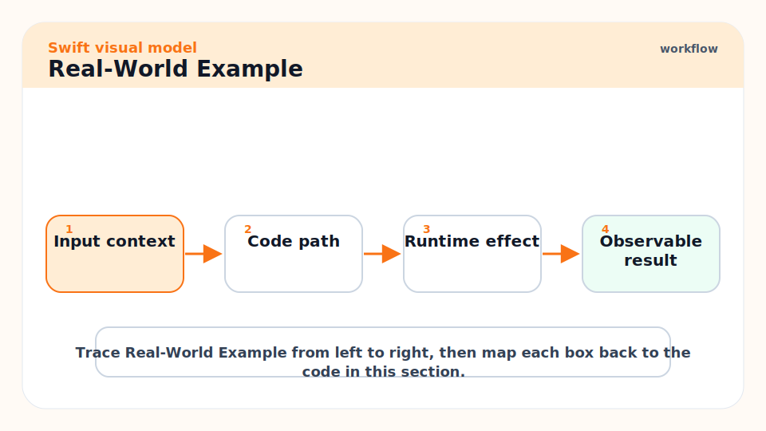
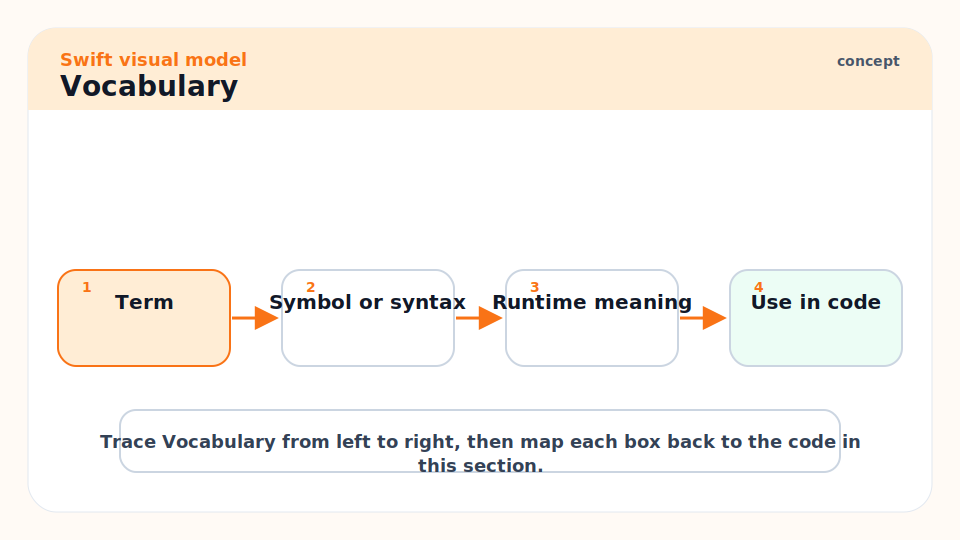
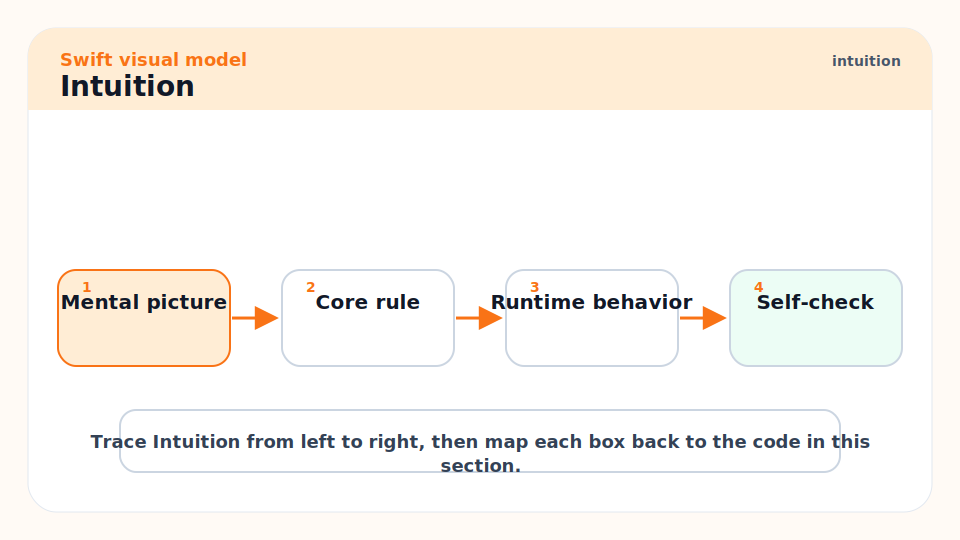
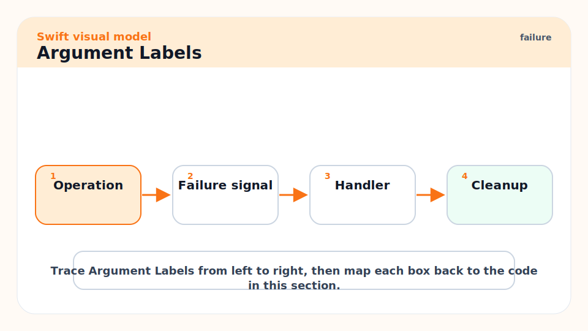
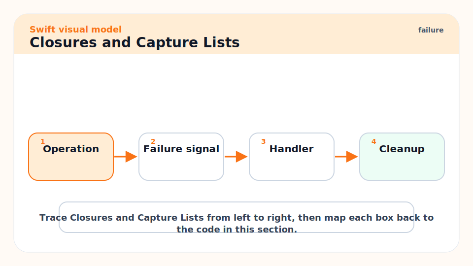
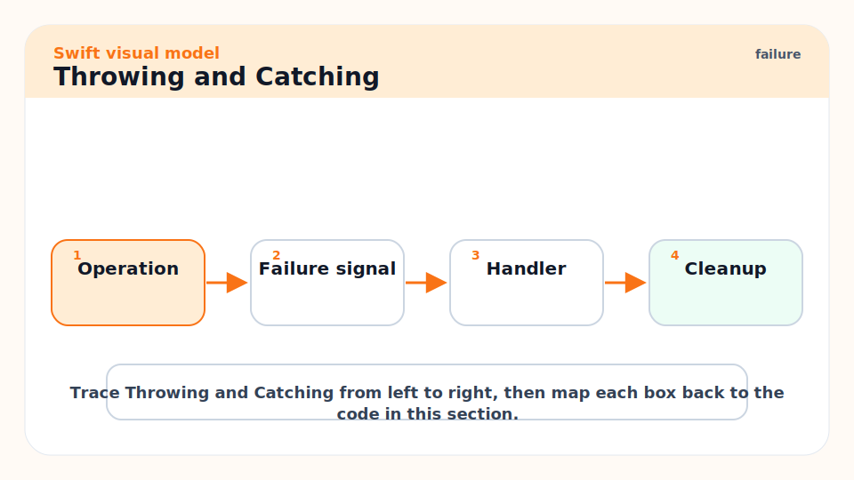
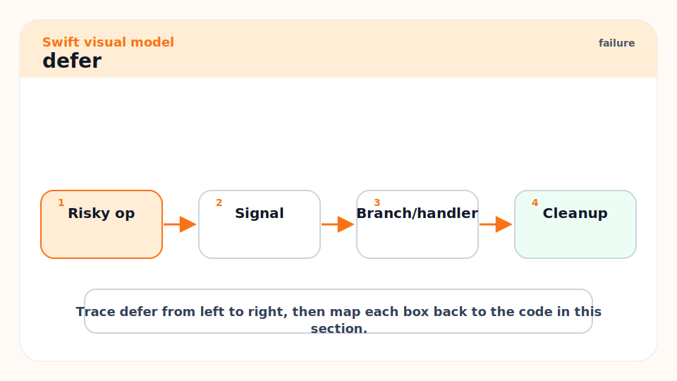
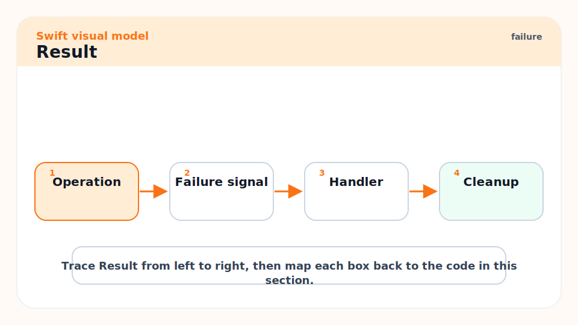
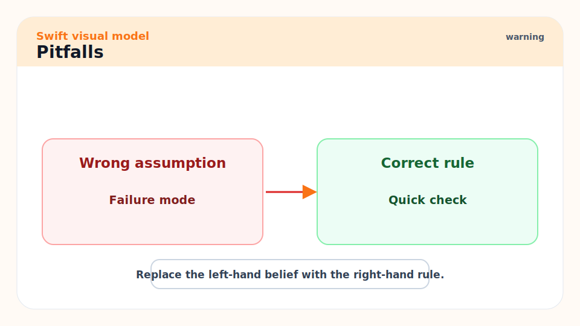
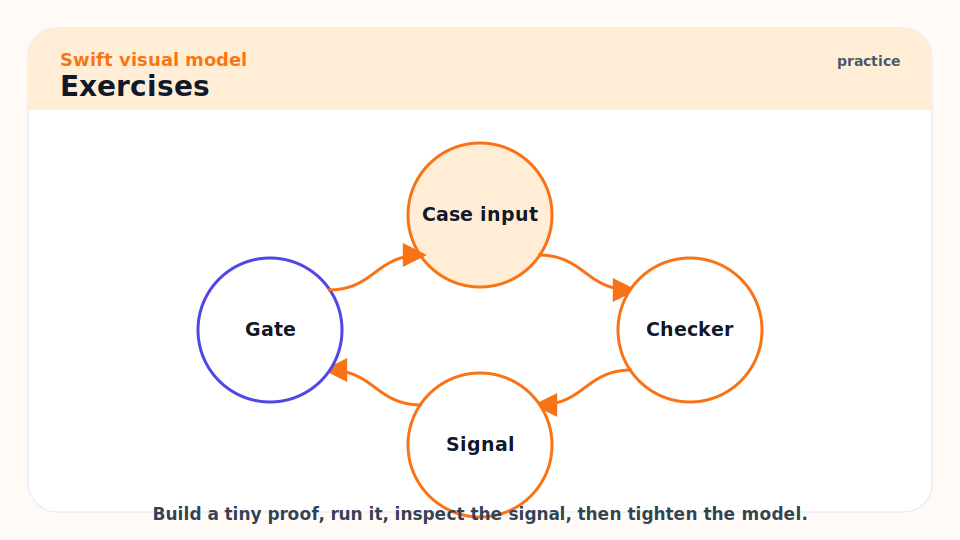

# 03 - Functions, Closures, Error Handling, and Result

[toc]

> **TL;DR:** Functions are named behavior, closures are movable behavior, and Swift's error handling makes failure explicit without returning nil everywhere. Learn argument labels, throwing functions, `defer`, capture lists, and `Result` before building larger APIs.

## Real-World Example



This example models a small parser. It shows a throwing function, domain-specific errors, `do`/`catch`, `defer`, and a closure used to transform validated input.

```swift
enum ParseError: Error {
    case empty
    case notANumber(String)
}

func parsePositiveInt(_ raw: String, transform: (Int) -> Int = { $0 }) throws -> Int {
    defer { print("Finished parsing '\(raw)'") }

    guard !raw.isEmpty else {
        throw ParseError.empty
    }

    guard let value = Int(raw) else {
        throw ParseError.notANumber(raw)
    }

    return max(0, transform(value))
}

do {
    let value = try parsePositiveInt("21") { $0 * 2 }
    print(value)
} catch ParseError.empty {
    print("Input was empty.")
} catch ParseError.notANumber(let raw) {
    print("Not a number: \(raw)")
} catch {
    print("Unexpected error: \(error)")
}
```

## Vocabulary



**Argument label**: The external name used at the call site. Swift uses labels to make function calls read clearly.

---

**Parameter name**: The internal name used inside the function body.

---

**Closure**: A function-like block that can be passed around, stored, and executed later.

---

**Capture**: A variable from an outer scope that a closure keeps alive for later use.

---

**Throwing function**: A function marked `throws` that can exit by throwing an `Error`.

---

**`defer`**: A statement that schedules cleanup to run when the current scope exits.

---

**`Result`**: A standard-library enum that stores either `.success(Value)` or `.failure(Error)`.

## Intuition



Function design is API design. Swift intentionally makes call sites read like phrases: `insert(_:at:)`, `move(from:to:)`, `fetchUser(id:)`. A good function name plus labels should explain the effect before you read the body.

Closures are powerful because they move behavior. They are also dangerous because they capture state. In UI apps and long-lived services, accidental captures of `self`, request objects, database handles, or large buffers can keep memory alive much longer than expected.

## Argument Labels



Swift separates the external argument label from the internal parameter name. Use this to make the call site fluent while keeping the implementation readable.

```swift
func moveFile(from source: String, to destination: String) {
    print("Move \(source) to \(destination)")
}

moveFile(from: "draft.txt", to: "archive/draft.txt")
```

Use `_` to omit the external label when the first argument is already obvious from the function name or follows standard library style.

```swift
func square(_ value: Int) -> Int {
    value * value
}

print(square(9))
```

## Closures and Capture Lists



Closures can capture variables from their surrounding scope. The capture is often exactly what you want for callbacks. It is also how many retain cycles begin.

```swift
final class Downloader {
    var onFinish: (() -> Void)?

    func start() {
        onFinish = { [weak self] in
            guard let self else { return }
            print("Finished \(self)")
        }
    }
}
```

> [!WARNING]
> `[weak self]` is not decoration. It changes ownership. Use it when the closure can outlive the object and the object should not be kept alive only because the closure exists.

## Throwing and Catching



Use `throws` when the caller can reasonably recover or report the failure. Do not use optionals for rich failure states, because nil loses the reason.

```swift
enum ConfigError: Error {
    case missingKey(String)
}

func require(_ key: String, in config: [String: String]) throws -> String {
    guard let value = config[key] else {
        throw ConfigError.missingKey(key)
    }
    return value
}
```

## `defer`



`defer` is for cleanup that must happen regardless of which return path runs. It is especially useful with files, locks, temporary state, metrics, or manual resources.

```swift
func process(lines: [String]) {
    print("start")
    defer { print("finish") }

    for line in lines {
        if line == "stop" {
            return
        }
        print(line)
    }
}
```

## `Result`



Use `Result` when you need to store or pass around the outcome of work instead of immediately throwing. It is common at async boundaries, callback APIs, and test fixtures.

```swift
func parseScore(_ raw: String) -> Result<Int, Error> {
    Result {
        guard let value = Int(raw) else {
            throw ParseError.notANumber(raw)
        }
        return value
    }
}

switch parseScore("98") {
case .success(let value):
    print("score: \(value)")
case .failure(let error):
    print("error: \(error)")
}
```

## Pitfalls



- **Overusing closures for simple calls**: A named function is easier to test and document when behavior is reused.
- **Catching and swallowing errors**: Empty catch blocks hide failures. Log, transform, rethrow, or intentionally ignore with a comment.
- **Using `try!` in product code**: `try!` asserts that failure is impossible. If failure is merely unlikely, handle it.
- **Capturing large values**: Closures extend lifetimes. Capture only what you need.
- **Designing labels from declarations only**: Read the call site. Swift API design is judged at the use site.

## Exercises



1. Write a throwing function that parses a port number and rejects values outside 1 through 65535.
2. Rewrite it to return `Result<Int, PortError>`.
3. Add a closure parameter that validates the parsed number.
4. Create a class with a stored closure, then explain how `[weak self]` changes ownership.

## Sources

- https://docs.swift.org/swift-book/documentation/the-swift-programming-language/functions/
- https://docs.swift.org/swift-book/documentation/the-swift-programming-language/closures/
- https://docs.swift.org/swift-book/documentation/the-swift-programming-language/errorhandling/
- https://www.swift.org/documentation/api-design-guidelines/
- Conversation with user on 2026-06-07

## Related

- Previous: [02 - Syntax, Values, Optionals, and Control Flow](./02-syntax-values-optionals-and-control-flow.md)
- Next: [04 - Types: Structs, Classes, Enums, and Protocols](./04-types-structs-classes-enums-and-protocols.md)
- Later: [06 - Memory, ARC, Value Semantics, and Copy-on-Write](./06-memory-arc-value-semantics-and-copy-on-write.md)

