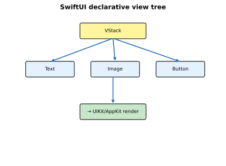

# SwiftUI Fundamentals

[toc]

> **TL;DR:** SwiftUI is Apple's declarative UI framework: you describe *what* the interface should look like for a given state, and the runtime diffs and renders it. This note covers SwiftUI vs UIKit, app lifecycle, core views, layout stacks, modifiers, and navigation.

## What is SwiftUI

> **TL;DR:** SwiftUI replaces imperative UIKit layout (Auto Layout, view controllers) with composable `View` structs that update when `@State` changes. It runs on all Apple platforms with adaptive layouts.

### Vocabulary

- **Declarative UI** — describe state → UI mapping; framework handles updates.
- **UIKit** — imperative iOS UI framework (UIView, UIViewController); still interoperable.
- **`View` protocol** — core SwiftUI abstraction; `body` returns a view tree.
- **View modifier** — function wrapping a view (`.padding()`, `.font()`).
- **`@main`** — entry attribute on `App` struct.

### UIKit vs SwiftUI

| Aspect | UIKit | SwiftUI |
| :--- | :--- | :--- |
| Paradigm | Imperative, delegate-heavy | Declarative, value-type views |
| Layout | Auto Layout constraints | Stacks, `Grid`, `GeometryReader` |
| State | Manual reload (`reloadData`) | Reactive property wrappers |
| Previews | Simulator / storyboards | `#Preview` live previews |
| Maturity | Full platform API surface | Growing; some APIs UIKit-only |

```swift
// UIKit (imperative)
let label = UILabel()
label.text = "Hello"
label.textColor = .systemBlue

// SwiftUI (declarative)
Text("Hello")
    .foregroundStyle(.blue)
```

### Real-world example

Minimal cross-platform app entry point:

```swift
import SwiftUI

@main
struct NotesApp: App {
    var body: some Scene {
        WindowGroup {
            ContentView()
        }
    }
}

struct ContentView: View {
    var body: some View {
        NavigationStack {
            Text("Welcome to Notes")
                .navigationTitle("Home")
        }
    }
}
```

## App Lifecycle

> **TL;DR:** SwiftUI apps use `App`, `Scene`, and lifecycle events via `@Environment` values. On iOS 17+, prefer `onChange`, `task`, and scene phases over legacy `AppDelegate` unless you need UIKit hooks.

### Scene phases

```swift
struct LifecycleView: View {
    @Environment(\.scenePhase) private var scenePhase

    var body: some View {
        Text("Active")
            .onChange(of: scenePhase) { _, phase in
                switch phase {
                case .active:       print("foreground")
                case .inactive:     print("transitioning")
                case .background:   print("background")
                @unknown default:   break
                }
            }
    }
}
```

## Views and the View Tree

> **TL;DR:** Views are lightweight structs recomputed when state changes. Modifiers return new view values — order matters. Layout containers (`VStack`, `HStack`, `ZStack`) arrange children.



### Basic views

| View | Purpose |
| :--- | :--- |
| `Text` | Labels, attributed strings |
| `Image` | SF Symbols, assets, system images |
| `Button` | Tappable actions |
| `List` | Scrollable rows, selection |
| `Form` | Grouped settings-style inputs |

```swift
struct ProfileRow: View {
    let name: String
    let systemImage: String

    var body: some View {
        HStack {
            Image(systemName: systemImage)
                .foregroundStyle(.tint)
            Text(name)
            Spacer()
            Image(systemName: "chevron.right")
                .foregroundStyle(.secondary)
        }
    }
}
```

### Layout views

```swift
struct Dashboard: View {
    var body: some View {
        VStack(spacing: 16) {
            HStack {
                MetricCard(title: "Tasks", value: "12")
                MetricCard(title: "Done", value: "8")
            }
            List {
                Text("Inbox")
                Text("Archive")
            }
        }
        .padding()
    }
}

struct MetricCard: View {
    let title: String
    let value: String
    var body: some View {
        VStack {
            Text(value).font(.title)
            Text(title).font(.caption)
        }
        .frame(maxWidth: .infinity)
        .padding()
        .background(.thinMaterial, in: RoundedRectangle(cornerRadius: 12))
    }
}
```

`Grid` lays out cells in rows and columns; `GeometryReader` exposes the parent's size so children can scale proportionally (use sparingly — it expands to fill available space).

```swift
struct PhotoGrid: View {
    let photos = Array(repeating: "photo", count: 6)

    var body: some View {
        Grid(horizontalSpacing: 8, verticalSpacing: 8) {
            ForEach(0..<2, id: \.self) { row in
                GridRow {
                    ForEach(0..<3, id: \.self) { col in
                        RoundedRectangle(cornerRadius: 8)
                            .fill(.blue.opacity(0.3))
                            .frame(height: 60)
                            .overlay { Text("\(row),\(col)").font(.caption) }
                    }
                }
            }
        }
    }
}

struct ProportionalBar: View {
    var body: some View {
        GeometryReader { geo in
            RoundedRectangle(cornerRadius: 4)
                .fill(.green)
                .frame(width: geo.size.width * 0.7)
        }
        .frame(height: 12)
    }
}
```

### View modifiers

Modifiers wrap views and must be applied in logical order — `.background` after `.padding` includes padding in the background:

```swift
Text("Styled")
    .font(.headline)
    .padding()
    .background(.yellow.opacity(0.3))
    .clipShape(RoundedRectangle(cornerRadius: 8))
```

Common modifiers from the roadmap:

| Modifier | Effect |
| :--- | :--- |
| `.font()` | Typography |
| `.padding()` | Insets |
| `.background()` | Fill behind view |
| `.clipShape()` | Mask to shape |
| `@ViewBuilder` | Compose conditional child views |

```swift
@ViewBuilder
func statusBadge(_ ok: Bool) -> some View {
    if ok {
        Label("OK", systemImage: "checkmark.circle.fill")
            .foregroundStyle(.green)
    } else {
        Label("Fail", systemImage: "xmark.circle.fill")
            .foregroundStyle(.red)
    }
}
```

### Navigation

```swift
struct NotesList: View {
    let notes = ["Swift", "SwiftUI", "Combine"]

    var body: some View {
        NavigationStack {
            List(notes, id: \.self) { note in
                NavigationLink(note) {
                    Text("Detail for \(note)")
                        .navigationTitle(note)
                }
            }
            .navigationTitle("Notes")
        }
    }
}
```

`TabView` for top-level sections:

```swift
TabView {
    NotesList()
        .tabItem { Label("Notes", systemImage: "note.text") }
    SettingsView()
        .tabItem { Label("Settings", systemImage: "gear") }
}
```

### NavigationPath

`NavigationPath` is a type-erased stack you mutate programmatically — ideal for deep links, wizard flows, or resetting navigation without individual `NavigationLink` state. Pair it with `NavigationStack(path: $path)`.

```swift
struct DeepLinkDemo: View {
    @State private var path = NavigationPath()

    var body: some View {
        NavigationStack(path: $path) {
            VStack(spacing: 12) {
                Button("Open Settings") { path.append(Route.settings) }
                Button("Pop to root") { path = NavigationPath() }
            }
            .navigationTitle("Home")
            .navigationDestination(for: Route.self) { route in
                switch route {
                case .settings: Text("Settings detail")
                }
            }
        }
    }

    enum Route: Hashable { case settings }
}
```

### Real-world example

Settings screen combining `Form`, toggles, and navigation:

```swift
struct SettingsView: View {
    @AppStorage("notificationsEnabled") private var notifications = true
    @AppStorage("username") private var username = ""

    var body: some View {
        Form {
            Section("Account") {
                TextField("Username", text: $username)
            }
            Section("Preferences") {
                Toggle("Notifications", isOn: $notifications)
            }
            Section {
                NavigationLink("About") { Text("Notes v1.0") }
            }
        }
        .navigationTitle("Settings")
    }
}
```

## Previews

Use `#Preview` for rapid iteration without launching the simulator:

```swift
#Preview {
    NavigationStack {
        Dashboard()
    }
}

#Preview("Dark") {
    ContentView()
        .preferredColorScheme(.dark)
}
```

## In practice

- Keep views small; extract subviews when `body` exceeds ~30 lines.
- Pass data down, actions up — avoid massive monolithic views.
- Use SF Symbols for consistent iconography: `Image(systemName: "star.fill")`.
- Wrap UIKit views with `UIViewRepresentable` when SwiftUI lacks an API.
- Profile with Instruments when lists stutter — often missing `id` or heavy work in `body`.

## Pitfalls

- **Modifier order** — `.padding().background(.red)` vs `.background(.red).padding()` look different.
- **Identity in `ForEach`** — unstable `id` causes animation glitches and wrong row reuse.
- **`some View` opaque return** — conditional branches must return the same opaque type or use `@ViewBuilder`.
- **Heavy computation in `body`** — runs on every state change; move to model or `task`.

## Sources

- [SwiftUI Tutorials — Apple Developer](https://developer.apple.com/tutorials/swiftui)
- [Human Interface Guidelines](https://developer.apple.com/design/human-interface-guidelines/)
- [roadmap.sh — Swift & SwiftUI](https://roadmap.sh/swift-ui)
- Conversation with user on 2026-06-16

## Related

- [[00-swift-swiftui-index]]
- [[02-functions-types-and-oop]]
- [[04-swiftui-state-and-interaction]]
- [04 SwiftUI State and Interaction](./04-swiftui-state-and-interaction.md)
