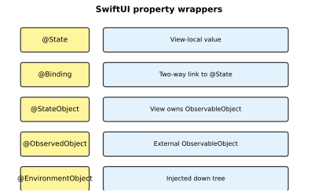
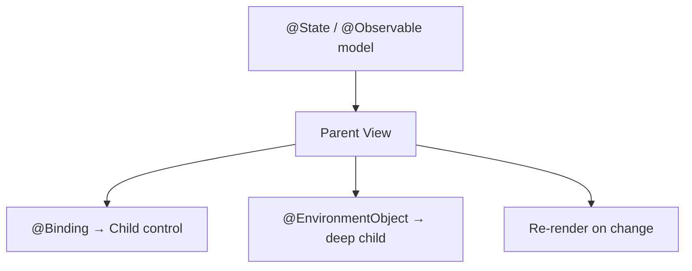

# SwiftUI State and Interaction

[toc]

> **TL;DR:** SwiftUI re-renders views when observable state changes. Property wrappers (`@State`, `@Binding`, `@Observable`) define ownership and data flow. Animations and gestures attach to state transitions; accessibility and localization are first-class modifiers.

## Data Flow and State Management

> **TL;DR:** State lives at the lowest common ancestor that needs it. `@State` owns view-local value types; reference-type models use `@Observable` / `ObservableObject`; `@EnvironmentObject` injects shared dependencies down the tree.



### Vocabulary

- **`@State`** — view-owned mutable value; private to the view struct.
- **`@Binding`** — read-write reference to someone else's `@State`.
- **`@StateObject`** — view creates and owns an `ObservableObject` (iOS 16 and earlier pattern).
- **`@ObservedObject`** — external `ObservableObject` not owned by this view.
- **`@EnvironmentObject`** — dependency injected via `.environmentObject()`.
- **`@Observable` (iOS 17+)** — macro replacing much of `ObservableObject` boilerplate.
- **`@AppStorage` / `@SceneStorage`** — persist small values in `UserDefaults` / scene restoration.

### Single-source-of-truth diagram



### @State and @Binding

```swift
struct CounterView: View {
    @State private var count = 0

    var body: some View {
        VStack {
            Text("Count: \(count)")
            StepperButton(value: $count)
        }
    }
}

struct StepperButton: View {
    @Binding var value: Int
    var body: some View {
        Button("Increment") { value += 1 }
    }
}
```

### @Observable model (modern)

```swift
import Observation

@Observable
final class TodoStore {
    var items: [String] = []

    func add(_ title: String) {
        items.append(title)
    }
}

struct TodoListView: View {
    @State private var store = TodoStore()
    @State private var draft = ""

    var body: some View {
        VStack {
            TextField("New task", text: $draft)
            Button("Add") {
                store.add(draft)
                draft = ""
            }
            List(store.items, id: \.self) { Text($0) }
        }
    }
}
```

### EnvironmentObject

```swift
@Observable
final class Session {
    var username = "Guest"
}

struct RootView: View {
    @State private var session = Session()

    var body: some View {
        HomeView()
            .environment(session)
    }
}

struct HomeView: View {
    @Environment(Session.self) private var session

    var body: some View {
        Text("Hello, \(session.username)")
    }
}
```

### Real-world example

MVVM-style note editor with shared store:

```swift
@Observable
final class NotesViewModel {
    var notes: [Note] = []
    var filter = ""

    var filtered: [Note] {
        guard !filter.isEmpty else { return notes }
        return notes.filter { $0.title.localizedCaseInsensitiveContains(filter) }
    }

    func addNote(title: String) {
        notes.append(Note(id: UUID(), title: title, body: "", updatedAt: .now))
    }
}

struct NotesScreen: View {
    @State private var vm = NotesViewModel()

    var body: some View {
        NavigationStack {
            List(vm.filtered) { note in
                Text(note.title)
            }
            .searchable(text: $vm.filter)
            .toolbar {
                Button("Add") { vm.addNote(title: "Untitled") }
            }
        }
    }
}
```

## Animations

> **TL;DR:** Implicit animations attach to state changes via `.animation()`. Explicit animations use `withAnimation`. Transitions control insert/remove; `Animatable` protocol enables custom interpolated values.

### Implicit vs explicit

```swift
struct ToggleBox: View {
    @State private var expanded = false

    var body: some View {
        RoundedRectangle(cornerRadius: 12)
            .fill(expanded ? .blue : .gray)
            .frame(width: expanded ? 200 : 100, height: 60)
            .onTapGesture {
                withAnimation(.spring(duration: 0.35)) {
                    expanded.toggle()
                }
            }
    }
}
```

### Transitions

```swift
if showDetail {
    Text("Details")
        .transition(.move(edge: .bottom).combined(with: .opacity))
}
```

### Animatable protocol

Custom shapes can animate by conforming to `Animatable`:

```swift
struct Wedge: Shape {
    var progress: Double
    var animatableData: Double {
        get { progress }
        set { progress = newValue }
    }

    func path(in rect: CGRect) -> Path {
        var p = Path()
        p.move(to: CGPoint(x: rect.midX, y: rect.midY))
        p.addArc(center: CGPoint(x: rect.midX, y: rect.midY),
                 radius: min(rect.width, rect.height) / 2,
                 startAngle: .degrees(-90),
                 endAngle: .degrees(-90 + 360 * progress),
                 clockwise: false)
        return p
    }
}
```

## User Interaction

> **TL;DR:** Controls (`Picker`, `Slider`, `Toggle`) bind to state. Gestures compose with `.gesture()` and `simultaneousGesture`. Drag-and-drop uses `Transferable` types. Accessibility modifiers expose VoiceOver labels; localization uses `LocalizedStringKey` and string catalogs.

### UI controls

Form controls two-bind to `@State` or `@Binding` and are the building blocks of settings screens and input flows.

```swift
struct ControlsDemo: View {
    @State private var volume = 0.5
    @State private var mode = 0
    @State private var enabled = true

    var body: some View {
        Form {
            Slider(value: $volume, in: 0...1) {
                Text("Volume")
            }
            Picker("Mode", selection: $mode) {
                Text("Light").tag(0)
                Text("Dark").tag(1)
            }
            Toggle("Enabled", isOn: $enabled)
        }
    }
}
```

### Drag and drop

SwiftUI drag-and-drop uses `Transferable` conformance (iOS 16+) or `onDrag` / `onDrop` modifiers for list reordering and cross-view moves.

```swift
struct ReorderableList: View {
    @State private var items = ["Swift", "SwiftUI", "Xcode"]

    var body: some View {
        List {
            ForEach(items, id: \.self) { item in
                Text(item)
            }
            .onMove { indices, newOffset in
                items.move(fromOffsets: indices, toOffset: newOffset)
            }
        }
        .toolbar { EditButton() }
    }
}
```

### Gestures

```swift
struct DragCard: View {
    @State private var offset = CGSize.zero

    var body: some View {
        RoundedRectangle(cornerRadius: 16)
            .fill(.orange)
            .frame(width: 120, height: 80)
            .offset(offset)
            .gesture(
                DragGesture()
                    .onChanged { offset = $0.translation }
                    .onEnded { _ in
                        withAnimation { offset = .zero }
                    }
            )
    }
}
```

### Accessibility

```swift
Button(action: save) {
    Image(systemName: "square.and.arrow.down")
}
.accessibilityLabel("Save note")
.accessibilityHint("Saves the current note to disk")
```

### Localization

```swift
Text("welcome_message")  // key in Localizable.xcstrings

// String catalog entry:
// "welcome_message" = "Welcome, %@";  with parameter username
```

### Real-world example

Pull-to-refresh with async data load:

```swift
struct FeedView: View {
    @State private var items: [String] = []
    @State private var isLoading = false

    var body: some View {
        List(items, id: \.self) { Text($0) }
            .overlay {
                if isLoading { ProgressView() }
            }
            .refreshable {
                await reload()
            }
            .task { await reload() }
    }

    func reload() async {
        isLoading = true
        defer { isLoading = false }
        try? await Task.sleep(for: .seconds(1))
        items = (1...5).map { "Item \($0)" }
    }
}
```

## In practice

- Lift state only as high as needed — avoid global singletons when `@State` suffices.
- Use `@Observable` on iOS 17+ instead of `ObservableObject` + `@Published` for simpler syntax.
- Prefer `.task` over `onAppear` for async work — auto-cancels when view disappears.
- Test animations with Reduce Motion enabled — respect `@Environment(\.accessibilityReduceMotion)`.
- Localize early with string catalogs; avoid hard-coded user-visible strings.

## Pitfalls

- **`@ObservedObject` without `@StateObject` owner** — object recreated each render, losing state.
- **Missing `.environmentObject`** — runtime crash when child expects injection.
- **Animating non-animatable properties** — wrap in `AnimatablePair` or use explicit `withAnimation`.
- **Gesture conflicts** — scroll views consume drags; use `highPriorityGesture` sparingly.

## Sources

- [Managing user interface state — Apple](https://developer.apple.com/documentation/swiftui/managing-user-interface-state)
- [Observation framework](https://developer.apple.com/documentation/observation)
- Conversation with user on 2026-06-16

## Related

- [[00-swift-swiftui-index]]
- [[03-swiftui-fundamentals]]
- [[05-advanced-swift-and-persistence]]
- [Python Concurrency](../Python/09-concurrency.md)
- [03 SwiftUI Fundamentals](./03-swiftui-fundamentals.md)
