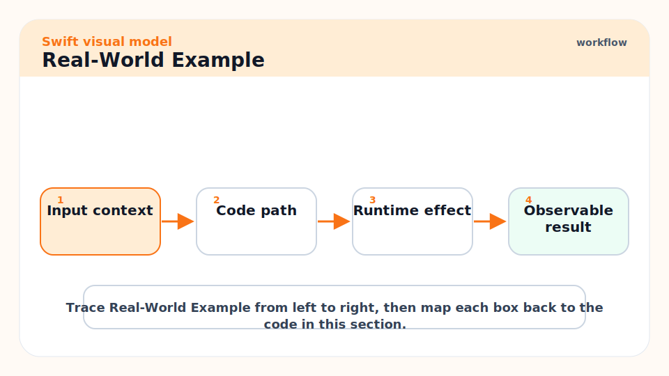
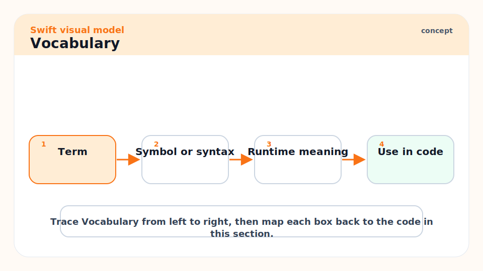
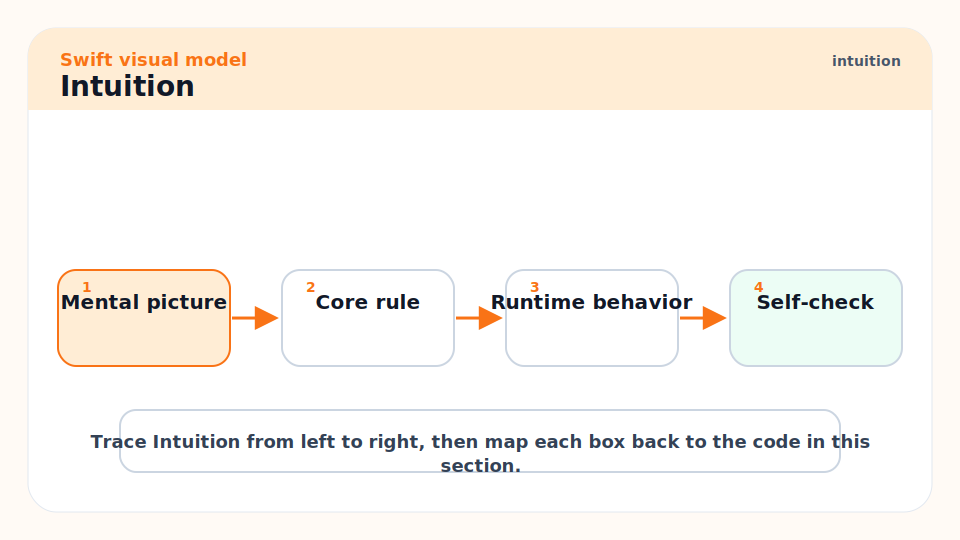
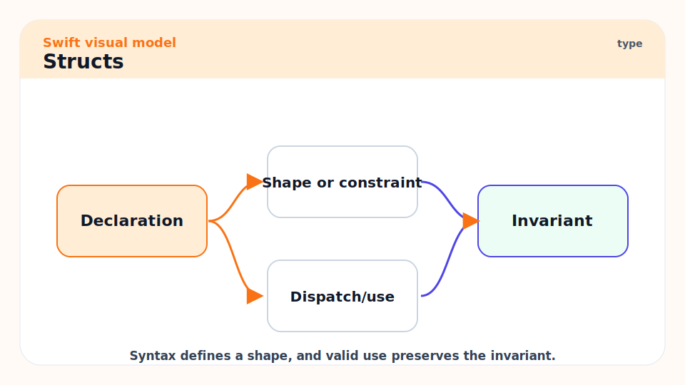
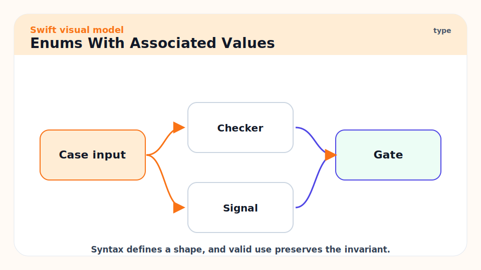
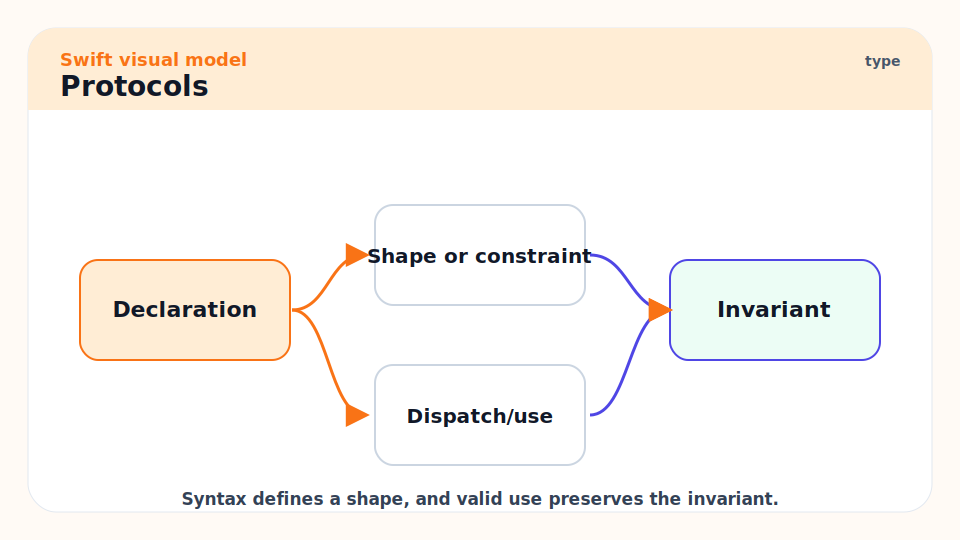
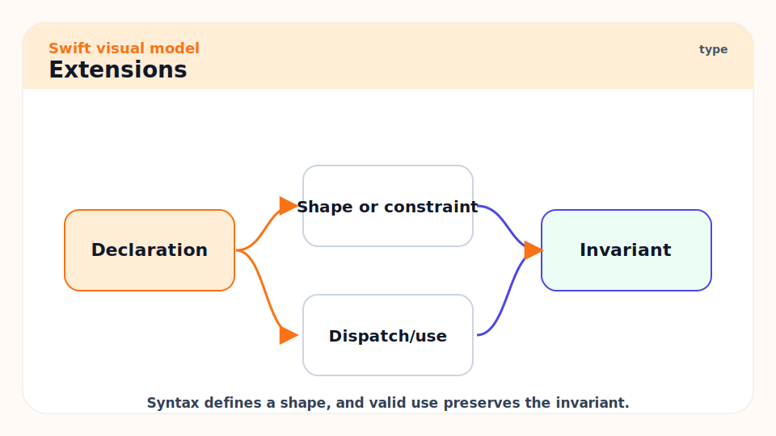
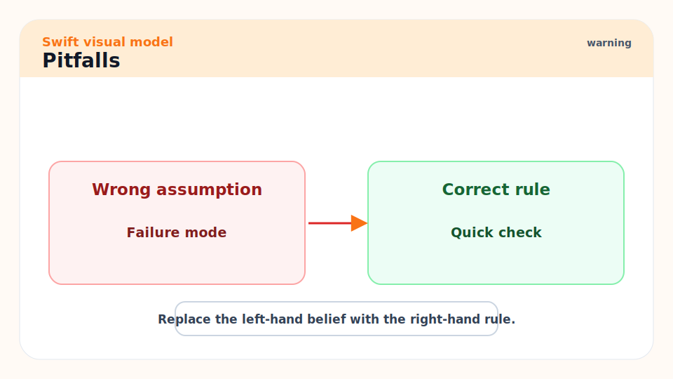
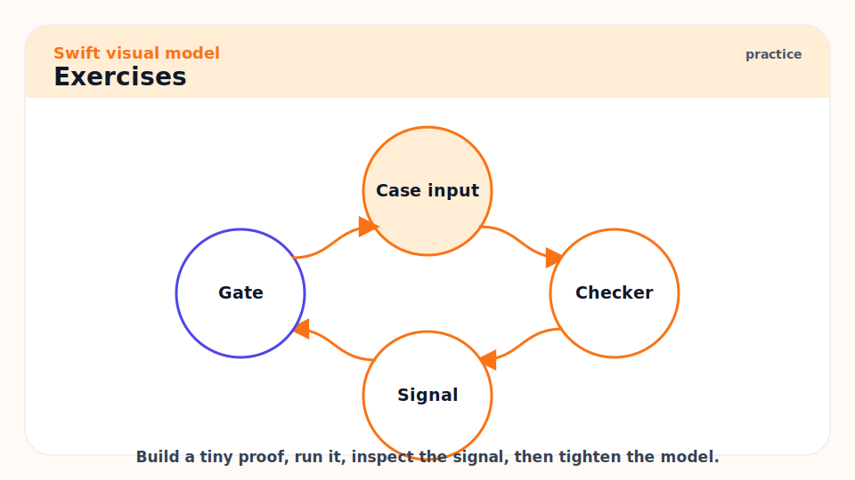

# 04 - Types: Structs, Classes, Enums, and Protocols

[toc]

> **TL;DR:** Swift gives you several modeling tools, and mastery means choosing the smallest one that expresses the truth. Use structs for values, enums for finite states, classes for identity and shared mutable reference, protocols for contracts, and actors for isolated concurrent state.

## Real-World Example



This example models checkout state. The enum makes illegal states hard to represent, the struct stores value data, and the protocol defines a dependency boundary.

```swift
struct Money: Equatable {
    let cents: Int
    let currency: String
}

enum CheckoutState {
    case empty
    case ready(total: Money)
    case paid(receiptID: String)
    case failed(reason: String)
}

protocol ReceiptStore {
    func save(receiptID: String, total: Money) throws
}

func message(for state: CheckoutState) -> String {
    switch state {
    case .empty:
        return "Cart is empty."
    case .ready(let total):
        return "Ready to charge \(total.cents) \(total.currency)."
    case .paid(let receiptID):
        return "Paid. Receipt: \(receiptID)."
    case .failed(let reason):
        return "Payment failed: \(reason)."
    }
}
```

## Vocabulary



**Struct**: A value type. Copies behave as independent values, even when storage is optimized behind the scenes.

---

**Class**: A reference type with identity. Multiple variables can refer to the same instance.

---

**Enum**: A type with a fixed set of cases. Cases can carry associated values.

---

**Protocol**: A contract describing required properties, methods, initializers, or associated types.

---

**Extension**: A way to add methods, computed properties, conformances, or nested types to an existing type.

---

**Identity**: The property of being the same object over time, even as internal state changes.

## Intuition



Types are your domain model. A weak Swift codebase has too many strings, booleans, and dictionaries carrying hidden meaning. A strong Swift codebase turns domain facts into types so the compiler can reject impossible states.

The core question is not "Can I implement this with a class?" You can implement almost anything with a class. The better question is "What behavior should be impossible?" If a value cannot be missing, avoid optional. If only four states are legal, use an enum. If a dependency should be swappable, use a protocol. If shared mutable state is required, use a class or actor deliberately.

## Structs



Use structs for domain data, request and response values, configuration, coordinates, money, identifiers, and most view models. They compose well and avoid accidental shared mutation.

```swift
struct UserID: Hashable, Codable {
    let rawValue: String
}

struct User: Codable, Equatable {
    let id: UserID
    var displayName: String
}
```

## Classes


Use classes when identity is the behavior: controllers, observable objects, shared caches, delegates, reference-backed resources, and Objective-C interop. Because classes use ARC, object graphs can leak through strong cycles. This example imports Foundation because `Data` is a Foundation type.

```swift
import Foundation

final class ImageCache {
    private var storage: [String: Data] = [:]

    func imageData(for key: String) -> Data? {
        storage[key]
    }

    func insert(_ data: Data, for key: String) {
        storage[key] = data
    }
}
```

> [!TIP]
> Mark classes `final` unless you are intentionally designing an inheritance point. It improves readability and can help optimization.

## Enums With Associated Values



Enums are one of Swift's strongest modeling tools. They let each state carry exactly the data it needs. This response model imports Foundation for `Data` and `URL`.

```swift
import Foundation

enum NetworkResponse {
    case success(statusCode: Int, body: Data)
    case redirect(location: URL)
    case failure(underlying: Error)
}
```

This is better than a struct with many optional fields because the compiler knows which data exists in each state.

## Protocols



Protocols define capabilities. They are useful for boundaries, generic constraints, test doubles, and shared behavior across otherwise unrelated types. This boundary imports Foundation for `Date`.

```swift
import Foundation

protocol Clock {
    func now() -> Date
}

struct SystemClock: Clock {
    func now() -> Date { Date() }
}

struct FixedClock: Clock {
    let date: Date
    func now() -> Date { date }
}
```

## Extensions



Use extensions to organize conformances and domain-specific helpers. Keep them close to the type when they are core behavior, and separate when they adapt to another protocol or framework.

```swift
extension UserID: CustomStringConvertible {
    var description: String {
        rawValue
    }
}
```

## Pitfalls



- **Boolean state explosion**: Three booleans can represent eight combinations, many of them invalid. Prefer enums for state machines.
- **Protocol for every dependency**: Only abstract when you need multiple implementations, a test seam, or a real module boundary.
- **Class by habit**: Reference semantics introduce lifetime and mutation concerns. Use them deliberately.
- **Anemic types**: If behavior belongs to the data, put it near the data instead of scattering helpers across the codebase.
- **Overusing inheritance**: Swift favors composition, protocols, and extensions over deep class hierarchies.

## Exercises



1. Model a login flow with an enum: logged out, entering credentials, loading, logged in, failed.
2. Replace a `[String: String]` configuration dictionary with a struct.
3. Write a protocol for a clock or UUID generator and create a fake implementation for tests.
4. Explain which type in your model truly needs identity.

## Sources

- https://docs.swift.org/swift-book/documentation/the-swift-programming-language/classesandstructures/
- https://docs.swift.org/swift-book/documentation/the-swift-programming-language/enumerations/
- https://docs.swift.org/swift-book/documentation/the-swift-programming-language/protocols/
- https://www.swift.org/documentation/api-design-guidelines/
- Conversation with user on 2026-06-07

## Related

- Previous: [03 - Functions, Closures, Error Handling, and Result](./03-functions-closures-error-handling-and-result.md)
- Next: [05 - Generics, Existentials, and API Design](./05-generics-existentials-and-api-design.md)
- Later: [07 - Concurrency: Async, Await, Actors, and Sendable](./07-concurrency-async-await-actors-and-sendable.md)
