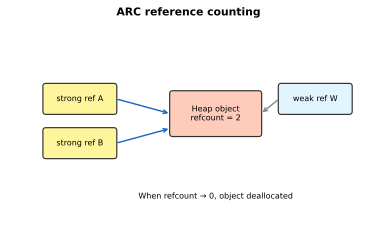
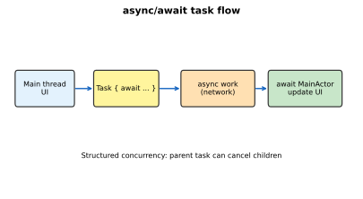
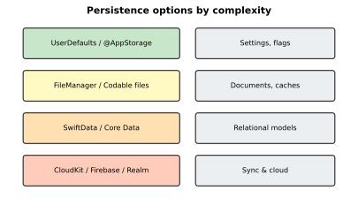

# Advanced Swift and Persistence

[toc]

> **TL;DR:** Advanced Swift covers access control, ARC, result builders, macros, structured concurrency (async/await, actors), and persistence layers from UserDefaults through SwiftData and cloud backends. This note maps the middle-to-advanced tier of the Swift roadmap.

## Language Features

> **TL;DR:** Access control limits API surface (`private`, `fileprivate`, `internal`, `public`, `open`). ARC manages heap objects automatically. Result builders power DSLs like SwiftUI; macros (Swift 5.9+) generate code at compile time.

### Access control

| Level | Scope |
| :--- | :--- |
| `private` | Enclosing declaration |
| `fileprivate` | Same source file |
| `internal` | Same module (default) |
| `public` | Any module, not subclassable |
| `open` | Any module, subclassable (classes) |

```swift
public struct APIClient {
    private let session: URLSession

    public init(session: URLSession = .shared) {
        self.session = session
    }
}
```

### ARC (Automatic Reference Counting)



Swift uses deterministic memory management — no garbage collector. Reference types on the heap increment/decrement a counter; at zero, memory frees.

```swift
class Node {
    let id: Int
    weak var next: Node?   // weak breaks cycles
    init(id: Int) { self.id = id }
}

var a: Node? = Node(id: 1)
var b: Node? = Node(id: 2)
a?.next = b
b?.next = a   // cycle — use weak on one side
a = nil; b = nil
```

### Result builders

SwiftUI's `@ViewBuilder` is a result builder — it transforms a block of statements into a single combined value:

```swift
@resultBuilder
enum StringBuilder {
    static func buildBlock(_ components: String...) -> String {
        components.joined(separator: " ")
    }
}

func compose(@StringBuilder _ content: () -> String) -> String {
    content()
}

let sentence = compose {
    "Swift"
    "is"
    "fast"
}
```

### Macros

```swift
// @Observable macro expands to Observation conformance
@Observable
final class Cart {
    var itemCount = 0
}
```

## Async Programming

> **TL;DR:** `async` functions suspend without blocking threads. `await` marks suspension points. Tasks provide structured concurrency; actors isolate mutable state; `@MainActor` pins UI updates to the main thread.



### Vocabulary

- **`async`** — function can suspend.
- **`await`** — wait for async result.
- **`Task`** — unit of async work; supports cancellation.
- **`TaskGroup`** — parallel child tasks with structured lifetime.
- **`Actor`** — reference type serializing access to its state.
- **`AsyncSequence`** — `for await` over streaming values.
- **Strict concurrency** — compiler checks for data races (Swift 6).

```swift
func fetchUser(id: Int) async throws -> User {
    let url = URL(string: "https://api.example.com/users/\(id)")!
    let (data, _) = try await URLSession.shared.data(from: url)
    return try JSONDecoder().decode(User.self, from: data)
}
```

### Tasks and task groups

```swift
func fetchAll(ids: [Int]) async throws -> [User] {
    try await withThrowingTaskGroup(of: User.self) { group in
        for id in ids {
            group.addTask { try await fetchUser(id: id) }
        }
        var users: [User] = []
        for try await user in group { users.append(user) }
        return users
    }
}
```

### Asynchronous sequences

`AsyncSequence` lets you consume streaming values with `for await` — URL lines, notifications, or custom byte streams without blocking a thread.

```swift
func printLines(from url: URL) async throws {
    for try await line in url.lines {
        print(line)
    }
}
```

### Unstructured concurrency

Unstructured tasks (`Task { }`, `Task.detached`) launch work outside a strict parent-child tree. Use them for fire-and-forget logging or background work, but prefer structured `TaskGroup` when cancellation must propagate.

```swift
func logLater(_ message: String) {
    Task.detached(priority: .background) {
        try? await Task.sleep(for: .seconds(1))
        print(message)
    }
}

func scopedWork() async {
    let handle = Task {
        try await longRunningJob()
    }
    handle.cancel()   // explicit lifetime control
}
```

> [!WARNING]
> Detached tasks inherit neither actor context nor automatic cancellation from the caller — easy to leak work or touch UI off the main actor.

### Strict concurrency checking

Swift 6 enables compile-time data-race detection. Mark types `Sendable` when shared across actors, prefer `@MainActor` on UI models, and treat `@Sendable` closure warnings as real bugs.

```swift
@MainActor
@Observable
final class DashboardModel {
    var title = ""
}

func publish(_ model: DashboardModel) async {
    await MainActor.run { model.title = "Updated" }
}
```

### Actors

```swift
actor Counter {
    private var value = 0
    func increment() { value += 1 }
    func current() -> Int { value }
}

let counter = Counter()
await counter.increment()
print(await counter.current())
```

### SwiftUI with async/await

```swift
struct UserProfile: View {
    @State private var user: User?
    let id: Int

    var body: some View {
        Group {
            if let user { Text(user.displayName) }
            else { ProgressView() }
        }
        .task(id: id) {
            user = try? await fetchUser(id: id)
        }
    }
}
```

### Real-world example

Image loader with cancellation and MainActor UI update:

```swift
@MainActor
@Observable
final class ImageLoader {
    var image: UIImage?
    private var task: Task<Void, Never>?

    func load(url: URL) {
        task?.cancel()
        task = Task {
            do {
                let (data, _) = try await URLSession.shared.data(from: url)
                if Task.isCancelled { return }
                image = UIImage(data: data)
            } catch {
                image = nil
            }
        }
    }
}
```

## Data Persistence

> **TL;DR:** Choose storage by complexity: flags in UserDefaults, documents as files, relational data in SwiftData/Core Data, sync via CloudKit or third-party backends.



### Local storage

| Tool | Use case |
| :--- | :--- |
| `UserDefaults` / `@AppStorage` | Settings, small plist values |
| `FileManager` + `Codable` | JSON/plist documents, caches |
| Keychain | Secrets, tokens |

```swift
struct Settings: Codable {
    var theme: String
    var fontSize: Double
}

func saveSettings(_ s: Settings) throws {
    let url = FileManager.default.urls(for: .documentDirectory, in: .userDomainMask)[0]
        .appendingPathComponent("settings.json")
    let data = try JSONEncoder().encode(s)
    try data.write(to: url)
}
```

### Databases

| Framework | Notes |
| :--- | :--- |
| **SwiftData** | Swift-native, `@Model`, iOS 17+, integrates with SwiftUI |
| **Core Data** | Mature object graph, iCloud sync, complex migrations |
| **GRDB** | SQLite wrapper, full SQL control |
| **Realm** | Mobile DB, sync option |
| **Firebase** | BaaS, realtime sync |

### SwiftData example

```swift
import SwiftData

@Model
final class NoteItem {
    var title: String
    var body: String
    var updatedAt: Date

    init(title: String, body: String = "", updatedAt: Date = .now) {
        self.title = title
        self.body = body
        self.updatedAt = updatedAt
    }
}

@main
struct NotesApp: App {
    var body: some Scene {
        WindowGroup {
            ContentView()
        }
        .modelContainer(for: NoteItem.self)
    }
}
```

```swift
struct ContentView: View {
    @Query(sort: \NoteItem.updatedAt, order: .reverse) private var notes: [NoteItem]
    @Environment(\.modelContext) private var context

    var body: some View {
        List(notes) { note in
            Text(note.title)
        }
        .toolbar {
            Button("Add") {
                context.insert(NoteItem(title: "New"))
            }
        }
    }
}
```

### CloudKit

Apple's cloud database syncs across user devices with iCloud account — pairs well with Core Data (`NSPersistentCloudKitContainer`) or standalone CloudKit records.

### Real-world example

Offline-first cache with Codable files and background refresh:

```swift
actor NoteCache {
    private let fileURL: URL

    init() {
        fileURL = FileManager.default.urls(for: .cachesDirectory, in: .userDomainMask)[0]
            .appendingPathComponent("notes-cache.json")
    }

    func load() throws -> [Note] {
        guard let data = try? Data(contentsOf: fileURL) else { return [] }
        return try JSONDecoder().decode([Note].self, from: data)
    }

    func save(_ notes: [Note]) throws {
        let data = try JSONEncoder().encode(notes)
        try data.write(to: fileURL, options: .atomic)
    }
}
```

## In practice

- Enable Swift 6 strict concurrency gradually; fix `@Sendable` warnings early.
- Use `@MainActor` on view models that touch UI-bound state.
- Prefer SwiftData for new apps on iOS 17+; Core Data when you need mature migration tooling.
- Never store secrets in UserDefaults — use Keychain.
- Batch Core Data/SwiftData writes; avoid saving on every keystroke.

## Pitfalls

- **Retain cycles with closures** — `[weak self]` in long-lived network callbacks.
- **`Task` not cancelled** — views disappear but work continues unless using `.task` or manual cancel.
- **Actor reentrancy** — `await` inside actor methods allows other calls to interleave.
- **Core Data on main thread** — heavy fetches block UI; use `performBackgroundTask`.
- **SwiftData schema changes** — plan lightweight migrations before shipping.

## Sources

- [TSPL — Concurrency](https://docs.swift.org/swift-book/documentation/the-swift-programming-language/concurrency/)
- [SwiftData documentation](https://developer.apple.com/documentation/swiftdata)
- [Core Data Programming Guide](https://developer.apple.com/library/archive/documentation/Cocoa/Conceptual/CoreData/index.html)
- Conversation with user on 2026-06-16

## Related

- [[00-swift-swiftui-index]]
- [[04-swiftui-state-and-interaction]]
- [[06-ecosystem-and-tooling]]
- [Python Concurrency](../Python/09-concurrency.md)
- [Relational Databases notes](../../Relational-Databases-and-Data-Modeling/)
