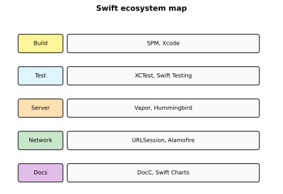
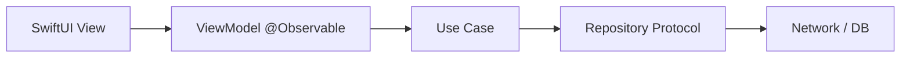

# Swift Ecosystem and Tooling

[toc]

> **TL;DR:** The Swift ecosystem spans Xcode and alternative editors, Swift Package Manager for dependencies, XCTest and Swift Testing for verification, logging/debugging tools, app architecture patterns, server frameworks, networking libraries, and growing cross-platform SDKs beyond Apple hardware.



## Package Management

> **TL;DR:** Swift Package Manager (SPM) is the official build and dependency system. Declare dependencies in `Package.swift`; resolve with `swift package resolve`. The Swift Package Index catalogs community libraries.

### Vocabulary

- **`Package.swift`** — manifest defining targets, products, dependencies.
- **Target** — module to build (library or executable).
- **Product** — what clients import (`.library`, `.executable`).
- **Plugin** — SPM build-tool plugin for code generation.

```swift
// swift-tools-version: 5.9
import PackageDescription

let package = Package(
    name: "MyCLI",
    platforms: [.macOS(.v13)],
    dependencies: [
        .package(url: "https://github.com/apple/swift-argument-parser", from: "1.3.0"),
    ],
    targets: [
        .executableTarget(
            name: "MyCLI",
            dependencies: [.product(name: "ArgumentParser", package: "swift-argument-parser")]
        ),
    ]
)
```

```bash
swift build
swift test
swift run MyCLI --help
```

### Creating packages

```bash
mkdir MyLibrary && cd MyLibrary
swift package init --type library
# Sources/MyLibrary/MyLibrary.swift
# Tests/MyLibraryTests/MyLibraryTests.swift
```

## Testing

> **TL;DR:** XCTest is the longstanding framework (Xcode integration, UI tests). Swift Testing (Swift 6 era) offers modern `@Test` macros and `#expect` assertions. Run tests via Xcode or `swift test`.

### XCTest

```swift
import XCTest
@testable import MyLibrary

final class MathTests: XCTestCase {
    func testAddition() {
        XCTAssertEqual(add(2, 3), 5)
    }
}
```

### Swift Testing

```swift
import Testing
@testable import MyLibrary

@Test func addition() {
    #expect(add(2, 3) == 5)
}

@Test("division by zero throws")
func division() {
    #expect(throws: MathError.divideByZero) {
        try divide(1, by: 0)
    }
}
```

### Real-world example

Testing an async API client with mock URLProtocol:

```swift
final class MockURLProtocol: URLProtocol {
    static var handler: ((URLRequest) throws -> (HTTPURLResponse, Data))?

    override class func canInit(with request: URLRequest) -> Bool { true }
    override class func canonicalRequest(for request: URLRequest) -> URLRequest { request }
    override func startLoading() {
        guard let handler = Self.handler else { return }
        do {
            let (response, data) = try handler(request)
            client?.urlProtocol(self, didReceive: response, cacheStoragePolicy: .notAllowed)
            client?.urlProtocol(self, didLoad: data)
            client?.urlProtocolDidFinishLoading(self)
        } catch {
            client?.urlProtocol(self, didFailWithError: error)
        }
    }
    override func stopLoading() {}
}
```

## Logging and Debugging

> **TL;DR:** Use `Logger` from `os` framework for structured logs. Xcode debugger supports view hierarchy, memory graph, and SwiftUI inspector. Community tools include swift-log and CocoaLumberjack.

```swift
import os

let log = Logger(subsystem: "com.example.notes", category: "sync")

func syncNotes() async {
    log.info("Starting sync")
    do {
        try await performSync()
        log.debug("Sync complete")
    } catch {
        log.error("Sync failed: \(error.localizedDescription)")
    }
}
```

| Tool | Role |
| :--- | :--- |
| Xcode debugger | Breakpoints, LLDB, Memory Graph |
| SwiftUI Inspector | Live view hierarchy in canvas |
| Instruments | CPU, memory, network profiling |
| swift-log | Backend-agnostic logging API |
| CocoaLumberjack | File rolling logs (Obj-C/Swift) |

## IDEs and Editors

| Editor | Swift support |
| :--- | :--- |
| **Xcode** | Full — build, debug, previews, Instruments |
| **VS Code** | SourceKit-LSP extension |
| **Neovim / Emacs** | sourcekit-lsp via LSP |

```bash
# Generate compile_commands for LSP (xcodebuild)
xcodebuild -scheme MyApp -destination 'platform=iOS Simulator,name=iPhone 16' \
  -showBuildSettings | head
```

## App Architecture

> **TL;DR:** Common patterns: **MVVM** (Model–View–ViewModel) with SwiftUI; **Clean Architecture** (layers: entities, use cases, interfaces); **Dependency Injection** via initializers or DI containers.



### MVVM sketch

```swift
@Observable
final class LoginViewModel {
    var email = ""
    var password = ""
    var isLoading = false
    var errorMessage: String?

    private let auth: AuthService

    init(auth: AuthService) { self.auth = auth }

    func login() async {
        isLoading = true
        defer { isLoading = false }
        do {
            try await auth.login(email: email, password: password)
        } catch {
            errorMessage = error.localizedDescription
        }
    }
}
```

## Server Frameworks

> **TL;DR:** Swift on the server runs on Linux with frameworks like **Vapor** (full-featured) and **Hummingbird** ( lightweight, NIO-based). **MongoKitten** provides MongoDB access.

```swift
import Vapor

var app = try await Application.make()
app.get("hello") { _ in "Hello, world!" }
try await app.run()
```

| Framework | Character |
| :--- | :--- |
| Vapor | Batteries included — ORM, auth, queues |
| Hummingbird | Minimal, composable middleware |
| MongoKitten | MongoDB driver |

## Networking Libraries

| Library | Use |
| :--- | :--- |
| **URLSession** | Built-in HTTP; async/await native |
| **Alamofire** | Higher-level HTTP abstractions |
| **swift-nio** | Event-driven networking (server) |
| **Moya** | Typed API layer over Alamofire |

```swift
// URLSession — preferred for most apps
let (data, response) = try await URLSession.shared.data(from: url)
guard (response as? HTTPURLResponse)?.statusCode == 200 else {
    throw URLError(.badServerResponse)
}
```

## More Tools

| Tool | Purpose |
| :--- | :--- |
| **DocC** | Documentation compiler; publishes symbol docs |
| **Swift Charts** | Declarative charting in SwiftUI |
| **Swift Playgrounds** | Learn Swift/iPad coding |

```swift
import Charts
import SwiftUI

struct SalesChart: View {
    let data: [(month: String, revenue: Double)]

    var body: some View {
        Chart(data, id: \.month) {
            BarMark(x: .value("Month", $0.month), y: .value("Revenue", $0.revenue))
        }
    }
}
```

## Beyond Apple

> **TL;DR:** Swift compiles for Linux (static SDK), WebAssembly (experimental), and server deployments — the language is no longer Apple-only.

| Target | Status |
| :--- | :--- |
| Static Linux SDK | Cross-compile from macOS to Linux |
| Wasm SDK | Run Swift in browser (early) |
| Server apps | Production on AWS, GCP with Docker |

```dockerfile
# Example: Vapor in Docker
FROM swift:5.10-jammy as build
WORKDIR /app
COPY . .
RUN swift build -c release

FROM ubuntu:jammy
COPY --from=build /app/.build/release/App /app
CMD ["/app"]
```

### Real-world example

Small REST service exposing health check — typical microservice entry:

```swift
import Hummingbird

let router = Router()
router.get("health") { _, _ in "ok" }

let app = Application(router: router, configuration: .init(address: .hostname("0.0.0.0", port: 8080)))
try await app.runService()
```

## Roadmap completion checklist

Use this checklist to track the full [roadmap.sh Swift & SwiftUI path](https://roadmap.sh/swift-ui):

- [ ] Introduction, install, Swift basics
- [ ] Operators, control flow, error handling
- [ ] Functions, closures, enums, protocols, generics
- [ ] Structs, classes, properties, extensions
- [ ] SwiftUI views, layout, navigation
- [ ] State wrappers, animations, gestures, a11y
- [ ] ARC, async/await, actors
- [ ] Persistence (UserDefaults → SwiftData)
- [ ] SPM, testing, logging
- [ ] Architecture, server, networking
- [ ] Explore Linux / server deployment

## In practice

- Pin SPM versions with `from:` or exact revisions for reproducible CI.
- Run `swift test` in GitHub Actions on macOS and Ubuntu matrices.
- Use DocC for public framework APIs; keep README for onboarding.
- Start with URLSession before adding Alamofire unless you need its features.
- Profile server apps with `swift-backtrace` and NIO metrics under load.

## Pitfalls

- **SPM + Xcode mixed with CocoaPods** — duplicate symbols; prefer one package manager.
- **Flaky UI tests** — use accessibility identifiers, not coordinate taps.
- **Logging PII** — scrub user data from production logs.
- **Server Swift version drift** — Docker image Swift version must match `Package.swift` tools version.

## Sources

- [Swift Package Manager docs](https://www.swift.org/documentation/package-manager/)
- [Swift Package Index](https://swiftpackageindex.com/)
- [Vapor docs](https://docs.vapor.codes/)
- [Swift Testing](https://developer.apple.com/documentation/testing)
- [roadmap.sh — Swift & SwiftUI](https://roadmap.sh/swift-ui)
- Conversation with user on 2026-06-16

## Related

- [[00-swift-swiftui-index]]
- [[01-language-basics-and-setup]]
- [[05-advanced-swift-and-persistence]]
- [Python Packaging and Environments](../Python/07-packaging-and-environments.md)
- [Python Testing and Internals](../Python/11-testing-and-internals.md)
- [Infrastructure DevOps notes](../../Infrastructure-DevOps/)
