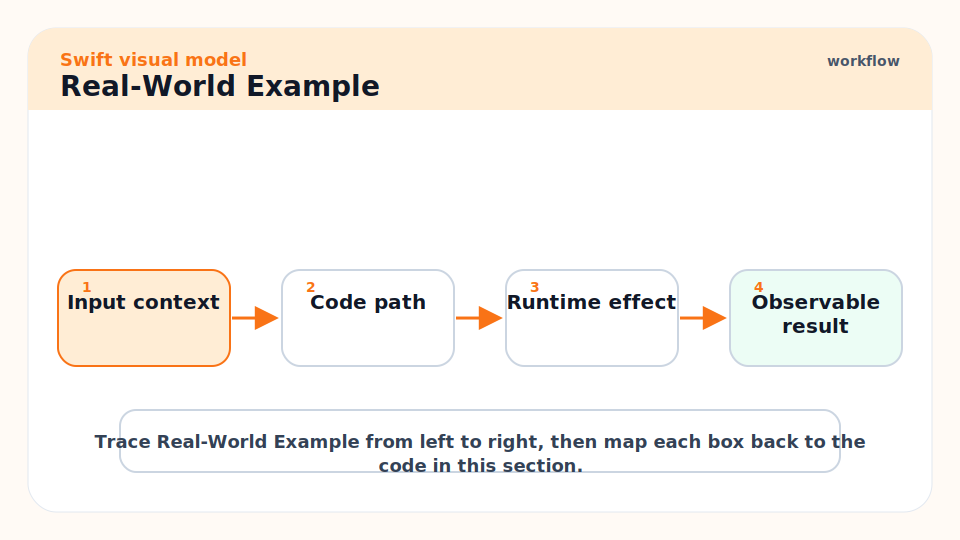
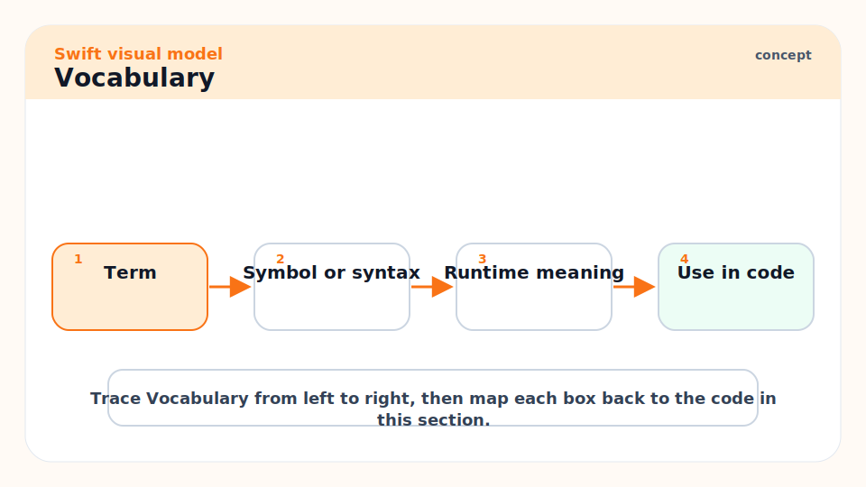
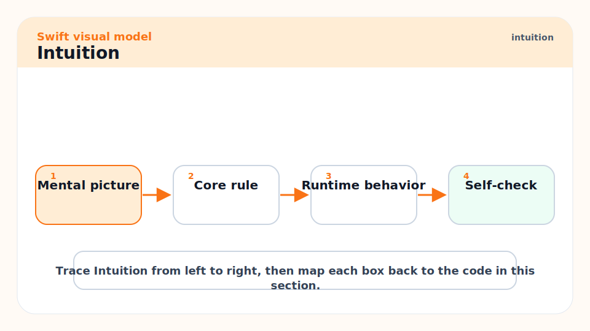
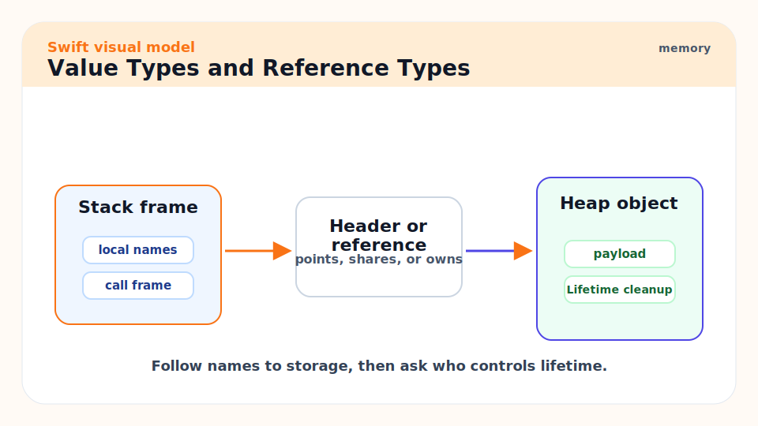
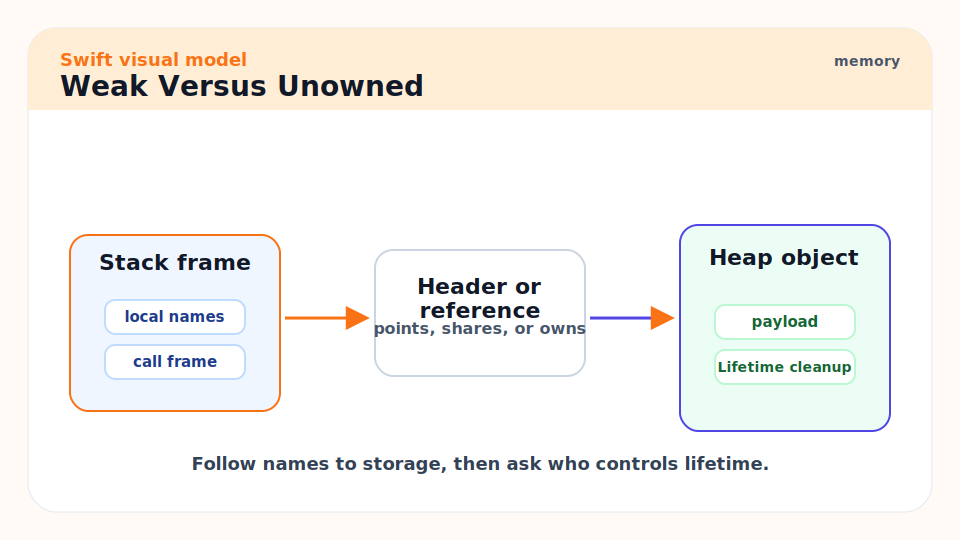
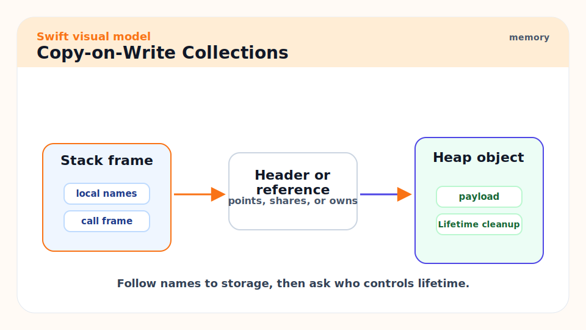
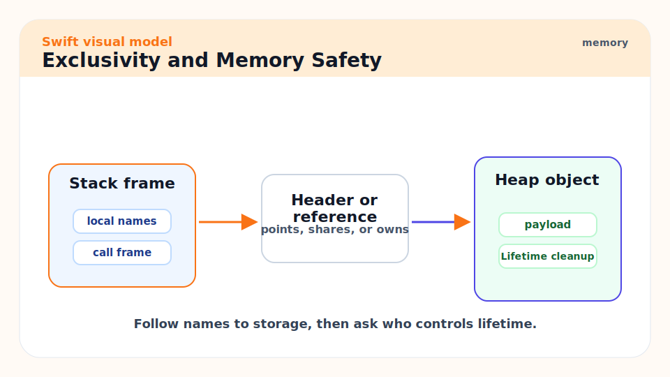
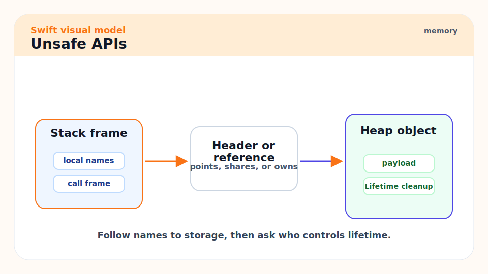
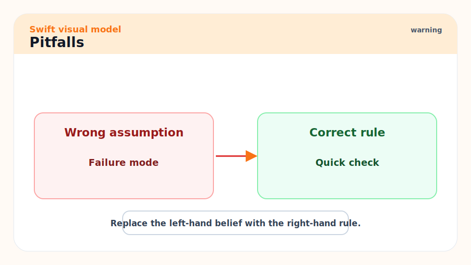
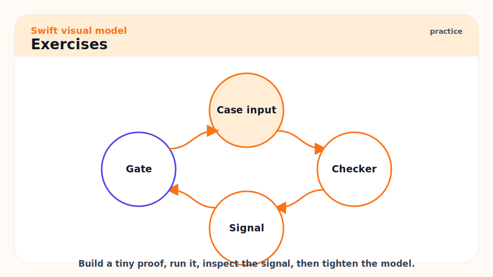

# 06 - Memory, ARC, Value Semantics, and Copy-on-Write

[toc]

> **TL;DR:** Swift memory mastery starts with one split: structs and enums are values, classes are references managed by ARC. ARC automatically manages class lifetimes, but retain cycles, closure captures, unsafe pointers, and accidental copies are still your responsibility.

## Real-World Example



This example shows a classic retain cycle. `ViewModel` strongly owns a closure, and the closure strongly captures `self`. The fixed version captures `self` weakly.

```swift
final class ViewModel {
    var onChange: (() -> Void)?
    private var count = 0

    func startLeaking() {
        onChange = {
            self.count += 1
            print(self.count)
        }
    }

    func startSafely() {
        onChange = { [weak self] in
            guard let self else { return }
            self.count += 1
            print(self.count)
        }
    }

    deinit {
        print("ViewModel deallocated")
    }
}
```

## Vocabulary



**ARC**: Automatic Reference Counting. Swift's normal memory-management system for class instances.

---

**Strong reference**: A reference that keeps a class instance alive.

---

**Weak reference**: A reference that does not keep an instance alive and automatically becomes nil after deallocation.

---

**Unowned reference**: A non-owning reference that assumes the object is still alive when accessed. Use only when the lifetime invariant is guaranteed.

---

**Retain cycle**: A graph of strong references that keeps objects alive forever because no reference count reaches zero.

---

**Value semantics**: Behavior where each variable behaves as its own independent value.

---

**Copy-on-write**: An optimization where shared storage is copied only when mutation requires uniqueness.

---

**Unsafe pointer**: A low-level pointer API that bypasses some Swift safety checks and must be handled with explicit lifetime care.

## Intuition



ARC is not a tracing garbage collector. It does not periodically walk the heap to discover unreachable cycles. It increments and decrements reference counts as strong references are created and removed. When the strong count reaches zero, the object is deallocated.

That deterministic model is fast and predictable, but cycles do not break themselves. If object A strongly owns B and B strongly owns A, both reference counts stay above zero. You must design one side as `weak` or `unowned`, or break the relationship manually.

## Value Types and Reference Types



Structs and enums give you value semantics. Classes give you reference identity. The difference is visible when you mutate one copy.

```swift
struct CounterValue {
    var count: Int
}

final class CounterReference {
    var count: Int
    init(count: Int) {
        self.count = count
    }
}

var a = CounterValue(count: 1)
var b = a
b.count += 1
print(a.count) // 1
print(b.count) // 2

let x = CounterReference(count: 1)
let y = x
y.count += 1
print(x.count) // 2
print(y.count) // 2
```

## Weak Versus Unowned



Use `weak` when the referenced object may disappear first. Use `unowned` only when the referenced object must outlive the reference by design.

```swift
final class Parent {
    var child: Child?
}

final class Child {
    weak var parent: Parent?
}
```

The parent owns the child. The child points back without owning the parent.

## Copy-on-Write Collections



Swift arrays, dictionaries, and sets are value types with optimized shared storage. Assigning an array usually copies a small wrapper, not every element. Mutating one copy may trigger storage separation.

```swift
var first = [1, 2, 3]
var second = first

second.append(4)

print(first)  // [1, 2, 3]
print(second) // [1, 2, 3, 4]
```

> [!IMPORTANT]
> Copy-on-write is an optimization, not permission to ignore algorithmic cost. Large mutations, bridging, and hidden uniqueness checks can matter in hot paths. Measure in release mode.

## Exclusivity and Memory Safety



Swift enforces exclusive access to mutable memory. You cannot safely mutate the same storage through two overlapping paths. This is why some code that "looks fine" in a dynamic language is rejected by the compiler.

```swift
func increment(_ value: inout Int) {
    value += 1
}

var score = 1
increment(&score)
print(score)
```

`inout` makes mutation explicit at the call site. The compiler uses this explicitness to reject overlapping mutations.

## Unsafe APIs



Unsafe pointer APIs exist for C interop, performance experiments, and systems code. They are not the normal path. When you use them, you own lifetime, alignment, initialization, and deinitialization rules.

```swift
let numbers = [1, 2, 3]

numbers.withUnsafeBufferPointer { buffer in
    guard let base = buffer.baseAddress else { return }
    print(base.pointee)
}
```

> [!CAUTION]
> Never store an unsafe pointer from a `withUnsafe...` closure and use it later. The pointer's lifetime is scoped to the closure unless the API explicitly says otherwise.

## Pitfalls



- **Retain cycles in closures**: Stored closures and async callbacks often capture `self`.
- **Overusing `unowned`**: If the object can disappear first, `unowned` can crash. Prefer `weak` unless the lifetime relation is strict.
- **Assuming value types are always stack-only**: Value semantics are not a promise about physical stack allocation. Large or escaping values may use heap storage.
- **Measuring debug builds**: ARC and optimization behavior differ in release mode.
- **Using unsafe pointers as an optimization guess**: Profile first. Unsafe code can be slower and less correct if it fights optimizer assumptions.

## Exercises



1. Create two classes with strong references to each other and prove `deinit` does not run.
2. Fix the cycle with `weak`.
3. Write a struct containing an array, copy it, mutate one copy, and explain why the other does not change.
4. Find one closure in a Swift codebase and decide whether it should capture `self`, `[weak self]`, or a specific value.

## Sources

- https://docs.swift.org/swift-book/documentation/the-swift-programming-language/automaticreferencecounting/
- https://docs.swift.org/swift-book/documentation/the-swift-programming-language/memorysafety/
- https://docs.swift.org/compiler/documentation/diagnostics/return-type-implicit-copy
- https://www.swift.org/blog/swift-6.2-released/
- https://www.swift.org/documentation/server/guides/memory-leaks-and-usage.html
- https://www.swift.org/documentation/server/guides/allocations.html
- Conversation with user on 2026-06-07

## Related

- Previous: [05 - Generics, Existentials, and API Design](./05-generics-existentials-and-api-design.md)
- Next: [07 - Concurrency: Async, Await, Actors, and Sendable](./07-concurrency-async-await-actors-and-sendable.md)
- Existing reference: [Golang - 9 - Memory Management and the GC](../Golang/9-memory-management-gc.md)

