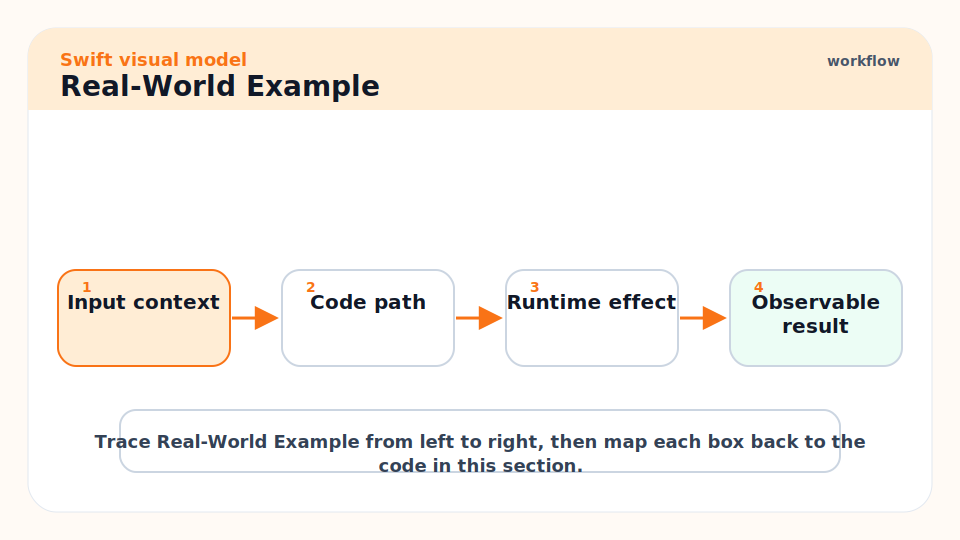
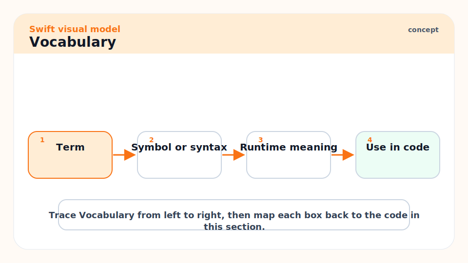
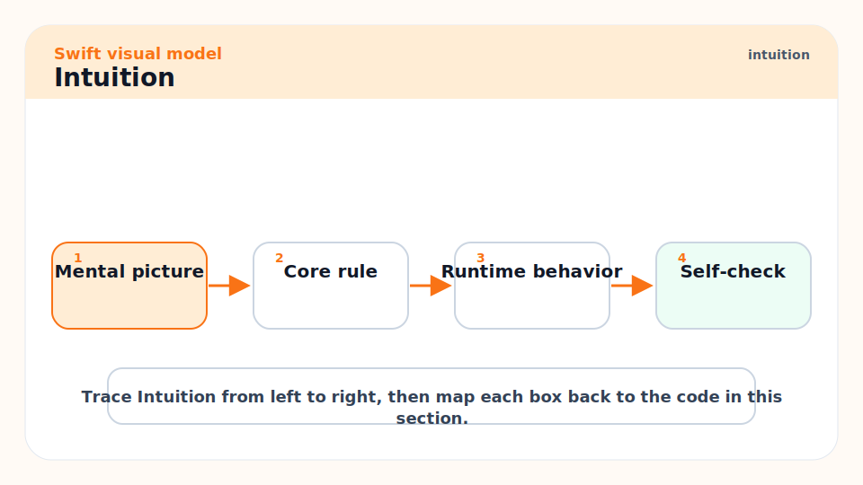
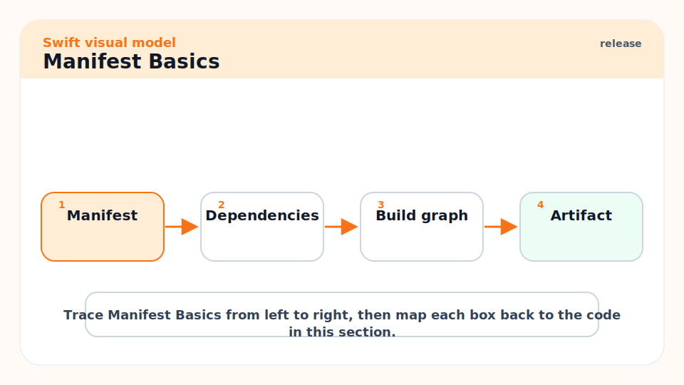
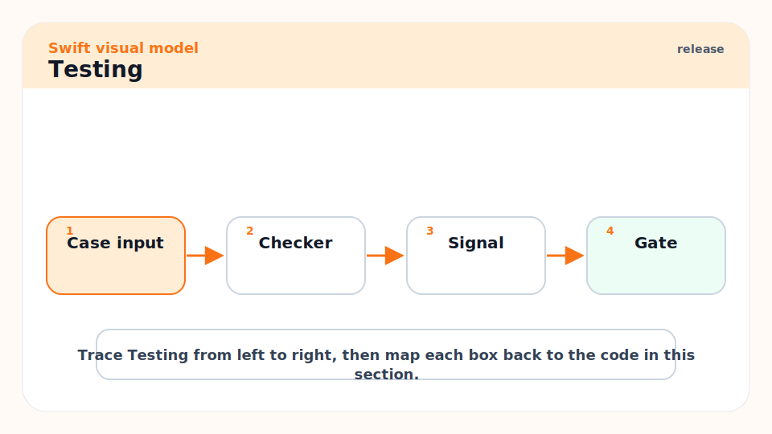
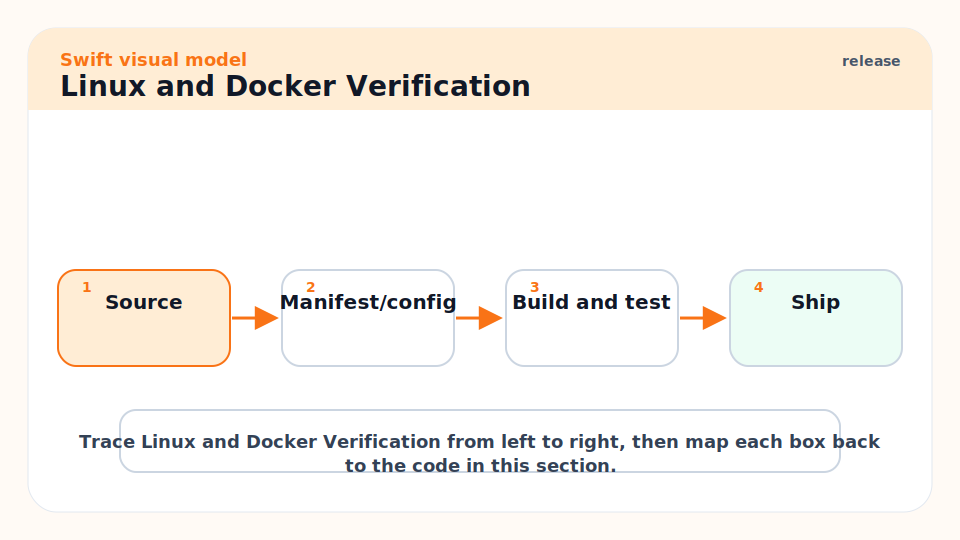
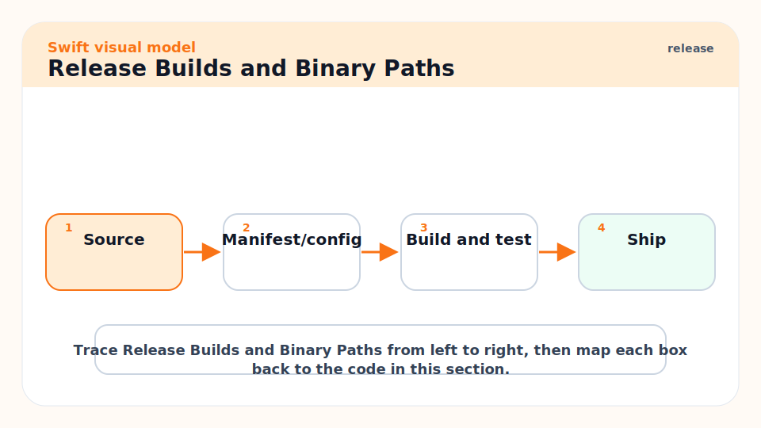
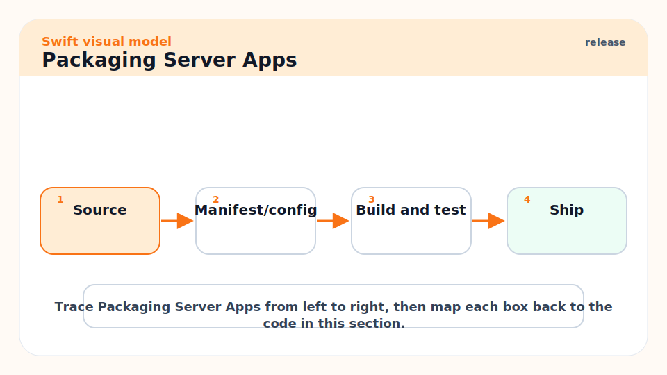
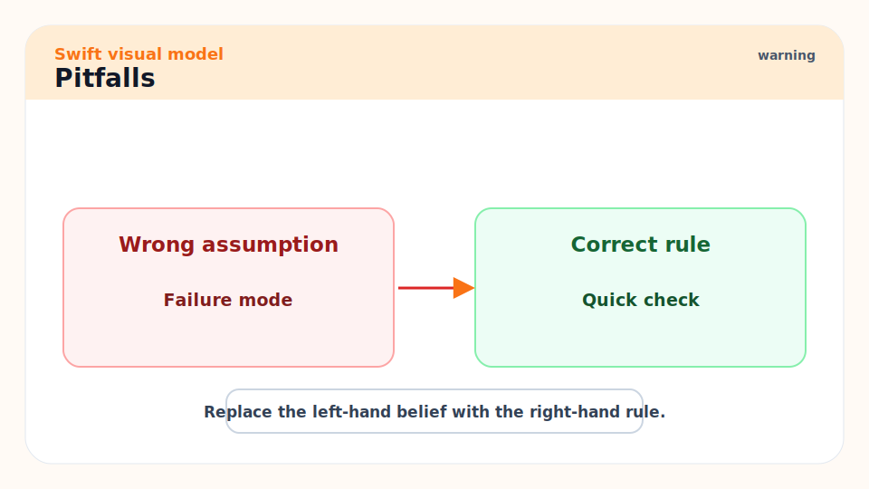
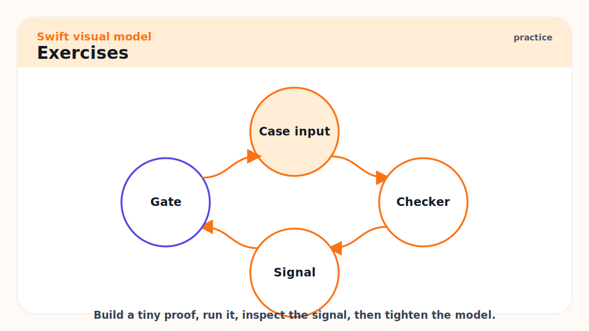

# 08 - SwiftPM, Testing, Compiling, and Shipping

[toc]

> **TL;DR:** SwiftPM is the standard command-line workflow for packages, libraries, tools, and server apps. Use `swift build`, `swift run`, `swift test`, release builds, sanitizers, Docker/Linux verification for server targets, and CI gates that reflect production.

## Real-World Example



Create a tiny executable package with a testable library target. This structure scales better than putting all logic in `main.swift`.

```bash
swift package init --type executable
swift build
swift run
swift test
swift build -c release
```

A simple package can expose logic from a library target and keep the executable thin.

```swift
public struct Slugifier {
    public init() {}

    public func slug(_ text: String) -> String {
        text
            .lowercased()
            .split { !$0.isLetter && !$0.isNumber }
            .joined(separator: "-")
    }
}
```

Then test behavior directly instead of testing through process output.

```swift
import Testing
@testable import MyLibrary

@Test func slug_removes_punctuation() {
    let slugifier = Slugifier()
    #expect(slugifier.slug("Hello, Swift!") == "hello-swift")
}
```

## Vocabulary



**Package**: A SwiftPM project defined by `Package.swift`.

---

**Target**: A build unit inside a package, such as a library, executable, test target, macro, or plugin target.

---

**Product**: What a package exposes to clients: usually a library or executable.

---

**Manifest**: The `Package.swift` file that declares products, targets, dependencies, platforms, and Swift settings.

---

**Debug build**: The default build mode. Faster to compile, easier to debug, much slower at runtime.

---

**Release build**: Optimized build mode created with `swift build -c release`.

---

**Sanitizer**: Runtime instrumentation for detecting memory and threading bugs, such as AddressSanitizer and ThreadSanitizer.

## Intuition



Treat SwiftPM as your repeatable automation surface. Xcode is excellent for Apple apps, but serious teams still need command-line build and test paths for CI, release automation, server deployment, and reproducible bug reports.

The production rule is simple: the closer the verification environment is to the shipping environment, the more trustworthy the result. If you deploy to Linux, test on Linux. If you care about performance, measure release builds. If concurrency is risky, run ThreadSanitizer.

## Package Layout


A clean package separates library code, executable entry points, and tests.

```text
Package.swift
Sources/
  MyLibrary/
    Slugifier.swift
  MyTool/
    main.swift
Tests/
  MyLibraryTests/
    SlugifierTests.swift
```

The executable should parse arguments, load config, call the library, and handle top-level errors. The library should contain the logic you test.

## Manifest Basics



The manifest is Swift code. Keep it boring unless the package has complex build needs.

```swift
// swift-tools-version: 6.0
import PackageDescription

let package = Package(
    name: "MyTool",
    platforms: [
        .macOS(.v14)
    ],
    products: [
        .executable(name: "mytool", targets: ["MyTool"])
    ],
    targets: [
        .target(name: "MyLibrary"),
        .executableTarget(
            name: "MyTool",
            dependencies: ["MyLibrary"]
        ),
        .testTarget(
            name: "MyLibraryTests",
            dependencies: ["MyLibrary"]
        )
    ]
)
```

## Testing



Modern Swift has XCTest and Swift Testing. Swift Testing gives expressive APIs such as `@Test` and `#expect`; XCTest remains deeply integrated and common in older projects and UI test setups.

```swift
import Testing

@Suite struct SlugifierTests {
    @Test func empty_input_returns_empty_slug() {
        let slugifier = Slugifier()
        #expect(slugifier.slug("") == "")
    }
}
```

For production confidence, run the tests several ways.

```bash
swift test
swift test --sanitize=thread
swift test --sanitize=address
swift test -c release
```

## Linux and Docker Verification



Server-side Swift and CLI tools often run on Linux. macOS code can accidentally import Apple-only APIs or assume Darwin behavior, so test in the target OS.

```bash
docker run --rm -v "$(pwd):/code" -w /code swift:latest swift test
docker run --rm -v "$(pwd):/code" -w /code swift:latest swift build -c release
```

## Release Builds and Binary Paths



Debug binaries are not suitable for production performance. Build release artifacts and ask SwiftPM for the binary path.

```bash
swift build -c release
swift build --show-bin-path -c release
```

For server apps, Swift.org recommends release mode and notes that cross-module optimization can improve performance but should be verified with performance tests.

```bash
swift build -c release -Xswiftc -cross-module-optimization
```

## Packaging Server Apps



For containerized server apps, build inside a Swift image, copy the release binary into a runtime image, and run only what you need.

```dockerfile
FROM swift:latest AS builder
WORKDIR /workspace
COPY . .
RUN swift build -c release --static-swift-stdlib

FROM debian:stable-slim
COPY --from=builder /workspace/.build/release/my-server /usr/local/bin/my-server
CMD ["my-server"]
```

## Pitfalls



- **Testing only from Xcode**: Keep a command-line `swift test` path green.
- **Shipping debug builds**: Debug builds can be dramatically slower.
- **Assuming macOS success means Linux success**: Foundation, filesystem, networking, and conditional imports can differ.
- **No sanitizer runs**: Thread and memory bugs are easier to catch before production.
- **Fat executable targets**: Move logic into library targets so tests do not need to drive the whole process.

## Exercises



1. Create a package with one library target, one executable target, and one test target.
2. Add a Swift Testing test with `@Test` and `#expect`.
3. Run `swift test`, `swift test --sanitize=thread`, and `swift build -c release`.
4. Write a Docker command that runs the test suite in `swift:latest`.

## Sources

- https://docs.swift.org/swiftpm/documentation/packagemanagerdocs/gettingstarted/
- https://docs.swift.org/swiftpm/documentation/packagemanagerdocs/swifttest/
- https://www.swift.org/packages/testing.html
- https://www.swift.org/documentation/server/guides/testing.html
- https://www.swift.org/documentation/server/guides/building.html
- https://www.swift.org/documentation/server/guides/packaging.html
- Conversation with user on 2026-06-07

## Related

- Previous: [07 - Concurrency: Async, Await, Actors, and Sendable](./07-concurrency-async-await-actors-and-sendable.md)
- Next: [09 - Apple App Architecture, Signing, TestFlight, and App Store Release](./09-apple-app-architecture-signing-testflight-and-app-store-release.md)
- Later: [10 - Senior-Level Swift Engineering Habits](./10-senior-level-swift-engineering-habits.md)

