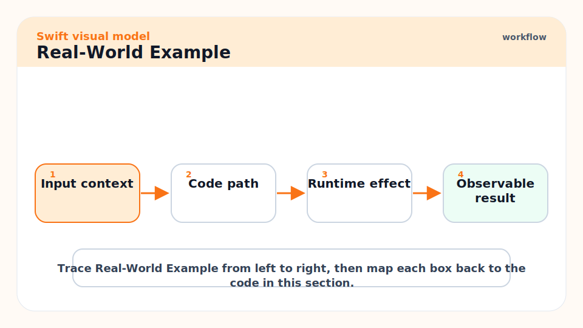
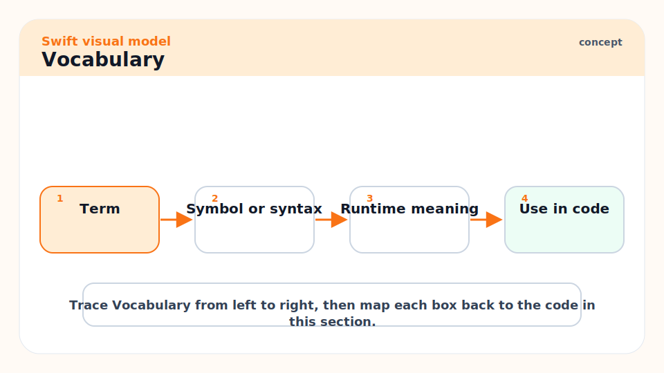
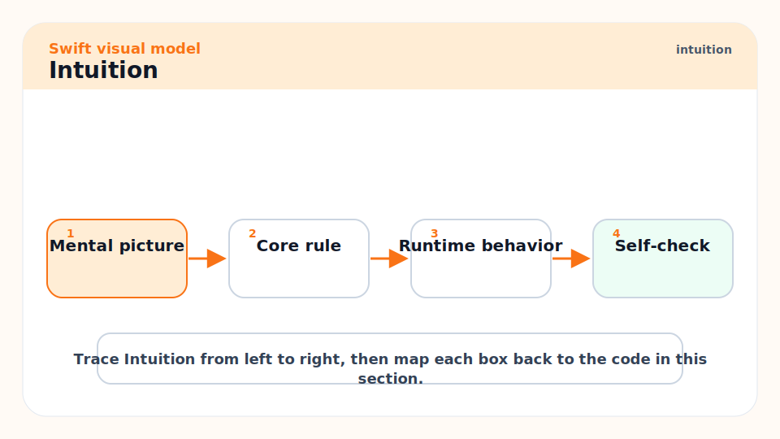
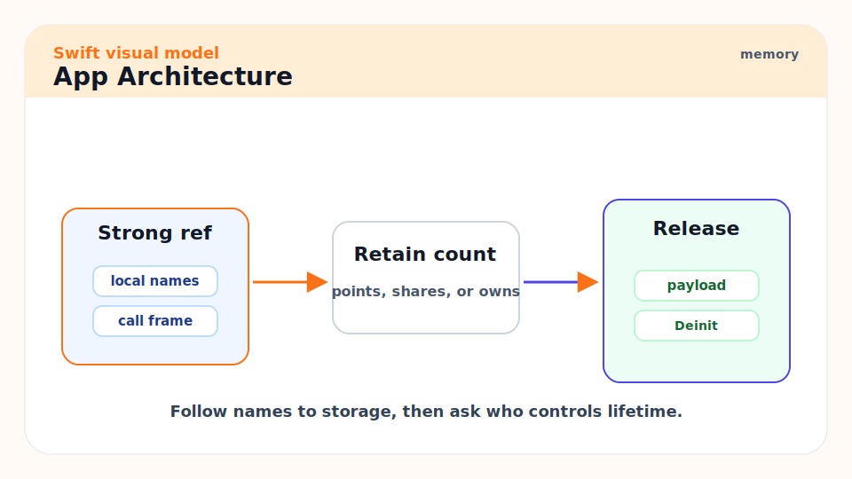
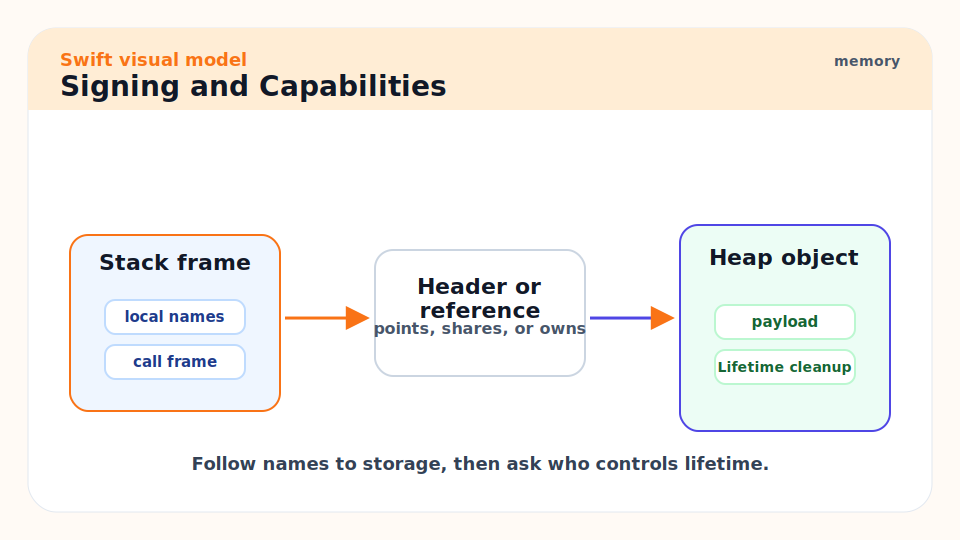
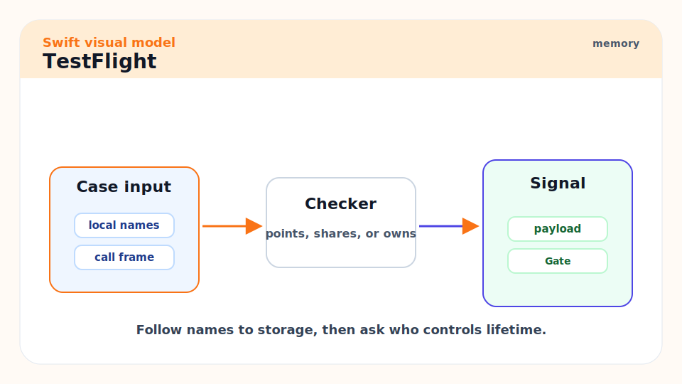
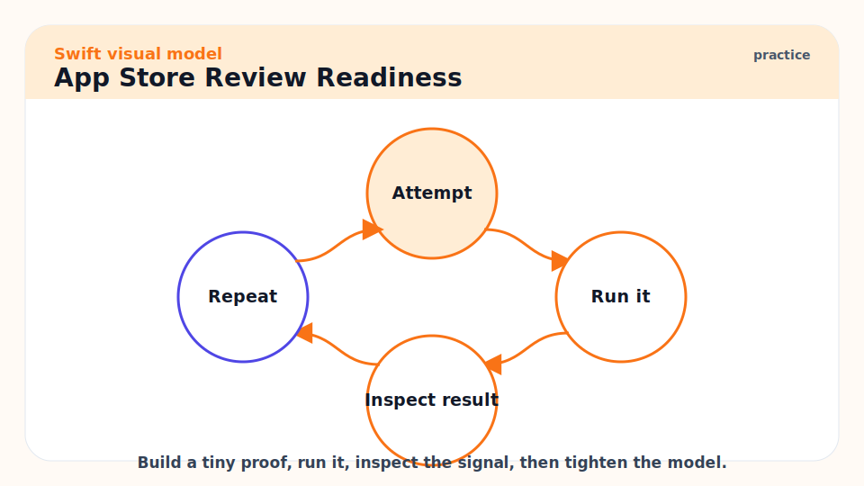
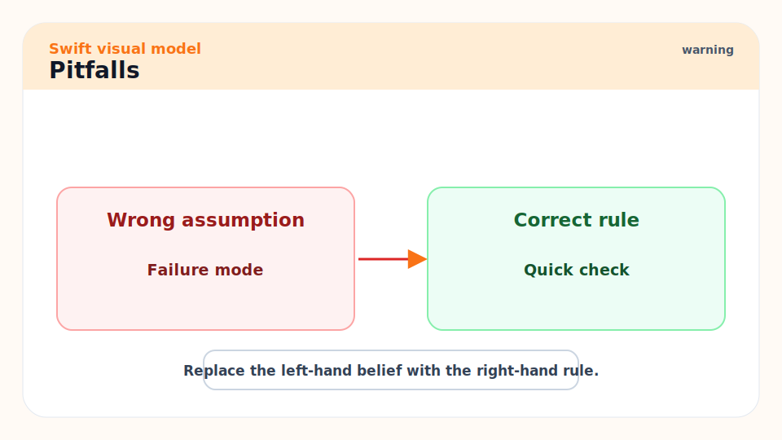
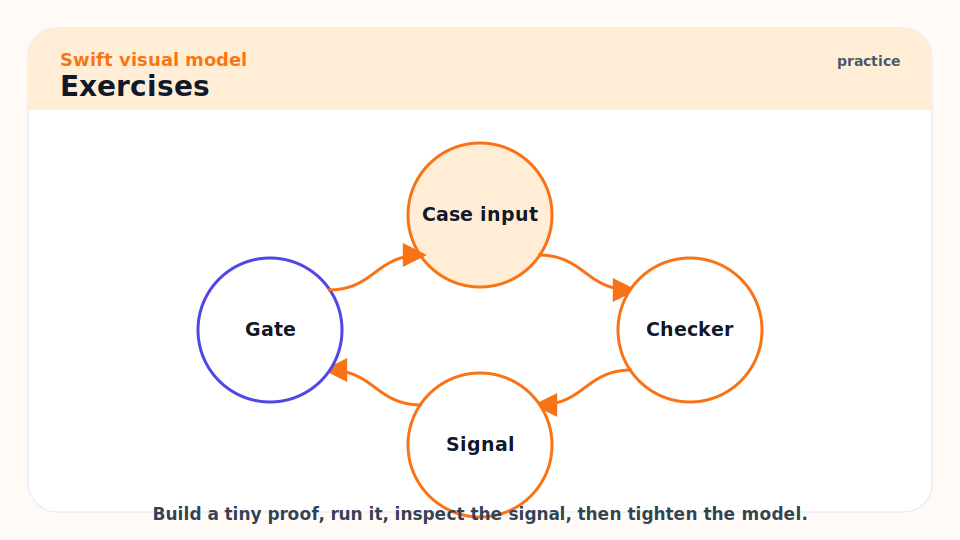

# 09 - Apple App Architecture, Signing, TestFlight, and App Store Release

[toc]

> **TL;DR:** Shipping an Apple-platform app is more than writing Swift. You need an architecture that keeps logic testable, an Xcode project that builds repeatably, correct signing and capabilities, archives, TestFlight feedback, App Store Connect metadata, and a release checklist.

## Real-World Example



This tiny SwiftUI view keeps display code separate from state logic. The view model is main-actor isolated because UI state belongs on the main actor.

```swift
import SwiftUI

@MainActor
final class CounterViewModel: ObservableObject {
    @Published private(set) var count = 0

    func increment() {
        count += 1
    }
}

struct CounterView: View {
    @StateObject private var viewModel = CounterViewModel()

    var body: some View {
        VStack(spacing: 12) {
            Text("Count: \(viewModel.count)")
            Button("Increment") {
                viewModel.increment()
            }
        }
        .padding()
    }
}
```

The releasable workflow is not this code alone. You still need a scheme, signing, an archive, validation, upload, TestFlight, and review.

```bash
xcodebuild -scheme MyApp -configuration Release build
xcodebuild test -scheme MyApp -destination 'platform=iOS Simulator,name=iPhone 16'
```

## Vocabulary



**Scheme**: Xcode's named build/test/archive configuration for a product.

---

**Target**: A buildable unit in Xcode, such as an app, framework, extension, or test bundle.

---

**Bundle identifier**: The reverse-DNS app identity used for signing and App Store Connect records.

---

**Entitlements**: Signed permissions for app capabilities such as iCloud, push notifications, app groups, or keychain access.

---

**Provisioning profile**: A signing asset that ties together app ID, team, certificate, entitlements, and allowed devices or distribution method.

---

**Archive**: A release build bundle with metadata and debug symbols managed by Xcode Organizer.

---

**TestFlight**: Apple's beta distribution path through App Store Connect.

## Intuition



Apple app shipping has two parallel tracks: code quality and distribution correctness. Code quality asks: can we test the core logic, preserve UI responsiveness, and handle lifecycle edges? Distribution correctness asks: is this exact binary signed, archived, uploaded, symbolicated, and review-ready?

Do not wait until the end to learn signing. A build can compile perfectly and still fail distribution because the bundle ID, capabilities, team, certificate, provisioning profile, or App Store Connect record is wrong.

## App Architecture



Keep framework-specific code at the edge. Put domain logic in plain Swift types that can be tested without booting the full app.

```text
App target
  SwiftUI views
  App lifecycle
  navigation and presentation

Feature modules
  view models
  reducers or coordinators
  API clients

Core modules
  domain models
  validation
  persistence adapters
  pure business logic
```

For small apps, this can live in one Xcode project. For larger apps, use Swift packages or framework targets to keep dependencies honest.

## Signing and Capabilities



Automatic signing is usually the right starting point. Xcode can create and update development signing assets when the project has the correct team and bundle identifier. Manual signing is for CI, enterprise workflows, or teams that need explicit profile control.

Before archive day, verify:

- The app target has the intended team selected.
- The bundle identifier matches the App Store Connect app record.
- Capabilities match the entitlements your app actually uses.
- Release configuration builds on a clean checkout.
- Tests run on the supported simulator or device destinations.

> [!WARNING]
> Signing errors often come from stale profiles, mismatched teams, duplicate certificates, or entitlements that changed after the profile was created. Treat signing assets as release inputs, not random Xcode magic.

## Archive and Upload


The normal Xcode path is Product -> Archive, then Organizer -> Distribute App. Apple's documentation describes exporting the archive for non-App-Store distribution or uploading to App Store Connect for TestFlight and App Store release.

The common release path is:

1. Increment version and build number.
2. Run unit, integration, and UI tests.
3. Archive in Release configuration.
4. Validate the archive.
5. Upload to App Store Connect.
6. Distribute to TestFlight.
7. Collect feedback and crash reports.
8. Submit for App Review.
9. Release manually or automatically.

## TestFlight



Use TestFlight before App Review. Internal testing catches signing, launch, entitlement, and device-family mistakes. External testing catches onboarding, privacy, and real-user workflow problems.

Keep beta notes short and action-oriented:

```text
Build 42
- Reworked onboarding validation.
- Fixed sign-in retry after network timeout.
- Please test account creation and password reset.
```

## App Store Review Readiness



Before submission, review the parts that commonly cause delays:

- Privacy nutrition labels match actual data collection.
- Permission prompts explain value before the system prompt appears.
- Sign-in, account deletion, support, and subscription flows work.
- Demo credentials are provided if review needs an account.
- Crashes are symbolicated and top crashers are fixed.
- App metadata, screenshots, age rating, and review notes are accurate.

## Pitfalls



- **Business logic trapped in views**: It becomes hard to test and easy to break.
- **One giant app target**: Build times and dependency boundaries decay.
- **Manual signing without documentation**: Future releases become fragile.
- **Skipping TestFlight**: The first install outside your machine should not be App Review.
- **Only testing happy paths**: Review and users find permission denial, offline mode, expired sessions, and first-launch issues.

## Exercises



1. Sketch an app into UI, feature, and core layers.
2. Identify which code could live in a Swift package and be tested with `swift test`.
3. Write a release checklist for version, build number, signing, archive, upload, TestFlight, and review.
4. Explain automatic versus manual signing in your own words.

## Sources

- https://developer.apple.com/documentation/xcode/distributing-your-app-for-beta-testing-and-releases
- https://help.apple.com/xcode/mac/current/en.lproj/dev31de635e5.html
- https://help.apple.com/xcode/mac/current/en.lproj/dev442d7f2ca.html
- https://help.apple.com/xcode/mac/current/en.lproj/dev60b6fbbc7.html
- https://developer.apple.com/tutorials/develop-in-swift/test-your-beta-app
- Conversation with user on 2026-06-07

## Related

- Previous: [08 - SwiftPM, Testing, Compiling, and Shipping](./08-swiftpm-testing-compiling-and-shipping.md)
- Next: [10 - Senior-Level Swift Engineering Habits](./10-senior-level-swift-engineering-habits.md)
- Earlier: [07 - Concurrency: Async, Await, Actors, and Sendable](./07-concurrency-async-await-actors-and-sendable.md)

