# 10 - Senior-Level Swift Engineering Habits

[toc]

> **TL;DR:** Senior Swift is less about knowing obscure syntax and more about making correctness cheap: precise types, clear APIs, isolated mutation, measured performance, small testable modules, explicit failure, safe concurrency, and boring release workflows.

## Real-World Example

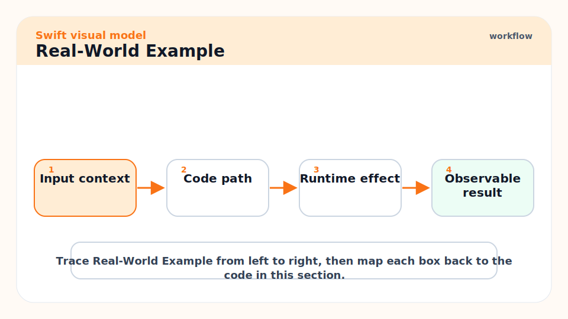

This example shows a small but senior-shaped boundary: typed input, explicit errors, dependency injection, async work, and testable behavior.

```swift
struct UserID: Hashable, Sendable {
    let rawValue: String
}

struct UserProfile: Equatable, Sendable {
    let id: UserID
    let displayName: String
}

enum ProfileError: Error, Equatable {
    case emptyID
    case notFound(UserID)
}

protocol ProfileClient: Sendable {
    func fetchProfile(id: UserID) async throws -> UserProfile
}

struct ProfileService<Client: ProfileClient>: Sendable {
    let client: Client

    func profile(id rawID: String) async throws -> UserProfile {
        guard !rawID.isEmpty else {
            throw ProfileError.emptyID
        }

        return try await client.fetchProfile(id: UserID(rawValue: rawID))
    }
}
```

The point is not complexity. The point is that invalid IDs, async failure, dependency boundaries, and concurrency transfer are visible in the types.

## Vocabulary

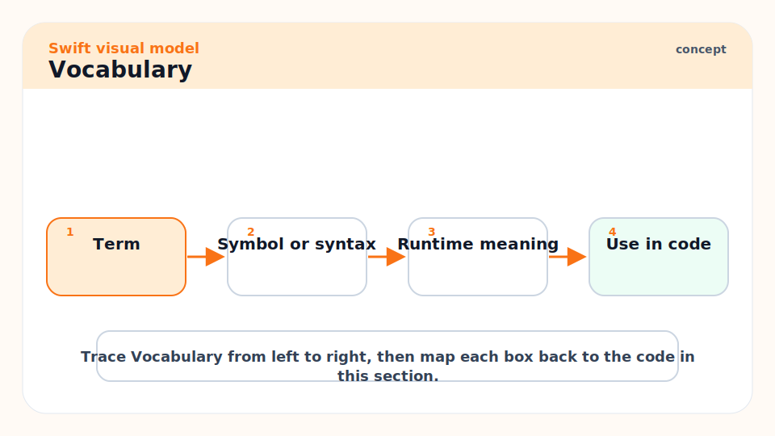

**Invariant**: A rule that must always hold true, such as "a user ID is never empty."

---

**Boundary**: A seam between domains, modules, processes, frameworks, or trust levels.

---

**Dependency injection**: Passing dependencies into a type instead of constructing them internally.

---

**Observability**: The logs, metrics, traces, crash reports, and profiles that explain production behavior.

---

**Footgun**: Code that is legal but likely to hurt correctness, performance, security, or maintainability.

---

**Measured optimization**: Performance work guided by profiling data rather than guesses.

## Intuition

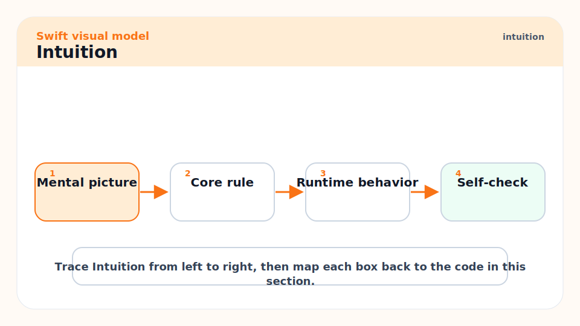

Senior-level Swift is the discipline of moving mistakes left. A beginner handles nil after a crash. A senior designs a non-optional field when absence is invalid. A beginner adds `@unchecked Sendable` to quiet the compiler. A senior changes ownership so the compiler can prove the transfer is safe.

The senior move is usually not a clever abstraction. It is often a smaller type, a clearer name, less shared state, a better test, or a release checklist that prevents an entire class of mistakes.

## Design Rules That Age Well

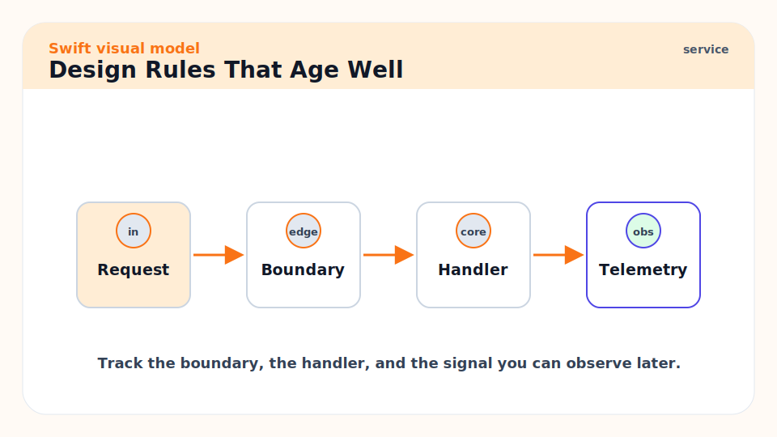

Use these defaults until the code gives you a concrete reason to deviate:

| Situation | Default |
| :--- | :--- |
| Data model | `struct` |
| Finite state | `enum` with associated values |
| Shared mutable identity | `final class` or `actor` |
| Cross-concurrency transfer | immutable `Sendable` value |
| UI state | `@MainActor` boundary |
| Domain failure | typed `Error` |
| External dependency | protocol or generic boundary when tests need it |
| Performance work | profile release build first |
| Public API | clarity at use site |

## Make Illegal States Unrepresentable

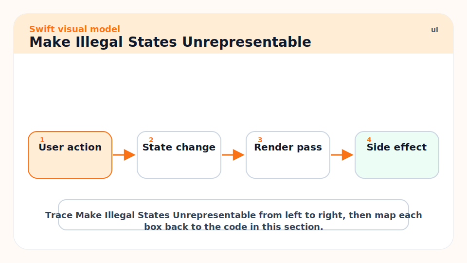

Do not represent a workflow with disconnected booleans if only a few combinations are valid. This example imports Foundation because the finished state stores a `URL`.

```swift
import Foundation

enum UploadState {
    case idle
    case uploading(progress: Double)
    case finished(remoteURL: URL)
    case failed(message: String)
}
```

This model prevents nonsense states like "uploading and finished at the same time."

## Keep Mutation Isolated

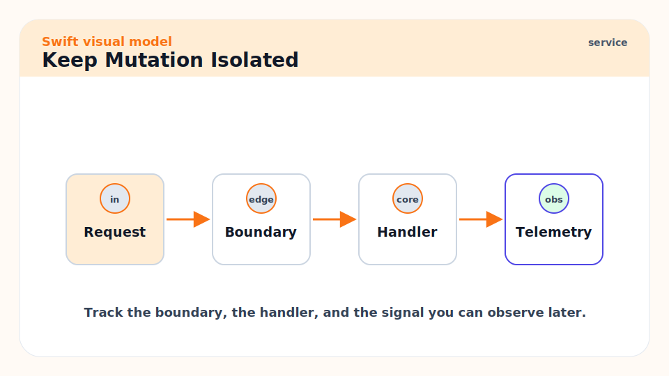

Shared mutable state is where bugs hide. Keep mutation local, isolate it behind actors, or make it explicit with a reference type whose purpose is identity.

```swift
actor TokenStore {
    private var token: String?

    func update(_ token: String?) {
        self.token = token
    }

    func currentToken() -> String? {
        token
    }
}
```

## Design APIs At The Use Site

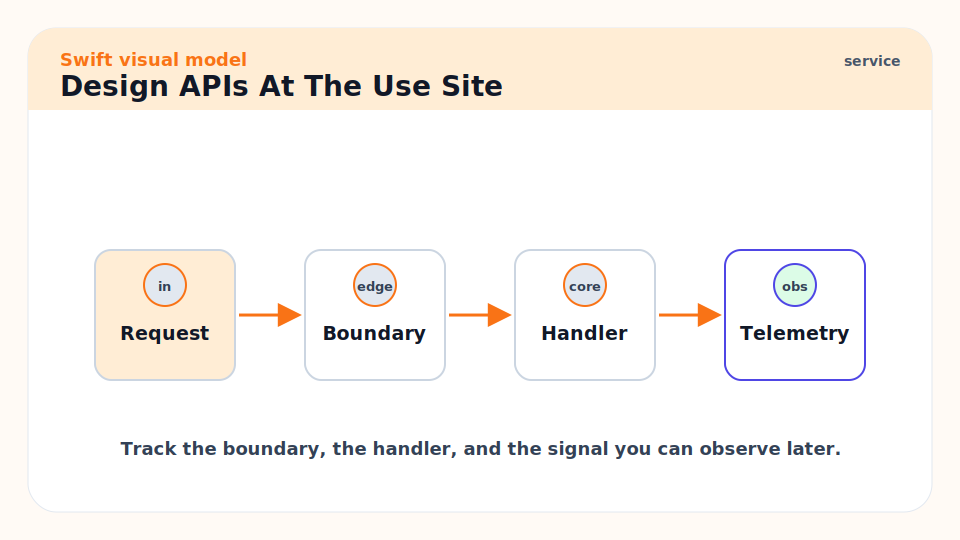

Read the call, not only the declaration. Swift's API guidelines prioritize clarity at the point of use.

```swift
// Better:
calendar.date(byAdding: .day, value: 7, to: startDate)

// Worse:
calendar.add(.day, 7, startDate)
```

## Test The Contract, Not The Implementation

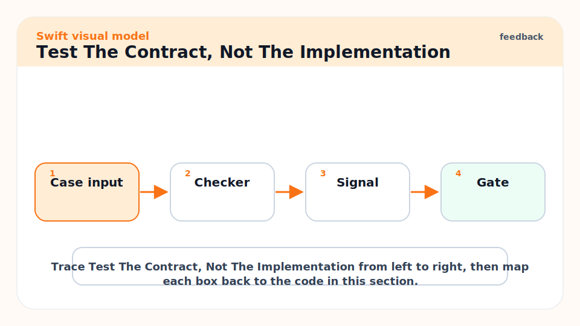

Good tests describe behavior and edge cases. They avoid snapshotting private implementation details unless the output itself is the product. The fake client below keeps the test focused on validation rather than network behavior.

```swift
import Testing

struct FakeProfileClient: ProfileClient {
    func fetchProfile(id: UserID) async throws -> UserProfile {
        UserProfile(id: id, displayName: "Test User")
    }
}

@Test func service_rejects_empty_id() async {
    let service = ProfileService(client: FakeProfileClient())

    await #expect(throws: ProfileError.emptyID) {
        try await service.profile(id: "")
    }
}
```

## Performance Habits

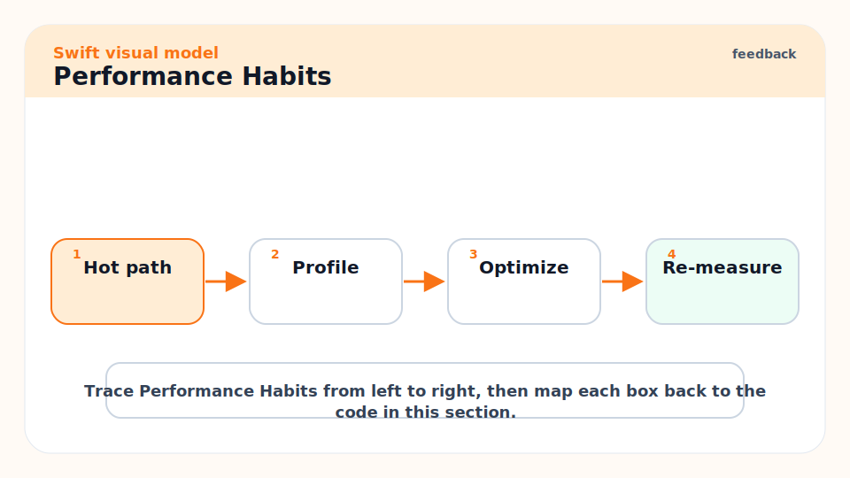

Swift performance work starts with release builds and profiling. Focus on allocations, ARC traffic, collection copying, string processing, bridging, and unnecessary actor hops.

```bash
swift build -c release
swift test -c release
swift test --sanitize=thread
swift test --sanitize=address
```

For server apps, Swift.org's guides point to allocation analysis, memory leak debugging, and production release builds. For Apple apps, Instruments is the practical tool for allocations, time profiling, leaks, hangs, and energy.

## Review Checklist

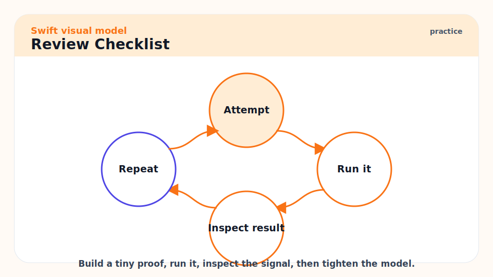

Use this checklist when reviewing Swift code:

- Are optionals modeling real absence?
- Are force unwraps justified by true invariants?
- Are enums used for finite states?
- Are classes needed for identity?
- Can object graphs form retain cycles?
- Do closures capture only what they need?
- Is mutable state isolated?
- Are concurrency boundaries `Sendable` or actor-protected?
- Are public names clear at the call site?
- Do tests cover failure, nil, cancellation, and edge sizes?
- Is production code built and measured in release mode?
- Does the release path include signing, archive, upload, and rollback thinking?

## Pitfalls

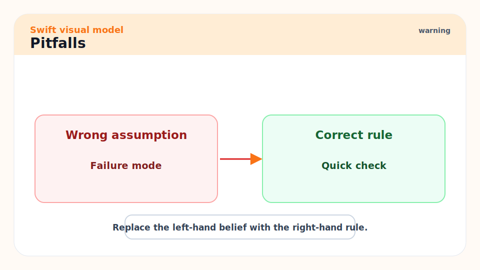

- **Abstraction before pressure**: Add a protocol, generic, or module only when it solves a real problem.
- **Silencing compiler diagnostics**: Force unwraps, `try!`, `as!`, and `@unchecked Sendable` should trigger design review.
- **Ignoring cancellation**: Async work should know what happens if the user leaves, a request times out, or a task is cancelled.
- **Stringly typed domains**: IDs, states, roles, and permissions deserve types.
- **Optimizing by folklore**: Measure. Swift's optimizer can make naive-looking code fast and clever-looking code slow.

## Exercises

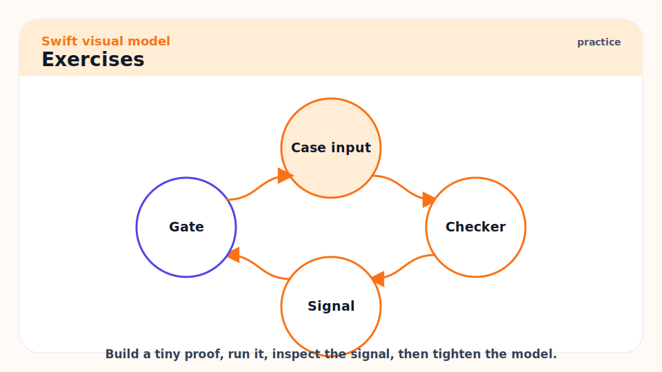

1. Take one dictionary-based model and replace it with typed structs and enums.
2. Audit a class for retain cycles caused by stored closures or delegates.
3. Write one behavior test for a failure path.
4. Profile one release build before changing performance-sensitive code.
5. Review one async function and identify every suspension point.

## Sources

- https://www.swift.org/documentation/api-design-guidelines/
- https://www.swift.org/migration/
- https://www.swift.org/documentation/server/guides/allocations.html
- https://www.swift.org/documentation/server/guides/memory-leaks-and-usage.html
- https://www.swift.org/documentation/server/guides/testing.html
- https://www.swift.org/blog/swift-6.3-released/
- Conversation with user on 2026-06-07

## Related

- Previous: [09 - Apple App Architecture, Signing, TestFlight, and App Store Release](./09-apple-app-architecture-signing-testflight-and-app-store-release.md)
- Earlier: [06 - Memory, ARC, Value Semantics, and Copy-on-Write](./06-memory-arc-value-semantics-and-copy-on-write.md)
- Earlier: [07 - Concurrency: Async, Await, Actors, and Sendable](./07-concurrency-async-await-actors-and-sendable.md)
