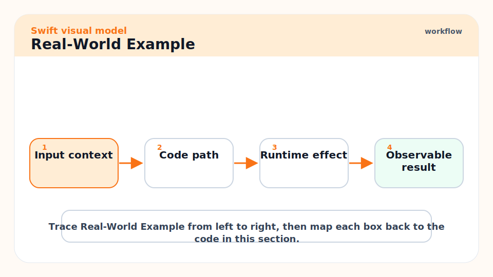
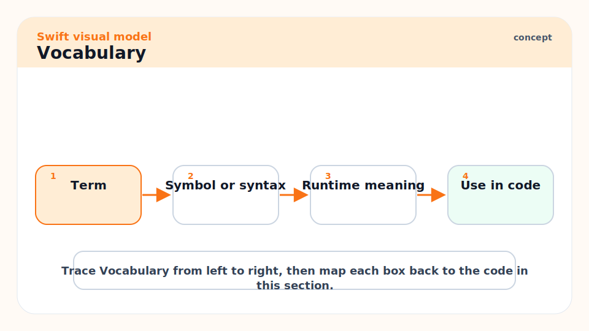
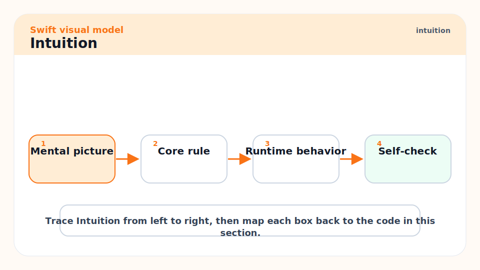
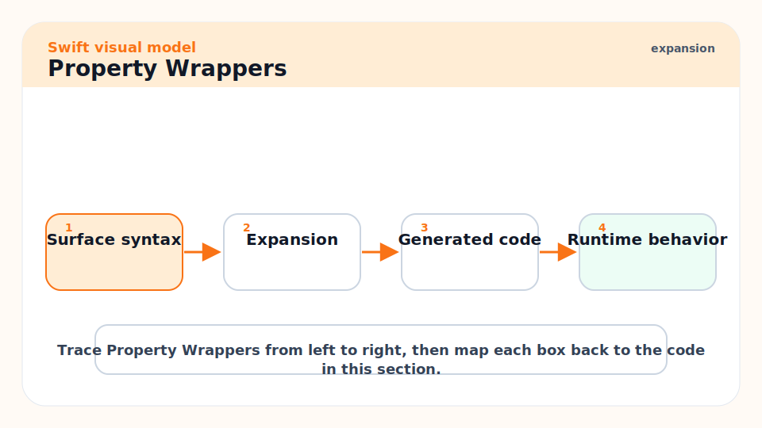
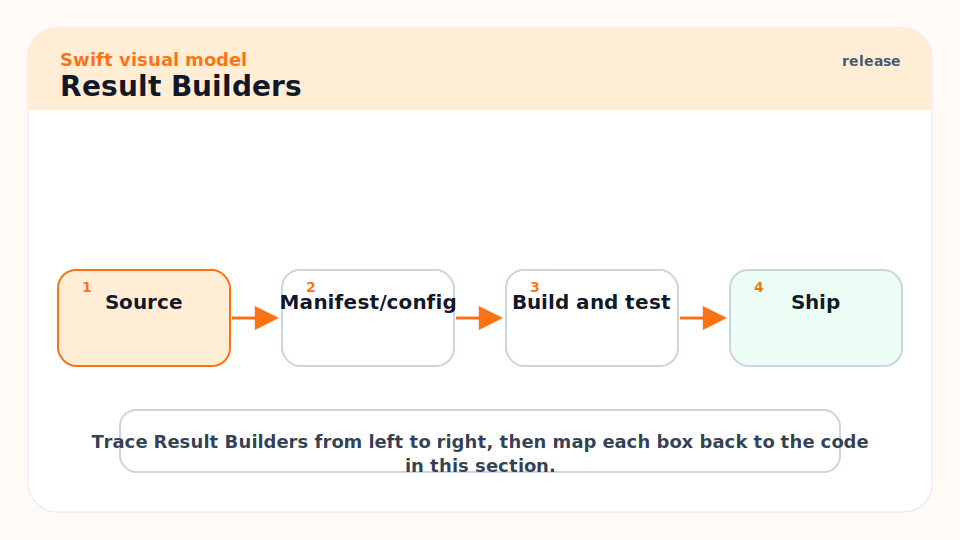
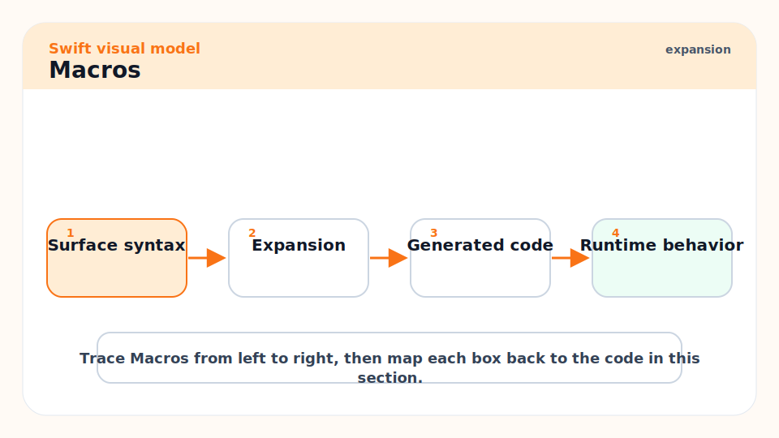
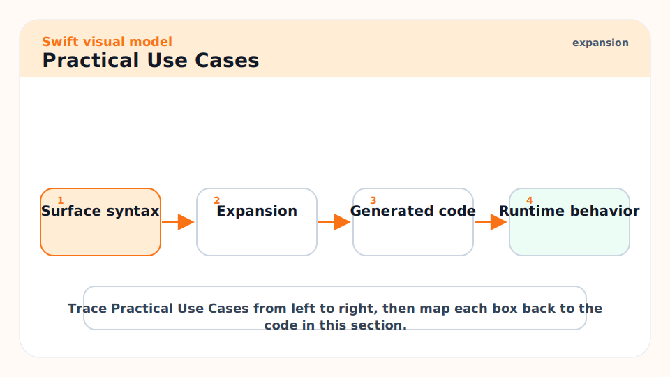
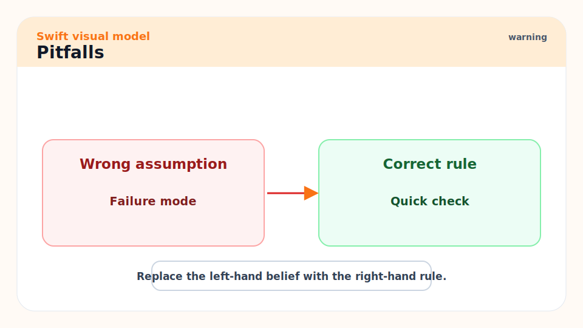
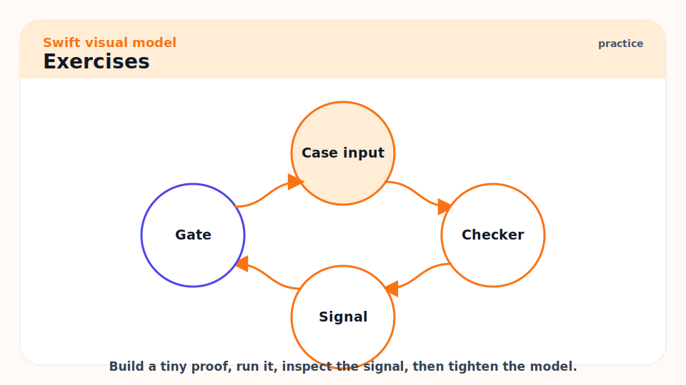

# 14 - Macros, Property Wrappers, and Metaprogramming

[toc]

> **TL;DR:** Swift metaprogramming is compile-time code generation with guardrails. Property wrappers change storage access patterns, result builders shape DSLs, and macros add code during compilation without deleting or rewriting existing source.

## Real-World Example



This example uses a property wrapper to centralize clamping logic. Callers see a normal property, while the wrapper controls assignment.

```swift
@propertyWrapper
struct Clamped {
    private var value: Double
    let range: ClosedRange<Double>

    init(wrappedValue: Double, _ range: ClosedRange<Double>) {
        self.range = range
        self.value = min(max(wrappedValue, range.lowerBound), range.upperBound)
    }

    var wrappedValue: Double {
        get { value }
        set { value = min(max(newValue, range.lowerBound), range.upperBound) }
    }
}

struct DownloadProgress {
    @Clamped(0...1) var fraction: Double = 0
}

var progress = DownloadProgress()
progress.fraction = 2
print(progress.fraction)
```

## Vocabulary



**Property wrapper**: A type annotated with `@propertyWrapper` that controls storage and access for a property.

---

**Projected value**: Extra wrapper-provided API exposed with `$propertyName`.

---

**Result builder**: A type that lets Swift transform block syntax into builder method calls, used heavily by SwiftUI.

---

**Macro**: Compile-time transformation that adds generated Swift code.

---

**Freestanding macro**: A macro called with `#name(...)`, such as `#warning`.

---

**Attached macro**: A macro attached to a declaration with attribute syntax, such as `@Observable`.

## Intuition



Metaprogramming should remove repetition without hiding the model. The danger is not that macros or wrappers are bad. The danger is making code harder to reason about than the boilerplate it replaced.

Swift macros are additive. They add generated declarations or expressions; they do not delete or mutate existing source. The compiler type-checks both the macro input and the expanded output, which keeps the feature more disciplined than text substitution.

## Property Wrappers



Use wrappers when many properties share the same storage policy: clamping, validation, persistence, locking, environment lookup, or observation. This example imports Foundation for string trimming character sets.

```swift
import Foundation

@propertyWrapper
struct Trimmed {
    private var value: String = ""

    var wrappedValue: String {
        get { value }
        set { value = newValue.trimmingCharacters(in: .whitespacesAndNewlines) }
    }
}

struct Form {
    @Trimmed var name: String
}
```

> [!WARNING]
> Property wrappers can hide work behind assignment. Avoid wrappers that perform surprising IO, network calls, or expensive computation.

## Result Builders



Result builders are why SwiftUI can express a view tree as nested declarations. You can use them for DSLs, but most app code should consume builders more often than it creates them.

```swift
@resultBuilder
enum StringListBuilder {
    static func buildBlock(_ parts: String...) -> [String] {
        parts
    }
}

func makeList(@StringListBuilder _ build: () -> [String]) -> [String] {
    build()
}

let items = makeList {
    "one"
    "two"
    "three"
}
```

## Macros



Macros are declared separately from their implementation. The implementation runs during compilation. SwiftPM can create a macro package template.

```bash
swift package init --type macro
```

Use macros when generation needs syntax awareness and type checking. Do not use a macro when a function, generic type, property wrapper, or protocol extension is enough.

## Practical Use Cases



Good uses:

- Generating repetitive conformances.
- Validating literals at compile time.
- Building typed API surfaces from structured declarations.
- Reducing boilerplate in observation, serialization, routing, or testing.

Bad uses:

- Hiding business logic.
- Replacing simple functions.
- Generating code that developers cannot inspect or debug.
- Smuggling global state into otherwise pure-looking declarations.

## Pitfalls



- **Magic over clarity**: Generated code still has to be understood during debugging.
- **Wrapper side effects**: Assignment should not unexpectedly block, allocate heavily, or perform IO.
- **Macro build cost**: Macro implementations are compiler plugins and affect build behavior.
- **Poor error messages**: A macro that fails should produce diagnostics a caller can act on.
- **DSL addiction**: Not every domain deserves custom syntax.

## Exercises



1. Build a `@Trimmed` property wrapper and test assignment behavior.
2. Add a projected value to expose whether the original value changed.
3. Write a tiny result builder for arrays of validation rules.
4. Look at a macro-generated API and inspect the expanded source if your tooling supports it.

## Sources

- https://docs.swift.org/swift-book/documentation/the-swift-programming-language/properties/
- https://docs.swift.org/swift-book/documentation/the-swift-programming-language/macros/
- https://docs.swift.org/swift-book/ReferenceManual/Attributes.html
- https://www.swift.org/blog/swift-6.3-released/
- Conversation with user on 2026-06-07

## Related

- Previous: [13 - Access Control, Modules, Packages, and DocC](./13-access-control-modules-packages-and-docc.md)
- Next: [15 - Interoperability, Unsafe Memory, and Embedded Swift](./15-interoperability-unsafe-memory-and-embedded-swift.md)
- Earlier: [05 - Generics, Existentials, and API Design](./05-generics-existentials-and-api-design.md)
