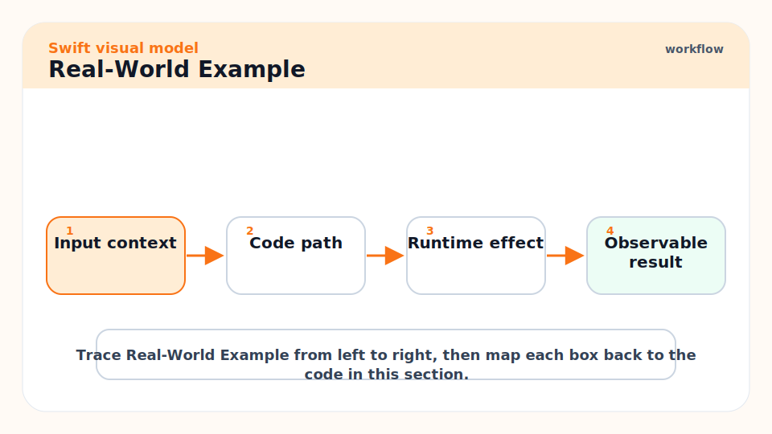
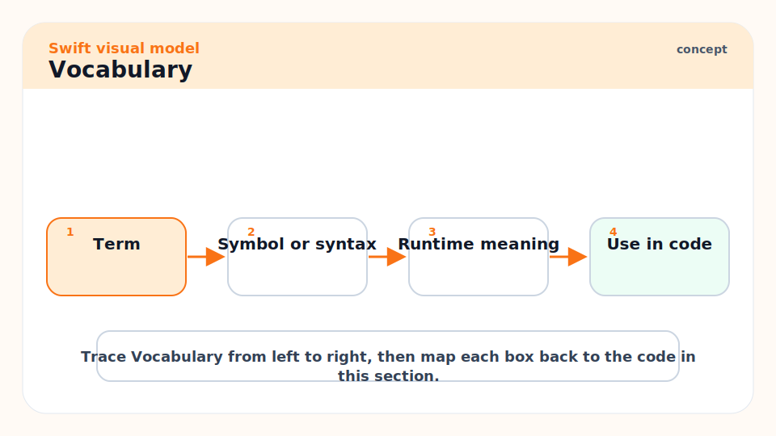
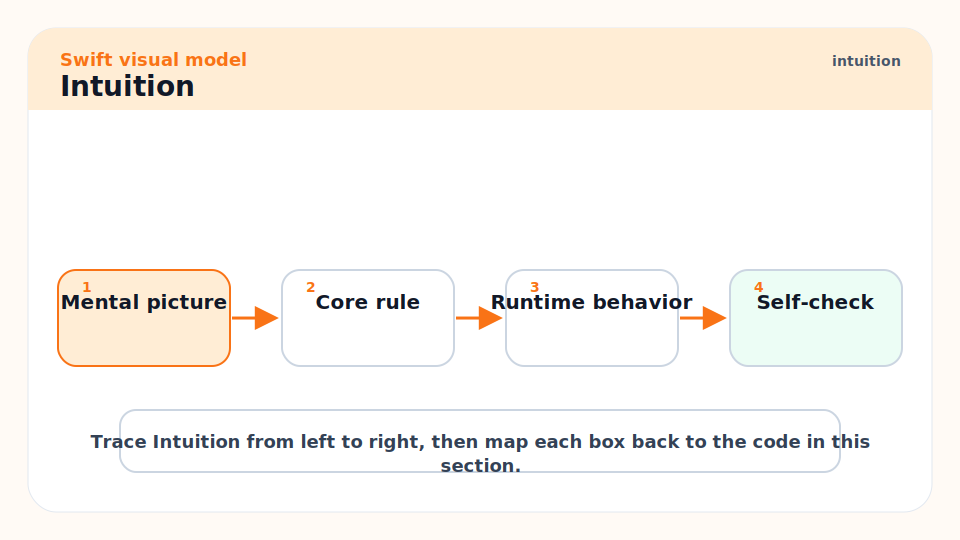
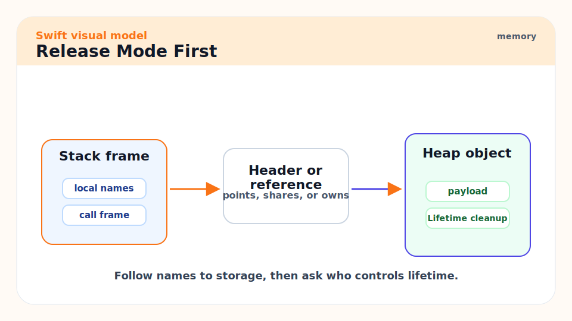
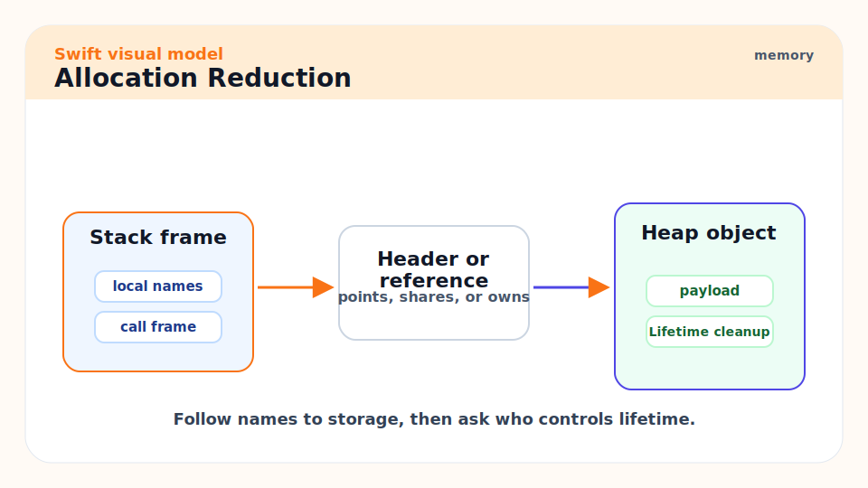
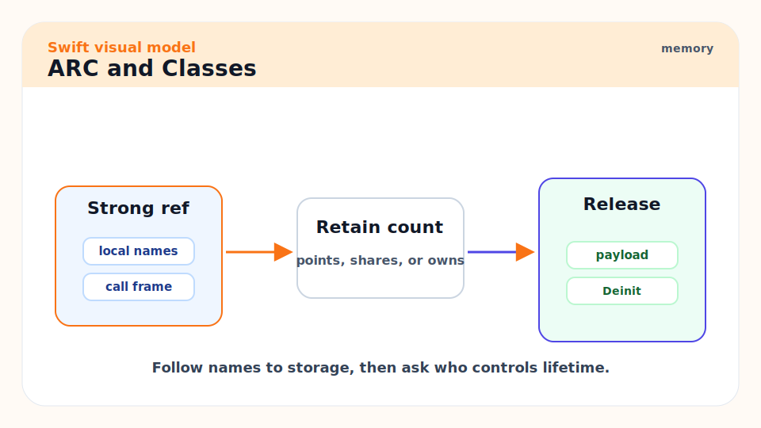
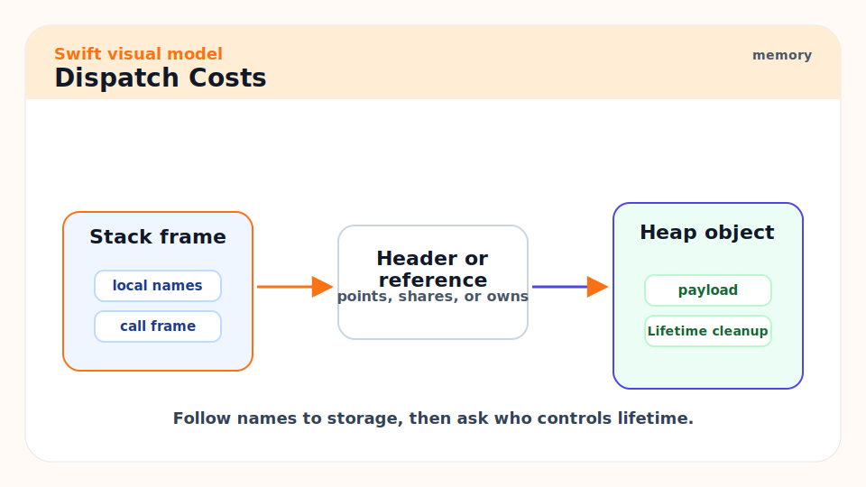
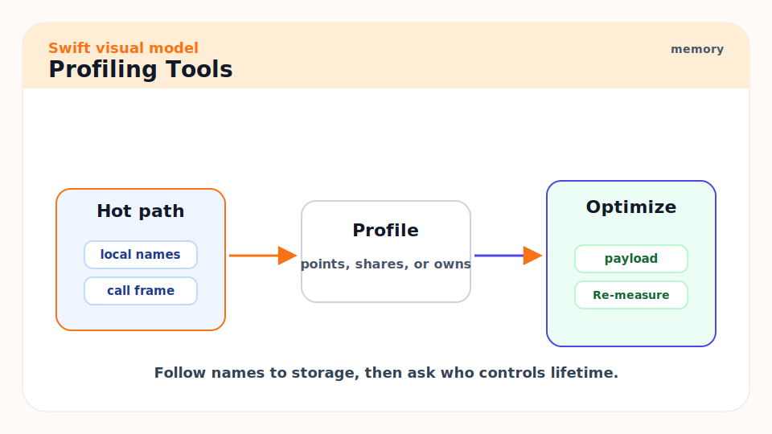
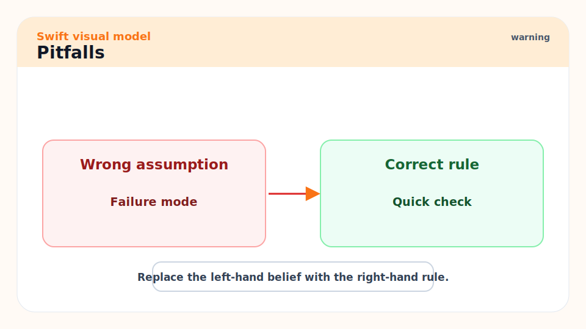
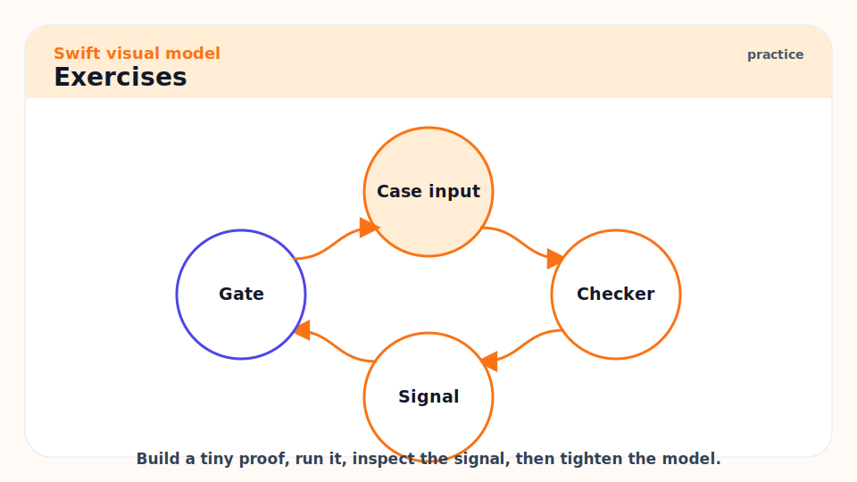

# 16 - Performance, Profiling, Allocations, and Optimization

[toc]

> **TL;DR:** Swift performance work should be measured, release-mode, and workload-specific. Watch allocations, ARC traffic, string and collection copies, protocol dispatch, actor hops, bridging, and algorithmic complexity before reaching for unsafe code.

## Real-World Example



This example avoids repeated intermediate arrays by using a single reduction. It is still readable, and it gives the optimizer fewer allocations to manage.

```swift
let values = Array(1...1_000)

let sumOfEvenSquares = values.reduce(into: 0) { total, value in
    guard value.isMultiple(of: 2) else { return }
    total += value * value
}

print(sumOfEvenSquares)
```

## Vocabulary



**Hot path**: Code that runs frequently enough to affect latency, throughput, battery, or memory.

---

**Allocation**: Reserving heap memory. Allocations can trigger ARC work and cache misses.

---

**ARC traffic**: Retain and release operations inserted to manage class lifetimes.

---

**Inlining**: Replacing a function call with the function body during optimization.

---

**Specialization**: Generating optimized code for a concrete generic type.

---

**Bridging**: Conversion between Swift and Objective-C/Foundation representations.

---

**Flame graph**: A profile visualization showing where CPU time is spent.

## Intuition



Performance is a product property, not a personality trait of code. A beautiful abstraction in a cold path is fine. A tiny allocation in a million-iteration hot path can dominate. The senior move is to measure before changing design.

Swift's optimizer is strong. Clean, direct Swift often optimizes better than hand-clever code. Unsafe APIs are a last resort after algorithmic fixes, data layout fixes, and measured allocation reductions.

## Release Mode First



Debug builds are for debugging, not performance truth.

```bash
swift build -c release
swift test -c release
```

For server apps, Swift.org explicitly recommends production code in release mode. Cross-module optimization can help, but verify with benchmarks.

```bash
swift build -c release -Xswiftc -cross-module-optimization
```

## Allocation Reduction



Use `reduce(into:)` when building an accumulated result so the accumulator can be mutated in place.

```swift
let grouped = ["a", "bb", "c"].reduce(into: [Int: [String]]()) { result, value in
    result[value.count, default: []].append(value)
}

print(grouped)
```

Use `reserveCapacity` when you can estimate final size.

```swift
var output: [Int] = []
output.reserveCapacity(10_000)

for value in 0..<10_000 {
    output.append(value)
}
```

## ARC and Classes



ARC is usually cheap, but retain/release traffic in tight loops can matter. Prefer value types for simple data, avoid unnecessary boxing, and keep class reference lifetimes clear.

```swift
struct Point {
    var x: Double
    var y: Double
}
```

## Dispatch Costs



Dynamic dispatch, existential dispatch, and generic specialization all have tradeoffs. Do not rewrite APIs blindly. In public libraries, API clarity and resilience matter too.

```swift
protocol Scorer {
    func score(_ value: Int) -> Int
}

struct DoubleScorer: Scorer {
    func score(_ value: Int) -> Int { value * 2 }
}
```

For a hot generic path, a generic parameter may preserve more static type information than `any Scorer`.

## Profiling Tools



Use the tool that matches the platform:

- Apple apps: Instruments Time Profiler, Allocations, Leaks, Hangs, Energy.
- SwiftPM/server on Linux: release builds, `perf`, allocation tools, logging, metrics.
- Concurrency issues: ThreadSanitizer and structured logging around task boundaries.
- Memory leaks: Instruments on Apple platforms; LeakSanitizer/ASan patterns on Linux where available.

## Pitfalls



- **Optimizing debug builds**: You may fix a debug artifact, not production behavior.
- **Replacing algorithms with unsafe code**: An O(n squared) algorithm stays bad in unsafe Swift.
- **Ignoring strings**: Unicode-correct string work can be expensive. Parse carefully.
- **Overusing existentials in hot loops**: Measure dynamic dispatch and boxing costs.
- **Actor hop spam**: Excessive cross-actor calls can serialize or add scheduling overhead.

## Exercises



1. Benchmark `map().filter().reduce()` against one `reduce(into:)` for a large input.
2. Add `reserveCapacity` to a loop that builds an array.
3. Profile one release build and record the top three functions by CPU time.
4. Replace one class-based data holder with a struct and explain the ARC impact.

## Sources

- https://www.swift.org/documentation/server/guides/performance.html
- https://www.swift.org/documentation/server/guides/allocations.html
- https://www.swift.org/documentation/server/guides/memory-leaks-and-usage.html
- https://www.swift.org/documentation/server/guides/building.html
- https://www.swift.org/blog/swift-6.3-released/
- Conversation with user on 2026-06-07

## Related

- Previous: [15 - Interoperability, Unsafe Memory, and Embedded Swift](./15-interoperability-unsafe-memory-and-embedded-swift.md)
- Next: [17 - SwiftUI State, Architecture, and App Patterns](./17-swiftui-state-architecture-and-app-patterns.md)
- Earlier: [11 - Standard Library, Strings, Collections, and Algorithms](./11-standard-library-strings-collections-and-algorithms.md)

