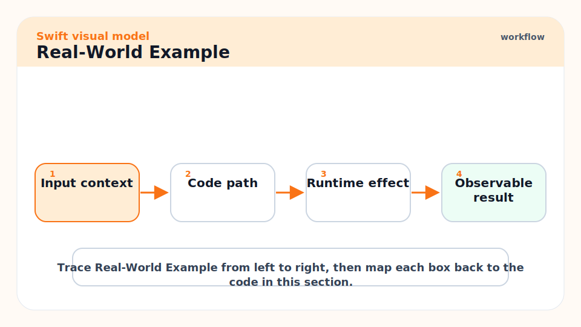
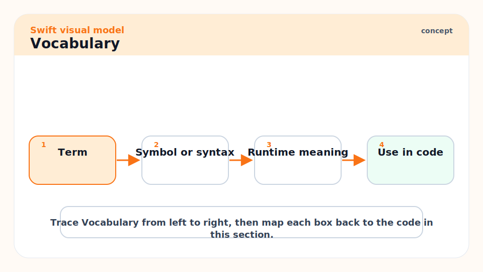
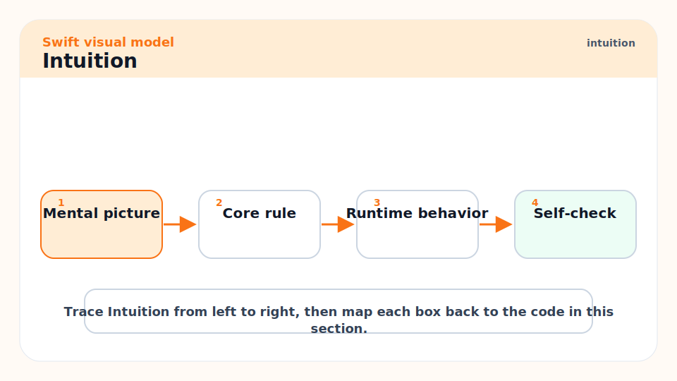
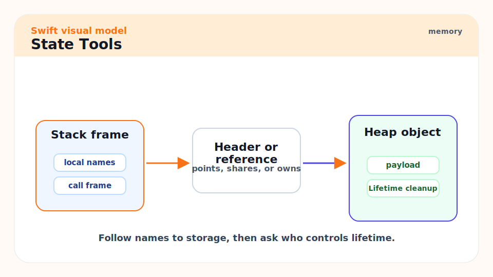
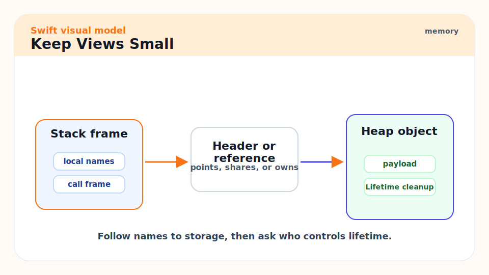
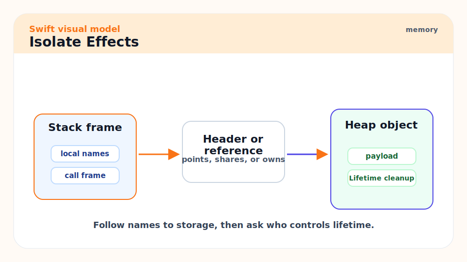
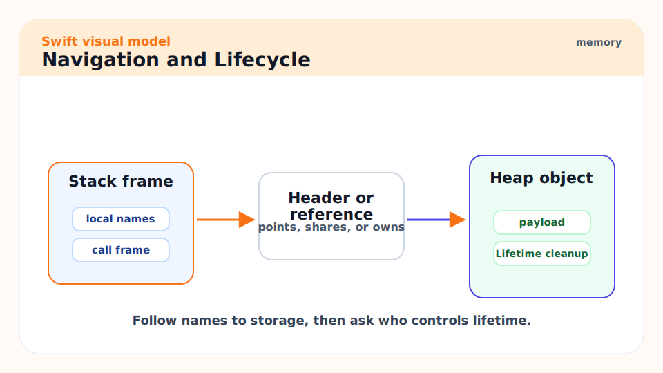
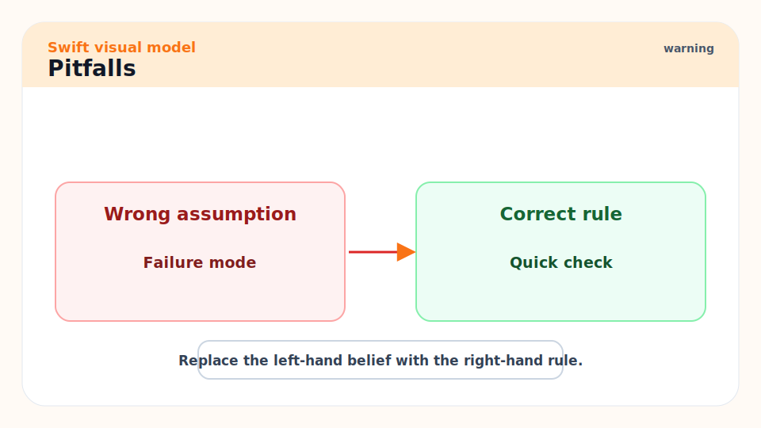
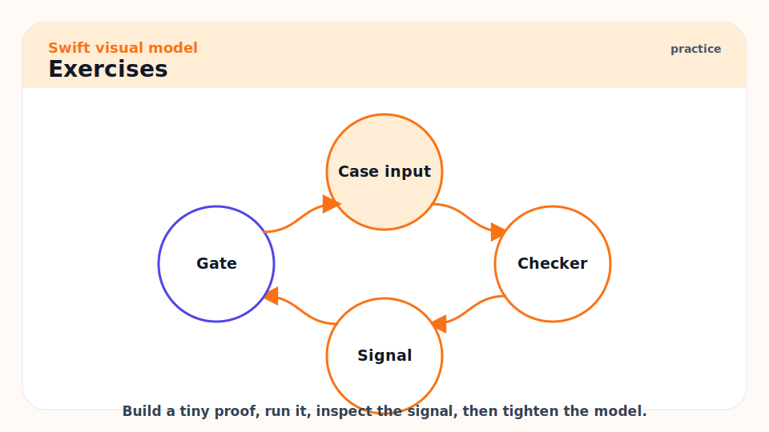

# 17 - SwiftUI State, Architecture, and App Patterns

[toc]

> **TL;DR:** SwiftUI is a state-driven UI framework. You get predictable apps by keeping views small, state ownership clear, effects isolated, domain logic testable, and main-actor UI updates explicit.

## Real-World Example



This example keeps the view declarative and moves behavior into a main-actor model. It is intentionally small: state ownership matters more than framework cleverness.

```swift
import SwiftUI

@MainActor
final class LoginModel: ObservableObject {
    @Published var email = ""
    @Published private(set) var message = ""

    func submit() {
        guard email.contains("@") else {
            message = "Enter a valid email."
            return
        }

        message = "Ready to sign in."
    }
}

struct LoginView: View {
    @StateObject private var model = LoginModel()

    var body: some View {
        Form {
            TextField("Email", text: $model.email)
            Button("Continue") {
                model.submit()
            }
            Text(model.message)
        }
    }
}
```

## Vocabulary



**View**: A value that describes UI for a given state.

---

**State owner**: The object or value responsible for mutating a piece of state.

---

**Binding**: A two-way connection to mutable state, usually written with `$`.

---

**Observable object**: A reference type that emits changes to update views.

---

**Environment**: Values passed implicitly through the SwiftUI view hierarchy.

---

**Effect**: Work that touches the outside world: network, disk, clock, randomness, analytics, or navigation.

## Intuition



SwiftUI views are not view controllers. They are descriptions. The framework repeatedly evaluates `body` and reconciles the result with the rendered UI. If you hide side effects in `body`, you fight the model.

Architecture is about state ownership. Every piece of state should have one clear owner. Child views receive data and bindings, but they should not secretly create competing sources of truth.

## State Tools



Use the smallest tool that matches ownership:

| Tool | Typical use |
| :--- | :--- |
| `@State` | Local value state owned by a view |
| `@Binding` | Child view edits parent-owned state |
| `@StateObject` | View owns a long-lived observable object |
| `@ObservedObject` | View observes an object owned elsewhere |
| `@Environment` | Cross-cutting values provided by hierarchy |
| `@MainActor` | UI-facing model isolation |

## Keep Views Small



Split views by state and responsibility, not by every visual element.

```swift
struct ErrorBanner: View {
    let message: String

    var body: some View {
        Text(message)
            .foregroundStyle(.red)
    }
}
```

## Isolate Effects



Put network calls, persistence, analytics, and clocks behind dependencies. That keeps view models testable.

```swift
protocol AuthClient {
    func signIn(email: String) async throws
}

@MainActor
final class AuthModel: ObservableObject {
    private let client: AuthClient

    init(client: AuthClient) {
        self.client = client
    }
}
```

## Navigation and Lifecycle



Treat navigation as state when flows become complex. Avoid scattering navigation booleans across unrelated views. Model screens, routes, and selected items with enums or typed IDs.

```swift
enum Route: Hashable {
    case profile(userID: String)
    case settings
}
```

## Pitfalls



- **Side effects in `body`**: `body` can run often. Keep it pure.
- **Multiple sources of truth**: If two objects own the same state, bugs follow.
- **Massive view models**: Split by feature or workflow.
- **Ignoring main actor**: UI-facing observable state should update on the main actor.
- **Testing only the view**: Put logic in plain Swift types and test that directly.

## Exercises



1. Refactor a form so validation lives outside the view body.
2. Replace two navigation booleans with one route enum.
3. Inject a fake client into a view model test.
4. Explain which state is local, parent-owned, object-owned, or environmental.

## Sources

- https://developer.apple.com/documentation/swiftui
- https://docs.swift.org/swift-book/documentation/the-swift-programming-language/concurrency/
- https://www.swift.org/documentation/api-design-guidelines/
- Conversation with user on 2026-06-07

## Related

- Previous: [16 - Performance, Profiling, Allocations, and Optimization](./16-performance-profiling-allocations-and-optimization.md)
- Next: [18 - Server-Side Swift: APIs, NIO, Vapor, and Observability](./18-server-side-swift-apis-nio-vapor-and-observability.md)
- Earlier: [09 - Apple App Architecture, Signing, TestFlight, and App Store Release](./09-apple-app-architecture-signing-testflight-and-app-store-release.md)

