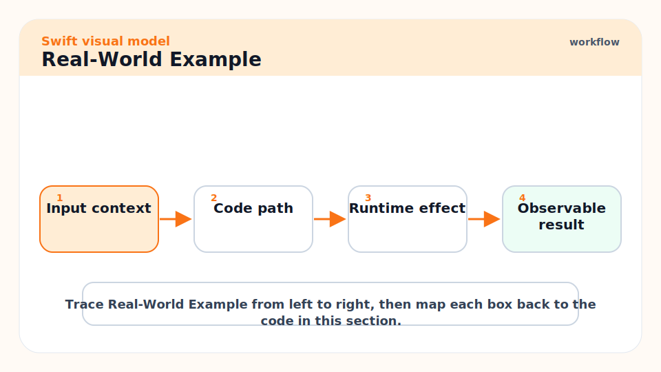
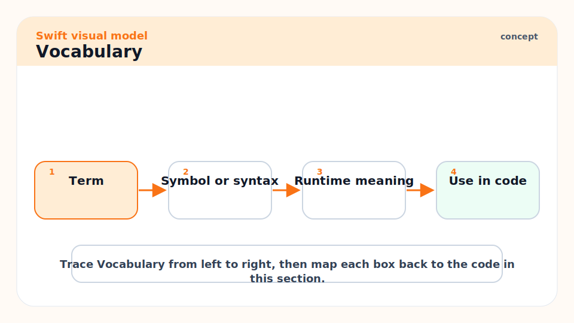
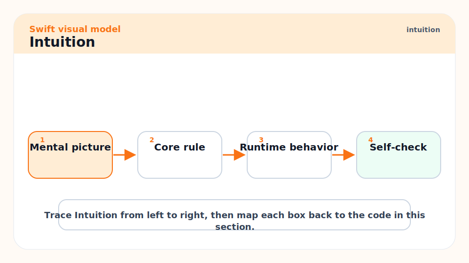
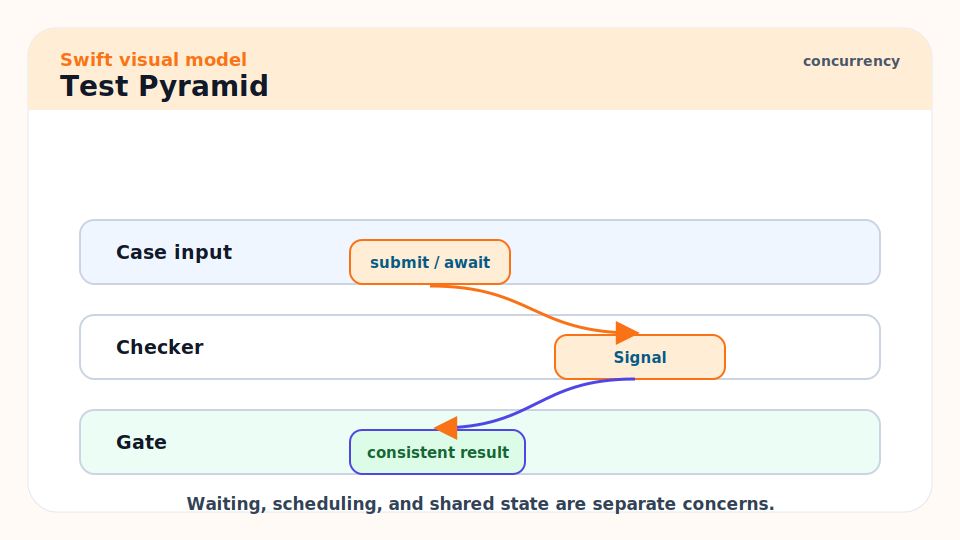
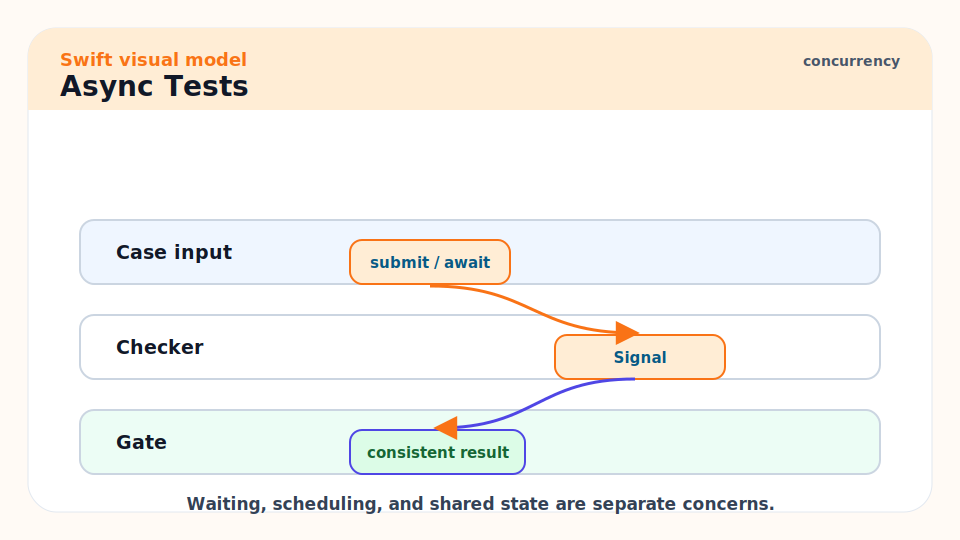
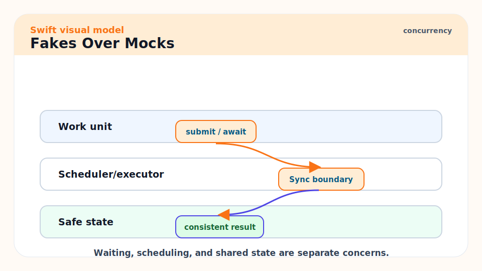
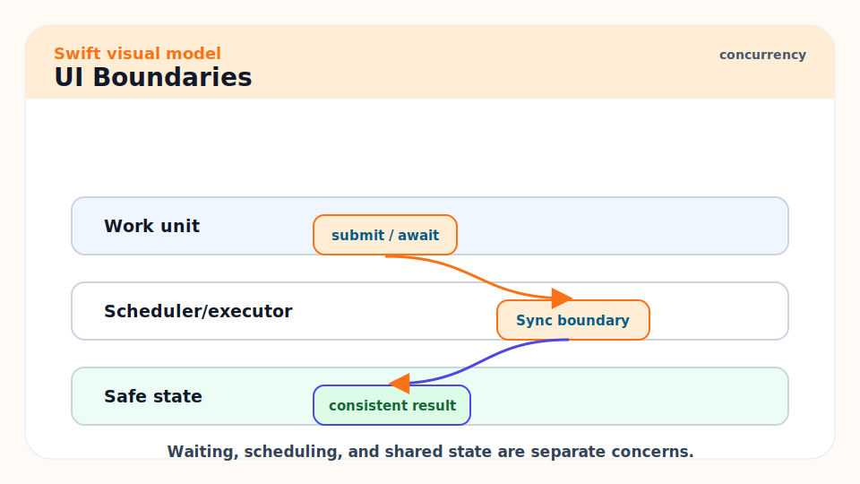
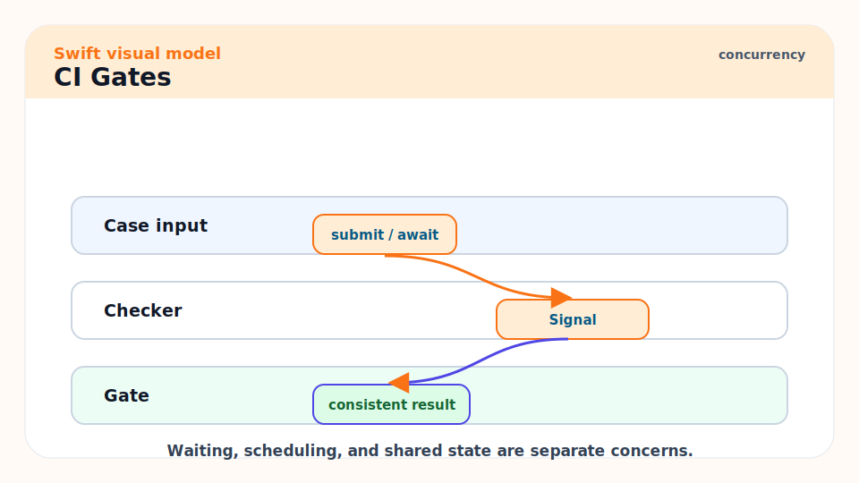
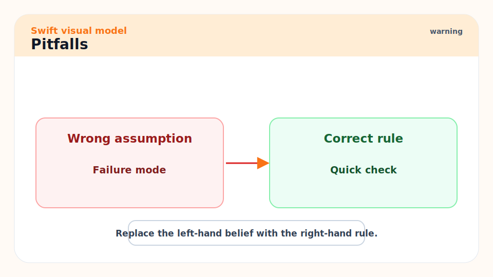
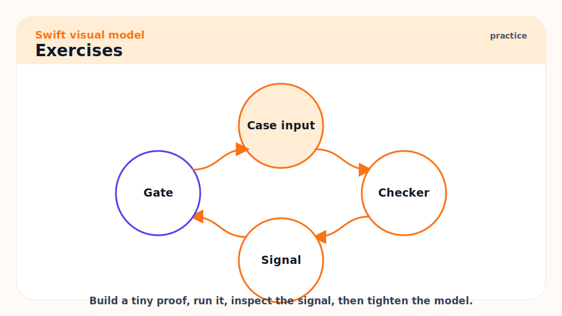

# 19 - Advanced Testing: Fakes, Async, UI Boundaries, and CI

[toc]

> **TL;DR:** Good Swift tests are behavior-focused, deterministic, async-aware, and cheap to run. Use pure tests for domain logic, fakes for dependencies, Swift Testing or XCTest for assertions, UI tests sparingly, and CI gates that match shipping risk.

## Real-World Example



This test injects a fake clock so the service can be tested without sleeping. Determinism is the point.

```swift
import Testing
import Foundation

protocol Clock {
    func now() -> Date
}

struct FixedClock: Clock {
    let fixedDate: Date
    func now() -> Date { fixedDate }
}

struct TokenService {
    let clock: Clock

    func isExpired(expiration: Date) -> Bool {
        clock.now() >= expiration
    }
}

@Test func token_is_expired_after_expiration_date() {
    let now = Date(timeIntervalSince1970: 100)
    let service = TokenService(clock: FixedClock(fixedDate: now))

    #expect(service.isExpired(expiration: Date(timeIntervalSince1970: 99)))
}
```

## Vocabulary



**Unit test**: A focused test for one behavior, usually without real external dependencies.

---

**Integration test**: A test that verifies multiple components working together.

---

**UI test**: A test that drives the app through its user interface.

---

**Fake**: A simple working implementation used for tests.

---

**Mock**: A test double that verifies interactions.

---

**Fixture**: Reusable input data for tests.

---

**Flake**: A test that sometimes passes and sometimes fails without code changes.

## Intuition



Tests should reduce fear. If tests are slow, random, brittle, or coupled to implementation details, developers stop trusting them. The best Swift tests usually test plain Swift types without launching UI frameworks or real servers.

Async code needs deterministic dependencies. Replace real clocks, UUID generators, network clients, and storage with fakes. Then test cancellation, failure, nil, invalid inputs, and repeated calls.

## Test Pyramid



Use many cheap tests and fewer expensive tests.

```text
Many:    pure unit tests
Some:    integration tests with real adapters
Few:     UI/end-to-end tests
Manual:  exploratory release testing
```

## Async Tests



Swift Testing supports async test functions. Keep async tests deterministic and bounded by timeouts where supported by your framework.

```swift
@Test func async_service_returns_profile() async throws {
    let service = ProfileService(client: FakeProfileClient())
    let profile = try await service.profile(id: "u-1")
    #expect(profile.displayName == "Test User")
}
```

## Fakes Over Mocks



Prefer fakes when behavior matters more than verifying exact calls. Mocks can make tests brittle if they lock onto implementation sequence.

```swift
actor InMemoryUserStore {
    private var users: [String: String] = [:]

    func insert(name: String, id: String) {
        users[id] = name
    }

    func name(id: String) -> String? {
        users[id]
    }
}
```

## UI Boundaries



Test view models, reducers, validators, and services directly. Use UI tests for critical user flows: onboarding, purchase, sign-in, permission flows, and high-risk regressions.

```bash
xcodebuild test -scheme MyApp -destination 'platform=iOS Simulator,name=iPhone 16'
swift test
swift test --sanitize=thread
```

## CI Gates



A practical Swift CI pipeline:

1. Format or lint if the repo has a chosen tool.
2. Build debug for fast compile feedback.
3. Run unit tests.
4. Run sanitizer tests on scheduled or high-risk branches.
5. Build release artifacts.
6. Run platform-specific tests for Linux/server or Apple simulator targets.
7. Upload artifacts, docs, or TestFlight builds only after tests pass.

## Pitfalls



- **Sleeping in tests**: Replace time with a fake clock.
- **Testing private implementation**: Test behavior through public or internal seams.
- **One giant integration test**: It is slow and hard to diagnose.
- **No failure tests**: Happy-path-only tests miss most production bugs.
- **Ignoring cancellation**: Async services should define cancellation behavior.

## Exercises



1. Create a fake clock and test expiration logic.
2. Replace one network dependency with a fake client.
3. Add an async test for a throwing function.
4. Write a CI checklist for package tests, simulator tests, sanitizers, and release builds.

## Sources

- https://www.swift.org/packages/testing.html
- https://www.swift.org/documentation/server/guides/testing.html
- https://docs.swift.org/swiftpm/documentation/packagemanagerdocs/swifttest/
- https://developer.apple.com/documentation/xctest
- Conversation with user on 2026-06-07

## Related

- Previous: [18 - Server-Side Swift: APIs, NIO, Vapor, and Observability](./18-server-side-swift-apis-nio-vapor-and-observability.md)
- Next: [20 - Capstone Projects, Mastery Drills, and Study Path](./20-capstone-projects-mastery-drills-and-study-path.md)
- Earlier: [08 - SwiftPM, Testing, Compiling, and Shipping](./08-swiftpm-testing-compiling-and-shipping.md)

