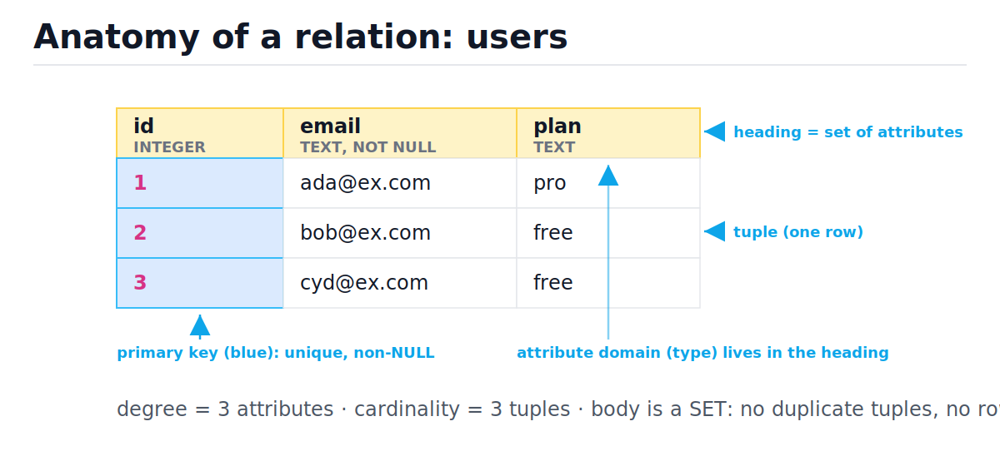
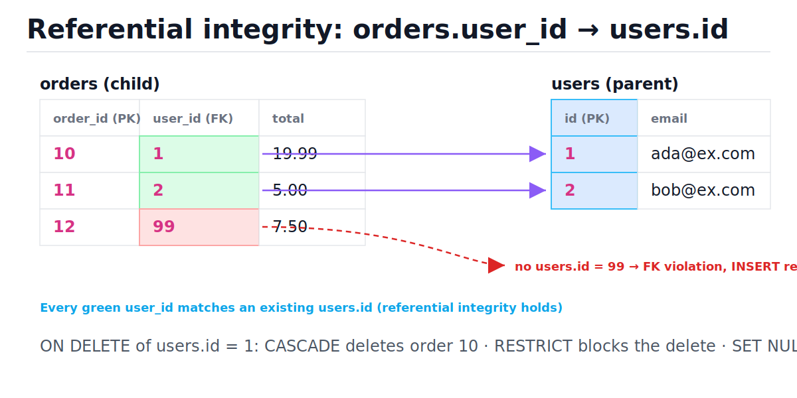
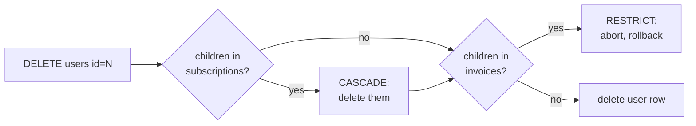

# The Relational Model

[toc]

> **TL;DR:** A relation is a *set of tuples* over typed attributes — tables are just the picture we draw of that set. Keys identify tuples, foreign keys tie relations together, and the DBMS enforces integrity rules so bad data physically cannot enter. SQL is a declarative skin over relational algebra; understanding the algebra (and NULL's three-valued logic) is what separates people who *use* SQL from people who *debug* it.

## Vocabulary

**Relation**

```math
R \subseteq D_1 \times D_2 \times \cdots \times D_n
```

A relation is a subset of the Cartesian product of n domains: a *set* of n-tuples. No duplicate tuples, no inherent row order. A SQL table approximates a relation but allows duplicates unless you constrain it.

**Attribute**

```math
A_i : D_i
```

A named, typed column. The domain Dᵢ is the set of legal values (INTEGER, TEXT, DATE…). The set of attributes is the relation's *heading*; the tuples are its *body*.

**Degree and cardinality**

```math
\text{degree}(R) = n, \qquad \text{cardinality}(R) = |R|
```

Degree counts attributes (columns); cardinality counts tuples (rows). Degree is fixed by the schema; cardinality changes with every INSERT/DELETE.

**Superkey**

```math
K \subseteq \{A_1,\dots,A_n\} \;\text{ s.t. }\; \forall t_1, t_2 \in R:\; t_1[K] = t_2[K] \Rightarrow t_1 = t_2
```

Any attribute set that uniquely identifies every tuple. The full set of attributes is always a superkey, so superkeys are cheap and uninteresting on their own.

**Candidate key**

```math
K \text{ is a superkey and no proper subset of } K \text{ is a superkey}
```

A *minimal* superkey. A relation can have several (e.g. `id` and `email` in a users table). Each is a candidate for the role of primary key.

**Primary key / foreign key**

```math
\text{FK: } \pi_{user\_id}(\text{orders}) \subseteq \pi_{id}(\text{users})
```

The primary key is the candidate key you choose as the canonical identifier — unique and never NULL. A foreign key is a set of attributes in a child relation whose values must appear as a primary (or unique) key in the parent relation; that subset condition *is* referential integrity.

**Three-valued logic (3VL)**

```math
x = \text{NULL} \;\Rightarrow\; \text{UNKNOWN}, \qquad \text{WHERE keeps only TRUE}
```

SQL predicates evaluate to TRUE, FALSE, or UNKNOWN. Any comparison with NULL is UNKNOWN, and UNKNOWN rows are filtered out by WHERE — the source of most silent query bugs.

## Intuition

Forget spreadsheets. Think of a relation as a *mathematical statement of facts*: each tuple asserts one true proposition ("user 1 has email ada@ex.com and is on plan pro"). The heading defines what a fact looks like; the body is the set of facts currently true. Because it's a set, duplicates would mean stating the same fact twice (useless) and order would mean nothing (facts have no sequence).

Study the figure: the heading carries names and domains, the body carries tuples, and the blue column is the primary key — the handle by which any single fact can be retrieved or referenced.



> [!NOTE]
> Codd's 1970 insight was *data independence*: programs state **what** they want (a predicate over relations), not **how** to walk pointers on disk. The DBMS is free to reorganize storage, add indexes, and reorder joins without breaking a single query.

## How it works

The model has three pillars: structure (relations), integrity (keys and constraints), and manipulation (relational algebra, which SQL implements). Each pillar gets a subsection below.

### Keys: superkey → candidate → primary, natural vs surrogate

Keys form a hierarchy of strictness. Every candidate key is a superkey; the primary key is one chosen candidate. The practical decision is **natural vs surrogate**: a natural key is a real-world attribute (email, SSN, ISBN); a surrogate is a meaningless generated value (auto-increment integer, UUID).

| Step | Attribute set on `users(id, email, plan)` | Decision |
| :--- | :--- | :--- |
| 1 | `{id, email, plan}` | Superkey (whole heading always is), not minimal |
| 2 | `{id, plan}` | Superkey, but `{id}` alone suffices → not candidate |
| 3 | `{id}` | Minimal → candidate key |
| 4 | `{email}` | Also unique and minimal → second candidate key |
| 5 | choose `{id}` | Primary key; declare `email` UNIQUE so the other candidate stays enforced |

Surrogate keys win in production for two reasons. First, natural keys change (people change emails; companies recycle SKUs), and a changing primary key forces cascading updates through every referencing table. Second, **index locality**: most engines (InnoDB, SQL Server clustered indexes) physically order rows by primary key. A compact, monotonically increasing integer means new rows append to the rightmost B-tree page — hot page stays in cache, minimal page splits. A random UUIDv4 key scatters inserts across the whole tree: every insert touches a random page, cache hit rate collapses, and the key itself is 16 bytes copied into *every secondary index entry*.

```sql
-- Surrogate PK + natural key kept honest with UNIQUE
CREATE TABLE users (
  id    INTEGER PRIMARY KEY,          -- compact surrogate, append-friendly
  email TEXT NOT NULL UNIQUE,         -- natural candidate key, still enforced
  plan  TEXT NOT NULL DEFAULT 'free'
);
```

> [!TIP]
> If you need globally unique IDs across shards, prefer time-ordered formats (UUIDv7, ULID, Snowflake IDs) over UUIDv4 — they keep the B-tree append-mostly while staying coordination-free. See [Database Scaling, Replication and Sharding](../System-Design/06-database-scaling-replication-and-sharding.md).

### Integrity: entity, referential, domain

Integrity rules are the constraints the DBMS *enforces*, so application bugs cannot corrupt the data. **Entity integrity**: every primary key value is unique and non-NULL — every fact is identifiable. **Referential integrity**: every foreign key value matches an existing parent key (or is NULL, if allowed). **Domain integrity**: every attribute value belongs to its domain, tightened further with CHECK constraints.

The figure shows referential integrity concretely: green `user_id` values resolve to a parent row; the red `99` dangles and gets rejected at INSERT time.



When a parent row is deleted, the FK declaration decides the fate of its children:

| Action | Effect of `DELETE FROM users WHERE id = 1` |
| :--- | :--- |
| `ON DELETE RESTRICT` / `NO ACTION` | Delete is rejected while orders reference user 1 |
| `ON DELETE CASCADE` | User 1's orders are deleted too |
| `ON DELETE SET NULL` | Orders survive with `user_id = NULL` (column must be nullable) |

This runs in stock Python — sqlite3 enforces FKs only after `PRAGMA foreign_keys = ON` (off by default for legacy reasons, a classic footgun):

```python
import sqlite3

def fresh(action: str) -> sqlite3.Connection:
    con = sqlite3.connect(":memory:")
    con.execute("PRAGMA foreign_keys = ON")  # OFF by default in SQLite!
    con.execute("CREATE TABLE users (id INTEGER PRIMARY KEY, email TEXT NOT NULL UNIQUE)")
    con.execute(
        "CREATE TABLE orders (order_id INTEGER PRIMARY KEY, user_id INTEGER "
        f"REFERENCES users(id) ON DELETE {action}, total REAL NOT NULL)"
    )
    con.execute("INSERT INTO users VALUES (1, 'ada@ex.com')")
    con.execute("INSERT INTO orders VALUES (10, 1, 19.99)")
    return con

# Dangling FK insert is rejected (referential integrity)
con = fresh("RESTRICT")
try:
    con.execute("INSERT INTO orders VALUES (12, 99, 7.50)")
    raise AssertionError("should have raised")
except sqlite3.IntegrityError:
    pass

# RESTRICT: parent delete blocked
try:
    con.execute("DELETE FROM users WHERE id = 1")
    raise AssertionError("should have raised")
except sqlite3.IntegrityError:
    pass

# CASCADE: children deleted with the parent
con = fresh("CASCADE")
con.execute("DELETE FROM users WHERE id = 1")
assert con.execute("SELECT COUNT(*) FROM orders").fetchone()[0] == 0

# SET NULL: children orphaned as NULL
con = fresh("SET NULL")
con.execute("DELETE FROM users WHERE id = 1")
assert con.execute("SELECT user_id FROM orders").fetchone() == (None,)
print("FK actions verified")
```

Domain constraints narrow what a column accepts beyond its type. CHECK is the workhorse:

```sql
CREATE TABLE payments (
  id     INTEGER PRIMARY KEY,
  amount REAL NOT NULL CHECK (amount > 0),
  status TEXT NOT NULL CHECK (status IN ('pending', 'settled', 'failed'))
);
```

> [!IMPORTANT]
> Constraints in the database are the *last line of defense*. Application-level validation can be bypassed by a second service, a migration script, or a human with a SQL console. The constraint cannot.

### NULL and three-valued logic — the section that saves careers

NULL is not a value; it is the *absence* of one. Any comparison involving NULL — even `NULL = NULL` — evaluates to UNKNOWN, and `WHERE` keeps only rows whose predicate is TRUE. Three consequences bite real engineers: equality tests silently drop rows, `NOT IN` against a set containing NULL returns *nothing*, and `COUNT(col)` quietly skips NULLs while `COUNT(*)` does not.

Every claim, demonstrated:

```python
import sqlite3

con = sqlite3.connect(":memory:")
con.execute("CREATE TABLE t (x INTEGER)")
con.executemany("INSERT INTO t VALUES (?)", [(1,), (2,), (None,)])

# 1. NULL = NULL is UNKNOWN, not TRUE -> WHERE drops the row
assert con.execute("SELECT COUNT(*) FROM t WHERE x = NULL").fetchone()[0] == 0
# the correct spelling:
assert con.execute("SELECT COUNT(*) FROM t WHERE x IS NULL").fetchone()[0] == 1

# 2. NOT IN with a NULL in the list returns NOTHING
#    1 NOT IN (2, NULL) == NOT (1=2 OR 1=NULL) == NOT (FALSE OR UNKNOWN)
#    == NOT UNKNOWN == UNKNOWN -> row filtered out
rows = con.execute("SELECT x FROM t WHERE x NOT IN (SELECT x FROM t WHERE x IS NULL OR x = 2)").fetchall()
assert rows == []          # expected (1,) — gone!
# fix: exclude NULLs in the subquery, or use NOT EXISTS
rows = con.execute("SELECT x FROM t WHERE x NOT IN (SELECT x FROM t WHERE x = 2)").fetchall()
assert rows == [(1,)]

# 3. COUNT(col) skips NULLs; COUNT(*) counts rows
assert con.execute("SELECT COUNT(*) FROM t").fetchone()[0] == 3
assert con.execute("SELECT COUNT(x) FROM t").fetchone()[0] == 2

# 4. NULLs and aggregates: AVG ignores NULLs too (denominator = 2, not 3)
assert con.execute("SELECT AVG(x) FROM t").fetchone()[0] == 1.5
print("3VL claims verified")
```

The truth table that explains all of it — UNKNOWN propagates unless AND/OR can decide without it:

| p | q | p AND q | p OR q | NOT p |
| :---: | :---: | :---: | :---: | :---: |
| TRUE | UNKNOWN | UNKNOWN | TRUE | FALSE |
| FALSE | UNKNOWN | FALSE | UNKNOWN | TRUE |
| UNKNOWN | UNKNOWN | UNKNOWN | UNKNOWN | UNKNOWN |

> [!CAUTION]
> `WHERE col NOT IN (subquery)` against a subquery that can yield NULL returns zero rows and **no error**. This passes tests on clean data and silently empties a report in production. Use `NOT EXISTS` or add `WHERE col IS NOT NULL` to the subquery — always.

> [!WARNING]
> SQLite treats NULLs as distinct in UNIQUE constraints (you can insert many NULL emails into a UNIQUE column), and so does PostgreSQL by default. If "at most one missing value" matters, you need a partial unique index — PostgreSQL-only syntax.

### Relational algebra: the theory under SQL

SQL is declarative because the optimizer compiles it down to relational algebra operators and reorders them freely (selections pushed below joins, projections pruned early). Knowing the operators tells you what the optimizer is allowed to do — and what your query *means* independent of execution.

**Selection** — keep tuples matching a predicate; maps to `WHERE`:

```math
\sigma_{\text{plan}='pro'}(\text{users}) \;\equiv\; \texttt{SELECT * FROM users WHERE plan = 'pro'}
```

**Projection** — keep a subset of attributes (and, being a set operation, deduplicate); maps to `SELECT DISTINCT col, ...`:

```math
\pi_{\text{plan}}(\text{users}) \;\equiv\; \texttt{SELECT DISTINCT plan FROM users}
```

**Natural / theta join** — pair tuples across relations where a predicate holds; maps to `JOIN ... ON`:

```math
\text{users} \bowtie_{\;u.id = o.user\_id} \text{orders} \;\equiv\; \texttt{users u JOIN orders o ON u.id = o.user\_id}
```

A join is definitionally a filtered Cartesian product:

```math
R \bowtie_{\theta} S \;=\; \sigma_{\theta}(R \times S)
```

No engine actually materializes the product — hash join is O(|R| + |S|) expected, sort-merge O(|R| log |R| + |S| log |S|) — but the *semantics* are exactly that. Remaining operators round out the algebra: union ∪, set difference −, intersection ∩ (mapping to `UNION` / `EXCEPT` / `INTERSECT`), and rename ρ (`AS`).

```sql
-- algebra: pi_email( sigma_total>10( users JOIN orders ) )
SELECT DISTINCT u.email
FROM users u
JOIN orders o ON o.user_id = u.id
WHERE o.total > 10;
```

> [!NOTE]
> The algebra is *closed*: every operator takes relations and returns a relation. That closure is why queries compose — a subquery's result is just another relation fed into the next operator.

### Why the relational model won

Pre-relational systems (IMS hierarchies, CODASYL networks) baked the access path into the application: code navigated parent/child pointers, and a new query pattern meant a schema redesign and a code rewrite. Codd's model decoupled the three things that should never have been coupled:

- **Logical data independence** — applications see relations; the schema can gain views and the queries survive.
- **Physical data independence** — indexes, partitioning, and storage layout change with zero query changes.
- **Declarative queries** — you state the predicate; the optimizer picks the plan. One model serves OLTP point lookups, reporting scans, and ad-hoc analysis simultaneously.

The same flexibility argument repeats in every "SQL vs NoSQL" debate today: document stores re-couple data to one access pattern, and that's exactly the trade you're making.

## Complexity

The model itself is logical, but constraint checks and operators have real costs. Assume B-tree indexes on keys and n = parent rows, m = child rows, |R|, |S| join input sizes.

| Operation | Best | Average | Worst | Space |
| :--- | :---: | :---: | :---: | :---: |
| PK uniqueness check (B-tree probe) | O(1) cached root | O(log n) | O(log n) | O(1) |
| FK existence check on INSERT | O(1) | O(log n) | O(log n) | O(1) |
| `ON DELETE CASCADE` of one parent | O(log m) | O(log m + k) | O(m) all children | O(k) deleted rows |
| Selection σ, no index | O(n) | O(n) | O(n) | O(1) |
| Selection σ, indexed predicate | O(log n) | O(log n + k) | O(n) | O(1) |
| Projection π with DISTINCT (hash) | O(n) | O(n) | O(n) | O(n) |
| Hash join | O(\|R\|+\|S\|) | O(\|R\|+\|S\|) | O(\|R\|·\|S\|) skew/collisions | O(min(\|R\|,\|S\|)) |
| Sort-merge join | O(\|R\|+\|S\|) presorted | O(\|R\| log \|R\| + \|S\| log \|S\|) | same | O(\|R\|+\|S\|) |
| Nested-loop join (no index) | O(\|R\|·\|S\|) | O(\|R\|·\|S\|) | O(\|R\|·\|S\|) | O(1) |

The key bound is the FK check. Without an index on the parent key, every child INSERT scans the parent; with the (mandatory) PK B-tree of fan-out f:

```math
T_{\text{fk-check}}(n) = O(\log_f n) \approx \log_f n \text{ page reads}, \quad f \approx 100\text{–}400
```

With fan-out ~200, a billion-row parent is 4–5 page reads, nearly all cached. This is *why* declarative constraints are affordable: the same B-tree that serves lookups makes integrity enforcement logarithmic. The symmetric trap: **deleting a parent requires finding children**, and if the FK column itself has no index, every parent DELETE is an O(m) child-table scan — the classic "why is this DELETE taking minutes" incident.

## In production

The clean set-of-tuples model meets disk pages, replicas, and deadlines. Where theory and practice diverge:

- **Tables are bags, not sets.** SQL allows duplicate rows unless a key forbids them, and rows come back in arbitrary order unless you `ORDER BY`. Code that relies on "insertion order" works until a VACUUM, a plan change, or a parallel scan reorders everything.
- **PK choice is a physical decision.** InnoDB clusters the table on the PK; secondary indexes store the PK as the row pointer. A 16-byte random UUID PK bloats every index and randomizes insert I/O. PostgreSQL heaps don't cluster, but index locality of inserts still matters for the PK index itself.
- **FK enforcement costs writes.** Each child insert probes the parent index; each parent delete probes the child FK index. High-throughput shops sometimes drop FK constraints on hot paths and enforce via application logic plus reconciliation jobs — a deliberate, measured trade, not a default. FKs also complicate sharding, since the parent may live on another shard ([replication and sharding](../System-Design/06-database-scaling-replication-and-sharding.md)).
- **`PRAGMA foreign_keys = ON` is per-connection in SQLite.** Forget it in one code path and that path can write orphans while every other path is protected.
- **CHECK constraints are not validation services.** They can't call out, can't dedupe across rows, and (in MySQL before 8.0.16) were parsed and silently ignored.
- **Migrations meet integrity.** Adding a FK to an existing table validates every row — on a big table that's a long lock or a `NOT VALID` + `VALIDATE CONSTRAINT` two-step (PostgreSQL).

> [!TIP]
> Index every foreign key column. PostgreSQL creates an index for the *referenced* PK automatically but **not** for the referencing column. Unindexed FKs are the top cause of slow cascading deletes and lock pile-ups.

## Real-world example

A SaaS billing system: users, their subscriptions, and the rule that deleting a user must not silently destroy financial records. Subscriptions cascade (they're meaningless without the user), but invoices RESTRICT (auditors want them forever). This is the relational model doing policy enforcement in the schema:

```python
import sqlite3

con = sqlite3.connect(":memory:")
con.execute("PRAGMA foreign_keys = ON")
con.executescript("""
CREATE TABLE users (
  id    INTEGER PRIMARY KEY,
  email TEXT NOT NULL UNIQUE
);
CREATE TABLE subscriptions (
  id      INTEGER PRIMARY KEY,
  user_id INTEGER NOT NULL REFERENCES users(id) ON DELETE CASCADE,
  plan    TEXT NOT NULL CHECK (plan IN ('free', 'pro', 'team'))
);
CREATE TABLE invoices (
  id      INTEGER PRIMARY KEY,
  user_id INTEGER NOT NULL REFERENCES users(id) ON DELETE RESTRICT,
  amount  REAL NOT NULL CHECK (amount > 0)
);
CREATE INDEX idx_subs_user ON subscriptions(user_id);  -- index your FKs
CREATE INDEX idx_inv_user  ON invoices(user_id);
""")
con.execute("INSERT INTO users VALUES (1, 'ada@ex.com'), (2, 'bob@ex.com')")
con.execute("INSERT INTO subscriptions VALUES (1, 1, 'pro'), (2, 2, 'free')")
con.execute("INSERT INTO invoices VALUES (100, 1, 49.00)")

# CHECK rejects a domain violation
try:
    con.execute("INSERT INTO subscriptions VALUES (3, 2, 'platinum')")
    raise AssertionError("should have raised")
except sqlite3.IntegrityError:
    pass

# Bob has no invoices: delete cascades his subscription, user vanishes cleanly
con.execute("DELETE FROM users WHERE id = 2")
assert con.execute("SELECT COUNT(*) FROM subscriptions").fetchone()[0] == 1

# Ada has an invoice: RESTRICT blocks the delete, money trail preserved
try:
    con.execute("DELETE FROM users WHERE id = 1")
    raise AssertionError("should have raised")
except sqlite3.IntegrityError:
    pass
assert con.execute("SELECT COUNT(*) FROM invoices").fetchone()[0] == 1
print("billing schema verified")
```

The deletion decision flow, as the engine sees it:



## When to use / When NOT to use

The relational model is the default for a reason, but it is not a religion. Choose it deliberately.

**Use it when:**

- Data has structure known up front and *many* access patterns (reporting, lookups, joins).
- Correctness matters more than peak write throughput — constraints, transactions, ad-hoc queries.
- Entities reference each other and orphans are unacceptable (orders without users).

**Reconsider when:**

- One access pattern dominates at extreme scale and joins-across-shards would dominate cost (see [scaling fundamentals](../System-Design/04-scaling-fundamentals.md)).
- Data is genuinely schemaless blobs (raw event payloads, document snapshots) — though Postgres JSONB covers most of this inside the relational tent.
- You need a graph traversal of unbounded depth as the primary query; recursive SQL works but a graph engine fits better.

## Common mistakes

- **"NULL means empty string or zero"** — NULL means *unknown/absent*; it compares as UNKNOWN to everything, including itself. Use `IS NULL`, never `= NULL`.
- **"NOT IN is the negation of IN"** — only on NULL-free sets. One NULL in the subquery and `NOT IN` returns zero rows. Use `NOT EXISTS`.
- **"Primary key choice is just a naming decision"** — it decides physical clustering, secondary-index size, and insert I/O pattern.
- **"Natural keys are cleaner, so prefer them"** — natural keys change and leak PII into every child table; surrogate PK + UNIQUE on the natural key gets both.
- **"SQLite enforces my foreign keys"** — only after `PRAGMA foreign_keys = ON`, per connection.
- **"Rows come back in insertion order"** — relations are sets; without `ORDER BY` the order is whatever the plan produced.
- **"COUNT(col) counts rows"** — it counts non-NULL values of `col`; `COUNT(*)` counts rows.
- **"A table is a relation"** — tables permit duplicate rows; relations cannot have them. `DISTINCT` and keys close the gap.

## Interview questions and answers

**1. What is the difference between a superkey, a candidate key, and a primary key?**
**Answer:** A superkey is any column set that uniquely identifies rows — the whole row always qualifies. A candidate key is a *minimal* superkey: remove any column and uniqueness breaks. The primary key is the one candidate key you designate as the canonical identifier; the others should still get UNIQUE constraints.

**2. Why do most production schemas use surrogate keys instead of natural keys?**
**Answer:** Two reasons. Natural keys change — emails, names, SKUs — and changing a PK ripples through every referencing table. And physically, a compact monotonically increasing surrogate keeps B-tree inserts on the rightmost page and keeps every secondary index entry small, whereas a wide or random natural key scatters inserts and bloats indexes.

**3. Why does `WHERE x = NULL` return no rows even when x has NULLs?**
**Answer:** Comparison with NULL evaluates to UNKNOWN, not TRUE, and WHERE only keeps TRUE rows. NULL isn't a value you can equal — it's the absence of one. The correct predicate is `x IS NULL`, which is a special form defined to return TRUE/FALSE.

**4. A `NOT IN (subquery)` query suddenly returns zero rows. What happened?**
**Answer:** The subquery started producing a NULL. `x NOT IN (a, NULL)` expands to `NOT (x=a OR x=NULL)`; the NULL comparison is UNKNOWN, so the whole thing is at best UNKNOWN and every row gets filtered. Fix with `NOT EXISTS` or filter NULLs out of the subquery.

**5. What's the difference between ON DELETE CASCADE, RESTRICT, and SET NULL?**
**Answer:** They define what happens to child rows when the parent is deleted. CASCADE deletes the children too; RESTRICT refuses the parent delete while children exist; SET NULL keeps the children but nulls their FK column. Pick per relationship: cascade things that are meaningless without the parent, restrict financial or audit records.

**6. How does SQL relate to relational algebra?**
**Answer:** SQL clauses map to algebra operators — WHERE is selection, the SELECT list is projection, JOIN is a theta join, which is formally a selection over a Cartesian product. Because the algebra has rewrite rules — push selections down, reorder joins — the optimizer can transform your query into a cheaper equivalent plan. That's what makes SQL declarative.

**7. In what ways is a SQL table not actually a relation?**
**Answer:** Three ways: tables allow duplicate rows unless a key forbids them, rows have no guaranteed order but SQL exposes ordering via ORDER BY, and SQL adds NULL with three-valued logic, which pure relational theory doesn't have. Codd's relations are strict sets of complete tuples.

**8. Why is checking a foreign key on every insert affordable?**
**Answer:** Because the parent's primary key is backed by a B-tree, the existence check is one index probe — O(log n) with a fan-out of hundreds, so even a billion-row parent is four or five page reads, mostly cached. The expensive direction is the reverse: parent deletes must find children, which is a full scan unless the FK column is indexed.

**9. What did the relational model actually solve compared to hierarchical databases?**
**Answer:** Data independence. In IMS or CODASYL, applications navigated physical pointer paths, so the access pattern was frozen into both schema and code. Codd separated the logical model from storage: queries state predicates over relations, and the system chooses the access path. New query patterns need a new query, not a redesign.

## Practice path

1. Write `CREATE TABLE` for users/orders with a surrogate PK, UNIQUE natural key, and a FK — then try inserting an orphan with `PRAGMA foreign_keys = ON` and watch it fail.
2. Rebuild the schema three times with RESTRICT, CASCADE, SET NULL; delete a parent under each and predict the child state before running.
3. Insert a NULL into a column and write five predicates (`=`, `<>`, `IN`, `NOT IN`, `IS NULL`); predict each result first.
4. Take a 3-column table and enumerate every superkey, then reduce to candidate keys by hand.
5. Translate three SQL queries into relational algebra (σ, π, ⋈) and back.
6. EXPLAIN a parent DELETE with and without an index on the child FK column; compare plans.
7. Move on to [SQL fundamentals](./02-sql-fundamentals.md) and [normalization](./04-normalization.md) to see how key theory drives schema design.

## Copyable takeaways

- A relation is a **set of typed tuples**: no duplicates, no order. SQL tables are bags that approximate this.
- Key hierarchy: superkey (unique) ⊃ candidate (minimal unique) ∋ primary (chosen one). Enforce unchosen candidates with UNIQUE.
- Prefer **compact, ordered surrogate PKs**; keep natural keys as UNIQUE columns. Random UUID PKs scatter B-tree inserts and bloat secondary indexes.
- Integrity trio: entity (PK unique, non-NULL), referential (FK ⊆ parent key), domain (types + CHECK).
- ON DELETE: CASCADE for owned children, RESTRICT for audit/financial data, SET NULL for optional links.
- NULL compares as UNKNOWN to everything. `IS NULL`, never `= NULL`; `NOT EXISTS`, never `NOT IN` over nullable subqueries; `COUNT(col)` skips NULLs.
- SQL = relational algebra: WHERE ≡ σ, SELECT list ≡ π, JOIN ≡ σ over ×. Closure of the algebra is why queries compose.
- FK checks are O(log n) B-tree probes — cheap. Unindexed FK columns make parent deletes O(m) — index every FK.
- The model won on **data independence**: one logical model, many access patterns, optimizer picks the path.

## Sources

- E. F. Codd, "A Relational Model of Data for Large Shared Data Banks," CACM 13(6), 1970 — the founding paper.
- SQLite documentation: Foreign Key Support — https://www.sqlite.org/foreignkeys.html (PRAGMA foreign_keys, action semantics).
- SQLite documentation: NULL Handling — https://www.sqlite.org/nulls.html
- PostgreSQL documentation: Constraints — https://www.postgresql.org/docs/current/ddl-constraints.html
- Kleppmann, *Designing Data-Intensive Applications*, Ch. 2 (relational vs document models).
- Python docs: `sqlite3` module — https://docs.python.org/3/library/sqlite3.html

## Related

- [SQL Fundamentals](./02-sql-fundamentals.md)
- [ER Modeling and Schema Design](./03-er-modeling-and-schema-design.md)
- [Normalization](./04-normalization.md)
- [Indexes and Query Performance](./05-indexes-and-query-performance.md)
- [Database Scaling, Replication and Sharding](../System-Design/06-database-scaling-replication-and-sharding.md)
- [Hash Tables](../Data-Structures-and-Algorithms/05-hash-tables.md)
