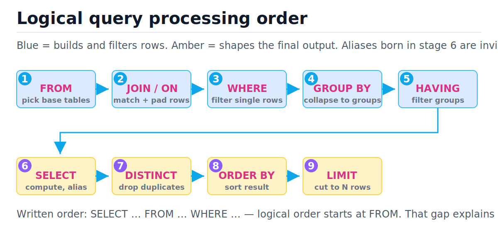
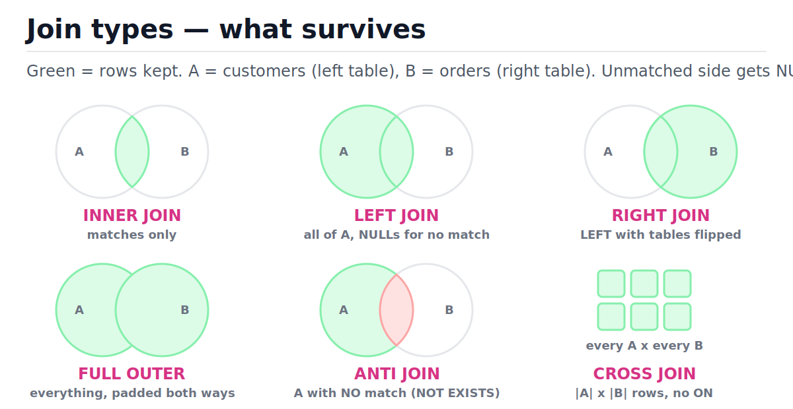
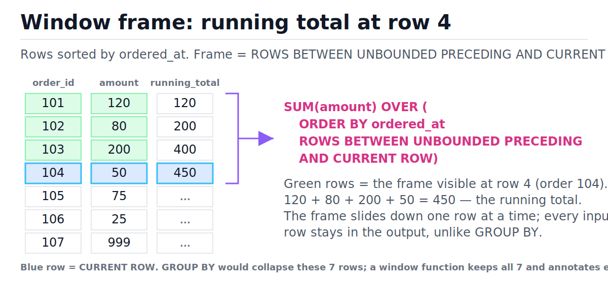

# SQL Fundamentals

[toc]

> **TL;DR:** SQL is declarative — you describe the result set, the engine picks the algorithm. One mental model carries the whole language: the **logical query processing order** (FROM → JOIN → WHERE → GROUP BY → HAVING → SELECT → DISTINCT → ORDER BY → LIMIT), which explains why a SELECT alias is invisible to WHERE, why HAVING exists, and why outer joins multiply rows. Joins, aggregation, subqueries, and window functions are all just stages in that pipeline.

## Vocabulary

**Declarative language**

```math
\text{query} \mapsto \text{result set} \quad (\text{engine chooses the plan})
```

You state *what* rows you want; the optimizer chooses *how* — index scan vs. table scan, hash join vs. nested loop. The same query can run as wildly different algorithms.

**Logical query processing order**

```math
\text{FROM} \to \text{JOIN/ON} \to \text{WHERE} \to \text{GROUP BY} \to \text{HAVING} \to \text{SELECT} \to \text{DISTINCT} \to \text{ORDER BY} \to \text{LIMIT}
```

The order in which clauses are *logically* evaluated, regardless of how you write them. Each stage consumes the previous stage's virtual table.

**Join**

```math
R \bowtie_{\theta} S = \{ (r, s) \mid r \in R,\ s \in S,\ \theta(r, s) \}
```

Pairs rows from two tables where the predicate θ (the `ON` condition) holds. Outer variants pad the unmatched side with NULLs.

**Aggregate function**

```math
f : \{\text{rows in a group}\} \to \text{one value}
```

`SUM`, `COUNT`, `AVG`, `MIN`, `MAX`. All ignore NULL inputs except `COUNT(*)`, which counts rows, not values.

**Correlated subquery**

```math
\forall r \in \text{outer}: \text{inner}(r)
```

An inner query that references the outer row, so it logically re-runs once per outer row — O(n·m) unless the optimizer decorrelates it into a join.

**Window function**

```math
f(\text{frame}(r)) \to \text{one value per row } r
```

Computes an aggregate-like value over a "window" of related rows but does **not** collapse rows. `OVER (PARTITION BY ... ORDER BY ... ROWS ...)` defines the window.

**Anti-join**

```math
R \triangleright S = \{ r \in R \mid \nexists\, s \in S : \theta(r, s) \}
```

Rows of R with *no* match in S. Spelled `NOT EXISTS` in SQL; `NOT IN` is the NULL-poisoned imposter.

## Intuition

Think of a SELECT statement as an assembly line, not a sentence. The engine starts at `FROM`, builds a big intermediate table, then each clause is a station that filters, collapses, or decorates it. You *write* `SELECT` first, but it runs sixth — which is why everything written before stage 6 cannot see your column aliases. Trace any confusing query through the pipeline below and the confusion evaporates.



Two immediate payoffs of this model:

- **Why an alias fails in WHERE**: `SELECT amount * 2 AS doubled ... WHERE doubled > 100` — WHERE runs at stage 3, the alias is born at stage 6. PostgreSQL rejects it. (SQLite is nonstandardly lenient and lets it through — do not rely on that.)
- **Why HAVING exists**: WHERE filters individual rows *before* grouping; you need a second filter that runs *after* GROUP BY to filter on aggregates. That second filter is HAVING.

> [!IMPORTANT]
> ORDER BY is the one clause that *can* see SELECT aliases, because it runs after SELECT (stage 8 vs. 6). This asymmetry trips people constantly: alias works in ORDER BY, fails in WHERE and GROUP BY (per the standard).

## How it works

Every example below runs against one small dataset, built once. Two deliberate landmines are planted: Dmitri (a customer with zero orders) and order 107 (a guest order with `customer_id = NULL`). They expose every join and NULL gotcha in this note. All snippets were executed against SQLite 3.51 via Python's `sqlite3`; PostgreSQL-only differences are flagged in prose.

```sql
CREATE TABLE customers (
    customer_id INTEGER PRIMARY KEY,
    name        TEXT NOT NULL,
    city        TEXT
);
CREATE TABLE orders (
    order_id    INTEGER PRIMARY KEY,
    customer_id INTEGER,           -- NULL = guest checkout
    amount      REAL NOT NULL,
    ordered_at  TEXT NOT NULL,
    FOREIGN KEY (customer_id) REFERENCES customers(customer_id)
);
INSERT INTO customers VALUES
    (1, 'Ada',    'London'),
    (2, 'Brian',  'Cambridge'),
    (3, 'Chiyo',  'Tokyo'),
    (4, 'Dmitri', NULL);           -- customer with no orders
INSERT INTO orders VALUES
    (101, 1,    120.0, '2026-01-05'),
    (102, 1,     80.0, '2026-01-20'),
    (103, 2,    200.0, '2026-02-01'),
    (104, 3,     50.0, '2026-02-14'),
    (105, 3,     75.0, '2026-03-01'),
    (106, 3,     25.0, '2026-03-09'),
    (107, NULL, 999.0, '2026-03-15');  -- guest order, no customer
```

### INNER JOIN — matches only

INNER JOIN keeps only row pairs where the `ON` predicate is true. Dmitri (no orders) and order 107 (NULL customer) both vanish — NULL never equals anything, so `o.customer_id = c.customer_id` is not true for them. The result has 6 rows, one per matched order.

```sql
SELECT c.name, o.order_id, o.amount
FROM customers AS c
INNER JOIN orders AS o ON o.customer_id = c.customer_id
ORDER BY o.order_id;
-- 6 rows: Ada x2, Brian x1, Chiyo x3. Dmitri and order 107 are gone.
```

The figure below maps each join type to the region of rows it keeps — green survives, white is dropped, red is the explicit "no match" set an anti-join targets.



### LEFT JOIN — keep all of the left, and the one-to-many gotcha

LEFT JOIN keeps every row of the left table; where no right-side match exists, the right columns are NULL-padded. Dmitri now appears with a NULL `order_id`. But there is a multiplication effect: a left row with k matches appears **k times**, not once.

```sql
SELECT c.name, o.order_id
FROM customers AS c
LEFT JOIN orders AS o ON o.customer_id = c.customer_id
ORDER BY c.customer_id, o.order_id;
-- 7 rows: Ada appears twice, Chiyo three times, Dmitri once with NULL.
```

This row multiplication is the classic LEFT JOIN + COUNT bug. `COUNT(*)` counts *rows in the group* — including the NULL-padded row — so Dmitri gets a phantom count of 1. `COUNT(o.order_id)` counts non-NULL values, giving the honest 0.

```sql
-- WRONG: COUNT(*) reports 1 order for Dmitri (counts the padding row)
SELECT c.name, COUNT(*) AS n_orders
FROM customers AS c
LEFT JOIN orders AS o ON o.customer_id = c.customer_id
GROUP BY c.customer_id, c.name;

-- RIGHT: COUNT(column) skips NULLs, Dmitri = 0
SELECT c.name, COUNT(o.order_id) AS n_orders
FROM customers AS c
LEFT JOIN orders AS o ON o.customer_id = c.customer_id
GROUP BY c.customer_id, c.name;
```

> [!WARNING]
> Joining a one-to-many table before aggregating a *different* measure multiplies that measure. LEFT JOIN orders then `SUM(c.account_credit)` counts Ada's credit twice. Aggregate in a CTE first, join the collapsed result after.

### RIGHT JOIN — LEFT with the tables flipped

RIGHT JOIN keeps every row of the *right* table. It is exactly `B LEFT JOIN A` with the operands swapped, which is why many style guides ban it: rewrite as LEFT JOIN and read top-down. SQLite gained RIGHT and FULL JOIN in 3.39 (2022); older SQLite only had LEFT.

```sql
-- Identical result set to the LEFT JOIN above
SELECT c.name, o.order_id
FROM orders AS o
RIGHT JOIN customers AS c ON o.customer_id = c.customer_id
ORDER BY c.customer_id, o.order_id;
```

### FULL OUTER JOIN — keep everything

FULL OUTER keeps all rows from both sides, NULL-padding whichever side lacks a match. Our dataset yields 8 rows: 6 matches + Dmitri (no order) + order 107 (no customer). On SQLite < 3.39 you emulate it with `UNION` of the two LEFT JOINs — `UNION` (not `UNION ALL`) deduplicates the shared matched rows.

```sql
-- Native (PostgreSQL, SQLite >= 3.39)
SELECT c.name, o.order_id
FROM customers AS c
FULL OUTER JOIN orders AS o ON o.customer_id = c.customer_id;

-- Emulation for engines without FULL OUTER (e.g. MySQL, old SQLite)
SELECT c.name, o.order_id
FROM customers AS c
LEFT JOIN orders AS o ON o.customer_id = c.customer_id
UNION
SELECT c.name, o.order_id
FROM orders AS o
LEFT JOIN customers AS c ON c.customer_id = o.customer_id;
```

### CROSS JOIN and self-join

CROSS JOIN has no `ON`: every left row pairs with every right row, producing |A| × |B| rows — here 4 × 7 = 28. It is rarely what you want, but it powers calendar scaffolds (every customer × every month) and is what you *accidentally* get when you forget a join condition. A self-join joins a table to itself under different aliases; the canonical case is an `employees` table where `manager_id` points back at `emp_id`.

```sql
CREATE TABLE employees (
    emp_id     INTEGER PRIMARY KEY,
    name       TEXT NOT NULL,
    manager_id INTEGER               -- NULL for the CEO
);
INSERT INTO employees VALUES
    (1, 'Erin',  NULL),
    (2, 'Femi',  1),
    (3, 'Gauri', 1),
    (4, 'Hugo',  2);

SELECT e.name AS employee, m.name AS manager
FROM employees AS e
LEFT JOIN employees AS m ON m.emp_id = e.manager_id
ORDER BY e.emp_id;
-- Erin|NULL, Femi|Erin, Gauri|Erin, Hugo|Femi
```

The LEFT (not INNER) matters: an INNER self-join silently drops the CEO, whose `manager_id` is NULL.

### Anti-join — NOT EXISTS, and the NOT IN + NULL trap

"Customers who never ordered" is an anti-join. `NOT EXISTS` is the correct spelling: it asks, per customer, "is there no matching order row?" and handles NULLs correctly. `NOT IN` looks equivalent but is poisoned by NULL: if the subquery list contains a single NULL (order 107 does), `x NOT IN (...)` evaluates to UNKNOWN for *every* x under three-valued logic, and the query returns **zero rows** — silently. The NULL semantics behind this are covered in [The Relational Model](./01-the-relational-model.md).

```sql
-- CORRECT: returns Dmitri
SELECT c.name
FROM customers AS c
WHERE NOT EXISTS (
    SELECT 1 FROM orders AS o WHERE o.customer_id = c.customer_id
);

-- TRAP: returns ZERO rows because orders.customer_id contains a NULL
SELECT c.name
FROM customers AS c
WHERE c.customer_id NOT IN (SELECT customer_id FROM orders);

-- Patched NOT IN (works, but NOT EXISTS is still the idiom)
SELECT c.name
FROM customers AS c
WHERE c.customer_id NOT IN (
    SELECT customer_id FROM orders WHERE customer_id IS NOT NULL
);
```

> [!CAUTION]
> `NOT IN` + a nullable subquery column returns an empty result with no error. This passes tests on clean fixtures and fails in production the day the first NULL lands. Default to `NOT EXISTS`.

### Aggregation — GROUP BY collapses, HAVING filters groups

GROUP BY partitions the post-WHERE rows into groups and collapses each group to exactly one output row; only grouping columns and aggregates may appear in SELECT. Aggregates ignore NULL inputs — `COUNT(customer_id)` over orders is 6, `COUNT(*)` is 7, and `AVG(amount)` divides by the count of *non-NULL* amounts. HAVING then filters whole groups using aggregate values, which WHERE cannot do because WHERE runs before the groups exist.

```sql
SELECT customer_id, COUNT(*) AS n_orders, SUM(amount) AS total
FROM orders
WHERE customer_id IS NOT NULL       -- stage 3: row filter
GROUP BY customer_id                -- stage 4: collapse
HAVING COUNT(*) >= 2                -- stage 5: group filter
ORDER BY customer_id;
-- (1, 2, 200.0), (3, 3, 150.0) — Brian's single order group is filtered out
```

Trace of the pipeline for that query:

| Step | Stage | State of the virtual table | Decision |
| :--- | :--- | :--- | :--- |
| 1 | FROM | 7 order rows | take all |
| 2 | WHERE | 6 rows | drop order 107 (NULL customer_id) |
| 3 | GROUP BY | 3 groups: {1: 2 rows}, {2: 1 row}, {3: 3 rows} | collapse |
| 4 | HAVING | 2 groups | drop customer 2 (COUNT(*) = 1 < 2) |
| 5 | SELECT | 2 rows with computed aggregates | project |
| 6 | ORDER BY | sorted by customer_id | sort |

### Subqueries vs. CTEs

A **scalar subquery** returns one value and can sit anywhere a value can — comparing each order against the global average is the classic use. A **correlated subquery** references the outer row and logically re-executes per row; readable for "max per entity" but O(n·m) if the optimizer can't decorrelate it. A **CTE** (`WITH ... AS`) names an intermediate result; it computes nothing a subquery can't, but it reads top-down and is reusable within the statement. Prefer CTEs once nesting exceeds one level.

```sql
-- Scalar subquery: orders above the global average (avg ~221.29 -> only order 107)
SELECT order_id, amount
FROM orders
WHERE amount > (SELECT AVG(amount) FROM orders);

-- Correlated subquery: each customer's largest order
SELECT o.order_id, o.customer_id, o.amount
FROM orders AS o
WHERE o.amount = (
    SELECT MAX(o2.amount) FROM orders AS o2
    WHERE o2.customer_id = o.customer_id
)
AND o.customer_id IS NOT NULL;

-- CTE: same shape, readable top-down
WITH per_customer AS (
    SELECT customer_id, SUM(amount) AS total
    FROM orders
    WHERE customer_id IS NOT NULL
    GROUP BY customer_id
)
SELECT c.name, p.total
FROM per_customer AS p
JOIN customers AS c ON c.customer_id = p.customer_id
WHERE p.total > 100
ORDER BY p.total DESC;
-- Ada 200, Brian 200, Chiyo 150
```

> [!NOTE]
> In PostgreSQL 12+ CTEs are inlined into the plan by default (no optimization fence) unless you write `WITH ... AS MATERIALIZED`. Before 12, every CTE was materialized, which made multi-CTE queries surprisingly slow.

### Window functions — aggregate without collapsing

A window function computes a value *per row* from a frame of neighboring rows: `OVER (PARTITION BY ... ORDER BY ... frame)`. PARTITION BY splits rows into independent groups (like GROUP BY, but nothing collapses), ORDER BY sequences rows within each partition, and the frame clause (`ROWS BETWEEN ...`) bounds which neighbors are visible. The figure shows the frame for a running total: at each row, SUM sees everything from the partition start through the current row.



```sql
-- Running revenue total over time
SELECT order_id, ordered_at, amount,
       SUM(amount) OVER (
           ORDER BY ordered_at
           ROWS BETWEEN UNBOUNDED PRECEDING AND CURRENT ROW
       ) AS running_total
FROM orders
ORDER BY ordered_at;
-- final row: 120+80+200+50+75+25+999 = 1549
```

`ROW_NUMBER`, `RANK`, and `DENSE_RANK` differ only on ties. ROW_NUMBER always increments (ties broken arbitrarily unless ORDER BY is total); RANK skips numbers after a tie (1, 1, 3); DENSE_RANK does not skip (1, 1, 2).

```sql
WITH t(v) AS (VALUES (100), (100), (90))
SELECT v,
       ROW_NUMBER() OVER (ORDER BY v DESC) AS row_num,
       RANK()       OVER (ORDER BY v DESC) AS rnk,
       DENSE_RANK() OVER (ORDER BY v DESC) AS dense_rnk
FROM t;
-- (100,1,1,1), (100,2,1,1), (90,3,3,2)
```

`LAG` and `LEAD` read a neighboring row's value without a self-join — the idiom for deltas between consecutive events.

```sql
SELECT order_id, amount,
       LAG(amount)  OVER (ORDER BY ordered_at) AS prev_amount,
       LEAD(amount) OVER (ORDER BY ordered_at) AS next_amount
FROM orders
ORDER BY ordered_at;
-- first row: prev = NULL; last row: next = NULL
```

### Top-N per group — the canonical window pattern

"Largest order per customer" generalizes to "top N rows per group," the single most-asked SQL interview pattern. Rank within each partition, then filter the rank in an outer query — the filter must be outside because WHERE (stage 3) runs before window functions (stage 6, with SELECT). Always add a tiebreaker column to the window's ORDER BY so results are deterministic.

```sql
WITH ranked AS (
    SELECT o.customer_id, o.order_id, o.amount,
           ROW_NUMBER() OVER (
               PARTITION BY o.customer_id
               ORDER BY o.amount DESC, o.order_id   -- tiebreaker!
           ) AS rn
    FROM orders AS o
    WHERE o.customer_id IS NOT NULL
)
SELECT customer_id, order_id, amount
FROM ranked
WHERE rn = 1;             -- rn <= 3 for top-3
-- (1, 101, 120.0), (2, 103, 200.0), (3, 105, 75.0)
```

> [!TIP]
> Use `ROW_NUMBER` when you want exactly N rows per group, `RANK` when ties should all qualify ("everyone tied for first place"), `DENSE_RANK` when you want the top N *distinct values*.

## Complexity

SQL hides the algorithm, but each construct has a default cost shape the optimizer works within. n and m are table row counts, g the number of groups, k the per-group output of top-N.

| Operation | Typical algorithm | Time (typical) | Time (worst) | Space |
| :--- | :--- | :---: | :---: | :---: |
| WHERE scan (no index) | sequential scan | O(n) | O(n) | O(1) |
| WHERE with B-tree index | index seek | O(log n + matches) | O(n) | O(1) |
| INNER/OUTER join (hash) | hash join | O(n + m) | O(n·m) | O(min(n, m)) |
| Join (both inputs sorted) | merge join | O(n + m) | O(n + m) | O(1) |
| Join (indexed inner) | nested loop + index | O(n log m) | O(n·m) | O(1) |
| CROSS JOIN | nested loop | O(n·m) | O(n·m) | O(1) |
| GROUP BY (hash agg) | hash aggregation | O(n) | O(n) | O(g) |
| ORDER BY | external merge sort | O(n log n) | O(n log n) | O(n) |
| DISTINCT | hash or sort | O(n) / O(n log n) | O(n log n) | O(n) |
| Window function | sort by partition+order, one pass | O(n log n) | O(n log n) | O(n) |
| Correlated subquery (not decorrelated) | re-execute per row | O(n·m) | O(n·m) | O(1) |
| NOT EXISTS anti-join (hash) | hash anti-join | O(n + m) | O(n·m) | O(m) |
| Top-N per group (window) | sort + filter | O(n log n) | O(n log n) | O(n) |

The key bound is the hash join, which is why joins on large tables are linear rather than quadratic: build a hash table on the smaller input, probe it with the larger.

```math
T_{\text{hash join}}(n, m) = \underbrace{O(m)}_{\text{build}} + \underbrace{O(n)}_{\text{probe}} = O(n + m)
```

Why this works: building inserts each of the m smaller-side rows into a hash table at amortized O(1) each; probing looks up each of the n larger-side rows at expected O(1) each. The O(n·m) worst case appears when the join key is heavily skewed (every row hashes to one bucket) or when memory pressure forces multi-pass partitioning. A correlated subquery the optimizer fails to decorrelate degenerates to the nested-loop O(n·m) shape — the same data, a 1000× slower plan. Hash table mechanics are covered in [Hash Tables](../Data-Structures-and-Algorithms/05-hash-tables.md), and the asymptotic vocabulary in [Big-O Notation](../Data-Structures-and-Algorithms/01-big-o-notation-and-complexity-analysis.md).

## In production

The logical order is a *semantic contract*, not the physical execution plan. Real engines reorder aggressively: predicates are pushed down below joins, joins are reordered by estimated cardinality, and a `LIMIT 10` with an index satisfying the ORDER BY can stop after reading 10 rows instead of sorting millions. The contract only guarantees the *result* matches the logical order.

- **EXPLAIN is the ground truth.** `EXPLAIN ANALYZE` (PostgreSQL) or `EXPLAIN QUERY PLAN` (SQLite) shows the chosen plan. A correlated subquery that the planner decorrelates into a hash join is fine; one it doesn't is an incident.
- **Sorts spill to disk.** ORDER BY and window functions over data larger than `work_mem` (PostgreSQL) become external merge sorts — disk-page I/O dominates. Window functions over huge unpartitioned frames are a common cause of multi-GB temp files.
- **`SELECT *` defeats covering indexes** and drags every column through the executor; name your columns.
- **OFFSET pagination is O(offset)** — the engine produces and discards the skipped rows. Keyset pagination (`WHERE (ordered_at, order_id) > (?, ?) ORDER BY ... LIMIT 50`) stays O(log n + 50) with an index. See [Indexes and Query Performance](./05-indexes-and-query-performance.md).
- **Dialect drift is real.** This note's SQL runs on SQLite 3.51; PostgreSQL rejects SELECT aliases in WHERE (SQLite tolerates them), MySQL lacks FULL OUTER JOIN (use the UNION emulation), and frame-clause defaults differ subtly when ORDER BY is present (`RANGE BETWEEN UNBOUNDED PRECEDING AND CURRENT ROW` is the default, which groups peer rows — usually you want `ROWS`).

> [!IMPORTANT]
> The default frame with `ORDER BY` is `RANGE ... CURRENT ROW`, which includes *all peer rows that tie* on the ORDER BY key. A running total over a date column with duplicate dates will jump in steps. Write `ROWS BETWEEN UNBOUNDED PRECEDING AND CURRENT ROW` explicitly.

## Real-world example

Scenario: a revenue dashboard needs, per customer, their lifetime total, their biggest order, and the month-over-month delta of their orders. The script below builds the dataset, runs the verified queries through Python's `sqlite3`, and asserts the answers — runnable as-is on Python 3.9.

```python
import sqlite3

conn = sqlite3.connect(":memory:")
cur = conn.cursor()
cur.executescript("""
CREATE TABLE customers (customer_id INTEGER PRIMARY KEY, name TEXT NOT NULL, city TEXT);
CREATE TABLE orders (order_id INTEGER PRIMARY KEY, customer_id INTEGER,
                     amount REAL NOT NULL, ordered_at TEXT NOT NULL);
INSERT INTO customers VALUES (1,'Ada','London'),(2,'Brian','Cambridge'),
                             (3,'Chiyo','Tokyo'),(4,'Dmitri',NULL);
INSERT INTO orders VALUES (101,1,120.0,'2026-01-05'),(102,1,80.0,'2026-01-20'),
    (103,2,200.0,'2026-02-01'),(104,3,50.0,'2026-02-14'),(105,3,75.0,'2026-03-01'),
    (106,3,25.0,'2026-03-09'),(107,NULL,999.0,'2026-03-15');
""")

# Lifetime totals, honest zero for Dmitri (COUNT(col), not COUNT(*))
totals = cur.execute("""
    SELECT c.name, COUNT(o.order_id) AS n, COALESCE(SUM(o.amount), 0) AS total
    FROM customers AS c
    LEFT JOIN orders AS o ON o.customer_id = c.customer_id
    GROUP BY c.customer_id, c.name
    ORDER BY c.customer_id;
""").fetchall()
assert totals == [('Ada', 2, 200.0), ('Brian', 1, 200.0),
                  ('Chiyo', 3, 150.0), ('Dmitri', 0, 0)]

# Biggest order per customer: top-1-per-group via ROW_NUMBER
biggest = cur.execute("""
    WITH ranked AS (
        SELECT customer_id, order_id, amount,
               ROW_NUMBER() OVER (PARTITION BY customer_id
                                  ORDER BY amount DESC, order_id) AS rn
        FROM orders WHERE customer_id IS NOT NULL
    )
    SELECT customer_id, order_id, amount FROM ranked WHERE rn = 1
    ORDER BY customer_id;
""").fetchall()
assert biggest == [(1, 101, 120.0), (2, 103, 200.0), (3, 105, 75.0)]

# Per-customer order deltas via LAG
deltas = cur.execute("""
    SELECT customer_id, order_id,
           amount - LAG(amount) OVER (PARTITION BY customer_id
                                      ORDER BY ordered_at) AS delta
    FROM orders WHERE customer_id IS NOT NULL
    ORDER BY customer_id, ordered_at;
""").fetchall()
assert deltas[0] == (1, 101, None)        # Ada's first order: no previous
assert deltas[1] == (1, 102, -40.0)       # 80 - 120
assert deltas[4] == (3, 105, 25.0)        # 75 - 50

print("dashboard queries verified")
```

## When to use / When NOT to use

Choosing the right construct is mostly about matching the question's shape to the pipeline stage that answers it. The wrong choice usually still *works* — it's just 10–1000× slower or subtly wrong on NULLs.

- **JOIN** — combining entities related by keys. NOT for filtering existence only: `EXISTS` avoids the row multiplication that a join + DISTINCT papers over.
- **WHERE vs. HAVING** — WHERE for row predicates (cheaper, runs first, can use indexes); HAVING only for predicates on aggregates.
- **Window functions** — rankings, running totals, deltas, top-N per group, while keeping every row. NOT when a plain GROUP BY answers the question — collapsing is cheaper than sorting partitions.
- **CTEs** — multi-step logic, readability, recursive traversals. NOT as a performance tool; they reshape readability, not (usually) the plan.
- **Correlated subqueries** — fine when readable and the planner decorrelates; switch to a join or window function when EXPLAIN shows per-row re-execution.
- **NOT IN** — only over a provably non-nullable list; otherwise `NOT EXISTS`, always.

## Common mistakes

- **"WHERE can use my SELECT alias"** — WHERE runs at stage 3, aliases are born at stage 6. Repeat the expression or wrap in a CTE. (SQLite's leniency here is nonstandard.)
- **"COUNT(*) counts orders after a LEFT JOIN"** — it counts group rows, including NULL-padded ones; zero-order customers show 1. Use `COUNT(joined_column)`.
- **"NOT IN is the same as NOT EXISTS"** — one NULL in the subquery list makes NOT IN return zero rows under three-valued logic. NOT EXISTS is NULL-safe.
- **"WHERE on an aggregate works"** — aggregates don't exist until GROUP BY (stage 4); filter them with HAVING (stage 5).
- **"RANK and ROW_NUMBER are interchangeable"** — only without ties. RANK emits 1,1,3; ROW_NUMBER emits 1,2,3 with arbitrary tie order unless you add a tiebreaker.
- **"DISTINCT fixes my duplicate rows"** — duplicates after a join usually mean a one-to-many fan-out; DISTINCT hides the bug and costs a sort/hash. Fix the join or pre-aggregate.
- **"AVG includes the NULLs as zero"** — aggregates skip NULLs entirely; `AVG` divides by the non-NULL count. Use `AVG(COALESCE(x, 0))` only if zero is genuinely the right imputation.
- **"The default window frame is ROWS"** — with ORDER BY it is `RANGE`, which lumps tied peer rows together. Spell out `ROWS BETWEEN ...`.

## Interview questions and answers

**1. Explain the logical order of SQL clause evaluation and one bug it explains.**
**Answer:** FROM, then JOIN/ON, WHERE, GROUP BY, HAVING, SELECT, DISTINCT, ORDER BY, LIMIT. Because SELECT runs sixth, an alias defined there can't be referenced in WHERE — but ORDER BY runs eighth, so it *can* use the alias. That asymmetry is the tell that someone actually knows the model.

**2. What's the difference between WHERE and HAVING?**
**Answer:** WHERE filters individual rows before grouping; HAVING filters whole groups after aggregation. WHERE can't see aggregates because they don't exist yet. Performance-wise, push everything you can into WHERE — it shrinks the data before the expensive group step and can use indexes.

**3. A LEFT JOIN to orders followed by COUNT(*) shows 1 for customers with no orders. Why?**
**Answer:** The LEFT JOIN emits one NULL-padded row for the unmatched customer, and COUNT(*) counts rows, not orders. Switch to COUNT(o.order_id) — COUNT over a column skips NULLs, so the padded row counts as zero.

**4. Why does `WHERE id NOT IN (SELECT customer_id FROM orders)` return no rows?**
**Answer:** The subquery list contains a NULL. Under three-valued logic, `x NOT IN (1, 2, NULL)` is `x <> 1 AND x <> 2 AND x <> NULL`, and `x <> NULL` is UNKNOWN, so the whole conjunction is never true. Use NOT EXISTS, which tests row existence per outer row and is NULL-safe.

**5. ROW_NUMBER vs RANK vs DENSE_RANK — when does it matter?**
**Answer:** Only on ties. For values 100, 100, 90: ROW_NUMBER gives 1,2,3 (tie broken arbitrarily), RANK gives 1,1,3 (skips), DENSE_RANK gives 1,1,2 (no skip). For "exactly top 3 rows" use ROW_NUMBER with a tiebreaker; for "everyone tied for top 3 places" use RANK; for "top 3 distinct scores" use DENSE_RANK.

**6. How do you get the top 2 orders per customer?**
**Answer:** Window-rank inside a CTE, filter outside: ROW_NUMBER() OVER (PARTITION BY customer_id ORDER BY amount DESC, order_id) AS rn, then `WHERE rn <= 2` in the outer query. The filter must be outside because window functions are computed at SELECT stage, after WHERE. The tiebreaker column makes it deterministic.

**7. When is a correlated subquery a performance problem, and what do you do?**
**Answer:** When the planner can't decorrelate it, it re-executes the inner query once per outer row — O(n·m) instead of a single O(n+m) hash join. I check EXPLAIN; if I see per-row execution, I rewrite as a join against a pre-aggregated CTE or as a window function.

**8. How would you emulate FULL OUTER JOIN on an engine without it?**
**Answer:** UNION of the two LEFT JOINs — A LEFT JOIN B unioned with B LEFT JOIN A, selecting the same column list. Plain UNION, not UNION ALL, so the matched rows that appear in both halves are deduplicated.

**9. GROUP BY versus a window function — how do you choose?**
**Answer:** GROUP BY when the answer is one row per group — totals, counts, a summary table. A window function when every input row must survive but needs group-level context attached — a row plus its group's total, its rank within the group, the previous row's value. If I find myself joining an aggregate back onto the original table, that's the signal to use a window function instead.

## Practice path

1. Build the customers/orders schema in a `sqlite3` shell or Python and rewrite each join in this note from memory; verify row counts (6, 7, 7, 8, 28).
2. Break `COUNT(*)` yourself: LEFT JOIN, group, watch Dmitri report 1; fix with `COUNT(col)`.
3. Reproduce the NOT IN trap, then fix it twice — once with `IS NOT NULL`, once with `NOT EXISTS`.
4. Write the per-customer max-order query three ways: correlated subquery, join-on-aggregate-CTE, window function. Run `EXPLAIN QUERY PLAN` on each.
5. Compute a running total with the default frame and with an explicit `ROWS` frame over data containing duplicate dates; observe the RANGE peer-row jump.
6. Solve top-N per group for N = 1, 2, 3 with ROW_NUMBER, then redo with RANK on tied data and explain the row-count difference.
7. Take any LeetCode-style SQL problem and narrate the logical pipeline stage by stage before writing a line.

## Copyable takeaways

- One model rules SQL: FROM → JOIN → WHERE → GROUP BY → HAVING → SELECT → DISTINCT → ORDER BY → LIMIT. Aliases exist from SELECT onward; ORDER BY sees them, WHERE doesn't.
- HAVING exists because WHERE runs before groups do.
- LEFT JOIN multiplies: k matches → k rows; no match → 1 NULL-padded row. `COUNT(col)` skips the padding, `COUNT(*)` doesn't.
- RIGHT JOIN = flipped LEFT. FULL OUTER = union of both LEFTs. CROSS = |A| × |B|.
- Anti-join = `NOT EXISTS`. `NOT IN` + one NULL = silent empty result.
- Aggregates ignore NULLs; GROUP BY collapses to one row per group.
- Window functions aggregate *without* collapsing; default frame with ORDER BY is RANGE (peer-inclusive) — write `ROWS` explicitly.
- Top-N per group: ROW_NUMBER in a CTE, filter `rn <= N` outside, always with a tiebreaker.
- Hash join is O(n + m); an undecorrelated correlated subquery is O(n·m). EXPLAIN tells you which you got.

## Sources

- ISO/IEC 9075 (SQL standard) logical evaluation semantics, as summarized in the PostgreSQL docs: SELECT — `https://www.postgresql.org/docs/current/sql-select.html`
- PostgreSQL Window Functions tutorial and reference: `https://www.postgresql.org/docs/current/tutorial-window.html`
- SQLite Window Functions (frames, defaults): `https://www.sqlite.org/windowfunctions.html`
- SQLite release notes for 3.39 (RIGHT/FULL JOIN support): `https://www.sqlite.org/releaselog/3_39_0.html`
- Python `sqlite3` module docs: `https://docs.python.org/3/library/sqlite3.html`
- Kleppmann, *Designing Data-Intensive Applications*, ch. 2 (relational vs. declarative query languages) and ch. 3 (storage engines behind these costs).

## Related

- [The Relational Model](./01-the-relational-model.md) — relations, keys, and the NULL three-valued logic behind the NOT IN trap.
- [Indexes and Query Performance](./05-indexes-and-query-performance.md) — how the optimizer turns these clauses into physical plans.
- [Transactions, ACID, and Isolation Levels](./06-transactions-acid-and-isolation-levels.md) — what happens when these queries run concurrently.
- [Hash Tables](../Data-Structures-and-Algorithms/05-hash-tables.md) — the data structure inside hash joins and hash aggregation.
- [Big-O Notation and Complexity Analysis](../Data-Structures-and-Algorithms/01-big-o-notation-and-complexity-analysis.md) — the vocabulary behind the complexity table.
- [OLAP and Dimensional Modeling](./10-olap-and-dimensional-modeling.md) — where window functions and aggregates dominate the workload.
