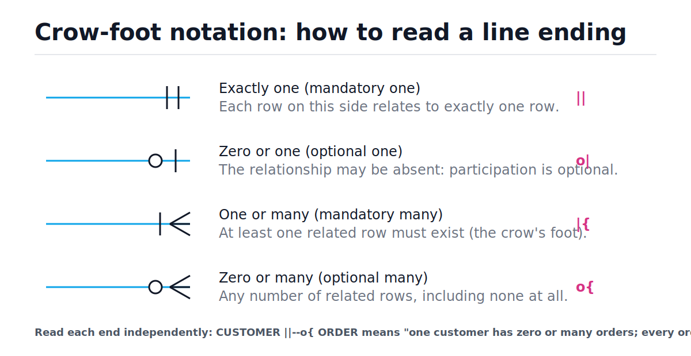
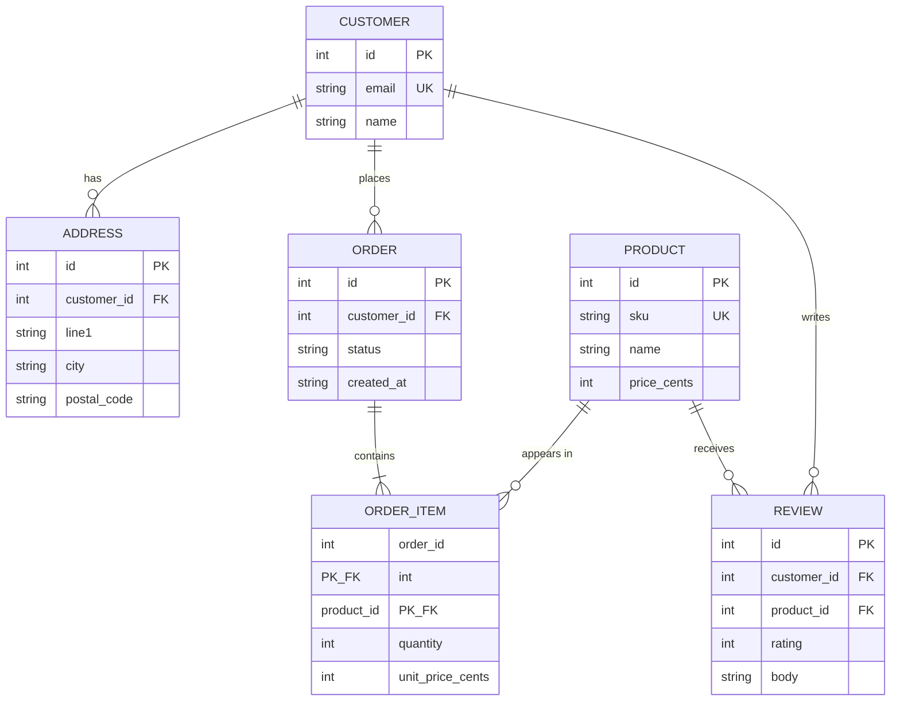
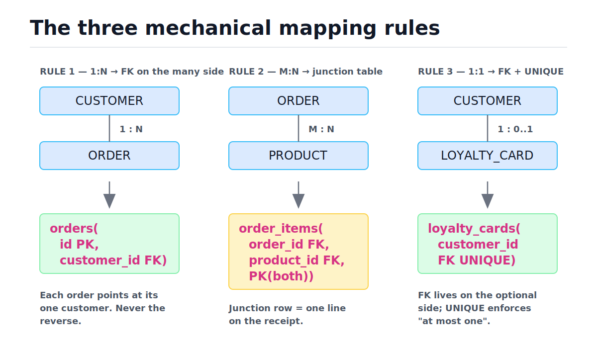

# ER Modeling and Schema Design

[toc]

> **TL;DR:** ER modeling turns fuzzy requirements ("customers place orders for products") into a precise diagram of entities, attributes, relationships, cardinalities, and participation constraints. From that diagram, a small set of mechanical rules produces the table schema: entity → table, 1:N → foreign key on the many side, M:N → junction table, 1:1 → FK + UNIQUE. The judgment calls — attribute vs. entity, weak entities, multivalued attributes — are where modeling skill actually lives.

## Vocabulary

**Entity**

```math
E = \{e_1, e_2, \dots\}
```

A distinguishable thing in the domain that you store rows about: a customer, a product, an order. An entity *type* becomes a table; each entity *instance* becomes a row.

**Attribute**

```math
A : E \rightarrow D
```

A named property of an entity drawn from a domain D — `email`, `unit_price`, `created_at`. Attributes become columns.

**Relationship**

```math
R \subseteq E_1 \times E_2
```

An association between entity instances: "customer *places* order." Mathematically a subset of the cross product of the participating entity sets.

**Cardinality**

```math
1{:}1,\quad 1{:}N,\quad M{:}N
```

The maximum number of instances on each side of a relationship. One customer places many orders (1:N); one order contains many products and one product appears in many orders (M:N).

**Participation**

```math
\text{min} \in \{0, 1\}
```

The minimum: mandatory (min = 1, "every order MUST have a customer") vs. optional (min = 0, "a customer MAY have zero orders"). Cardinality is the max; participation is the min.

**Primary key**

```math
K \subseteq A \text{ such that } K \text{ uniquely determines the row}
```

The minimal attribute set that identifies each entity instance. Surrogate keys (auto-increment integers) are keys invented by the system; natural keys come from the domain.

**Foreign key**

```math
\text{FK}: R_{\text{child}}.c \rightarrow R_{\text{parent}}.K
```

A column whose values must exist as a primary key in another table. The physical implementation of a relationship.

**Weak entity**

An entity that cannot be identified without its owner — an order *item* means nothing without its order. Its key includes the owner's key.

**Junction table**

The table that implements an M:N relationship by holding one FK to each side; also called associative or bridge table.

## Intuition

Think of ER modeling as drawing the nouns and verbs of the business before touching SQL. Nouns that have identity and their own life cycle become entities (boxes). Verbs connecting nouns become relationships (lines). Adjectives become attributes. The line *endings* carry the constraints — and that is what crow-foot notation encodes. Read the figure below left to right: each symbol at the end of a line answers two questions, "how many at most?" and "is zero allowed?"



> [!IMPORTANT]
> Always read *both* ends of the line, and read each end as a statement about the *opposite* entity. `CUSTOMER ||--o{ ORDER` says: one order has exactly one customer (the `||` end), and one customer has zero or many orders (the `o{` end).

## How it works

The pipeline is: requirements → entities and attributes → relationships with cardinality and participation → ER diagram → mechanical mapping to tables → DDL. The first half is judgment; the second half is nearly algorithmic. We will model a real e-commerce domain end to end.

### Step 1 — extract entities and relationships from requirements

Read the requirements and underline nouns and verbs. "Customers have one or more shipping addresses. Customers place orders. An order contains one or more products, each with a quantity and the price at time of purchase. Customers may review products they bought." Nouns with identity: customer, address, product, order, review. The order–product link carries its own data (quantity, price), which is the classic signal of an M:N relationship that needs a junction entity.

| Step | Requirement phrase | Decision |
| :--- | :--- | :--- |
| 1 | "Customers have shipping addresses" | `CUSTOMER` 1:N `ADDRESS` — address graduates to an entity (a customer has several) |
| 2 | "Customers place orders" | `CUSTOMER` 1:N `ORDER`, mandatory on the order side |
| 3 | "An order contains products with quantity and price" | M:N with attributes → junction entity `ORDER_ITEM` |
| 4 | "Price at time of purchase" | `unit_price` is copied onto `ORDER_ITEM`, not read live from `PRODUCT` |
| 5 | "Customers may review products" | `REVIEW` linked to both `CUSTOMER` and `PRODUCT`; optional participation |

### Step 2 — draw the ER diagram

With entities and cardinalities decided, the diagram is just notation. Mermaid's `erDiagram` uses crow-foot symbols directly: `||` exactly one, `o|` zero or one, `|{` one or many, `o{` zero or many. Here is the full e-commerce domain.



Note `ORDER ||--|{ ORDER_ITEM`: mandatory many — an order with zero items is not a valid order. That is a participation constraint, and it is one the database cannot fully enforce with FKs alone (more under Pitfalls).

### Step 3 — the mechanical mapping rules

Once the diagram is stable, conversion to tables is rule-driven. The figure shows the three core rules side by side; the table below adds the special cases.



| ER construct | Table mapping |
| :--- | :--- |
| Entity | One table; attributes → columns; choose PK (usually surrogate) |
| 1:N relationship | FK column on the **many** side, pointing at the one side |
| M:N relationship | Junction table with an FK to each side; PK = composite of both FKs, or a surrogate if the pair can repeat |
| 1:1 relationship | FK + `UNIQUE` on the **optional** side (the side that can be absent) |
| Weak entity | Child table whose PK includes the owner's FK; `ON DELETE CASCADE` |
| Multivalued attribute | Child table: `(owner_id FK, value)` with a composite PK or UNIQUE |
| Relationship attributes | Columns on the junction table (`quantity`, `unit_price_cents`) |

> [!TIP]
> For the 1:1 rule, put the FK on the side that is optional or rarer. Customer ↔ loyalty card: most customers lack a card, so `loyalty_cards.customer_id FK UNIQUE` keeps the common `customers` table free of NULLs.

> [!NOTE]
> Composite PK vs. surrogate on a junction table: use the composite `(order_id, product_id)` when the pair is genuinely unique — it doubles as the duplicate guard. Add a surrogate `id` only when the same pair can legitimately appear twice (e.g., two discount lines for the same product) or when an ORM or child table needs a single-column reference.

### Step 4 — weak entities and multivalued attributes

`ORDER_ITEM` is a weak entity: its identity is "line 2 of order 17," meaningless without the order. Its PK therefore embeds the owner's key, and deleting the order should cascade to its items. A multivalued attribute — say a product having several tags — is the same shape in miniature: you cannot store a list in one column (that breaks first normal form, see [Normalization](./04-normalization.md)), so it becomes a two-column child table.

```sql
CREATE TABLE product_tags (
  product_id INTEGER NOT NULL REFERENCES products(id) ON DELETE CASCADE,
  tag        TEXT    NOT NULL,
  PRIMARY KEY (product_id, tag)
);
```

### Step 5 — the attribute-vs-entity judgment call

The most common design fork: is *address* a column or a table? The test is multiplicity and identity. If a customer has exactly one address and you never reference an address independently, columns on `customers` are fine. The moment the requirement says "one or more shipping addresses," or you need to reference one address from an order ("ship order 42 to address 7"), address graduates to its own entity with its own key. The same test applies to phone numbers, emails, payment methods, and statuses-with-history.

> [!WARNING]
> Promoting too early is also a cost. A one-row-per-customer `customer_profiles` table that nothing else references just adds a join to every query. Promote when multiplicity (more than one per owner) or shared identity (other tables point at it) actually appears in the requirements.

## Complexity

ER modeling is design, not an algorithm, but the schema you choose dictates query cost. The mapping rules trade write-time constraint checks against read-time joins. Assume B-tree indexes on every PK and FK (see [Indexes and Query Performance](./05-indexes-and-query-performance.md)).

| Operation | Best | Average | Worst | Space |
| :--- | :---: | :---: | :---: | :---: |
| FK existence check on insert (indexed parent PK) | O(1) | O(log n) | O(log n) | O(n) index |
| 1:N join, indexed FK (one customer → k orders) | O(log n + k) | O(log n + k) | O(n) no index | — |
| M:N traversal via junction (order → its items → products) | O(log n + k log m) | O(log n + k log m) | O(n·m) no indexes | O(j) junction rows |
| UNIQUE enforcement (1:1 FK) | O(1) | O(log n) | O(log n) | O(n) index |
| Cascade delete of weak entities | O(k log j) | O(k log j) | O(j) unindexed FK | — |
| Mapping an ER diagram with E entities, R relationships | O(E + R) | O(E + R) | O(E + R) | O(E + R) |

The key bound is the M:N traversal. Resolving one order's products touches the junction index once for the order, then one product lookup per item:

```math
T(\text{order} \rightarrow \text{products}) = \underbrace{O(\log j)}_{\text{find first item}} + \underbrace{k}_{\text{scan }k\text{ items}} \cdot \underbrace{O(\log m)}_{\text{lookup each product}} = O(\log j + k \log m)
```

Why: the junction table's composite PK `(order_id, product_id)` is a B-tree keyed by order first, so all k items of one order are physically adjacent — one descent plus a short range scan. Each item then costs one B-tree descent into `products`. Without the junction PK index, the same query degrades to a full scan of all j junction rows, which is why "junction table with composite PK on both FKs" is non-negotiable.

## In production

On disk, every table from the mapping is a collection of fixed-size pages (8 KB in PostgreSQL, 4 KB default in SQLite). The junction-table layout is cache-friendly precisely because the composite key clusters one order's items into one or two pages. The real production hazards are constraint-related, not layout-related:

- **Unindexed FKs.** PostgreSQL indexes PKs automatically but *not* FK columns. Every `ON DELETE CASCADE` from `orders` then sequentially scans `order_items`, and a bulk delete takes table locks for seconds. Always index FK columns on the many side.
- **FK checks off.** SQLite ships with `PRAGMA foreign_keys = OFF` per connection for historical compatibility. Forget the pragma and your beautiful schema enforces nothing.
- **"Mandatory many" is unenforceable by FK.** The diagram says an order has ≥ 1 items, but SQL FKs only constrain the child. Real systems enforce it in the transaction that creates the order, or with a deferred trigger.
- **Schema evolution.** The model will change; design for migration. Surrogate keys make renames and merges survivable; natural composite keys ripple through every referencing table.

> [!CAUTION]
> Adding a `NOT NULL` FK column or rewriting a junction table on a large production table can take an `ACCESS EXCLUSIVE` lock and block all traffic. Use additive, multi-step migrations: add nullable column → backfill in batches → add the constraint with `NOT VALID` then `VALIDATE CONSTRAINT` (PostgreSQL).

## Real-world example

Here is the complete e-commerce schema produced by the mapping rules, executed in SQLite with FK enforcement on. It demonstrates the 1:N FK, the junction table with composite PK and relationship attributes, the weak-entity cascade, and a deliberate constraint violation. Runs on Python 3.9's bundled `sqlite3`.

```python
import sqlite3

conn = sqlite3.connect(":memory:")
conn.execute("PRAGMA foreign_keys = ON")  # off by default in SQLite!

conn.executescript("""
CREATE TABLE customers (
  id    INTEGER PRIMARY KEY,
  email TEXT NOT NULL UNIQUE,
  name  TEXT NOT NULL
);
CREATE TABLE addresses (                          -- 1:N, FK on many side
  id          INTEGER PRIMARY KEY,
  customer_id INTEGER NOT NULL REFERENCES customers(id) ON DELETE CASCADE,
  line1       TEXT NOT NULL,
  city        TEXT NOT NULL,
  postal_code TEXT NOT NULL
);
CREATE TABLE products (
  id          INTEGER PRIMARY KEY,
  sku         TEXT NOT NULL UNIQUE,
  name        TEXT NOT NULL,
  price_cents INTEGER NOT NULL CHECK (price_cents >= 0)
);
CREATE TABLE orders (
  id          INTEGER PRIMARY KEY,
  customer_id INTEGER NOT NULL REFERENCES customers(id),
  status      TEXT NOT NULL DEFAULT 'pending',
  created_at  TEXT NOT NULL DEFAULT (datetime('now'))
);
CREATE TABLE order_items (                        -- M:N junction, weak entity
  order_id         INTEGER NOT NULL REFERENCES orders(id) ON DELETE CASCADE,
  product_id       INTEGER NOT NULL REFERENCES products(id),
  quantity         INTEGER NOT NULL CHECK (quantity > 0),
  unit_price_cents INTEGER NOT NULL,              -- price AT purchase time
  PRIMARY KEY (order_id, product_id)
);
CREATE INDEX idx_order_items_product ON order_items(product_id);
CREATE TABLE reviews (
  id          INTEGER PRIMARY KEY,
  customer_id INTEGER NOT NULL REFERENCES customers(id),
  product_id  INTEGER NOT NULL REFERENCES products(id),
  rating      INTEGER NOT NULL CHECK (rating BETWEEN 1 AND 5),
  body        TEXT,
  UNIQUE (customer_id, product_id)                -- one review per pair
);
""")

conn.execute("INSERT INTO customers (id, email, name) VALUES (1, 'ada@example.com', 'Ada')")
conn.execute("INSERT INTO products VALUES (1, 'SKU-1', 'Keyboard', 9900), (2, 'SKU-2', 'Mouse', 2500)")
conn.execute("INSERT INTO orders (id, customer_id) VALUES (10, 1)")
conn.execute("INSERT INTO order_items VALUES (10, 1, 1, 9900), (10, 2, 2, 2500)")

# M:N traversal: order -> items -> products, O(log j + k log m)
rows = conn.execute("""
  SELECT p.name, oi.quantity, oi.unit_price_cents
  FROM order_items oi JOIN products p ON p.id = oi.product_id
  WHERE oi.order_id = 10 ORDER BY p.id
""").fetchall()
assert rows == [("Keyboard", 1, 9900), ("Mouse", 2, 2500)]

# FK violation: order for a customer that does not exist
try:
    conn.execute("INSERT INTO orders (id, customer_id) VALUES (11, 999)")
    raise AssertionError("FK should have rejected this")
except sqlite3.IntegrityError as e:
    assert "FOREIGN KEY" in str(e).upper()

# Composite PK rejects a duplicate (order, product) pair
try:
    conn.execute("INSERT INTO order_items VALUES (10, 1, 5, 9900)")
    raise AssertionError("composite PK should have rejected this")
except sqlite3.IntegrityError:
    pass

# Weak-entity cascade: deleting the order removes its items
conn.execute("DELETE FROM orders WHERE id = 10")
remaining = conn.execute("SELECT COUNT(*) FROM order_items").fetchone()[0]
assert remaining == 0
print("all schema constraints verified")
```

This dialect is plain SQLite; in PostgreSQL you would use `BIGINT GENERATED ALWAYS AS IDENTITY` for keys, `TIMESTAMPTZ` for `created_at`, and `NUMERIC` or integer cents for money exactly as here.

## When to use / When NOT to use

ER modeling earns its keep whenever the data outlives any single application: shared databases, anything with money or compliance, any domain with more than a handful of related concepts. Skip the ceremony when the structure is trivial or genuinely schemaless.

- **Use it:** multi-entity transactional systems (commerce, bookings, billing); whenever two teams must agree on what "an order" is; before any migration that restructures relationships.
- **Use it lightly:** a two-table internal tool — a five-minute sketch still catches the M:N you missed.
- **Don't bother:** single-table logs and append-only event streams; truly heterogeneous documents (a JSON column or document store fits better); analytics star schemas, which follow different rules — see [OLAP and Dimensional Modeling](./10-olap-and-dimensional-modeling.md).

## Common mistakes

- **"M:N can be modeled with a list column or comma-separated IDs"** — that breaks atomicity, kills indexing, and makes joins impossible. Always a junction table.
- **"The FK goes on the one side"** — backwards. The many side holds the FK; one column per row can reference only one parent.
- **"1:1 means merge the tables"** — sometimes, but not when one side is optional, has different access permissions, or holds rarely-read bulk data. FK + UNIQUE keeps them separable.
- **"Cardinality and participation are the same thing"** — cardinality is the max (one vs. many); participation is the min (optional vs. mandatory). `o{` and `|{` differ exactly there.
- **"Read product price at order time via the FK"** — prices change; an order line must snapshot `unit_price_cents`. Relationship attributes live on the junction table.
- **"Natural keys are cleaner than surrogates"** — emails change, SKUs get recycled, governments reissue IDs. Use a surrogate PK and put a UNIQUE constraint on the natural key.
- **"FKs are enforced by default everywhere"** — SQLite requires `PRAGMA foreign_keys = ON` per connection; MySQL's old MyISAM engine ignored FKs entirely.

## Interview questions and answers

**1. How do you decide whether something is an entity or an attribute?**
**Answer:** I ask two questions: can the owner have more than one of it, and does anything else need to reference it independently? If either is yes, it's an entity with its own table and key. A customer's single email is an attribute; their multiple shipping addresses, referenced by orders, are an entity.

**2. How do you implement a many-to-many relationship, and what's the primary key of that table?**
**Answer:** A junction table with a foreign key to each side. The PK is usually the composite of both FKs, which also prevents duplicate pairs for free. I'd switch to a surrogate id only if the same pair can legitimately repeat or something downstream needs a single-column reference — and then I'd still index both FKs.

**3. For a 1:1 relationship, which table gets the foreign key?**
**Answer:** The optional or rarer side, with a UNIQUE constraint on the FK. If most customers have no loyalty card, the card table carries `customer_id FK UNIQUE`. That keeps the main table NULL-free and makes "at most one" a database-enforced invariant, not an application convention.

**4. What's a weak entity and how does it map to SQL?**
**Answer:** An entity that has no identity apart from its owner — an order item only means something inside its order. It maps to a child table whose primary key includes the owner's foreign key, usually with ON DELETE CASCADE so the parts die with the whole.

**5. The diagram says every order must have at least one item. Can a foreign key enforce that?**
**Answer:** No — FKs constrain the child toward the parent, not the parent toward having children. I enforce mandatory-many participation in the transaction that creates the order, inserting the order and its items together, or with a deferred constraint trigger in PostgreSQL.

**6. Why store unit_price on order_items when products already has a price?**
**Answer:** Because the relationship has its own facts. The price at purchase time is a property of that order-product pairing, not of the product. If I read it live through the FK, every price change silently rewrites history on past orders and invoices.

**7. Surrogate vs. natural keys — what's your default and why?**
**Answer:** Surrogate PK plus a UNIQUE constraint on the natural key. Natural keys change — emails, usernames, even SKUs — and a changing PK ripples through every referencing FK. The surrogate gives stable joins; the UNIQUE constraint still guarantees the business rule.

**8. How would you store a product's tags?**
**Answer:** A multivalued attribute becomes a child table — `product_tags(product_id FK, tag)` with a composite PK. A comma-separated column can't be indexed per tag, can't be constrained, and forces string parsing in every query. If tags themselves carry data, they graduate to a `tags` entity plus a junction table.

**9. How do you read CUSTOMER ||--o{ ORDER in crow-foot notation?**
**Answer:** Read each end as a statement about the other entity. The double bar end says every order has exactly one customer — mandatory one. The circle-plus-crow's-foot end says a customer has zero or many orders. So: cardinality 1:N, mandatory on the order side, optional on the customer side.

## Practice path

1. Take three real requirements paragraphs (a library, a gym, a ride-share) and underline nouns and verbs; list entities, relationships, cardinalities, and participation for each.
2. Draw each as a mermaid `erDiagram`, getting every crow-foot symbol right from the legend figure.
3. Apply the mapping rules by hand to produce DDL, then run it in `sqlite3 :memory:` with `PRAGMA foreign_keys = ON`.
4. Deliberately violate each constraint (orphan FK, duplicate junction pair, bad CHECK) and confirm the error.
5. Add a multivalued attribute and a weak entity to one model; verify the cascade delete.
6. Take an existing schema you use at work and reverse-engineer the ER diagram from its FKs; find one cardinality the schema fails to enforce.
7. Write a three-step additive migration (add nullable column → backfill → constrain) for promoting an attribute to an entity.

## Copyable takeaways

- Nouns with identity → entities; verbs → relationships; adjectives → attributes.
- Cardinality is the max (1:1, 1:N, M:N); participation is the min (optional vs. mandatory). Read both ends of every crow-foot line.
- Mapping is mechanical: entity → table; 1:N → FK on the many side; M:N → junction table with composite PK on both FKs; 1:1 → FK + UNIQUE on the optional side.
- Weak entities embed the owner's key and cascade on delete; multivalued attributes become child tables.
- Relationship attributes (quantity, price-at-purchase) live on the junction table — snapshot, don't dereference.
- Default to surrogate PKs with UNIQUE on the natural key; index every FK column.
- SQLite needs `PRAGMA foreign_keys = ON` per connection; "mandatory many" needs application-level or trigger enforcement.
- Junction traversal is O(log j + k log m) with the composite PK index — and O(j) without it.

## Sources

- Chen, P. "The Entity-Relationship Model — Toward a Unified View of Data." ACM TODS, 1976.
- SQLite documentation, "SQLite Foreign Key Support" — https://www.sqlite.org/foreignkeys.html
- PostgreSQL documentation, "Constraints" — https://www.postgresql.org/docs/current/ddl-constraints.html
- Kleppmann, M. *Designing Data-Intensive Applications*, Ch. 2 (Data Models and Query Languages).
- Mermaid documentation, "Entity Relationship Diagrams" — https://mermaid.js.org/syntax/entityRelationshipDiagram.html

## Related

- [The Relational Model](./01-the-relational-model.md)
- [SQL Fundamentals](./02-sql-fundamentals.md)
- [Normalization](./04-normalization.md)
- [Indexes and Query Performance](./05-indexes-and-query-performance.md)
- [Relational Data Modeling Patterns](./09-relational-data-modeling-patterns.md)
- [Database Scaling: Replication and Sharding](../System-Design/06-database-scaling-replication-and-sharding.md)
